#### 基本概念

图$\mathbf{G}=(V, E)$ 由下列要素构成：一组节点$V=1,…,n$; 一组边$E⊆V×V$; 边$(i,j) ∈ E$连接了节点$i$和$j$; $i$和$j$被称为相邻节点; 节点的度是指相邻节点的数量.
如果一个图的所有节点都有$n-1$个相邻节点，则该图是完备的。也就是说所有节点都具备所有可能的连接方式。
从$i$到$j$的路径是指从$i$到达$j$的边的序列。该路径的长度等于所经过的边的数量。
图的直径是指连接任意两个节点的所有最短路径中最长路径的长度。
测地路径是指两个节点之间的最短路径。
如果所有节点都可通过某个路径连接到彼此，则它们构成一个连通分支。如果一个图仅有一个连通分支，则该图是连通的。
如果一个图的边是有顺序的配对，则该图是有向的。$i$的入度是指向$i$的边的数量，出度是远离$i$的边的数量。
如果一个图的边是有顺序的配对，则该图是有向的。$i$的入度是指向$i$的边的数量，出度是远离$i$的边的数量。

子图（Subgraph）是一张图的一部分。当我们需要对图中的特定节点，特定关系，或者特定标签或者属性进行特定分析时，子图就会很有用。

路径（Path）是一组节点及他们的关系的集合。以上图为例，“Dan” 开过型号为 “Volvo V70” 的车，这辆车是属于 “Ann” 的。那么节点 “Dan” “Ann” “Car”和关系 “Drives” “Owns” 组成了一个简单的路径。

连通图（Connected Graphs）指图内任意两个节点间，总能找到一条路径连接它们，否则，为非连通图（Disconnected Graphs）。也就是说，如果图中包含岛（Island）,则是非连通图。如果岛内的节点都是连通的，这些岛就被成为一个部件（Component，有时也叫 Cluster）。

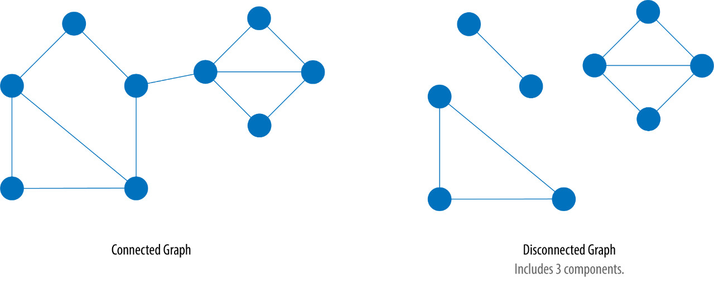

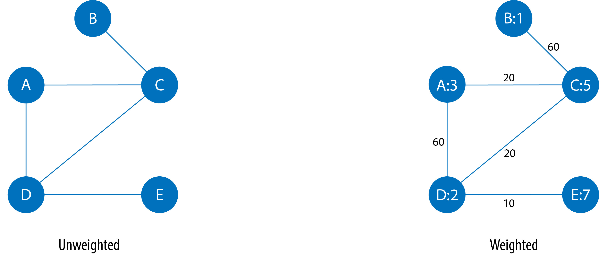

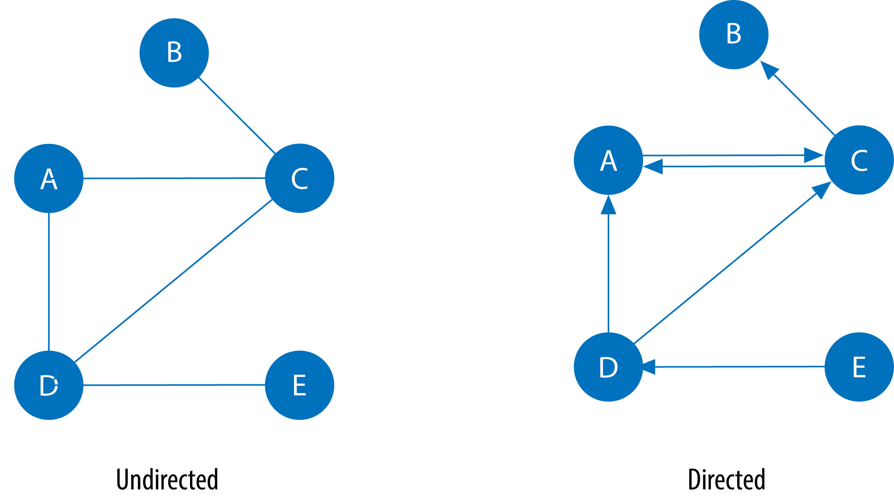

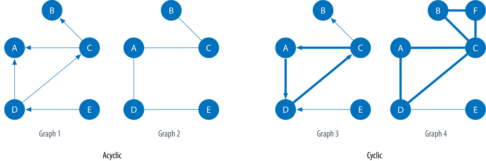


###### 邻接矩阵

目前常用的图存储方式为邻接矩阵，通过所有顶点的二维矩阵来存储两个顶点之间是否相连，或者存储两顶点间的边权重。

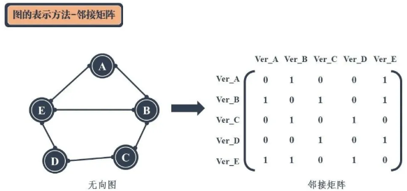

用邻接矩阵可以直接从二维关系中获得任意两个顶点的关系，可直接判断是否相连。但是在对矩阵进行存储时，却需要完整的一个二维数组。若图中顶点数过多，会导致二维数组的大小剧增，从而占用大量的内存空间。而根据实际情况可以分析得，图中的顶点并不是任意两个顶点间都会相连，不是都需要对其边上权重进行存储。那么存储的邻接矩阵实际上会存在大量的0。虽然可以通过稀疏表示等方式对稀疏性高的矩阵进行关键信息的存储，但是却增加了图存储的复杂性。因此，为了解决上述问题，一种可以只存储相连顶点关系的邻接表应运而生。

###### 邻接表

在邻接表中，图的每一个顶点都是一个链表的头节点，其后连接着该顶点能够直接达到的相邻顶点。相较于无向图，有向图的情况更为复杂，因此这里采用有向图进行实例分析。

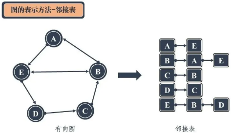


###### 逆连接表

逆邻接表与邻接表结构类似，只不过图的顶点链接着能够到达该顶点的相邻顶点。也就是说，邻接表时顺着图中的箭头寻找相邻顶点，而逆邻接表时逆着图中的箭头寻找相邻顶点。

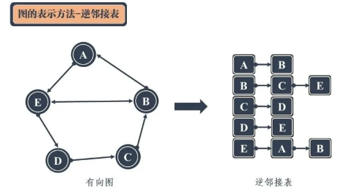

邻接表和逆邻接表的共同使用下，就能够把一个完整的有向图结构进行表示。可以发现，邻接表和逆邻接表实际上有一部分数据时重合的，因此可以将两个表合二为一，从而得到了所谓的十字链表。

###### 十字链表

只需要通过相同的顶点分别链向以该顶点为终点和起点的相邻顶点即可。

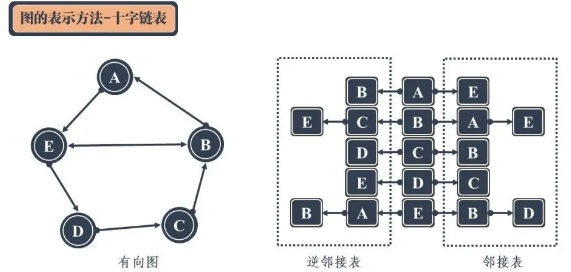


#### 图算法

从图中提取的特征可以大致分为三类：

- 节点属性：我们知道图中的节点代表实体，并且这些实体具有自己的特征属性。我们可以将这些属性用作每个节点的特征；局部结构特点：节点的度，相邻节点的平均度，一个节点与其他节点形成的三角形数。
- 节点嵌入：节点嵌入通过用固定长度向量表示每个节点，在一定程度上解决了这个问题。这些向量能够捕获有关周围节点的信息

目前大多数框架支持的图算法类别主要有三个：

1. 寻路：根据可用性和质量等条件确定最优路径。我们也将搜索算法包含在这一类别中。这可用于确定最快路由或流量路由。
2. 中心性：确定网络中节点的重要性。这可用于识别社交网络中有影响力的人或识别网络中潜在的攻击目标。
3. 社群检测：评估群体聚类的方式。这可用于划分客户或检测欺诈等。

##### 寻路和图搜索算法

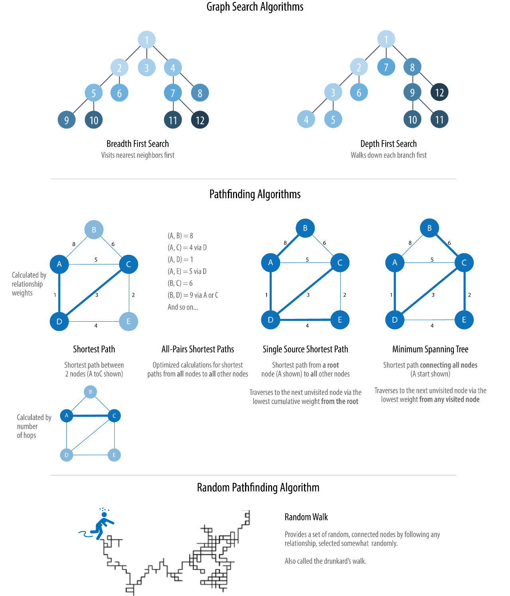

寻路算法是通过最小化跳的数量来寻找两个节点之间的最短路径。
搜索算法不是给出最短路径，而是根据图的相邻情况或深度来探索图。这可用于信息检索。

###### 搜索算法

BFS从选定的节点出发，优先访问所有一度关系的节点之后再继续访问二度关系节点，以此类推。DFS 从选定的节点出发，选择任一邻居之后，尽可能的沿着边遍历下去，知道不能前进之后再回溯。

###### 最短路径

最短路径计算的是一对节点之间的最短的加权路径。 Dijkstra 的算法首先选择与起点相连的最小权重的节点，也就是 “最临近的” 节点，然后比较 起点到第二临近的节点的权重 与 最临近节点的下一个最临近节点的累计权重和 从而决定下一步该如何行走。 

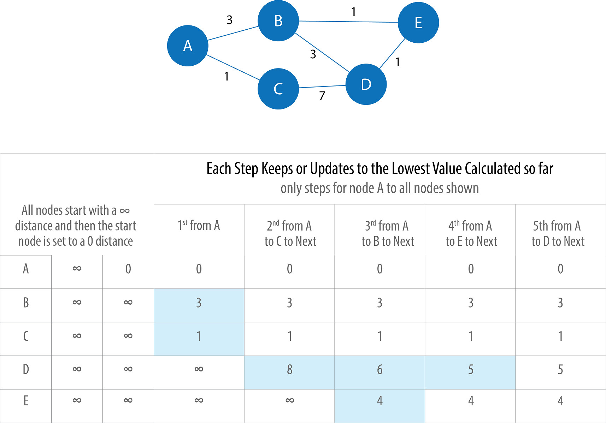

###### 最小权重生成树

最小生成树算法从一个给定的节点开始，查找其所有可到达的节点，以及将节点与最小可能权重连接在一起，行成的一组关系。它以最小的权重从访问过的节点遍历到下一个未访问的节点，避免了循环。

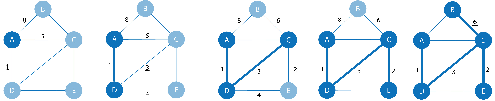

###### Random Walk

 随机游走算法从图上获得一条随机的路径。随机游走算法从一个节点开始，随机沿着一条边正向或者反向寻找到它的邻居，以此类推，直到达到设置的路径长度。 

##### 中心性算法

 中心性算法（Centrality Algorithms）用于识别图中特定节点的角色及其对网络的影响。中心性算法能够帮助我们识别最重要的节点，帮助我们了解组动态，例如可信度、可访问性、事物传播的速度以及组与组之间的连接 

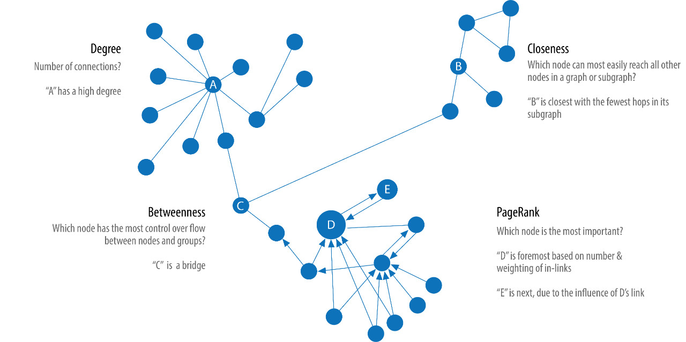

######  Degree Centrality

Degree 统计了一个节点直接相连的边的数量，包括出度和入度。Degree 可以简单理解为一个节点的访问机会的大小。  一个网络的平均度（average degree），是边的数量除以节点的数量。当然，平均度很容易被一些具有极大度的节点 “带跑偏” （skewed）。所以，度的分布（degree distribution）可能是表征网络特征的更好指标。 

###### Closeness Centrality

Closeness Centrality（紧密性中心性）是一种检测能够通过子图有效传播信息的节点的方法。紧密性中心性计量一个节点到所有其他节点的紧密性（距离的倒数），一个拥有高紧密性中心性的节点拥有着到所有其他节点的距离最小值。对于一个节点来说，紧密性中心性是节点到所有其他节点的最小距离和的倒数：$C(u) = \frac{1}{\sum_{v=1}^{n-1}d(u,v)}$.  如果图是一个非连通图，那么我们将无法计算紧密性中心性。那么针对非连通图，调和中心性（Harmonic Centrality）被提了出来$H(u) = \sum_{v=1}^{n-1}\frac{1}{d(u,v)}$. 

 Wasserman and Faust 提出过另一种计算紧密性中心性的公式，专门用于包含多个子图并且子图间不相连接的非连通图： 
$$
C_{wF}(u) = \frac{n-1}{N-1}(\frac{n-1}{\sum_{v=1}^{n-1}d(u,v)})
$$

###### Betweenness Centrality

中介中心性（Betweenness Centrality）是一种检测节点对图中信息或资源流的影响程度的方法。它通常用于寻找连接图的两个部分的桥梁节点。因为很多时候，一个系统最重要的 “齿轮” 不是那些状态最好的，而是一些看似不起眼的 “媒介”，它们掌握着资源或者信息的流动性。

中间中心性算法首先计算连接图中每对节点之间的最短（最小权重和）路径。每个节点都会根据这些通过节点的最短路径的数量得到一个分数。节点所在的路径越短，其得分越高。计算公式：
$$
B(u)=\sum_{s\ne u\ne t}\frac{p(u)}{p}
$$
 其中，p 是节点 s 与 t 之间最短路径的数量，p(u) 是其中经过节点 u 的数量。 

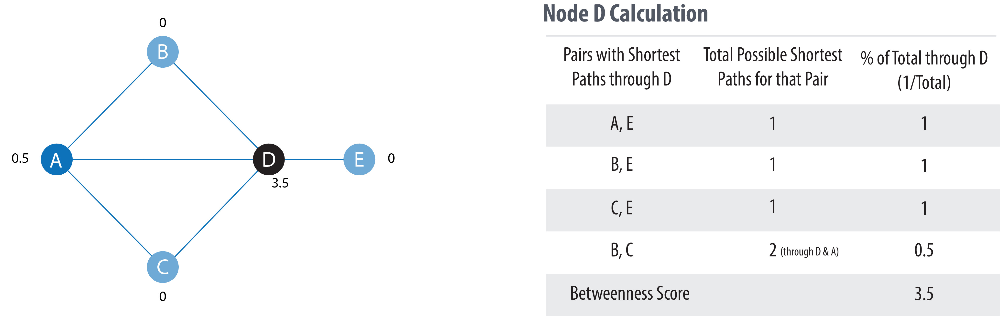

###### PageRank

不同的网页之间相互引用，网页作为节点，引用关系作为边，就可以组成一个网络。被更多网页引用的网页，应该拥有更高的权重；被更高权重引用的网页，也应该拥有更高权重。原始公式：
$$
PR(u) = (1-d) + d\times (\frac{PR(T_1)}{C(T_1)}+\cdots+\frac{PR(T_n)}{C(T_n)})
$$
 其中，$u$是我们想要计算的网页，$T_1$到 $T_n$是引用的网页。$d$被称为阻尼系数，代表一个用户继续点击网页的概率，一般被设置为 0.85，范围 0~1。$C(T)$是节点$T$的出度。  从理解上来说，`PageRank`算法假设一个用户在访问网页时，用户可能随机输入一个网址，也可能通过一些网页的链接访问到别的网页。那么阻尼系数代表用户对当前网页感到无聊，随机选择一个链接访问到新的网页的概率。那么`PageRank`的数值代表这个网页通过其他网页链接过来的可能性。$1-d$代表不通过链接访问，而是随机输入网址访问到网页的概率。 

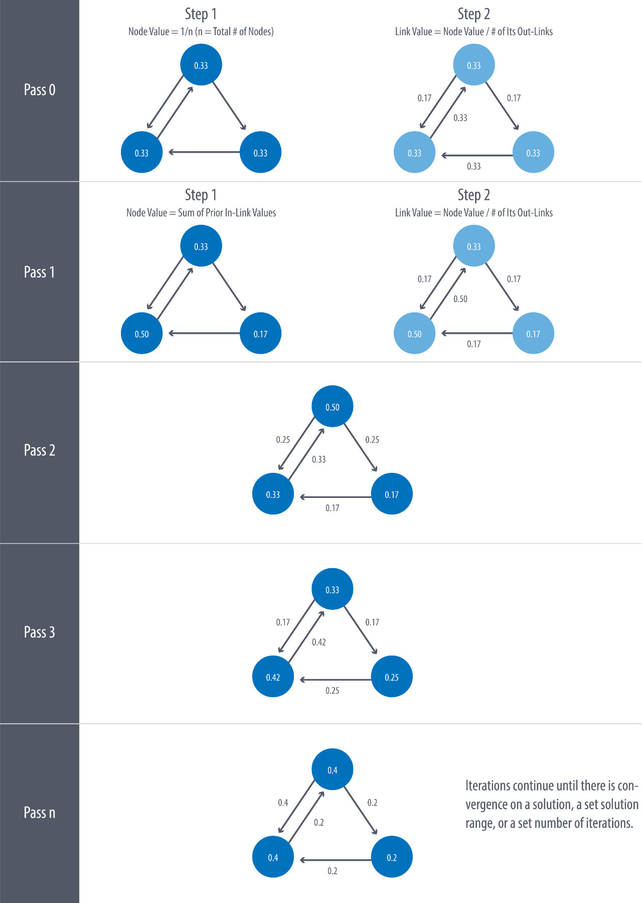

 如果一个节点（或者一组节点），只有边进入，却没有边出去，会怎么样呢？按照上图的迭代，节点会不断抢占 PageRank 分数。这个现象被称为 Rank Sink， 

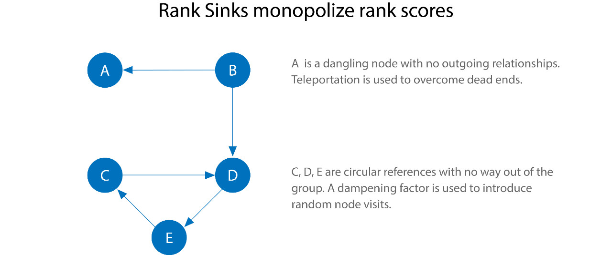

解决 Rank Sink 的方法有两个。第一个，假设这些节点有隐形的边连向了所有的节点，遍历这些隐形的边的过程称为teleportation。第二个，使用阻尼系数，如果我们设置 d 等于 0.85，我们仍然有 0.15 的概率从这些节点再跳跃出去。尽管阻尼系数的建议值为 0.85，我们仍然可以根据实际需要进行修改。调低阻尼系数，意味着访问网页时，更不可能不断点击链接访问下去，而是更多地随机访问别的网页。那么一个网页的PageRank分数会更多地分给他的直接下游网页，而不是下游的下游网页。

PageRank 算法已经不仅限于网页排名。例如：

- who to follow service at twitter：Twitter使用个性化的 PageRank 算法（Personalized PageRank，简称 PPR）向用户推荐他们可能希望关注的其他帐户。该算法通过兴趣和其他的关系连接，为用户展示感兴趣的其他用户；
- 交通流量预测：使用 PageRank 算法计算人们在每条街道上停车或结束行程的可能性；
- 反欺诈：医疗或者保险行业存在异常或者欺诈行为，PageRank 可以作为后续机器学习算法的输入。

##### 社群发现算法

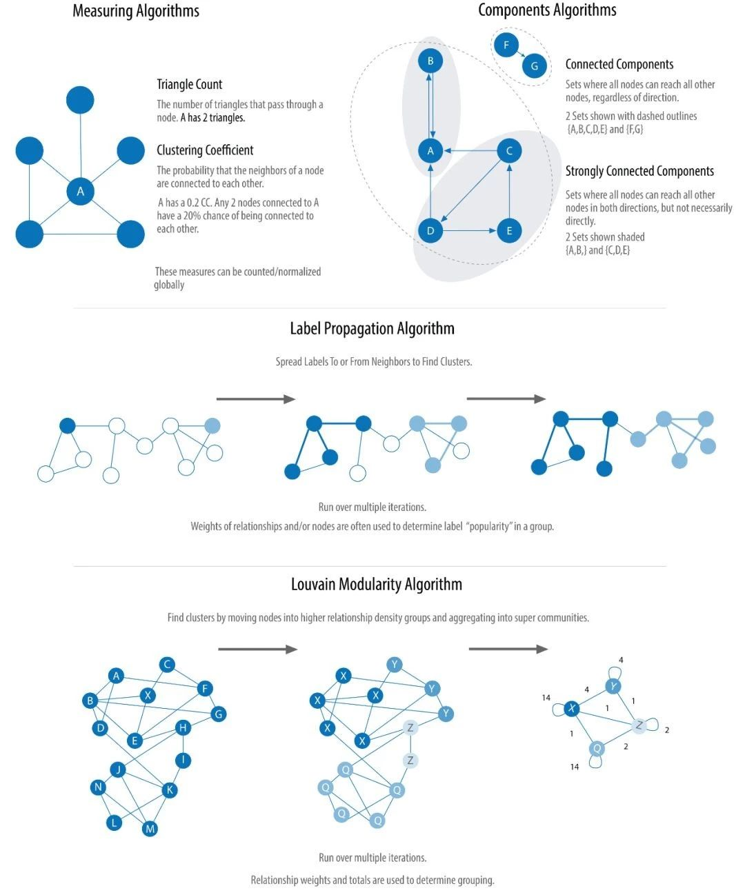

###### Measuring Algorithm

 三角计数计算图中由节点组成的三角形的数量，要求任意两个节点间有边连接。聚类系数算法的目标是测量一个组的聚类紧密程度。该算法计算网络中三角形的数量，与可能的关系的比率。聚类系数为1表示这个组内任意两个节点之间有边相连。  有两种聚类系数：局部聚类系数和全局聚类系数。  局部聚类系数计算一个节点的邻居之间的紧密程度，计算时需要三角计数。计算公式： 
$$
CC(u) = \frac{2R_u}{k_u(k_u-1)}
$$
 其中，$u$代表我们需要计算聚类系数的节点，$R(u)$代表经过节点$u$和它的邻居的三角形个数，$k(u)$代表节点$u$的度。 

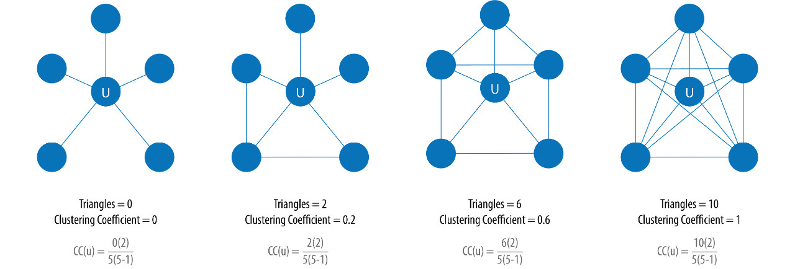

全局聚类系数是局部聚类系数的归一化求和。 

###### Components Algorithm

强关联部件（Strongly Connected Components，简称 SCC）算法寻找有向图内的一组一组节点，每组节点可以通过关系 互相 访问。在 “Community Detection Algorithms” 的图中，我们可以发现，每组节点内部不需要直接相连，只要通过路径访问即可。

关联部件（Connected Components）算法，不同于 SCC，组内的节点对只需通过一个方向访问即可。

###### Label Propagation Algorithm

标签传播算法是一个在图中快速发现社群的算法。在 LPA 算法中，节点的标签完全由它的直接邻居决定。算法非常适合于半监督学习，你可以使用已有标签的节点来种子化传播进程。我们可以很形象地理解算法的传播过程，当标签在紧密联系的区域，传播非常快，但到了稀疏连接的区域，传播速度就会下降。当出现一个节点属于多个社群时，算法会使用该节点邻居的标签与权重，决定最终的标签。传播结束后，拥有同样标签的节点被视为在同一群组中。

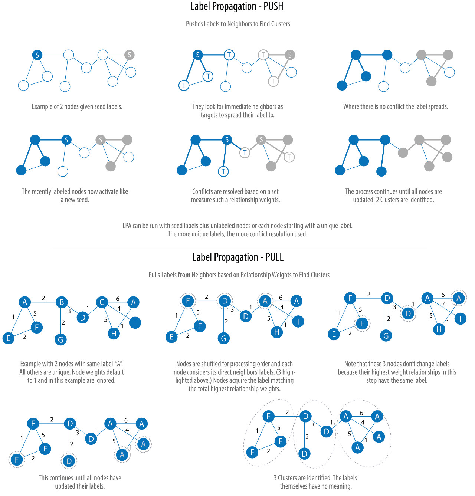

###### Louvain Modularity Algorithm

 Louvain Modularity 算法在给节点分配社群是，会比较社群的密度，而不仅仅是比较节点与社群的紧密程度。算法通过查看节点与社群内关系的密度与平均关系密度的比较，来量化地决定一个节点是否属于社群。算法不但可以发现社群，更可以给出不同尺度不同规模的社群层次，对于理解不同粒度界别的网络结构有极大的帮助。 

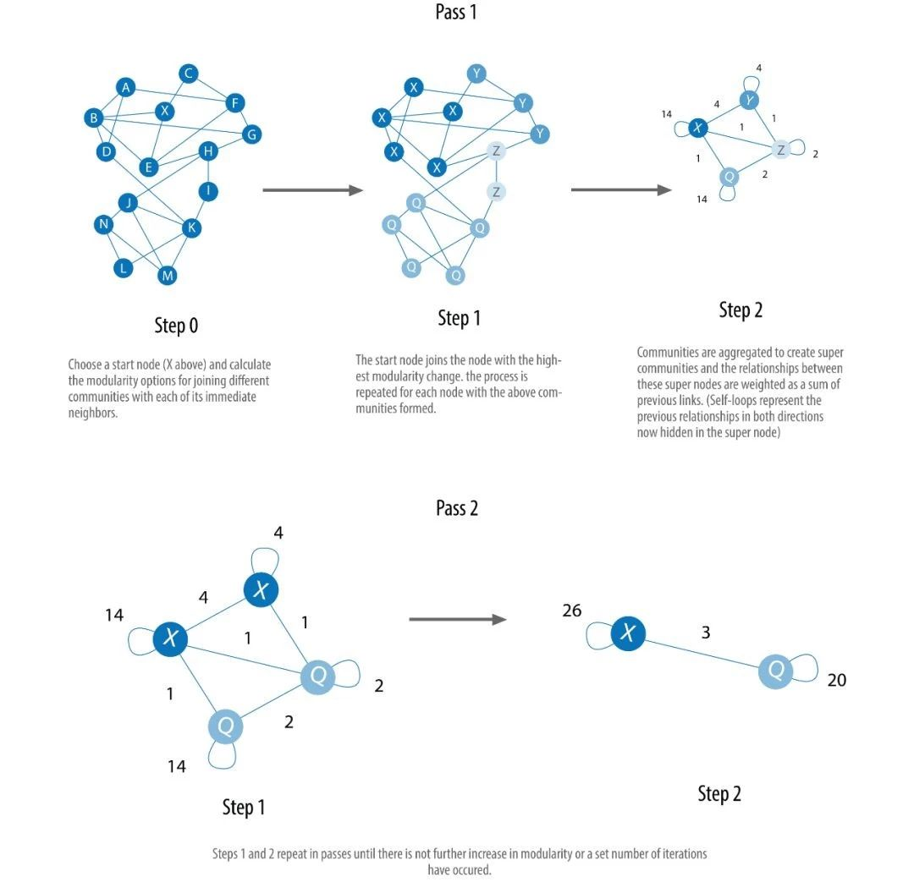


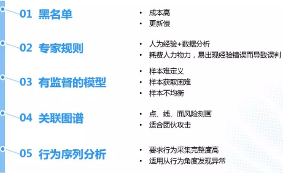

 贝壳风控的关系图谱经历了事实图谱 -> 推理图谱 -> 图谱融合三个阶段的演进。事实图谱涵盖了贝壳找房所有线上的动作和行为，形成了10亿级节点，100亿级边的巨大图谱；推理图谱构建在事实图谱基础上，利用不同节点间的关系，分别构建行为图谱，社交图谱，作业图谱和工商图谱，这也是贝壳风控目前所处的阶段；而未来的图谱融合阶段，会利用ID打通，完成多个推理图谱的关系融合，进而完成人与人之间亲密度的定性或定量的表达，从而实现深层次的风险控制。 

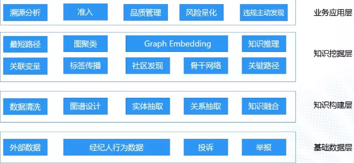

 贝壳关系图谱的整体架构主要包括四层：基础数据层负责收集各种来源的行为和属性数据；知识构建层通过多种手段抽取实体和关系，完成构图；知识挖掘层会结合传统的最短路径/关键路径方法，以及社区发现，标签传播和Graph Embedding等机器学习方法，进一步挖掘节点之间的关系；业务应用层基于关联图谱提供了溯源分析，风险量化，违规行为主动发现等业务能力。 

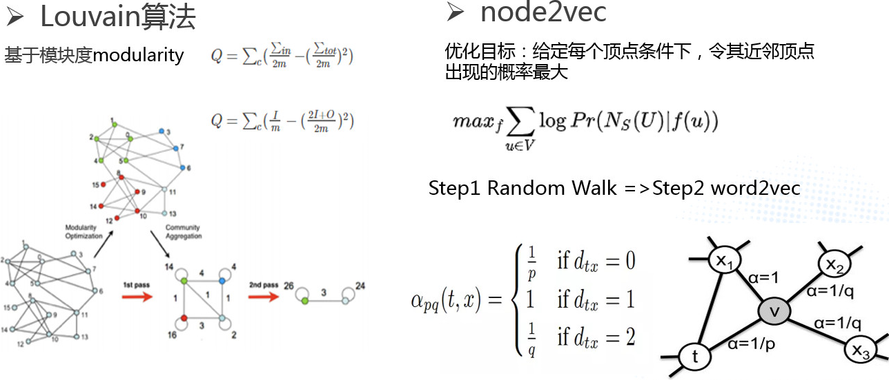

Louvain是一种经典的基于图的社区发现算法，其优化目标为尽可能提升图的模块度（衡量社区紧密度的标准），模块度提升的定义如下：
$$
\Delta Q = [\frac{k_{i,in}}{2m}-\frac{\sum_{tot}k_i}{2m^2}]
$$
其中前面一项为节点加入邻居社区后，社区内的所有边，后一项代表节点加入邻居社区后，社区所有边（包括内部边，以及连接外部的边），目的是希望变化后的子社区内边多，外边少，即社区更聚集。

Louvain是一种迭代式算法，每一轮迭代可以分成两个步骤：

1. 算法扫描图中的所有节点，针对每个节点遍历该节点的所有邻居节点，衡量把该节点加入其邻居节点所在的社区所带来的模块度的提升，并选择对应最大收益的邻居节点，加入其所在的社区，这一过程化重复进行直到每一个节点的社区归属都不再发生变化；

2. 对1中形成的社区进行折叠，把每个社区折叠成一个单点，此时新生成的节点之间的边的权重为两个结点内所有原始节点的边权重之和。重复以上两步，多轮迭代直至算法收敛，则可以发现图上的多个社区。


##### Graph Embedding

Graph Embedding 技术将图中的节点以低维稠密向量的形式进行表达，要求在原始图中相似 ( 不同的方法对相似的定义不同 ) 的节点其在低维表达空间也接近。得到的表达向量可以用来进行下游任务，如节点分类，链接预测，可视化或重构原始图等。

###### deep walk

DeepWalk 算法主要包括两个步骤，第一步为随机游走采样节点序列，第二步为使用 skip-gram modelword2vec 学习表达向量。

- 构建同构网络，从网络中的每个节点开始分别进行 Random Walk 采样，得到局部相关联的训练数据
- 对采样数据进行 SkipGram 训练，将离散的网络节点表示成向量化，最大化节点共现，使用 Hierarchical Softmax 来做超大规模分类的分类器


###### LINE

###### nodo2vec


### Flink

#### 基于 Flink 和规则引擎的实时风控解决方案 

##### 总体框架

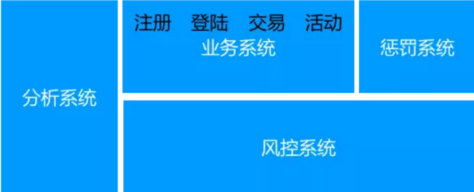

业务系统，通常是 APP + 后台 或者 web，是互联网业务的载体，风险从业务系统触发；
风控系统，为业务系统提供支持，根据业务系统传来的数据或埋点信息来判断当前用户或事件有无风险；
惩罚系统，业务系统根据风控系统的结果来调用，对有风险的用户或事件进行控制或惩罚，比如增加验证码、限制登陆、禁止下单等等；
分析系统，该系统用以支持风控系统，根据数据来衡量风控系统的表现，比如某策略拦截率突然降低，那可能意味着该策略已经失效，又比如活动商品被抢完的时间突然变短，这表明总体活动策略可能有问题等等，该系统也应支持运营/分析人员发现新策略；

##### 风控系统

 风控系统有规则和模型两种技术路线，规则的优点是简单直观、可解释性强、灵活，所以长期活跃在风控系统之中，但缺点是容易被攻破，于是在实际的风控系统中，往往需要再结合上基于模型的风控环节来增加健壮性。在此只讨论一种基于规则的风控系统架构，当然如果有模型风控的诉求，该架构也完全支持。 

规则其实包括三个部分：

- **事实**，即被判断的主体和属性，如上面规则的账号及登陆次数、IP 和注册次数等；
- **条件**，判断的逻辑，如某事实的某属性大于某个指标；
- **指标阈值**，判断的依据，比如登陆次数的临界阈值，注册账号数的临界阈值等；

 基于上边的讨论，我们设计一个风控系统方案如下： 

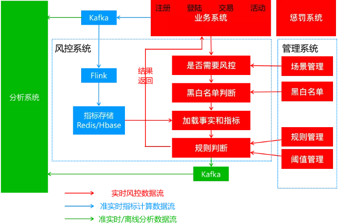

该系统有三条数据流向：实时风控数据流，由红线标识，同步调用，为风控调用的核心链路；准实时指标数据流，由蓝线标识，异步写入，为实时风控部分准备指标数据；准实时/离线分析数据流，由绿线标识，异步写入，为风控系统的表现分析提供数据

###### 实时风控

实时风控是整个系统的核心，被业务系统同步调用，完成对应的风控判断。前面提到规则往往由人编写并且需要动态调整，所以我们会把风控判断部分与规则管理部分拆开。规则管理后台为运营服务，由运营人员去进行相关操作：场景管理，决定某个场景是否实施风控；黑白名单，人工/程序找到系统的黑白名单，直接过滤；规则管理，管理规则，包括增删或修改；阈值管理，管理指标的阈值；

讲完管理后台，那规则判断部分的逻辑也就十分清晰了，分别包括前置过滤、事实数据准备、规则判断三个环节。
前置过滤：业务系统在特定事件（如注册、登陆、下单、参加活动等）被触发后同步调用风控系统，附带相关上下文，比如 IP 地址，事件标识等，规则判断部分会根据管理后台的配置决定是否进行判断，如果是，接着进行黑白名单过滤，都通过后进入下一个环节。
实时数据准备：在进行判断之前，系统必须要准备一些事实数据；
规则判断：在得到事实数据之后，系统会根据规则和阈值进行判断，然后返回结果，整个过程便结束了。整个过程逻辑上是清晰的，我们常说的规则引擎主要在这部分起作用，一般来说这个过程有两种实现方式：借助成熟的规则引擎；基于 Groovy 等动态语言自己完成；

###### 准实时数据流

把数据准备与逻辑判断拆分，是出于系统的性能/可扩展性的角度考虑的。前边提到，做规则判断需要事实的相关指标，比如最近一小时登陆次数，最近一小时注册账号数等等，这些指标通常有一段时间跨度，是某种状态或聚合，很难在实时风控过程中根据原始数据进行计算，因为风控的规则引擎往往是无状态的，不会记录前面的结果。同时，这部分原始数据量很大，因为用户活动的原始数据都要传过来进行计算，所以这部分往往由一个流式大数据系统来完成。这部分数据流非常简单：业务系统把埋点数据发送到 Kafka；Flink 订阅 Kafka，完成原子粒度的聚合； Flink 把汇总的指标结果写入 Redis 或 Hbase，供实时风控系统查询。两者问题都不大，根据场景选择即可。 

##### 分析系统

如果从动态的角度来看一个风控系统的话，我们至少还需要两部分，一是衡量系统的整体效果，一是为系统提供规则/逻辑升级的依据。在衡量整体效果方面，我们需要：判断规则是否失效；判断规则是否多余；判断规则是否有漏洞；

在为系统提供规则/逻辑升级依据方面，我们需要：发现全局规则，比如某人在电子产品的花费突然增长了 100 倍，单独来看是有问题的，但整体来看，可能很多人都出现了这个现象，原来是苹果发新品了；识别某种行为的组合，单次行为是正常的，但组合是异常的，比如用户买菜刀是正常的，买车票是正常的，买绳子也是正常的，去加油站加油也是正常的，但短时间内同时做这些事情就不是正常的；群体识别，比如通过图分析技术，发现某个群体，然后给给这个群体的所有账号都打上群体标签，防止出现那种每个账号表现都正常，但整个群体却在集中薅羊毛的情况。

这便是分析系统的角色定位，在他的工作中有部分是确定性的，也有部分是探索性的，为了完成这种工作，该系统需要尽可能多的数据支持，如：业务系统的数据；风控拦截数据，风控系统的埋点数据；

这是一个典型的大数据分析场景

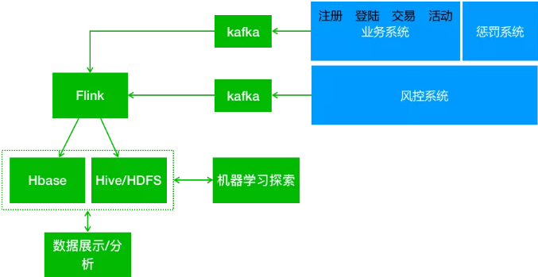

##### 关系网络

关系组网功能、网络可视化展示 、图算法的支持、子网络划分与子网特征计算 、其他业务功能，如中文分词、中文模糊匹配、一个网络在时间轴上的动态监测

###### 关系组网

异构关系网络：每一个节点都可能由不同类型的数据组成的。这种关系网络的构建相对是比较简单，只需要把客户申请信息、合规获取的隐私信息，做一个数据提取，然后把数据按照公司的业务要求生成对应的点和边，那样关联起来那就构成了这样的一个异构关系网络。
同构关系网络：同构关系网络比异构关系网络复杂，需要对每个不同类型的节点进行同一人模型化。通常，通过对借贷申请人的手机号，IMEI，身份证号等唯一信息节点数据进行同一人模型化，生成对每个借款人的唯一识别码，再用这些借款人的唯一识别码进行重新组网，生成同构关系网络。

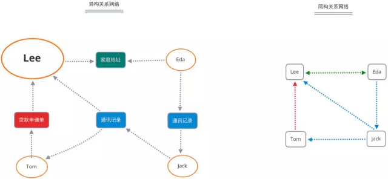


小波理论是根据时频局部化的要求而发展起来的，具有自适应和数学显微镜性质，特别适合非平稳、非线性信号的处理。目前有几十种小波函数，不同的小波函数有不同的去噪效果，未来选取合适的小波函数，分析以下一些与去噪关系紧密的小波函数特性：

（1）正交性。 保持小波系数间的不相关性，提高除噪性能

（2）紧支撑性。 紧支撑宽度越小，小波的局部分辨能力越好，除噪越精细

（3）消失矩。  消失矩的特性使小波展开时消去信号的高阶平滑部分，因而小波变换只反映函数的高阶变换部分，从而反映信号奇异性的能力强。针对金融时间序列具有突变性的特点，一定的消失矩是需要的。但是太高的消失矩，若信号中奇异点比较多时，对小波系数进行阈值处理后，重构失真度可能增大，因此像收益率这样的序列，消失矩不能太高，否则会丢掉很多信息，而股价数据可适当高一点。

（4）对称性。 越对称的小波，在经过小波变换后，其偏差可能越小，因而有利于除噪后信号的恢复和重建

根据对上述特性的综合分析，dbN(即Daubechies系列小波)、symN(Symlets系列小波)、coifN(Coiflet系列小波)都比较合适。


冒烟测试是指在对一个新版进行系统大规模的测试之前，先验证一下软件的基本功能是否实现，是否具备可测试性。

开展冒烟测试工作有助于尽早发现软件代码存在的问题，提高软件代码的质量和开发效率。基于持续集成的冒烟测试采用自动化测试脚本进行测试工作，能够提高测试效率，减少测试人员大量的重复测试验证工作


“冠军挑战者”模型的设计思路：

将目前在线上运行且执行风控决策的策略规则和评分模型设定为“冠军组”，与之同时线上模拟运行，记录风险判断结果但不执行风险决策的策略规则和评分模型设定为“挑战组”；

“冠军组”唯一，“挑战组”可以是若干；

在“冠军者”和“挑战者”策略应用一段时间以后(自定)，通过跟踪、归纳、分析每个策略小组的表现，效益更高的策略被实践证明更优秀，从而可考虑成为新的“冠军者”策略(也就是换入换出决定)，然后继续制定新的“挑战者”策略进行新一轮的竞赛。

  “冠军挑战者”模型的设计原理简单概要如下：

将目前在线上运行且执行风控决策的策略规则和评分模型设定为“冠军组”，与之同时线上模拟运行，记录风险判断结果但不执行风险决策的策略规则和评分模型设定为“挑战组”；

“冠军组”唯一，“挑战组”可以是若干；

当“挑战组”达到预期或比现在的“冠军组“表现更优时，可以考虑”挑战组“替换”冠军组“，执行信贷风险决策；

A/B测试：如果要证明一个改变能够产生积极的影响，应该把可以相互比较的测试者们随机分配在实验组和对照组当中。对照组的测试者们接触到的是产品改变之前的当前版本，而实验组的测试者们接触到的是产品改变之后新版本，除了要测试的变化之外，其他的东西都应该保持不变。经过一段时间收集样本数据之后，比较实验组和对照组的核心指标表现，然后通过统计学的方法来验证测试的产品新变化到底是不是带来了正向的影响。

 


列块并行学习的设计可以减少节点分裂时的计算量，在顺序访问特征值时，访问的是一块连续的内存空间，但通过特征值持有的索引（样本索引）访问样本获取一阶、二阶导数时，这个访问操作访问的内存空间并不连续，这样可能造成cpu缓存命中率低，影响算法效率。

为了解决缓存命中率低的问题，XGBoost 提出了缓存访问算法：为每个线程分配一个连续的缓存区，将需要的梯度信息存放在缓冲区中，这样就实现了非连续空间到连续空间的转换，提高了算法效率。此外适当调整块大小，也可以有助于缓存优化。


论文的思想很简单，就是先用已有特征训练GBDT模型，然后利用GBDT模型学习到的树来构造新特征，最后把这些新特征加入原有特征一起训练模型。构造的新特征向量是取值0/1的，向量的每个元素对应于GBDT模型中树的叶子结点。当一个样本点通过某棵树最终落在这棵树的一个叶子结点上，那么在新特征向量中这个叶子结点对应的元素值为1，而这棵树的其他叶子结点对应的元素值为0。新特征向量的长度等于GBDT模型里所有树包含的叶子结点数之和。

 

Dropout是用来防止co-adaptation的。Co-adaptation是一个学到的feature如果需要其他feature一起才能发挥作用，那就说明他们之间是一种co-adaptation的关系。所以冗余性的体现也许可以理解为，减弱了co-adaptation就等于说缺了其他的一些feature，剩下的部分feature仍然能比较完整的保留针对任务所需要的信息。


所有数据集都随机选取了 10% 作为测试集。在另外的 90% 中，首先先保留 20% 作为验证集，以选择能给出最佳对数似然的 M（提升阶段的数量），然后再使用所选的 M 重新拟合那 90% 整体。然后，使用重新拟合的模型在留存的 10% 测试集上进行预测。对于所有数据集，整个过程重复 20 次；

#### xgboost

###### Monotonic Constraints

It is often the case in a modeling problem or project that the functional form of an acceptable model is constrained in some way. This may happen due to business considerations, or because of the type of scientific question being investigated. In some cases, where there is a very strong prior belief that the true relationship has some quality, constraints can be used to improve the predictive performance of the model.

A common type of constraint in this situation is that certain features bear a monotonic relationship to the predicted response:
$$
f\left(x_{1}, x_{2}, \dots, x, \dots, x_{n-1}, x_{n}\right) \leq f\left(x_{1}, x_{2}, \dots, x^{\prime}, \dots, x_{n-1}, x_{n}\right)
$$
whenever $x \leq x^{\prime}$ is an **increasing constraint**; or
$$
xf\left(x_{1}, x_{2}, \dots, x, \dots, x_{n-1}, x_{n}\right) \ge f\left(x_{1}, x_{2}, \dots, x^{\prime}, \dots, x_{n-1}, x_{n}\right)
$$
whenever $x \leq x^{\prime}$ is a **decreasing constraint**.

XGBoost has the ability to enforce monotonicity constraints on any features used in a boosted model.

Suppose the following code fits your model without monotonicity constraints

```python
model_no_constraints = xgb.train(params, dtrain,
                                 num_boost_round = 1000, evals = evallist,
                                 early_stopping_rounds = 10)
```

Then fitting with monotonicity constraints only requires adding a single parameter

```
params_constrained = params.copy()
params_constrained['monotone_constraints'] = "(1,-1)"

model_with_constraints = xgb.train(params_constrained, dtrain,
                                   num_boost_round = 1000, evals = evallist,
                                   early_stopping_rounds = 10)
```

In this example the training data `X` has two columns, and by using the parameter values `(1,-1)` we are telling XGBoost to impose an increasing constraint on the first predictor and a decreasing constraint on the second.

Some other examples:

- `(1,0)`: An increasing constraint on the first predictor and no constraint on the second.
- `(0,-1)`: No constraint on the first predictor and a decreasing constraint on the second.