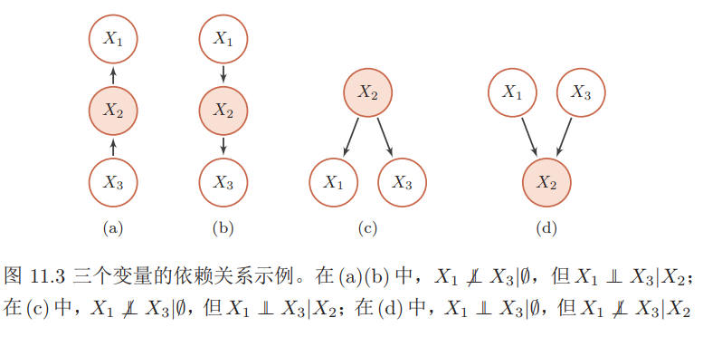
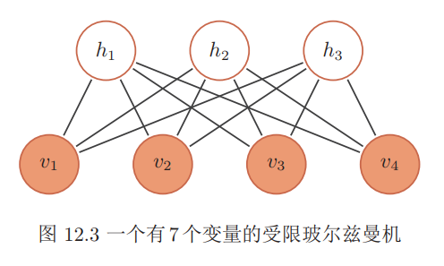
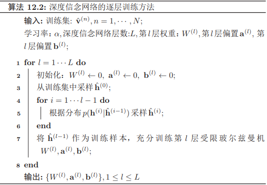

### 概率图模型

概率图模型简称图模型，是指一种用图结构来描述多元随机变量之间条件独立关系的概率模型，从而给研究高维空间中的概率模型带来了很大的便捷性。

图模型的基本问题 图模型有三个基本问题：

表示问题：对于一个概率模型，如何通过图结构来描述变量之间的依赖关系。

推断问题：在已知部分变量时，计算其它变量的后验概率分布。

学习问题：图模型的学习包括图结构的学习和参数的学习。在此我们只关注在给定图结构时的参数学习，即参数估计问题。

#### 模型表示

在概率图模型中，每个节点都表示一个随机变量（或一组随机变量），边表示这些随机变量之间的概率依赖关系。

常见的概率图模型可以分为两类：有向图模型和无向图模型。有向图模型的图结构为有向非循环图，如果两个节点之间有连边，表示对于的两个变量为因果关系。无向图模型使用无向图来描述变量之间的关系。每条边代表两个变量之间有概率依赖关系，但是并不一定是因果关系。

##### 有向图模型

贝叶斯网络： 对于一个随机向量$\mathbf{X} = [X_1, X_2, · · · , X_K]^T$和一个有$K $个节点的有向非循环图$G$，$G$中的每个节点都对应一个随机变量，可以是可观测的变量，隐变量或是未知参数。$G$中的每个连接$e_{ij }$表示两个随机变量$X_i$ 和$X_j$ 之间具有非独立的因果关系。$X_{π_k} $表示变量 $X_k$ 的所有父节点变量集合，每个随机变量的局部条件概率分布为$P(X_k|X_{π_k})$。如果$X$的联合概率分布可以分解为每个随机变量$X_k$ 的局部条件概率的连乘形式，即
$$
p(\mathbf{x})=\prod_{k=1}^{K} p\left(x_{k} | \mathbf{x}_{\pi_{k}}\right)
$$
那么$(G, X)$构成了一个贝叶斯网络。

条件独立性 在贝叶斯网络中，如果两个节点是直接连接的，它们肯定是非条件独立的，是直接因果关系。父节点是“因”，子节点是“果”。如果两个节点不是直接连接的，但是它们之间有一条经过其它节点的路径来连接，那么这两个节点之间的条件独立性就比较复杂。以三个节点的贝叶斯网络为例，给定三个节点$X_1, X_2, X_3$，$X_1$ 和$X_3$ 是不直接连接的，可以通过节点$X_2$ 连接。这三个节点之间可以有四种连接关系:

间接因果关系：当$X_2$已知时，$X_1$和$X_3$为条件独立，即$X_1 ⊥ X_3|X_2$；
间接果因关系： 当$X_2$已知时，$X_1$和$X_3$为条件独立，即$X_1 ⊥ X_3|X_2$；
共因关系： 当$X_2$ 未知时，$X_1$ 和 $X_3$ 是不独立的；当$X_2$ 已知时，$X_1$和$ X_3$ 条件独立。

共果关系当$X_2$ 未知时，$X_1$ 和$ X_3$ 是独立的；当$X_2$ 已知时，$X_1$ 和$X_3$ 不独立。

**局部马尔可夫性质**对一个更一般的贝叶斯网络，其局部马尔可夫性质为：每个随机变量在给定父节点的情况下，条件独立于它的非后代节点。$X_{k} \perp Z | X_{\pi_{k}}$，其中$Z$为$X_k $的非后代变量。

###### sigmoid 信念网络

对于变量$X_k$ 和它的父节点集合$π_k$，其条件概率分布表示为
$$
P\left(X_{k}=1 | \mathbf{x}_{\pi_{k}}, \theta\right)=\sigma\left(\theta_{0}+\sum_{x_{i} \in \mathbf{x}_{\pi_{k}}} \theta_{i} x_{i}\right)
$$
其中$σ(·)$是$Logistic$ $sigmoid $函数，$θ_i$ 是可学习的参数。

$Sigmoid$信念网络与$Logistic$回归模型都采用$Logistic $函数来计算条件概率。如果假设$Sigmoid$信念网络中只有一个叶子节点，其所有的父节点之间没有连接，且取值为实数，那么$sigmoid$信念网络的网络结构和$Logistic$回归模型类似。但是，这两个模型区别在于$Logistic$回归模型中的$x$作为一种确定性的参数，而非变量。因此，$Logistic$回归模型只建模条件概率$p(y|x)$，是一种判别模型；而$sigmoid$信念网络建模$p(x, y)$，是一种生成模型。

###### 朴素贝叶斯分类器

给定一个有$d$维特征的样本$\mathbf{x}$和类别$y$，类别的后验概率为
$$
\begin{aligned} p(y | \mathbf{x}, \theta) &=\frac{p\left(x_{1}, \cdots, x_{d} | y\right) p(y)}{p\left(x_{1}, \cdots, x_{d}\right)} \\ & \propto p\left(x_{1}, \cdots, x_{d} | y, \theta\right) p(y | \theta) \end{aligned}
$$
在朴素贝叶斯分类器中，假设在给定$ Y$ 的情况下，$X_i$ 之间是条件独立的

###### 隐马尔可夫模型

隐马尔可夫模型的联合概率可以分解为
$$
p(\mathbf{x}, \mathbf{y}, \theta)=\prod_{t=1}^{T} p\left(y_{t} | y_{t-1}, \theta_{s}\right) p\left(x_{t} | y_{t}, \theta_{t}\right)
$$
其中$p(x_t|y_t, θ_t)$为输出概率，$p(y_t|y_{t−1}, θ_s)$为转移概率，$θ_s$, $θ_t$ 分别表示两类条件概率的参数。 

##### 无向图模型

马尔可夫随机场： 对于一个随机向量$X = [X_1, · · · , X_K]^T$和一个有$K$ 个节点的无向图$G(V, E)$，图$G$中的节点$k $表示随机变量$X_k，1 ≤ k ≤ K$。如果$(G, X)$满足局部马尔可夫性质，即一个变量$X_k$ 在给定它的邻居的情况下独立于所有其它变量，
$$
p\left(x_{k} | \mathbf{x}_{\backslash k}\right)=p\left(x_{k} | \mathbf{x}_{N(k)}\right)
$$
其中$N(k)$为变量$X_k$ 的邻居集合，$\backslash k$ 为除$X_k$ 外其它变量的集合，那么$(G, X)$就构成了一个马尔可夫随机场。

无向图的马尔可夫性 无向图中的马尔可夫性可以表示为$X_{k} \mathbb{\perp} \mathbf{X}_{\backslash N(k), \backslash k} | \mathbf{X}_{N(k)}$，其中$\mathbf{X}_{\backslash N(k), \backslash k}$表示除$\mathbf{X}_{N(k)} $和$\mathbf{X}_k $外的其它变量。

无向图中的一个全连通子图，称为团，即团内的所有节点之间都连边。在所有团中，如果一个团不能被其它的团包含，这个团就是一个最大团。如果一个分布$p(\mathbf{x}) > 0$满足无向图$G$中的局部马尔可夫性质，当且仅当$p(\mathbf{x})$可以表示为一系列定义在最大团上的非负函数的乘积形式，即
$$
p(\mathbf{x})=\frac{1}{Z} \prod_{c \in \mathcal{C}} \phi_{c}\left(\mathbf{x}_{c}\right)
$$
其中$ C $为$ G $中的最大团集合，$ϕ_c(x_c) ≥ 0 $是定义在团 $c $上的势能函数，$Z $是配分函数，用来将乘积归一化为概率形式。
$$
Z=\sum_{\mathbf{x} \in \mathcal{X}} \prod_{c \in \mathcal{C}} \phi_{c}\left(\mathbf{x}_{c}\right)
$$
其中$\mathcal{X}$ 为随机向量$X$ 的取值空间。

由于势能函数必须为正的，因此我们一般定义为$\phi_{c}\left(\mathbf{x}_{c}\right)=\exp \left(-E_{c}\left(\mathbf{x}_{c}\right)\right)$其中$E(\mathbf{x}_c)$为能量函数。因此，无向图上定义的概率分布可以表示为：
$$
\begin{aligned} P(\mathbf{x}) &=\frac{1}{Z} \prod_{c \in \mathcal{C}} \exp \left(-E_{c}\left(\mathbf{x}_{c}\right)\right) \\ &=\frac{1}{Z} \exp \left(\sum_{c \in \mathcal{C}}-E_{c}\left(\mathbf{x}_{c}\right)\right) \end{aligned}
$$
这种形式的分布又称为玻尔兹曼分布。任何一个无向图模型都可以用上面公式来表示其联合概率。

###### 对数线性模型

$$
\log p(\mathbf{x} | \theta)=\sum_{c \in C} \theta_{c}^{\mathrm{T}} f_{c}\left(\mathbf{x}_{c}\right)-\log Z(\theta)
$$

其中$θ$ 代表所有势能函数中的参数$θ_c$。这种形式的无向图模型也称为对数线性模型或最大熵模型

如果用对数线性模型来建模条件概率$p(y|x)$，
$$
p(y | \mathbf{x}, \theta)=\frac{1}{Z(\mathbf{x}, \theta)} \exp \left(\theta^{\mathrm{T}} f(\mathbf{x}, y)\right)
$$
其中$Z(\mathbf{x}, \theta)=\sum_{y} \exp \left(\theta^{\mathrm{T}} f_{y}(\mathbf{x}, y)\right)$。这种对数线性模型也称为条件最大熵模型

###### 条件随机场

条件随机场建模的条件概率 $p(\mathbf{y}|\mathbf{x}) $中，$\mathbf{y}$一般为随机向量，因此需要对$p(\mathbf{y}|\mathbf{x}) $进行因子分解。假设条件随机场的最大团集合为$mathcal{C}$，其条件概率为
$$
p(\mathbf{y} | \mathbf{x}, \theta)=\frac{1}{Z(\mathbf{x}, \theta)} \exp \left(\sum_{c \in \mathcal{C}} \theta_{c}^{\mathrm{T}} f_{c}\left(\mathbf{x}, \mathbf{y}_{c}\right)\right)
$$
其中$Z(\mathbf{x}, \theta)=\sum_{y} \exp \left(\sum_{c \in \mathcal{C}} f_{c}\left(\mathbf{x}, \mathbf{y}_{c}\right)^{\mathrm{T}} \theta_{c}\right)$归一化项。

一个最常用的条件随机场为链式结构，其条件概率为
$$
p(\mathbf{y} | \mathbf{x}, \theta)=\frac{1}{Z(\mathbf{x}, \theta)} \exp \left(\sum_{t=1}^{T} \theta_{1}^{\mathrm{T}} f_{1}\left(\mathbf{x}, y_{t}\right)+\sum_{t=1}^{T-1} \theta_{2}^{\mathrm{T}} f_{2}\left(\mathbf{x}, y_{t}, y_{t+1}\right)\right)
$$
其中$f_1(\mathbf{x}, y_t)$为状态特征，一般和位置$t$相关，$f_2(\mathbf{x}, y_t, y_{t+1})$为转移特征，一般可以简化为$f_2(y_t, y_{t+1})$并使用状态转移矩阵来表示。

#### 推断

在图模型中，推断是指在观测到部分变量$\mathbf{e} =\{e_1, e_2, · · · , e_m\}$时，计算其它变量的某个子集$\mathbf{q} = \{q_1, q_2, · · · , q_n\}$的后验概率$p(\mathbf{q}|\mathbf{e})$。假设一个图模型中，除了变量$\mathbf{e}、\mathbf{q}$ 外，其余变量表示为$\mathbf{z}$。根据贝叶斯公
式有
$$
\begin{aligned} p(\mathbf{q} | \mathbf{e}) &=\frac{p(\mathbf{q}, \mathbf{e})}{p(\mathbf{e})} \\ &=\frac{\sum_{\mathbf{z}} p(\mathbf{q}, \mathbf{e}, \mathbf{z})}{\sum_{\mathbf{q}, \mathbf{z}} p(\mathbf{q}, \mathbf{e}, \mathbf{z})} \end{aligned}
$$

#### 学习

图模型的学习可以分为两部分：一是网络结构学习，即寻找最优的网络结构；二是网络参数估计，即已知网络结构，估计每个条件概率分布的参数。网络结构学习一般比较困难，一般是由领域专家来构建。我们讨论在给定网络结构条件下的参数估计问题。

##### 不含隐变量的参数估计

有向图模型：给定$N $个训练样本$\mathcal{D}=\left\{\mathbf{x}^{(i)}\right\}, 1 \leq i \leq N$，其对数似然函数为
$$
\begin{aligned} \mathcal{L}(\mathcal{D} | \theta) &=\frac{1}{N} \sum_{i=1}^{N} \log p\left(\mathbf{x}^{(i)}, \theta\right) \\ &=\frac{1}{N} \sum_{i=1}^{N} \sum_{k=1}^{K} \log p\left(x_{k}^{(i)} | x_{\pi_{k}}^{(i)}, \theta_{k}\right) \end{aligned}
$$
其中$θ_k$为模型中的所有参数

因为所有变量都是可观测的，最大化对数似然$\mathcal{L}(D|θ)$，只需要分别地最大化每个变量的条件似然来估计其参数。
$$
\theta_{k}=\arg \max \sum_{i=1}^{N} \log p\left(x_{k}^{(i)} | x_{\pi_{k}}^{(i)}, \theta_{k}\right)
$$
无向图模型：在无向图模型中，所有变量x的联合概率分布可以分解为定义在最大团上的势能函数的连乘形式。以对数线性模型为例

给定$N$个训练样本$\mathcal{D}=\left\{\mathbf{x}^{(i)}\right\}, 1 \leq i \leq N$，其对数似然函数为
$$
\begin{aligned} \mathcal{L}(\mathcal{D} | \theta) &=\frac{1}{N} \sum_{i=1}^{N} \log p\left(\mathbf{x}^{(i)}, \theta\right) \\ &=\frac{1}{N} \sum_{i=1}^{N}\left(\sum_{c \in C} \theta_{c}^{\mathrm{T}} f_{c}\left(\mathbf{x}_{c}^{(i)}\right)\right)-\log Z(\theta) \end{aligned}
$$
其中$θ_c$为定义在团$c$上的势能函数的参数。
$$
\begin{array}{r}{\frac{\partial \mathcal{L}(\mathcal{D} | \theta)}{\partial \theta_{c}}=\frac{1}{N} \sum_{i=1}^{N}\left(f_{c}\left(\mathbf{x}_{c}^{(i)}\right)\right)-\frac{\log Z(\theta)}{\partial \theta_{c}}} \\\\ {\frac{\log Z(\theta)}{\partial \theta_{c}}=\sum_{\mathbf{x}} \frac{1}{Z(\theta)} \cdot \exp \left(\sum_{c \in \mathcal{C}} \theta_{c}^{\mathrm{T}} f_{c}\left(\mathbf{x}_{c}\right)\right) \cdot f_{c}\left(\mathbf{x}_{c}\right) ]} \\ {=\sum_{\mathbf{x}} p(\mathbf{x} | \theta) f_{c}\left(\mathbf{x}_{c}\right) \triangleq \mathbb{E}_{\mathbf{x} \sim p(\mathbf{x} | \theta)}\left[f_{c}\left(\mathbf{x}_{c}\right)\right]} \\\\ {\frac{\partial \mathcal{L}(\mathcal{D} | \theta)}{\partial \theta_{c}}=\frac{1}{N} \sum_{i=1}^{N} f_{c}\left(\mathbf{x}_{c}^{(i)}\right)-\mathbb{E}_{\mathbf{x} \sim p(\mathbf{x} | \theta)}\left[f_{c}\left(\mathbf{x}_{c}\right)\right]}\end{array}
$$

##### 含隐变量的参数估计

给定$N$个训练样本$\mathcal{D}=\left\{\mathbf{x}^{(i)}\right\}, 1 \leq i \leq N$，其对数似然函数为
$$
\begin{aligned} \mathcal{L}(\mathcal{D} | \theta) &=\frac{1}{N} \sum_{i=1}^{N} \log p\left(\mathbf{x}^{(i)}, \theta\right) \\ &=\frac{1}{N} \sum_{i=1}^{N} \log \sum_{\mathbf{z}} p\left(\mathbf{x}^{(i)}, \mathbf{z} | \theta\right) \end{aligned}
$$
为了计算$log p(\mathbf{x}|θ)$，我们引入一个额外的变分函数$q(\mathbf{z})$，$q(\mathbf{z})$为定义在隐变量$Z$上的分布。样本$\mathbf{x}$的对数边际似然函数为
$$
\begin{aligned} \log p(\mathbf{x} | \theta) &=\log \sum_{\mathbf{z}} q(\mathbf{z}) \frac{p(\mathbf{x}, \mathbf{z} | \theta)}{q(\mathbf{z})} \\ & \geq \sum_{\mathbf{z}} q(\mathbf{z}) \log \frac{p(\mathbf{x}, \mathbf{z} | \theta)}{q(\mathbf{z})} \\ & \triangleq E L B O(q, \mathbf{x} | \theta) \end{aligned}
$$

### 深度信念网

玻尔兹曼机和深度信念网络都是生成模型，借助隐变量来描述复杂的数据分布。作为概率图模型，玻尔兹曼机和深度信念网络的共同问题是推断和学习问题。因为这两种模型都比较复杂，并且都包含隐变量，它们的推断和学习一般通过$\text{MCMC}$方法来进行近似估计。这两种模型和神经网络有很强的对应关系，在一定程度上也称为随机神经络。

#### 玻尔兹曼机

玻尔兹曼机可以看做是一个随机动力系统，每个变量的状态都以一定的概率受到其它变量的影响。玻尔兹曼机可以用概率无向图模型来描述。一个具有K 个节点（变量）的玻尔兹曼机满足以下三个性质：

每个随机变量是二值的，所有随机变量可以用一个二值的随机向量$\mathbf{X} ∈\{0, 1\}^K$ 来表示，其中可观测变量表示为$\mathbf{V}$，隐变量表示为$\mathbf{H}$；所有节点之间是全连接的。每个变量$X_i$ 的取值依赖于所有其它变量$X_{\backslash i}$；每两个变量之间的相互影响（$X_i → X_j$ 和$X_j → X_i$）是对称的。

变量$\mathbf{X}$的联合概率由玻尔兹曼分布得到，即
$$
p(\mathbf{x})=\frac{1}{Z} \exp \left(\frac{-E(\mathbf{x})}{T}\right)
$$
其中$\mathbf{Z}$ 为配分函数，能量函数$E(\mathbf{x})$的定义为
$$
\begin{aligned} E(\mathbf{x}) & \triangleq E(\mathbf{X}=\mathbf{x}) \\ &=-\left(\sum_{i<j} w_{i j} x_{i} x_{j}+\sum_{i} b_{i} x_{i}\right) \end{aligned}
$$
其中$w_{ij}$ 是两个变量$x_i$ 和$x_j$之间的连接权重，$x_i ∈ \{0, 1\}$表示状态，$b_i$是变量$x_i$的偏置。

因此，如果令玻尔兹曼机中的每个变量 $X_i $代表一个基本假设，其取值为$ 1 $或$ 0 $分别表示模型接受或拒绝该假设，那么变量之间连接的权重为可正可负的实数，代表了两个假设之间的弱约束关系。一个正的权重表示两个假设可以相互支持。也就是说，如果一个假设被接受，另一个也很可能被接受。相反，一个负的权重表示两个假设不能同时被接受。

玻尔兹曼机可以用来解决两类问题。**一类是搜索问题**。当给定变量之间的连接权重，需要找到一组二值向量，使得整个网络的能量最低。**另一类是学习问题**。当给一组定部分变量的观测值时，计算一组最优的权重。

#### 生成模型

在玻尔兹曼机中，配分函数$\mathbf{Z}$ 通常难以计算，因此，联合概率分布$p(\mathbf{x})$一般通过$\text{MCMC}$方法来近似，生成一组服从$ p(\mathbf{x}) $分布的样本。本节介绍基于吉布斯采样的样本生成方法。 

##### 全条件概率

吉布斯采样需要计算每个变量$X_i $的全条件概率$p(x_i|x_{\backslash i})$，其中$x_{\backslash i}$ 表示除变量$X_i $外其它变量的取值。

首先，保持其它变量$x_{\backslash i}$ 不变，改变变量$X_i$ 的状态，从$0$和$1$之间的能量差异为
$$
\begin{aligned} \Delta E_{i}\left(\mathbf{x}_{\backslash i}\right) &=E\left(x_{i}=0, \mathbf{x}_{\backslash i}\right)-E\left(x_{i}=1, \mathbf{x}_{\backslash i}\right) \\ &=\sum_{j} w_{i j} x_{j}+b_{i} \end{aligned}
$$
又根据玻尔兹曼机的定义可得
$$
E(\mathbf{x})=-T \log p(\mathbf{x})-T \log Z
$$
因此有
$$
\begin{aligned} \Delta E_{i}\left(\mathbf{x}_{\backslash i}\right) &=-T \ln p\left(x_{i}=0, \mathbf{x}_{\backslash i}\right)-\left(-T \ln p\left(x_{i}=1, \mathbf{x}_{\backslash i}\right)\right) \\ &=T \ln \frac{p\left(x_{i}=1, \mathbf{x}_{\backslash i}\right)}{p\left(x_{i}=0, \mathbf{x}_{\backslash i}\right)} \\ &=T \ln \frac{p\left(x_{i}=1 | \mathbf{x}_{\backslash i}\right)}{p\left(x_{i}=0 | \mathbf{x}_{\backslash i}\right)} \\ &=T \ln \frac{p\left(x_{i}=1, | \mathbf{x}_{\backslash i}\right)}{1-p\left(x_{i}=1 | \mathbf{x}_{\backslash i}\right)} \end{aligned}
$$
得到
$$
\begin{aligned} p\left(x_{i}=1 | \mathbf{x}_{\{i}\right) &=\frac{1}{1+\exp \left(-\frac{\Delta E_{i}\left(\mathbf{x}_{\backslash i}\right)}{T}\right)} \\ &=\sigma\left(\frac{\sum_{j} w_{i j} x_{j}+b_{i}}{T}\right) \end{aligned}
$$

##### 参数学习

不失一般性，假设玻尔兹曼机中的变量分为可观测变量$\mathbf{v} ∈ \{0, 1\}^m$ 和隐变量$\mathbf{h} ∈ \{0, 1\}^n$。

给定一组可观测的向量$\mathcal{D}=\left\{\hat{\mathbf{v}}^{(1)}, \hat{\mathbf{v}}^{(2)}, \cdots, \hat{\mathbf{v}}^{(N)}\right\}$作为训练集，我们要学习玻尔兹曼机的参数$W$和$\mathbf{b}$使得训练集中所有样本的对数似然函数最大。训练集的对数似然函数定义为
$$
\begin{aligned} \mathcal{L}(\mathcal{D} | W, \mathbf{b}) &=\frac{1}{N} \sum_{n=1}^{N} \log p\left(\hat{\mathbf{v}}^{(n)} | W, b\right) \\ &=\frac{1}{N} \sum_{n=1}^{N} \log \sum_{\mathbf{h}} p\left(\hat{\mathbf{v}}^{(n)}, \mathbf{h} | W, \mathbf{b}\right) \\ &=\frac{1}{N} \sum_{n=1}^{N} \log \frac{\sum_{\mathbf{h}} \exp \left(-E\left(\hat{\mathbf{v}}^{(n)}, \mathbf{h}\right)\right)}{\sum_{\mathbf{v}, \mathbf{h}} \exp (-E(\mathbf{v}, \mathbf{h}))} \end{aligned}
$$
对数似然函数$\mathcal{L}(\mathcal{D}|W, \mathbf{b})$对参数$θ$ 的偏导数为
$$
\begin{array}{l}{\frac{\mathcal{L}(\mathcal{D} | W, \mathbf{b})}{\partial \theta}=\frac{1}{N} \sum_{n=1}^{N} \frac{\partial}{\partial \theta} \log \sum_{\mathbf{h}} p\left(\hat{\mathbf{v}}^{(n)}, \mathbf{h} | W, \mathbf{b}\right)} \\ {=\frac{1}{N} \sum_{n=1}^{N} \frac{\partial}{\partial \theta}\left(\log \sum_{\mathbf{h}} \exp \left(-E\left(\hat{\mathbf{v}}^{(n)}, \mathbf{h}\right)\right)-\log \sum_{\mathbf{v}, \mathbf{h}} \exp (-E(\mathbf{v}, \mathbf{h}))\right)}\\
=\frac{1}{N} \sum_{n=1}^{N} \sum_{\mathbf{h}} \frac{\exp \left(-E\left(\hat{\mathbf{v}}^{(n)}, \mathbf{h}\right)\right)}{\sum_{\mathbf{h}} \exp \left(-E\left(\hat{\mathbf{v}}^{(n)}, \mathbf{h}\right)\right)}\left[\frac{\partial E\left(\hat{\mathbf{v}}^{(n)}, \mathbf{h}\right)}{\partial \theta}\right]
-\sum_{\mathbf{v}, \mathbf{h}} \frac{\exp (-E(\mathbf{v}, \mathbf{h}))}{\sum_{\mathbf{v}, \mathbf{h}} \exp (-E(\mathbf{v}, \mathbf{h}))}\left[\frac{\partial E(\mathbf{v}, \mathbf{h})}{\partial \theta}\right]\\
=\frac{1}{N} \sum_{n=1}^{N} \sum_{\mathbf{h}} p\left(\mathbf{h} | \hat{\mathbf{v}}^{(n)}\right)\left[\frac{\partial E\left(\hat{\mathbf{v}}^{(n)}, \mathbf{h}\right)}{\partial \theta}\right]-\sum_{\mathbf{v}, \mathbf{h}} p(\mathbf{v}, \mathbf{h})\left[\frac{\partial E(\mathbf{v}, \mathbf{h})}{\partial \theta}\right]
\end{array}
$$

因此，整个训练集的对数似然函数$ \mathcal{L}(D|W, b) $对每个权重 $w_{ij}$ 和偏置$ b_i $的偏导数为
$$
\begin{aligned} \frac{\partial \mathcal{L}(\mathcal{D} | W, \mathbf{b})}{\partial w_{i j}} &=\mathbb{E}_{\hat{p}(\mathbf{v})} \mathbb{E}_{p(\mathbf{h} | \mathbf{v})}\left[x_{i} x_{j}\right]-\mathbb{E}_{p(\mathbf{v}, \mathbf{h})}\left[x_{i} x_{j}\right] \\ \frac{\partial \mathcal{L}(\mathcal{D} | W, \mathbf{b})}{\partial b_{i}} &=\mathbb{E}_{\hat{p}(\mathbf{v})} \mathbb{E}_{p(\mathbf{h} | \mathbf{v})}\left[x_{i}\right]-\mathbb{E}_{p(\mathbf{v}, \mathbf{h})}\left[x_{i}\right] \end{aligned}
$$
当$K$比较大时，配分函数以及期望的计算会十分耗时。因此，玻尔兹曼机一般通过$\text{MCMC}$方法来进行近似求解。以参数$w_{ij} $的梯度为例，上式中第一项为在给定可观测变量为训练集中的样本时，$x_ix_j$ 的期望。为了近似近似这个期望，我们可以固定住可观测变量，只对$\mathbf{h}$进行吉布斯采样。当玻尔兹曼机达到热平衡状态时，采样$x_ix_j $的值。在训练集上所有的训练样本上重复此过程，得到$x_ix_j $的近似期望$⟨x_ix_j ⟩_{data}$。上式中的第二项为玻尔兹曼机在没有任何限制时，$x_ix_j $的期望。我们可以对所有变量进行吉布斯采样。当玻尔兹曼机达到热平衡状态时，采样$x_ix_j $的值，得到近似期望$⟨x_ix_j ⟩_{model}$。这样当采用梯度上升法时，权重$w_{ij}$可以用下面公式近似地更新

$$
w_{i j} \leftarrow w_{i j}+\alpha\left(\left\langle x_{i} x_{j}\right\rangle_{\mathrm{data}}-\left\langle x_{i} x_{j}\right\rangle_{\mathrm{model}}\right)
$$
玻尔兹曼机可以用在监督学习和无监督学习中。在监督学习中，可观测的变量$\mathbf{v}$又进一步可以分为输入和输出变量，隐变量则隐式地描述了输入和输出变量之间复杂的约束关系。在无监督学习中，隐变量可以看做是可观测变量的内部特征表示。

#### 受限玻尔兹曼机

全连接的玻尔兹曼机在理论上十分有趣，但是由于其复杂性，目前为止并没有被广泛使用。虽然基于采样的方法在很大程度提高了学习效率，但是每更新一次权重，就需要网络重新达到热平衡状态，这个过程依然比较低效，需要很长时间。**受限玻尔兹曼机**是一个二分图结构的无向图模型。受限玻尔兹曼机中的变量也分为隐藏变量和可观测变量。我们分别用可观测层和隐藏层来表示这两组变量。同一层中的节点之间没有连接，而不同层一个层中的节点与另一层中的所有节点连接，这和两层的全连接神经网络的结构相同。

一个受限玻尔兹曼机由 $m_1 $个可观测变量和$m_2 $个隐变量组成，其定义如下：
可观测的随机向量$\mathbf{v} = [v_1, · · · , v_{m_1}]^T$；
隐藏的随机向量$\mathbf{h} = [h_1, · · · , h_{m_2}]^T$；
权重矩阵$\mathbf{W} ∈ R^{m_1×m_2}$，其中每个元素$w_{ij }$为可观测变量$v_i $和隐变量$h_j$之间边的权重；
偏置$\mathbf{a} ∈ R^{m_1}$ 和$\mathbf{b} ∈ R^{m_2}$，其中$a_i $为每个可观测的变量$ v_i$的偏置，$b_j $为每个隐变量$h_j $的偏置。

受限玻尔兹曼机的能量函数定义为
$$
\begin{aligned} E(\mathbf{v}, \mathbf{h}) &=-\sum_{i} a_{i} v_{i}-\sum_{j} b_{j} h_{j}-\sum_{i} \sum_{j} v_{i} w_{i j} h_{j} \\ &=-\mathbf{a}^{\mathrm{T}} \mathbf{v}-\mathbf{b}^{\mathrm{T}} \mathbf{h}-\mathbf{v}^{\mathrm{T}} W \mathbf{h} \end{aligned}
$$
受限玻尔兹曼机的联合概率分布$p(\mathbf{v}, \mathbf{h})$定义为
$$
\begin{aligned} p(\mathbf{v}, \mathbf{h}) &=\frac{1}{Z} \exp (-E(\mathbf{v}, \mathbf{h})) \\ &=\frac{1}{Z} \exp \left(\mathbf{a}^{\mathrm{T}} \mathbf{v}\right) \exp \left(\mathbf{b}^{\mathrm{T}} \mathbf{h}\right) \exp \left(\mathbf{v}^{\mathrm{T}} W \mathbf{h}\right) \end{aligned}
$$
可观测层变量$\mathbf{v}$的边际概率为
$$
\begin{aligned} P(\mathbf{v}) &=\sum_{\mathbf{h}} P(\mathbf{v}, \mathbf{h})=\frac{1}{Z} \sum_{\mathbf{h}} \exp (-E(\mathbf{v}, \mathbf{h})) \\ &=\frac{1}{Z} \sum_{\mathbf{h}} \exp \left(\mathbf{a}^{\mathrm{T}} \mathbf{v}+\sum_{j} b_{j} h_{j}+\sum_{i} \sum_{j} v_{i} w_{i j} h_{j}\right) \\ &=\frac{\exp \left(\mathbf{a}^{\mathrm{T}} \mathbf{v}\right)}{Z} \sum_{\mathbf{h}} \exp \left(\sum_{j} h_{j}\left(b_{j}+\sum_{i} w_{i j} v_{i}\right)\right) \\ &=\frac{\exp \left(\mathbf{a}^{\mathrm{T}} \mathbf{v}\right)}{Z} \sum_{j} \prod_{j} \exp \left(h_{j}\left(b_{j}+\sum_{i} w_{i j} v_{i}\right)\right)\\
&=\frac{\exp \left(\mathbf{a}^{\mathrm{T}} \mathbf{v}\right)}{Z} \sum_{h_{1}} \sum_{h_{2}} \cdots \sum_{h_{n}} \prod_{j} \exp \left(h_{j}\left(b_{j}+\sum_{i} w_{i j} v_{i}\right)\right) \\ &=\frac{\exp \left(\mathbf{a}^{\mathrm{T}} \mathbf{v}\right)}{Z} \prod_{j} \sum_{h_{j}} \exp \left(h_{j}\left(b_{j}+\sum_{i} w_{i j} v_{i}\right)\right) \\ &=\frac{\exp \left(\mathbf{a}^{\mathrm{T}} \mathbf{v}\right)}{Z} \prod_{j}\left(1+\exp \left(b_{j}+\sum_{i} w_{i j} v_{i}\right)\right)
\end{aligned}
$$
固定$h_j = 1$时，$p(h_j = 1, \mathbf{v})$的边际概率为
$$
\begin{array}{l}{p\left(h_{j}=1, \mathbf{v}\right)=\frac{1}{Z} \sum_{\mathbf{h}, h_{j}=1} \exp (-E(\mathbf{v}, \mathbf{h}))} \\ {=\frac{\exp \left(\mathbf{a}^{\mathrm{T}} \mathbf{v}\right)}{Z} \prod_{k, k \neq j}\left(1+\exp \left(b_{k}+\sum_{i} w_{i k} v_{i}\right)\right) \exp \left(b_{j}+\sum_{i} w_{i j} v_{i}\right)}\end{array}
$$
可以计算隐藏单元$h_j$ 的条件概率为
$$
\begin{aligned} p\left(h_{j}=1 | \mathbf{v}\right) &=\frac{p\left(h_{i}=1, \mathbf{v}\right)}{p(\mathbf{v})} \\ &=\frac{\exp \left(b_{j}+\sum_{i} w_{i j} v_{i}\right)}{1+\exp \left(b_{j}+\sum_{i} w_{i j} v_{i}\right)} \\ &=\sigma\left(b_{j}+\sum_{i} w_{i j} v_{i}\right) \end{aligned}
$$
同理，条件概率$p(v_i = 1|\mathbf{h})$为
$$
p\left(v_{i}=1 | \mathbf{h}\right)=\sigma\left(a_{i}+\sum_{j} w_{i j} h_{j}\right)
$$
也可以写为向量形式
$$
\begin{array}{l}{p(\mathbf{h}=\mathbf{1} | \mathbf{v})=\sigma\left(W^{\mathrm{T}} \mathbf{v}+\mathbf{b}\right)} \\ {p(\mathbf{v}=\mathbf{1} | \mathbf{h})=\sigma(W \mathbf{h}+\mathbf{a})}\end{array}
$$
因此，受限玻尔兹曼机可以并行地对所有的可观测变量或所有的隐变量同时进行采样，而从可以更快地达到热平衡状态。

受限玻尔兹曼机的采样过程如下：
给定或随机初始化一个可观测的向量$\mathbf{v}_0$, 计算隐变量的概率，并从中采样一个隐向量$\mathbf{h}_0$；基于$\mathbf{h}_0$，计算可观测变量的概率，并从中采样一个个可观测的向量$\mathbf{v}_1$；重复$t$次后，获得$(\mathbf{v}_t, \mathbf{h}_t)$；当$t → ∞$时, $(\mathbf{v}_t, \mathbf{h}_t)$的采样服从$p(\mathbf{v}, \mathbf{h})$分布。

##### 参数学习

给定一组训练样本$\mathcal{D}=\left\{\hat{\mathbf{v}}^{(1)}, \hat{\mathbf{v}}^{(2)}, \cdots, \hat{\mathbf{v}}^{(N)}\right\}$，其对数似然函数为
$$
\mathcal{L}(\mathcal{D} | W, \mathbf{a}, \mathbf{b})=\frac{1}{N} \sum_{n=1}^{N} \log p\left(\hat{\mathbf{v}}^{(n)} | W, \mathbf{a}, \mathbf{b}\right)
$$
和玻尔兹曼机类似，在受限玻尔兹曼机中，对数似然函数$\mathcal{L}(\mathcal{D}|W, \mathbf{b}) $对参数$w_{ij} , a_i, b_j $的偏导数为
$$
\begin{aligned}\frac{\partial \mathcal{L}(\mathcal{D} | W, \mathbf{a}, \mathbf{b})}{\partial w_{i j}}&=\mathbb{E}_{\hat{p}(\mathbf{v})} \mathbb{E}_{p(\mathbf{h} | \mathbf{v})}\left[v_{i} h_{j}\right]-\mathbb{E}_{p(\mathbf{v}, \mathbf{h})}\left[v_{i} h_{j}\right]\\
 \frac{\partial \mathcal{L}(\mathcal{D} | W, \mathbf{a}, \mathbf{b})}{\partial a_{i}} &=\mathbb{E}_{\hat{p}(\mathbf{v})} \mathbb{E}_{p(\mathbf{h} | \mathbf{v})}\left[v_{i}\right]-\mathbb{E}_{p(\mathbf{v}, \mathbf{h})}\left[v_{i}\right] \\ \frac{\partial \mathcal{L}(\mathcal{D} | W, \mathbf{a}, \mathbf{b})}{\partial b_{j}} &=\mathbb{E}_{\hat{p}(\mathbf{v})} \mathbb{E}_{p(\mathbf{h} | \mathbf{v})}\left[h_{j}\right]-\mathbb{E}_{p(\mathbf{v}, \mathbf{h})}\left[h_{j}\right] \end{aligned}
$$
其中$\hat{p}(\mathbf{v})$为训练数据集上$\mathbf{v}$的实际分布。
$$
\begin{array}{l}{W \leftarrow W+\alpha\left(\hat{\mathbf{v}}^{(n)} \mathbf{h}^{\mathrm{T}}-\mathbf{v}^{\prime} \mathbf{h}^{\mathrm{T}}\right)} \\ {\mathbf{a} \leftarrow \mathbf{a}+\alpha\left(\hat{\mathbf{v}}^{(n)}-\mathbf{v}^{\prime}\right)} \\ {\mathbf{b} \leftarrow \mathbf{b}+\alpha\left(\mathbf{h}-\mathbf{h}^{\prime}\right)}\end{array}
$$
由于受限玻尔兹曼机的特殊结构，因此可以使用一种比吉布斯采样更有效的学习算法，即对比散度。对比散度算法仅需$k$步吉布斯采样。为了提高效率，对比散度算法用一个训练样本作为可观测向量的初始值。然后，交替对可观测向量和隐藏向量进行吉布斯采样，不需要等到收敛，只需要$k$步就足够了。这就是$\text{CD-k}$算法。通常，$k = 1$就可以学得很好。

**伯努利-伯努利**受限玻尔兹曼机就是上面介绍的可观测变量和隐变量都为二值类型的受限玻尔兹曼机。**高斯-伯努利**受限玻尔兹曼机是假设可观测变量为高斯分布，隐变量为伯努利分布，其能量函数定义为
$$
E(\mathbf{v}, \mathbf{h})=\sum_{i} \frac{\left(v_{i}-\mu_{i}\right)^{2}}{2 \sigma_{i}^{2}}-\sum_{j} b_{j} h_{j}-\sum_{i} \sum_{j} \frac{v_{i}}{\sigma_{i}} w_{i j} h_{j}
$$
其中每个可观测变量$v_i$服从$(µ_i, σ_i)$的高斯分布。**伯努利-高斯**受限玻尔兹曼机是假设可观测变量为伯努利分布，隐变量为高斯分布，其能量函数定义为

$$
E(\mathbf{v}, \mathbf{h})=\sum_{i} a_{i} v_{i}-\sum_{j} \frac{\left(h_{j}-\mu_{j}\right)^{2}}{2 \sigma_{j}^{2}}-\sum_{i} \sum_{j} v_{i} w_{i j} \frac{h_{j}}{\sigma_{j}}
$$
其中每个隐变量$h_j$服从$(µ_j , σ_j )$的高斯分布。

#### 深度信念网络

**深度信念网络**是一种深层的概率有向图模型，其图结构由多层的节点构成。每层节点的内部没有连接，相邻两层的节点为全连接。网络的最底层为可观测变量，其它层节点都为隐变量。最顶部的两层间的连接是无向的，其他层之间的连接是有向的。

对一个有$L$层隐变量的深度信念网络，令$\mathbf{v} = \mathbf{h}^{(0)}$ 表示最底层为可观测变量，$\mathbf{h}_{(1)}, · · · , \mathbf{h}^{(L)}$ 表示其余每层的变量。顶部的两层是一个无向图，可以看做是一个受限玻尔兹曼机，用来产生$p(\mathbf{h}^{(L−1)})$的先验分布。除了最顶上两层外，每一层变量$\mathbf{h}^{(l)}$依赖于其上面一层$\mathbf{h}^{(l+1)}$，即
$$
p\left(\mathbf{h}^{(l)} | \mathbf{h}^{(l+1)}, \cdots, \mathbf{h}^{(L)}\right)=p\left(\mathbf{h}^{(l)} | \mathbf{h}^{(l+1)}\right)
$$
深度信念网络中所有变量的联合概率可以分解为
$$
\begin{align}p\left(\mathbf{v}, \mathbf{h}^{(1)}, \cdots, \mathbf{h}^{(L)}\right)&=p\left(\mathbf{v} | \mathbf{h}^{(1)}\right)\left(\prod_{l=1}^{L-2} p\left(\mathbf{h}^{(l)} | \mathbf{h}^{(l+1)}\right)\right) p\left(\mathbf{h}^{(L-1)}, \mathbf{h}^{(L)}\right)\\
&=\left(\prod_{l=0}^{L-1} p\left(\mathbf{h}^{(l)} | \mathbf{h}^{(l+1)}\right)\right) p\left(\mathbf{h}^{(L-1)}, \mathbf{h}^{(L)}\right)
\end{align}
$$
其中$p(\mathbf{h}^{(l)}| \mathbf{h}^{(l+1)})$为$Sigmoid$型条件概率分布为
$$
p\left(\mathbf{h}^{(l)} | \mathbf{h}^{(l+1)}\right)=\sigma\left(\mathbf{a}^{(l)}+W^{(l+1)} \mathbf{h}^{(l+1)}\right)
$$

##### 参数学习

在生成样本时，首先在最顶两层进行足够多次的吉布斯采样，生成$\mathbf{h}^{(L-1)}$，然后依次计算下一层隐变量的分布。因为在给定上一层变量取值时，下一层的变量是条件独立的，因为可以独立采样。这样，我们可以从第$L − 1$层开始，自顶向下进行逐层采样，最终得到可观测层的样本。

为了有效地训练深度信念网络，我们将每一层的$ Sigmoid $信念网络转换为受限玻尔兹曼机。这样做的好处是隐变量的后验概率是相互独立的，从而可以很容易地进行采样。这样，深度信念网络可以看作是由多个受限玻尔兹曼机从下到上进行堆叠，第$l $层受限玻尔兹曼机的隐层作为第$l + 1$层受限玻尔兹曼机的可观测层。进一步地，深度信念网络可以采用逐层训练的方式来快速训练，即从最底层开始，每次只训练一层，直到最后一层

深度信念网络的训练过程可以分为预训练和精调两个阶段。先通过逐层预训练将模型的参数初始化为较优的值，再通过传统学习方法对参数进行精调。

