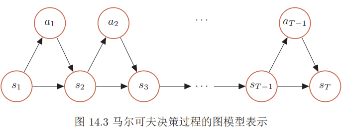

### 深度强化学习

在强化学习中，有两个可以进行交互的对象：智能体和环境。智能体$\text{agent}$可以感知外界环境的状态$\text{state}$和反馈的奖励$\text{reward}$，并进行学习和决策。智能体的决策功能是指根据外界环境的状态来做出不同的动作$\text{action}$，而学习功能是指根据外界环境的奖励来调整策略。环境$\text{environment}$是智能体外部的所有事物，并受智能体动作的影响而改变其状态，并反馈给智能体相应的奖励。

在强化学习中的基本要素包括：
状态$s$是对环境的描述，可以是离散的或连续的，其状态空间为$\mathcal{S}$；动作$a$是对智能体行为的描述，可以是离散的或连续的，其动作空间为$\mathcal{A}$；策略$π(a|s)$是智能体根据环境状态$s$来决定下一步的动作$a$的函数；状态转移概率 $p(s′|s, a) $是在智能体根据当前状态$ s $做出一个动作$ a $之后，环境在下一个时刻转变为状态$s′ $的概率；即时奖励$r(s, a, s′)$是一个标量函数，即智能体根据当前状态$s$做出动作$a$之后，环境会反馈给智能体一个奖励，这个奖励也经常和下一个时刻的状态$s′ $有关。

智能体的策$\text{policy}$就是智能体如何根据环境状态$s$来决定下一步的动作$a$，通常可以分为确定性策略和随机性策略两组。确定性策略是从状态空间到动作空间的映射函数$π : \mathcal{S} → \mathcal{A}$。随机性策略表示在给定环境状态时，智能体选择某个动作的概率分布。
$$
\begin{aligned} \pi(a | s) & \triangleq p(a | s) \\ & \pi(a | s)=1 \end{aligned}
$$
通常情况下，强化学习一般使用随机性的策略。随机性的策略可以有很多优点。比如在学习时可以通过引入一定随机性更好地探索环境。二是使得策略更加地多样性。

马尔可夫过程$\text{Markov Process}$是具有马尔可夫性的随机变量序列$s_0, s_1, · · · ，s_t ∈\mathcal{S}$，其下一个时刻的状态$s_{t+1} $只取决于当前状态$s_t$，
$$
p\left(s_{t+1} | s_{t}, \cdots, s_{0}\right)=p\left(s_{t+1} | s_{t}\right)
$$
其中$p(s_{t+1}|s_t)$称为状态转移概率，$\sum_{s_{t+1} \in \mathcal{S}} p\left(s_{t+1} | s_{t}\right)=1$

马尔可夫决策过程$\text{Markov Decision Process}$在马尔可夫过程中加入一个额外的变量：动作$\mathbf{a}$，即下一个时刻的状态$ s_{t+1} $和当前时刻的状态$ s_t$以及动作$a_t $相关，
$$
p\left(s_{t+1} | s_{t}, a_{t}, \cdots, s_{0}, a_{0}\right)=p\left(s_{t+1} | s_{t}, a_{t}\right)
$$
其中$p(s_{t+1}|s_t, a_t)$为状态转移概率。
给定策略$π(a|s)$，马尔可夫决策过程的一个轨迹$\tau=s_{0}, a_{0}, s_{1}, r_{1}, a_{1}, \cdots, s_{T-1}, a_{T-1}, s_{T}, r_{T}$的概率为
$$
\begin{aligned} p(\tau) &=p\left(s_{0}, a_{0}, s_{1}, a_{1}, \cdots\right) \\ &=p\left(s_{0}\right) \prod_{t=0}^{T-1} \pi\left(a_{t} | s_{t}\right) p\left(s_{t+1} | s_{t}, a_{t}\right) \end{aligned}
$$

###### 强化学习的目标函数

给定策略$ π(a|s)$，智能体和环境一次交互过程的轨迹 $τ $所收到的累积奖励为总回报。
$$
\begin{aligned} G(\tau) &=\sum_{t=0}^{T-1} r_{t+1} \\ &=\sum_{t=0}^{T-1} r\left(s_{t}, a_{t}, s_{t+1}\right) \end{aligned}
$$
假设环境中有一个或多个特殊的终止状态，当到达终止状态时，一个智能体和环境的交互过程就结束了。这一轮交互的过程称为一个回合或试验；如果环境中没有终止状态，即$T = ∞$，称为持续性强化学习任务，其总回报也可能是无穷大。为了解决这个问题，我们可以引入一个折扣率来降低远期回报的权重。折扣回报定义为
$$
G(\tau)=\sum_{t=0}^{T-1} \gamma^{t} r_{t+1}
$$
其中$γ ∈ [0, 1]$是折扣率。当$γ $接近于$0$时，智能体更在意短期回报；而当$γ$ 接近于$1$时，长期回报变得更重要。

###### 目标函数

因为策略和状态转移都有一定的随机性，每次试验得到的轨迹是一个随机序列，其收获的总回报也不一样。强化学习的目标是学习到一个策略$π_θ(a|s)$来最大化期望回报，即希望智能体执行一系列的动作来获得尽可能多的平均回报。
$$
\mathcal{J}(\theta)=\mathbb{E}_{\tau \sim p_{\theta}(\tau)}[G(\tau)]=\mathbb{E}_{\tau \sim p_{\theta}(\tau)}\left[\sum_{t=0}^{T-1} \gamma^{t} r_{t+1}\right]
$$
其中$θ $为策略函数的参数。

#### 值函数

为了评估一个策略$π $的期望回报，我们定义两个值函数：状态值函数和状态-动作值函数。

##### 状态值函数

一个策略$π $期望回报可以分解为：重期望公式$E(X)=E(E(X|Y))$
$$
\begin{aligned} \mathbb{E}_{\tau \sim p(\tau)}[G(\tau)] &=\mathbb{E}_{s \sim p\left(s_{0}\right)}\left[\mathbb{E}_{\tau \sim p(\tau)}\left[\sum_{t=0}^{T-1} \gamma^{t} r_{t+1} | \tau_{s_{0}}=s\right]\right] \\ &=\mathbb{E}_{s \sim p\left(s_{0}\right)}\left[V^{\pi}(s)\right] \end{aligned}
$$
其中$V^π(s)$称为状态值函数，表示从状态$s$开始，执行策略$π $得到的期望总回报
$$
V^{\pi}(s)=\mathbb{E}_{\tau \sim p(\tau)}\left[\sum_{t=0}^{T-1} \gamma^{t} r_{t+1} | \tau_{s_{0}}=s\right]
$$
其中$τ_{s_0}$ 表示轨迹$τ $的起始状态。

根据马尔可夫性，Vπ(s)可展开得到
$$
\begin{array}{l}{V^{\pi}(s)=\mathbb{E}_{\tau_{0 : T} \sim p(\tau)}\left[r_{1}+\gamma \sum_{t=1}^{T-1} \gamma^{t-1} r_{t+1} | \tau_{s 0}=s\right]} \\ {=\mathbb{E}_{a \sim \pi(a | s)} \mathbb{E}_{s^{\prime} \sim p\left(s^{\prime} | s, a\right)} \mathbb{E}_{\tau_{1 : T} \sim p(\tau)}\left[r\left(s, a, s^{\prime}\right)+\gamma \sum_{t=1}^{T-1} \gamma^{t-1} r_{t+1} | \tau_{s_{1}}=s^{\prime}\right]}\\
=\mathbb{E}_{a \sim \pi(a | s)} \mathbb{E}_{s^{\prime} \sim p\left(s^{\prime} | s, a\right)}\left[r\left(s, a, s^{\prime}\right)+\gamma \mathbb{E}_{\tau_{1 : T} \sim p(\tau)}\left[\sum_{t=1}^{T-1} \gamma^{t-1} r_{t+1} | \tau_{s_{1}}=s^{\prime}\right]\right]\\
=\mathbb{E}_{a \sim \pi(a | s)} \mathbb{E}_{s^{\prime} \sim p\left(s^{\prime} | s, a\right)}\left[r\left(s, a, s^{\prime}\right)+\gamma V^{\pi}\left(s^{\prime}\right)\right]
\end{array}
$$
如果给定策略$π(a|s)$，状态转移概率$p(s′|s, a)$和奖励$r(s, a, s′)$，我们就可以通过迭代的方式来计算$V^π(s)$。由于存在折扣率，迭代一定步数后，每个状态的值函数就会固定不变。

##### 状态-动作值函数

$$
Q^{\pi}(s, a)=\mathbb{E}_{s^{\prime} \sim p\left(s^{\prime} | s, a\right)}\left[r\left(s, a, s^{\prime}\right)+\gamma V^{\pi}\left(s^{\prime}\right)\right]
$$

状态-动作值函数也经常称为$Q$函数。

状态值函数$V^π(s)$是$Q$函数$Q^π(s, a)$关于动作a的期望，
$$
V^{\pi}(s)=\mathbb{E}_{a \sim \pi(a | s)}\left[Q^{\pi}(s, a)\right]
$$
$Q$函数还可以写为
$$
Q^{\pi}(s, a)=\mathbb{E}_{s^{\prime} \sim p\left(s^{\prime} | s, a\right)}\left[r\left(s, a, s^{\prime}\right)+\gamma \mathbb{E}_{a^{\prime} \sim \pi\left(a^{\prime} | s^{\prime}\right)}\left[Q^{\pi}\left(s^{\prime}, a^{\prime}\right)\right]\right]
$$
这是关于$Q$函数的贝尔曼方程。

值函数可以看作是对策略$π$的评估。如果在状态$s$，有一个动作$a$使得$Q^π(s, a) >V^π(s)$，说明执行动作$a$比当前的策略$π(a|s)$要好，我们就可以调整参数使得策略$π(a|s)$的概率增加。

深度强化学习是将强化学习和深度学习结合在一起，用强化学习来定义问题和优化目标，用深度学习来解决策略和值函数深度强化学习是将强化学习和深度学习结合在一起，用强化学习来定义问题和优化目标，用深度学习来解决策略和值函数

#### 基于值函数的学习方法

值函数是对策略π的评估，如果策略π有限（即状态数和动作数都有限）时，可以对所有的策略进行评估并选出最优策略π∗。