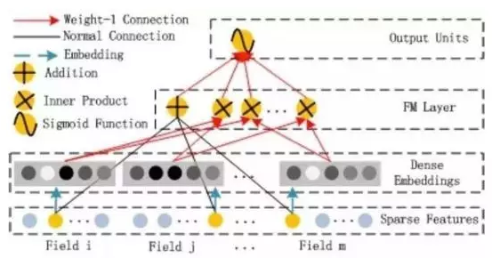
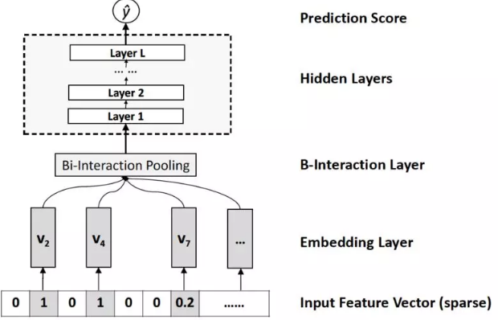

##### `DSSM`

在搜索广告的场景中，`query` 和 `document` 使用不同的单词、同一个单词的不同形态来表达同一个概念。如果简单的通过文本的单词匹配来计算 `query` 和 `document` 的相似性，则效果不好。

- 一种解决方式是：利用潜在语义模型（如：`LSA`），将 `query` 和 `document` 都降维到低维语义空间，然后根据二者在低维空间的距离来计算二者相似度。
- `DSSM` 模型将 `query` 和 `document` 降维到公共的低维空间。在该低维空间中，`query` 和 `document` 的相似性也是通过二者的距离来衡量。

为解决搜索广告中词汇量大的问题，模型采用了 `word hash` 技术。

`DSSM` 模型将原始的文本特征映射到低维的语义空间。

- 首先将 `query` 和 `document` 表示为词频向量，该向量由每个单词出现的词频组成。

- 然后将$\vec{\mathbf{q}}$和$\vec{\mathbf{d}}$映射到低维语义空间，得到 `query` 语义向量$\vec{\mathbf{y}}_q$和 `document` 语义向量$\vec{\mathbf{y}}_d$。

- 计算$\vec{\mathbf{y}}_q$和$\vec{\mathbf{y}}_d$的相似度：
  $$
  R(\vec{\mathbf{q}},\vec{\mathbf{d}})=\cos(\vec{\mathbf{y}}_q,\vec{\mathbf{y}}_d)=\frac{\vec{\mathbf{y}}_q\cdot\vec{\mathbf{y}}_d}{||\vec{\mathbf{y}}_q||\times||\vec{\mathbf{y}}_d||}
  $$

- 给定 `query i` ，计算所有`document` 与它的相似度，并截取 `top K` 个 `document` 即可得到排序结果：
  $$
  \mathbb{L}_i=\{\vec{\mathbf{d}}|\max_{\text{topK}}R(\vec{\mathbf{q}}_i,\vec{\mathbf{d}})\text{ and } \vec{\mathbf{d}}\in\mathcal{D}_i\}
  $$
  其中$\mathbb{L}_i$​是 `query i` 的排序结果，$\mathcal{D}_i$​​是所有与 `query i` 有关的文档。

假设输入向量为$\vec{\mathbf{x}}$​​​，输出向量为$\vec{\mathbf{y}}$​​​，网络一共有$L$​​​层。对于 `query`，输入就是$\vec{\mathbf{q}}$​​​，输出就是$\vec{\mathbf{y}}_q$​​​；对于 `document`，输入就是$\vec{\mathbf{d}}$​​​，输出就是$\vec{\mathbf{y}}_d$​​​ 。第$l$层的隐向量为：
$$
\begin{array}{cc}\vec{\mathbf{h}}_1=\mathbf{W}_1\vec{\mathbf{x}}\\
\vec{\mathbf{h}}_l=\sigma(\mathbf{W}_i\vec{\mathbf{h}}_{i-1}+\vec{\mathbf{b}}_i),&i=2,3,\cdots,L\\
\vec{\mathbf{y}}=\vec{\mathbf{h}}_L

\end{array}
$$
给定 `query`$\vec{\mathbf{q}}$​和 `document`$\vec{\mathbf{d}}$​，用户点击该文档的概率为：
$$
p(\vec{\mathbf{d}}|\vec{\mathbf{q}})=\frac{\exp\left(\gamma\times R(\vec{\mathbf{q}},\vec{\mathbf{d}})\right)}{\sum_{\vec{\mathbf{d}}^{\prime}\in\mathcal{D}}\exp\left(\gamma\times R(\vec{\mathbf{q}},\vec{\mathbf{d}}^{\prime})\right)}
$$
其中$\gamma$为平滑因子，它是一个超参数，需要根据验证集来执行超参数搜索。$\mathcal{D}$是候选的文档集合。

实际应用中，给定一对点击样本$(\vec{\mathbf{q}},\vec{\mathbf{d}}^{+})$，我们从曝光但是未点击的文档中随机选择 篇文档作为负样本$(\vec{\mathbf{q}},\vec{\mathbf{d}}^{-}),k=1,\cdots,K$，则$\mathcal{D}=\{\vec{\mathbf{d}}^{+},\vec{\mathbf{d}}^{-}_1,\cdots,\vec{\mathbf{d}}^{-}_K\}$。模型训练的目标是：最大化点击样本的对数似然：
$$
\mathcal{L}=-\log\prod_{(\vec{\mathbf{q}},(\vec{\mathbf{q}},\vec{\mathbf{d}}^{+}))}p(\vec{\mathbf{d}}^{+}|\vec{\mathbf{q}})
$$

然后基于随机梯度下降优化算法来求解该最优化问题。注意：这里并没有计算负样本的概率$p(\vec{\mathbf{d}}^{-}|\vec{\mathbf{q}})$，负样本的信息在计算概率$p(\vec{\mathbf{d}}^{+}|\vec{\mathbf{q}})$时被使用。

###### `word hash`

在将 `query/document` 的文本转化为输入向量的过程中，输入向量的维度等于词表的大小。由于实际 `web search` 任务中的词汇表非常庞大，这导致 `DSSM` 网络的输入层的参数太多，模型难以训练。为解决该问题，`DSSM` 模型在第一层引入 `word hash` 技术。该层是一个线性映射，虽然参数非常多，但是这些参数不需要更新和学习。

`word hash` 技术用于降低输入向量的维度。给定一个单词，如：`good`，`word hash` 的步骤为：

- 首先添加开始标记、结束标记：`#good#`
- 然后将其分解为字符级的 `n-gram` 格式：`#go,goo,ood,od#` （`n=3` 时）
- 最后将文本中的单词 `good` 用一组 `char-level n-gram` 替代。

除此之外，`word-hash` 技术还有以下优点：

- 它能够将同一个单词的不同形态变化映射到 `char-level n-gram` 空间中彼此接近的点。
- 它能够有效缓解 `out-of-vocabulary:OOV` 问题。在推断期间，虽然有些词汇未出现在训练集中，但是当拆解未 `char-level n-gram` 之后，每个 `n-gram` 都在训练集中出现过。
- 从单词到 `char-level n-gram` 的映射关系是固定的线性映射，不需要学习。

##### `FNN`

传统的 `CTR` 预估模型大多数采用线性模型。线性模型的优点是易于实现，缺点是：模型表达能力较差，无法学习特征之间的相互作用 `interaction` 。非线性模型（如：`FM,GBDT`）能够利用不同的组合特征，因此能够改善模型的表达能力。但是这些特征无法利用不同特征的任意组合。

`FNN` 和 `SNN` 的主要思路是：从 `sparse feature`$\vec{\mathbf{x}}$学到 `dense representation`$\vec{\mathbf{z}}$；将$\vec{\mathbf{z}}$作为一个深度前馈神经网络的输入，输出为概率$\hat{y}$。二者的区别在于学到$\vec{\mathbf{z}}$的方式不同。

`FNN` 模型结合了神经网络和 `FM` 模型，网络分为以下几层：

- 第 0 层输入层：`categorical` 经过 `one-hot` 编码之后作为输入，该层也被称作 `sparse binary feature` 层。
- 第1层`embedding` 层：输入层经过局部连接生成`embedding` 向量，该层也被称作 `dense real layer` 层。
- 第2层到第$L$层：全连接层。
- 最后一层：`sigmoid` 输出层。

`FNN` 的核心在于 `embedding` 向量的生成。假设有$F$个 `field`，`one-hot` 向量为$\vec{\mathbf{x}}$，`field i`在向量中的起始位置为$s_i$、终止位置为$e_i$（包含）。每个 `field` 生成一个 `embedding` 向量。即 `field i` 生成$\vec{\mathbf{z}}_i=(\omega_i,v_1^i,\cdots,v_K^i)\in \mathbb{R}^{K+1}$。同时还有全局`bias` 。即：$\vec{\mathbf{z}}=(\omega_0,\omega_1,v_1^1,\cdots,v_K^1,\cdots,v_1^F,\cdots,v_K^F)^T$。输入位置$s_i\sim e_i$仅仅与$\vec{\mathbf{z}}_i$相连，即：局部连接：
$$
\vec{\mathbf{z}}_i = \mathbf{W}_0^i(x_{s_i},\cdots,x_{e_i})^T
$$
$\vec{\mathbf{z}}$由 `FM` 模型初始化。由于采用逐层预训练，因此一旦初始化$\vec{\mathbf{z}}$之后就固定。因此求解 `FM` 的过程就是求解$\mathbf{W}_0$的过程，且一旦初始化后就冻结$\mathbf{W}_0$，直到最后的微调阶段才更新$\mathbf{W}_0$。

一旦进行了 `FM` 预训练和 `layer-wise RBM` 预训练之后，则可以通过监督学习来微调模型。模型的损失函数为交叉熵：
$$
\begin{array}{c}\mathcal{L}(y,\hat{y}) = -\left[y\log\hat{y}+(1-y)\log(1-\hat{y})\right]\\
\frac{\part \mathcal{L}}{\part \mathbf{W}_0^i}=\sum_{k=1}^{K+1}\frac{\part \mathcal{L}}{\part z_{i,k}}\frac{\part z_{i,k}}{\mathbf{W}_0^i}=\frac{\part \mathcal{L}}{\part \vec{\mathbf{z}}_i}(x_{s_i},\cdots,x_{e_i})\end{array}
$$
当$x_j$​时，对应梯度为0。因此只需要更新$\vec{\mathbf{x}}$​非零的分量对应的参数，这大大降低了参数更新的计算量。

###### `SNN`

`SNN` 和 `FNN` 的区别在于第一层的网络结构，在 `SNN` 中第一层是全连接的。
$$
\vec{\mathbf{z}}=\sigma(\mathbf{W}_0\vec{\mathbf{x}}+\vec{\mathbf{b}}_0)
$$
$\mathbf{W}_0,\vec{\mathbf{b}}_0$为第一层的网络参数。第一层参数可以通过两种预训练方式来预训练：`RBM` 或者 `DAE`

##### `PNN`

`PNN` 模型，该模型构建了一个 `embedding` 层来学习离散特征的分布式`representation`，构建一个 `product` 层来自动捕捉离散特征的潜在高阶模式。

假设有$F$个 `field`，`one-hot` 向量为$\vec{\mathbf{x}}$，`field i`在向量中的起始位置为$s_i$、终止位置为$e_i$（包含）。每个 `field` 生成一个 `embedding` 向量。即 `field i` 生成$\vec{\mathbf{z}}_i=(v_1^i,\cdots,v_K^i)\in \mathbb{R}^{K}$。

模型包含以下几层：

- 第 0 层输入层：`categorical` 经过 `one-hot` 编码之后作为输入

- 第1层`embedding` 层：模型从每个 `field` 中学得各 `field` 的 `embedding` 表示。
  $$
  \vec{\mathbf{z}}_i = \mathbf{W}_0^i(x_{s_i},\cdots,x_{e_i})^T
  $$
  其中$\mathbf{W}^i_0\in\mathbb{R}^{K\times(e_i-s_i+1)}$为映射参数，它由$\mathbf{W}_0$的第$s_i$到第$e_i$列组成。
  
- 第2层 `product` 层：由`embedding` 特征的一阶特征和二阶交叉特征拼接而成。其中$\mathbf{z}$​部分表示一阶特征，$\mathbf{p}$​部分表示二阶特征。为统一生成方式，$\mathbf{z}$​由常数 `1` 和一阶特征交叉生成。

$$
\begin{array}{c}\mathbf{z} = \left[\vec{\mathbf{z}}_1,\cdots,\vec{\mathbf{z}}_F\right]\in\mathbb{R}^{K\times F}\\
\mathbf{p}={p_{i,j}},i=1,\cdots,F;j=1,2,\cdots,F\\
p_{i,j} = g(\vec{\mathbf{z}}_i,\vec{\mathbf{z}}_j)
\end{array}
$$

$g(\cdot,\cdot)$表示成对特征交叉，当定义不同的$g$函数时，就定义了不同的 `PNN` 实现。该层的输出为：
$$
\begin{array}{c}h_z^i = \mathbf{W}_z^i\odot\mathbf{z},h_p^i=\mathbf{W}_p^i\odot\mathbf{p}\\
\vec{\mathbf{h}}_z = (h_z^1,\cdots,h_z^{d_1})^T,\vec{\mathbf{h}}_p = (h_p^1,\cdots,h_p^{d_1})^T\\
\vec{\mathbf{h}}_2 = \text{relu}(\vec{\mathbf{h}}_z+\vec{\mathbf{h}}_p+\vec{\mathbf{b}}_1)\end{array}
$$
其中$d_1$表示对提取的一阶特征和二阶特征通过$\mathbf{W}_z$和$\mathbf{W}_p$各自分别进行进一步的特征抽取的数量。$\mathbf{W}_z^i,\mathbf{W}_p^i$类似于 `CNN` 的卷积核，其尺寸为整个图片大小，$d_1$为卷积核的数量，$i$表示第$i$个卷积核。$\odot$表示张量的内积，定义为：$\mathbf{A}\odot\mathbf{B}=\sum_{i,j}A_{i,j}\times B_{i,j}$

- 第3层到第 层：全连接层。

- 最后一层：`sigmoid` 输出层。$\hat{y}=\text{sigmoid}(\vec{\mathbf{h}}_L)$

  

模型的损失函数为 `logloss`：
$$
\mathcal{L} = -\frac{1}{N}\sum_{i=1}^N\left[y_i\log\hat{y}_i+(1-y_i)\log(1-\hat{y}_i)\right]
$$
`IPNN` 的特征交叉函数为：$p_{i,j} = g(\vec{\mathbf{z}}_i,\vec{\mathbf{z}}_j)=\vec{\mathbf{z}}_i\cdot\vec{\mathbf{z}}_j$

`OPNN` 的特征交叉函数为：$p_{i,j} = g(\vec{\mathbf{z}}_i,\vec{\mathbf{z}}_j)=\vec{\mathbf{z}}_i\vec{\mathbf{z}}_j^T$与内积产生标量不同，这里的外积产生一个矩阵。则$\mathbf{p}\in\mathbb{R}^{F\times F\times K\times K},\mathbf{W}_p^i\in\mathbb{R}^{F\times F\times K\times K}$

##### `DeepCrossing`

该模型利用深度神经网络来自动组合特征从而生成高阶特征。虽然 `Deep Crossing` 模型能够自动组合原始特征，但是收集原始数据并提取原始特征仍需要用户的大量精力。

`DeepCrossing` 模型的输入是原始特征，模型有四种类型的`Layer`：

- `Embedding Layer`：将原始特征映射成 `embedding` 向量。假设原始特征`one-hot` 向量为$\vec{\mathbf{x}}$，`field i`在向量中的起始位置为$s_i$、终止位置为$e_i$（包含）。

$$
\vec{\mathbf{E}}^i = \text{relu}(\mathbf{W}^i(x_{s_i},\cdots,x_{e_i})^T+\vec{\mathbf{b}}^i)\in\mathbb{R}^{m_i}
$$

其中$\mathbf{W}^i\in\mathbb{R}^{m_i\times(e_i-s_i+1)},\vec{\mathbf{b}}_i\in\mathbb{R}^{m_i}$为参数，$m_i$为第$i$个 `embedding` 的维度。对于某些维度较小的原始特征，无需进行 `embedding` 层，而是直接输入到 `Stacking Layer` 层。这是在模型大小和信息保留程度之间的折衷：完全保留信息（原始输入），则可能使得模型过大；全部使用 `embedding`，则可能信息丢失太多

- `Stacking Layer`：所有 `embedding` 特征和部分原始特征拼接成一个向量：

$$
\vec{\mathbf{h}}_1=<\vec{\mathbf{E}}^1,\cdots,\vec{\mathbf{E}}^K>
$$

其中$<\cdot>$表示特征拼接，$K$为原始特征的数量，$\vec{\mathbf{E}}$为 `embedding` 向量。如果是直接输入的原始特征，则$\vec{\mathbf{E}}$表示该原始特征的 `one-hot` 向量。

- `Residual Unit Layer`：基于残差单元 `Residual Unit` 构建的残差层，其输出为：$\vec{\mathbf{h}}_l=\mathcal{F}(\vec{\mathbf{h}}_{l-1};\mathbf{W}_0^{l},\mathbf{W}_1^l,\vec{\mathbf{b}}_0^l,\vec{\mathbf{b}}_1^l)+\vec{\mathbf{h}}_{l-1}$其中$\mathcal{F}(\cdot)$为残差单元：
  $$
  \mathcal{F}(\vec{\mathbf{h}}_{l-1};\mathbf{W}_0^{l},\mathbf{W}_1^l,\vec{\mathbf{b}}_0^l,\vec{\mathbf{b}}_1^l)=\text{relu}\left[\mathbf{W}_1^l\left(\text{relu}(\mathbf{W}_0^{l}\vec{\mathbf{h}}_{l-1}+\vec{\mathbf{b}}_0^l)\right)+\vec{\mathbf{b}}_1^l\right]
  $$

- `Scoring Layer`：`sigmoid` 输出层。其输出为：$\hat{y}=\text{sigmoid}(\vec{\mathbf{w}}\cdot\vec{\mathbf{h}}_{L-1}+b)$。其中$\vec{\mathbf{w}},b$为参数，$\vec{\mathbf{h}}_{L-1}$为前一层的隐向量，$L$为总的层数。

模型的损失函数为负的 `Logloss`：
$$
\mathcal{L} = -\frac{1}{N}\sum_{i=1}^N\left[y_i\log\hat{y}_i+(1-y_i)\log(1-\hat{y}_i)\right]
$$

##### `Wide&Deep`

推荐系统中的一个挑战是：同时实现 `memorization` 和 `generalization`。

- `memorization`：学到 `item` 或者 `feature` 共现关系，并基于历史数据中的这种相关性来推荐。基于`memorization` 的推荐通常更具有话题性，并且和用户已经发生行为的 `item` 直接关联。
- `generalization`：根据 `item` 或者 `feature` 的共现关系，探索过去从未发生或者很少发生的新特征组合。基于 `generalization` 的推荐通常更具有多样性。

广义线性模型（称为 `wide` 模型）可以通过大量交叉特征来记住特征交互 `feature interaction` ，即 `memorization` 。其优点是可解释性强，缺点是：为了提升泛化能力，需要人工执行大量的特征工程。

深度神经网络模型（称为 `deep` 模型）只需要执行较少的特征工程即可泛化到未出现的特征组合，即 `generalization` 。其优点是泛化能力强，缺点是容易陷入过拟合。

`Wide & Deep` 模型包含一个 `linear model:LM` 部分和一个 `neural network:NN` 部分。设模型的输入特征向量为$\vec{\mathbf{x}}=(x_1,\cdots,x_d)^T$是一个$d$维的特征向量（经过 `one-hot` ），仅包含原始特征。$\phi(\cdot)$表示特征交叉转换函数，$\phi(\vec{\mathbf{x}})$包含转换后的特征。

- `LM` 部分：即左侧的 `wide` 子模型，它是一个线性模型：

$$
y = \vec{\mathbf{w}}\cdot<\vec{\mathbf{x}},\phi(\vec{\mathbf{x}})>+b
$$

其中$<\cdot>$表示特征拼接，$\vec{\mathbf{w}}\in\mathbb{R}^{d+d^{\prime}}$是模型参数，$b$为偏置。

`NN` 部分：即右侧的 `deep` 子模型，它是一个 `DNN` 模型。

- 输入层：为了缓解模型的输入大小，`DNN` 的所有离散特征的输入都是原始特征，而没有经过 `one-hot` 编码转换。
- 第一层 `embedding` 层：将高维稀疏的 `categorical` 特征转换为低维的 `embedding` 向量。
- 第二层特征拼接层：将所有的 `embedding` 向量拼接成一个 `dense feature` 向量。
- 后续每一层都是全连接层：$\vec{\mathbf{h}}^{l+1}=\sigma(\mathbf{W}\vec{\mathbf{h}}^{l}+\vec{\mathbf{b}}^{l})$

模型联合了 `wide` 和 `deep` 的输出：
$$
\hat{y} = p(y=1|\vec{\mathbf{x}})=\text{sigmoid}(\vec{\mathbf{w}}_{\text{wide}}\cdot<\vec{\mathbf{x}},\phi(\vec{\mathbf{x}})>+\vec{\mathbf{w}}_{\text{deep}}\cdot\vec{\mathbf{h}}^L+b)
$$
模型的损失函数为负的对数似然，并通过随机梯度下降来训练：
$$
\mathcal{L} = -\frac{1}{N}\sum_{i=1}^N\left[y_i\log\hat{y}_i+(1-y_i)\log(1-\hat{y}_i)\right]
$$
`Wide&Deep` 模型与 `LM & DNN` 的 `ensemble` 集成模型不同。

- 在集成模型中，每个子模型都是独立训练的，只有预测时才将二者结合在一起。

  在 `Wide&Deep` 模型中，每个子模型在训练期间就结合在一起，共同训练。

- 在集成模型中，每个子模型必须足够大从而足够健壮，使得子模型集成之后整体的 `accuracy` 等性能足够高。在 `Wide&Deep` 模型中，每个子模型都可以比较小，尤其是 `wide` 部分只需要少量的特征交叉即可。

##### `DCN`

`DCN` 模型保留了 `DNN` 的优点。此外，`DCN` 提出了一种新的`cross network` ，该网络能够高效学习高阶特征交互。

`DCN` 无论在模型表现以及模型大小方面都具有显著优势。其优点：

- `cross network` 显式的在每层应用特征交叉，有效的学习了预测能力强的交叉特征，无需人工特征工程。
- `cross network` 简单高效，可以学习高阶交叉特征。每增加一层，能够学到的交叉特征的阶数就加一阶。
- 模型表现更好，且参数要比 `DNN` 少一个量级。

`DCN` 模型结构如下图所示，模型包含 `embedding and stacking` 层、`cross network`、`deep network` 三个组成部分。

`embedding and stacking` 层：假设输入包含 `sparse` 特征和 `dense` 特征。设原始特征为向量$\vec{\mathbf{x}}$，其中：
$$
\vec{\mathbf{x}}=<\vec{\mathbf{x}}_{\text{sparse}}^1,\cdots,\vec{\mathbf{x}}_{\text{sparse}}^K,\vec{\mathbf{x}}_{\text{dense}}>
$$
其中$\vec{\mathbf{x}}_{\text{sparse}}^i$为 `field i` 的 `one-hot` 向量，$\vec{\mathbf{x}}_{\text{dense}}$为经过归一化的 `dense` 特征，$<\cdot>$为向量拼接。首先将 `field i` 的特征映射到 `embedding` 向量：
$$
\vec{\mathbf{x}}_{\text{embed}}^i=\mathbf{W}_{\text{embed}}^i\vec{\mathbf{x}}_{\text{sparse}}^i
$$
其中$\vec{\mathbf{x}}_{\text{sparse}}^i$为`one-hot` 向量长度，$\mathbf{W}_{\text{embed}}^i\in\mathbb{R}^{e_i\times d_i}$为参数。然后将 `embedding` 向量和归一化的 `dense` 特征拼接成向量：
$$
\vec{\mathbf{x}}^0=<\vec{\mathbf{x}}_{\text{embed}}^1,\cdots,\vec{\mathbf{x}}_{\text{embed}}^K,\vec{\mathbf{x}}_{\text{dense}}>\in\mathbb{R}^{e_i+\cdots+e_K+d_s}
$$
其中$d_s$为 的向量长度。`embedding and stacking` 层就是将$\vec{\mathbf{x}}$转换为$\vec{\mathbf{x}}^0$。

`cross network`：`cross network` 核心思想是以高效的方式显式应用特征交叉。`cross network` 由交叉层构成，每层的输入输出为：
$$
\vec{\mathbf{x}}_{l+1}=\vec{\mathbf{x}}_0\vec{\mathbf{x}}_l^T\vec{\mathbf{w}}_{l+1}+\vec{\mathbf{b}}_{l+1}+\vec{\mathbf{x}}_l=f(\vec{\mathbf{x}}_l,\vec{\mathbf{w}}_{l+1},\vec{\mathbf{b}}_{l+1})+\vec{\mathbf{x}}_l
$$
其中$\vec{\mathbf{x}}_l$为第$l$层的输出，$\vec{\mathbf{w}}_{l},\vec{\mathbf{b}}_{l}\in\mathbb{R}^d$为第$l$层的参数。 其中$d=e_1+\cdots+e_K+d_s$。每一层的输出都包含两个部分：该层的输入$\vec{\mathbf{x}}_l$、交叉特征$f$ 。`cross network` 的本质是用$\vec{\mathbf{x}}_0\vec{\mathbf{x}}_l^T$来捕获所有的特征交叉，这种方式避免了存储整个矩阵以及矩阵乘法运算。由于`cross network` 的参数很少，所以这部分网络的容量较小，网络过于简单，模型容易陷入欠拟合。为了加强模型的学习能力，`DCN` 在右侧引入了并行的 `deep `

`deep network`：`deep network` 部分是一个简单的全连接前馈神经网络：
$$
\vec{\mathbf{h}}_{l+1}=\sigma(\vec{\mathbf{W}}_{l}\vec{\mathbf{h}}_{l}+\vec{\mathbf{b}}_{l})
$$
`DCN` 通过拼接层 `combination layer` 来拼接 `cross network` 和 `deep network` 两个网络的输出向量，然后输出到标准的 `sigmoid` 输出层：
$$
\hat{y}=\text{sigmoid}(\mathbf{W}_{\text{logits}}<\vec{\mathbf{x}}_{L1},\vec{\mathbf{h}}_{L2}>+\vec{\mathbf{b}}_{\text{logits}})
$$
其中$\hat{y}$为预测的点击概率，$\vec{\mathbf{x}}_{L1}$为 `cross network` 的输出向量，$\vec{\mathbf{h}}_{L2}$为 `deep network` 的输出向量，$\mathbf{W}_{\text{logits}},\vec{\mathbf{b}}_{\text{logits}}$为模型参数。模型的损失函数为带正则化的对数似然函数：
$$
\mathcal{L} = -\frac{1}{N}\sum_{i=1}^N\left[y_i\log\hat{y}_i+(1-y_i)\log(1-\hat{y}_i)\right]+\lambda\sum_{l}||\mathbf{W}_l||^2_2
$$
`cross network` 可以理解为：多项式逼近 `polynomial approximation`、`FM` 泛化`generalization to FM` 、或者有效投影`efficient projection` 。

##### `DeepFM`

 `DeepFM` 模型结合了 `FM` 的推荐能力和 `DNN` 的特征学习能力，综合利用了低阶交叉特征和高阶交叉特征。其特点有：

- `DeepFM` 集成了 `FM` 和 `DNN`，可以对低阶交叉特征和高阶交叉特征建模，同时无需对原始输入执行任何特征工程。
- `DeepFM` 的 `wide` 部分和 `deep` 部分共享输入及`embedding`

`DeepFM` 模型由两种组件构成：`FM` 组件、`deep` 组件，它们共享输入。这种共享输入使得`DeepFM` 可以同时从原始特征中学习低阶特征交互和高阶特征交互，完全不需要执行特征工程

假设输入包含 `sparse` 特征和 `dense` 特征。设原始特征为向量$\vec{\mathbf{x}}$，其中：
$$
\vec{\mathbf{x}}=<\vec{\mathbf{x}}_{\text{sparse}}^1,\cdots,\vec{\mathbf{x}}_{\text{sparse}}^K,\vec{\mathbf{x}}_{\text{dense}}>
$$
其中$\vec{\mathbf{x}}_{\text{sparse}}^i$为 `field i` 的 `one-hot` 向量，$\vec{\mathbf{x}}_{\text{dense}}$为经过归一化的 `dense` 特征，$<\cdot>$为向量拼接。对于特征 `j` （即$x_j$）：

- 标量$\omega_j$用于对它的一阶特征重要性进行建模，即 `FM` 组件左侧的 `+` 部分。
- 向量$\vec{\mathbf{v}}_j$用于对它的二阶特征重要性进行建模，即 `FM` 组件右侧的 `x` 部分。
- 向量$\vec{\mathbf{v}}_j$也作为 `deep` 组件的输入，从而对更高阶特征交互进行建模，即 `deep` 组件。

最终模型联合了 `FM` 组件和 `deep` 组件的输出：
$$
\hat{y} = \text{sigmoid}(\hat{y}_{\text{FM}}+\hat{y}_{\text{DNN}})
$$
`FM` 组件：该部分是一个 `FM` ，用于学习一阶特征和二阶交叉特征。`FM` 组件由两种操作组成：加法 `Addition` 和内积 `Inner Product`：
$$
\hat{y}_{\text{FM}} = \sum_{i=1}^d(\omega_i\times x_i)+\sum_{i=1}^d\sum_{j=i+1}(\vec{\mathbf{v}}_i\cdot\vec{\mathbf{v}}_j)\times x_i\times x_j
$$

`deep` 组件：该部分是一个全连接的前馈神经网络，用于学习高阶特征交互。假设 `embedding` 层的输出为：$\vec{\mathbf{h}}^0=[\vec{\mathbf{e}}_1,\cdots,\vec{\mathbf{e}}_K]$，其中$\vec{\mathbf{e}}_i$为`field i` 的 `embedding` 向量，$\vec{\mathbf{h}}^0$为前馈神经网络的输入。则有：
$$
\vec{\mathbf{h}}^{l+1}=\sigma(\vec{\mathbf{W}}^l\vec{\mathbf{h}}^l+\vec{\mathbf{b}}^l)
$$
最终有：$\hat{y}_{\text{DNN}}=\sigma(\vec{\mathbf{w}}_{\text{dnn}}\vec{\mathbf{h}}^L+b_{\text{dnn}})$

- `FNN`：`FNN` 虽然也用到了 `FM` 模型，但是它仅使用 `FM` 模型来初始化 `FNN` 然后来微调模型。这使得 `FNN` 的 `embedding` 层参数严重受制于 `FM` 模型，从而降低模型效果。另外 `FNN` 仅捕捉高阶特征交互。与之相比，`DeepFM` 不需要预训练，而是端到端的学习低阶特征交互和高阶特征交互。
- `PNN`：虽然 `IPNN` 更可靠，但是由于 `Product` 层的输出连接到第一个隐层的所有神经元，所以计算复杂度较高。同时 `IPNN` 会忽略低阶特征交互。与之相比，`DeepFM` 中的 `Product` 层（即 `FM` 组件）的输出仅仅连接到输出层，计算复杂度很低。
- `Wide&Deep`：虽然 `Wide&Deep` 也可以对低阶特征和高阶特征同时建模，但是 `wide` 部分需要人工特征工程，而这需要业务专家的指导。与之相比，`DeepFM` 直接处理原始特征，不需要任何业务知识。另外，`Wide&Deep` 的一个直接扩展是：使用 `FM` 代替 `wide` 部分的`LR` 模型，记作 `FM&DNN` 模型，原始的 `Wide&Deep` 模型记作 `LR&DNN` 模型。`FM&DNN` 模型更类似于 `DeepFM` 模型。但是 `DeepFM` 在 `FM` 和 `DNN` 之间共享 `embedding` 特征，这种共享策略有助于特征`representation` 学习，使得学到的特征 `representation` 更加精确。

##### `NFM`

`NFM` 模型结合了`FM` 建模二阶特征交互中的线性，以及 `DNN` 建模高阶特征交互中的非线性。

- 和 `FM` 相比，`FM` 可以作为 `NFM` 的一个特例，因此 `NFM` 表达能力比 `FM` 更强。
- 和 `Wide&Deep、DeepCrossing` 相比，`NFM` 网络结构更浅，预测能力更强，更容易训练和调整。

`FM` 的缺点：模型使用一阶特征、二阶交叉特征的线性组合，模型简单，表达能力较弱。

`DNN` 的缺点：在信息检索和数据挖掘任务中，大多数数据都是天然稀疏的。尽管 `DNN` 具备从 `dense` 数据中学习 `pattern` 的强大能力，但是目前还不清楚如何配置网络从而使得模型能够从 `sparse` 数据中有效的学习 `pattern` 。

`NFM` 模型引入了 `Bi-Interaction pooling` 二阶交叉池化层，然后再二阶交叉池化层上方堆叠非线性全连接层。

- 与 `FM` 方法相比，`NFM` 可以视为深层的 `FM`，它在 `FM` 的基础上提升了对高阶特征交叉和非线性特征交叉建模的能力，提升了模型的能力。
- 与传统的 `DNN` 方法仅将底层 `embedding` 向量拼接再一起或者取均值相比，二阶交叉池化层对交叉信息进行编码，为后续的全连接层提供更有意义的信息。

给定经过`one-hot` 编码之后的输入向量$\vec{\mathbf{x}}\in\mathbb{R}^n$，其中特征$x_i=0$表示第$i$个特征不存在。则 `NFM` 的预测结果为：
$$
\hat{y}_{\text{NFM}}(\vec{\mathbf{x}})=\omega_0+\vec{\mathbf{w}}\cdot\vec{\mathbf{x}}+f(\vec{\mathbf{x}})
$$
类似 `FM`，`NFM` 的第一项为全局偏置，第二项为一阶特征。与 `FM` 不同，`NFM` 的第三项$f(\vec{\mathbf{x}})$对交叉特征进行建模，它是一个多层前馈神经网络，包含 `embedding`层、`Bi-Interaction` 层、`Hidden` 层、输出层。

`embedding` 层将每个`feature` 映射到一个 `dense vector representation`，即特征$i$映射到向量$\vec{\mathbf{v}}_i\in\mathbb{R}^k$。一旦得到 `embedding` 向量，则输入$\vec{\mathbf{x}}=(x_1,\cdots,x_n)^T$就可以表示为：
$$
\mathcal{V}_{\vec{\mathbf{x}}}=\{x_1\vec{\mathbf{v}}_1,\cdots,x_n\vec{\mathbf{v}}_n\}
$$
由于输入$\vec{\mathbf{x}}$的稀疏性，$\mathcal{V}_{\vec{\mathbf{x}}}$只需要保存非零的特征。`Bi-Interaction` 层对输入的$\mathcal{V}_{\vec{\mathbf{x}}}$执行池化操作，将一组 `embedding` 向量转换为一个向量，该操作称作 `Bi-Interaction pooling` 操作：
$$
f(\mathcal{V}_{\vec{\mathbf{x}}})=\sum_{i=1}^n\sum_{j=i+1}^nx_i\vec{\mathbf{v}}_i\odot x_j\vec{\mathbf{v}}_j
$$
其中：$\odot$是逐元素乘法；$f(\mathcal{V}_{\vec{\mathbf{x}}})$是一个$k$维向量，它在 `embedding` 空间编码了二阶交叉特征。`Bi-Interaction` 层有两个优秀的特性：

- `Bi-Interaction` 层并没有引入任何额外的模型参数
- `Bi-Interaction` 层可以在线性时间内有效计算：

$$
f(\mathcal{V}_{\vec{\mathbf{x}}})=\frac{1}{2}\left[\left(\sum_{i=1}^nx_i\vec{\mathbf{v}}_i\right)^2-\sum_{i=1}^n(x_i\vec{\mathbf{v}}_i)^2\right]
$$

这些性质意味着 `Bi-Interaction` 层对二阶交叉特征建模的代价很低。另外，`Bi-Interaction` 层也支持求导运算：
$$
\frac{\part}{\part \vec{\mathbf{v}}_i}f(\mathcal{V}_{\vec{\mathbf{x}}})=\left(\sum_{i=1}^nx_i\vec{\mathbf{v}}_i\right)x_i-x_i^2\vec{\mathbf{v}}_i
$$
`Hidden` 层是一组全连接层，用于捕获高阶特征交叉：$\vec{\mathbf{h}}_L=\sigma(\mathbf{W}_L\vec{\mathbf{h}}_{L-1}+\vec{\mathbf{b}}_L)$

输出层用于输出预测得分：$f(\vec{\mathbf{x}})=\vec{\mathbf{h}}_L\cdot \vec{\mathbf{w}}_f$

`NFM` 可以执行不同类型的任务，包括回归、分类、排序 `ranking` 。

- 对于回归任务，损失函数为平方误差：$\mathcal{L}=\sum_{(\vec{\mathbf{x}},y)\in\mathbb{D}}(\hat{y}-\tilde{y})^2$
- 对于分类任务，损失函数为 `hinge loss` 或者 `logloss`。
- 对于排序任务，损失函数为 `pairwise personalized ranking loss` 或者 `contrastive max-margin loss` 。

`NFM` 并未采用常规的$\text{L}_1,\text{L}_2$​正则化，而是采用 `dropout` 和 `Batch Normalization` 。

- 为了防止 `feature embedding` 出现 `co-adapt` 并过拟合 ，`NFM` 对 `Bi-Interaction` 层的输出执行 `dropout` 。即：在 `Bi-Interaction` 层之后接入一个 `Dropout` 层，随机丢弃 比例的神经元。
- 为防止过拟合，`NFM` 也对 `Bi-Interaction` 层和后续层的输出执行 `Batch Normalization` 。 

##### `AFM`

`FM` 将所有二阶交叉特征都认为是同等重要的，事实上并非如此。有一些二阶交叉特征是没有价值的，可能会引入噪声并且降低模型性能。`AFM` 模型通过 `attention` 机制来自动学习每个二阶交叉特征的重要性。与 `Wide&Deep` 以及 `DeepCross` 等模型相比，`AFM` 结构简单、参数更少、效果更好。同时 `AFM` 具有很好的可解释性：通过注意力权重可以知道哪些交叉特征对于预测贡献较大。

`AFM` 模型和 `NFM` 模型一脉相承，其底层架构基本一致。给定经过`one-hot` 编码之后的输入向量$\vec{\mathbf{x}}\in\mathbb{R}^n$，其中特征$x_i=0$表示第$i$个特征不存在。则 `NFM` 的预测结果为：
$$
\hat{y}_{\text{NFM}}(\vec{\mathbf{x}})=\omega_0+\vec{\mathbf{w}}\cdot\vec{\mathbf{x}}+f(\vec{\mathbf{x}})
$$
类似 `FM`，`AFM` 的第一项为全局偏置，第二项为一阶特征。与 `FM` 不同，`NFM` 的第三项$f(\vec{\mathbf{x}})$对交叉特征进行建模，包含 `embedding`层、`Pair-wise Interaction` 成对交叉层、`Attention-based Pooling` 层、输出层。

`embedding` 层将每个`feature` 映射到一个 `dense vector representation`，即特征$i$映射到向量$\vec{\mathbf{v}}_i\in\mathbb{R}^k$。一旦得到 `embedding` 向量，则输入$\vec{\mathbf{x}}=(x_1,\cdots,x_n)^T$就可以表示为：
$$
\mathcal{V}_{\vec{\mathbf{x}}}=\{x_1\vec{\mathbf{v}}_1,\cdots,x_n\vec{\mathbf{v}}_n\}
$$
由于输入$\vec{\mathbf{x}}$的稀疏性，$\mathcal{V}_{\vec{\mathbf{x}}}$只需要保存非零的特征。

`AFM` 的 `Pair-wise Interaction` 层将$m$​个向量扩充为$m\times(m-1)/2$​个交叉向量，每个交叉向量是两个 `embedding` 向量的逐元素积。$m\le n$​为$\vec{\mathbf{x}}$​中非零元素数量。假设输入$\vec{\mathbf{x}}$​的非零元素下标为$\mathcal{X}$​，对应的 `embedding` 为$\Psi=\{x_i\vec{\mathbf{v}}_i\}_{i\in\mathcal{X}}$​，则 `Pair-wise Interaction` 层的输出为：
$$
f(\Psi)=\{(\vec{\mathbf{v}}_i\odot\vec{\mathbf{v}}_j)x_ix_j\}_{(i,j)\in\mathcal{R}_x}
$$
$\mathcal{R}_x=\{(i,j)\}_{i\in\mathcal{X},j\in\mathcal{X},j>i}$​表示成对下标集合。一旦得到`Pair-wise Interaction` 层的$m\times(m-1)/2$​个交叉向量，则可以通过一个 `sum pooling` 层来得到一个池化向量：
$$
\vec{\mathbf{v}}_{\text{pool}}=\sum_{(i,j)\in\mathcal{R}_x}(\vec{\mathbf{v}}_i\odot\vec{\mathbf{v}}_j)x_ix_j
$$
它刚好就是 `Bi Interaction` 层的输出 。因此 `Pair-wise Interaction层` + `sum pooling 层` = `Bi Interaction 层`。

`Attention-based Pooling` 层：与 `Bi Interaction pooling` 操作不同，`Attention-based Pooling` 操作采用了 `attention` 机制：
$$
f_{\text{Att}}(f(\Psi)) =\sum_{(i,j)\in\mathcal{R}_x}(\vec{\mathbf{v}}_i\odot\vec{\mathbf{v}}_j)\times x_ix_j\times a_{i,j}
$$
其中$a_{i,j}$是交叉特征$(i,j)$的`attention score` ，可以理解为交叉特征$(i,j)$的权重。学习$a_{i,j}$的一个方法是直接作为模型参数来学习，但这种方法有个严重的缺点：对于从未在训练集中出现过的交叉特征，其 `attentioin score` 无法训练。为解决该问题，论文使用一个 `attention network` 来训练$a_{i,j}$。`attention network` 的输入为$m\times(m-1)/2$个交叉特征向量，输出为$a_{i,j}$。
$$
\begin{array}{c}a_{i,j}^{\prime}=\vec{\mathbf{h}}\cdot\text{relu}(\mathbf{W}(\vec{\mathbf{v}}_i\odot\vec{\mathbf{v}}_j)x_ix_j+\vec{\mathbf{b}})\\
a_{i,j} = \frac{\exp(a_{i,j}^{\prime})}{\sum_{(i,j)\in\mathcal{R}_x}\exp(a_{i,j}^{\prime})}\end{array}
$$
其中$\mathbf{W}\in\mathbb{R}^{t\times k},\vec{\mathbf{b}}\in\mathbb{R}^t,\vec{\mathbf{h}}\in\mathbb{R}^t$都是模型参数，$t$为 `attention network` 的隐向量维度，称作 `attention factor` 。输出层用于输出预测得分：
$$
f(\vec{\mathbf{x}})=\vec{\mathbf{w}}_f\cdot\left(\sum_{(i,j)\in\mathcal{R}_x}(\vec{\mathbf{v}}_i\odot\vec{\mathbf{v}}_j)\times x_ix_j\times a_{i,j}\right)
$$
为缓解过拟合，`AFM` 采用$\text{L}_2$正则化和 `dropout` 正则化。`Pair-wise Interaction` 层的输出执行 `dropout` 。`attention network` 层的权重执行$\text{L}_2$正则化

##### `xDeepFM`

 `xDeepFM` 模型引入了一种新的网络 `Compressed Interaction Network:CIN`，该网络显式的在 `vector-wise` 级别建模特征交互。其优点有：

- 通过 `CIN` 网络显式的在 `vector-wise` 级别学习高阶特征交互。
- 通过 `DNN` 网络，`xDeepFM` 也能够隐式的学习任意低阶和高阶的特征交互。

如果一个 `field` 中只有一个取值，则该 `field` 的 `embedding` 就是对应 `one-hot` 中 `1` 对应的 `embedding` 的取值。如果一个 `field` 中有多个取值（如：用户最近一个月看过的电影），则该 `field` 的 `embedding` 就是对应 `one-hot` 中所有 `1` 对应的 `embedding` 的累加。

###### `CIN`

假设一个$k$层的 `cross network`，我们忽略偏置项，第$i+1$层定义为：$\vec{\mathbf{x}}_{i+1}=\vec{\mathbf{x}}_{0}\vec{\mathbf{x}}_{i}^T\vec{\mathbf{w}}_{i+1}+\vec{\mathbf{x}}_{i}$。则可以用数学归纳法证明：`cross network` 的输出$\vec{\mathbf{x}}_{k}$是$\vec{\mathbf{x}}_{0}$的一个标量乘积。即：$\vec{\mathbf{x}}_{k}=\alpha_k\times\vec{\mathbf{x}}_{0}$。其中
$$
\alpha_{i+1}=\alpha_i\times(\vec{\mathbf{w}}_{i+1}\cdot\vec{\mathbf{x}}_{0}+1)\in\mathbb{R},\quad\alpha_0=1
$$
注意：标量乘积仅仅意味着向量的方向相同，但是并不意味着线性关系。

`cross network` 能够有效的学到高阶特征交互，其计算复杂度相对于 `DNN` 来讲可以忽略不计，但是有两个严重不足：

- 网络输出形式过于单一，仅仅是$\vec{\mathbf{x}}_{0}$的标量乘积。
- 基于 `bit-wise` 级别学习特征交互。

`xDeepFM` 的 `CIN` 参考了 `cross network` 的思想，但是具有以下特点：

- 和 `cross network` 相同，`CIN` 也可以显式建模高阶特征交互，且网络复杂度并没有随着交互阶数的增加而指数增长。
- 和 `cross network` 不同，`CIN`基于 `vector-wise` 级别学习特征交互，且网络的表达能力更强输出形式更多。

假设所有的 `embedding` 向量维度$D$，假设 `field i` 的 `embedding` 为$\vec{\mathbf{e}}_i\in\mathbb{R}^D$。假设有$m$个 `field`，将所有 `embedding` 拼接成矩阵：
$$
\mathbf{X}^0=\left[\begin{array}{cccc}\vec{\mathbf{e}}_1^T\\
\cdot\\
\cdot\\
\vec{\mathbf{e}}_m^T\end{array}\right]\in\mathbb{R}^{m\times D}
$$
矩阵的第$i$行就是`field i` 的 `embedding`：$\vec{\mathbf{x}}_i^0=\vec{\mathbf{e}}_i$。`CIN` 的第$k$层输出也是一个矩阵$\mathbf{X}^k\in\mathbb{R}^{H_k\times D}$，其中$H_k$为输出向量的数量，其中$H_0=m$：
$$
\vec{\mathbf{x}}_h^k=\sum_{i=1}^{H_{k-1}}\sum_{j=1}^mW_{i,j}^{k,h}(\vec{\mathbf{x}}_i^{k-1}\odot\vec{\mathbf{x}}_j^0),\quad 1\le h\le H_k
$$
其中：$\odot$为向量的逐元素积。$\mathbf{W}^{k,h}$为权重向量，它用于为 `vector-wise` 的交叉特征 赋予不同的权重$\vec{\mathbf{x}}_i^{k-1}\odot\vec{\mathbf{x}}_j^0$。由于$\mathbf{X}^k$是通过$\mathbf{X}^{k-1}$和$\mathbf{X}^0$计算得到，因此 `CIN` 显式的建模特征交互，并且特征交互的阶数随着`CIN` 网络的深度加深而加深。

`CIN` 的建模过程非常类似卷积神经网络`CNN` 。首先引入临时三维张量$\mathbf{Z}^{k+1}\in\mathbb{R}^{H_k\times m\times D}$，它是$\mathbf{X}^k$和$\mathbf{X}^0$的外积。

然后将三维张量$\mathbf{Z}^{k+1}$视为一张图片，将$\mathbf{W}^{k+1,h}\in\mathbb{R}^{H_k\times m}$视为一个卷积核，沿着 `embedding` 维度进行卷积得到 `featuremap` ，即向量$\vec{\mathbf{x}}^{k+1}_h\in\mathbb{R}^D$。

使用$H_{k+1}$个卷积核执行卷积，得到的 `featuremap` 组成输出张量$\mathbf{X}^{k+1}\in\mathbb{R}^{H_{k+1}\times D}$。因此 `CIN` 网络将$H_k\times m$个交叉向量压缩到$H_{k+1}$个向量，这就是网络名称中的 `compressed` 的由来。

令$T$表示网络深度，每层输出$\mathbf{X}^k\in\mathbb{R}^{H_k\times D}, 1\le k\le T$都和输出单元相连。首先对每层的 `feature map` 应用 `sum pooling`：
$$
p_h^k=\sum_{j=1}^D\vec{\mathbf{x}}_h^{k}, h=1,2,\cdots,H_k
$$
这里池化仍然是沿着 `embedding` 维度进行。因此得到该层的池化向量：
$$
\vec{\mathbf{p}}^k=(p_1^k,\cdots,p_{H_k}^k)^T
$$
拼接所有层的输出池化向量，则有：
$$
\vec{\mathbf{p}}^+=<\vec{\mathbf{p}}^1,\cdots,\vec{\mathbf{p}}^T>\in\mathbb{R}^{\sum_iH_i}
$$
该向量作为 `CIN` 网络的输出向量。输出向量输入到 `sigmoid` 输出层，得到 `CIN` 网络的输出得分：
$$
\hat{y} = \frac{1}{1+\exp(\vec{\mathbf{p}}^+\cdot\vec{\mathbf{w}}^+)}
$$

卷积、池化操作都是沿着 `embedding` 维度进行，而不是沿着其它方向。原因是：我们希望对特征之间的高阶特征交叉显式建模。根据 `CIN` 网络的基本原理，卷积必须对$\mathbf{Z}^{k+1}$​的 `embedding` 维度进 行。

$$
\vec{\mathbf{x}}_h^k=\sum_{i=1}^{H_{k-1}}\sum_{j=1}^mW_{i,j}^{k,h}(\vec{\mathbf{x}}_i^{k-1}\odot \vec{\mathbf{x}}_j^0)
$$
为了得到显式的交叉特征，池化也必须对$\mathbf{X}^k$的`embedding` 维度进行。设第$k$层第$h$个`feature map` 的参数$\mathbf{W}^{k,h}\in\mathbb{R}^{H_{k-1}\times m}$，因此第$k$层的参数数量为$H_k\times H_{k-1}\times m$。

`xDeepFM` 结合了 `CIN` 网络和 `DNN` 网络，分别对特征交互显式、隐式的建模，二者互补。模型输出为：
$$
\hat{y} = \sigma(\vec{\mathbf{w}}_{\text{linear}}\cdot\vec{\mathbf{x}}+\vec{\mathbf{w}}_{\text{dnn}}\cdot\vec{\mathbf{x}}_{\text{dnn}}+\vec{\mathbf{w}}_{\text{cin}}\cdot\vec{\mathbf{x}}_{\text{cin}}+b)
$$

其中$\sigma(\cdot)$为激活函数；$\vec{\mathbf{w}}_{\text{linear}},\vec{\mathbf{w}}_{\text{dnn}},\vec{\mathbf{w}}_{\text{cin}}$分别为线性部分、`DNN` 部分、`CIN` 部分的输出层权重参数；$\vec{\mathbf{x}},\vec{\mathbf{x}}_{\text{dnn}},\vec{\mathbf{x}}_{\text{cin}}$分别为模型的原始输入特征、`DNN` 网络提取的特征、`CIN` 网络提取的特征。模型损失函数为负的对数似然函数：
$$
\mathcal{L} = -\frac{1}{N}\sum_{i=1}^N\left[y_i\log\hat{y}_i+(1-y_i)\log(1-\hat{y}_i)\right]
$$
模型训练目标：损失函数 + 正则化项
$$
\mathcal{J} = \mathcal{L}+\lambda||\Theta||
$$
其中$\lambda$为正则化系数；$\Theta$为所有参数，包括线性部分、`CIN`部分、`DNN` 部分。

##### `ESSM`

在 “曝光 -> 点击 -> 转化” 链路上，`CTR` 预估任务预估每个曝光被用户点击的概率，`CVR` 预估任务预估每个点击被转化的概率。和 `CTR` 相比，`CVR` 更关注预测用户有没有商品购买、游戏注册、表单登记等转化行为。常规的 `CVR` 预估模型采用和 `CTR` 预估模型类似的深度学习方法，但是在具体应用中面临几个特殊的问题：

- 样本选择偏差 `SSB` 问题：传统的 `CVR` 模型是在点击样本上训练的，但是推断是在曝光样本上进行的。这导致训练样本和推断样本不一致，降低了模型的泛化能力。
- 数据稀疏 `DS` 问题：点击数据通常要比曝光数据少得多，因此 `CVR` 任务的样本数通常远小于 `CTR` 任务的样本数。这导致 `CVR` 模型很容易陷入过拟合。

`ESMM` 模型充分利用了用户的操作顺序，通过新的视角来建模 `CVR` 。同时：

- `ESMM` 模型通过在整个曝光空间对 `CVR` 建模，这解决了样本选择偏差问题。
- `ESMM` 模型采用特征表达的迁移学习策略，这解决了数据稀疏问题。

`ESMM` 模型借鉴了多任务学习的思想，基于该顺序引入两个辅助任务：`CTR` 预测任务、`CTCVR` 预测任务。

- 模型由两个子网络构成：左侧的 `CVR` 网络和右侧的 `CTR` 网络，二者均采用 `BASE` 模型相同的结构。
- 模型同时输出`pCTR,pCVR,pCTCVR` 三路输出，其中：`pCVR` 输出由左侧的 `CVR` 网络输出、`pCTR` 输出由右侧的 `CTR` 网络输出、`pCTCVR` 输出将 `CVR` 和 `CTR` 网络输出的乘积作为输出
- `ESMM` 模型不会直接使用点击样本来预测 `CVR`，而是将 `CVR` 作为一个中间变量：$\text{pCTR}\times\text{pCVR}=\text{pCTCVR}$。其中 `PCTR` 和 `pCTCVR` 都是在整个曝光样本空间进行估计的，因此派生的 `pCVR` 也适用于整个曝光样本空间。这就消除了样本选择偏差问题。
- 另外，`CVR` 网络的 `embedding` 参数和 `CTR` 网络的 `embeddin` 参数共享，而后者具有更多的训练样本。因此这种参数的迁移学习可以有效缓解数据稀疏问题。

假设观察到的所有样本集合为：$\mathcal{S}=\{(\vec{\mathbf{x}}_1,y_1,z_1),\cdots,(\vec{\mathbf{x}}_N,y_N,z_N)\}$。其中$\vec{\mathbf{x}}\in\mathcal{X}$为特征，$y\in\mathcal{Y}$点击`label`，$z\in\mathcal{Z}$为转化`label`。

- `CVR` 建模是预估$\text{pCVR}=p(z=1|y=1,\vec{\mathbf{x}})$ 
- `CTR` 建模是预估 $\text{pCTR}=p(y=1|\vec{\mathbf{x}})$
- `CTCVR` 建模是预估$\text{pCTCVR}=p(y=1,z=1|\vec{\mathbf{x}})$

它们之间满足：$p(y=1,z=1|\vec{\mathbf{x}})=p(y=1|\vec{\mathbf{x}})\times p(z=1|y=1,\vec{\mathbf{x}})$

大多数传统 `CVR` 模型是上图左侧所示的 `DNN` 模型。传统 `CVR` 模型直接估计$p(z=1|y=1,\vec{\mathbf{x}})$，模型训练样本仅包含点击样本：$\mathcal{S}_c=\{(\vec{\mathbf{x}}_1,y_1,z_1|y_1=1),\cdots,(\vec{\mathbf{x}}_M,y_M,z_M|y_M=1)\}$。其中 `M` 为所有点击样本数量，$\mathcal{S}_c\sub\mathcal{S}$。这会带来以下问题：

- `SSB`：设$\mathcal{S}_c$的特征空间为$\mathcal{X}_c$，则 `CVR` 模型近似转化为：
  $$
  p(z=1|y=1,\vec{\mathbf{x}};\vec{\mathbf{x}}\in\mathcal{X})\backsimeq q(z=1|\vec{\mathbf{x}};\vec{\mathbf{x}}\in\mathcal{X}_c)
  $$
  因此训练期间都是在$\mathcal{X}_c$上训练。而推断期间给定一个特征$\vec{\mathbf{x}}\in\mathcal{X}$，我们需要计算：假设该曝光被点击的条件下其转化率。即计算$q(z=1|\vec{\mathbf{x}};\vec{\mathbf{x}}\in\mathcal{X})$。这里存在两个问题：

  - $\mathcal{X}_c$仅仅是$\mathcal{X}$的一个很小的部分，它很容易受到一些随机的噪声点击的影响。因此其分布很不稳定。
  - 空间$\mathcal{X}_c$的分布和$\mathcal{X}$差异较大，这使得训练样本的分布偏离了预测样本的分布，降低了`CVR` 模型的泛化能力。

- `DS`：由于点击事件发生次数比曝光事件发生次数少得多，因此 `CVR` 训练样本极其稀疏。

- 反馈延迟 `delayed feedback`：即单次曝光的点击和转化之间可能间隔很长时间。如：给用户推荐一款商品，用户点击之后可能过了两周才购买。

与基准 `DNN` 模型不同，`ESMM` 在整个曝光空间建模。根据：
$$
p(z=1|y=1,\vec{\mathbf{x}})=\frac{p(y=1,z=1|\vec{\mathbf{x}})}{p(y=1|\vec{\mathbf{x}})}
$$
其中$p(y=1,z=1|\vec{\mathbf{x}})$和$p(y=1|\vec{\mathbf{x}})$在所有曝光的数据空间$\mathcal{S}$上建模，因此可以有效解决样本选择偏移问题。

在 `ESMM` 中，`CVR` 网络的 `embedding` 和 `CTR` 网络的 `embedding` 字典共享，这是典型的特征表达迁移学习。由于 `CTR` 任务的训练样本要比 `CVR` 任务多得多，这种参数共享机制使得 `CVR` 网络能够从未点击的曝光样本中学习，有效缓解了数据稀疏性问题。

`ESMM` 模型的损失函数综合考虑了 `CTR` 和 `CTCVR` 两个辅助任务：
$$
\mathcal{L}(\theta_{\text{cvr}},\theta_{\text{ctr}})=\sum_{i=1}^Nl(y_i,f(\vec{\mathbf{x}}_i;\theta_{\text{ctr}}))+\sum_{i=1}^Nl(y_1\&z_i,f(\vec{\mathbf{x}}_i;\theta_{\text{ctr}})\times f(\vec{\mathbf{x}}_i;\theta_{\text{cvr}})
$$
其中$\theta_{\text{cvr}},\theta_{\text{ctr}}$为 `CTR`和 `CVR` 网络参数，$l(\cdot)$为交叉熵损失函数

表面上看，我们可以分别独立的建立两个模型分别估计 `pCTR` 和 `pCTCVR`，然后计算 `pCVR` 。但这种做法存在两个问题：

- 由于 `pCTR` 通常是一个非常小的数，除以一个很小的数很容易导致数值不稳定。
- 除法的结果无法确保是在 `0~1` 之间。

在 `ESMM` 模型中，`pCVR` 是一个中间变量，通过乘法的形式使得这三个概率可以同时被训练。另外模型结构也保证了 `pCVR` 一定是在 `0~1` 之间。

##### `DIN`

深度兴趣网络 `DIN` 模型通过兴趣分布来刻画用户的不同兴趣，并针对候选广告设计了类似 `attention` 的网络结构来激活局部的相关兴趣，使得与候选广告相关性更高的兴趣获得更高的权重。

样本原始特征由稀疏 `ID` 组成，我们将其划分为四组：

- 用户画像特征：包括用户基础画像如年龄、性别等。
- 用户行为特征：包括用户历史访问的商品`id`、历史访问的店铺`id`、历史访问的商品类别`id` 等。
- 广告特征：包括广告的商品`id`、店铺`id`、商品类别`id` 等。
- 上下文特征：包括访问时间等。

`DIN` 模型（右图）和基准模型 `Base Model` （左图）如下图所示。

基准模型采用 `embedding&MLP` 结构，它由两个部分组成：

- `embedding` 部分：将稀疏 `id` 特征映射到 `embedding` 向量。
- `MLP` 部分：将 `embedding` 向量馈入 `MLP` 来预测输出。

由于输入中包含长度可变的行为序列`ID`，因此基准模型采用一个池化层（如 `sumpooling` ）来聚合 `embedding` 向量序列，从而获得固定尺寸的向量。基准模型在实践中表现良好，但是在池化过程中丢失了很多信息。即：池化操作破坏了用户行为数据的内部结构。

假设用户 `u` 的分布式表达为$\vec{\mathbf{v}}_u$，广告 `a` 的分布式表达为$\vec{\mathbf{v}}_a$。我们通过内积来衡量用户和广告的相关性：$f(u,a)=\vec{\mathbf{v}}_u\cdot\vec{\mathbf{v}}_a$。假设用户 `u` 和广告 `a,b` 的相关性都很高，则$f(u,a),f(u,b)$的值都会较大。那么位于$\vec{\mathbf{v}}_a,\vec{\mathbf{v}}_b$之间的点都会具有很高的相关性得分。这给用户和广告的分布式表达建模带来了硬约束。

`DIN` 通过让$\vec{\mathbf{v}}_u$称为$\vec{\mathbf{v}}_a$的函数来解决这个问题：
$$
\vec{\mathbf{v}}_u=f(\vec{\mathbf{v}}_a)=\sum_{i=1}^N\omega_i\times\vec{\mathbf{v}}_i=\sum_{i=1}^Ng(\vec{\mathbf{v}}_i,\vec{\mathbf{v}}_a)\times\vec{\mathbf{v}}_i
$$
其中：$\vec{\mathbf{v}}_i$是用户第 `i` 个行为`id` （如商品`id`、店铺 `id` ）的 `embedding` 向量。$\vec{\mathbf{v}}_u$是用户所有行为 `id` 的 `embedding` 向量的加权和，权重$\omega_i$是用户第 `i` 个行为对候选广告 `a` 的 `attention score` 。

因此用户的 `embedding` 向量根据不同的候选广告而有所不同，即：局部激活。而通过 `sum pooling` 融合历史行为来实现兴趣多样性。

###### 自适应正则化

当添加细粒度的、用户访问过的商品`id` 特征时，模型会严重过拟合。由于 `web-scale` 级别的用户行为数据遵从长尾分布，即：大多数行为特征`ID` 在训练样本中仅出现几次。这不可避免地将噪声引入到训练过程中，并加剧过拟合。缓解该问题地一种简单方式是：过滤掉低频地行为特征`ID` 。这种过滤策略太过于粗糙，因此这里引入了一种自适应地正则化策略：根据行为特征`ID` 出现地频率对行为特征`ID` 施加不同地正则化强度。

定义 为$\mathbb{B}$ `size = b` 的 `mini batch` 样本集合，$n_i$​表示训练集中行为特征`ID=i` 出现的频次，$\lambda$为正则化系数。定义参数更新方程为：
$$
\vec{\mathbf{w}}_i\leftarrow\vec{\mathbf{w}}_i-\eta\left[\frac{1}{b}\sum_{(\vec{\mathbf{x}}_j,y_j)\in\mathbb{B}}\nabla_{\vec{\mathbf{w}}_i}L(f(\vec{\mathbf{x}}_j,y_j))+\lambda\frac{1}{n_i}\vec{\mathbf{w}}_i\times\mathbf{I}_i\right]
$$
其中：$\vec{\mathbf{w}}_i$表示特征 `ID=i` 对应的 `embedding` 向量，它也是`embedding` 参数。$\mathbf{I}_i$用于指示：$\mathbb{B}$中是否有特征 `i` 非零的样本。
$$
\mathbf{I}_i=\left\{\begin{array}{ll}1,&\exists(\vec{\mathbf{x}}_j,y_j)\in\mathbb{B},s.t.x_{j,i}\ne0\\
0,&\text{else}
\end{array}\right.
$$

##### `DIEN`

目前捕获用户兴趣的模型有两个主要缺陷：

- 包括`DIN` 在内的大多数兴趣模型都将用户行为直接视为兴趣。事实上，用户的显式行为不等于用户的潜在兴趣。因此这些模型都忽略了挖掘用户显式行为背后的真正用户兴趣。
- 考虑到外部环境和用户自身认知的变化，用户兴趣会随着时间动态变化，大多数模型都未考虑这一点。

深度兴趣演化模型 `DIEN` 有两个关键模块：

- 兴趣抽取层 `interest extractor layer` ：用于从用户的历史行为序列中捕获潜在的时序兴趣 `latent temporal interest`。在兴趣提取层，`DIEN` 选择利用 `GRU` 来建模用户行为之间的依赖关系。
- 兴趣演化层 `interest evolving layer` ：用于建模用户的兴趣演变过程。用户的兴趣是多种多样的，这导致产生兴趣漂移现象：相邻的两次访问中，用户的意图可能完全不同。并且用户的当前行为可能取决于很久之前的行为，而不是前几次行为。在兴趣演变层，`DIEN` 对与目标商品有关的兴趣演变轨迹进行建模。基于从兴趣提取层得到的兴趣序列，`DIEN` 采用带注意力更新门的 `GRU` ( `GRU with attentional update gate:AUGRU` ）来建模针对不同目标商品的特定兴趣演变过程。`AUGRU` 使用兴趣状态和目标商品来计算相关性，从而增强了相关兴趣对于兴趣演变的影响，同时减弱由于兴趣漂移产生的无关兴趣的影响。

假设用户画像、用户行为、广告、上下文这四个`field` 的不同特征 `one-hot` 编码拼接之后分别为$\mathbf{x}_p,\mathbf{x}_b,\mathbf{x}_a,\mathbf{x}_c$。通常用户行为特征是一个行为序列，因此有：
$$
\mathbf{x}_b=[\vec{\mathbf{b}}_1,\cdots,\vec{\mathbf{b}}_T],\quad\vec{\mathbf{b}}_t\in\{0,1\}^K
$$
其中$T$为用户行为序列的长度，$K$为所有商品的数量，$\vec{\mathbf{b}}_t$是第$t$个行为的 `one-hot` 向量。

`DIEN` 主要由四部分组成：`Embedding` 层、`Interest Extractor Layer` 兴趣抽取层、`Interest Evolving Layer` 兴趣演化层、`MLP` 网络。

###### 兴趣抽取层

兴趣抽取层就是从用户行为序列中提取背后的一系列兴趣状态。在电商领域用户的行为非常丰富，即使在很短时间内(如两周)，用户历史行为序列的长度也很长。为了在效率和性能之间平衡，论文采用 `GRU` 对行为之间的依赖关系建模：
$$
\begin{array}{cc}
\vec{\mathbf{u}}_t=\sigma(\mathbf{W}_u\vec{\mathbf{i}}_t+\mathbf{U}_u\vec{\mathbf{h}}_{t-1}+\vec{\mathbf{b}}_u)\\
\vec{\mathbf{r}}_t=\sigma(\mathbf{W}_r\vec{\mathbf{i}}_t+\mathbf{U}_r\vec{\mathbf{h}}_{t-1}+\vec{\mathbf{b}}_r)\\
\tilde{\vec{\mathbf{h}}}_t=\tanh(\mathbf{W}_h\vec{\mathbf{i}}_t+\vec{\mathbf{r}}_t\odot\mathbf{U}_h\vec{\mathbf{h}}_{t-1}+\vec{\mathbf{b}}_h)\\
\vec{\mathbf{h}}_t=(1-\vec{\mathbf{u}}_t)\odot\vec{\mathbf{b}}_{t-1}+\vec{\mathbf{u}}_t\odot\tilde{\vec{\mathbf{h}}}_t

\end{array}
$$
其中：$\odot$为逐元素积。$\mathbf{W}_u,\mathbf{W}_r,\mathbf{W}_h\in\mathbb{R}^{n_H\times n_I},\mathbf{U}_u,\mathbf{U}_r,\mathbf{U}_h\in\mathbb{R}^{n_H\times n_H}$为参数矩阵。其中$n_H$为隐向量维度，$n_I$为输入维度。$\vec{\mathbf{b}}_u,\vec{\mathbf{b}}_r,\vec{\mathbf{b}}_h$为偏置参数。$\vec{\mathbf{i}}_t=\mathbf{e}_b[t]$为用户行为序列中的第$t$个行为的 `embedding`，它作为 `GRU` 的输入；$\vec{\mathbf{h}}_t$为第$t$个隐状态。

实际上隐状态$\vec{\mathbf{h}}_t$无法有效的表达用户兴趣。由于目标商品的点击是由最终兴趣触发的，因此损失函数$\mathcal{L}$中使用的 `label` 仅仅监督了最后一个兴趣状态$\vec{\mathbf{h}}_T$，历史兴趣状态$\vec{\mathbf{h}}_t,t\le T$没有得到合适的监督。

因此 `DIEN` 提出辅助损失。它利用第$t+1$步的输入来监督第$t$步的兴趣状态$\vec{\mathbf{h}}_t$的学习。除了采用下一个实际产生行为的商品作为正样本之外，`DIEN` 还从正样本之外采样了一些商品作为负样本。因此得到$N$对行为`embedding` 序列：
$$
\{\mathbf{e}_b^i,\hat{\mathbf{e}}^i_b\}\in\mathbb{D}_{\mathcal{B}},\quad i=1,2,\cdots,N
$$
其中：$i$为训练样本编号，$N$为训练样本总数。$\mathbf{e}_b^i$表示用户的历史行为序列，$T$为用户历史行为序列长度，$n_E$为行为 `embedding` 维度。$\mathbf{e}_b^i[t]\in\mathcal{G}$表示用户$i$历史行为序列的第$t$个商品的 `embedding` 向量，$\mathcal{G}$表示全部的商品集合。

而$\hat{\mathbf{e}}^i_b$表示负样本采样序列。$\hat{\mathbf{e}}^i_b\in\mathcal{G}-\mathbf{e}_b^i[t]$​表示从用户$i$历史行为序列第$t$个商品以外的所有商品中采样得到的商品的 `embedding`。辅助损失函数为：
$$
\mathcal{L}_{\text{aux}}=-\frac{1}{N}\left[\sum_{i=1}^N\sum_t\log\sigma(\vec{\mathbf{h}}_t^i,\mathbf{e}_b^i[t+1])+\log(1-\sigma(\vec{\mathbf{h}}_t^i,\hat{\mathbf{e}}_b^i[t+1]))
\right]
$$
其中：$\sigma(\vec{\mathbf{x}}_1,\vec{\mathbf{x}}_2)=\frac{1}{1+\exp(-\vec{\mathbf{x}}_1\cdot\vec{\mathbf{x}}_2)}$为 `sigmoid` 激活函数。$\vec{\mathbf{h}}_t^i$表示用户$i$的第$t$个隐状态。

考虑辅助损失之后，`DIEN` 模型的整体目标函数为：
$$
\mathcal{L}=\mathcal{L}_{\text{target}}+\alpha\times\mathcal{L}_{\text{aux}}
$$
其中：$\mathcal{L}_{\text{target}}$为模型的主损失函数；$\alpha$为超参数，用于平衡兴趣表达和`CTR` 预测。

通过引入辅助函数，每个隐状态$\vec{\mathbf{h}}_t$就具有足够的表达能力来表达行为$\mathbf{e}_b[t]$背后的兴趣。所有$T$个兴趣状态$[\vec{\mathbf{h}}_1,\cdots,\vec{\mathbf{h}}_T]$一起构成了兴趣序列，从而作为兴趣演化层的输入。引入辅助函数具有多个优点：

- 从兴趣学习的角度看，辅助损失函数的引入有助于`GRU` 的每个隐状态学到正确的兴趣表示。
- 从 `GRU` 优化的角度看，辅助函数的引入有助于缓解 `GRU` 的长距离依赖问题，降低反向传播的难度。
- 还有不怎么重要的一点：辅助损失函数为 `embedding` 层的学习提供了更多的语义信息，从而产生更好的 `embedding` 表达。

###### 兴趣演化层

令$\vec{\mathbf{i}}_t^{\prime},\vec{\mathbf{h}}_t^{\prime}$为兴趣演化模块的输入向量和隐向量。其中：兴趣演化模块的输入就是兴趣抽取模块的隐向量：$\vec{\mathbf{i}}_t^{\prime}=\vec{\mathbf{h}}_t$。最后一个隐向量$\vec{\mathbf{h}}_T^{\prime}$就是最终的兴趣状态。注意力得分函数定义为：
$$
a_t=\frac{\exp(\vec{\mathbf{h}}_t\mathbf{W}\vec{\mathbf{e}}_a)}{\sum_{j=1}^T\exp(\vec{\mathbf{h}}_j\mathbf{W}\vec{\mathbf{e}}_a)}
$$
其中：$\vec{\mathbf{e}}_a\in\mathbb{R}^{n_A}$是广告 `ad` 各 `field` 的 `embedding` 向量的拼接向量，$n_A$为拼接向量维度。$\mathbf{W}\in\mathbb{R}^{n_H\times n_A}$为参数矩阵，$n_H$为隐向量维度。注意力得分反映了广告 `a` 和输入的潜在兴趣$\vec{\mathbf{h}}_t$之间的关系，关系约紧密则得分越高。

有多种注意力机制来建模兴趣演化过程。

- `AIGRU` ：最简单直接的方式是采用注意力得分来影响兴趣演化层的输入，这被称作 `AIGRU` 。
  $$
  \vec{\mathbf{i}}_t^{\prime}=\vec{\mathbf{h}}_t\times a_t
  $$
  但是 `AIGRU` 效果不是很好，因为即使是零输入也可以改变 `GRU` 的隐状态。即：即使相对于目标商品的兴趣较低，也会影响后面兴趣演化过程的学习。

- `AGRU`：通过使用注意力得分来替代 `GRU` 的更新门，并直接更改隐状态：
  $$
  \vec{\mathbf{h}}_t^{\prime}=(1-a_t)\times\vec{\mathbf{h}}_{t-1}^{\prime}+a_t\times\tilde{\vec{\mathbf{h}}}_t^{\prime}
  $$
  `AGRU` 将注意力机制嵌入到 `GRU` 中，从而降低了兴趣演化过程中与目标商品无关兴趣的影响，克服了 `AIGRU` 的缺陷。

- `AUGRU`：在 `AGRU` 中我们用一个标量$a_t$替代了更新门向量，这会忽略不同维度的差异。因此可以考虑通过注意力得分调整更新门：
  $$
  \begin{array}{cc}\tilde{\vec{\mathbf{u}}}_t^{\prime}=a_t\times \vec{\mathbf{u}}_t^{\prime}\\
  \vec{\mathbf{h}}_t^{\prime}=(1-\tilde{\vec{\mathbf{u}}}_t^{\prime})\odot\vec{\mathbf{h}}_t^{\prime}+\tilde{\vec{\mathbf{u}}}_t^{\prime}\odot\tilde{\vec{\mathbf{h}}}_t^{\prime}
  \end{array}
  $$
  其中$\vec{\mathbf{u}}_t^{\prime}$为原始更新门。

##### `DSIN`

用户行为序列是由会话 `session` 组成的。其中会话是在给定时间内用户行为的列表。

- 会话是根据时间来划分的。如：如果两次用户行为超过一定时间间隔，则它们分别属于两个独立的会话。
- 同一个会话中的用户行为是高度同构的，不同会话中的行为是高度异构的。

用户通常在一个会话中具有明确的特定意图。当用户开始新的会话时，用户兴趣可能会急剧变化（相对于旧会话的用户兴趣）。

`DSIN`模型利用用户的历史会话来建模用户行为序列。`DSIN` 包含三个关键部分：

- 第一部分：将用户行为划分为会话，然后使用 `bias encoding` 的自注意力机制对每个会话建模。自注意力机制可以捕获会话内部的相关性，然后提取用户在每个会话的兴趣。这些不同的会话兴趣可能会彼此相关，甚至会遵循某种序列模式。
- 第二部分：利用双向 `LSTM` 来捕获用户不同的历史会话兴趣的交互和演变。
- 第三部分：考虑到不同的会话兴趣对目标商品有不同的影响，论文设计了局部激活单元来聚合这些会话兴趣，从而生成用户行为序列的最终表达。

`BaseModel` 基准模型：基准模型采用 `Embedding &MLP` 结构，其中：

- 特征：`BaseModel` 中采用三组特征，每组特征都由一些稀疏特征构成，包括：用户画像、商品画像、用户历史行为：包含用户最近点击商品的商品 `id`。
- `embedding`：用户画像的 `embedding` 为$\mathbf{X}^U\in\mathbb{R}^{N_u\times  d}$，其中$N_u$表示用户画像的稀疏特征数量，$d$为`embedding` 向量维度。商品画像的 `embedding` 为$\mathbf{X}^I\in\mathbb{R}^{N_i\times  d}$，其中$N_i$表示商品画像的稀疏特征数量，$d$为`embedding` 向量维度。用户历史行为的 `embedding` 为：$\mathbf{S}=[\vec{\mathbf{b}}_1,\cdots,\vec{\mathbf{b}}_T]\in\mathbb{R}^{T\times d}$。其中$T$为用户历史行为数量，$\vec{\mathbf{b}}_i$为第$i$个行为的 `embedding` 向量，$d$为`embedding` 向量维度。
- `MLP`：我们将用户画像`embedding`、商品画像`embedding`、用户历史行为`embedding` 拼接、展平然后馈入`MLP` 网络中。在 `MLP` 中，我们采用 `ReLU` 激活函数并使用 `softmax` 输出单元来预测用户点击商品的概率。

`DSIN` 的基础架构类似 `BaseModel` 的 `Embedding&MLP` 架构，但是`DSIN` 模型在 `Embedding` 和 `MLP` 之间还有四个`layer`，从上到下依次为：

- 会话划分层 `session division layer`：将用户行为序列划分为不同的会话。
- 会话兴趣提取层 `sessioin interest extractor layer`：抽取用户的会话兴趣。
- 会话兴趣交互层 `sesion interest interaction layer` ： 捕获用户的会话兴趣序列关系。
- 会话兴趣激活层 `session interest activating layer`： 采用局部激活单元来建模会话兴趣对目标商品的影响。

最后会话兴趣激活层的输出和用户画像`embedding`、商品画像`embedding` 一起馈入 `MLP` 来执行预测。

###### 会话划分层

###### 会话兴趣提取层

###### 会话兴趣交互层

###### 会话兴趣激活层

##### `DICM`

