记“某时某刻某地用户看到某个广告”这个事件为E。事件E发生后的结果只能是点击或不点击两种情况，我们用`Bernoulli`分布来刻画，对应参数为$\theta_E(x)$，其中$x$表示事件$E$的所有背景知识，包括用户信息、广告信息、场景及上下文信息。点击的概率$P_E(y=1|x)=\theta_E(x)$。微观视角上看来每个事件E是无关联的，伯努利分布的参数$\theta_E(x)$仅靠对事件E的一次抽样无法准确学习，即：微观层面的CTR不可被准确预测。

目前做法是假设$\theta_E(x)$跟单个事件E本身无关，仅跟事件的特征有关，即：$\theta_E(x)=\theta(x)$。对于Bernoulli分布而言，其期望值即为参数$\theta$。因此在上述假设下我们可以进一步得到：$p(y=1|x)=\theta(x)$。$\theta$是一个跟$x$有关的常量。

`CTR`和推荐算法的本质区别是：CTR最终预测的是那个有物理意义的数值`CTR`；推荐算法最终产生的是一个推荐列表，是一个item的相对位置。

CTR即点击通过率，指网络广告的点击到达率，即该广告的实际点击次数除以广告的展现量。

在 `cost-per-click:CPC` 广告中广告主按点击付费。为了最大化平台收入和用户体验，广告平台必须预测广告的 `CTR` ，称作 `predict CTR: pCTR` 。对每个用户的每次搜索`query`，有多个满足条件的广告同时参与竞争。只有 `pCTR x bid price` 最大的广告才能竞争获胜，从而最大化 `eCPM` ：$\text{eCPM}=\text{pCTR}\times \text{bid price}$。

基于最大似然准则可以通过广告的历史表现得统计来计算 `pCTR` 。假设广告曝光了 100次，其中发生点击 5 次，则 `pCTR = 5%`。其背后的假设是：忽略表现出周期性行为或者不一致行为的广告，随着广告的不断曝光每个广告都会收敛到一个潜在的真实点击率

广告被点击的概率取决于两个因素：广告被浏览的概率、广告浏览后被点击的概率。因此有：
$$
P(\text{click}|ad, pos) = p(\text{click}|ad, pos, seen)\times p(seen|ad, pos)
$$
假设：在广告被浏览到的情况下，广告被点击的概率与其位置无关，仅与广告内容有关。广告被浏览的概率与广告内容无关，仅与广告位置有关。则有：
$$
P(\text{click}|ad, pos) = p(\text{click}|ad, seen)\times p(seen|pos)
$$
第一项$p(\text{click}|ad, seen)$就是我们关注和预测的 `CTR` 。第二项与广告无关，是广告位置的固有属性。可以通过经验来估计这一项：统计该广告位的总拉取次数impress，以及总曝光次数seen，则：$p(seen|pos)=\frac{seen}{impress}$，这也称作广告位的曝光拉取比。广告可能被拉取（推送到用户的页面），但是可能未被曝光（未被用户浏览到）。

数据集构建：样本的特征从广告基本属性中抽取，将每个广告的真实点击率 `CTR` 来作为 `label` 。考虑到真实点击率 `CTR` 无法计算，因此根据每个广告的累计曝光次数、累计点击次数从而得到其经验点击率$\overline{\text{CTR}}$来作为 `CTR` 

##### `LR`模型

提出利用 `LR` 模型来预测新广告的`CTR`。将 `CTR` 预估问题视作一个回归问题，采用逻辑回归 `LR` 模型来建模，因为 `LR` 模型的输出是在 `0` 到 `1` 之间。
$$
\text{pCTR} = \frac{1}{1+\exp(-\sum_{i}\omega_i\times f_i)}
$$
其中$f_i$表示从广告中抽取的第$i$个特征，$\omega_i$为该特征对应的权重。

模型的损失函数为交叉熵：$\mathcal{L}= -[\text{pCTR}\times \log(\overline{\text{CTR}})]+(1-\text{pCTR})\times \log(1-\overline{\text{CTR}})$

采取了一些通用的特征预处理方法：模型添加了一个`bias feature`，该特征的取值恒定为 1。对于每个特征$f_i$，人工构造额外的两个非线性特征：$\log(f_i+1), f_i^2$。对所有特征执行标准化，标准化为均值为0、方差为1 。对所有特征执行异常值截断：对于每个特征，任何超过均值 5 个标准差的量都被截断。

###### 评价指标

评估指标测试集上每个广告的 `pCTR` 和真实点击率的平均 `KL` 散度。
$$
\overline{\mathbb{D}_{KL}}=\frac{1}{T}\sum_{i=1}^{T}(\text{pCTR}(ad_i)\times \log\frac{\text{pCTR}(ad_i)}{\overline{\text{CTR}}(ad_i)}+(1-\text{pCTR}(ad_i))\times \log\frac{1-\text{pCTR}(ad_i)}{1-\overline{\text{CTR}}(ad_i)})
$$
`KL` 散度衡量了$\text{pCTR}$和真实点击率之间的偏离程度。一个理想的模型，其 `KL` 散度为 0 ，表示预估点击率和真实点击率完全匹配。

##### `POLY2`模型

`LR` 模型只考虑特征之间的线性关系，而`POLY2` 模型考虑了特征之间的非线性关系。捕获非线性特征的一个常用方法是采用核技巧，如高斯核`RBF`，将原始特征映射到一个更高维空间。在这个高维空间模型是线性可分的，即：只需要考虑新特征之间的线性关系。但是核技巧存在计算量大，内存需求大的问题。

`POLY2`通过多项式映射 `polynomially mapping` 数据的方式来提供非线性特征，在达到接近核技巧效果的情况下大幅度降低内存和计算量。设低维样本空间为$n$维度，低维样本$\vec{\mathbf{x}}=(x_1,\cdots,x_n)^T$。如果不用核技巧，仅考虑使用一个多项式映射，则我们得到
$$
\phi(\vec{\mathbf{x}}) = [1,x_1,\cdots,x_n,x_1^2,\cdots,x_n^2,x_1x_2,\cdots,x_{n-1}x_n]^T
$$
结合`LR` 模型，则得到 `POLY2` 模型：
$$
z(\vec{\mathbf{x}})=\omega_0+\sum_{i=1}^p\omega_ix_i+\sum_{i=1}^{K}\sum_{j=i+1}^{K}\omega_{ij}\times x_i\times x_j\\
y(\vec{\mathbf{x}})=\frac{1}{1+\exp(-z(\vec{\mathbf{x}}))}
$$

`POLY2` 模型的优点：除了线性特征之外，还能够通过特征组合自动捕获二阶特征交叉产生的非线性特征。

缺点：参数太多导致计算量和内存需求发生爆炸性增长；数据稀疏导致二次项参数训练困难，非常容易过拟合。参数$\omega_{i,j}$的训练需要大量的$x_i,x_j$都非零的样本。而大多数应用场景下，原始特征本来就稀疏，特征交叉之后更为稀疏。这使得训练$\omega_{i,j}$的样本明显不足，很容易发生过拟合。

##### `FM`模型

推荐系统面临的问题是评分预测问题。给定用户集合$\mathbb{U}=\{u_1,\cdots,u_M\}$、物品集合$\mathbb{I}=\{i1,\cdots,i_N\}$，模型是一个评分函数：$f:\mathbb{U}\times\mathbb{I}\to\mathbb{R}$。事实上除了已知部分用户在部分物品上的评分之外，通常还能够知道一些有助于影响评分的额外信息。对每一种上下文，我们用变量$c\in\mathbb{C}$来表示，$\mathbb{C}$为该上下文的取值集合。假设所有的上下文为$\mathbb{C}_3,\cdots,\mathbb{C}_K$，则模型为：
$$
f:\mathbb{U}\times\mathbb{I}\times\mathbb{C}_3\times\cdots\times \mathbb{C}_K\to\mathbb{R}
$$
所有离散特征都经过特征转换。

上下文特征 `context` 类似属性 `property` 特征，它和属性特征的区别在于：属性特征是作用到整个用户（用户属性）或者整个物品（物品属性），其粒度是用户级别或者物品级别。上下文特征是作用到用户的单个评分事件上，粒度是事件级别，包含的评分信息更充足。事实上属性特征也称作静态画像，上下文特征也称作动态画像。业界主流的做法是：融合静态画像和动态画像。另外，业界的经验表明：动态画像对于效果的提升远远超出静态画像。

和 `POLY2` 相同`FM` 也是对二路特征交叉进行建模，但是`FM` 的参数要比 `POLY2` 少得多。将样本为：$\vec{\mathbf{x}}=(x_1,x_2,\cdots,x_K)^T$。则 `FM` 模型为：
$$
\hat{y}(\mathbf{x})=\omega_0+\sum_{i=1}^K\omega_ix_i+\sum_{i=1}^{K}\sum_{j=i+1}^{K}\hat{w}_{i,j}x_ix_j
$$
其中$\hat{w}_{i,j}$是交叉特征的参数，它由一组参数定义：$\hat{w}_{i,j}=<\vec{\mathbf{v}}_i,\vec{\mathbf{v}}_j>=\sum_{l=1}^dv_{i,l}\times v_{j,l}$
$$
\hat{\mathbf{W}} = \left[\begin{array}{cccc}\hat{w}_{1,1}&\hat{w}_{1,2}&\cdots&\hat{w}_{1,K}\\
\hat{w}_{2,1}&\hat{w}_{2,2}&\cdots&\hat{w}_{2,K}\\
\cdot&\cdot&\cdots&\cdot\\
\hat{w}_{K,1}&\hat{w}_{K,2}&\cdots&\hat{w}_{K,K}\end{array}\right]=\mathbf{V}^T\mathbf{V}=\left[\begin{array}{cccc}\vec{\mathbf{v}}_1^T\\
\vec{\mathbf{v}}_2^T\\
\cdot\\ \cdot \\ \cdot\\\vec{\mathbf{v}}_K^T
\end{array}\right]\left[\begin{array}{cccc}\vec{\mathbf{v}}_1^T  &  \vec{\mathbf{v}}_2^T&\cdots&\vec{\mathbf{v}}_K^T
\end{array}\right]
$$
模型待求解的参数为：$\omega_0\in \mathbb{R},\vec{\mathbf{w}}\in \mathbb{R}^n, \mathbf{V}=(\vec{\mathbf{v}}_i,\cdots,\vec{\mathbf{x}}_K)\in \mathbb{R}^{d\times K}$。

其中：$\omega_0$表示全局偏差，$\omega_i$用于捕捉第$i$个特征和目标之间的关系；$\hat{\omega}_{i,j}$用于捕捉$(i,j)$二路交叉特征和目标之间的关系。$\vec{\mathbf{v}}_i$代表特征$i$的`representation vector`

对于每个输入特征$x_i$，模型都需要学习一个低维的隐向量表达$\mathbf{v}_i$。
$$
\\
\begin{array}{l}\sum_{i=1}^{K}\sum_{j=i+1}^{K}\hat{w}_{i,j}x_ix_j &=\sum_{i=1}^{K}\sum_{j=i+1}^{K}(\sum_{l=1}^dv_{il}v_{j_l})x_ix_j\\
&=\sum_{l=1}^d[\sum_{i=1}^{K}\sum_{j=i+1}^{K}(v_{il}x_i)(v_{jl}x_j)]\\
&=\sum_{l=1}^d\frac{1}{2}[(\sum_{i=1}^{K}v_{il}x_i)^2-\sum_{i=1}^{K}(v_{il}x_i)^2]
\end{array}
$$
因此有：$\hat{y}(\vec{\mathbf{x}})=\omega_0+\sum_{i=1}^K\omega_ix_i+\sum_{l=1}^d\frac{1}{2}[(\sum_{i=1}^{K}v_{il}x_i)^2-\sum_{i=1}^{K}(v_{il}x_i)^2]$

`FM` 模型可以用于求解分类问题 ，也可以用于求解回归问题。

- 对于回归问题，其损失函数为`MSE` 均方误差

$$
\mathcal{L} = \sum_{(\vec{\mathbf{x}},y)\in\mathbb{S}}(\hat{y}(\vec{\mathbf{x}})-y)^2+\sum_{\theta\in\Theta}\lambda_\theta\times\theta^2
$$

- 对于二分类问题，其损失函数为交叉熵：

$$
p(\hat{y}=y|\vec{\mathbf{x}})=\frac{1}{1+\exp(-y\phi(\vec{\mathbf{x}}))}\\
\mathcal{L} = -\sum_{(\vec{\mathbf{x}},y)\in\mathbb{S}}\log p(\hat{y}=y|\vec{\mathbf{x}}) + \sum_{\theta\in\Theta}\lambda_\theta\times\theta^2
$$

其中$\mathbf{\Theta}=\{w_0,\vec{\mathbf{w}},\mathbf{V}\}$，其中$\lambda_\theta$为参数$\theta$的正则化系数

`FM` 模型可以处理不同类型的特征：

- 离散型特征 `categorical`：`FM` 对离散型特征执行 `one-hot` 编码。
- 离散集合特征 `categorical set`：`FM` 对离散集合特征执行类似 `one-hot` 的形式，但是执行样本级别的归一化。
- 数值型特征 `real valued`：`FM`直接使用数值型特征，不做任何编码转换。

在交叉特征高度稀疏的情况下，参数仍然能够估计。因为交叉特征的参数不仅仅依赖于这个交叉特征，还依赖于所有相关的交叉特征。这相当于增强了有效的学习数据；能够泛化到未被观察到的交叉特征。

###### `ALS`优化算法

$$
\hat{y}(\vec{\mathbf{x}};\mathbf{\Theta})=\omega_0+\sum_{i=1}^K\omega_ix_i+\sum_{l=1}^d\frac{1}{2}[(\sum_{i=1}^{K}v_{il}x_i)^2-\sum_{i=1}^{K}(v_{il}x_i)^2]
$$

对每个$\theta\in \mathbf{\Theta}=\{w_0,\vec{\mathbf{w}},\mathbf{V}\}$，可以将$\hat{y}$分解为$\theta$的线性部分和偏置部分：$\hat{y}(\vec{\mathbf{x}};\mathbf{\Theta})=h_\theta(\vec{\mathbf{x}})\times \theta +g_\theta(\vec{\mathbf{x}})$。其中$h_\theta(\vec{\mathbf{x}}),g_\theta(\vec{\mathbf{x}})$与$\theta$无关。

对于$w_0$有：
$$
h_{w_{0}}=1\\
g_{w_0} = \sum_{i=1}^K\omega_ix_i+\sum_{l=1}^d\frac{1}{2}[(\sum_{i=1}^{K}v_{il}x_i)^2-\sum_{i=1}^{K}(v_{il}x_i)^2]
$$
对于$w_i,i=1,2,\cdots,K$有：
$$
h_{w_i} = x_i\\
g_{w_i}=\omega_0+\sum_{j=1,j\ne i}^K\omega_jx_j+\sum_{l=1}^d\frac{1}{2}[(\sum_{j=1}^{K}v_{jl}x_j)^2-\sum_{j=1}^{K}(v_{jl}x_j)^2]
$$
对于$v_{i,l},i=1,2,\cdots,K;l=1,2.\cdots,d$有：
$$
h_{v_{i,l}} = \sum_{j=1,j\ne i}^Kv_{j,l}\times x_j\times x_i\\
g_{v_{i,l}} = \omega_0+\sum_{i=1}^K\omega_ix_i+\sum_{i^{\prime}=1}^K\sum_{j^{\prime}=i^{\prime}+1}^K\sum_{l^{\prime}=1,(l^{\prime},i^{\prime},j^{\prime})\ne (l,i,i)}v_{i^{\prime},l^{\prime}}\times v_{j^{\prime},l^{\prime}}\times x_{i^{\prime}}\times x_{j^{\prime}}
$$
考虑均方误差损失函数，最小值点的偏导数为 0 ，则有：
$$
\theta = -\frac{\sum_{(\vec{\mathbf{x}},y)\in\mathbb{S}}(g_\theta(\vec{\mathbf{x}})-y)\times h_\theta(\vec{\mathbf{x}})}{\sum_{(\vec{\mathbf{x}},y)\in\mathbb{S}}h^2_\theta(\vec{\mathbf{x}})+\lambda_\theta}
$$
`ALS` 通过多轮次、轮流迭代求解$\theta\in\mathbf{\Theta}$即可得到模型的最优解。在迭代之前初始化参数，其中：$w_0,\vec{\mathbf{w}}$通过零初始化，$\mathbf{V}$的每个元素通过均值为0、方差为$\sigma$的正太分布随机初始化。每一轮迭代时：首先求解$w_0,\vec{\mathbf{w}}$，因为相对于二阶交叉的高阶特征，低阶特征有更多的数据来估计其参数，因此参数估计更可靠。然后求解$\mathbf{V}$。这里按照维度优先的准确来估计：先估计所有`representation` 向量的第 `1` 维度，然后是第 `2` 维，... 最后是第 `d` 维。

`FM` 要优于 `POLY2` ，原因是：交叉特征非零的样本过于稀疏使得无法很好的估计 ；但是在 `FM` 中，交叉特征的参数可以从很多其它交叉特征中学习，使得参数估计更准确。

##### `FFM`模型

考虑一组特征：“性别、年龄、城市”。假设：“年龄”取值集合为 `[18,19,20]`， “城市” 取值集合为 `[北京,上海,广州,深圳]` 。把离散特征 `one-hot` 编码，设各 `binary` 特征分别记作：`male,female,age18,age19,age20,bj,sh,gz,sz`， `y` 表示样本标签

| 域   | 性别 |      | 年龄 |      |      |      | 价格 |      |       |
| ---- | ---- | ---- | ---- | ---- | ---- | ---- | ---- | ---- | ----- |
| 特征 | 男   | 女   | 15   | 25   | 50   | >50  | 500  | 1000 | >1000 |
| 样本 | 1    | 0    | 0    | 0    | 1    | 0    | 0    | 1    | 0     |

在 `FM` 模型中，每个特征的表示向量只有一个。`FFM` 算法认为：`age=18` 和 `sh=1` 之间的区别，远远大于 `age=18` 和 `age=20` 之间的区别。因此，`FFM` 算法将特征划分为不同的域`field`。其中：特征`male=1, female=1`属于性别域 `gender field` 。特征`age18=1,age19=1,age20=1`属于年龄域 `age field` 。特征`bg=1,shz=1,gz=1,sz=1`属于城市域 `city field` 。`FFM` 中每个特征的表示向量有多个，用于捕捉该特征在不同`field` 中的含义。假设样本共有$F$个`field`，特征$x_i,x_j$分别属于域$f_i,f_j$，$x_i$有$F$个隐向量$(\mathbf{v}_{i,1},\cdots,\mathbf{v}_{i,F})$，$\mathbf{v}_i$是一个$d$维向量。
$$
\hat{y}(\vec{\mathbf{x}})=\omega_0+\sum_{i=1}^K\omega_ix_i+\sum_{i=1}^K\sum_{j=i+1}^K\hat{\omega}_{ij}\times x_i\times x_j\\
\hat{\omega}_{ij}=<\vec{\mathbf{v}}_{i,f_j},\vec{\mathbf{v}}_{j,f_i}>
$$

和 `FM` 相比，通常 `FFM` 中 `representation` 向量的维度要低的多。和 `FM` 相同，`FFM` 模型也可以用于求解分类问题，也可以用于求解回归问题。 

`FFM` 模型需要为每个特征分配一个 `field` ，离散型特征：通常对离散型特征进行 `one-hot` 编码，编码后的所有二元特征都属于同一个 `field` 。数值型特征：数值型特征有两种处理方式：不做任何处理，简单的每个特征分配一个`field` 。数值特征离散化之后，按照离散型特征分配 `field` 。离散集合特征`categorical set`：所有特征都属于同一个`field`，此时 ， `FFM` 退化为 `FM` 模型。

##### `GBDT+LR`

`GBDT-LR` 模型利用 `GBDT` 作为特征抽取器来抽取特征、利用 `LR` 作为分类器来执行分类预测。

###### 归一化熵

假设样本集合有$N$个样本，样本集合的经验`CTR` 为$\overline{p}$（它等于所有正类样本数量除以总样本数量）。

假设第$p$个样本预测为正类的概率为$p_i$，其真实标签为$y_i\in\{-1,+1\}$。定义背景点击率 `background CTR` 为样本集合经验 `CTR` ，它的熵定义为背景熵：
$$
H_{bg} = -[\overline{p}\log \overline{p}+(1-\overline{p})\log(1-\overline{p})]
$$
背景熵衡量了样本集合的类别不平衡程度，也间接的衡量了样本集合的预测难度。类别越不均衡预测难度越简单，因为只需要将所有样本预测为最大的类别即可取得非常高的准确率。定义模型在样本集合熵的损失函数为：
$$
\mathcal{L} = -\sum_{i=1}^N\left[\frac{1+y_i}{2}\log p_i+\frac{1-y_i}{2}\log(1-p_i)\right]
$$
每个样本的损失为交叉熵。定义归一化熵 `NE` 为：模型在所有样本的平均损失函数除以背景熵。
$$
\text{NE} = \frac{\mathcal{L}}{N}/H_{bg}
$$
在平均损失相同的情况下，样本集越不均衡则越容易预测，此时 `NE` 越低。

###### `GBDT`特征抽取

有两种最简单的特征转换方式：连续特征离散化：将连续特征的取值映射到一个个分散的分桶里，从而离散化；离散特征交叉：类似 `FM` 模型采用二路特征交叉（或者更高阶）来学习高阶非线性特征。

`GDT`将每棵子树视为一个离散特征，其叶结点的编号为特征的取值并执行 `one-hot` 编码。假设 `BDT` 有两棵子树，第一棵有 `3` 个叶结点，第二棵有`2` 个叶结点。则样本提取后有两个特征：第一个特征取值为 `{1,2,3}`，第二个特征取值为 `{1,2}` 。假设某个样本被划分到第一棵子树的叶结点 `2`，被划分到第二棵子树的叶结点 `1`，则它被转换后的特征为：`[0,1,0,1,0]`。其中：前三项对应于第一个离散特征的 `one-hot`，后两项对应于第二个离散特征的 `one-hot` 。

`GBDT-LR`采用梯度提升树来训练每棵子树，因此这种特征提取方式可以视为基于决策树的有监督特征编码：

- 它将一组实值向量 `real-valued vector` 转换为一组二元向量 `binary-valued vector` 。
- 每棵子树从根节点到叶节点的遍历表示某些特征转换规则。
- 在转换后的二元向量上拟合线性分类器本质上是学习每个规则的权重。

考虑数据新鲜度，我们需要用最新的样本更新模型。有两种更新策略：每天用最新的数据重新训练模型。每天或者每隔几天来训练特征提取器 `BDT` ，但是用最新的数据在线训练 `LR` 线性分类器。

###### 优化技巧

在 `GBDT-LR` 模型中，子树的数量越大模型表现越好，但是计算代价、内存代价越高。但是随着子树的增多，每增加一棵子树获得的效益是递减的。这就存在平衡：新增子树的代价和效益的平衡。

在 `GBDT-LR` 模型中，样本特征越大模型表现越好，但是计算代价、内存代价越高。但是随着特征的增多，尤其是无效特征的增多，每增加一个特征获得的效益是递减的。这就存在平衡：新增特征的代价和效益的平衡。

为衡量特征数量的影响，我们首先对特征重要性进行排序，然后考察 `topK` 重要性特征的效果。可以通过 `Boosting Feature Importance` 来衡量特征重要性。有三种度量方法（如 `XGBoolst/LightGBM` ）：

- `weight`：特征在所有子树中作为分裂点的总次数
- `gain`：特征在所有子树中作为分裂点带来的损失函数降低总数
- `cover`：特征在所有子树中作为分裂点包含的总样本数

###### 模型校准

模型校准分为两类：模型预测能力不足导致的校准；训练数据分布和线上数据分布不一致导致的校准

给定样本集$\mathbb{D}=\{(\vec{\mathbf{x}}_1,y_1)\cdots,(\vec{\mathbf{x}}_N,y_N)\}$，假设模型预估的 `pCTR` 分别为：$(\hat{y}_1,\cdots,\hat{y}_N)$。则样本集的经验 `CTR` 为：
$$
\overline{\text{CTR}} = \frac{\sum_{i=1}^N\mathbb{I}(y_i=1)}{N}
$$
样本集的预估平均 `CTR` 为：
$$
\overline{\text{CTR}}_{\text{pred}} =\frac{\sum_{i=1}^N\hat{y}_i}{N}
$$
定义校准系数为：预估平均 `CTR` 和经验 `CTR` 之比：
$$
\text{ratio} =\frac{\overline{\text{CTR}}_{\text{pred}}}{\overline{\text{CTR}}}
$$
它衡量了模型预期点击次数和实际观察到的点击次数之比，它的值与 1 的差异越小，则模型的表现越好。假设模型预估的结果为$\hat{y}$，则校准后的预估结果为：
$$
\hat{y}_{\text{new}} = \frac{\hat{y}}{\text{ratio}}
$$

##### `LS-PLM`模型

`LS-PLM` 模型基于分而治之的策略：首先将特征空间划分为几个局部区域；然后在每个区域中建立一个广义线性模型；最后将每个广义线性模型加权作为最终输出

`LS-PLM` 具有非线性、可扩展性、稀疏性的优点。

- 非线性：如果特征空间划分区域足够多，则 `LS-PLM` 模型将拟合任何复杂的非线性函数。
- 可扩展性：`LS-PLM` 可以扩展到超大规模和超高维特征。
- 稀疏性：带有$\text{L}_1$和$\text{L}_{2,1}$正则化的 `LS-PLM` 模型具有很好的稀疏性。

给定数据集$\mathbb{D}=\{(\vec{\mathbf{x}}_1,y_1)\cdots,(\vec{\mathbf{x}}_N,y_N)\}$，`LS-PLM` 算法基于分而治之的策略，将整个特征空间划分为一些局部区域，对每个区域采用广义线性分类模型：
$$
p(y=1|\vec{\mathbf{x}})=g(\sum_{j=1}^m\sigma(\vec{\mathbf{u}}_j\cdot\vec{\mathbf{x}})\times\eta(\vec{\mathbf{w}}_j\cdot\vec{\mathbf{x}}))
$$
其中：$\Theta=\{\vec{\mathbf{u}}_1,\cdots,\vec{\mathbf{u}}_m,\vec{\mathbf{w}}_1,\cdots,\vec{\mathbf{w}}_m\},\vec{\mathbf{u}}_j\in\mathbb{R}^d,\vec{\mathbf{w}}_j\in\mathbb{R}^d$为模型参数。

因此$\Theta$有两种表示方法：列向量：$\Theta=(\vec{\theta}_1,\cdots,\vec{\theta}_{2m})$。其中：
$$
\vec{\theta}_j=\left\{\begin{array}{ll}{\vec{\mathbf{u}}_j} & {1\le j\le m} \\ {\vec{\mathbf{w}}_{j-m}} & {m+1\le j\le 2m}\end{array}\right.
$$
行向量：$\Theta=(\vec{\Theta}^1,\cdots,\vec{\Theta}^{d})^T$。其中：$\vec{\Theta}^i=(u_{1,i},\cdots,u_{m,i},w_{1,i},\cdots,w_{m,i})^T$

$\sigma(\vec{\mathbf{u}}_j\cdot\vec{\mathbf{x}})$将样本划分到$m$个区域，$\eta(\vec{\mathbf{w}}_j\cdot\vec{\mathbf{x}}))$对每个空间进行预测，$g(\cdot)$用于对结果进行归一化。一种简单的情形是：
$$
\sigma(\vec{\mathbf{u}}_j\cdot\vec{\mathbf{x}})=\frac{\exp(\vec{\mathbf{u}}_j\cdot\vec{\mathbf{x}})}{\sum_{i=1}^m\exp(\vec{\mathbf{u}}_j\cdot\vec{\mathbf{x}})},\eta(\vec{\mathbf{w}}_j\cdot\vec{\mathbf{x}}))=\frac{1}{1+\exp(-\vec{\mathbf{w}}_j\cdot\vec{\mathbf{x}})},g(z)=z
$$
此时有：
$$
p(y=1|\vec{\mathbf{x}})=\frac{\exp(\vec{\mathbf{u}}_j\cdot\vec{\mathbf{x}})}{\sum_{i=1}^m\exp(\vec{\mathbf{u}}_j\cdot\vec{\mathbf{x}})}\times \frac{1}{1+\exp(-\vec{\mathbf{w}}_j\cdot\vec{\mathbf{x}})}
$$
这可以被认为是一种混合模型：
$$
p(y=1|\vec{\mathbf{x}})=\sum_{j=1}^mp(z=j|\vec{\mathbf{x}})\times p(y=1|z=j,\vec{\mathbf{x}})
$$
其中：$p(z=j|\vec{\mathbf{x}})$表示样本划分到区域$j$的概率。$p(y=1|z=j,\vec{\mathbf{x}})$表示在区域$j$中，样本$\vec{\mathbf{x}}$属于正类的概率。`LS-PLM` 模型的目标函数为：
$$
\mathcal{J}=\text{loss}(\Theta)+\lambda||\Theta||_{2,1}+\beta||\Theta||_1
$$
其中：`loss` 是负的对数似然损失函数。$||\Theta||_{2,1}$和$||\Theta||_{1}$是$\text{L}_{2,1}$和$\text{L}_{1}$正则化项。该正则化先计算每个维度在各区域的正则化，然后将所有维度的正则化直接累加。$||\Theta||_{2,1}$正则化主要用于特征选择；$||\Theta||_{1}$主要用于模型稀疏性，但是它也有助于特征选择。

由于$\text{L}_{2,1}$和$\text{L}_{1}$正则化项是非凸、非光滑的函数，因此 `LS-PLM` 的目标函数 采用传统的算法难以优化。

##### `DSSM`

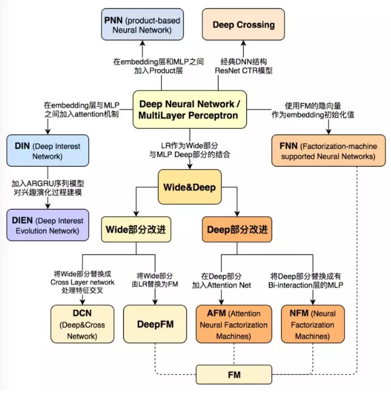

##### `FNN`

传统的 `CTR` 预估模型大多数采用线性模型。线性模型的优点是易于实现，缺点是：模型表达能力较差，无法学习特征之间的相互作用 `interaction` 。非线性模型（如：`FM,GBDT`）能够利用不同的组合特征，因此能够改善模型的表达能力。但是这些特征无法利用不同特征的任意组合。

`FNN` 和 `SNN` 的主要思路是：从 `sparse feature`$\vec{\mathbf{x}}$学到 `dense representation`$\vec{\mathbf{z}}$；将$\vec{\mathbf{z}}$作为一个深度前馈神经网络的输入，输出为概率$\hat{y}$。二者的区别在于学到$\vec{\mathbf{z}}$的方式不同。

`FNN` 模型结合了神经网络和 `FM` 模型，网络分为以下几层：

- 第 0 层输入层：`categorical` 经过 `one-hot` 编码之后作为输入，该层也被称作 `sparse binary feature` 层。
- 第1层`embedding` 层：输入层经过局部连接生成`embedding` 向量，该层也被称作 `dense real layer` 层。
- 第2层到第$L$层：全连接层。
- 最后一层：`sigmoid` 输出层。

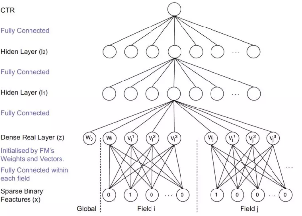

`FNN` 的核心在于 `embedding` 向量的生成。假设有$F$个 `field`，`one-hot` 向量为$\vec{\mathbf{x}}$，`field i`在向量中的起始位置为$s_i$、终止位置为$e_i$（包含）。每个 `field` 生成一个 `embedding` 向量。即 `field i` 生成$\vec{\mathbf{z}}_i=(\omega_i,v_1^i,\cdots,v_K^i)\in \mathbb{R}^{K+1}$。同时还有全局`bias` 。即：$\vec{\mathbf{z}}=(\omega_0,\omega_1,v_1^1,\cdots,v_K^1,\cdots,v_1^F,\cdots,v_K^F)^T$。输入位置$s_i\sim e_i$仅仅与$\vec{\mathbf{z}}_i$相连，即：局部连接：
$$
\vec{\mathbf{z}}_i = \mathbf{W}_0^i(x_{s_i},\cdots,x_{e_i})^T
$$
$\vec{\mathbf{z}}$由 `FM` 模型初始化。由于采用逐层预训练，因此一旦初始化$\vec{\mathbf{z}}$之后就固定。因此求解 `FM` 的过程就是求解$\mathbf{W}_0$的过程，且一旦初始化后就冻结$\mathbf{W}_0$，直到最后的微调阶段才更新$\mathbf{W}_0$。

一旦进行了 `FM` 预训练和 `layer-wise RBM` 预训练之后，则可以通过监督学习来微调模型。模型的损失函数为交叉熵：
$$
\mathcal{L}(y,\hat{y}) = -\left[y\log\hat{y}+(1-y)\log(1-\hat{y})\right]\\
\frac{\part \mathcal{L}}{\part \mathbf{W}_0^i}=\sum_{k=1}^{K+1}\frac{\part \mathcal{L}}{\part z_{i,k}}\frac{\part z_{i,k}}{\mathbf{W}_0^i}=\frac{\part \mathcal{L}}{\part \vec{\mathbf{z}}_i}(x_{s_i},\cdots,x_{e_i})
$$
当$x_j$时，对应梯度为0。因此只需要更新$\vec{\mathbf{x}}$非零的分量对应的参数，这大大降低了参数更新的计算量。

##### `PNN`

假设有$F$个 `field`，`one-hot` 向量为$\vec{\mathbf{x}}$，`field i`在向量中的起始位置为$s_i$、终止位置为$e_i$（包含）。每个 `field` 生成一个 `embedding` 向量。即 `field i` 生成$\vec{\mathbf{z}}_i=(v_1^i,\cdots,v_K^i)\in \mathbb{R}^{K}$。

模型包含以下几层：

- 第 0 层输入层：`categorical` 经过 `one-hot` 编码之后作为输入

- 第1层`embedding` 层：模型从每个 `field` 中学得各 `field` 的 `embedding` 表示。
  $$
  \vec{\mathbf{z}}_i = \mathbf{W}_0^i(x_{s_i},\cdots,x_{e_i})^T
  $$

- 第2层 `product` 层：由`embedding` 特征的一阶特征和二阶交叉特征拼接而成。其中$\mathbf{z}$部分表示一阶特征，$\mathbf{p}$部分表示二阶特征。为统一生成方式，$\mathbf{z}$由常数 `1` 和一阶特征交叉生成。

$$
\mathbf{z} = \left[\vec{\mathbf{z}}_1,\cdots,\vec{\mathbf{z}}_F\right]\in\mathbb{R}^{K\times F}\\
\mathbf{p}={p_{i,j}},i=1,\cdots,F;j=1,2,\cdots,F\\
p_{i,j} = g(\vec{\mathbf{z}}_i,\vec{\mathbf{z}}_j)
$$

$g(\cdot,\cdot)$表示成对特征交叉，当定义不同的$g$函数时，就定义了不同的 `PNN` 实现。该层的输出为：
$$
h_z^i = \mathbf{W}_z^i\odot\mathbf{z},h_p^i=\mathbf{W}_p^i\odot\mathbf{p}\\
\vec{\mathbf{h}}_z = (h_z^1,\cdots,h_z^{d_1})^T,\vec{\mathbf{h}}_p = (h_p^1,\cdots,h_p^{d_1})^T\\
\vec{\mathbf{h}}_2 = \text{relu}(\vec{\mathbf{h}}_z+\vec{\mathbf{h}}_p+\vec{\mathbf{b}}_1)
$$
其中$d_1$表示对提取的一阶特征和二阶特征通过$\mathbf{W}_z$和$\mathbf{W}_p$各自分别进行进一步的特征抽取的数量。$\mathbf{W}_z^i,\mathbf{W}_p^i$类似于 `CNN` 的卷积核，其尺寸为整个图片大小，$d_1$为卷积核的数量，$i$表示第$i$个卷积核。$\odot$表示张量的内积，定义为：$\mathbf{A}\odot\mathbf{B}=\sum_{i,j}A_{i,j}\times B_{i,j}$

- 第3层到第 层：全连接层。

- 最后一层：`sigmoid` 输出层。

  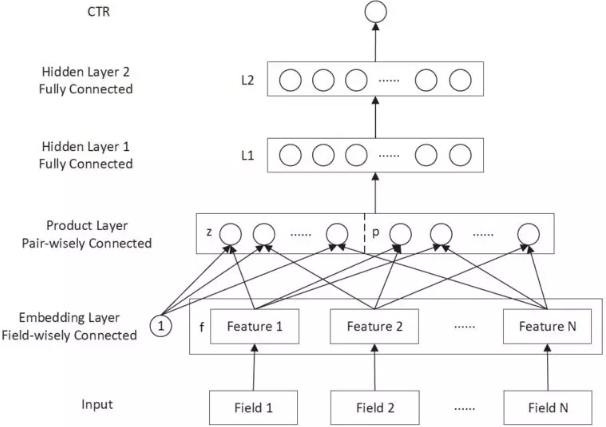

模型的损失函数为 `logloss`：
$$
\mathcal{L} = -\frac{1}{N}\sum_{i=1}^N\left[y_i\log\hat{y}_i+(1-y_i)\log(1-\hat{y}_i)\right]
$$
`IPNN` 的特征交叉函数为：$p_{i,j} = g(\vec{\mathbf{z}}_i,\vec{\mathbf{z}}_j)=\vec{\mathbf{z}}_i\cdot\vec{\mathbf{z}}_j$

`OPNN` 的特征交叉函数为：$p_{i,j} = g(\vec{\mathbf{z}}_i,\vec{\mathbf{z}}_j)=\vec{\mathbf{z}}_i\vec{\mathbf{z}}_j^T$与内积产生标量不同，这里的外积产生一个矩阵。则$\mathbf{p}\in\mathbb{R}^{F\times F\times K\times K},\mathbf{W}_p^i\in\mathbb{R}^{F\times F\times K\times K}$

##### `DeepCrossing`

该模型利用深度神经网络来自动组合特征从而生成高阶特征。虽然 `Deep Crossing` 模型能够自动组合原始特征，但是收集原始数据并提取原始特征仍需要用户的大量精力。

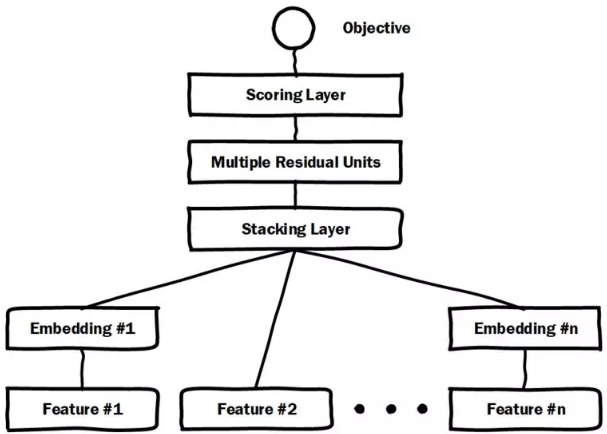

`DeepCrossing` 模型的输入是原始特征，模型有四种类型的`Layer`：

- `Embedding Layer`：将原始特征映射成 `embedding` 向量。假设原始特征`one-hot` 向量为$\vec{\mathbf{x}}$，`field i`在向量中的起始位置为$s_i$、终止位置为$e_i$（包含）。

$$
\vec{\mathbf{E}}^i = \text{relu}(\mathbf{W}^i(x_{s_i},\cdots,x_{e_i})^T+\vec{\mathbf{b}}^i)\in\mathbb{R}^{m_i}
$$

对于某些维度较小的原始特征，无需进行 `embedding` 层，而是直接输入到 `Stacking Layer` 层。这是在模型大小和信息保留程度之间的折衷：完全保留信息（原始输入），则可能使得模型过大；全部使用 `embedding`，则可能信息丢失太多

- `Stacking Layer`：所有 `embedding` 特征和部分原始特征拼接成一个向量：

$$
\vec{\mathbf{h}}_1=<\vec{\mathbf{E}}^1,\cdots,\vec{\mathbf{E}}^K>
$$

其中$<\cdot>$表示特征拼接，$K$为原始特征的数量，$\vec{\mathbf{E}}$为 `embedding` 向量。如果是直接输入的原始特征，则$\vec{\mathbf{E}}$表示该原始特征的 `one-hot` 向量。

- `Residual Unit Layer`：基于残差单元 `Residual Unit` 构建的残差层，其输出为：
- `Scoring Layer`：`sigmoid` 输出层。其输出为：$\hat{y}=\text{sigmoid}(\vec{\mathbf{w}}\cdot\vec{\mathbf{h}}_{L-1}+b)$

模型的损失函数为负的 `Logloss`：
$$
\mathcal{L} = -\frac{1}{N}\sum_{i=1}^N\left[y_i\log\hat{y}_i+(1-y_i)\log(1-\hat{y}_i)\right]
$$

##### `Wide&Deep`

推荐系统中的一个挑战是：同时实现 `memorization` 和 `generalization`。

- `memorization`：学到 `item` 或者 `feature` 共现关系，并基于历史数据中的这种相关性来推荐。基于`memorization` 的推荐通常更具有话题性，并且和用户已经发生行为的 `item` 直接关联。
- `generalization`：根据 `item` 或者 `feature` 的共现关系，探索过去从未发生或者很少发生的新特征组合。基于 `generalization` 的推荐通常更具有多样性。

广义线性模型（称为 `wide` 模型）可以通过大量交叉特征来记住特征交互 `feature interaction` ，即 `memorization` 。其优点是可解释性强，缺点是：为了提升泛化能力，需要人工执行大量的特征工程。

深度神经网络模型（称为 `deep` 模型）只需要执行较少的特征工程即可泛化到未出现的特征组合，即 `generalization` 。其优点是泛化能力强，缺点是容易陷入过拟合。

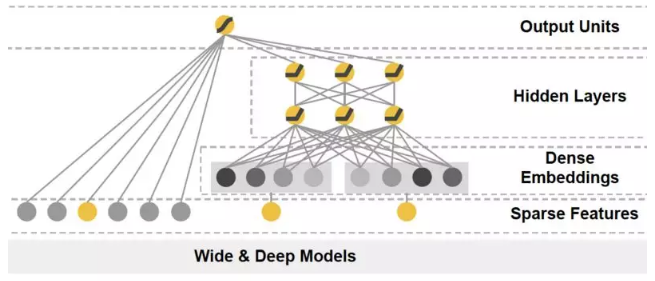

`Wide & Deep` 模型包含一个 `linear model:LM` 部分和一个 `neural network:NN` 部分。设模型的输入特征向量为$\vec{\mathbf{x}}=(x_1,\cdots,x_d)^T$是一个$d$维的特征向量（经过 `one-hot` ），仅包含原始特征。$\phi(\cdot)$表示特征交叉转换函数，$\phi(\vec{\mathbf{x}})$包含转换后的特征。

- `LM` 部分：即左侧的 `wide` 子模型，它是一个线性模型：

$$
y = \vec{\mathbf{w}}\cdot<\vec{\mathbf{x}},\phi(\vec{\mathbf{x}})>+b
$$

其中$<\cdot>$表示特征拼接，$\vec{\mathbf{w}}\in\mathbb{R}^{d+d^{\prime}}$是模型参数，$b$为偏置。

`NN` 部分：即右侧的 `deep` 子模型，它是一个 `DNN` 模型。

- 输入层：为了缓解模型的输入大小，`DNN` 的所有离散特征的输入都是原始特征，而没有经过 `one-hot` 编码转换。
- 第一层 `embedding` 层：将高维稀疏的 `categorical` 特征转换为低维的 `embedding` 向量。
- 第二层特征拼接层：将所有的 `embedding` 向量拼接成一个 `dense feature` 向量。
- 后续每一层都是全连接层：

模型联合了 `wide` 和 `deep` 的输出：
$$
\hat{y} = p(y=1|\vec{\mathbf{x}})=\text{sigmoid}(\vec{\mathbf{w}}_{\text{wide}}\cdot<\vec{\mathbf{x}},\phi(\vec{\mathbf{x}})>+\vec{\mathbf{w}}_{\text{deep}}\cdot\vec{\mathbf{h}}^L+b)
$$
模型的损失函数为负的对数似然，并通过随机梯度下降来训练：
$$
\mathcal{L} = -\frac{1}{N}\sum_{i=1}^N\left[y_i\log\hat{y}_i+(1-y_i)\log(1-\hat{y}_i)\right]
$$
`Wide&Deep` 模型与 `LM & DNN` 的 `ensemble` 集成模型不同。

- 在集成模型中，每个子模型都是独立训练的，只有预测时才将二者结合在一起。

  在 `Wide&Deep` 模型中，每个子模型在训练期间就结合在一起，共同训练。

- 在集成模型中，每个子模型必须足够大从而足够健壮，使得子模型集成之后整体的 `accuracy` 等性能足够高。

  在 `Wide&Deep` 模型中，每个子模型都可以比较小，尤其是 `wide` 部分只需要少量的特征交叉即可。

##### `DCN`

`DCN` 模型结构如下图所示，模型包含 `embedding and stacking` 层、`cross network`、`deep network` 三个组成部分。

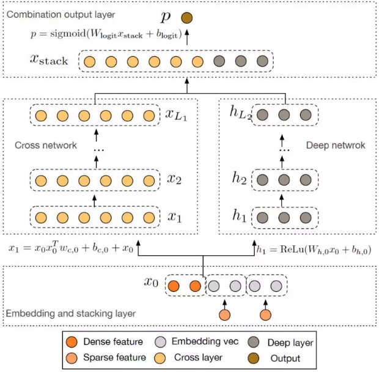

`embedding and stacking` 层：假设输入包含 `sparse` 特征和 `dense` 特征。设原始特征为向量$\vec{\mathbf{x}}$，其中：
$$
\vec{\mathbf{x}}=<\vec{\mathbf{x}}_{\text{sparse}}^1,\cdots,\vec{\mathbf{x}}_{\text{sparse}}^K,\vec{\mathbf{x}}_{\text{dense}}>
$$
其中$\vec{\mathbf{x}}_{\text{sparse}}^i$为 `field i` 的 `one-hot` 向量，$\vec{\mathbf{x}}_{\text{dense}}$为经过归一化的 `dense` 特征，$<\cdot>$为向量拼接。首先将 `field i` 的特征映射到 `embedding` 向量：
$$
\vec{\mathbf{x}}_{\text{embed}}^i=\mathbf{W}_{\text{embed}}^i\vec{\mathbf{x}}_{\text{sparse}}^i
$$
其中$\vec{\mathbf{x}}_{\text{sparse}}^i$为`one-hot` 向量长度，$\mathbf{W}_{\text{embed}}^i\in\mathbb{R}^{e_i\times d_i}$为参数。然后将 `embedding` 向量和归一化的 `dense` 特征拼接成向量：
$$
\vec{\mathbf{x}}^0=<\vec{\mathbf{x}}_{\text{embed}}^1,\cdots,\vec{\mathbf{x}}_{\text{embed}}^K,\vec{\mathbf{x}}_{\text{dense}}>\in\mathbb{R}^{e_i+\cdots+e_K+d_s}
$$
其中$d_s$为 的向量长度。`embedding and stacking` 层就是将$\vec{\mathbf{x}}$转换为$\vec{\mathbf{x}}^0$。

`cross network`：`cross network` 是一个新颖的结构，其核心思想是以高效的方式显式应用特征交叉。`cross network` 由交叉层构成，每层的输入输出为：
$$
\vec{\mathbf{x}}_{l+1}=\vec{\mathbf{x}}_0\vec{\mathbf{x}}_l^T\vec{\mathbf{w}}_{l+1}+\vec{\mathbf{b}}_{l+1}+\vec{\mathbf{x}}_l=f(\vec{\mathbf{x}}_l,\vec{\mathbf{w}}_{l+1},\vec{\mathbf{b}}_{l+1})+\vec{\mathbf{x}}_l
$$
其中$\vec{\mathbf{x}}_l$为第$l$层的输出，$\vec{\mathbf{w}}_{l},\vec{\mathbf{b}}_{l}\in\mathbb{R}^d$为第$l$层的参数。 其中$d=e_1+\cdots+e_K+d_s$。每一层的输出都包含两个部分：该层的输入$\vec{\mathbf{x}}_l$、交叉特征$f$ 。`cross network` 的本质是用$\vec{\mathbf{x}}_0\vec{\mathbf{x}}_l^T$来捕获所有的特征交叉，这种方式避免了存储整个矩阵以及矩阵乘法运算。由于`cross network` 的参数很少，所以这部分网络的容量较小，网络过于简单，模型容易陷入欠拟合。为了加强模型的学习能力，`DCN` 在右侧引入了并行的 `deep `

`deep network`：`deep network` 部分是一个简单的全连接前馈神经网络：
$$
\vec{\mathbf{h}}_{l+1}=\sigma(\vec{\mathbf{W}}_{l}\vec{\mathbf{h}}_{l}+\vec{\mathbf{b}}_{l})
$$
`DCN` 通过拼接层 `combination layer` 来拼接 `cross network` 和 `deep network` 两个网络的输出向量，然后输出到标准的 `sigmoid` 输出层：
$$
\hat{y}=\text{sigmoid}(\mathbf{W}_{\text{logits}}<\vec{\mathbf{x}}_{L1},\vec{\mathbf{h}}_{L2}>+\vec{\mathbf{b}}_{\text{logits}})
$$
其中$\hat{y}$为预测的点击概率，$\vec{\mathbf{x}}_{L1}$为 `cross network` 的输出向量，$\vec{\mathbf{h}}_{L2}$为 `deep network` 的输出向量，$\mathbf{W}_{\text{logits}},\vec{\mathbf{b}}_{\text{logits}}$为模型参数。模型的损失函数为带正则化的对数似然函数：
$$
\mathcal{L} = -\frac{1}{N}\sum_{i=1}^N\left[y_i\log\hat{y}_i+(1-y_i)\log(1-\hat{y}_i)\right]+\lambda\sum_{l}||\mathbf{W}_l||^2_2
$$
`cross network` 可以理解为：多项式逼近 `polynomial approximation`、`FM` 泛化`generalization to FM` 、或者有效投影`efficient projection` 。

##### `DeepFM`

 `DeepFM` 模型结合了 `FM` 的推荐能力和 `DNN` 的特征学习能力，综合利用了低阶交叉特征和高阶交叉特征。其特点有：

- `DeepFM` 集成了 `FM` 和 `DNN`，可以对低阶交叉特征和高阶交叉特征建模，同时无需对原始输入执行任何特征工程。
- `DeepFM` 的 `wide` 部分和 `deep` 部分共享输入及`embedding`

`DeepFM` 模型由两种组件构成：`FM` 组件、`deep` 组件，它们共享输入。这种共享输入使得`DeepFM` 可以同时从原始特征中学习低阶特征交互和高阶特征交互，完全不需要执行特征工程

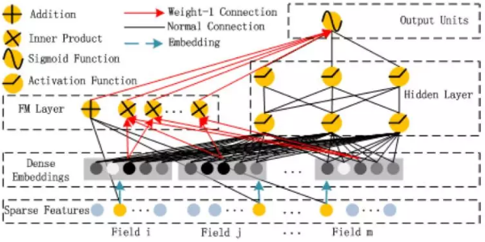

假设输入包含 `sparse` 特征和 `dense` 特征。设原始特征为向量$\vec{\mathbf{x}}$，其中：
$$
\vec{\mathbf{x}}=<\vec{\mathbf{x}}_{\text{sparse}}^1,\cdots,\vec{\mathbf{x}}_{\text{sparse}}^K,\vec{\mathbf{x}}_{\text{dense}}>
$$
其中$\vec{\mathbf{x}}_{\text{sparse}}^i$为 `field i` 的 `one-hot` 向量，$\vec{\mathbf{x}}_{\text{dense}}$为经过归一化的 `dense` 特征，$<\cdot>$为向量拼接。对于特征 `j` （即$x_j$）：

- 标量$\omega_j$用于对它的一阶特征重要性进行建模，即 `FM` 组件左侧的 `+` 部分。
- 向量$\vec{\mathbf{v}}_j$用于对它的二阶特征重要性进行建模，即 `FM` 组件右侧的 `x` 部分。
- 向量$\vec{\mathbf{v}}_j$也作为 `deep` 组件的输入，从而对更高阶特征交互进行建模，即 `deep` 组件。

最终模型联合了 `FM` 组件和 `deep` 组件的输出：
$$
\hat{y} = \text{sigmoid}(\hat{y}_{\text{FM}}+\hat{y}_{\text{DNN}})
$$
`FM` 组件：该部分是一个 `FM` ，用于学习一阶特征和二阶交叉特征。`FM` 组件由两种操作组成：加法 `Addition` 和内积 `Inner Product`：
$$
\hat{y}_{\text{FM}} = \sum_{i=1}^d(\omega_i\times x_i)+\sum_{i=1}^d\sum_{j=i+1}(\vec{\mathbf{v}}_i\cdot\vec{\mathbf{v}}_j)\times x_i\times x_j
$$
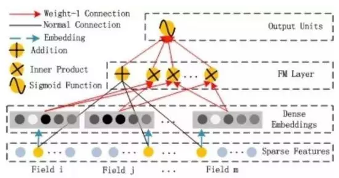

`deep` 组件：该部分是一个全连接的前馈神经网络，用于学习高阶特征交互。假设 `embedding` 层的输出为：$\vec{\mathbf{h}}^0=[\vec{\mathbf{e}}_1,\cdots,\vec{\mathbf{e}}_K]$，其中$\vec{\mathbf{e}}_i$为`field i` 的 `embedding` 向量，$\vec{\mathbf{h}}^0$为前馈神经网络的输入。则有：
$$
\vec{\mathbf{h}}^{l+1}=\sigma(\vec{\mathbf{W}}^l\vec{\mathbf{h}}^l+\vec{\mathbf{b}}^l)
$$
最终有：$\hat{y}_{\text{DNN}}=\sigma(\vec{\mathbf{w}}_{\text{dnn}}\vec{\mathbf{h}}^L+b_{\text{dnn}})$

- `FNN`：`FNN` 虽然也用到了 `FM` 模型，但是它仅使用 `FM` 模型来初始化 `FNN` 然后来微调模型。这使得 `FNN` 的 `embedding` 层参数严重受制于 `FM` 模型，从而降低模型效果。另外 `FNN` 仅捕捉高阶特征交互。与之相比，`DeepFM` 不需要预训练，而是端到端的学习低阶特征交互和高阶特征交互。
- `PNN`：作者发现 `OPNN` 不如 `IPNN` 可靠，因为外积的近似计算丢失大量信息使得结果不稳定。虽然 `IPNN` 更可靠，但是由于 `Product` 层的输出连接到第一个隐层的所有神经元，所以计算复杂度较高。同时 `IPNN` 和 `OPNN` 会忽略低阶特征交互。与之相比，`DeepFM` 中的 `Product` 层（即 `FM` 组件）的输出仅仅连接到输出层（只有一个神经元），计算复杂度很低。
- `Wide&Deep`：虽然 `Wide&Deep` 也可以对低阶特征和高阶特征同时建模，但是 `wide` 部分需要人工特征工程，而这需要业务专家的指导。与之相比，`DeepFM` 直接处理原始特征，不需要任何业务知识。另外，`Wide&Deep` 的一个直接扩展是：使用 `FM` 代替 `wide` 部分的`LR` 模型，记作 `FM&DNN` 模型，原始的 `Wide&Deep` 模型记作 `LR&DNN` 模型。`FM&DNN` 模型更类似于 `DeepFM` 模型。但是 `DeepFM` 在 `FM` 和 `DNN` 之间共享 `embedding` 特征，这种共享策略有助于特征`representation` 学习，使得学到的特征 `representation` 更加精确。

##### `NFM`

`NFM` 模型结合了`FM` 建模二阶特征交互中的线性，以及 `DNN` 建模高阶特征交互中的非线性。和 `FM` 相比，`FM` 可以作为 `NFM` 的一个特例，因此 `NFM` 表达能力比 `FM` 更强。和 `Wide&Deep、DeepCrossing` 相比，`NFM` 网络结构更浅，预测能力更强，更容易训练和调整。

`FM` 的缺点：模型使用一阶特征、二阶交叉特征的线性组合，模型简单，表达能力较弱。`DNN` 的缺点：在信息检索和数据挖掘任务中，大多数数据都是天然稀疏的。尽管 `DNN` 具备从 `dense` 数据中学习 `pattern` 的强大能力，但是目前还不清楚如何配置网络从而使得模型能够从 `sparse` 数据中有效的学习 `pattern` 。

`NFM` 模型引入了 `Bi-Interaction pooling` 二阶交叉池化层，然后再二阶交叉池化层上方堆叠非线性全连接层。

- 与 `FM` 方法相比，`NFM` 可以视为深层的 `FM`，它在 `FM` 的基础上提升了对高阶特征交叉和非线性特征交叉建模的能力，提升了模型的能力。
- 与传统的 `DNN` 方法仅将底层 `embedding` 向量拼接再一起或者取均值相比，二阶交叉池化层对交叉信息进行编码，为后续的全连接层提供更有意义的信息。

给定经过`one-hot` 编码之后的输入向量$\vec{\mathbf{x}}\in\mathbb{R}^n$，其中特征$x_i=0$表示第$i$个特征不存在。则 `NFM` 的预测结果为：
$$
\hat{y}(\vec{\mathbf{x}})=\omega_0+\vec{\mathbf{w}}\cdot\vec{\mathbf{x}}+f(\vec{\mathbf{x}})
$$
类似 `FM`，`NFM` 的第一项为全局偏置，第二项为一阶特征。与 `FM` 不同，`NFM` 的第三项$f(\vec{\mathbf{x}})$对交叉特征进行建模，它是一个多层前馈神经网络，包含 `embedding`层、`Bi-Interaction` 层、`Hidden` 层、输出层。

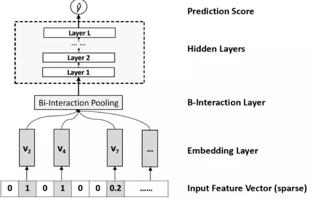

`embedding` 层将每个`feature` 映射到一个 `dense vector representation`，即特征$i$映射到向量$\vec{\mathbf{v}}_i\in\mathbb{R}^k$。一旦得到 `embedding` 向量，则输入$\vec{\mathbf{x}}=(x_1,\cdots,x_n)^T$就可以表示为：
$$
\mathcal{V}_{\vec{\mathbf{x}}}=\{x_1\vec{\mathbf{v}}_1,\cdots,x_n\vec{\mathbf{v}}_n\}
$$
由于输入$\vec{\mathbf{x}}$的稀疏性，$\mathcal{V}_{\vec{\mathbf{x}}}$只需要保存非零的特征。`Bi-Interaction` 层对输入的$\mathcal{V}_{\vec{\mathbf{x}}}$执行池化操作，将一组 `embedding` 向量转换为一个向量，该操作称作 `Bi-Interaction pooling` 操作：
$$
f(\mathcal{V}_{\vec{\mathbf{x}}})=\sum_{i=1}^n\sum_{j=i+1}^nx_i\vec{\mathbf{v}}_i\odot x_j\vec{\mathbf{v}}_j
$$
其中：$\odot$是逐元素乘法；$f(\mathcal{V}_{\vec{\mathbf{x}}})$是一个$k$维向量，它在 `embedding` 空间编码了二阶交叉特征。`Bi-Interaction` 层有两个优秀的特性：

- `Bi-Interaction` 层并没有引入任何额外的模型参数
- `Bi-Interaction` 层可以在线性时间内有效计算：

$$
f(\mathcal{V}_{\vec{\mathbf{x}}})=\frac{1}{2}\left[\left(\sum_{i=1}^nx_i\vec{\mathbf{v}}_i\right)^2-\sum_{i=1}^n(x_i\vec{\mathbf{v}}_i)^2\right]
$$

这些性质意味着 `Bi-Interaction` 层对二阶交叉特征建模的代价很低。另外，`Bi-Interaction` 层也支持求导运算：
$$
\frac{\part}{\part \vec{\mathbf{v}}_i}f(\mathcal{V}_{\vec{\mathbf{x}}})=\left(\sum_{i=1}^nx_i\vec{\mathbf{v}}_i\right)x_i-x_i^2\vec{\mathbf{v}}_i
$$
`Hidden` 层是一组全连接层，用于捕获高阶特征交叉：$\vec{\mathbf{h}}_L=\sigma(\mathbf{W}_L\vec{\mathbf{h}}_{L-1}+\vec{\mathbf{b}}_L)$

输出层用于输出预测得分：$f(\vec{\mathbf{x}})=\vec{\mathbf{h}}_L\cdot \vec{\mathbf{w}}_f$

`NFM` 并未采用常规的$\text{L}_1,\text{L}_2$正则化，而是采用 `dropout` 和 `Batch Normalization` 。

- 为了防止 `feature embedding` 出现 `co-adapt` 并过拟合 ，`NFM` 对 `Bi-Interaction` 层的输出执行 `dropout` 。即：在 `Bi-Interaction` 层之后接入一个 `Dropout` 层，随机丢弃 比例的神经元。

##### `AFM`

`AFM` 模型通过 `attention` 机制来自动学习每个二阶交叉特征的重要性。与 `Wide&Deep` 以及 `DeepCross` 等模型相比，`AFM` 结构简单、参数更少、效果更好。同时 `AFM` 具有很好的可解释性：通过注意力权重可以知道哪些交叉特征对于预测贡献较大。

给定经过`one-hot` 编码之后的输入向量$\vec{\mathbf{x}}\in\mathbb{R}^n$，其中特征$x_i=0$表示第$i$个特征不存在。则 `NFM` 的预测结果为：
$$
\hat{y}(\vec{\mathbf{x}})=\omega_0+\vec{\mathbf{w}}\cdot\vec{\mathbf{x}}+f(\vec{\mathbf{x}})
$$
类似 `FM`，`AFM` 的第一项为全局偏置，第二项为一阶特征。与 `FM` 不同，`NFM` 的第三项$f(\vec{\mathbf{x}})$对交叉特征进行建模，包含 `embedding`层、`Pair-wise Interaction` 成对交叉层、`Attention-based Pooling` 层、输出层。

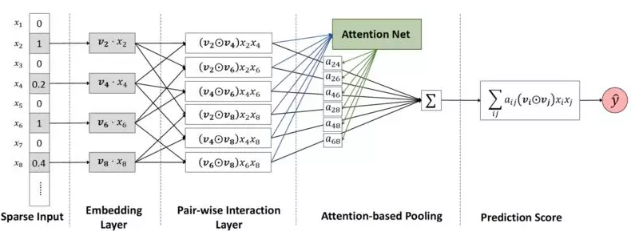

`embedding` 层将每个`feature` 映射到一个 `dense vector representation`，即特征$i$映射到向量$\vec{\mathbf{v}}_i\in\mathbb{R}^k$。一旦得到 `embedding` 向量，则输入$\vec{\mathbf{x}}=(x_1,\cdots,x_n)^T$就可以表示为：
$$
\mathcal{V}_{\vec{\mathbf{x}}}=\{x_1\vec{\mathbf{v}}_1,\cdots,x_n\vec{\mathbf{v}}_n\}
$$
由于输入$\vec{\mathbf{x}}$的稀疏性，$\mathcal{V}_{\vec{\mathbf{x}}}$只需要保存非零的特征。

`AFM` 的 `Pair-wise Interaction` 层将$m$个向量扩充为$m\times(m-1)/2$个交叉向量，每个交叉向量是两个 `embedding` 向量的逐元素积。$m\le n$为$\vec{\mathbf{x}}$中非零元素数量。假设输入$\vec{\mathbf{x}}$的非零元素下标为$\mathcal{X}$，对应的 `embedding` 为$\Psi=\{x_i\vec{\mathbf{v}}_i\}$，则 `Pair-wise Interaction` 层的输出为：
$$
f(\Psi)=\{(\vec{\mathbf{v}}_i\odot\vec{\mathbf{v}}_j)x_ix_j\}_{(i,j)\in\mathcal{R}_x}
$$
$\mathcal{R}_x=\{(i,j)\}_{x\in\mathcal{X},j\in\mathcal{X},j>x}$表示成对下标集合。一旦得到`Pair-wise Interaction` 层的$m\times(m-1)/2$个交叉向量，则可以通过一个 `sum pooling` 层来得到一个池化向量：
$$
\vec{\mathbf{v}}_{\text{pool}}=\sum_{(i,j)\in\mathcal{R}_x}(\vec{\mathbf{v}}_i\odot\vec{\mathbf{v}}_j)x_ix_j
$$
它刚好就是 `Bi Interaction` 层的输出 。因此 `Pair-wise Interaction层` + `sum pooling 层` = `Bi Interaction 层`。

`Attention-based Pooling` 层：与 `Bi Interaction pooling` 操作不同，`Attention-based Pooling` 操作采用了 `attention` 机制：
$$
f_{\text{Att}}(f(\Psi)) =\sum_{(i,j)\in\mathcal{R}_x}(\vec{\mathbf{v}}_i\odot\vec{\mathbf{v}}_j)\times x_ix_j\times a_{i,j}
$$
其中$a_{i,j}$是交叉特征$(i,j)$的`attention score` ，可以理解为交叉特征$(i,j)$的权重。学习$a_{i,j}$的一个方法是直接作为模型参数来学习，但这种方法有个严重的缺点：对于从未在训练集中出现过的交叉特征，其 `attentioin score` 无法训练。为解决该问题，论文使用一个 `attention network` 来训练$a_{i,j}$。`attention network` 的输入为$m\times(m-1)/2$个交叉特征向量，输出为$a_{i,j}$。
$$
a_{i,j}^{\prime}=\vec{\mathbf{h}}\cdot\text{relu}(\mathbf{W}(\vec{\mathbf{v}}_i\odot\vec{\mathbf{v}}_j)x_ix_j+\vec{\mathbf{b}})\\
a_{i,j} = \frac{\exp(a_{i,j}^{\prime})}{\sum_{(i,j)\in\mathcal{R}_x}\exp(a_{i,j}^{\prime})}
$$
其中$\mathbf{W}\in\mathbb{R}^{t\times k},\vec{\mathbf{b}}\in\mathbb{R}^t,\vec{\mathbf{h}}\in\mathbb{R}^t$都是模型参数，$t$为 `attention network` 的隐向量维度，称作 `attention factor` 。输出层用于输出预测得分：
$$
f(\vec{\mathbf{x}})=\vec{\mathbf{w}}_f\cdot\left(\sum_{(i,j)\in\mathcal{R}_x}(\vec{\mathbf{v}}_i\odot\vec{\mathbf{v}}_j)\times x_ix_j\times a_{i,j}\right)
$$
为缓解过拟合，`AFM` 采用$\text{L}_2$正则化和 `dropout` 正则化。`Pair-wise Interaction` 层的输出执行 `dropout` 。`attention network` 层的权重执行$\text{L}_2$正则化

##### `xDeepFM`

 `xDeepFM` 模型引入了一种新的网络 `Compressed Interaction Network:CIN`，该网络显式的在 `vector-wise` 级别建模特征交互。其优点有：

- 通过 `CIN` 网络显式的在 `vector-wise` 级别学习高阶特征交互。
- 通过 `DNN` 网络，`xDeepFM` 也能够隐式的学习任意低阶和高阶的特征交互。

如果一个 `field` 中只有一个取值，则该 `field` 的 `embedding` 就是对应 `one-hot` 中 `1` 对应的 `embedding` 的取值。如果一个 `field` 中有多个取值（如：用户最近一个月看过的电影），则该 `field` 的 `embedding` 就是对应 `one-hot` 中所有 `1` 对应的 `embedding` 的累加。

###### `CIN`

假设所有的 `embedding` 向量维度$D$，假设 `field i` 的 `embedding` 为$\vec{\mathbf{e}}_i\in\mathbb{R}^D$。假设有$m$个 `field`，将所有 `embedding` 拼接成矩阵：
$$
\mathbf{X}^0=\left[\begin{array}{cccc}\vec{\mathbf{e}}_1^T\\
\cdot\\
\cdot\\
\vec{\mathbf{e}}_m^T\end{array}\right]\in\mathbb{R}^{m\times D}
$$
矩阵的第$i$行就是`field i` 的 `embedding`：$\vec{\mathbf{x}}_i^0=\vec{\mathbf{e}}_i$。`CIN` 的第$k$层输出也是一个矩阵$\mathbf{X}^k\in\mathbb{R}^{H_k\times D}$，其中$H_k$为输出向量的数量，其中$H_0=m$：
$$
\vec{\mathbf{x}}_h^k=\sum_{i=1}^{H_{k-1}}\sum_{j=1}^mW_{i,j}^{k,h}(\vec{\mathbf{x}}_i^{k-1}\odot\vec{\mathbf{x}}_j^0) 1\le h\le H_k
$$
其中：$\odot$为向量的逐元素积。$\mathbf{W}^{k,h}$为权重向量，它用于为 `vector-wise` 的交叉特征 赋予不同的权重$\vec{\mathbf{x}}_i^{k-1}\odot\vec{\mathbf{x}}_j^0$。由于$\mathbf{X}^k$是通过$\mathbf{X}^{k-1}$和$\mathbf{X}^0$计算得到，因此 `CIN` 显式的建模特征交互，并且特征交互的阶数随着`CIN` 网络的深度加深而加深。

`CIN` 的建模过程非常类似卷积神经网络`CNN` 。首先引入临时三维张量 ，它是 和 的外积。

然后将三维张量 视为一张图片，将 视为一个卷积核，沿着 `embedding` 维度进行卷积得到 `featuremap` ，即向量 。

使用$H_{k+1}$个卷积核执行卷积，得到的 `featuremap` 组成输出张量$\mathbf{X}^{k+1}\in\mathbb{R}^{H_{k+1}\times D}$。因此 `CIN` 网络将$H_k\times m$个交叉向量压缩到$H_{k+1}$个向量，这就是网络名称中的 `compressed` 的由来。

令$T$表示网络深度，每层输出$\mathbf{X}^k\in\mathbb{R}^{H_k\times D}, 1\le k\le T$都和输出单元相连。首先对每层的 `feature map` 应用 `sum pooling`：
$$
p_h^k=\sum_{j=1}^D\vec{\mathbf{x}}_h^{k}, h=1,2,\cdots,H_k
$$
这里池化仍然是沿着 `embedding` 维度进行。因此得到该层的池化向量：
$$
\vec{\mathbf{p}}^k=(p_1^k,\cdots,p_{H_k}^k)^T
$$
拼接所有层的输出池化向量，则有：
$$
\vec{\mathbf{p}}^+=<\vec{\mathbf{p}}^1,\cdots,\vec{\mathbf{p}}^T>\in\mathbb{R}^{\sum_iH_i}
$$
该向量作为 `CIN` 网络的输出向量。输出向量输入到 `sigmoid` 输出层，得到 `CIN` 网络的输出得分：
$$
\hat{y} = \frac{1}{1+\exp(\vec{\mathbf{p}}^+\cdot\vec{\mathbf{w}}^+)}
$$

卷积、池化操作都是沿着 `embedding` 维度进行，而不是沿着其它方向。原因是：我们希望对特征之间的高阶特征交叉显式建模。根据 `CIN` 网络的基本原理，卷积必须对 的 `embedding` 维度进行。

$$
\vec{\mathbf{x}}_h^k=\sum_{i=1}^{H_{k-1}}\sum_{j=1}^mW_{i,j}^{k,h}(\vec{\mathbf{x}}_i^{k-1}\odot \vec{\mathbf{x}}_j^0)
$$
为了得到显式的交叉特征，池化也必须对$\mathbf{X}^k$的`embedding` 维度进行。设第$k$层第$h$个`feature map` 的参数$\mathbf{W}^{k,h}\in\mathbb{R}^{H_{k-1}\times m}$，因此第$k$层的参数数量为$H_k\times H_{k-1}\times m$。

`xDeepFM` 结合了 `CIN` 网络和 `DNN` 网络，分别对特征交互显式、隐式的建模，二者互补。模型输出为：
$$
\hat{y} = \sigma(\vec{\mathbf{w}}_{\text{linear}}\cdot\vec{\mathbf{x}}+\vec{\mathbf{w}}_{\text{dnn}}\cdot\vec{\mathbf{x}}_{\text{dnn}}+\vec{\mathbf{w}}_{\text{cin}}\cdot\vec{\mathbf{x}}_{\text{cin}}+b)
$$

其中$\sigma(\cdot)$为激活函数；$\vec{\mathbf{w}}_{\text{linear}},\vec{\mathbf{w}}_{\text{dnn}},\vec{\mathbf{w}}_{\text{cin}}$分别为线性部分、`DNN` 部分、`CIN` 部分的输出层权重参数；$\vec{\mathbf{x}},\vec{\mathbf{x}}_{\text{dnn}},\vec{\mathbf{x}}_{\text{cin}}$分别为模型的原始输入特征、`DNN` 网络提取的特征、`CIN` 网络提取的特征。模型损失函数为负的对数似然函数：
$$
\mathcal{L} = -\frac{1}{N}\sum_{i=1}^N\left[y_i\log\hat{y}_i+(1-y_i)\log(1-\hat{y}_i)\right]
$$
模型训练目标：损失函数 + 正则化项
$$
\mathcal{J} = \mathcal{L}+\lambda||\Theta||
$$
其中$\lambda$为正则化系数；$\Theta$为所有参数，包括线性部分、`CIN`部分、`DNN` 部分。

##### `ESSM`

##### `DIN`

深度兴趣网络 `Deep Interest network:DIN` 模型通过兴趣分布来刻画用户的不同兴趣，并针对候选广告（淘宝的广告也是一种商品）设计了类似 `attention` 的网络结构来激活局部的相关兴趣，使得与候选广告相关性更高的兴趣获得更高的权重。

当用户访问电商网站时：

- 首先检查用户的历史行为数据
- 然后根据 `matching` 模块召回候选广告集
- 接着根据 `ranking` 模块预测用户对每个广告的点击率，挑选出点击率最高的一批广告
- 最后曝光广告并记录用户的行为

样本原始特征由稀疏 `ID` 组成，我们将其划分为四组：

- 用户画像特征：包括用户基础画像如年龄、性别等。
- 用户行为特征：包括用户历史访问的商品`id`、历史访问的店铺`id`、历史访问的商品类别`id` 等。
- 广告特征：包括广告的商品`id`、店铺`id`、商品类别`id` 等。
- 上下文特征：包括访问时间等。

`DIN` 模型（右图）和基准模型 `Base Model` （左图）如下图所示。

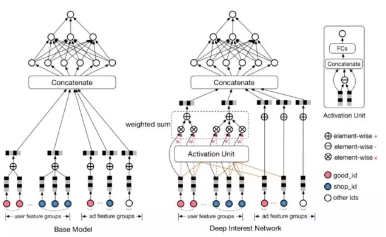

基准模型采用 `embedding&MLP` 结构，它由两个部分组成：

- `embedding` 部分：将稀疏 `id` 特征映射到 `embedding` 向量。
- `MLP` 部分：将 `embedding` 向量馈入 `MLP` 来预测输出。

由于输入中包含长度可变的行为序列`ID`，因此基准模型采用一个池化层（如 `sumpooling` ）来聚合 `embedding` 向量序列，从而获得固定尺寸的向量。

基准模型在实践中表现良好，但是在池化过程中丢失了很多信息。即：池化操作破坏了用户行为数据的内部结构。

##### `DIEN`

目前捕获用户兴趣的模型有两个主要缺陷：

- 包括`DIN` 在内的大多数兴趣模型都将用户行为直接视为兴趣。事实上，用户的显式行为不等于用户的潜在兴趣。因此这些模型都忽略了挖掘用户显式行为背后的真正用户兴趣。
- 考虑到外部环境和用户自身认知的变化，用户兴趣会随着时间动态变化，大多数模型都未考虑这一点。

深度兴趣演化模型 `Deep Interest Evolution Network:DIEN` 有两个关键模块：

- 兴趣抽取层 `interest extractor layer` ：用于从用户的历史行为序列中捕获潜在的时序兴趣 `latent temporal interest`。在兴趣提取层，`DIEN` 选择利用 `GRU` 来建模用户行为之间的依赖关系。考虑到一段连续的行为是由某个兴趣直接引起的，因此`DIEN` 引入辅助损失函数。辅助损失函数使用下一个阶段的行为来监督当前阶段隐状态（称作兴趣状态）的学习。这些额外的监督信息有助于模型捕获兴趣表示的更多语义信息，从而推动`GRU` 的隐状态更有效的表达兴趣。
- 兴趣演化层 `interest evolving layer` ：用于建模用户的兴趣演变过程。用户的兴趣是多种多样的，这导致产生兴趣漂移现象：相邻的两次访问中，用户的意图可能完全不同。并且用户的当前行为可能取决于很久之前的行为，而不是前几次行为。同时，用户对不同目标商品的点击行为可能受到不同兴趣的共同影响。在兴趣演变层，`DIEN` 对与目标商品有关的兴趣演变轨迹进行建模。基于从兴趣提取层得到的兴趣序列，`DIEN` 采用带注意力更新门的 `GRU` ( `GRU with attentional update gate:AUGRU` ）来建模针对不同目标商品的特定兴趣演变过程。`AUGRU` 使用兴趣状态和目标商品来计算相关性，从而增强了相关兴趣对于兴趣演变的影响，同时减弱由于兴趣漂移产生的无关兴趣的影响。

与搜索广告不同，在线展示广告系统中，用户并不能清楚的表明其意图，因此捕获用户的兴趣及其动态变化对于 `CTR` 预估模型非常重要。`DIEN` 致力于捕获用户兴趣，并为用户兴趣演变过程建模。`DIEN` 主要由四部分组成：`Embedding` 层、`Interest Extractor Layer` 兴趣抽取层、`Interest Evolving Layer` 兴趣演化层、`MLP` 网络。

在电商领域用户的行为非常丰富，即使在很短时间内(如两周)，用户历史行为序列的长度也很长。为了在效率和性能之间平衡，论文采用 `GRU` 对行为之间的依赖关系建模：