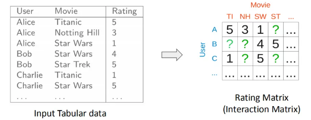
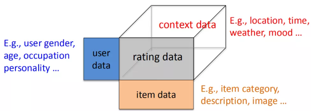
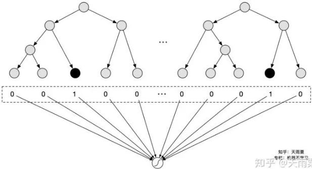
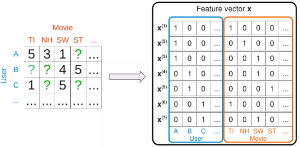
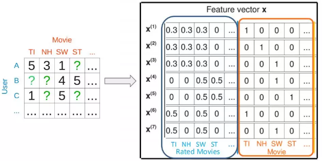

标的物包含很多自己的属性，用户通过与标的物的交互会产生行为日志，这些行为日志可以作为衡量用户对标的物偏好的标签，通过这些偏好标签为用户做推荐就是基于内容的推荐算法。

人以群分就是找到与用户兴趣相同的用户，将这些兴趣相同的用户浏览过物品推荐给用户，这就是基于用户的协同过滤算法。

物以类聚就是如果有很多用户都对某两个物品有相似的偏好， 说明这两个物品是相似的，我们可以通过推荐用户喜欢过的物品相似的物品这种方式为用户提供个性化推荐， 这就是基于物品的协同过滤推荐算法

### 传统匹配模型

辛普森悖论：在分组比较中都占优势的一方，在总评中反而是失势的一方。

| 模型名称     | 原理                                                         | 特性                                                 | 缺点                                                         | 公式                          |
| ------------ | ------------------------------------------------------------ | ---------------------------------------------------- | ------------------------------------------------------------ | ----------------------------- |
| 协同过滤     | 利用用户行为生成共现矩阵，利用用户或者商品的相似性进行推荐   | 简单、解释性强                                       | 泛化能力差、推荐头部效应强、处理稀疏能力差                   | 欧式距离、余弦距离、相关系数  |
| `CF`矩阵分解 | 把CF中的共现矩阵分解为用户和商品矩阵，利用用户和商品的隐向量的内积进行排序 | 泛化能力相较`CF`更强、加强洗漱处理能力、空间复杂度低 | 语`CF`一样仅仅使用了用户的行为历史，难以利用用户、物品特征、上下文特征 | 特征值分解、SVD分解、梯度下降 |
| 逻辑回归     | 将推荐问题转化成CTR预估排序，可以将用户、物品、上下文特征融入模型 | 相较于`CF`能够融合多种类型的特征                     | 特征不能够组合、表达能力较差、辛普森悖论                     |                               |
| `FM`         | 在`LR`基础上加入二阶特征交叉，二阶特征交叉的权重由隐向量的内积运算得到 | 表达能力增强                                         | 由于组合特征爆炸的问题限制，不易扩展到三阶特征组合           |                               |
| `FFM`        | 在`FM`的基础上引入了场的概念而形成的新模型，每个特征在与不同域的特征交叉时采用不同的隐向量。 | 与`FM`相比进一步加强了特征交叉的能力                 | 复杂度上升                                                   |                               |
| `GBDT+LR`    | 利用GBDT进行自动化特征组合，将原始特征向量转成离散的特征向量（数的叶节点），输入到逻辑回归，然后进行CTR预估 | 特征工作模型化、具备更高阶的特征组合                 | `GBDT`迭代的特性无法完成并行的训练，更新训练时间长。         |                               |

#### 基于Collaborative Filtering 的方法

##### CF模型

协同过滤基于一个最基本的假设：一个用户的行为，可以由和他行为相似的用户进行预测。协同过滤的基本思想是基于`<user, item>`的所有交互行为，利用集体智慧进行推荐。CF 按照类型可以分为3种，`user-based CF`、`item-based CF`和`model-based CF`。

协同过滤的思路要解决的问题用数据形式表达就是：矩阵的未知部分如何填充问题。已知的值是用户已经交互过的item，如何基于这些已知值填充矩阵剩下的未知值，也就是去预测用户没有交互过的item是矩阵填充要解决的问题。

假设有$m$个用户$\mathbb{U}=\{u_1,\cdots,u_m\}$以及$n$个 `item`$\mathbb{I}=\{i_1,\cdots,i_n\}$。每个用户$u$有一个 `item` 评分列表$\mathbb{I}_u$，这个列表上用户有过评分，其中$\mathbb{I}_u\sub \mathbb{I}$且有可能为空。给定用户$u_a\in\mathbb{U}$，协同过滤算法任务包含两种形式：预测：预测用户$u_a$对于`item`$i_j \notin\mathbb{I}_{u_a}$的评分$P_{a,j}$；推荐：为用户$u_a$推荐他/她可能最喜欢的由$N$个 `item`组成的列表$\mathbb{I}_r \sub \mathbb{I}$，且$\mathbb{I}_r \cap \mathbb{I}=\empty$。

###### 基于用户的协同过滤

通过对用户喜欢的物品进行分析，如果用户a和用户b喜欢过的物品差不多，那么用户a和b是相似的。可以将b喜欢过但是a没有看过的item推荐给a。首先计算不同用户的评分序列之间的相关性，从而得到用户兴趣之间的相似性；然后根据相似用户的评分来预测当前用户对于新文章的评分。

###### 基于物品的协同过滤

首先探索`item` 之间的相似性；然后向用户推荐她/他喜欢的 `item` 类似的 `item` 。因为`item` 之间的关系是相对静态的，所以基于 `item` 的算法可以预计算`item-item` 相似性，从而减少在线计算的数量，同时保持较高的推荐质量。

选择目标用户$u_a$已经评分的`item` 集合$\mathbb{I}_{u_a}$，然后计算评分集合中的每个 `item` 和未评分集合$\mathbb{I}-\mathbb{I}_{u_a}$中每个 `item`$i_j$的相似度，然后选择$k$个最相似的、未评分的 `item`$\{i_1^a,\cdots,i_k^a\}$，并记录对应的相似度。计算`item` 之间相似度的基本思想是：首先挑选既对$i$打分、又对$j$打分的用户$\mathbb{U}_{ij}$，然后基于这些用户的打分来计算相似度 。

基于余弦的相似度：$sim(i,j) = \frac{\sum_{a\in\mathbb{U}_{ij}}r_{a,j}\times r_{a,j}}{\sqrt{\sum_{a\in\mathbb{U}_{ij}}r_{a,i}^2}\sqrt{\sum_{a\in\mathbb{U}_{ij}}r_{a,j}^2}}$

根据相似性得到了目标`item` 最相似的一组`item`，则下一步是为用户执行打分预测。这里我们考虑两种技术：加权和 `weighted sum`：该方法通过用户已经评分的 `item` 中，根据和 的相似度进行加权得到预测结果。回归`Regression`：这种方式类似于加权和，但是不是直接使用相似`item` 的打分，而是基于回归模型来拟合的修正打分。

假设用户$a$已经评分，且与$i$相似的 `item` 集合为$\mathbb{S}_{i,a}$，则有
$$
P_{a,i} =\sum_{j\in\mathbb{S}_{i,a}}\omega_{ij}\times r_{a,j}\\
\omega_{i,j} = \frac{s_{i,j}}{\sum_{\mathbb{S}_{i,a}}s_{i,j}}
$$
回归方法的思想是：采用加权和相同的公式，但是不使用原始打分$r_{a,j}$，而是使用基于线性回归的近似值$r_{a,j}^{\prime}$。假设目标 `item`$i$的打分向量为$\vec{\mathbf{r}}_{\cdot,i}$，相似 `item`$j$的修正打分为：$\vec{\mathbf{r}}_{\cdot,j}=\alpha_{i,j}\vec{\mathbf{r}}_{\cdot,i}+\beta_{i,j}$

然后最小化来求解参数$\alpha_{i,j},\beta_{i,j}$。最终有：
$$
P_{a,i} =\sum_{j\in\mathbb{S}_{i,a}}\omega_{ij}\times (\alpha_{i,j}\times r_{a,j}+\beta_{i,j})\\
\omega_{i,j} = \frac{s_{i,j}}{\sum_{\mathbb{S}_{i,a}}s_{i,j}}
$$

###### 基于模型的协同过滤

通过定义一个参数模型来描述用户和物品、用户和用户、物品和物品之间的关系，然后通过已有的用户-物品评分矩阵来优化求解得到参数。例如矩阵分解、隐语义模型`LFM`等。

矩阵填充可以用经典的`SVD`解决，一般来说`SVD`求解可以分为三步：对 M 矩阵的缺失值填充为0；求解`SVD`问题，得到`U`矩阵和`V`矩阵；利用`U`和`V`矩阵的低秩`k`维矩阵来估计。

对于第二中的`SVD`求解问题等价于以下的最优化问题
$$
\text{argmin}_{U,\Sigma, V}(Y-U\Sigma V^T)^2=\text{arg min}_{U,\Sigma,V}\sum_{i=1}^{m}\sum_{j=1}^{n}(y_{ij}-(U\Sigma V^T)_{ij})^2
$$

其中$y_{ij}$为用户$i$对物品$j$的真实评分，也就是 label，$U$和$V$为模型预估值，求解矩阵$U$和$V$的过程就是最小化用户真实评分矩阵和预测矩阵误差的过程。

这种`SVD`求解方法存在以下问题：缺失数据和可观测数据权重一样；最小化过程没有正则化，容易产生过拟合。

##### `MF`模型（矩阵分解）

矩阵分解模型提出的模型如下：$\hat{y}_{ui} = \mathbf{v}_u^T\mathbf{v}_i$。

`MF`模型的核心思想可以分成两步：将用户$u$对物品$i$的打分分解成用户的隐向量$\mathbf{v}_u$，以及物品的隐向量$\mathbf{v}_i$；用户$u$和物品$i$的向量点积得到的值，可以用来代表用户$u$对物品$i$的喜好程度，分数越高代表该物品推荐给用户的概率就越大。同时，`MF`模型引入了$l_2$正则来解决过拟合问题。
$$
L=\sum_{u}\sum_{i}w_{ui}(y_{ui}-\hat{y}_{ui})^2+\lambda(\sum_u||\mathbf{v}_u||^2+\sum_i||\mathbf{v}_i||^2)
$$

##### `FISM`模型

将用户喜欢过的物品作为用户的表达来刻画用户，用数据公式表示如下：
$$
\hat{y}_{ui} = (\sum_{j \in \mathcal{R}_u}\mathbf{q}_j)^T\mathbf{v}_i
$$
其中$\mathcal{R}_u$是用户$u$交互过的商品的集合，对于每一个物品，都有两个嵌入向量$\mathbf{q}$和$\mathbf{v}$，$\mathbf{q}$是商品作为交互历史中的物品时的嵌入向量，$\mathbf{v}$时物品是预测的物品时的嵌入向量。

用户表达不再是独立的隐向量，而是用用户喜欢过的所有物品的累加求和得到作为用户的表达；而 物品本身的隐向量$\mathbf{v}_i$是另一套表示，两者最终同样用向量内积表示。

##### SVD++模型

`MF`模型可以看成是 user-based 的 CF 模型，直接将用户id映射成隐向量，而`FISM`模型可以看成是 item-based 的`CF`模型，将用户交户过的 item 的集合映射成隐向量。`SVD++`正是这两者的结合，数学表达如下：
$$
\hat{y}_{ui} = (\mathbf{v}_u+\sum_{j \in \mathcal{R}_u}\mathbf{q}_j)^T\mathbf{v}_i
$$
每个用户表达分成两个部分，左边$\mathbf{v}_u$表示用户 id 映射的隐向量，右边是用户交互过的 item 集合的求和。User 和 item 的相似度还是用向量点击来表达。

#### Generic feature-based的方法

上述的方法中都只是利用了用户和商品的交互信息，而对于大量的 side information 信息没有利用到。因此，下面将介绍如何利用这些特征，去构造 feature-based 的 model。特征体系三模块：用户信息、物品信息、交互信息

##### 逻辑回归

通过手动设计交叉特征以及特征离散化等方式，赋予LR这样的线性模型对数据集的非线性学习能力，高维离散特征+手动交叉特征构成了CTR预估的基础特征。

##### GBDT+LR

其本质上是通过Boosting Tree模型本身的特征组合能力来替代原先算法工程师们手动组合特征的过程。GBDT等这类Boosting Tree模型本身具备了特征筛选能力（每次分裂选取增益最大的分裂特征与分裂点）以及高阶特征组合能力（树模型天然优势），因此通过GBDT来自动生成特征向量就成了一个非常自然的思路。虽然是两个模型的组合，但实际并非是端到端的模型，而是两阶段的、解耦的，即先通过GBDT训练得到特征向量后，再作为下游LR的输入，LR的在训练过程中并不会对GBDT进行更新。

##### `POLY2`模型

$$
\hat{y}(\mathbf{x})=\omega_0+\sum_{i=1}^p\omega_ix_i+\sum_{i=1}^{K}\sum_{j=i+1}^{K}\omega_{ij}\times x_i\times x_j
$$

##### FM模型

对于每个输入特征，模型都需要学习一个低维的隐向量表达$\mathbf{v}$。
$$
\hat{y}(\mathbf{x})=\omega_0+\sum_{i=1}^p\omega_ix_i+\sum_{i=1}^{p}\sum_{j\gt i}^{p}<\mathbf{v}_i,\mathbf{v}_j>x_ix_j
$$
假如只使用 userid 和 itemid，我们可以发现其实`FM`退化成加了 bias 的`MF`模型

如果输入包含两个变量，用户交互过的 item 集合；itemid 本身，那么，此时的 FM 又将退化成带 bias 的 FISM 模型。同样道理，如果再加上 userid 的隐向量表达，那么 FM 模型将退化成 SVD++ 模型。

##### `FFM`模型

$$
\hat{y}(\mathbf{x})=\omega_0+\sum_{i=1}^p\omega_ix_i+\sum_{i=1}^K\sum_{j=i+1}^K\hat{\omega}_{ij}\times x_i\times x_j\\
\hat{\omega}_{ij}=<\vec{\mathbf{v}}_{i,f_j},\vec{\mathbf{v}}_{j,f_i}>
$$

其中：$f_i$表示第$i$个特征所属的 `field` ，一共有 个`field` 

`FFM` 模型需要为每个特征分配一个 `field` ，离散型特征：通常对离散型特征进行 `one-hot` 编码，编码后的所有二元特征都属于同一个 `field` 。数值型特征：数值型特征有两种处理方式：不做任何处理，简单的每个特征分配一个`field` 。数值特征离散化之后，按照离散型特征分配 `field` 。

