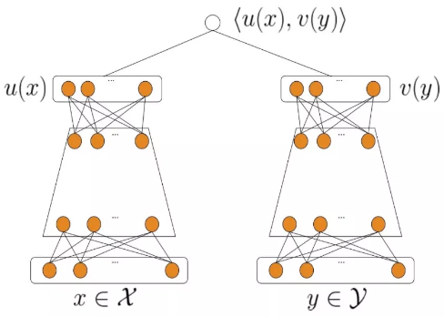
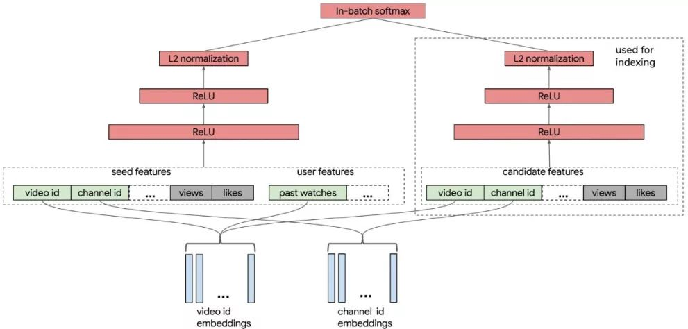
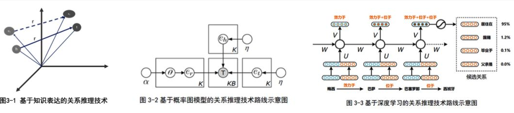

### 关联分析

关联分析的目标分为两项:发现频繁项集和发现关联规则。首先需要找到频繁项集，然后才能获得关联规则。

| 名称   | 定义                                                         |
| ------ | ------------------------------------------------------------ |
| 项     | 指我们分析数据中的一个对象，如豆奶                           |
| 项集   | 就是若干项的项构成的集合，如集合{豆奶，莴苣}是一个2项集。    |
| 支持度 | 某项集在数据集中出现的概率。即项集在记录中出现的次数，除以数据集中所有记录的数量。 |
| 置信度 | 关联规则{A->B}的置信度为A与B同时出现的次数，除以A出现的次数。即在A发生的条件下，B发生的概率。 |
| 提升度 | 关联规则{A->B}中，提升度是指{A->B}的置信度，除以B的支持度。提升度体现的是组合相对不组合的比值，如果提升度大于1，则说明应用该关联规则是有价值的。 |

支持度体现的是某项集的频繁程度，只有某项集的支持度达到一定程度，我们才有研究该项集的必要。

###### `Apriori`算法

1.生成单个物品的项集
2.剔除支持度小于阈值的项，得到频繁1项集
3.将频繁1项集组合得到2项集
4.剔除支持度小于阈值的项，得到频繁2项集
5.重复上述步骤直到所有项集都去掉

对于一个项集{0,1,2,3}产生关联规则，需要生成一个可能的规则列表，然后测试每条规则的可信度。如果某条规则不满足最小置信度，那么该规则的所有子集也都不满足最小置信度。比如规则{0,1,2}->{3}不满足最小可信度要求，那么任何左部为{0,1,2}子集的规则也不会满足最小可信度要求，或者说所有以{3}作为后件的规则不会满 足最小可信度要求。

Apriori 在计算的过程中有以下几个缺点：

1. 可能产生大量的候选集。因为采用排列组合的方式，把可能的项集都组合出来了
2. 每次计算都需要重新扫描数据集，来计算每个项集的支持度

###### `FP-Growth`算法

1. 首先创建项头表，这一步的流程是先扫描一遍数据集，对于满足最小支持度的单个项按照支持度从高到低进行排序，这个过程中删除了不满足最小支持度的项
2. 对于每一条数据，按照支持度从高到低的顺序进行创建节点（也就是第一步中项头表中的排序结果），节点如果存在就将计数 count+1，如果不存在就进行创建。同时在创建的过程中，需要更新项头表的链表
   1. 先把原始数据按照支持度排序，把以上每行数据，按照顺序插入到FP树中，注意FP树的根节点记为 NULL 节点。

得到 FP 树后，需要对每一个频繁项，逐个挖掘频繁项集。具体过程为：首先获得频繁项的前缀路径，然后将前缀路径作为新的数据集，以此构建前缀路径的条件 FP 树。然后对条件 FP 树中的每个频繁项，获得前缀路径并以此构建新的条件 FP 树。不断迭代，直到条件 FP 树中只包含一个频繁项为止

### 其他

##### 召回模型

###### 向量化召回

通过模型来学习用户和物品的兴趣向量，并通过内积来计算用户和物品之间的相似性，从而得到最终的候选集。

$$
P(\omega_t=i|U,C) = \frac{e^{v_iu}}{\sum_{j\in V}e^{v_ju}}
$$
两侧分别对 user 和 item 特征通过D`NN`输出向量，并在最后一层计算二个输出向量的内积。

多 Embedding 向量召回-用户多兴趣表达，通过一种模型来建模出用户多个 embedding 的表示。

Multi-Interest 抽取层负责建模用户多个兴趣向量 embedding，然后通过 Label-aware Attention 结构对多个兴趣向量加权。这是因为多个兴趣 embedding 和待推荐的 item 的相关性肯定不同。其中上图中的 K，V 都表示用户多兴趣向量，Q 表示待推荐 item 的 embedding 表示，最终用户的 embedding 表示为：
$$
\vec{\mathbf{v}_u} = Attention(\vec{\mathbf{e}_i}, V_u, V_u)=V_usoftmax{pow(V_u^T\vec{\mathbf{e}_i}, p)}
$$
 $e_i$表示 item embedding，$V_u$表示 Multi-Interest 抽取层输出的用户多个兴趣向量 embedding。然后使用$V_u$和待推荐 item embedding，计算用户u和商品i交互的概率，计算方法和 YouTube DNN 一样。

##### Embedding

 Embedding 层往往采用预训练的方式完成。  Embedding 的训练往往独立于深度学习网络进行。在得到稀疏特征的稠密表达之后，再与其他特征一起输入神经网络进行训练。 

#### 知识图谱

如果两个节点之间存在关系，他们就会被一条无向边连接在一起，那么这个节点，我们就称为**实体**（Entity），它们之间的这条边，我们就称为**关系**（Relationship）。知识图谱的基本单位，便是“实体（Entity）-关系（Relationship）-实体（Entity）”构成的三元组，这也是知识图谱的核心。

##### 架构

知识图谱的架构主要可以被分为：逻辑架构、技术架构

###### 逻辑架构

在逻辑上，我们通常将知识图谱划分为两个层次：数据层和模式层。模式层：在数据层之上，是知识图谱的核心，存储经过提炼的知识，通常通过本体库来管理这一层。数据层：存储真实的数据。本体库可以理解为面向对象里的“类”这样一个概念，本体库就储存着知识图谱的类

模式层：实体-关系-实体，实体-属性-性值；数据层：比尔盖茨-妻子-梅琳达·盖茨，比尔盖茨-总裁-微软

###### 技术架构

知识图谱有自顶向下和自底向上两种构建方式，这里提到的构建技术主要是自底向上的构建技术。构建知识图谱是一个迭代更新的过程，根据知识获取的逻辑，每一轮迭代包含三个阶段：信息抽取：从各种类型的数据源中提取出实体、属性以及实体间的相互关系，在此基础上形成本体化的知识表达；知识融合：在获得新知识之后，需要对其进行整合，以消除矛盾和歧义，比如某些实体可能有多种表达，某个特定称谓也许对应于多个不同的实体等；知识加工：对于经过融合的新知识，需要经过质量评估之后，才能将合格的部分加入到知识库中，以确保知识库的质量。

信息抽取是一种自动化地从半结构化和无结构数据中抽取实体、关系以及实体属性等结构化信息的技术。实体抽取，也称为命名实体识别（named entity recognition，NER），是指从文本数据集中自动识别出命名实体。关系抽取，从相关语料中提取出实体之间的关联关系，通过关系将实体联系起来，才能够形成网状的知识结构。属性抽取，从不同信息源中采集特定实体的属性信息，如针对某个公众人物，可以从网络公开信息中得到其昵称、生日、国籍、教育背景等信息。

知识融合：实体链接是指对于从文本中抽取得到的实体对象，将其链接到知识库中对应的正确实体对象的操作。其基本思想是首先根据给定的实体指称项，从知识库中选出一组候选实体对象，然后通过相似度计算将指称项链接到正确的实体对象。实体链接的流程：从文本中通过实体抽取得到实体指称项；进行实体消歧和共指消解，判断知识库中的同名实体与之是否代表不同的含义以及知识库中是否存在其他命名实体与之表示相同的含义；在确认知识库中对应的正确实体对象之后，将该实体指称项链接到知识库中对应实体。

知识加工：通过信息抽取，从原始语料中提取出了实体、关系与属性等知识要素，并且经过知识融合，消除实体指称项与实体对象之间的歧义，得到一系列基本的事实表达。然而事实本身并不等于知识。要想最终获得结构化，网络化的知识体系，还需要经历知识加工的过程。

本体：是指人工的概念集合、概念框架。本体可以采用人工编辑的方式手动构建，也可以以数据驱动的自动化方式构建本体。因为人工方式工作量巨大，且很难找到符合要求的专家，因此当前主流的全局本体库产品，都是从一些面向特定领域的现有本体库出发，采用自动构建技术逐步扩展得到的。

自动化本体构建过程包含三个阶段：实体并列关系相似度计算、实体上下位关系抽取、本体的生成

当知识图谱刚得到“阿里巴巴”、“腾讯”、“手机”这三个实体的时候，可能会认为它们三个之间并没有什么差别，但当它去计算三个实体之间的相似度后，就会发现，阿里巴巴和腾讯之间可能更相似，和手机差别更大一些。这就是第一步的作用，但这样下来，知识图谱实际上还是没有一个上下层的概念，它还是不知道，阿里巴巴和手机，根本就不隶属于一个类型，无法比较。因此我们在实体上下位关系抽取这一步，就需要去完成这样的工作，从而生成第三步的本体。当三步结束后，这个知识图谱可能就会明白，“阿里巴巴和腾讯，其实都是公司这样一个实体下的细分实体。它们和手机并不是一类。”

知识推理：在我们完成了本体构建这一步之后，一个知识图谱的雏形便已经搭建好了。但可能在这个时候，知识图谱之间大多数关系都是残缺的，缺失值非常严重，那么这个时候，我们就可以使用知识推理技术，去完成进一步的知识发现。

当然知识推理的对象也并不局限于实体间的关系，也可以是实体的属性值，本体的概念层次关系等。这一块的算法主要可以分为3大类，基于逻辑的推理、基于图的推理和基于深度学习的推理。

知识更新：从逻辑上看，知识库的更新包括概念层的更新和数据层的更新。概念层的更新是指新增数据后获得了新的概念，需要自动将新的概念添加到知识库的概念层中。数据层的更新主要是新增或更新实体、关系、属性值，对数据层进行更新需要考虑数据源的可靠性、数据的一致性等可靠数据源，并选择在各数据源中出现频率高的事实和属性加入知识库。

知识图谱的内容更新有两种方式：全面更新：指以更新后的全部数据为输入，从零开始构建知识图谱。这种方法比较简单，但资源消耗大，而且需要耗费大量人力资源进行系统维护；增量更新：以当前新增数据为输入，向现有知识图谱中添加新增知识。这种方式资源消耗小，但目前仍需要大量人工干预（定义规则等），因此实施起来十分困难。

此处我们给出可疑样本的定义。

假设我们存在$N$个样本$(x_1,y_1),(x_2,y_2),...,(x_N,y_N)$,$x_i$为第$i$个样本的特征,$y_i$为第$i$个样本对应的标签,$y_i \in \{1,2,3...,K\}$,$K \ge 3$为类的个数,我们采用已经训练好的模型$Model$对$N$个样本进行预测,得到一个$N*K$的概率矩阵,我们用$p_{ij}$表示为$Model$把第$i$个样本预测为第$j$类的概率,并且将每一个样本中概率最大的值对应的类作为我们最终的预测结果.即$argmax_j ~ p_{ij}, j \in K$为第$i$个样本的预测结果.  

**可疑样本定义:** 对于每一个样本$x_i $, 令$ q_i = max ~ p_{ij},~ j \in \{1,2,...,K\}, i \in \{1,2,...,N\}$,我们将所有 $q_i \le threshold,i \in \{1,2,...,N\} $的样本定义为可疑样本,表示模型对该类样本的预测没有较强把握.

#### 算法步骤

**1.输入**: 训练数据$Train$,$\{(x_1,y_1),(x_2,y_2),...,(x_{N_1},y_{N_1}) \}, x_i \in R^d, y_i \in \{1,2,..., M\}$, 测试集$Test$,$\{(x_1,y_1),(x_2,y_2),...,(x_{N_2},y_{N_2}) \}$.可疑样本的$Threshold$. $KNN$的$K$以及采用的距离函数。 

**2.模型训练**: 对数据集Train进行训练获得模型$Model$。 

**3.模型预测:**使用模型$Model$分别对训练集和测试集进行预测得到训练集的预测概率矩阵$Matrix\_Tr \in R^{N_1 * M}$以及测试集的概率矩阵$Matrix\_Te \in R^{N_2 * M}$。 

**4.KNN纠正**: 将测试集中预测结果概率低于$Threshold$的样本的预测数据提取出来形成新的测试集$Test'$,将训练集的预测矩阵作为新的训练集的特征并使用$KNN$进行训练获得KNN模型,使用$KNN$对$Test'$进行预测,并将新的预测结果替代原先的预测结果。 

**5.输出:**将纠正后的预测结果作为最终结果进行输出。 

####  算法步骤

**1.输入**: 训练数据$Train$,$\{(x_1,y_1),(x_2,y_2),...,(x_{N_1},y_{N_1}) \}, x_i \in R^d, y_i \in \{1,2,..., K\}$, 测试集$Test$,$\{(x_1,y_1),(x_2,y_2),...,(x_{N_2},y_{N_2}) \}$.训练集可疑样本的$Threshold\_Tr$.测试集可疑样本的$Threshold\_Te$.$KNN$的$K$以及采用的距离函数。
**2.模型训练:** 对数据集$Train$进行训练获得模型$Model$。
**3.模型预测:****使用模型$Model$分别对训练集和测试集进行预测得到训练集的预测概率矩阵$Matrix\_Tr \in R^{N_1 * K}$以及测试集的概率矩阵$Matrix\_Te \in R^{N_2 * K}$。
**4.KNN纠正:** 将测试集中预测结果概率低于$Threshold\_Te$的样本的预测数据提取出来形成新的测试集$Test'$,将训练集的预测矩阵高于$Threshold\_Tr$作为过滤之后的训练集的特征并使用$KNN$进行训练获得$KNN$模型,使用$KNN$对$Test'$进行预测,并将新的预测结果替代原先的预测结果。 
**5.输出:**将纠正后的预测结果作为最终结果进行输出。

