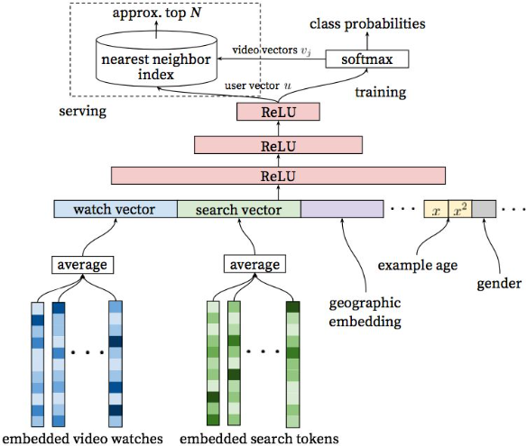
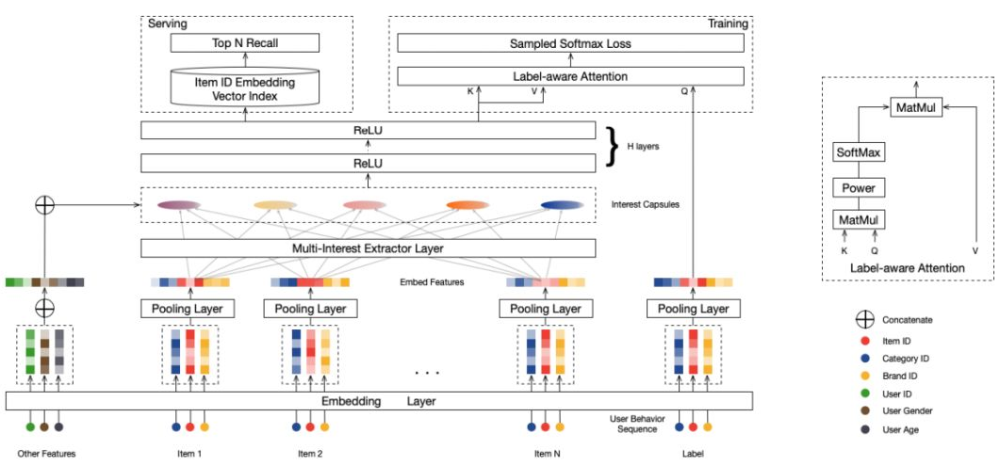

### 关联分析

关联分析的目标分为两项:发现频繁项集和发现关联规则。首先需要找到频繁项集，然后才能获得关联规则。

| 名称   | 定义                                                         |
| ------ | ------------------------------------------------------------ |
| 项     | 指我们分析数据中的一个对象，如豆奶                           |
| 项集   | 就是若干项的项构成的集合，如集合{豆奶，莴苣}是一个2项集。    |
| 支持度 | 某项集在数据集中出现的概率。即项集在记录中出现的次数，除以数据集中所有记录的数量。 |
| 置信度 | 关联规则{A->B}的置信度为A与B同时出现的次数，除以A出现的次数。即在A发生的条件下，B发生的概率。 |
| 提升度 | 关联规则{A->B}中，提升度是指{A->B}的置信度，除以B的支持度。提升度体现的是组合相对不组合的比值，如果提升度大于1，则说明应用该关联规则是有价值的。 |

支持度体现的是某项集的频繁程度，只有某项集的支持度达到一定程度，我们才有研究该项集的必要。

###### `Apriori`算法

1.生成单个物品的项集
2.剔除支持度小于阈值的项，得到频繁1项集
3.将频繁1项集组合得到2项集
4.剔除支持度小于阈值的项，得到频繁2项集
5.重复上述步骤直到所有项集都去掉

对于一个项集{0,1,2,3}产生关联规则，需要生成一个可能的规则列表，然后测试每条规则的可信度。如果某条规则不满足最小置信度，那么该规则的所有子集也都不满足最小置信度。比如规则{0,1,2}->{3}不满足最小可信度要求，那么任何左部为{0,1,2}子集的规则也不会满足最小可信度要求，或者说所有以{3}作为后件的规则不会满 足最小可信度要求。

Apriori 在计算的过程中有以下几个缺点：

1. 可能产生大量的候选集。因为采用排列组合的方式，把可能的项集都组合出来了
2. 每次计算都需要重新扫描数据集，来计算每个项集的支持度

###### `FP-Growth`算法

1. 首先创建项头表，这一步的流程是先扫描一遍数据集，对于满足最小支持度的单个项按照支持度从高到低进行排序，这个过程中删除了不满足最小支持度的项
2. 对于每一条数据，按照支持度从高到低的顺序进行创建节点（也就是第一步中项头表中的排序结果），节点如果存在就将计数 count+1，如果不存在就进行创建。同时在创建的过程中，需要更新项头表的链表
   1. 先把原始数据按照支持度排序，把以上每行数据，按照顺序插入到FP树中，注意FP树的根节点记为 NULL 节点。

得到 FP 树后，需要对每一个频繁项，逐个挖掘频繁项集。具体过程为：首先获得频繁项的前缀路径，然后将前缀路径作为新的数据集，以此构建前缀路径的条件 FP 树。然后对条件 FP 树中的每个频繁项，获得前缀路径并以此构建新的条件 FP 树。不断迭代，直到条件 FP 树中只包含一个频繁项为止

### 其他

##### 召回模型

###### 向量化召回

通过模型来学习用户和物品的兴趣向量，并通过内积来计算用户和物品之间的相似性，从而得到最终的候选集。

$$
P(\omega_t=i|U,C) = \frac{e^{v_iu}}{\sum_{j\in V}e^{v_ju}}
$$
两侧分别对 user 和 item 特征通过D`NN`输出向量，并在最后一层计算二个输出向量的内积。

多 Embedding 向量召回-用户多兴趣表达，通过一种模型来建模出用户多个 embedding 的表示。

Multi-Interest 抽取层负责建模用户多个兴趣向量 embedding，然后通过 Label-aware Attention 结构对多个兴趣向量加权。这是因为多个兴趣 embedding 和待推荐的 item 的相关性肯定不同。其中上图中的 K，V 都表示用户多兴趣向量，Q 表示待推荐 item 的 embedding 表示，最终用户的 embedding 表示为：
$$
\vec{\mathbf{v}_u} = Attention(\vec{\mathbf{e}_i}, V_u, V_u)=V_usoftmax{pow(V_u^T\vec{\mathbf{e}_i}, p)}
$$
 $e_i$表示 item embedding，$V_u$表示 Multi-Interest 抽取层输出的用户多个兴趣向量 embedding。然后使用$V_u$和待推荐 item embedding，计算用户u和商品i交互的概率，计算方法和 YouTube DNN 一样。

##### Embedding

 Embedding 层往往采用预训练的方式完成。  Embedding 的训练往往独立于深度学习网络进行。在得到稀疏特征的稠密表达之后，再与其他特征一起输入神经网络进行训练。 

##### 推荐系统与搜索引擎

推荐系统就是系统根据用户的属性，用户在系统里过去的行为，以及当前上下文环境 ( 如网络、手机设备、时间等 )，从而给用户推荐用户可能感兴趣的物品，从这个过程来看，推荐系统就是一个给 user 匹配感兴趣的 item 的过程。

搜索引擎需要 match 的是 query 和相关的 doc；推荐系统需要 match 的是 user和相关的 item。

###### 推荐系统与搜索引擎对比

| 不同之处       | 说明                                                         |
| -------------- | ------------------------------------------------------------ |
| 意图不同       | 搜索是用户带着明确的目的，搜索过程用户带着明确的搜索意图。而推荐是系统被动触发，系统是带着一种 "猜" 的状态给用户推送物品。 |
| 时效不同       | 搜索需要尽快满足用户此次请求 query，推荐更希望能增加用户的时长和留存从而提升整体 LTV 。 |
| 相关性要求不同 | 搜索有严格的 query 限制，搜索结果需要保证相关性，搜索结果量化评估标准也相对容易。推荐没有明确的相关性要求。推荐很难在离线阶段从相关性角度结果评定是否好坏，只能从线上效果看用户是否买单做评估。 |
| 实体不同       | 搜索中的两大实体是 query 和 doc，本质上都是文本信息。推荐中的两大实体是 user 和 item，两者的表征体系可能完全没有重叠。user 和 item 的匹配是无法从表面的特征解决两者差异。 |
| 个性化要求不同 | 搜索有用户的主动 query，本质上这个 query 已经在告诉系统这个 "用户" 是谁了，query 本身代表的就是一类用户，而推荐没有用户主动的 query 输入 |

| 相同     | 说明                                                         |
| -------- | ------------------------------------------------------------ |
| 本质     | 本质都是一个match过程，如果把 user 比作 query，把 item 比作 doc，那么推荐和搜索在这个层面又是相同的，都是针对一个 query，从海量的候选物品库中，根据 query 和 doc 的相关性，去推荐匹配的 doc。 |
| 目标     | 搜索和推荐的目标都是针对一次 context，从候选池选出尽可能满足需求的物品。两者区别只是挑选过程使用的信息特征不同。 |
| 语义鸿沟 | 在搜索里表现是 query 和 doc 的语义理解，推荐里则是 user 和 item 的理解。 |

##### 推荐系统评估

| 推荐系统范式         | 说明                                                         |
| -------------------- | ------------------------------------------------------------ |
| 完全个性化范式       | 为每个用户提供个性化的内容，每个用户推荐结果都不同           |
| 群组个性化范式       | 首先将用户分组，每组用户提供一个个性化的推荐列表，同一组的用户推荐列表一样，不同组的用户推荐列表不一样 |
| 非个性化范式         | 为所有用户提供完全一样的推荐                                 |
| 标的物关联标的物范式 | 为每个标的物关联一组标的物，作为用户在访问标的物详情页时的推荐，每个用户都是相同的标的物 |
| 笛卡尔积范式         | 每个用户跟每个标的物的组合产生的推荐都不相同，不同用户在同一个视频的详情页看到的推荐结果都不一样 |

| 推荐方式   | 说明                                                         |
| ---------- | ------------------------------------------------------------ |
| 热门推荐   | 就是热门排行榜的概念。这应该是效果最好的一种推荐方式，毕竟热门推荐的物品都是位于曝光量比较高的位置的。 |
| 人工推荐   | 人工干预的推荐内容。相比于依赖热门和算法来进行推荐。一些热点时事如世界杯等就需要人工加入推荐列表。另一方面，热点新闻带来的推荐效果也是很高的。 |
| 相关推荐   | 相关推荐有点类似于关联规则的个性化推荐，就是在你阅读一个内容的时候，会提示你阅读与此相关的内容。 |
| 个性化推荐 | 基于用户的历史行为做出的内容推荐。                           |

在很多网站中，推荐列表并不是给用 户展示内容的唯一列表，那么当一个新物品加入时，总会有用户从某些途径看到这些物品，对这 些物品产生反馈。那么，当一个用户对某个物品产生反馈后，和他历史兴趣相似的其他用户的推 荐列表中就有可能出现这一物品，从而更多的人就会对这个物品产生反馈，导致更多的人的推荐 列表中会出现这一物品，因此该物品就能不断地扩散开来，从而逐步展示到对它感兴趣用户的推 荐列表中

- **静态画像**： 用户独立于产品场景之外的属性，例如用户的自然属性，这类信息比较稳定，具有统计性意义。
- **动态画像**： 用户在场景中所产生的显示行为或隐式行为。

隐式行为的权重往往不会有显示行为大，但是在实际业务中，用户的显示行为都是比较稀疏的，所以需要依赖大量的隐式行为。

推荐算法主要分为以下几步：

- **召回**：当用户以及内容量比较大的时候，往往先通过召回策略，将百万量级的内容先缩小到百量级。
- **过滤**：对于内容不可重复消费的领域，例如实时性比较强的新闻等，在用户已经曝光和点击后不会再推送到用户面前。
- **精排**：对于召回并过滤后的内容进行排序，将百量级的内容并按照顺序推送。
- **混排**：为避免内容越推越窄，将精排后的推荐结果进行一定修改，例如控制某一类型的频次。
- **强规则**：根据业务规则进行修改，例如在活动时将某些文章置顶。

总体而言，召回环节的有监督模型化以及一切 Embedding 化，这是两个相辅相成的总体发展趋势。如果我们根据召回路是否有用户个性化因素存在来划分，可以分成两大类：一类是无个性化因素的召回路，比如热门商品或者热门文章或者历史点击率高的物料的召回；另外一类是包含个性化因素的召回路，比如用户兴趣标签召回。

