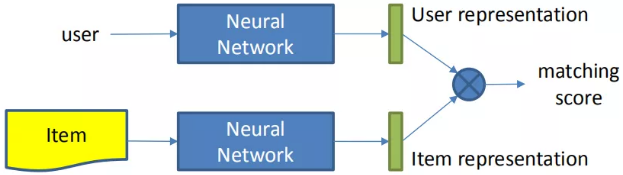
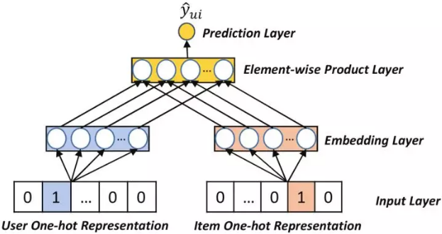
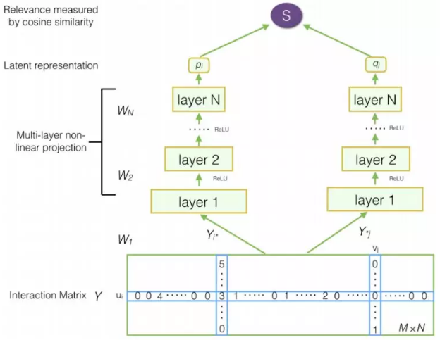
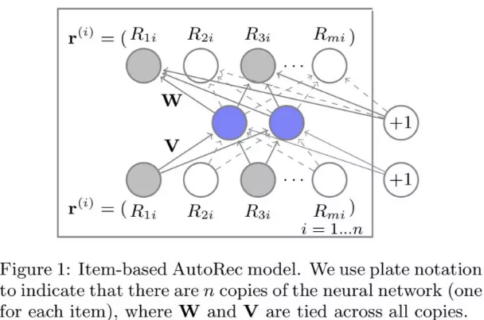
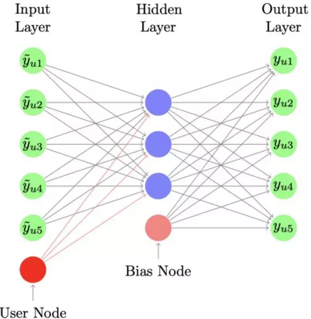
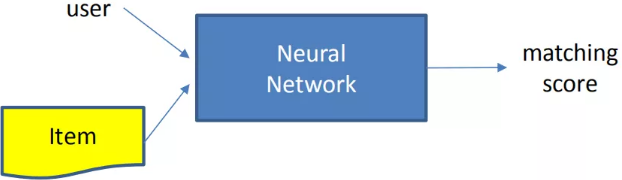
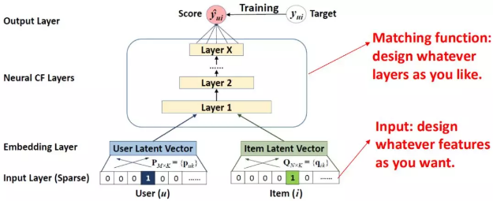
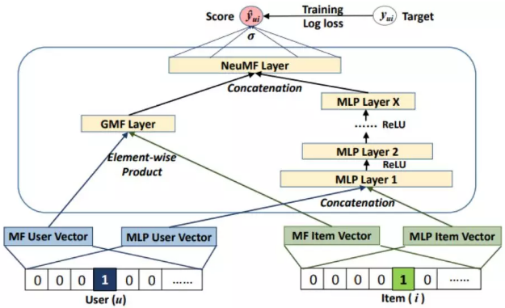
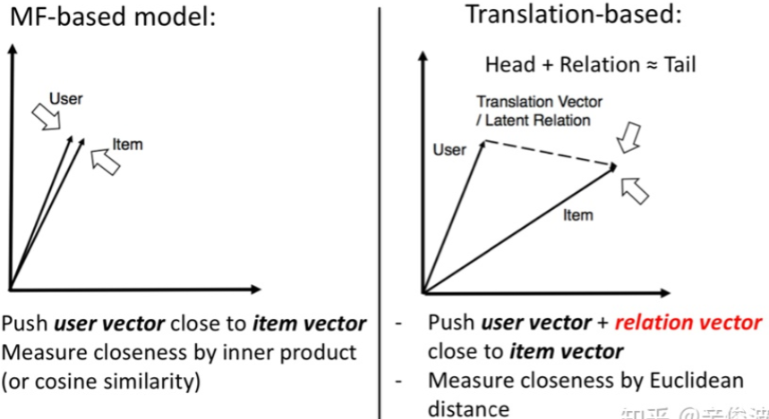
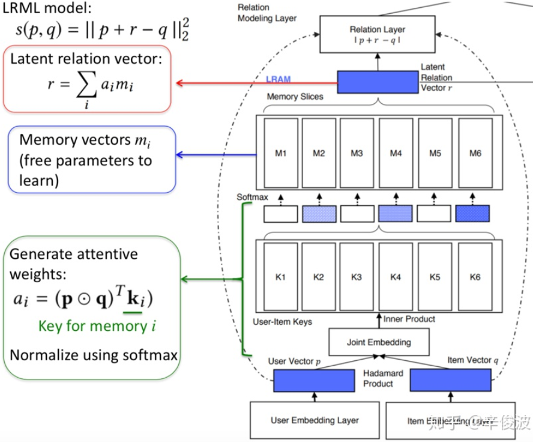

### 传统的协同过滤方法

协同过滤是基于用户行为设计的推荐算法，具体来说，是通过群体的行为来找到某种相似性（用户之间的相似性或者物品之间的相似性），通过相似性来为用户做决策和推荐。

协同过滤包括协同和过滤两个操作。协同就是汇集所有用户的反馈、评价等（与网站不断进行互动。而过滤，通过协同得到的信息，从海量物品进行过滤，筛选出用户感兴趣的物品。

| 名称     | 说明                                                         |
| -------- | ------------------------------------------------------------ |
| 显示行为 | 用户明确的表达了自己的喜好，例如点赞、分享、关注、评分等。   |
| 隐式行为 | 用户没有明确表达自己的喜好，用户会用实际行动，例如点击、停留时长等隐性的行为表达自己的喜好。 |
|          |                                                              |

协同过滤模型的局限性，无法加入用户、物品属性、上下文特征等边信息，这是的丧失了很多有效信息，无法进行有效的推荐。

#### 基于邻域的方法

基于邻域的方法根据计算用户或物品的相似性的不同又细分为两种：基于用户的协同过滤和基于物品的协同过滤。

假设有$m$个用户$\mathbb{U}=\{u_1,\cdots,u_m\}$以及$n$个 `item`$\mathbb{I}=\{i_1,\cdots,i_n\}$。每个用户$u$有一个 `item` 评分列表$\mathbb{I}_u$，这个列表上用户有过评分，其中$\mathbb{I}_u\sub \mathbb{I}$且有可能为空。我们可以根据每个用户$u$的$\mathbb{I}_u$构建用户和物品的评分矩阵$R$
$$
\begin{equation}Y_{u i}=\left\{\begin{array}{ll}
R_{ui}, & \text { if } i \in \mathbb{I}_u \\
0, & \text { otherwise }
\end{array}\right.\end{equation}
$$
给定用户$u_a\in\mathbb{U}$，协同过滤算法任务包含两种形式：预测：预测用户$u_a$对于`item`$i_j \notin\mathbb{I}_{u_a}$的评分$P_{a,j}$；推荐：为用户$u_a$推荐他/她可能最喜欢的由$N$个 `item`组成的列表$\mathbb{I}_r \sub \mathbb{I}$，且$\mathbb{I}_r \cap \mathbb{I}=\empty$。

两个向量之间的相似度计算方法主要有如下几种：

- `Jaccard`系数：$J(\mathbf{X},\mathbf{Y})=\frac{\mathbf{X}\cap\mathbf{Y}}{\mathbf{X}\cup\mathbf{Y}}$
- `Cosine`相似度、`Pearson`相关系数

##### 基于用户的协同过滤

首先计算用户兴趣之间的相似性。给定用户$u$和$v$，定义他们共同评分的`item`集合为：
$$
\mathbb{I}_{u,v} = \{j|r_{u,j}>0 \and r_{v,j}>0\}
$$
其中$r_{i,j}$表示用户$i$对于`item`$j$的评分，该评分可能是已知的，也可能是未知的。然后计算用户$u,v$在这些共同评分`item`上的均值、方差、以及协方差，用户$u$和$v$的评分集合的相关系数：$s_{u,v}=\frac{\text{cov}(u,v)}{\sigma_u\sigma_v}$ 

预测用户$u$在未评分`item`$j^*$上的评分时，首先找出在$j^*$上存在评分的用户：$\mathbb{U}_{j^*}=\{i|r_{i,j^*}>0\}$。然后我们基于用户$u$和集合$\mathbb{U}$中用户的相似性来预测：
$$
w_v=\frac{s_{u,v}}{\sum_{v\in\mathbb{U}_{j^*}}s_{u,v}}\\
r_{u,j^*} = \overline{r}_u+\sum_{v\in \mathbb{U}_{j^*}}w_v(r_{v,j^*}-\overline{r}_v)
$$

##### 基于物品的协同过滤

首先探索`item` 之间的相似性；然后向用户推荐她/他喜欢的 `item` 类似的 `item` 。因为`item` 之间的关系是相对静态的，所以基于 `item` 的算法可以预计算`item-item` 相似性，从而减少在线计算的数量，同时保持较高的推荐质量。

选择目标用户$u_a$已经评分的`item` 集合$\mathbb{I}_{u_a}$，然后计算评分集合中的每个 `item` 和未评分集合$\mathbb{I}-\mathbb{I}_{u_a}$中每个 `item`$i_j$的相似度，然后选择$k$个最相似的、未评分的 `item`$\{i_1^a,\cdots,i_k^a\}$，并记录对应的相似度。

计算`item` 之间相似度的基本思想是：首先挑选既对$i$打分、又对$j$打分的用户$\mathbb{U}_{ij}$，然后基于这些用户的打分来计算相似度 。基于余弦的相似度：$sim(i,j) = \frac{\sum_{a\in\mathbb{U}_{ij}}r_{a,j}\times r_{a,j}}{\sqrt{\sum_{a\in\mathbb{U}_{ij}}r_{a,i}^2}\sqrt{\sum_{a\in\mathbb{U}_{ij}}r_{a,j}^2}}$

根据相似性得到了目标`item` 最相似的一组`item`，则下一步是为用户执行打分预测。

加权和 `weighted sum`：该方法通过用户已经评分的 `item` 中，根据和$i$的相似度进行加权得到预测结果。假设用户$a$已经评分，且与$i$相似的 `item` 集合为$\mathbb{S}_{i,a}$，则有
$$
P_{a,i} =\sum_{j\in\mathbb{S}_{i,a}}\omega_{ij}\times r_{a,j}\\
\omega_{i,j} = \frac{s_{i,j}}{\sum_{\mathbb{S}_{i,a}}s_{i,j}}
$$
回归`Regression`：采用加权和相同的公式，但是不使用原始打分$r_{a,j}$，而是使用基于线性回归的近似值$r_{a,j}^{\prime}$。假设目标 `item`$i$的打分向量为$\vec{\mathbf{r}}_{\cdot,i}$，相似 `item`$j$的修正打分为：$\vec{\mathbf{r}}_{\cdot,j}=\alpha_{i,j}\vec{\mathbf{r}}_{\cdot,i}+\beta_{i,j}$。然后最小化来求解参数$\alpha_{i,j},\beta_{i,j}$。最终有：
$$
P_{a,i} =\sum_{j\in\mathbb{S}_{i,a}}\omega_{ij}\times (\alpha_{i,j}\times r_{a,j}+\beta_{i,j})\\
\omega_{i,j} = \frac{s_{i,j}}{\sum_{\mathbb{S}_{i,a}}s_{i,j}}
$$

基于用户的协同过滤适合时效性较强，用户的个性化兴趣不太明显的领域，如新闻领域；而基于物品的协同过滤适合兴趣变化较为稳定的应用，比如电商场景、视频推荐等。对于基于邻近的方法，虽然其解释性较强，但是它并不具有较强的泛化能力。处理稀疏向量的能力弱。

#### 隐语义模型

协同过滤的思路要解决的问题用数据形式表达就是用户-物品的交互矩阵的未知部分如何填充问题。已知的值是用户已经交互过的物品，如何基于这些已知值填充矩阵剩下的未知值，也就是去预测用户没有交互过的物品是矩阵填充要解决的问题。

##### `SVD`分解

矩阵填充可以用经典的`SVD`解决，一般来说`SVD`求解可以分为三步：对 M 矩阵的缺失值填充为0；求解`SVD`问题，得到`U`矩阵和`V`矩阵；利用`U`和`V`矩阵的低秩`k`维矩阵来估计。

对于第二中的`SVD`求解问题等价于以下的最优化问题
$$
\text{argmin}_{U,\Sigma, V}(Y-U\Sigma V^T)^2=\text{arg min}_{U,\Sigma,V}\sum_{i=1}^{m}\sum_{j=1}^{n}(y_{ij}-(U\Sigma V^T)_{ij})^2
$$

其中$y_{ij}$为用户$i$对物品$j$的真实评分，也就是label，$U$和$V$为模型预估值，求解矩阵$U$和$V$的过程就是最小化用户真实评分矩阵和预测矩阵误差的过程。

这种`SVD`求解方法存在以下问题：缺失数据和可观测数据权重一样；最小化过程没有正则化，容易产生过拟合。

##### `MF`模型（矩阵分解）

矩阵分解模型提出的模型如下：$\hat{y}_{ui} = \mathbf{v}_u^T\mathbf{v}_i$。

`MF`模型的核心思想可以分成两步：将用户$u$对物品$i$的打分分解成用户的隐向量$\mathbf{v}_u$，以及物品的隐向量$\mathbf{v}_i$；用户$u$和物品$i$的向量点积得到的值，可以用来代表用户$u$对物品$i$的喜好程度，分数越高代表该物品推荐给用户的概率就越大。同时，`MF`模型引入了$l_2$正则来解决过拟合问题。
$$
L=\sum_{u}\sum_{i}w_{ui}(y_{ui}-\hat{y}_{ui})^2+\lambda(\sum_u||\mathbf{v}_u||^2+\sum_i||\mathbf{v}_i||^2)
$$

##### `FISM`模型

将用户喜欢过的物品作为用户的表达来刻画用户，用数据公式表示如下：
$$
\hat{y}_{ui} = (\sum_{j \in \mathcal{R}_u}\mathbf{q}_j)^T\mathbf{v}_i
$$
其中$\mathcal{R}_u$是用户$u$交互过的商品的集合，对于每一个物品，都有两个嵌入向量$\mathbf{q}$和$\mathbf{v}$，$\mathbf{q}$是商品作为交互历史中的物品时的嵌入向量，$\mathbf{v}$时物品是预测的物品时的嵌入向量。

用户表达不再是独立的隐向量，而是用用户喜欢过的所有物品的累加求和得到作为用户的表达；而 物品本身的隐向量$\mathbf{v}_i$是另一套表示，两者最终同样用向量内积表示。

##### `SVD++`模型

`MF`模型可以看成是 user-based 的 CF 模型，直接将用户id映射成隐向量，而`FISM`模型可以看成是 item-based 的`CF`模型，将用户交户过的 item 的集合映射成隐向量。`SVD++`正是这两者的结合，数学表达如下：
$$
\hat{y}_{ui} = (\mathbf{v}_u+\sum_{j \in \mathcal{R}_u}\mathbf{q}_j)^T\mathbf{v}_i
$$
每个用户表达分成两个部分，左边$\mathbf{v}_u$表示用户 id 映射的隐向量，右边是用户交互过的 item 集合的求和。User 和 item 的相似度还是用向量点击来表达。

矩阵分解有很多优点：泛化能力强；空间复杂度低。不需要存储用户相似或物品相似矩阵，只需存储用户和物品的隐向量；更好的扩展性和灵活性。矩阵分解最后得到用户和物品隐向量，这其实与深度学习中的Embedding思想不谋而合，因此矩阵分解的觉果非常便于与其他特征进行组合和拼接。

#### 基于图的随机游走方法

### 基于深度学习的协同过滤方法

对于$M$个用户$\mathcal{U}=\{u_1,\cdots,u_M\}$，$N$个物品$\mathcal{V}=\{v_1,\cdots,v_N\}$，评分矩阵$R\in\mathbb{R}^{M\times N}$，有两种方式构建user-item交互矩阵$Y\in\mathbb{R}^{M\times N}$
$$
\begin{equation}Y_{i j}=\left\{\begin{array}{ll}
0, & \text { if } R_{i j}=u n k \\
1, & \text { otherwise }
\end{array}\right.\end{equation}
$$

$$
\begin{equation}Y_{i j}=\left\{\begin{array}{ll}
0, & \text { if } R_{i j}=u n k \\
R_{ij}, & \text { otherwise }
\end{array}\right.\end{equation}
$$

#### 基于表示学习的模型

分别学习用户的表示以及物品的表示，也就是用户和物品各自的 embedding 向量，然后通过定义 matching score 的函数，一般是简单的向量点击、或者 cosine 距离来得到两者的匹配分数。

##### `CF`模型

`CF`模型用户和物品的输入分别是`userid`, `itemid`的`one-hot`编码，分别学习用户和物品的`embedding`向量$\mathbf{p}_u,\mathbf{q}_i$，然后通过向量内积得到$\hat{y}_{ui}=(u,i|\mathbf{p}_u,\mathbf{q}_i)=\mathbf{p}_u^T\mathbf{q}_i$

##### `DMF`模型

`DMF`模型的用户输入为`user-item`交互矩阵中用户交互过的物品集合，即矩阵的行；物品的输入为`user-item`交互矩阵中使用过物品的用户的集合，即矩阵的列。将物品和用户的输入分别输入`MLP`网络，得到用户和物品的`embedding`向量$\mathbf{p}_u,\mathbf{q}_i$，然后通过用 cosine 点击表示匹配分数
$$
\hat{y}_{ui}=F(u_i,v_j|\Theta)= \cos(\mathbf{p}_u,\mathbf{q}_i) = \frac{\mathbf{p}_u^T\mathbf{q}_i}{||\mathbf{p}_u||||\mathbf{q}_i||}
$$

##### `AutoRec`模型

`AutoRec`模型的用户输入为`user-item`交互矩阵中用户交互过的物品集合，即矩阵的行；物品的输入为`user-item`交互矩阵中使用过物品的用户的集合，即矩阵的列。

用$r_u$表示用户向量，$r_i$表示物品向量，通过`AutoEncoder`将$r_u$或者$r_i$投射到低维向量空间，然后再将其投射到正常空间，利用`AutoEncoder`中目标值和输入值相近的特性，从而重建出用户对于未交互过的物品的打分。损失函数为最小化预测的平方差以及$W$和$V$矩阵的$L_2$正则：
$$
\min_{\theta}\sum_{i=1}^{n}||\mathbf{r}^{(i)}-h(\mathbf{r}^{(i)};\theta)||_{\mathcal{O}}^2+\frac{\lambda}{2}(||W||_F^2+||V||_F^2)
$$
其中$||\cdot||_{\mathcal{O}}^2$表示只对观测到的数据去损失函数，即在评分矩阵中，没有打分的部分不管他，只让模型去拟合已有的打分部分，让这一部分充分拟合好，然后对于没有数据的部分，训练好的权重会给出一个非零值，这就是模型预测的结果。

##### `CDAE`模型

`CDAE`的输入为用户的`userid`的`one-hot`编码和用户交互过的物品集合，即`user-item`交互矩阵中的行，对于用户$u$学习一个与物品无关的$\mathbf{v}_u$表示，可以认为是用户本身的bias，隐藏层为$\mathbf{z}_u=h(\mathbf{W}^T\mathbf{y}_u+\mathbf{v}_u+b)$，输出层为$\hat{y}_{ui}=f(\mathbf{W}_i^{\prime T}\mathbf{z}_u+b_i^{\prime})$。使用向量点积作为匹配分数：$\hat{y}_{ui}=\mathbf{W}_i^{\prime T}\mathbf{v}_u$

总结：用户或者物品要么由本身id表达，要么由其历史交互过的行为来表达；用历史交互过的行为来作为user或者item的表达，比用id本身表达效果更好，但模型也变得更复杂； Auto-encoder本质上等同于MLP+MF，MLP用全连接网络做user和item的特征表达； 所有训练数据仅用到user-item的交互信息，完全没有引入user和item的side info信息

#### 基于匹配方法学习的模型

基于match function learning最大的特点是，不直接学习user和item的embedding，而是通过已有的各种输入，通过一个neural network框架，来直接拟合user和item的匹配分数

##### 基于`NCF`框架的方法

基于神经网络的学习方法对比传统的 CF 网络，在得到 user vector 和 item vector 后，连接了 MLP 网络后，最终拟合输出，得到一个 end-2-end 的 model。这套框架好处就是足够灵活，user 和 item 侧的双塔设计可以加入任意 side info 的特征，而 MLP 网络也可以灵活的设计。

##### `NeuMF`模型 Neural Matrix Factorization

利用了 MF 和神经网络 MLP 的能力来拟合 matching score；MF 利用向量内积学习 user 和 item 的关联，同时 MLP 部分捕捉两者的其他高阶信息。模型可以分为 GMF 和 MLP 两个部分来看

###### `GMF`部分

user和item都通过one-hot编码得到稀疏的输入向量，然后通过一个embedding层映射为user vector和item vector。这样就获得了user和item的隐向量，一般可以通过向量点积或者哈达马积得到交互，不过在NeuMF中多连接了一个连接层，也就是GMF layer
$$
\hat{y}_{ui} = \alpha_{o}(\mathbf{h}^T(\mathbf{p}_u \odot\mathbf{q}_i))
$$

###### MLP部分

输入和GMF部分一样，都是one-hot的稀疏编码，然后通过embedding层映射为user vector和item vector。注意到这里user和item的vector 和GMF部分是不一样的，原因是GMF和MLP两个网络结构对隐层维度要求不同，MLP部分会高一些
$$
\mathbf{z}_1 = \phi_1(\mathbf{p}_u,\mathbf{q}_i)=\left[\begin{array}{c} \mathbf{p}_u\\\mathbf{q}_i\end{array}\right]\\
\phi_2(\mathbf{z}_1) = a_2(\mathbf{W}_2^T\mathbf{z}_1+\mathbf{b}_2)\\
\cdot\\
\cdot\\
\hat{y}_{ui} = \sigma(\mathbf{h}^T\phi_L(\mathbf{z}_{L-1}))
$$

##### `NNCF`模型 Neighbor-based NCF

输入除了user和item的信息，还各自引入了user和item各自的neighbor信息。

##### `ONCF`模型 Outer-Product based NCF

基于NCF框架的方法基础原理是基于协同过滤，而协同过滤本质上又是在做user和item的矩阵分解，所以，基于NCF框架的方法本质上也是基于MF的方法。矩阵分解本质是尽可能将user和item的vector，通过各种方法去让user和item在映射后的空间中的向量尽可能接近

而另外一种思路，基于翻译的方法，也叫translation based model，认为user和item在新的空间中映射的vector可以有gap，这个gap用relation vector来表达，也就是让用户的向量加上relation vector的向量，尽可能和item vector接近。

##### `transRec`模型

要解决的是next item的推荐问题。基本思想是说用户本身的向量，加上用户上一个交互的item的向量，应该接近于用户下一个交互的item的向量，输入是(user, prev item, next item)，预测下个item被推荐的概率

##### `LRML`模型 Latent Relation Metric Learning

协同过滤只依赖于过去的用户行为，从最传统的基于邻近的方法，推进到基于矩阵分解的协同过滤。然后进入深度学习时代，协同过滤与深度学习紧密的结合，提高了传统的协同过滤模型的特征交叉能力，通过特征非线性的组合来优化模型。但是基于深度学习的协同过滤模型的基本原理还是经典的协同过滤的思路。

典型的有：选择偏差、位置偏差、曝光偏差和流行度偏差等。

从用户处收集数据，包括用户和商品的交互以及其它的side信息，我们将收集到的交互表示为用户集合$U=\{u_1,u_2,\cdots,u_n\}$商品集合$I=\{i_1,i_2,\cdots,i_m\}$的反馈矩阵，一般会有两种不同的用户反馈。隐式反馈：$X\in\mathcal{R}^{n\times m}$其中$x_{ui}$表示用户$u$是否和商品$i$有交互，如果有交互则为1，否则为0；显式反馈：$R\in\mathcal{R}^{n\times m}$其中$r_{ui}$表示用户$u$给商品$i$打的分。

##### 数据中的`Bias`

| 类型       | 说明                                                         | 案例                                                         |
| ---------- | ------------------------------------------------------------ | ------------------------------------------------------------ |
| 选择偏差   | 当用户可以自由选择要评分的项目时，会出现选择偏差，因此观察到的评分并不是所有评分的代表性样本。换言之，评级数据往往是不随机缺失的 | 在rating数据集上面, 用户并非是随机打分的，用户会选择它们喜欢的商品进行打分；用户更倾向于给特别好的商品和坏的商品打分; |
| 一致性偏差 | 一致性偏差发生在用户倾向于与组中其他人的评分相似时，即使这样做违背了他们自己的判断，使得评分值并不总是表示用户真正的偏好。 | 一个用户会受到诸多其它人的评分的影响,如果很多其他人都打了高分,他可能会改变自己的评分,避免过于严厉。这个问题主要是由于用户受社会影响导致，一个用户往往会受到他朋友的影响。所以我们观测到的评分是有偏的,有些是没法反映真实用户的喜好。 |
| 曝光偏差   | 暴露偏差的发生是因为用户只接触到特定项目的一部分，因此未观察到的交互并不总是代表消极偏好。 | 用户和商品之间未被观察到的交互由于两大原因：商品与用户兴趣不匹配；用户不知道该商品。无法区分真正的消极互动和潜在的积极互动将导致严重的Bias。 |
| 位置偏差   | 位置偏差是因为用户倾向于与位于推荐列表中较高位置的商品进行交互，而不管这些商品的实际相关性如何，因此交互的商品可能不是高度相关的; | 它描述了一种用户倾向于以更高的概率注意到列表中某些位置上的商品或与之交互，而不管这些项目的实际相关性。 |

##### 模型中的`Bias`

| 分类     | 说明                                                         | 案例 |
| -------- | ------------------------------------------------------------ | ---- |
| 归纳偏置 | 归纳偏差是指模型为了更好地学习目标函数并将其推广到训练数据之外而做出的假设。 |      |

##### 结果的`Bias`和`Unfairness`

| 分类       | 说明                                                         | 案例                                                         |
| ---------- | ------------------------------------------------------------ | ------------------------------------------------------------ |
| 流行度偏差 | 热门商品的推荐频率甚至超过了它们的受欢迎程度.                | 在大多数情况下，一小部分受欢迎的商品占了大多数用户交互的比例。当对这些长尾数据进行训练时，该模型通常会给热门项目的评分高于其理想值，而只是简单地将不受欢迎的商品预测为负值。因此，推荐热门商品的频率甚至比数据集中显示的原始受欢迎程度还要高。 |
| 不平衡     | 系统地、不公平地歧视某些个人或个人群体而偏袒其他人是不公平的。 | 基于诸如种族、性别、年龄、教育程度或财富等属性，不同的用户群体通常在数据中不平等地表示。在对这些不平衡数据进行训练时，模型很可能学习这些表示性过高的群体，在排名结果中对其进行强化，并可能导致系统性歧视，降低弱势群体的可见度 |

忽略流行度经常会带来非常多的问题:(1).降低个性化的程度影响,影响用户的体验; (2).降低了推荐系统的公平性, 流行的商品却不一定是高质量的, 对流行商品的推荐会降低其它商品的曝光,这是不公平的; (3).Popular Bias会增加流行商品的曝光率, 使得流行的商品越加流行，使模型训练更加不平衡;

##### 评估`Debiasing`

前处理Selection Bias的方法主要有：

1. Propensity scores: 将推荐视为类似于用特定药物治疗患者的干预措施。在这两个任务中，我们只知道某些患者(User)从某些治疗(Item)中获益的程度，而大多数患者治疗(user-item)的结果却不被观察到。对于这两个任务，一个很有效的策略是用相反的倾向分数加权(inverse propensity scores)观察结果。
2. ATOP:Steck等人提出的无偏的metricATOP来评估推荐性能，它有两个假设:(1).相关(高)ratings值在观察数据中随机缺失;(2)对于其他rating值，我们允许任意缺失数据机制，只要它们以高于相关rating值的概率丢失。

模型训练的`Debiasing`

1. Data imputation：同时考虑rating预测任务以及缺失数据预测任务;因为联合训练缺失数据模型以及rating模型会导致非常复杂的方案。所以目前非常多的工作采用启发式的优化方案,例如直接对缺失值填充等,然而，由于缺失数据模型或rating预估值是以启发式方式指定的，这类方法会因缺失数据模型的指定不当或估算的评级值不准确而出现经验误差。
2. Propensity score:另一种方法在训练推荐模型时，利用Propensity score来减轻选择偏差，它们直接以基于IPS的无偏估计量为目标并优化特定的loss。但是,制定准确的Propensity score是非常严格的，基于IPS的模型的性能依赖于propensities的准确性。此外, 基于Propensity score的方法会受到高方差的影响,最终导致非最有的结果。
3. Doubly rost model:将上述的两种方案通过某种方式结合, 使其具有期望的双重鲁棒性.尽管此类方法比单个模型更加鲁棒,但是它也需要准确的propensity score或者imputation数据。
4. Meta Learning：解决上述方法高度依赖propensity和imputation，Saito等人提出了meta-learning的方案，但是这种方法依赖于预训练的predictor的质量,所以学习到满意的程度依然是非常具有挑战性。

目前解决一致性偏差的方案主要有两类：

- 第一类认为用户的rating是符合公众意见;
- 将用户的评分只作为用户喜好和social影响的综合结果。很多工作直接利用base推荐模型的social因子来生成最终的预测结果,与此同时,引入特定的参数来控制一致性偏差的影响。

曝光偏差会误导模型的训练和评估；

1. 评估的Debiasing

目前处理该问题的策略主要还是使用inverse propersity score。为了解决这个问题，类似于外显反馈数据中的选择偏差处理，Yang等人建议用隐式反馈数据倾向的倒数来加权每个观测值。intuition是把经常观察到的交互降权，而对少的样本进行升权;

2. 模型训练的Debiasing

为了解决曝光偏差的问题，传统的策略就是将所有被观测的交互作为负例并且明确它们的交互。confidence weight可以被分为三类：

**1.Heuristic**：典型的例子是加权的矩阵分解以及动态MF,未观测到的交互被赋予较低的权重。还有很多工作则基于用户的活跃度指定置信度等;但是赋予准确的置信权重是非常有挑战的,所以这块依然处理的不是非常好。

**2.Sampling**: 另一种解决曝光bias的方式就是采样,经常采用的采样策略有均匀的负采样,对于流行的负样本过采样,但是这些策略却较难捕捉到真实的负样本。

**3.Exposure-based model**:另外一个策略是开发基于曝光的模型,这样可以知道一个商品被曝光到某个用户的可能性等。

**4.Others**:例如考虑用户的序列行为等,对应的设计inverse propensity的模型等。

位置偏差表明，无论相关性如何，排名较高的项目更有可能被选中

1. 点击模型

目前有很多模型将position bias直接建模到模型中，在预测的时候则忽略这块分支。当然策略还有很多。不过大多数模型模型通常需要为每个查询项或用户项对进行大量的点击，这使得它们很难应用于点击数据高度稀疏的系统中。

2. Propensity score

采用inverse propensity score来纠正position bias。

解决流行度偏差的方案有四类：

1.正则

合适的正则可以将模型推向平衡的推荐列表。

2. 对抗训练

基本思路在推荐G以及引入的adversary D进行min-max博弈，这样D可以给出提升推荐锡惠的信号。通过G和D之间的对抗学习，D学习流行项和利基项之间的隐式关联，G学习捕捉更多与用户历史相关的niche商品，从而为用户推荐更多长尾商品。

3. Causal graph

因果图是反事实推理的有力工具。Zheng等人利用因果推理解决流行偏差。他们假设用户对商品的点击行为取决于兴趣和流行程度，并构建了一个特定的因果图。为了解决用户兴趣和流行偏差的问题，作者考虑了两种嵌入方法：兴趣嵌入以捕获用户对商品的真实兴趣，以及流行度嵌入来捕获由流行度引起的伪兴趣。在多任务学习的框架下，可以利用特定原因的数据对这些嵌入进行训练。最后，兴趣嵌入将被用于最终推荐，在这里，受欢迎度偏差已经被消除。

4. 其它方法

通过引入其它side information来降低流行度的偏差, propensity score也可以被用来做popularity的bias.通过降低流行项对模型训练的影响，可以减轻流行偏差.