##### 推荐系统与搜索引擎

推荐系统就是系统根据用户的属性，用户在系统里过去的行为，以及当前上下文环境 ( 如网络、手机设备、时间等 )，从而给用户推荐用户可能感兴趣的物品，从这个过程来看，推荐系统就是一个给 user 匹配感兴趣的 item 的过程。

搜索引擎需要 match 的是 query 和相关的 doc；推荐系统需要 match 的是 user和相关的 item。

| 推荐系统与搜索引擎对比     | 说明                                                         |
| -------------------------- | ------------------------------------------------------------ |
| 不同之处                   |                                                              |
| 意图不同                   | 搜索是用户带着明确的目的，搜索过程用户带着明确的搜索意图。而推荐是系统被动触发，系统是带着一种 "猜" 的状态给用户推送物品。 |
| 时效不同                   | 搜索需要尽快满足用户此次请求 query，推荐更希望能增加用户的时长和留存从而提升整体 LTV 。 |
| 相关性要求不同             | 搜索有严格的 query 限制，搜索结果需要保证相关性，搜索结果量化评估标准也相对容易。推荐没有明确的相关性要求。推荐很难在离线阶段从相关性角度结果评定是否好坏，只能从线上效果看用户是否买单做评估。 |
| 实体不同                   | 搜索中的两大实体是 query 和 doc，本质上都是文本信息。推荐中的两大实体是 user 和 item，两者的表征体系可能完全没有重叠。user 和 item 的匹配是无法从表面的特征解决两者差异。 |
| 个性化要求不同             | 搜索有用户的主动 query，本质上这个 query 已经在告诉系统这个 "用户" 是谁了，query 本身代表的就是一类用户，而推荐没有用户主动的 query 输入 |
| 相同之处                   |                                                              |
| 本质都是match过程          | 如果把 user 比作 query，把 item 比作 doc，那么推荐和搜索在这个层面又是相同的，都是针对一个 query，从海量的候选物品库中，根据 query 和 doc 的相关性，去推荐匹配的 doc。 |
| 目标相同                   | 搜索和推荐的目标都是针对一次 context，从候选池选出尽可能满足需求的物品。两者区别只是挑选过程使用的信息特征不同。 |
| 语义鸿沟都是两者醉倒的挑战 | 在搜索里表现是 query 和 doc 的语义理解，推荐里则是 user 和 item 的理解。 |

##### 推荐系统评估

| 推荐系统范式         | 说明                                                         |
| -------------------- | ------------------------------------------------------------ |
| 完全个性化范式       | 为每个用户提供个性化的内容，每个用户推荐结果都不同           |
| 群组个性化范式       | 首先将用户分组，每组用户提供一个个性化的推荐列表，同一组的用户推荐列表一样，不同组的用户推荐列表不一样 |
| 非个性化范式         | 为所有用户提供完全一样的推荐                                 |
| 标的物关联标的物范式 | 为每个标的物关联一组标的物，作为用户在访问标的物详情页时的推荐，每个用户都是相同的标的物 |
| 笛卡尔积范式         | 每个用户跟每个标的物的组合产生的推荐都不相同，不同用户在同一个视频的详情页看到的推荐结果都不一样 |

| 推荐方式   | 说明                                                         |
| ---------- | ------------------------------------------------------------ |
| 热门推荐   | 就是热门排行榜的概念。这应该是效果最好的一种推荐方式，毕竟热门推荐的物品都是位于曝光量比较高的位置的。 |
| 人工推荐   | 人工干预的推荐内容。相比于依赖热门和算法来进行推荐。一些热点时事如世界杯等就需要人工加入推荐列表。另一方面，热点新闻带来的推荐效果也是很高的。 |
| 相关推荐   | 相关推荐有点类似于关联规则的个性化推荐，就是在你阅读一个内容的时候，会提示你阅读与此相关的内容。 |
| 个性化推荐 | 基于用户的历史行为做出的内容推荐。                           |

用户维度的指标中有些是可以量化的(比如精准度、流畅度)，有些是较难量化的(比如惊喜度、新颖性)，所有这些指标汇聚成用户对推荐模块的满意度。

| 用户维度指标 | 说明                                                         |
| ------------ | ------------------------------------------------------------ |
| 准确度       | 推荐的“标的物“是不是用户喜欢的。                             |
| 惊喜度       | 超出用户的预期，推荐的不一定跟用户的历史兴趣相似，可能是用户不熟悉的，但是用户感觉很满意。 |
| 新颖性       | 新颖性就是推荐用户之前没有了解过的“标的物”，推荐用户没接触过的东西，可以提升用户的好奇心和探索欲。 |
| 信任度       | 推荐系统能够满足用户的需求，用户就会信任推荐系统，会持续使用推荐系统来获取自己喜欢的“标的物”。 |
| 多样性       | 推荐时需要给用户提供多“品类”的“标的物”，以挖掘用户新的兴趣点，拓展用户的兴趣范围，提升用户体验。 |
| 体验流畅度   | 用户的体验是否好，是否卡顿，响应是否及时，对用户的行为决策非常关键。 |

平台方维度：用户行为相关指标；商业变现相关指标；商家相关指标；

| 推荐系统自身维度指标 | 说明                                                         |
| -------------------- | ------------------------------------------------------------ |
| 准确度               | 推荐系统准确度的评估也可以自然而然的采用推荐算法所属的不同机器学习范式来度量 |
| 实时性               | 推荐系统怎么能够更好的反应用户兴趣变化，做到近实时推荐用户需要的“标的物”是特别重要的问题。 |
| 鲁棒性               | 具备鲁棒性，尽量少受“脏”的训练数据的影响，能够为用户提供稳定一致的服务。 |
| 响应及时稳定性       | 推荐服务的响应时长，推荐服务是否稳定                         |
| 康高并发能力         | 是否能够承受高并发访问，在高并发用户访问下，是否可以正常稳定的提供服务 |

推荐模型的可维护性、可拓展性、模型是否可并行训练、需要的计算存储资源、业务落地开发效率等也是推荐业务设计中需要考虑的重要指标。

| 标的物提供方维度指标 | 说明                                                         |
| -------------------- | ------------------------------------------------------------ |
| 覆盖率               | 推荐系统需要将更多的“标的物”推荐出去                         |
| 挖掘长尾能力         | 度量出推荐系统挖掘长尾的能力，对促进长尾标的物的变现及更好地满足用户的小众需求的能力 |

###### 推荐系统评估方法

| 准确度指标               | 公式                                                         |
| ------------------------ | ------------------------------------------------------------ |
| 推荐算法作为评分预测模型 | $\text{RMSE}=\frac{\sqrt{\sum_{u,i\in T}(r_{ui}-\hat{r}_{ui})^2}}{|T|}$ |
|                          | $\text{MAE}=\frac{\sum_{u,i\in T}|r_{ui}-\hat{r}_{ui}|}{|T|}$ |
| 推荐算法作为分类模型     |                                                              |
| $P_u$                    | $P_u=\frac{|R_u(N)\cap A_u|}{|R_u(N)|}$                      |
| $R_u$                    | $R_u=\frac{|R_u(N)\cap A_u|}{|A_u|}$                         |
| $F1_u$                   | $F1_u=\frac{2P_u\cdot R_u}{P_u+R_u}$                         |
| 整体准确率               | $P=\frac{\sum_{u\in U}P_u}{|U|}$                             |
| 召回率                   | $R=\frac{\sum_{u \in U}R_u}{|U|}$                            |
| $F1$                     | $F1=\frac{\sum_{u\in U}F1_u}{|U|}$                           |
| 推荐算法作为排序学习模型 |                                                              |
| $AP_u$                   | $AP_u=\frac{1}{n_u}\sum_{i=1}^{n_u}\frac{i}{l_i}$            |
| $AP$                     | $AP=\sum_{u=1}^{|U|}AP_u$                                    |
| $MAP$                    | $MAP=\frac{1}{|U|}\sum_{u=1}^{|U|}AP_u$                      |

$u$代表用户，$i$代表标的物，$T$是所有有过评分的用户。$r_{ui}$是用户$u$对标的物$i$的真实评分，$\hat{r}_{ui}$是推荐算法模型预测的评分。

给用户u推荐的候选集为$R_u(N)$，通过算法模型为用户推荐的候选集；用户真正喜欢的标的物集是$A_u$，在测试集上用户真正喜欢的标的物；总共可通过模型推荐的用户数为集合$U$，其中$N$是推荐的数量；针对用户$u$，准确率$P_u$；召回率$R_u$；整个推荐算法的效果可以采用所有用户的加权平均得到。

$AP_u$代表的是为用户$u$推荐的平均准确率，$U$是所有提供推荐服务的用户的集合；$n_u$是推荐给用户u，而用户u喜欢的标的物的数量；$l_i$是用户u喜欢的第i个标的物在推荐列表中的排序；

| 覆盖率指标 | 公式                               |
| ---------- | ---------------------------------- |
| 覆盖率     | $C=\frac{|\cup_{u\in U}R_u|}{|I|}$ |

其中$U$是所有提供推荐服务的用户的集合，$I$是所有标的物的集合，$R_u$是给用户$u$的推荐标的物构成的集合。

#### 推荐系统冷启动

推荐系统冷启动问题指的就是对于新注册的用户或者新入库的标的物, 该怎么给新用户推荐标的物让用户满意，怎么将新标的物分发出去，推荐给喜欢它的用户。推荐系统冷启动主要分为标的物冷启动、用户冷启动、系统冷启动三大类。

难点： 我们一般对新用户知之甚少，从而很难为用户推荐他喜欢的标的物；对于新的标的物，我们也不知道什么用户会喜欢它；对于新开发的产品，由于是从零开始发展用户，冷启动问题就更加凸显，这时每个用户都是冷启动用户

##### 冷启动的方法和策略

###### 提供非个性化的推荐

 利用先验数据做推荐，可以利用新热标的物作为推荐。推荐新的东西肯定能抓住用户的眼球，推荐热门标的物, 由于这些标的物是热点，同时人是有从众效应的，热门推荐也一般用来作为新推荐算法的AB测试的基准对照组。还可以推荐常用的标的物及生活必需品。对于特殊行业，可以根据该行业的经验给出相应的推荐策略。

给用户提供多样化的选择，最好是从一些热门的类中挑选一些推荐给用户。太冷门的类用户不喜欢的概率较大，避免推荐的热门物品来自同一类，使得推荐结果单一。

###### 利用用户注册时提供的信息

 利用人口统计学数据，根据用户注册是填写的基本信息构建用户画像，通过用户画像标签关联物品从而为用户做推荐。

利用社交关系，用户在注册是导入社交关系，将好友喜欢的物品推荐的给用户。利用社交信息来做冷启动，特别是在有社交属性的产品中，这是很常见的一种方法

利用用户填写的兴趣点，用户注册时填写兴趣点，通过这些兴趣点为用户推荐感兴趣的物品。

###### 基于内容做推荐

基于内容的推荐算法，基于内容的推荐算法只要用户有少量行为就可以给用户推荐，通过用户浏览过的少量商品的相关标签，将同一类的物品推荐给用户。

###### 利用标的物的`metadata`信息做推荐

利用标的物跟用户行为的相似性，可以通过提取新入库的标的物的特征，通过计算标的物特征跟用户行为特征的相似性，从而将标的物推荐给与它最相似的用户。

 利用标的物跟标的物的相似性，根据这些属性找到与该标的物最相似的标的物，这些相似的标的物被哪些用户“消费”过，可以将该标的物推荐给这些消费过的用户。

###### 采用快速试探策略

这类策略一般可用于新闻短视频类应用中, 先随机或者按照非个性化推荐的策略给用户推荐，基于用户的点击反馈快速发现用户的兴趣点，从而在短时间内挖掘出用户的兴趣。

###### 采用兴趣迁移策略

当一个公司有一个成熟的`APP`时，准备拓展新的业务，开发新的`APP`，这时可以将用户在老`APP`上的特征迁移到新`APP`中, 从而做出推荐。兴趣迁移策略借鉴了迁移学习的思路，在基于主产品拓展新产品形态的情况下，特别适合新产品做冷启动。

###### 采用基于关系传递的策略

当产品在拓展标的物品类的过程中，先计算原有的物品类A与用户的相似度，然后计算新类型物品B与A的相似度，将B推荐给跟A相似度高的客户。B与A有相似关系，A与喜欢它的用户有相似关系，最终得到B与用户有相似关系。

| 冷启动形式   | 方案                                                         |
| ------------ | ------------------------------------------------------------ |
| 用户冷启动   | 提供非个性化的推荐、利用用户注册时提供的信息、基于内容做推荐、采用快速试探策略、采用兴趣迁移策略 |
| 标的物冷启动 | 利用标的物的`metadata`信息做推荐、采用快速试探策略、采用基于关系传递的策略 |
| 系统冷启动   | 利用用户注册时提供的信息、基于内容做推荐、采用兴趣迁移策略   |

### 推荐系统架构

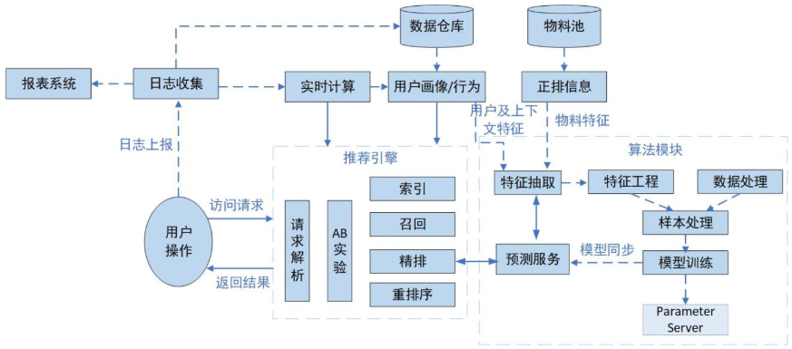

数据流实线为在线流程，虚线为离线流程。一般在线流程指用户实时访问系统用于计算及使用的服务，离线流程指跟用户请求无直接关系可对数据单独统计计算的过程。

| 组成元素 | 说明                                                         |
| -------- | ------------------------------------------------------------ |
| 物料数据 | 首先要有很多被推荐的物料数据，每个物料具有唯一id，还应有其自身的各类基础信息，例如：类型，类别，标签，地域等 |
| 用户数据 | 通过埋点记录用户各类行为，通过日志收集系统计算处理，将有效的用户行为数据结构化并落到存储空间中 |
| 用户画像 | 通过对用户数据进行分析，计算出所需维度的用户画像，便于后续使用 |
| 实时计算 | 实时收集日志并解析物料与用户的实时统计信息，用于后续算法特征处理或在线规则处理。 |
| 算法模块 | 通过物料数据和用户数据建立推荐算法模型                       |
| 推荐引擎 | 如果实时性不强，那么在离线按小时或天的频次直接计算各个用户可能的偏好物料，可以通过用户画像匹配物料，也可以通过模型进行预测排序 |
| 数据报表 | 用来展示推荐系统整体效果，包括AB实验效果，分标签、召回等维度效果等，用于后续迭代优化时提供数据支撑。 |

#### 数据管理

物料数据需要一个统一模块管理生成的所有物料，结构化后同步到资源池中，供后续正排及倒排的创建。用户日志通过`kafka`收集后，基于不同的计算方式消费日志数据，定时落入数据仓库或实时计算用户或物料数据，数据仓库中存储原始日志表和基于其生成的各种中间表，用来计算用户画像或统计物料信息。

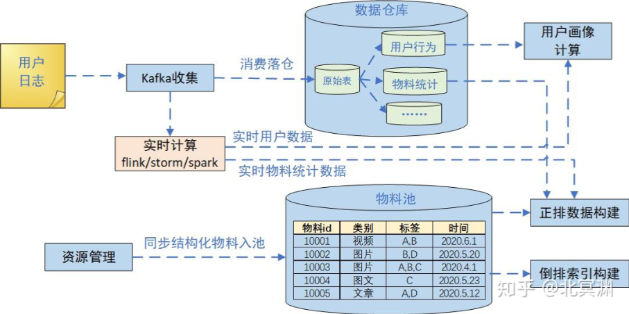

##### 物料数据

倒排一般根据物料某一字段或某些字段组合反查物料id

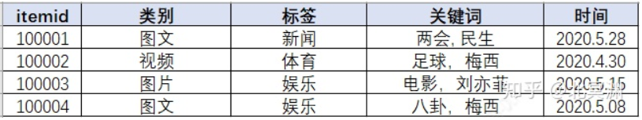

如果按关键词建立倒排索引，倒排方式按物料时间倒序，“梅西”关键词对对应倒排索引如下：

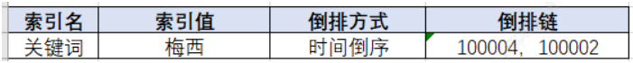

存储：确定存储方式后，内容生产方或管理方就要定时将物料数据结构化并同步到数据库中，过期数据也要及时清理

###### 正排及倒排索引构建

正排构建数据结构并填充值，倒排可根据业务需要建立倒排索引关系。如果业务量较轻，可直接在推荐引擎中加载，这样的好处是后续应用都可直接在内存中使用物料数据信息，使用快捷。因为是基础数据，每次推荐引擎服务启动都要加载并建立倒排操作，数据量过大时服务启动会耗费大量时间，定时同步也会耗费计算资源，因此会把倒排及正排操作与推荐引擎解耦，以服务化的形式独立提供功能，也为其他模块的使用带来便利，但这样会增加服务间的接口调用。

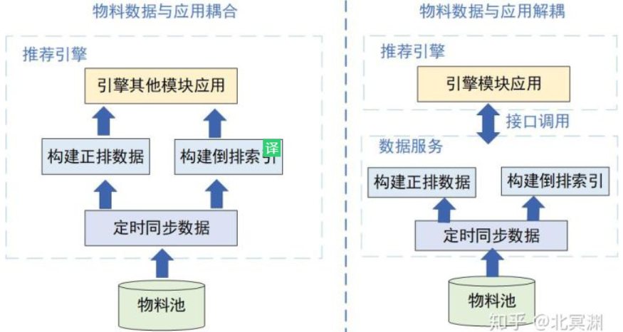

##### 数据仓库

记录下用户及物料的历史数据，便于查询及挖掘使用。数据仓库所有数据来源于日志，通过`kafka`实时收集并消费日志信息，通过一定计算逻辑整理成结构化数据落入数据仓库中，数据表有的是原始表，有的是根据原始表计算的二级表。

| 数据构成     | 例子                                                         | 作用                                                         |
| ------------ | ------------------------------------------------------------ | ------------------------------------------------------------ |
| 用户行为     | 浏览、点击、播放、点赞、评论、转发，结合对应操作的物料信息   | 完整刻画用户在该系统中的访问路径、行为习惯、使用偏好等。这些数据作为原始用户特征可为算法提供充足的训练数据 |
| 用户画像     | 通过统计挖掘的方式，计算出用户对特定维度的偏好，以带权列表的方式刻画出不同用户的兴趣偏好 |                                                              |
| 物料挖掘信息 | 通过挖掘手段能对物料的历史整体表现作出评估，作为物料特征供算法模型使用 | 作为特征加入到模型训练中，学习到的特性可以预测一个相似物料在未来一段时间内的效果走势 |

##### 实时流计算

实时流用于实时从日志中获取有效信息，对于用户访问频次较高的应用属于必需品，可以反馈用户的实时行为和物料的实时统计信息，一般从数据仓库中生成的离线画像数据是天级或小时级的定时任务，对一些需要实时反馈用户行为的场景无法满足要求，例如用户刚曝光过的数据需要过滤或降权，刚点过的物料在一刷推荐时可以推些相似的物品，一些负反馈信息需要记录并实时生效，通过实时收集的用户日志根据不同需求逻辑进行实时计算能快速获取这些信息，反馈给系统快速做出变化

物料侧的计算目标类似，例如物料被曝光、点击、点赞等数据的实时情况，特别是新物料经过冷启动曝光后，能快速反映出这个物料的效果走势，判别出物料质量优劣，影响其后续的推荐策略。物料的实时计算结果，一般供数据侧如物料正排信息和建立倒排索引使用，倒排中可能会影响物料的实时热度分从而影响倒排链的变化。

#### 算法管理

主要是通过离线或在线拿到特征及样本数据训练模型，将训练好的模型同步给召回或排序的预测服务，推荐引擎实时调用预测结果供召回及排序使用。

通过算法来丰富用户和物料的维度信息。

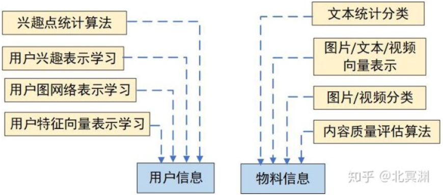

##### 特征构建

从人和物的角度，特征也分为物料特征、用户特征及上下文特征，上下文也可算作用户特征的一种。用户特征一般通过明确记录或统计挖掘得到，如用户的地理位置、访问时段、使用设备、性别年龄，一般在访问时即可拿到；挖掘特征通过历史用户的操作行为，统计用户的画像偏好。物料特征一般是物料自身属性及其统计数据，例如类别、关键词、主题等固有属性，以及历史一段时间窗口内的效果统计如曝光、点击、点赞、转发等。

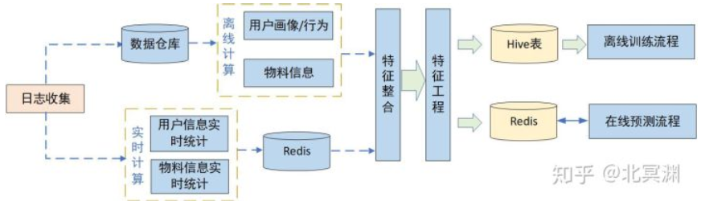

##### 训练样本

通过用户行为日志可获取全量用户曝光点击物料信息，通过用户及物料特征库抽取特征，从而构建出样本矩阵，通过离线计算保存到样本文件。

| 需处理样本         | 影响                                                         | 处理方式                                                   |
| ------------------ | ------------------------------------------------------------ | ---------------------------------------------------------- |
| 非真实用户访问样本 | 带来大量高曝光未点击行为，会严重影响样本数据分布             | 剔除掉                                                     |
| 极少行为用户样本   | 不能为其在模型中找到属于该类用户的“规律”，或者说引入这些数据后，模型会开始学习这类用户的数据分布，对整体分布的拟合带来噪声，易引起模型过拟合 | 看做类似新用户，通过用户冷启动的手段为其探索兴趣补充推荐。 |

采样：对于点击率预估而言，正负样本严重不均衡，所以需要对负例做一些采样。

· 负例：正例一般是用户产生点击、下载、分享等转换行为的样本，但是用户没有转换行为的样本是否就一定是负例呢？其实不然，很多展现其实用户根本没有看到，所以把这样样本视为负例是不合理的，也会影响模型的效果。比较常用的方法是skip-above，即用户点击的item位置以上的展现才可能视作负例。

###### 正负样本处理

在推荐系统中不同公司也有针对自家业务采取的样本划分方法。

- 一次请求会产生N条推荐结果，但大部分手机端通常用户只能看到其中的m条，m<N，通过客户端埋点计算出用户真实可见曝光的物料，在这批物料中选取点击与未点击样本直观上一次曝光中可能有点击或无点击
- 早期youtube推荐中，会对所有用户选取相同数量训练样本，可以同时避免低活跃用户和高活跃用户对整体模型的影响，使训练的模型更符合绝大多数用户行为
- 对于有曝光无点击行为的用户，其曝光未点击的负样本可随机选取，这样可以学到这类用户“不感兴趣”的部分
- 样本在通过定时任务整合时需要做shuffle打散，避免同类用户样本数据扎堆引起数据分布偏差，在训练模型时，也通过batch训练方式中每个batch的样本也进行shuffle打散

##### 模型训练

首次搭建排序模型可以先用基础模型如LR或GBDT跑出一个baseline快速上线，后续逐步迭代为复杂模型。通过分析用户行为及数据，构建特征工程及样本数据优化，得来的效果要比深度学习模型更好。

##### 线上预测

通常线上使用预测服务的形式实时提供模型推断功能，这时需要通过推荐引擎接口将待排序候选集的物料id、用户id以及请求上下文信息传给预测服务。预测服务中也分为特征抽取、物料打分排序、模型同步校验等模块。通过传入的物料id及用户id，可以从特征库中在线抽取特征，结合上下文特征得到所有候选集的特征信息，进而通过模型中各特征权重，计算每个物料的打分。

训练好的模型由离线训练流程定时同步到线上预测服务机器，注意同步时需要同时把模型的checksum一并同步并在服务端进行校验，当同步失败时仍使用缓存的上次同步模型进行预测，避免数据不一致。候选集物料被打分后进行整体排序，结果返回给推荐引擎。

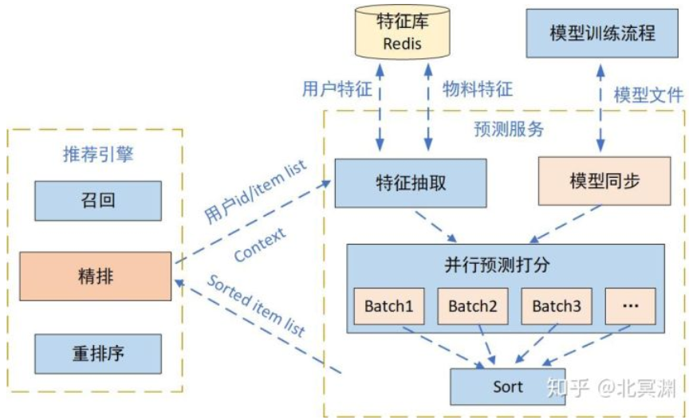

对于推荐系统来说，就是先计算好每个用户的推荐，将推荐结果存储下来，通过预先将推荐结果存下来，可以更快的为用户提供推荐服务,提升用户体验。由于推荐系统会为每个用户生成推荐结果,并且每天都会(基本全量)更新用户的推荐结果，一般采用NoSql数据库来存储，并且要求数据库可拓展，高可用，支持大规模并发读写。

##### 模型更新

在线模型预测：增量更新仅将新加入的样本喂入模型进行增量学习。从技术上来说，深度学习模型往往采用随机梯度下降以及其变种进行学习，模型对增量样本的学习相当于在原有样本的基础上继续输入增量样本进行梯度下降。因此在深度学习模型的基础上，由全量更新改为增量更新的难度并不大。由于仅利用增量样本进行学习，因此模型在多个epoch之后也是收敛到新样本的最优点，而很难收敛到原所有样本+增量样本的全局最优点。因此在实际的推荐系统中，往往采用增量更新与全局更新相结合的方式，在进行几轮增量更新后，在业务量较小的时间窗口进行全局更新，纠正模型在增量更新过程后中积累的误差。提高模型实时性的另外一个改进方向是进行模型的局部更新，大致的思路是降低训练效率低的部分的更新频率，提高训练效率高的部分的更新频率。

#### 推荐引擎管理

推荐引擎能够实时给用户提供推荐服务，用来解析用户请求，将物料数据与画像数据打通，匹配符合用户兴趣的物料，同时调用算法召回，控制整体候选集多样性。通过排序预测服务为候选集打分排序给出用户可能感兴趣的结果，并根据业务和体验规则对推荐结果进行重排序，呈现给用户最终结果。同时推荐引擎还承担着线上AB实验精准分桶的功能，保证实验流量的科学分配，提升实验效果的置信度。

推荐引擎核心功能的主要有用户请求解析、实验分桶染色、召回、排序、重排等模块。

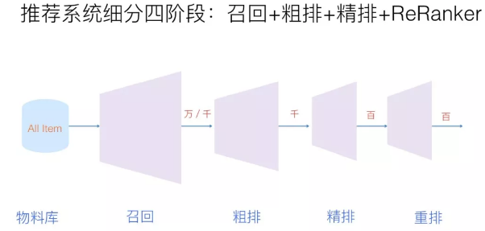

##### 实验染色

线上系统会有各种策略、算法需要快速迭代验证效果，科学准确的实验分桶策略能够均匀分配实验组对照组流量，同时互斥的实验需要互不干扰，例如在召回阶段做的实验A和B需要互斥，而和重排序阶段的实验C互不影响，在切分流量时需要考虑分层机制，同一层实验要求互斥，流量互不影响；不同层之间的实验并不相干，流量可以打通。

##### 召回

召回阶段主要是从全量的商品库中得到用户可能感兴趣的一小部分候选集，排序阶段则是将召回阶段得到的候选集进行精准排序，推荐给用户。召回的方式主要分为基于兴趣内容类，协同过滤类及算法类，最终候选集的呈现可以是这些召回的组合。

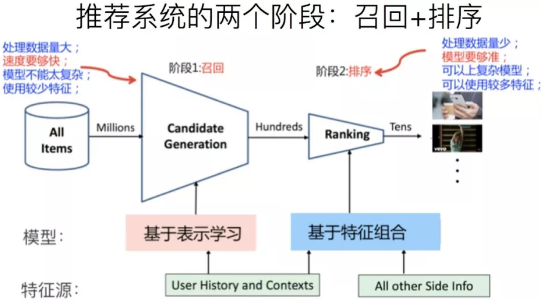

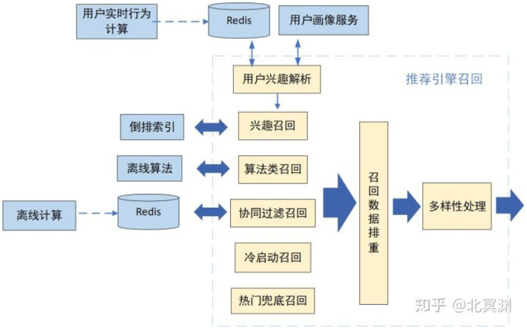

| 召回方式     |                                                              |
| ------------ | ------------------------------------------------------------ |
| 兴趣内容召回 | 基于用户兴趣画像，匹配不同维度物料，从用户感兴趣的维度中选择最新/最热内容召回。根据不同维度组成一级或多级索引可以组成多路兴趣召回，因为用户画像中各维度兴趣点都有权重，那召回对应物料的数量可根据权重自适应调整。 |
| 协同过滤召回 | 基于用户的协同过滤和基于物品的协同过滤，计算用户相似有`Jaccard`相似度、余弦相似度、皮尔逊相似度等 |
| 算法类召回   | 主要聚焦于通过特征和模型来对所有物料进行排序，筛选出`topN`物料进入候选集，也就是常说的粗排。 |

###### 协同过滤召回

则基于`User-CF`的召回流程如下，其他得分类相似度计算都可共用流程。在离线部分通过算法得到每个用户的物品列表，将其存入数据库，在在线部分，获取用户id，读取数据库中用户的推荐物品列表。

| 召回融合方法 | 说明                                                         |
| ------------ | ------------------------------------------------------------ |
| 加权型       | 根据经验值对不同算法赋给不同的权重，对各个算法产生的候选集按照给定的权重进行加权，然后再按照权重排序。 |
| 分级型       | 优先采用效果好的算法，当产生的候选集大小不足以满足目标值时，再使用效果次好的算法，依此类推。 |
| 调制型       | 不同的算法按照不同的比例产生一定量的候选集，然后叠加产生最终总的候选集。 |
| 过滤型       | 当前的算法对前一级算法产生的候选集进行过滤，依此类推，候选集被逐级过滤，最终产生一个小而精的候选集合。 |

目前我们使用的方法集成了调制和分级两种融合方法，不同的算法根据历史效果表现给定不同的候选集构成比例，同时优先采用效果好的算法触发，如果候选集不够大，再采用效果次之的算法触发，

##### 排序

针对召回出的候选集进行排序得到用户最可能感兴趣的内容，需要打分的物料只有几百上千条，因此可以使用更多维度的特征和复杂模型进行线上预测，这块流程同算法召回类似，统一调用排序预测服务即可。排序有时候可以分为粗排和精排两部分。

##### 重排序

经过排序之后所有候选物料已经是按用户最可能点击的顺序排好，但还需要重排来优化用户体验，例如同类内容的控量或打散，当然也需要根据用户行为进行策略上的调整，根据用户连续几刷点或不点来决定下一刷控量打散的度量等。同时还需要调整内容多样性来进行兴趣探索，特别是对于画像及行为不够丰富的用户。同时对于运营业务也需要在这里调整排序，比如时政内容的置顶、热点内容的加权、运营内容的提权或降权等。

推荐引擎的本质是将各种功能模块串接起来，既保证各模块功能各自独立解耦，又将其有序统一，使数据流顺利流动起来。如果业务越做越大，在召回、排序及重排的逻辑越来越复杂，那可能需要用微服务架构将召回、排序）、重排等模块分别抽离成单独服务，便于独立的团队维护独立的服务模块，同时也要尽可能优化网络接口减少网络开销。

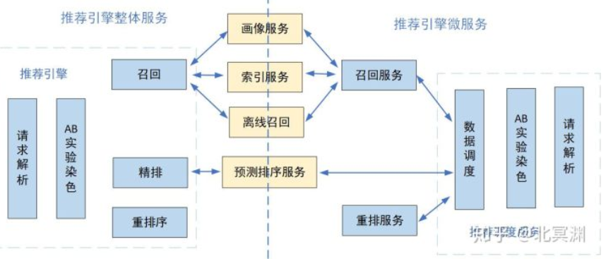

### `CTR`预估模型

CTR和推荐算法的本质区别只能有一个，就是：CTR最终预测的是那个有物理意义的数值`CTR`；推荐算法最终产生的是一个推荐列表，是一个item的相对位置。

CTR即点击通过率，指网络广告的点击到达率，即该广告的实际点击次数除以广告的展现量。

在 `cost-per-click:CPC` 广告中广告主按点击付费。为了最大化平台收入和用户体验，广告平台必须预测广告的 `CTR` ，称作 `predict CTR: pCTR` 。对每个用户的每次搜索`query`，有多个满足条件的广告同时参与竞争。只有 `pCTR x bid price` 最大的广告才能竞争获胜，从而最大化 `eCPM` ：$\text{eCPM}=\text{pCTR}\times \text{bid price}$

广告被点击的概率取决于两个因素：广告被浏览的概率、广告浏览后被点击的概率。因此有：
$$
P(\text{click}|ad, pos) = p(\text{click}|ad, pos, seen)\times p(seen|ad, pos)
$$
假设：在广告被浏览到的情况下，广告被点击的概率与其位置无关，仅与广告内容有关。广告被浏览的概率与广告内容无关，仅与广告位置有关。则有：
$$
P(\text{click}|ad, pos) = p(\text{click}|ad, seen)\times p(seen|pos)
$$
第一项$p(\text{click}|ad, seen)$就是我们关注和预测的 `CTR` 。第二项与广告无关，是广告位置的固有属性。可以通过经验来估计这一项：统计该广告位的总拉取次数impress，以及总曝光次数seen，则：$p(seen|pos)=\frac{seen}{impress}$，这也称作广告位的曝光拉取比。广告可能被拉取（推送到用户的页面），但是可能未被曝光（未被用户浏览到）。

数据集构建：样本的特征从广告基本属性中抽取，将每个广告的真实点击率 `CTR` 来作为 `label` 。考虑到真实点击率 `CTR` 无法计算，因此根据每个广告的累计曝光次数、累计点击次数从而得到其经验点击率$\overline{\text{CTR}}$来作为 `CTR` 。

##### 逻辑回归

将 `CTR` 预估问题视作一个回归问题，采用逻辑回归 `LR` 模型来建模，因为 `LR` 模型的输出是在 `0` 到 `1` 之间。
$$
\text{pCTR} = \frac{1}{1+\exp(-\sum_{i}\omega_i\times f_i)}
$$
其中$f_i$表示从广告中抽取的第$i$个特征，$\omega_i$为该特征对应的权重。

模型的损失函数为交叉熵：$\mathcal{L}= -[\text{pCTR}\times \log(\overline{\text{CTR}})]+(1-\text{pCTR})\times \log(1-\overline{\text{CTR}})$

###### 特征预处理方法

模型添加了一个`bias feature`，该特征的取值恒定为 1。

对于每个特征$f_i$，人工构造额外的两个非线性特征：$\log(f_i+1)$

对所有特征执行标准化，标准化为均值为0、方差为1 。

对所有特征执行异常值截断：对于每个特征，任何超过均值 5 个标准差的量都被截断。

###### 评价指标

`baseline` ：采用训练集所有广告的平均 `CTR` 作为测试集所有广告的 `pCTR` 。

评估指标：测试集上每个广告的 `pCTR` 和真实点击率的平均 `KL` 散度。
$$
\overline{\mathbb{D}_{KL}}=\frac{1}{T}\sum_{i=1}^{T}(\text{pCTR}(ad_i)\times \log\frac{\text{pCTR}(ad_i)}{\overline{\text{CTR}}(ad_i)}+(1-\text{pCTR}(ad_i))\times \log\frac{1-\text{pCTR}(ad_i)}{1-\overline{\text{CTR}}(ad_i)})
$$
`KL` 散度衡量了$\text{pCTR}$和真实点击率之间的偏离程度。一个理想的模型，其 `KL` 散度为 0 ，表示预估点击率和真实点击率完全匹配。

### 关联分析

关联分析的目标分为两项:发现频繁项集和发现关联规则。首先需要找到频繁项集，然后才能获得关联规则。

| 名称   | 定义                                                         |
| ------ | ------------------------------------------------------------ |
| 项     | 指我们分析数据中的一个对象，如豆奶                           |
| 项集   | 就是若干项的项构成的集合，如集合{豆奶，莴苣}是一个2项集。    |
| 支持度 | 某项集在数据集中出现的概率。即项集在记录中出现的次数，除以数据集中所有记录的数量。 |
| 置信度 | 关联规则{A->B}的置信度为A与B同时出现的次数，除以A出现的次数。即在A发生的条件下，B发生的概率。 |
| 提升度 | 关联规则{A->B}中，提升度是指{A->B}的置信度，除以B的支持度。提升度体现的是组合相对不组合的比值，如果提升度大于1，则说明应用该关联规则是有价值的。 |

支持度体现的是某项集的频繁程度，只有某项集的支持度达到一定程度，我们才有研究该项集的必要。

###### `Apriori`算法

1.生成单个物品的项集
2.剔除支持度小于阈值的项，得到频繁1项集
3.将频繁1项集组合得到2项集
4.剔除支持度小于阈值的项，得到频繁2项集
5.重复上述步骤直到所有项集都去掉

关联规则需要从频繁项集中产生，比如上例中产生一个频繁项集为{2,4}，那么就有可能有一条关联规则为{2}->{4}，意味着购买了2的人往往也会购买4。但是反过来就不一定成立。

对于一个项集{0,1,2,3}产生关联规则，需要生成一个可能的规则列表，然后测试每条规则的可信度。如果某条规则不满足最小置信度，那么该规则的所有子集也都不满足最小置信度。
　比如规则{0,1,2}->{3}不满足最小可信度要求，那么任何左部为{0,1,2}子集的规则也不会满足最小可信度要求，或者说所有以{3}作为后件的规则不会满足最小可信度要求。原因是这些规则的置信度的分子都相同，而{0,1,2}->3的分母{0,1,2}的支持度最小，导致这条规则的置信度最大。因此其他规则的置信度只会比这条更小，更不会满足最小可信度的要求。