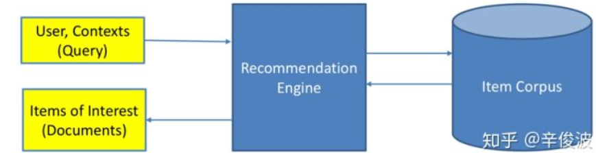
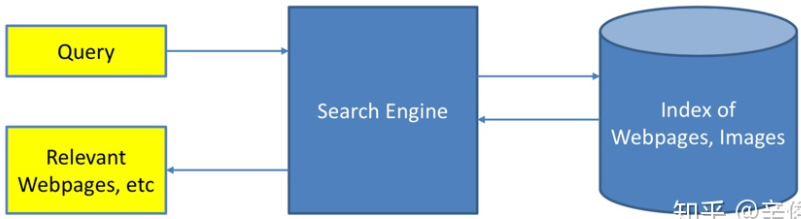

##### 推荐系统与搜索引擎

推荐系统就是系统根据用户的属性，用户在系统里过去的行为，以及当前上下文环境 ( 如网络、手机设备、时间等 )，从而给用户推荐用户可能感兴趣的物品，从这个过程来看，推荐系统就是一个给 user 匹配感兴趣的 item 的过程。

搜索引擎需要 match 的是 query 和相关的 doc；推荐系统需要 match 的是 user和相关的 item。

###### 推荐系统与搜索引擎对比

| 不同之处       | 说明                                                         |
| -------------- | ------------------------------------------------------------ |
| 意图不同       | 搜索是用户带着明确的目的，搜索过程用户带着明确的搜索意图。而推荐是系统被动触发，系统是带着一种 "猜" 的状态给用户推送物品。 |
| 时效不同       | 搜索需要尽快满足用户此次请求 query，推荐更希望能增加用户的时长和留存从而提升整体 LTV 。 |
| 相关性要求不同 | 搜索有严格的 query 限制，搜索结果需要保证相关性，搜索结果量化评估标准也相对容易。推荐没有明确的相关性要求。推荐很难在离线阶段从相关性角度结果评定是否好坏，只能从线上效果看用户是否买单做评估。 |
| 实体不同       | 搜索中的两大实体是 query 和 doc，本质上都是文本信息。推荐中的两大实体是 user 和 item，两者的表征体系可能完全没有重叠。user 和 item 的匹配是无法从表面的特征解决两者差异。 |
| 个性化要求不同 | 搜索有用户的主动 query，本质上这个 query 已经在告诉系统这个 "用户" 是谁了，query 本身代表的就是一类用户，而推荐没有用户主动的 query 输入 |

| 相同     | 说明                                                         |
| -------- | ------------------------------------------------------------ |
| 本质     | 本质都是一个match过程，如果把 user 比作 query，把 item 比作 doc，那么推荐和搜索在这个层面又是相同的，都是针对一个 query，从海量的候选物品库中，根据 query 和 doc 的相关性，去推荐匹配的 doc。 |
| 目标     | 搜索和推荐的目标都是针对一次 context，从候选池选出尽可能满足需求的物品。两者区别只是挑选过程使用的信息特征不同。 |
| 语义鸿沟 | 在搜索里表现是 query 和 doc 的语义理解，推荐里则是 user 和 item 的理解。 |

##### 推荐系统评估

| 推荐系统范式         | 说明                                                         |
| -------------------- | ------------------------------------------------------------ |
| 完全个性化范式       | 为每个用户提供个性化的内容，每个用户推荐结果都不同           |
| 群组个性化范式       | 首先将用户分组，每组用户提供一个个性化的推荐列表，同一组的用户推荐列表一样，不同组的用户推荐列表不一样 |
| 非个性化范式         | 为所有用户提供完全一样的推荐                                 |
| 标的物关联标的物范式 | 为每个标的物关联一组标的物，作为用户在访问标的物详情页时的推荐，每个用户都是相同的标的物 |
| 笛卡尔积范式         | 每个用户跟每个标的物的组合产生的推荐都不相同，不同用户在同一个视频的详情页看到的推荐结果都不一样 |

| 推荐方式   | 说明                                                         |
| ---------- | ------------------------------------------------------------ |
| 热门推荐   | 就是热门排行榜的概念。这应该是效果最好的一种推荐方式，毕竟热门推荐的物品都是位于曝光量比较高的位置的。 |
| 人工推荐   | 人工干预的推荐内容。相比于依赖热门和算法来进行推荐。一些热点时事如世界杯等就需要人工加入推荐列表。另一方面，热点新闻带来的推荐效果也是很高的。 |
| 相关推荐   | 相关推荐有点类似于关联规则的个性化推荐，就是在你阅读一个内容的时候，会提示你阅读与此相关的内容。 |
| 个性化推荐 | 基于用户的历史行为做出的内容推荐。                           |

#### 推荐系统冷启动

推荐系统冷启动问题指的就是对于新注册的用户或者新入库的标的物, 该怎么给新用户推荐标的物让用户满意，怎么将新标的物分发出去，推荐给喜欢它的用户。推荐系统冷启动主要分为标的物冷启动、用户冷启动、系统冷启动三大类。

难点： 我们一般对新用户知之甚少，从而很难为用户推荐他喜欢的标的物；对于新的标的物，我们也不知道什么用户会喜欢它；对于新开发的产品，由于是从零开始发展用户，冷启动问题就更加凸显，这时每个用户都是冷启动用户

##### 冷启动的方法和策略

###### 提供非个性化的推荐

 利用先验数据做推荐，可以利用新热标的物作为推荐。推荐新的东西肯定能抓住用户的眼球，推荐热门标的物, 由于这些标的物是热点，同时人是有从众效应的，热门推荐也一般用来作为新推荐算法的AB测试的基准对照组。还可以推荐常用的标的物及生活必需品。对于特殊行业，可以根据该行业的经验给出相应的推荐策略。

给用户提供多样化的选择，最好是从一些热门的类中挑选一些推荐给用户。太冷门的类用户不喜欢的概率较大，避免推荐的热门物品来自同一类，使得推荐结果单一。

###### 利用用户注册时提供的信息

 利用人口统计学数据，根据用户注册是填写的基本信息构建用户画像，通过用户画像标签关联物品从而为用户做推荐。

利用社交关系，用户在注册是导入社交关系，将好友喜欢的物品推荐的给用户。利用社交信息来做冷启动，特别是在有社交属性的产品中，这是很常见的一种方法

利用用户填写的兴趣点，用户注册时填写兴趣点，通过这些兴趣点为用户推荐感兴趣的物品。

###### 基于内容做推荐

基于内容的推荐算法，基于内容的推荐算法只要用户有少量行为就可以给用户推荐，通过用户浏览过的少量商品的相关标签，将同一类的物品推荐给用户。

###### 利用标的物的`metadata`信息做推荐

利用标的物跟用户行为的相似性，可以通过提取新入库的标的物的特征，通过计算标的物特征跟用户行为特征的相似性，从而将标的物推荐给与它最相似的用户。

 利用标的物跟标的物的相似性，根据这些属性找到与该标的物最相似的标的物，这些相似的标的物被哪些用户“消费”过，可以将该标的物推荐给这些消费过的用户。

###### 采用快速试探策略

这类策略一般可用于新闻短视频类应用中, 先随机或者按照非个性化推荐的策略给用户推荐，基于用户的点击反馈快速发现用户的兴趣点，从而在短时间内挖掘出用户的兴趣。

###### 采用兴趣迁移策略

当一个公司有一个成熟的`APP`时，准备拓展新的业务，开发新的`APP`，这时可以将用户在老`APP`上的特征迁移到新`APP`中, 从而做出推荐。兴趣迁移策略借鉴了迁移学习的思路，在基于主产品拓展新产品形态的情况下，特别适合新产品做冷启动。

###### 采用基于关系传递的策略

当产品在拓展标的物品类的过程中，先计算原有的物品类A与用户的相似度，然后计算新类型物品B与A的相似度，将B推荐给跟A相似度高的客户。B与A有相似关系，A与喜欢它的用户有相似关系，最终得到B与用户有相似关系。

| 冷启动形式   | 方案                                                         |
| ------------ | ------------------------------------------------------------ |
| 用户冷启动   | 提供非个性化的推荐、利用用户注册时提供的信息、基于内容做推荐、采用快速试探策略、采用兴趣迁移策略 |
| 标的物冷启动 | 利用标的物的`metadata`信息做推荐、采用快速试探策略、采用基于关系传递的策略 |
| 系统冷启动   | 利用用户注册时提供的信息、基于内容做推荐、采用兴趣迁移策略   |

冷启动问题（cold start）主要分3类。  用户冷启动 用户冷启动主要解决如何给新用户做个性化推荐的问题。当新用户到来时， 我们没有他的行为数据，所以也无法根据他的历史行为预测其兴趣，从而无法借此给他 做个性化推荐。  物品冷启动 物品冷启动主要解决如何将新的物品推荐给可能对它感兴趣的用户这一问题。  系统冷启动 系统冷启动主要解决如何在一个新开发的网站上（还没有用户，也没有用 户行为，只有一些物品的信息）设计个性化推荐系统，从而在网站刚发布时就让用户体 验到个性化推荐服务这一问题。 对于这3种不同的冷启动问题，有不同的解决方案。一般来说，可以参考如下解决方案。  提供非个性化的推荐 非个性化推荐的最简单例子就是热门排行榜，我们可以给用户推 荐热门排行榜，然后等到用户数据收集到一定的时候，再切换为个性化推荐。  利用用户注册时提供的年龄、性别等数据做粗粒度的个性化。  利用用户的社交网络账号登录（需要用户授权），导入用户在社交网站上的好友信息，然 后给用户推荐其好友喜欢的物品。  要求用户在登录时对一些物品进行反馈，收集用户对这些物品的兴趣信息，然后给用户 推荐那些和这些物品相似的物品。  对于新加入的物品，可以利用内容信息，将它们推荐给喜欢过和它们相似的物品的用户。  在系统冷启动时，可以引入专家的知识，通过一定的高效方式迅速建立起物品的相关度表。

基于注册信息的个性化推荐流程基本如下： (1) 获取用户的注册信息； (2) 根据用户的注册信息对用户分类； (3) 给用户推荐他所属分类中用户喜欢的物品

解决用户冷启动问题的另一个方法是在新用户第一次访问推荐系统时，不立即给用户展示推 荐结果，而是给用户提供一些物品，让用户反馈他们对这些物品的兴趣，然后根据用户反馈给供个性化推荐。很多推荐系统采取了这种方式来解决用户冷启动问题。

对于这些通过让用户对物品进行评分来收集用户兴趣，从而对用户进行冷启动的系统，它们 需要解决的首要问题就是如何选择物品让用户进行反馈。 一般来说，能够用来启动用户兴趣的物品需要具有以下特点。  比较热门 如果要让用户对一个物品进行反馈，前提是用户知道这个物品是什么东西。 以电影为例，如果一开始让用户进行反馈的电影都很冷门，而用户不知道这些电影的情 节和内容，也就无法对它们做出准确的反馈

 具有代表性和区分性 启动用户兴趣的物品不能是大众化或老少咸宜的，因为这样的物品 对用户的兴趣没有区分性。还以电影为例，用一部票房很高且广受欢迎的电影做启动物品， 可以想象的到的是几乎所有用户都会喜欢这部电影，因而无法区分用户个性化的兴趣。  启动物品集合需要有多样性 在冷启动时，我们不知道用户的兴趣，而用户兴趣的可能 性非常多，为了匹配多样的兴趣，我们需要提供具有很高覆盖率的启动物品集合，这些 物品能覆盖几乎所有主流的用户兴趣。

在很多网站中，推荐列表并不是给用 户展示内容的唯一列表，那么当一个新物品加入时，总会有用户从某些途径看到这些物品，对这 些物品产生反馈。那么，当一个用户对某个物品产生反馈后，和他历史兴趣相似的其他用户的推 荐列表中就有可能出现这一物品，从而更多的人就会对这个物品产生反馈，导致更多的人的推荐 列表中会出现这一物品，因此该物品就能不断地扩散开来，从而逐步展示到对它感兴趣用户的推 荐列表中

- **静态画像**： 用户独立于产品场景之外的属性，例如用户的自然属性，这类信息比较稳定，具有统计性意义。
- **动态画像**： 用户在场景中所产生的显示行为或隐式行为。

隐式行为的权重往往不会有显示行为大，但是在实际业务中，用户的显示行为都是比较稀疏的，所以需要依赖大量的隐式行为。

推荐算法主要分为以下几步：

- **召回**：当用户以及内容量比较大的时候，往往先通过召回策略，将百万量级的内容先缩小到百量级。
- **过滤**：对于内容不可重复消费的领域，例如实时性比较强的新闻等，在用户已经曝光和点击后不会再推送到用户面前。
- **精排**：对于召回并过滤后的内容进行排序，将百量级的内容并按照顺序推送。
- **混排**：为避免内容越推越窄，将精排后的推荐结果进行一定修改，例如控制某一类型的频次。
- **强规则**：根据业务规则进行修改，例如在活动时将某些文章置顶。

总体而言，召回环节的有监督模型化以及一切 Embedding 化，这是两个相辅相成的总体发展趋势。如果我们根据召回路是否有用户个性化因素存在来划分，可以分成两大类：一类是无个性化因素的召回路，比如热门商品或者热门文章或者历史点击率高的物料的召回；另外一类是包含个性化因素的召回路，比如用户兴趣标签召回。