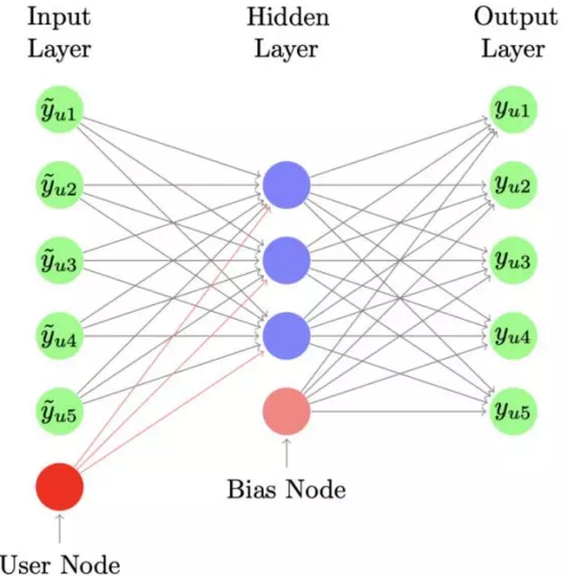
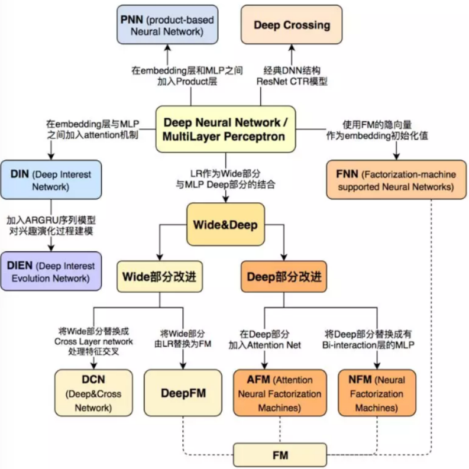
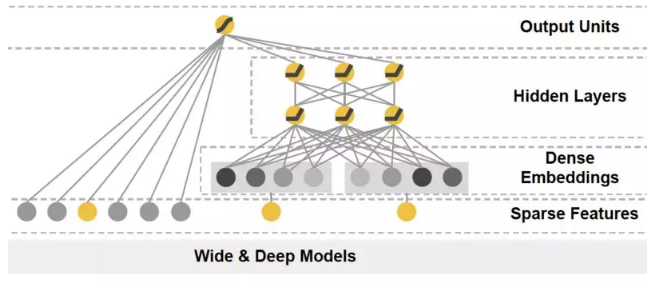
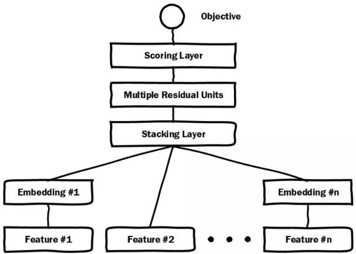

### 基于 representation learning 的深度匹配模型

这种方法会分别学习用户的 representation 以及 item 的 representation，也就是 user 和 item 各自的 embedding 向量 ( 或者也叫做隐向量 )，然后通过定义 matching score 的函数，一般是简单的向量点击、或者 cosine 距离来得到两者的匹配分数。

##### 基于 Collaborative Filtering 的方法

###### CF模型

分别学习 user 和 item 的隐向量。input layer：只有两个，分别是 userid ( one-hot )，itemid ( one-hot )；representation function：线性 embedding layer；matching function：向量内积。 $f_{MF}=(u,i|\mathbf{p}_u,\mathbf{q}_i)=\mathbf{p}_u^T\mathbf{q}_i$，矩阵填补，label就是交互矩阵的值，缺失就是需要填补的。

###### DMF

DMF 模型也就是深度矩阵分解模型，在传统的 MF 中增加了 MLP 网络。input layer：由两部分组组成，其中 user 由 user 交互过的 item 集合来表示，是个 multi-hot 的打分表示，如 [0 0 4 0 0 … 1 5 …]，在矩阵中用行表示；item 也由交互过的 user 集合来表示，也是个 multi-hot 的表示，如 [5 0 0 3 … 1 3]，在矩阵中用列表示。representation function：Multi-Layer-Perceptron，也就是经典的全连接网络；matching function：用 cosine 点击表示两个向量的匹配分数。

$$
\hat{Y}_{ij}=F^{DMF}(u_i,v_j|\Theta)= \cos(p_i,q_j) = \frac{p_i^Tq_j}{||p_i||||q_j||}
$$

###### AutoRec模型

借鉴 auto-encoder 的思路，`AutoRec`模型对输入做重建，来建立 user 和 item 的 representation，和 CF 一样，也可以分为 user-based 和 item-based 的模型。对于 item-based `AutoRec`，input 为 R 里的每列，即每个 item 用各个 user 对它的打分作为其向量描述；对于 user-based `AutoRec`则是用 R 里的每行来表示，即每个 user 用他打分过的 item 的向量来表达。用$r_u$表示用户向量，$r_i$表示 item 向量，通过`AutoEncoder`将$r_u$或者$r_i$投射到低维向量空间，然后再将其投射到正常空间，利用`AutoEncoder`中目标值和输入值相近的特性，从而重建出用户对于未交互过的 item 的打分。

input layer：和 DMF 一样，user 用 user 作用过的 item 集合表示，item 则用 itemid 本身表示；representation function：通过 auto-encoder 的结构表示，其中，$h(r;\theta)$表示的是输入层到隐层的重建；由于输入的是用户交互过的 item，所以在隐层中的蓝色节点表示的就是 user representation；而输出的节点表示的是 item 的 representation，这样就可以得到 user 和 item 各自 representation，$h(\mathbf{r};\theta)=f(W.g(Vr+\mu)+b)$。损失函数为最小化预测的平方差以及$W$和$V$矩阵的$L_2$正则：
$$
\min_{\theta}\sum_{i=1}^{n}||\mathbf{r}^{(i)}-h(\mathbf{r}^{(i)};\theta)||_{\mathcal{O}}^2+\frac{\lambda}{2}(||W||_F^2+||V||_F^2)
$$

###### CDAE模型

 input layer：用户 id，用户历史交互过的 item；以及 itemid。如图所示的 input layer 节点，绿色节点表示每个用户交互过的 item，最下面的红色节点 user node 表示用户本身的偏好，可以认为是 userid的表达；representation function：中间蓝色的隐层节点作为用户表示，其中$V_u$为 input layer 中的 user node 的 representation，针对所有用户 id 会学习一个和 item 无关的$V_u$向量表达，可以认为是用户本身的 bias，例如有些用户打分本身比较严格，再好的 item 打分也不会太高；有些用户打分很宽松，只要 item 别太差都会给高分，加上$V_u$可以更好的刻画用户之间天然的 bias。$\mathbf{z}_u=h(\mathbf{W}^T\mathbf{y}_u+\mathbf{V_u}+b)$，而对于输出层的节点，可以认为是用户 u 对物品 i 的打分预测：$\hat{y}_{ui}=f(\mathbf{W}_i^{\prime T}\mathbf{z}_u+b_i^{\prime})$；matching function：使用向量点积作为匹配分数：$\hat{y}_{ui}=\mathbf{W}_i^{\prime T}\mathbf{V_u}$

##### 基于 Collaborative Filtering + side information 的方法

###### DCF模型

input layer：除了用户和物品的交互矩阵，还有用户特征 X 和物品特征 Y。representation function：和传统的 CF 表示学习不同，这里引入了用户侧特征X；物品侧特征 Y；user 和 item 侧的特征各自通过一个 auto-encoder 来学习，而交互信息$R$矩阵依然做矩阵分解$U,V$。

其中$W_1$，表示的用户侧特征$X$在 auto-encoder 过程中的 encode 部分，也就是输入到隐层的重建，$P_1$表示的是用户特征到交互矩阵$R$的映射；而$W_2$表示物品侧特征$Y$在 auto-encoder 过程中的 encode 部分。$P_2$表示的是物品特征到交互矩阵$R$的映射。

###### DUIF模型

- input layer：除了用户和物品的交互矩阵，还有用户特征X和物品特征Y
- representation function：
- match function：

###### Attention Collaborative Filtering模型

在传统的 CF 里引入了 attention 机制。这里的 attention 有两层意思，第一层 attention，认为用户历史交互过的 item 的权重是不一样的；另一个 attention 意思是，用户同一个 item 里到的视觉特征的权重也是不一样的。 input layer：用户侧：userid；用户历史交互过的 item。Item侧：itemid；item 相关的视觉相关特征。representation function：可以分为两个 attention，一个是 component 层级的 attention，主要是提取视觉特征；第二层是 item 层级的 attention，主要提取用户对物品的喜好程度权重。

总结上述基于 CF 的方法，可以用如下的范式作为表达

 representation learning：目的是学习到 user 和 item 各自的 representation。特征表达：user 侧特征除了用户 id 本身 userid，可以加上其他 side info；item 侧特征除了物品 id 本身 itemid，还有其他文本特征、图文特征、视频帧特征等信息。模型表达：除了传统的 DNN，其他结构如 Auto-Encoder，Denoise-Auto-Encoder，CNN，RNN 等。

###### CKB模型

### 基于 match function learning 的深度匹配模型

基于 match function learning 最大的特点是，不直接学习 user 和 item 的 embedding，而是通过已有的各种输入，通过一个 neural network 框架，来直接拟合 user 和 item 的匹配分数。

#### CF-based 的深度模型

##### 基于NCF框架的方法

基于神经网络的学习方法对比传统的 CF 网络，在得到 user vector 和 item vector 后，连接了 MLP 网络后，最终拟合输出，得到一个 end-2-end 的 model。这套框架好处就是足够灵活，user 和 item 侧的双塔设计可以加入任意 side info 的特征，而 MLP 网络也可以灵活的设计。

###### NeuMF模型

同时利用了 MF 和神经网络 MLP 的能力来拟合 matching score；MF 利用向量内积学习 user 和 item 的关联，同时 MLP 部分捕捉两者的其他高阶信息。模型可以分为 GMF 和 MLP 两个部分来看

GMF部分：User 和 item 都通过 one-hot 编码得到稀疏的输入向量，然后通过一个 embedding 层映射为 user vector 和 item vector。这样就获得了 user 和 item 的隐向量，一般可以通过向量点积或者哈达马积得到交互，不过在 NeuMF 中多连接了一个连接层，也就是 GMF layer：
$$
\hat{y}_{ui} = \alpha_{out}(\mathbf{h}^T(\mathbf{p}_u \odot\mathbf{q}_i))
$$
MLP 部分：输入和 GMF 部分一样，都是 one-hot 的稀疏编码，然后通过 embedding 层映射为 user vector 和 item vector

###### NNCF模型

###### ONCF模型

###### 小结

##### 基于translation框架的方法

###### TransRec模型

###### LRML模型

#### feature-based的深度模型

##### FNN

 FNN 相比 Deep Crossing 的创新在于使用 FM 的隐层向量作为 user 和 item 的 Embedding，从而避免了完全从随机状态训练 Embedding。由于 id 类特征大量采用 one-hot 的编码方式，导致其维度极大，向量极稀疏，所以 Embedding 层与输入层的连接极多，梯度下降的效率很低，这大大增加了模型的训练时间和 Embedding 的不稳定性，使用 pre train 的方法完成 Embedding 层的训练，无疑是降低深度学习模型复杂度和训练不稳定性的有效工程经验。

FM本身具备学习特征Embedding的能力，DNN具备高阶特征交叉的能力，因此将两者结合是很直接的思路。FM预训练的Embedding可以看做是“先验专家知识”，直接将专家知识输入NN来进行学习。注意，FNN本质上也是两阶段的模型，如上图所示，就是将FM预训练好的Embedding向量直接喂给下游的DNN模型，让DNN来进行更高阶交叉信息的学习。

优势：

- 离线训练FM得到embedding，再输入NN，相当于引入先验专家经验
- 加速模型的训练和收敛
- NN模型省去了学习feature embedding的步骤，训练开销低

不足：

- 非端到端的两阶段模型，不利于online learning
- 预训练的Embedding受到FM模型的限制
- FNN中只考虑了特征的高阶交叉，并没有保留低阶特征信息

##### wide&deep模型

 把单输入层的 Wide 部分和经过多层感知机的 Deep 部分连接起来，一起输入最终的输出层。其中 Wide 部分的主要作用是让模型具有记忆性（Memorization），单层的 Wide 部分善于处理大量稀疏的 id 类特征，便于让模型直接“记住”用户的大量历史信息；Deep 部分的主要作用是让模型具有“泛化性”（Generalization），利用 DNN 表达能力强的特点，挖掘藏在特征后面的数据模式。最终利用 LR 输出层将 Wide 部分和 Deep 部分组合起来，形成统一的模型。 

##### deep crossing 模型

##### PNN模型

PNN 的关键在于在 embedding 层和全连接层之间加入了 Product layer。传统的 DNN 是直接通过多层全连接层完成特征的交叉和组合的，但这样的方式缺乏一定的“针对性”。首先全连接层并没有针对不同特征域之间进行交叉；其次，全连接层的操作也并不是直接针对特征交叉设计的。  因此 PNN 通过加入 Product layer 完成了针对性的特征交叉，其 product 操作在不同特征域之间进行特征组合。并定义了 inner product，outer product 等多种 product 的操作捕捉不同的交叉信息，增强模型表征不同数据模式的能力 。

PNN结构显示通过Embedding Lookup得到每个field的Embedding向量，接着将这些向量输入Product Layer，在Product Layer中包含了两部分，一部分是左边的$z$，就是将特征原始的Embedding向量直接保留；另一部分是右侧的$p$，即对应特征之间的product操作；可以看到PNN相比于FNN一个优势就是保留了原始的低阶embedding特征。

优势：

- PNN通过$z$保留了低阶Embedding特征信息
- 通过Product Layer引入更复杂的特征交叉方式，

不足：计算时间复杂度相对较高

##### deepFM模型

 DeepFM 就是其中之一。DeepFM 对 Wide&Deep 的改进之处在于，它用 FM 替换掉了原来的 Wide 部分，加强了浅层网络部分特征组合的能力。事实上，由于 FM 本身就是由一阶部分和二阶部分组成的，DeepFM 相当于同时组合了原 Wide 部分 + 二阶特征交叉部分 +Deep 部分三种结构，无疑进一步增强了模型的表达能力。

DeepFM包含两部分：因子分解机部分与神经网络部分，分别负责低阶特征的提取和高阶特征的提取。这两部分共享同样的嵌入层输入。DeepFM的预测结果可以写为：$\hat{y} = \text{sigmoid}(y_{FM}+y_{DNN})$

###### 嵌入层

通过嵌入层，尽管不同field的长度不同（不同离散变量的取值个数可能不同），但是embedding之后向量的长度均为K。在得到embedding之后，我们还将对应的特征值乘到了embedding上，这主要是由于fm部分和dnn部分共享嵌入层作为输入

###### FM部分

FM的输出公式为：$y_{FM} = <\omega,x>+\sum_{j_1=1}^d\sum_{j_2=j_1+1}^d<V_i,V_j>x_{j_1}x_{j_2}$

##### NFM模型

相对于 DeepFM 和 DCN 对于 Wide&Deep Wide 部分的改进，NFM 可以看作是对 Deep 部分的改进。NFM 的全称是 Neural Factorization Machines，如果我们从深度学习网络架构的角度看待 FM，FM 也可以看作是由单层 LR 与二阶特征交叉组成的 Wide&Deep 的架构，与经典 W&D 的不同之处仅在于 Deep 部分变成了二阶隐向量相乘的形式。再进一步，NFM 从修改 FM 二阶部分的角度出发，用一个带 Bi-interaction Pooling 层的 DNN 替换了 FM 的特征交叉部分，形成了独特的 Wide&Deep 架构。其中 Bi-interaction Pooling 可以看作是不同特征 embedding 的 element-wise product 的形式。这也是 NFM 相比 Google Wide&Deep 的创新之处。

##### AFM模型

 AFM 其实是对 FM 的二阶部分的每个交叉特征赋予了权重，这个权重控制了交叉特征对最后结果的影响，也就非常类似于 NLP 领域的注意力机制（Attention Mechanism）。为了训练 Attention 权重，AFM 加入了 Attention Net，利用 Attention Net 训练好 Attention 权重后，再反向作用于 FM 二阶交叉特征之上，使 FM 获得根据样本特点调整特征权重的能力。

##### DCN模型

 主要的思路使用 Cross 网络替代了原来的 Wide 部分。其中设计 Cross 网络的基本动机是为了增加特征之间的交互力度，使用多层 cross layer 对输入向量进行特征交叉。单层 cross layer 的基本操作是将 cross layer 的输入向量 xl 与原始的输入向量 x0 进行交叉，并加入 bias 向量和原始 xl 输入向量。DCN 本质上还是对 Wide&Deep Wide 部分表达能力不足的问题进行改进，与 DeepFM 的思路非常类似。 

##### xdeepFM 模型

##### FGCNN模型

##### FiBiNet模型

##### AutoInt模型

##### DIN模型

 DIN 将 Attention 机制作用于深度神经网络，在模型的 embedding layer 和 concatenate layer 之间加入了 attention unit，使模型能够根据候选商品的不同，调整不同特征的权重。 

##### DIEN模型

### 其他

##### 召回模型

###### 向量化召回

通过模型来学习用户和物品的兴趣向量，并通过内积来计算用户和物品之间的相似性，从而得到最终的候选集。

$$
P(\omega_t=i|U,C) = \frac{e^{v_iu}}{\sum_{j\in V}e^{v_ju}}
$$
两侧分别对 user 和 item 特征通过D`NN`输出向量，并在最后一层计算二个输出向量的内积。

多 Embedding 向量召回-用户多兴趣表达，通过一种模型来建模出用户多个 embedding 的表示。

Multi-Interest 抽取层负责建模用户多个兴趣向量 embedding，然后通过 Label-aware Attention 结构对多个兴趣向量加权。这是因为多个兴趣 embedding 和待推荐的 item 的相关性肯定不同。其中上图中的 K，V 都表示用户多兴趣向量，Q 表示待推荐 item 的 embedding 表示，最终用户的 embedding 表示为：
$$
\vec{\mathbf{v}_u} = Attention(\vec{\mathbf{e}_i}, V_u, V_u)=V_usoftmax{pow(V_u^T\vec{\mathbf{e}_i}, p)}
$$
 $e_i$表示 item embedding，$V_u$表示 Multi-Interest 抽取层输出的用户多个兴趣向量 embedding。然后使用$V_u$和待推荐 item embedding，计算用户u和商品i交互的概率，计算方法和 YouTube DNN 一样。

##### Embedding

 Embedding 层往往采用预训练的方式完成。  Embedding 的训练往往独立于深度学习网络进行。在得到稀疏特征的稠密表达之后，再与其他特征一起输入神经网络进行训练。 

#### 知识图谱

如果两个节点之间存在关系，他们就会被一条无向边连接在一起，那么这个节点，我们就称为**实体**（Entity），它们之间的这条边，我们就称为**关系**（Relationship）。知识图谱的基本单位，便是“实体（Entity）-关系（Relationship）-实体（Entity）”构成的三元组，这也是知识图谱的核心。

##### 架构

知识图谱的架构主要可以被分为：逻辑架构、技术架构

###### 逻辑架构

在逻辑上，我们通常将知识图谱划分为两个层次：数据层和模式层。模式层：在数据层之上，是知识图谱的核心，存储经过提炼的知识，通常通过本体库来管理这一层。数据层：存储真实的数据。本体库可以理解为面向对象里的“类”这样一个概念，本体库就储存着知识图谱的类

模式层：实体-关系-实体，实体-属性-性值；数据层：比尔盖茨-妻子-梅琳达·盖茨，比尔盖茨-总裁-微软

###### 技术架构

知识图谱有自顶向下和自底向上两种构建方式，这里提到的构建技术主要是自底向上的构建技术。构建知识图谱是一个迭代更新的过程，根据知识获取的逻辑，每一轮迭代包含三个阶段：信息抽取：从各种类型的数据源中提取出实体、属性以及实体间的相互关系，在此基础上形成本体化的知识表达；知识融合：在获得新知识之后，需要对其进行整合，以消除矛盾和歧义，比如某些实体可能有多种表达，某个特定称谓也许对应于多个不同的实体等；知识加工：对于经过融合的新知识，需要经过质量评估之后，才能将合格的部分加入到知识库中，以确保知识库的质量。

信息抽取是一种自动化地从半结构化和无结构数据中抽取实体、关系以及实体属性等结构化信息的技术。实体抽取，也称为命名实体识别（named entity recognition，NER），是指从文本数据集中自动识别出命名实体。关系抽取，从相关语料中提取出实体之间的关联关系，通过关系将实体联系起来，才能够形成网状的知识结构。属性抽取，从不同信息源中采集特定实体的属性信息，如针对某个公众人物，可以从网络公开信息中得到其昵称、生日、国籍、教育背景等信息。

知识融合：实体链接是指对于从文本中抽取得到的实体对象，将其链接到知识库中对应的正确实体对象的操作。其基本思想是首先根据给定的实体指称项，从知识库中选出一组候选实体对象，然后通过相似度计算将指称项链接到正确的实体对象。实体链接的流程：从文本中通过实体抽取得到实体指称项；进行实体消歧和共指消解，判断知识库中的同名实体与之是否代表不同的含义以及知识库中是否存在其他命名实体与之表示相同的含义；在确认知识库中对应的正确实体对象之后，将该实体指称项链接到知识库中对应实体。

知识加工：通过信息抽取，从原始语料中提取出了实体、关系与属性等知识要素，并且经过知识融合，消除实体指称项与实体对象之间的歧义，得到一系列基本的事实表达。然而事实本身并不等于知识。要想最终获得结构化，网络化的知识体系，还需要经历知识加工的过程。

本体：是指人工的概念集合、概念框架。本体可以采用人工编辑的方式手动构建，也可以以数据驱动的自动化方式构建本体。因为人工方式工作量巨大，且很难找到符合要求的专家，因此当前主流的全局本体库产品，都是从一些面向特定领域的现有本体库出发，采用自动构建技术逐步扩展得到的。

自动化本体构建过程包含三个阶段：实体并列关系相似度计算、实体上下位关系抽取、本体的生成

当知识图谱刚得到“阿里巴巴”、“腾讯”、“手机”这三个实体的时候，可能会认为它们三个之间并没有什么差别，但当它去计算三个实体之间的相似度后，就会发现，阿里巴巴和腾讯之间可能更相似，和手机差别更大一些。这就是第一步的作用，但这样下来，知识图谱实际上还是没有一个上下层的概念，它还是不知道，阿里巴巴和手机，根本就不隶属于一个类型，无法比较。因此我们在实体上下位关系抽取这一步，就需要去完成这样的工作，从而生成第三步的本体。当三步结束后，这个知识图谱可能就会明白，“阿里巴巴和腾讯，其实都是公司这样一个实体下的细分实体。它们和手机并不是一类。”

知识推理：在我们完成了本体构建这一步之后，一个知识图谱的雏形便已经搭建好了。但可能在这个时候，知识图谱之间大多数关系都是残缺的，缺失值非常严重，那么这个时候，我们就可以使用知识推理技术，去完成进一步的知识发现。

当然知识推理的对象也并不局限于实体间的关系，也可以是实体的属性值，本体的概念层次关系等。这一块的算法主要可以分为3大类，基于逻辑的推理、基于图的推理和基于深度学习的推理。

知识更新：从逻辑上看，知识库的更新包括概念层的更新和数据层的更新。概念层的更新是指新增数据后获得了新的概念，需要自动将新的概念添加到知识库的概念层中。数据层的更新主要是新增或更新实体、关系、属性值，对数据层进行更新需要考虑数据源的可靠性、数据的一致性等可靠数据源，并选择在各数据源中出现频率高的事实和属性加入知识库。

知识图谱的内容更新有两种方式：全面更新：指以更新后的全部数据为输入，从零开始构建知识图谱。这种方法比较简单，但资源消耗大，而且需要耗费大量人力资源进行系统维护；增量更新：以当前新增数据为输入，向现有知识图谱中添加新增知识。这种方式资源消耗小，但目前仍需要大量人工干预（定义规则等），因此实施起来十分困难。

#### `CTR`预估模型

在 `cost-per-click:CPC` 广告中广告主按点击付费。为了最大化平台收入和用户体验，广告平台必须预测广告的 `CTR` ，称作 `predict CTR: pCTR` 。对每个用户的每次搜索`query`，有多个满足条件的广告同时参与竞争。只有 `pCTR x bid price` 最大的广告才能竞争获胜，从而最大化 `eCPM` ：$eCPM=pCTR \times \text{bid price}$基于最大似然准则可以通过广告的历史表现得统计来计算 `pCTR` 。假设广告曝光了100次，其中发生点击5次，则 `pCTR = 5%`。其背后的假设是：忽略表现出周期性行为或者不一致行为的广告，随着广告的不断曝光每个广告都会收敛到一个潜在的真实点击率 。这种计算 `pCTR` 的方式对于新广告或者刚刚投放的广告问题较大：新广告没有历史投放信息，其曝光和点击的次数均为 0 。刚刚投放的广告，曝光次数和点击次数都很低，因此这种方式计算的 `pCTR` 波动非常大。

从经验上来看：广告在页面上的位置越靠后，用户浏览它的概率越低。因此广告被点击的概率取决于两个因素：广告被浏览的概率、广告浏览后被点击的概率。因此有：
$$
p(click|ad,pos) = p(click|ad,pos,seen)\times p(seen|add,pos)
$$
假设：在广告被浏览到的情况下，广告被点击的概率与其位置无关，仅与广告内容有关。广告被浏览的概率与广告内容无关，仅与广告位置有关。则有：
$$
p(click|ad,pos) = p(click|add,seen)\times p(seen|pos)
$$
第一项$p(click|add,seen)$就是我们关注和预测的 `CTR` 。第二项与广告无关，是广告位置的固有属性。可以通过经验来估计这一项：统计该广告位的总拉取次数$impress(poss)$，以及总曝光次数$seen(pos)$，则：
$$
p(seen|pos) = \frac{seen(pos)}{impress(poss)}
$$
这也称作广告位的曝光拉取比。

此处我们给出可疑样本的定义。

假设我们存在$N$个样本$(x_1,y_1),(x_2,y_2),...,(x_N,y_N)$,$x_i$为第$i$个样本的特征,$y_i$为第$i$个样本对应的标签,$y_i \in \{1,2,3...,K\}$,$K \ge 3$为类的个数,我们采用已经训练好的模型$Model$对$N$个样本进行预测,得到一个$N*K$的概率矩阵,我们用$p_{ij}$表示为$Model$把第$i$个样本预测为第$j$类的概率,并且将每一个样本中概率最大的值对应的类作为我们最终的预测结果.即$argmax_j ~ p_{ij}, j \in K$为第$i$个样本的预测结果.  

**可疑样本定义:** 对于每一个样本$x_i $, 令$ q_i = max ~ p_{ij},~ j \in \{1,2,...,K\}, i \in \{1,2,...,N\}$,我们将所有 $q_i \le threshold,i \in \{1,2,...,N\} $的样本定义为可疑样本,表示模型对该类样本的预测没有较强把握.

#### 算法步骤

**1.输入**: 训练数据$Train$,$\{(x_1,y_1),(x_2,y_2),...,(x_{N_1},y_{N_1}) \}, x_i \in R^d, y_i \in \{1,2,..., M\}$, 测试集$Test$,$\{(x_1,y_1),(x_2,y_2),...,(x_{N_2},y_{N_2}) \}$.可疑样本的$Threshold$. $KNN$的$K$以及采用的距离函数。 

**2.模型训练**: 对数据集Train进行训练获得模型$Model$。 

**3.模型预测:**使用模型$Model$分别对训练集和测试集进行预测得到训练集的预测概率矩阵$Matrix\_Tr \in R^{N_1 * M}$以及测试集的概率矩阵$Matrix\_Te \in R^{N_2 * M}$。 

**4.KNN纠正**: 将测试集中预测结果概率低于$Threshold$的样本的预测数据提取出来形成新的测试集$Test'$,将训练集的预测矩阵作为新的训练集的特征并使用$KNN$进行训练获得KNN模型,使用$KNN$对$Test'$进行预测,并将新的预测结果替代原先的预测结果。 

**5.输出:**将纠正后的预测结果作为最终结果进行输出。 

####  算法步骤

**1.输入**: 训练数据$Train$,$\{(x_1,y_1),(x_2,y_2),...,(x_{N_1},y_{N_1}) \}, x_i \in R^d, y_i \in \{1,2,..., K\}$, 测试集$Test$,$\{(x_1,y_1),(x_2,y_2),...,(x_{N_2},y_{N_2}) \}$.训练集可疑样本的$Threshold\_Tr$.测试集可疑样本的$Threshold\_Te$.$KNN$的$K$以及采用的距离函数。
**2.模型训练:** 对数据集$Train$进行训练获得模型$Model$。
**3.模型预测:****使用模型$Model$分别对训练集和测试集进行预测得到训练集的预测概率矩阵$Matrix\_Tr \in R^{N_1 * K}$以及测试集的概率矩阵$Matrix\_Te \in R^{N_2 * K}$。
**4.KNN纠正:** 将测试集中预测结果概率低于$Threshold\_Te$的样本的预测数据提取出来形成新的测试集$Test'$,将训练集的预测矩阵高于$Threshold\_Tr$作为过滤之后的训练集的特征并使用$KNN$进行训练获得$KNN$模型,使用$KNN$对$Test'$进行预测,并将新的预测结果替代原先的预测结果。 
**5.输出:**将纠正后的预测结果作为最终结果进行输出。

