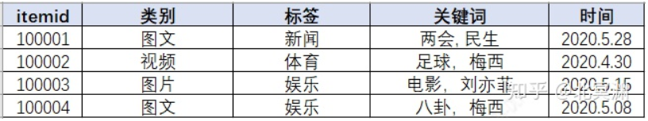
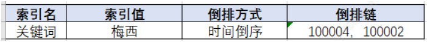
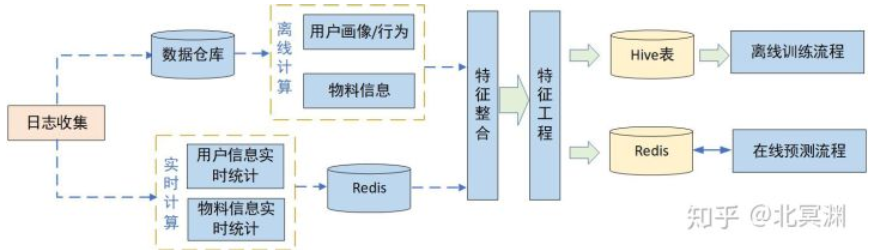
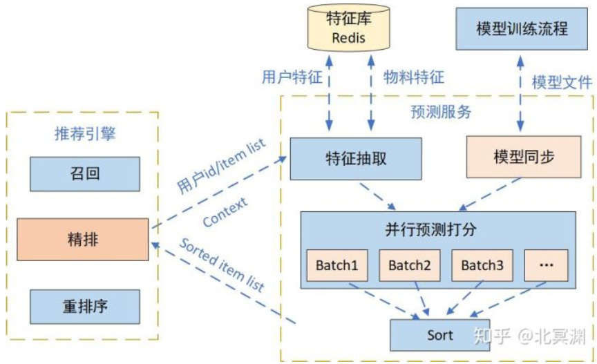
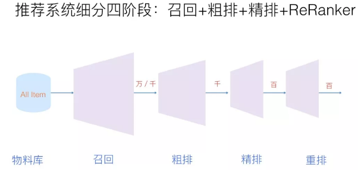

### 推荐系统架构

架构设计的第一步是确定系统的边界。所谓边界，就是区分什么是这个系统要负责的，也就是边界内的部分，以及什么是这个模型要依赖的，也就是边界外的部分。系统边界的确定，简单来说，就是在输入方面确定需要别人给我提供什么，而在输出方面确定我要给别人提供什么。

数据流实线为在线流程，虚线为离线流程。一般在线流程指用户实时访问系统用于计算及使用的服务，离线流程指跟用户请求无直接关系可对数据单独统计计算的过程。

| 组成元素 | 说明                                                         |
| -------- | ------------------------------------------------------------ |
| 物料数据 | 首先要有很多被推荐的物料数据，每个物料具有唯一id，还应有其自身的各类基础信息，例如：类型，类别，标签，地域等 |
| 用户数据 | 通过埋点记录用户各类行为，通过日志收集系统计算处理，将有效的用户行为数据结构化并落到存储空间中 |
| 用户画像 | 通过对用户数据进行分析，计算出所需维度的用户画像，便于后续使用 |
| 实时计算 | 实时收集日志并解析物料与用户的实时统计信息，用于后续算法特征处理或在线规则处理。 |
| 算法模块 | 通过物料数据和用户数据建立推荐算法模型                       |
| 推荐引擎 | 如果实时性不强，那么在离线按小时或天的频次直接计算各个用户可能的偏好物料，可以通过用户画像匹配物料，也可以通过模型进行预测排序 |
| 数据报表 | 用来展示推荐系统整体效果，包括AB实验效果，分标签、召回等维度效果等，用于后续迭代优化时提供数据支撑。 |

#### 数据管理

物料数据需要一个统一模块管理生成的所有物料，结构化后同步到资源池中，供后续正排及倒排的创建。用户日志通过`kafka`收集后，基于不同的计算方式消费日志数据，定时落入数据仓库或实时计算用户或物料数据，数据仓库中存储原始日志表和基于其生成的各种中间表，用来计算用户画像或统计物料信息。

##### 物料数据

倒排一般根据物料某一字段或某些字段组合反查物料id

如果按关键词建立倒排索引，倒排方式按物料时间倒序，“梅西”关键词对对应倒排索引如下：

存储：确定存储方式后，内容生产方或管理方就要定时将物料数据结构化并同步到数据库中，过期数据也要及时清理

###### 正排及倒排索引构建

正排构建数据结构并填充值，倒排可根据业务需要建立倒排索引关系。如果业务量较轻，可直接在推荐引擎中加载，这样的好处是后续应用都可直接在内存中使用物料数据信息，使用快捷。因为是基础数据，每次推荐引擎服务启动都要加载并建立倒排操作，数据量过大时服务启动会耗费大量时间，定时同步也会耗费计算资源，因此会把倒排及正排操作与推荐引擎解耦，以服务化的形式独立提供功能，也为其他模块的使用带来便利，但这样会增加服务间的接口调用。

##### 数据仓库

记录下用户及物料的历史数据，便于查询及挖掘使用。数据仓库所有数据来源于日志，通过`kafka`实时收集并消费日志信息，通过一定计算逻辑整理成结构化数据落入数据仓库中，数据表有的是原始表，有的是根据原始表计算的二级表。

| 数据构成     | 例子                                                         | 作用                                                         |
| ------------ | ------------------------------------------------------------ | ------------------------------------------------------------ |
| 用户行为     | 浏览、点击、播放、点赞、评论、转发，结合对应操作的物料信息   | 完整刻画用户在该系统中的访问路径、行为习惯、使用偏好等。这些数据作为原始用户特征可为算法提供充足的训练数据 |
| 用户画像     | 通过统计挖掘的方式，计算出用户对特定维度的偏好，以带权列表的方式刻画出不同用户的兴趣偏好 |                                                              |
| 物料挖掘信息 | 通过挖掘手段能对物料的历史整体表现作出评估，作为物料特征供算法模型使用 | 作为特征加入到模型训练中，学习到的特性可以预测一个相似物料在未来一段时间内的效果走势 |

##### 实时流计算

实时流用于实时从日志中获取有效信息，对于用户访问频次较高的应用属于必需品，可以反馈用户的实时行为和物料的实时统计信息，一般从数据仓库中生成的离线画像数据是天级或小时级的定时任务，对一些需要实时反馈用户行为的场景无法满足要求，例如用户刚曝光过的数据需要过滤或降权，刚点过的物料在一刷推荐时可以推些相似的物品，一些负反馈信息需要记录并实时生效，通过实时收集的用户日志根据不同需求逻辑进行实时计算能快速获取这些信息，反馈给系统快速做出变化

物料侧的计算目标类似，例如物料被曝光、点击、点赞等数据的实时情况，特别是新物料经过冷启动曝光后，能快速反映出这个物料的效果走势，判别出物料质量优劣，影响其后续的推荐策略。物料的实时计算结果，一般供数据侧如物料正排信息和建立倒排索引使用，倒排中可能会影响物料的实时热度分从而影响倒排链的变化。

#### 算法管理

主要是通过离线或在线拿到特征及样本数据训练模型，将训练好的模型同步给召回或排序的预测服务，推荐引擎实时调用预测结果供召回及排序使用。

通过算法来丰富用户和物料的维度信息。

##### 特征构建

从人和物的角度，特征也分为物料特征、用户特征及上下文特征，上下文也可算作用户特征的一种。用户特征一般通过明确记录或统计挖掘得到，如用户的地理位置、访问时段、使用设备、性别年龄，一般在访问时即可拿到；挖掘特征通过历史用户的操作行为，统计用户的画像偏好。物料特征一般是物料自身属性及其统计数据，例如类别、关键词、主题等固有属性，以及历史一段时间窗口内的效果统计如曝光、点击、点赞、转发等。

##### 训练样本

通过用户行为日志可获取全量用户曝光点击物料信息，通过用户及物料特征库抽取特征，从而构建出样本矩阵，通过离线计算保存到样本文件。

| 需处理样本         | 影响                                                         | 处理方式                                                   |
| ------------------ | ------------------------------------------------------------ | ---------------------------------------------------------- |
| 非真实用户访问样本 | 带来大量高曝光未点击行为，会严重影响样本数据分布             | 剔除掉                                                     |
| 极少行为用户样本   | 不能为其在模型中找到属于该类用户的“规律”，或者说引入这些数据后，模型会开始学习这类用户的数据分布，对整体分布的拟合带来噪声，易引起模型过拟合 | 看做类似新用户，通过用户冷启动的手段为其探索兴趣补充推荐。 |

采样：对于点击率预估而言，正负样本严重不均衡，所以需要对负例做一些采样。

· 负例：正例一般是用户产生点击、下载、分享等转换行为的样本，但是用户没有转换行为的样本是否就一定是负例呢？其实不然，很多展现其实用户根本没有看到，所以把这样样本视为负例是不合理的，也会影响模型的效果。比较常用的方法是skip-above，即用户点击的item位置以上的展现才可能视作负例。

###### 正负样本处理

在推荐系统中不同公司也有针对自家业务采取的样本划分方法。

- 一次请求会产生N条推荐结果，但大部分手机端通常用户只能看到其中的m条，m<N，通过客户端埋点计算出用户真实可见曝光的物料，在这批物料中选取点击与未点击样本直观上一次曝光中可能有点击或无点击
- 早期youtube推荐中，会对所有用户选取相同数量训练样本，可以同时避免低活跃用户和高活跃用户对整体模型的影响，使训练的模型更符合绝大多数用户行为
- 对于有曝光无点击行为的用户，其曝光未点击的负样本可随机选取，这样可以学到这类用户“不感兴趣”的部分
- 样本在通过定时任务整合时需要做shuffle打散，避免同类用户样本数据扎堆引起数据分布偏差，在训练模型时，也通过batch训练方式中每个batch的样本也进行shuffle打散

##### 模型训练

首次搭建排序模型可以先用基础模型如LR或GBDT跑出一个baseline快速上线，后续逐步迭代为复杂模型。通过分析用户行为及数据，构建特征工程及样本数据优化，得来的效果要比深度学习模型更好。

##### 线上预测

通常线上使用预测服务的形式实时提供模型推断功能，这时需要通过推荐引擎接口将待排序候选集的物料id、用户id以及请求上下文信息传给预测服务。预测服务中也分为特征抽取、物料打分排序、模型同步校验等模块。通过传入的物料id及用户id，可以从特征库中在线抽取特征，结合上下文特征得到所有候选集的特征信息，进而通过模型中各特征权重，计算每个物料的打分。

训练好的模型由离线训练流程定时同步到线上预测服务机器，注意同步时需要同时把模型的checksum一并同步并在服务端进行校验，当同步失败时仍使用缓存的上次同步模型进行预测，避免数据不一致。候选集物料被打分后进行整体排序，结果返回给推荐引擎。

对于推荐系统来说，就是先计算好每个用户的推荐，将推荐结果存储下来，通过预先将推荐结果存下来，可以更快的为用户提供推荐服务,提升用户体验。由于推荐系统会为每个用户生成推荐结果,并且每天都会(基本全量)更新用户的推荐结果，一般采用NoSql数据库来存储，并且要求数据库可拓展，高可用，支持大规模并发读写。

##### 模型更新

在线模型预测：增量更新仅将新加入的样本喂入模型进行增量学习。从技术上来说，深度学习模型往往采用随机梯度下降以及其变种进行学习，模型对增量样本的学习相当于在原有样本的基础上继续输入增量样本进行梯度下降。因此在深度学习模型的基础上，由全量更新改为增量更新的难度并不大。由于仅利用增量样本进行学习，因此模型在多个epoch之后也是收敛到新样本的最优点，而很难收敛到原所有样本+增量样本的全局最优点。因此在实际的推荐系统中，往往采用增量更新与全局更新相结合的方式，在进行几轮增量更新后，在业务量较小的时间窗口进行全局更新，纠正模型在增量更新过程后中积累的误差。提高模型实时性的另外一个改进方向是进行模型的局部更新，大致的思路是降低训练效率低的部分的更新频率，提高训练效率高的部分的更新频率。

#### 推荐引擎管理

推荐引擎能够实时给用户提供推荐服务，用来解析用户请求，将物料数据与画像数据打通，匹配符合用户兴趣的物料，同时调用算法召回，控制整体候选集多样性。通过排序预测服务为候选集打分排序给出用户可能感兴趣的结果，并根据业务和体验规则对推荐结果进行重排序，呈现给用户最终结果。同时推荐引擎还承担着线上AB实验精准分桶的功能，保证实验流量的科学分配，提升实验效果的置信度。

推荐引擎核心功能的主要有用户请求解析、实验分桶染色、召回、排序、重排等模块。

##### 实验染色

线上系统会有各种策略、算法需要快速迭代验证效果，科学准确的实验分桶策略能够均匀分配实验组对照组流量，同时互斥的实验需要互不干扰，例如在召回阶段做的实验A和B需要互斥，而和重排序阶段的实验C互不影响，在切分流量时需要考虑分层机制，同一层实验要求互斥，流量互不影响；不同层之间的实验并不相干，流量可以打通。

##### 召回

召回阶段主要是从全量的商品库中得到用户可能感兴趣的一小部分候选集，排序阶段则是将召回阶段得到的候选集进行精准排序，推荐给用户。召回的方式主要分为基于兴趣内容类，协同过滤类及算法类，最终候选集的呈现可以是这些召回的组合。

| 召回方式     |                                                              |
| ------------ | ------------------------------------------------------------ |
| 兴趣内容召回 | 基于用户兴趣画像，匹配不同维度物料，从用户感兴趣的维度中选择最新/最热内容召回。根据不同维度组成一级或多级索引可以组成多路兴趣召回，因为用户画像中各维度兴趣点都有权重，那召回对应物料的数量可根据权重自适应调整。 |
| 协同过滤召回 | 基于用户的协同过滤和基于物品的协同过滤，计算用户相似有`Jaccard`相似度、余弦相似度、皮尔逊相似度等 |
| 算法类召回   | 主要聚焦于通过特征和模型来对所有物料进行排序，筛选出`topN`物料进入候选集，也就是常说的粗排。 |

###### 协同过滤召回

则基于`User-CF`的召回流程如下，其他得分类相似度计算都可共用流程。在离线部分通过算法得到每个用户的物品列表，将其存入数据库，在在线部分，获取用户id，读取数据库中用户的推荐物品列表。

| 召回融合方法 | 说明                                                         |
| ------------ | ------------------------------------------------------------ |
| 加权型       | 根据经验值对不同算法赋给不同的权重，对各个算法产生的候选集按照给定的权重进行加权，然后再按照权重排序。 |
| 分级型       | 优先采用效果好的算法，当产生的候选集大小不足以满足目标值时，再使用效果次好的算法，依此类推。 |
| 调制型       | 不同的算法按照不同的比例产生一定量的候选集，然后叠加产生最终总的候选集。 |
| 过滤型       | 当前的算法对前一级算法产生的候选集进行过滤，依此类推，候选集被逐级过滤，最终产生一个小而精的候选集合。 |

目前我们使用的方法集成了调制和分级两种融合方法，不同的算法根据历史效果表现给定不同的候选集构成比例，同时优先采用效果好的算法触发，如果候选集不够大，再采用效果次之的算法触发，

##### 排序

针对召回出的候选集进行排序得到用户最可能感兴趣的内容，需要打分的物料只有几百上千条，因此可以使用更多维度的特征和复杂模型进行线上预测，这块流程同算法召回类似，统一调用排序预测服务即可。排序有时候可以分为粗排和精排两部分。

##### 重排序

经过排序之后所有候选物料已经是按用户最可能点击的顺序排好，但还需要重排来优化用户体验，例如同类内容的控量或打散，当然也需要根据用户行为进行策略上的调整，根据用户连续几刷点或不点来决定下一刷控量打散的度量等。同时还需要调整内容多样性来进行兴趣探索，特别是对于画像及行为不够丰富的用户。同时对于运营业务也需要在这里调整排序，比如时政内容的置顶、热点内容的加权、运营内容的提权或降权等。

推荐引擎的本质是将各种功能模块串接起来，既保证各模块功能各自独立解耦，又将其有序统一，使数据流顺利流动起来。如果业务越做越大，在召回、排序及重排的逻辑越来越复杂，那可能需要用微服务架构将召回、排序）、重排等模块分别抽离成单独服务，便于独立的团队维护独立的服务模块，同时也要尽可能优化网络接口减少网络开销。

##### 