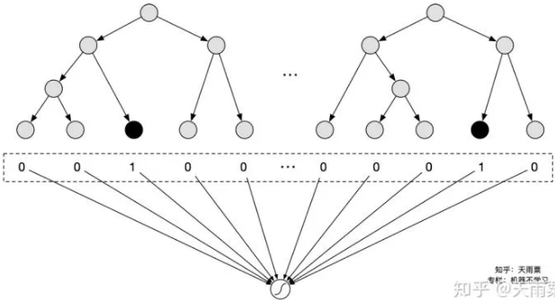
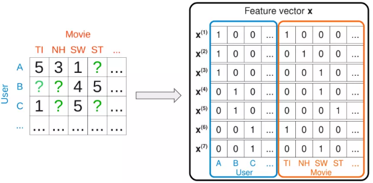
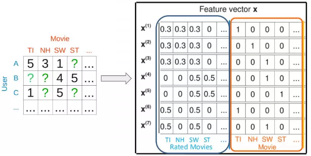

标的物”包含很多自己的属性，用户通过与“标的物”的交互会产生行为日志，这些行为日志可以作为衡量用户对“标的物”偏好的标签，通过这些偏好标签为用户做推荐就是基于内容的推荐算法。

“人以群分”就是找到与用户兴趣相同的用户(有过类似的行为)，将这些兴趣相同的用户浏览过物品推荐给用户，这就是基于用户的协同过滤算法。“物以类聚”就是如果有很多用户都对某两个物品有相似的偏好， 说明这两个物品是“相似”的，我们可以通过推荐用户喜欢过的物品相似的物品这种方式为用户提供个性化推荐， 这就是基于物品的协同过滤推荐算法

### 推荐系统的传统匹配模型

##### 基于Collaborative Filtering 的方法

###### CF模型

协同过滤基于一个最基本的假设：一个用户的行为，可以由和他行为相似的用户进行预测。协同过滤的基本思想是基于 <user, item> 的所有交互行为，利用集体智慧进行推荐。CF 按照类型可以分为3种，user-based CF、item-based CF 和 model-based CF。

User-base CF：通过对用户喜欢的item进行分析，如果用户a和用户b喜欢过的item差不多，那么用户a和b是相似的。类似朋友推荐一样，可以将b喜欢过但是a没有看过的item推荐给a。

Item-base CF: item A 和 item B 如果被差不多的人喜欢，认为 item A 和 item B 是相似的。用户如果喜欢 item A，那么给用户推荐 item B 大概率也是喜欢的。

Model-base CF: 也叫基于学习的方法，通过定义一个参数模型来描述用户和物品、用户和用户、物品和物品之间的关系，然后通过已有的用户-物品评分矩阵来优化求解得到参数。例如矩阵分解、隐语义模型LFM等。

协同过滤的思路要解决的问题用数据形式表达就是：矩阵的未知部分如何填充问题。如下所示，已知的值是用户已经交互过的item，如何基于这些已知值填充矩阵剩下的未知值，也就是去预测用户没有交互过的item是矩阵填充要解决的问题。

矩阵填充可以用经典的`SVD`解决，一般来说`SVD`求解可以分为三步：对 M 矩阵的 missing data 填充为0；求解`SVD`问题，得到`U`矩阵和`V`矩阵；利用`U`和`V`矩阵的低秩`k`维矩阵来估计。对于第二中的`SVD`求解问题，等价于以下的最优化问题：$arg \min_{U,\Sigma, V}(Y-U\Sigma V^T)^2=arg \min_{U,\Sigma,V}\sum_{i=1}^{m}\sum_{j=1}^{n}(y_{ij}-(U\Sigma V^T)_{ij})^2$。其中$y_{ij}$为用户$i$对物品$j$的真实评分，也就是 label，$U$和$V$为模型预估值，求解矩阵$U$和$V$的过程就是最小化用户真实评分矩阵和预测矩阵误差的过程。这种`SVD`求解方法存在以下问题：Missing data和 observe data 权重一样。最小化过程没有正则化，容易产生过拟合。

###### `MF`模型（矩阵分解）

为解决上述过拟合情况，矩阵分解模型提出的模型如下：$\hat{y}_{ui} = \mathbf{v}_u^T\mathbf{v}_i$。`MF`模型的核心思想可以分成两步：将用户$u$对物品$i$的打分分解成用户的隐向量$\mathbf{v}_u$，以及物品的隐向量$\mathbf{v}_i$；用户$u$和物品$i$的向量点积得到的value，可以用来代表用户$u$对物品$i$的喜好程度，分数越高代表该 item 推荐给用户的概率就越大。同时，`MF`模型引入了$l_2$正则来解决过拟合问题。
$$
L=\sum_{u}\sum_{i}w_{ui}(y_{ui}-\hat{y}_{ui})^2+\lambda(\sum_u||\mathbf{v}_u||^2+\sum_i||\mathbf{v}_i||^2)
$$

###### `FISM`模型

将用户喜欢过的 item 作为用户的表达来刻画用户，用数据公式表示如下：$\hat{y}_{ui} = (\sum_{j \in \mathcal{R}_u}\mathbf{q}_j)^T\mathbf{v}_i$。用户表达不再是独立的隐向量，而是用用户喜欢过的所有 item 的累加求和得到作为 user 的表达；而 item 本身的隐向量$\mathbf{v}_i$是另一套表示，两者最终同样用向量内积表示。对于每一个物品，都有两个嵌入向量$\mathbf{q}$和$\mathbf{v}$，当物品是预测的物品时，使用$\mathbf{v}$，当物品是交互历史中的物品时，使用$\mathbf{q}$。

###### SVD++模型

`MF`模型可以看成是 user-based 的 CF 模型，直接将用户id映射成隐向量，而`FISM`模型可以看成是 item-based 的`CF`模型，将用户交户过的 item 的集合映射成隐向量。`SVD++`正是这两者的结合，数学表达如下：$\hat{y}_{ui} = (\mathbf{v}_u+\sum_{j \in \mathcal{R}_u}\mathbf{q}_j)^T\mathbf{v}_i$。每个用户表达分成两个部分，左边$\mathbf{v}_u$表示用户 id 映射的隐向量，右边是用户交互过的 item 集合的求和。User 和 item 的相似度还是用向量点击来表达。

##### Generic feature-based的方法

上述的方法中，无论是 CF，MF，SVD，SVD++，还是 FISM，都只是利用了 user 和 item 的交互信息，而对于大量的 side information 信息没有利用到。因此，传统模型要讲的第二部分，是如何利用这些特征，去构造 feature-based 的 model。

特征体系三模块：用户信息、物品信息、交互信息

###### 逻辑回归

通过手动设计交叉特征以及特征离散化等方式，赋予LR这样的线性模型对数据集的非线性学习能力，高维离散特征+手动交叉特征构成了CTR预估的基础特征。

优势：

- 模型简单，具备一定可解释性
- 计算时间复杂度低
- 工程上可大规模并行化

不足：

- 依赖于人工大量的特征工程，例如需要根据业务背知识通过特征工程融入模型
- 特征交叉难以穷尽
- 对于训练集中没有出现的交叉特征无法进行参数学习

###### GBDT+LR

其本质上是通过Boosting Tree模型本身的特征组合能力来替代原先算法工程师们手动组合特征的过程。GBDT等这类Boosting Tree模型本身具备了特征筛选能力（每次分裂选取增益最大的分裂特征与分裂点）以及高阶特征组合能力（树模型天然优势），因此通过GBDT来自动生成特征向量就成了一个非常自然的思路。虽然是两个模型的组合，但实际并非是端到端的模型，而是两阶段的、解耦的，即先通过GBDT训练得到特征向量后，再作为下游LR的输入，LR的在训练过程中并不会对GBDT进行更新。

优势：特征工程自动化，通过Boosting Tree模型的天然优势自动探索特征组合

不足：

- 两阶段的、非端到端的模型
- CTR预估场景涉及到大量高维稀疏特征，树模型并不适合处理（因此实际上会将dense特征或者低维的离散特征给GBDT，剩余高维稀疏特征在LR阶段进行训练）
- GBDT模型本身比较复杂，无法做到online learning，模型对数据的感知相对较滞后（必须提高离线模型的更新频率）

###### FM模型

对于每个输入特征，模型都需要学习一个低维的隐向量表达 v，也就是在各种 NN 网络里所谓的 embedding 表示。
$$
\hat{y}(\mathbf{x})=\omega_0+\sum_{i=1}^p\omega_ix_i+\sum_{i=1}^{p}\sum_{j\gt i}^{p}<\mathbf{v}_i,\mathbf{v}_j>x_ix_j
$$
假如只使用 userid 和 itemid，我们可以发现其实 FM 退化成加了 bias 的 MF 模型

如果输入包含两个变量，用户交互过的 item 集合；itemid 本身，那么，此时的 FM 又将退化成带 bias 的 FISM 模型。同样道理，如果再加上 userid 的隐向量表达，那么 FM 模型将退化成 SVD++ 模型。

上面介绍的模型都是通过打分预测来解决推荐系统的排序问题，这在很多时候一般都不是最优的，原因有如下几个方面：预测打分用的 RMSE 指标和实际的推荐系统排序指标的 gap，预测打分用的 RMSE 拟合的是最小方差，而实际面临的是个排序问题；观察数据天然存在 bias，用户一般倾向于给自己喜欢的 item 打分，而用户没有打分过的 item 未必就真的是不喜欢。针对推荐系统的排序问题，一般可以用 pairwise 的 ranking 来替代 RMSE。

优势：

- 可以有效处理稀疏场景下的特征学习
- 具有线性时间复杂度
- 对训练集中未出现的交叉特征信息也可进行泛化

不足：2-way的FM仅枚举了所有特征的二阶交叉信息，没有考虑高阶特征的信息