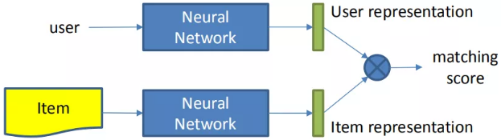
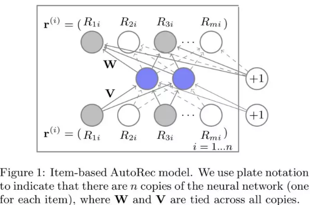
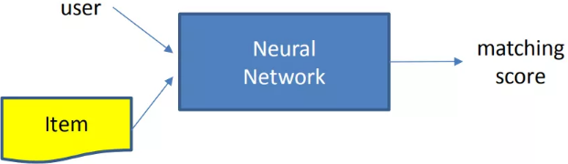
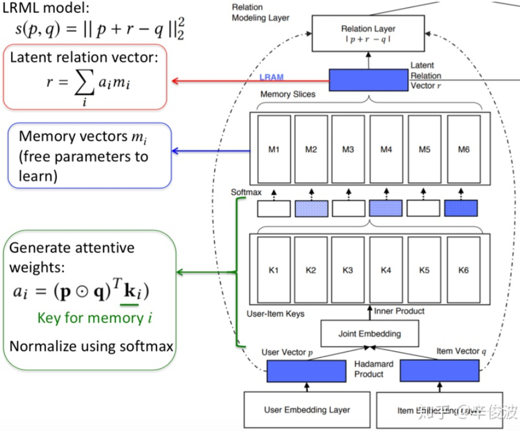

### 基于representation learning

这种方法会分别学习用户的表示以及物品的表示，也就是用户和物品各自的 embedding 向量，然后通过定义 matching score 的函数，一般是简单的向量点击、或者 cosine 距离来得到两者的匹配分数。

#### 基于协同过滤

| 模型名称      | 描述                                                         | input layer                                                  | representation function                                      |
| ------------- | ------------------------------------------------------------ | ------------------------------------------------------------ | ------------------------------------------------------------ |
| `CF`模型      | 分别学习 user 和 item 的隐向量。                             | `userid`, `itemid`(one-hot)                                  | 线性embedding layer                                          |
| `DMF`模型     | 在传统的MF中增加了MLP网络                                    | 用户由用户交互过的物品集合来表示，在评分矩阵中用行表示；物品由交互过的 用户集合来表示，在评分矩阵中用列表示 | 全连接网络                                                   |
| `AutoRec`模型 | 对输入做重建，来建立用户和物品的表示                         | 用户由用户交互过的物品集合来表示，在评分矩阵中用行表示；物品由交互过的 用户集合来表示，在评分矩阵中用列表示 | 自编码结构$h(\mathbf{r};\theta)=f(W.g(Vr+\mu)+b)$            |
| `CDAE`        | 除了userid本身表达用户，也将用户交互过的item作为user的表达。 | 用户id,用户历史交互过的item                                  | 针对所有用户 id 会学习一个和 item 无关的$V_u$向量表达，可以认为是用户本身的 bias，$\mathbf{z}_u=h(\mathbf{W}^T\mathbf{y}_u+\mathbf{V_u}+b)$，而对于输出层的节点，可以认为是用户 u 对物品 i 的打分预测：$\hat{y}_{ui}=f(\mathbf{W}_i^{\prime T}\mathbf{z}_u+b_i^{\prime})$； |

总结下以上基于CF的方法，有以下几个特点：用户或者物品要么由本身id表达，要么由其历史交互过的行为来表达；用历史交互过的行为来作为user或者item的表达，比用id本身表达效果更好，但模型也变得更复杂； Auto-encoder本质上等同于MLP+MF，MLP用全连接网络做user和item的特征表达； 所有训练数据仅用到user-item的交互信息，完全没有引入user和item的side info信息

##### `CF`模型

match function: 向量内积$f_{MF}=(u,i|\mathbf{p}_u,\mathbf{q}_i)=\mathbf{p}_u^T\mathbf{q}_i$

##### `DMF`模型

match function: 用 cosine 点击表示匹配分数$\hat{Y}_{ij}=F(u_i,v_j|\Theta)= \cos(\mathbf{p}_i,\mathbf{q}_j) = \frac{\mathbf{p}_i^T\mathbf{q}_j}{||\mathbf{p}||||\mathbf{q}||}$

DMF

##### `AutoRec`模型

用$r_u$表示用户向量，$r_i$表示物品向量，通过`AutoEncoder`将$r_u$或者$r_i$投射到低维向量空间，然后再将其投射到正常空间，利用`AutoEncoder`中目标值和输入值相近的特性，从而重建出用户对于未交互过的物品的打分。损失函数为最小化预测的平方差以及$W$和$V$矩阵的$L_2$正则：
$$
\min_{\theta}\sum_{i=1}^{n}||\mathbf{r}^{(i)}-h(\mathbf{r}^{(i)};\theta)||_{\mathcal{O}}^2+\frac{\lambda}{2}(||W||_F^2+||V||_F^2)
$$
其中$||\cdot||_{\mathcal{O}}^2$表示只对观测到的数据去损失函数，即在评分矩阵中，没有打分的部分不管他，只让模型去拟合已有的打分部分，让这一部分充分拟合好，然后对于没有数据的部分，训练好的权重会给出一个非零值，这就是模型预测的结果。

##### `CDAE`模型

matching function：使用向量点积作为匹配分数：$\hat{y}_{ui}=\mathbf{W}_i^{\prime T}\mathbf{V_u}$

#### 基于协同过滤+side information

| 模型名称   | input layer                                        | representation function                                      |      |
| ---------- | -------------------------------------------------- | ------------------------------------------------------------ | ---- |
| `DCF`模型  | 除了用户和物品的交互矩阵，还有用户特征X和物品特征Y | 引入了用户侧特征X；物品侧特征 Y；user 和 item 侧的特征各自通过一个 auto-encoder 来学习，而交互信息$R$矩阵依然做矩阵分解$U,V$。 |      |
| `DUIF`模型 | 除了用户和物品的交互矩阵，还有用户特征X和物品特征Y |                                                              |      |
|            |                                                    |                                                              |      |

##### `DCF`模型 Deep Collaborative Filtering

其中$W_1$，表示的用户侧特征$X$在 auto-encoder 过程中的 encode 部分，也就是输入到隐层的重建，$P_1$表示的是用户特征到交互矩阵$R$的映射；而$W_2$表示物品侧特征$Y$在 auto-encoder 过程中的 encode 部分。$P_2$表示的是物品特征到交互矩阵$R$的映射。

##### `DUIF`模型 Deep User and Image Feature Learning

$f_i$表示原始图片特征，通过CNN网络提取的图片特征作为item的表达，然后用一个线性映射$\mathbf{W}$可以得到item的embedding表达，通过模型学到的$\mathbf{p}_u$作为用户的表示，以及通过CNN提取的图片特征作为物品的表示, 两者通过向量点积得到两者的匹配分数
$$
\hat{y}_{ui} = <\mathbf{p}_u,\mathbf{W}^T\text{CNN}(\mathbf{f}_i)>
$$

##### `ACF`模型 Attentive Collaborative Filtering

用户侧：userid；用户历史交互过的 item。Item侧：itemid；item 相关的视觉相关特征。representation function：可以分为两个 attention，一个是 component 层级的 attention，主要是提取视觉特征；第二层是 item 层级的 attention，主要提取用户对物品的喜好程度权重。

###### component-attention

###### item-attention

第二层attention，认为用户作用过的item历史中，权重应该是不同的。用户本身的表达引入了$a(i,l)$，代表的是用户$i$对其历史交互过的物品$l$的权重。
$$
a(i,l) = \mathbf{w}_1^T\phi(\mathbf{W}_{1u}\mathbf{u}_i+\mathbf{W}_{1v}\mathbf{v}_l+\mathbf{W}_{1p}\mathbf{p}_l+\mathbf{W}_{1x}\overline{\mathbf{x}}_l+\mathbf{b}_1)+\mathbf{c}_1\\
\alpha(i,l) = \frac{exp(a(i,l))}{\sum_{n\in \mathcal{R}(i)}exp(a(i,n))}
$$
其中$\mathbf{u}_i$是用户本身的latent vector, $\mathbf{v}_l$是物品$l$的latent vector，$\mathbf{p}_l$是物品$l$的辅助latent vector; $\overline{\mathbf{x}}_l$是表示前面提到的从图文信息提取的特征latent vector。用户$\mathbf{u}_i$最终的表达是自身的latent vector，以及历史行为的attention加权的representation表示。

##### `CKB`模型 Collaborative Knowledge Base Embedding

整个CKB模型框架其实思想比较简单，分别在结构化信息、文本信息和视觉信息中提取item侧特征作为item的representation

##### 方法总结

总结上述基于 CF 的方法，可以用如下的范式作为表达

 representation learning：目的是学习到 user 和 item 各自的 representation。特征表达：user 侧特征除了用户 id 本身 userid，可以加上其他 side info；item 侧特征除了物品 id 本身 itemid，还有其他文本特征、图文特征、视频帧特征等信息。模型表达：除了传统的 DNN，其他结构如 Auto-Encoder，Denoise-Auto-Encoder，CNN，RNN 等。

基于representation learning的深度匹配模型不是一个端到端模型，通过user和item各自的representation作为中间产物，解释性较好，而且可以用在出了排序阶段以外的其他环节，例如求物品最相似的item集合，召回环节等。

### 基于match function learning

基于match function learning最大的特点是，不直接学习user和item的embedding，而是通过已有的各种输入，通过一个neural network框架，来直接拟合user和item的匹配分数

#### 基于协同过滤的深度模型

##### 基于`NCF`框架的方法

基于神经网络的学习方法对比传统的 CF 网络，在得到 user vector 和 item vector 后，连接了 MLP 网络后，最终拟合输出，得到一个 end-2-end 的 model。这套框架好处就是足够灵活，user 和 item 侧的双塔设计可以加入任意 side info 的特征，而 MLP 网络也可以灵活的设计。

##### `NeuMF`模型 Neural Matrix Factorization

利用了 MF 和神经网络 MLP 的能力来拟合 matching score；MF 利用向量内积学习 user 和 item 的关联，同时 MLP 部分捕捉两者的其他高阶信息。模型可以分为 GMF 和 MLP 两个部分来看

###### `GMF`部分

user和item都通过one-hot编码得到稀疏的输入向量，然后通过一个embedding层映射为user vector和item vector。这样就获得了user和item的隐向量，一般可以通过向量点积或者哈达马积得到交互，不过在NeuMF中多连接了一个连接层，也就是GMF layer
$$
\hat{y}_{ui} = \alpha_{o}(\mathbf{h}^T(\mathbf{p}_u \odot\mathbf{q}_i))
$$

###### MLP部分

输入和GMF部分一样，都是one-hot的稀疏编码，然后通过embedding层映射为user vector和item vector。注意到这里user和item的vector 和GMF部分是不一样的，原因是GMF和MLP两个网络结构对隐层维度要求不同，MLP部分会高一些
$$
\mathbf{z}_1 = \phi_1(\mathbf{p}_u,\mathbf{q}_i)=\left[\begin{array}{c} \mathbf{p}_u\\\mathbf{q}_i\end{array}\right]\\
\phi_2(\mathbf{z}_1) = a_2(\mathbf{W}_2^T\mathbf{z}_1+\mathbf{b}_2)\\
\cdot\\
\cdot\\
\hat{y}_{ui} = \sigma(\mathbf{h}^T\phi_L(\mathbf{z}_{L-1}))
$$

##### `NNCF`模型 Neighbor-based NCF

输入除了user和item的信息，还各自引入了user和item各自的neighbor信息。

##### `ONCF`模型 Outer-Product based NCF

##### 

基于NCF框架的方法基础原理是基于协同过滤，而协同过滤本质上又是在做user和item的矩阵分解，所以，基于NCF框架的方法本质上也是基于MF的方法。矩阵分解本质是尽可能将user和item的vector，通过各种方法去让user和item在映射后的空间中的向量尽可能接近

而另外一种思路，基于翻译的方法，也叫translation based model，认为user和item在新的空间中映射的vector可以有gap，这个gap用relation vector来表达，也就是让用户的向量加上relation vector的向量，尽可能和item vector接近。

##### `transRec`模型

要解决的是next item的推荐问题。基本思想是说用户本身的向量，加上用户上一个交互的item的向量，应该接近于用户下一个交互的item的向量，输入是(user, prev item, next item)，预测下个item被推荐的概率

##### `LRML`模型 Latent Relation Metric Learning

#### feature-base 的深度模型

因此，如何捕捉特征之间的交叉关系，衍生了众多基于特征的模型，在这里将这些捕捉特征交叉关系的模型称为feature-based model。

##### `wide & deep`模型

 把单输入层的 Wide 部分和经过多层感知机的 Deep 部分连接起来，一起输入最终的输出层。其中 Wide 部分的主要作用是让模型具有记忆性（Memorization），单层的 Wide 部分善于处理大量稀疏的 id 类特征，便于让模型直接“记住”用户的大量历史信息；Deep 部分的主要作用是让模型具有“泛化性”（Generalization），利用 DNN 表达能力强的特点，挖掘藏在特征后面的数据模式。最终利用 LR 输出层将 Wide 部分和 Deep 部分组合起来，形成统一的模型。 

##### `deep crossing`模型

deep crossing网络引入了resnet残差网络的概念，通过short-cut，在MLP的深层网络，也能接收来自第一层的输入，这样可以使得模型的深度达到10层之多