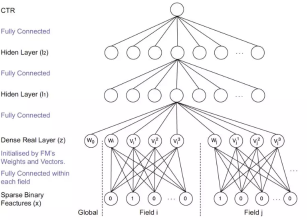
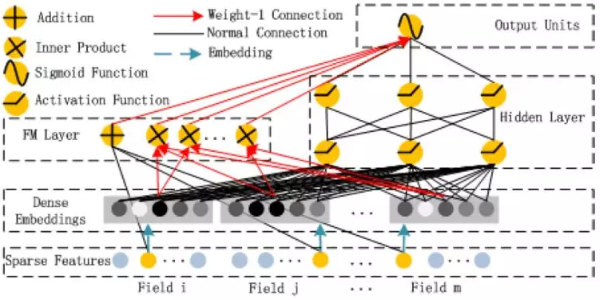

### 传统匹配模型

#### Generic feature-based的方法

`feature-based` 的模型的特征体系包括三个模块：用户信息、物品信息、交互信息

##### `POLY2`模型

`LR` 模型只考虑特征之间的线性关系，而`POLY2` 模型考虑了特征之间的非线性关系。捕获非线性特征的一个常用方法是采用核技巧，但是核技巧存在计算量大，通过多项式映射 `polynomially mapping` 数据的方式来提供非线性特征，在达到接近核技巧效果的情况下大幅度降低内存和计算量。仅仅考虑使用一个多项式映射，则我们得到
$$
\phi(\vec{\mathbf{x}}) = [1,x_1,\cdots,x_n,x_1^2,\cdots,x_n^2,x_1x_2,\cdots,x_{n-1}x_n]^T
$$
结合`LR` 模型，则得到 `POLY2` 模型：
$$
z(\vec{\mathbf{x}})=\omega_0+\sum_{i=1}^p\omega_ix_i+\sum_{i=1}^{K}\sum_{j=i+1}^{K}\omega_{ij}\times x_i\times x_j\\
y(vec{\mathbf{x}})=\frac{1}{1+\exp(-z(\vec{\mathbf{x}}))}
$$

优点：除了线性特征之外，还能够通过特征组合自动捕获二阶特征交叉产生的非线性特征。

缺点：参数太多导致计算量和内存需求发生爆炸性增长。数据稀疏导致二次项参数训练困难，非常容易过拟合。

##### FM模型

将样本为：$\vec{\mathbf{x}}=(x_1,x_2,\cdots,x_K)^T$

则 `FM` 模型为：$\hat{y}(\mathbf{x})=\omega_0+\sum_{i=1}^K\omega_ix_i+\sum_{i=1}^{K}\sum_{j=i+1}^{K}\hat{w}_{i,j}x_ix_j$

其中$\hat{w}_{i,j}$是交叉特征的参数，它由一组参数定义：$\hat{w}_{i,j}=<\vec{\mathbf{x}}_i,\vec{\mathbf{x}}_j>=\sum_{l=1}^dv_{i,l}\times v_{j,l}$
$$
\hat{\mathbf{W}} = \left[\begin{array}{cccc}\hat{w}_{1,1}&\hat{w}_{1,2}&\cdots&\hat{w}_{1,K}\\
\hat{w}_{2,1}&\hat{w}_{2,2}&\cdots&\hat{w}_{2,K}\\
\cdot&\cdot&\cdots&\cdot\\
\hat{w}_{K,1}&\hat{w}_{K,2}&\cdots&\hat{w}_{K,K}\end{array}\right]=\mathbf{V}^T\mathbf{V}=\left[\begin{array}{cccc}\vec{\mathbf{v}}_1^T\\
\vec{\mathbf{v}}_2^T\\
\cdot\\ \cdot \\ \cdot\\\vec{\mathbf{v}}_K^T
\end{array}\right]\left[\begin{array}{cccc}\vec{\mathbf{v}}_1^T  &  \vec{\mathbf{v}}_2^T&\cdots&\vec{\mathbf{v}}_K^T
\end{array}\right]
$$
模型待求解的参数为：$\omega_0\in \mathbb{R},\vec{\mathbf{w}}\in \mathbb{R}^n, \mathbf{V}=(\vec{\mathbf{v}}_i,\cdots,\vec{\mathbf{x}}_K)\in \mathbb{R}^{d\times K}$

对于每个输入特征$x_i$，模型都需要学习一个低维的隐向量表达$\mathbf{v}_i$。
$$
\\
\begin{array}{l}\sum_{i=1}^{K}\sum_{j=i+1}^{K}\hat{w}_{i,j}x_ix_j &=\sum_{i=1}^{K}\sum_{j=i+1}^{K}(\sum_{l=1}^dv_{il}v_{j_l})x_ix_j\\
&=\sum_{l=1}^d[\sum_{i=1}^{K}\sum_{j=i+1}^{K}(v_{il}x_i)(v_{jl}x_j)]\\
&=\sum_{l=1}^d\frac{1}{2}[(\sum_{i=1}^{K}v_{il}x_i)^2-\sum_{i=1}^{K}(v_{il}x_i)^2]
\end{array}
$$
因此有：$\hat{y}(\vec{\mathbf{x}})=\omega_0+\sum_{i=1}^K\omega_ix_i+\sum_{l=1}^d\frac{1}{2}[(\sum_{i=1}^{K}v_{il}x_i)^2-\sum_{i=1}^{K}(v_{il}x_i)^2]$

`FM` 模型可以用于求解分类问题 ，也可以用于求解回归问题。

- 对于回归问题，其损失函数为`MSE` 均方误差

$$
\mathcal{L} = \sum_{(\vec{\mathbf{x}},y)\in\mathbb{S}}(\hat{\vec{\mathbf{x}}}-y)^2+\sum_{\theta\in\Theta}\lambda_\theta\times\theta^2
$$

- 对于二分类问题，其损失函数为交叉熵：

$$
p(\hat{y}=y|\vec{\mathbf{x}})=\frac{1}{1+\exp(-y\phi(\vec{\mathbf{x}}))}\\
\mathcal{L} = -\sum_{(\vec{\mathbf{x}},y)\in\mathbb{S}}\log p(\hat{y}=y|\vec{\mathbf{x}}) + \sum_{\theta\in\Theta}\lambda_\theta\times\theta^2
$$

其中$\mathbf{\Theta}=\{w_0,\vec{\mathbf{w}},\mathbf{V}\}$，其中$\lambda_\theta$为参数$\theta$的正则化系数

###### `ALS`优化算法

$$
\hat{y}(\vec{\mathbf{x}};\mathbf{\Theta})=\omega_0+\sum_{i=1}^K\omega_ix_i+\sum_{l=1}^d\frac{1}{2}[(\sum_{i=1}^{K}v_{il}x_i)^2-\sum_{i=1}^{K}(v_{il}x_i)^2]
$$

对每个$\theta$，可以将$\hat{y}$分解为$\theta$的线性部分和偏置部分：$\hat{y}(\vec{\mathbf{x}};\mathbf{\Theta})=h_\theta(\vec{\mathbf{x}})\times \theta +g_\theta(\vec{\mathbf{x}})$。其中$h_\theta(\vec{\mathbf{x}}),g_\theta(\vec{\mathbf{x}})$与$\theta$无关。

对于$w_0$有：
$$
h_{w_{0}}=1\\
g_{w_0} = \sum_{i=1}^K\omega_ix_i+\sum_{l=1}^d\frac{1}{2}[(\sum_{i=1}^{K}v_{il}x_i)^2-\sum_{i=1}^{K}(v_{il}x_i)^2]
$$
对于$w_i,i=1,2,\cdots,K$有：
$$
h_{w_i} = x_i\\
g_{w_i}=\omega_0+\sum_{j=1,j\ne i}^K\omega_jx_j+\sum_{l=1}^d\frac{1}{2}[(\sum_{j=1}^{K}v_{jl}x_j)^2-\sum_{j=1}^{K}(v_{jl}x_j)^2]
$$
对于$v_{i,l},i=1,2,\cdots,K;l=1,2.\cdots,d$有：
$$
h_{v_{i,l}} = \sum_{j=1,j\ne i}^Kv_{j,l}\times x_j\times x_i\\
g_{v_{i,l}} = \omega_0+\sum_{i=1}^K\omega_ix_i+\sum_{i^{\prime}=1}^K\sum_{j^{\prime}=i^{\prime}+1}^K\sum_{l^{\prime}=1,(l^{\prime},i^{\prime},j^{\prime})\ne (l,i,i)}v_{i^{\prime},l^{\prime}}\times v_{j^{\prime},l^{\prime}}\times x_{i^{\prime}}\times x_{j^{\prime}}
$$
考虑均方误差损失函数，最小值点的偏导数为 0 ，则有：
$$
\theta = -\frac{\sum_{(\vec{\mathbf{x}},y)\in\mathbb{S}}(g_\theta(\vec{\mathbf{x}})-y)\times h_\theta(\vec{\mathbf{x}})}{\sum_{(\vec{\mathbf{x}},y)\in\mathbb{S}}h^2_\theta(\vec{\mathbf{x}})+\lambda_\theta}
$$
`ALS` 通过多轮次、轮流迭代求解$\theta\in\mathbf{\Theta}$即可得到模型的最优解。在迭代之前初始化参数，其中：$w_0,\vec{\mathbf{w}}$通过零初始化，$\mathbf{V}$的每个元素通过均值为0、方差为$\sigma$的正太分布随机初始化。每一轮迭代时：首先求解$w_0,\vec{\mathbf{w}}$，因为相对于二阶交叉的高阶特征，低阶特征有更多的数据来估计其参数，因此参数估计更可靠。然后求解$\mathbf{V}$。这里按照维度优先的准确来估计：先估计所有`representation` 向量的第 `1` 维度，然后是第 `2` 维，... 最后是第 `d` 维。

##### `FFM`模型

每个特征$x_i$的隐向量应该有多个，当该特征与不同域的特征做交叉时，应该使用对应的隐向量，这样可以做到更精细地刻画交叉特征的权重。所以每个特征应该有和field数量相同的隐向量个数。

| 域   | 性别 |      | 年龄 |      |      |      | 价格 |      |       |
| ---- | ---- | ---- | ---- | ---- | ---- | ---- | ---- | ---- | ----- |
| 特征 | 男   | 女   | 15   | 25   | 50   | >50  | 500  | 1000 | >1000 |
| 样本 | 1    | 0    | 0    | 0    | 1    | 0    | 0    | 1    | 0     |

在 `FM` 模型中，每个特征的表示向量只有一个。`FFM` 中每个特征的 表示向量有多个，用于捕捉该特征在不同`field` 中的含义。

假设样本共有$F$个`field`，特征$x_i,x_j$分别属于域$f_i,f_j$，$x_i$有$F$个隐向量$(\mathbf{v}_{i,1},\cdots,\mathbf{v}_{i,F})$，$\mathbf{v}_i$是一个$d$维向量。
$$
\hat{y}(\vec{\mathbf{x}})=\omega_0+\sum_{i=1}^K\omega_ix_i+\sum_{i=1}^K\sum_{j=i+1}^K\hat{\omega}_{ij}\times x_i\times x_j\\
\hat{\omega}_{ij}=<\vec{\mathbf{v}}_{i,f_j},\vec{\mathbf{v}}_{j,f_i}>
$$

和 `FM` 相同，`FFM` 模型也可以用于求解分类问题，也可以用于求解回归问题 

`FFM` 模型需要为每个特征分配一个 `field` ，离散型特征：通常对离散型特征进行 `one-hot` 编码，编码后的所有二元特征都属于同一个 `field` 。数值型特征：数值型特征有两种处理方式：不做任何处理，简单的每个特征分配一个`field` 。数值特征离散化之后，按照离散型特征分配 `field` 。

##### `GBDT+LR`

用GBDT构建特征工程，和利用LR预测CTR两步是独立训练的。其本质上是通过Boosting Tree模型本身的特征组合能力来替代原先算法工程师们手动组合特征的过程。GBDT等这类Boosting Tree模型本身具备了特征筛选能力（每次分裂选取增益最大的分裂特征与分裂点）以及高阶特征组合能力（树模型天然优势），因此通过GBDT来自动生成特征向量就成了一个非常自然的思路。

利用训练集训练好GBDT模型，之后就可以利用该模型构建特征工程。具体过程是这样的，一个样本在输入GBDT的某一子树后，会根据每个节点的规则最终落入某一叶子节点，那么我们把该叶子节点置为1，其他叶子节点置为0，所有叶子节点组成的向量即形成了该棵树的特征向量，把GBDT所有子树的特征向量concatenate起来，即形成了后续LR输入的特征向量。

### 基于representation learning

#### 基于协同过滤+side information

| 模型名称   | input layer                                        | representation function                                      |      |
| ---------- | -------------------------------------------------- | ------------------------------------------------------------ | ---- |
| `DCF`模型  | 除了用户和物品的交互矩阵，还有用户特征X和物品特征Y | 引入了用户侧特征X；物品侧特征 Y；user 和 item 侧的特征各自通过一个 auto-encoder 来学习，而交互信息$R$矩阵依然做矩阵分解$U,V$。 |      |
| `DUIF`模型 | 除了用户和物品的交互矩阵，还有用户特征X和物品特征Y |                                                              |      |
|            |                                                    |                                                              |      |

##### `DCF`模型 Deep Collaborative Filtering

其中$W_1$，表示的用户侧特征$X$在 auto-encoder 过程中的 encode 部分，也就是输入到隐层的重建，$P_1$表示的是用户特征到交互矩阵$R$的映射；而$W_2$表示物品侧特征$Y$在 auto-encoder 过程中的 encode 部分。$P_2$表示的是物品特征到交互矩阵$R$的映射。

##### `DUIF`模型 Deep User and Image Feature Learning

$f_i$表示原始图片特征，通过CNN网络提取的图片特征作为item的表达，然后用一个线性映射$\mathbf{W}$可以得到item的embedding表达，通过模型学到的$\mathbf{p}_u$作为用户的表示，以及通过CNN提取的图片特征作为物品的表示, 两者通过向量点积得到两者的匹配分数
$$
\hat{y}_{ui} = <\mathbf{p}_u,\mathbf{W}^T\text{CNN}(\mathbf{f}_i)>
$$

##### `ACF`模型 Attentive Collaborative Filtering

用户侧：userid；用户历史交互过的 item。Item侧：itemid；item 相关的视觉相关特征。representation function：可以分为两个 attention，一个是 component 层级的 attention，主要是提取视觉特征；第二层是 item 层级的 attention，主要提取用户对物品的喜好程度权重。

###### component-attention

###### item-attention

第二层attention，认为用户作用过的item历史中，权重应该是不同的。用户本身的表达引入了$a(i,l)$，代表的是用户$i$对其历史交互过的物品$l$的权重。
$$
a(i,l) = \mathbf{w}_1^T\phi(\mathbf{W}_{1u}\mathbf{u}_i+\mathbf{W}_{1v}\mathbf{v}_l+\mathbf{W}_{1p}\mathbf{p}_l+\mathbf{W}_{1x}\overline{\mathbf{x}}_l+\mathbf{b}_1)+\mathbf{c}_1\\
\alpha(i,l) = \frac{exp(a(i,l))}{\sum_{n\in \mathcal{R}(i)}exp(a(i,n))}
$$
其中$\mathbf{u}_i$是用户本身的latent vector, $\mathbf{v}_l$是物品$l$的latent vector，$\mathbf{p}_l$是物品$l$的辅助latent vector; $\overline{\mathbf{x}}_l$是表示前面提到的从图文信息提取的特征latent vector。用户$\mathbf{u}_i$最终的表达是自身的latent vector，以及历史行为的attention加权的representation表示。

##### `CKB`模型 Collaborative Knowledge Base Embedding

整个CKB模型框架其实思想比较简单，分别在结构化信息、文本信息和视觉信息中提取item侧特征作为item的representation

##### 方法总结

总结上述基于 CF 的方法，可以用如下的范式作为表达

 representation learning：目的是学习到 user 和 item 各自的 representation。特征表达：user 侧特征除了用户 id 本身 userid，可以加上其他 side info；item 侧特征除了物品 id 本身 itemid，还有其他文本特征、图文特征、视频帧特征等信息。模型表达：除了传统的 DNN，其他结构如 Auto-Encoder，Denoise-Auto-Encoder，CNN，RNN 等。

基于representation learning的深度匹配模型不是一个端到端模型，通过user和item各自的representation作为中间产物，解释性较好，而且可以用在出了排序阶段以外的其他环节，例如求物品最相似的item集合，召回环节等。

### 基于match function learning

#### feature-base 的深度模型

因此，如何捕捉特征之间的交叉关系，衍生了众多基于特征的模型，在这里将这些捕捉特征交叉关系的模型称为feature-based model。

##### `FNN`模型

`FNN`模型最先提出了一种增强FM模型的思路，就是用FM模型学习到的隐向量初始化深度神经网络模型（MLP），再由MLP完成最终学习。`FNN`本质上也是两阶段的模型，就是将`FM`预训练好的`Embedding`向量直接喂给下游的DNN模型，让DNN来进行更高阶交叉信息的学习。

优势：离线训练FM得到embedding，再输入NN，相当于引入先验专家经验；加速模型的训练和收敛；NN模型省去了学习feature embedding的步骤，训练开销低

不足：非端到端的两阶段模型，不利于online learning；预训练的Embedding受到FM模型的限制；FNN中只考虑了特征的高阶交叉，并没有保留低阶特征信息

##### `PNN`模型

PNN 的关键在于在 embedding 层和全连接层之间加入了 Product layer。传统的 DNN 是直接通过多层全连接层完成特征的交叉和组合的，但这样的方式缺乏一定的“针对性”。首先全连接层并没有针对不同特征域之间进行交叉；其次，全连接层的操作也并不是直接针对特征交叉设计的。  因此 PNN 通过加入`Product layer`完成了针对性的特征交叉，其 product 操作在不同特征域之间进行特征组合。并定义了 inner product，outer product 等多种 product 的操作捕捉不同的交叉信息，增强模型表征不同数据模式的能力 。

PNN结构显示通过Embedding Lookup得到每个field的Embedding向量，接着将这些向量输入Product Layer，在Product Layer中包含了两部分，一部分是左边的$z$，就是将特征原始的Embedding向量直接保留；另一部分是右侧的$p$，即对应特征之间的product操作，每个节点是两两Field的embedding对应的“product”结果，而非所有Field的；可以看到PNN相比于FNN一个优势就是保留了原始的低阶embedding特征。

优势：PNN通过$z$保留了低阶Embedding特征信息；通过Product Layer引入更复杂的特征交叉方式，

不足：计算时间复杂度相对较高

##### `DeepFM`模型

DeepFM 相当于同时组合了原 Wide 部分 + 二阶特征交叉部分 +Deep 部分三种结构，无疑进一步增强了模型的表达能力。

从模型结构图可以看出，FM 和 DNN共用embedding层的结果，然后FM部分负责低阶特征组合（二阶），而DNN负责高阶特征组合，然后将低阶和高阶部分合在一起训练。DeepFM的预测结果可以写为：$\hat{y} = \text{sigmoid}(y_{FM}+y_{DNN})$

###### 嵌入层

通过嵌入层，尽管不同field的长度不同（不同离散变量的取值个数可能不同），但是embedding之后向量的长度均为K。在得到embedding之后，我们还将对应的特征值乘到了embedding上，这主要是由于fm部分和dnn部分共享嵌入层作为输入

###### FM部分

FM的输出公式为：$y_{FM} = <\omega,x>+\sum_{j_1=1}^d\sum_{j_2=j_1+1}^d<V_i,V_j>x_{j_1}x_{j_2}$

##### `DCN`模型

 主要的思路使用 Cross 网络替代了原来的 Wide 部分。其中设计 Cross 网络的基本动机是为了增加特征之间的交互力度，使用多层 cross layer 对输入向量进行特征交叉。单层 cross layer 的基本操作是将 cross layer 的输入向量 xl 与原始的输入向量 x0 进行交叉，并加入 bias 向量和原始 xl 输入向量。DCN 本质上还是对 Wide&Deep Wide 部分表达能力不足的问题进行改进，与 DeepFM 的思路非常类似。 

###### Embedding and Stacking Layer

此部分主要是对原始特征进行预先处理操作，其中，对sparse特征进行embedding，对于multi-hot的sparse特征，embedding之后再做一个简单的average pooling；对dense特征归一化，然后和embedding特征拼接，作为随后Cross层与Deep层的共同输入，即： $\mathbf{x}_0=[\mathbf{x}_{e,1}^T,\cdots,\mathbf{x}_{e,k}^T,\mathbf{x}_d^T]$

###### Cross Network

假设网络有$L_1$层，每一层和前一层的关系可以用如下关系表示
$$
\mathbf{x}_{l+1} = \mathbf{x}_0\mathbf{x}_l^T\mathbf{w}_l+\mathbf{b}_l+\mathbf{x}_l=f(\mathbf{x}_l,\mathbf{w}_l,\mathbf{b}_l)+\mathbf{x}_l
$$

##### `wide & deep`模型

 把单输入层的 Wide 部分和经过多层感知机的 Deep 部分连接起来，一起输入最终的输出层。其中 Wide 部分的主要作用是让模型具有记忆性（Memorization），单层的 Wide 部分善于处理大量稀疏的 id 类特征，便于让模型直接“记住”用户的大量历史信息；Deep 部分的主要作用是让模型具有“泛化性”（Generalization），利用 DNN 表达能力强的特点，挖掘藏在特征后面的数据模式。最终利用 LR 输出层将 Wide 部分和 Deep 部分组合起来，形成统一的模型。 

##### `deep crossing`模型

deep crossing网络引入了resnet残差网络的概念，通过short-cut，在MLP的深层网络，也能接收来自第一层的输入，这样可以使得模型的深度达到10层之多

##### NFM模型

NFM 从修改 FM 二阶部分的角度出发，用一个带 Bi-interaction Pooling 层的 DNN 替换了 FM 的特征交叉部分，形成了独特的 Wide&Deep 架构。其中 Bi-interaction Pooling 可以看作是不同特征 embedding 的 element-wise product 的形式。这也是 NFM 相比 Google Wide&Deep 的创新之处。

##### AFM模型

 AFM 其实是对 FM 的二阶部分的每个交叉特征赋予了权重，这个权重控制了交叉特征对最后结果的影响，也就非常类似于 NLP 领域的注意力机制（Attention Mechanism）。为了训练 Attention 权重，AFM 加入了 Attention Net，利用 Attention Net 训练好 Attention 权重后，再反向作用于 FM 二阶交叉特征之上，使 FM 获得根据样本特点调整特征权重的能力。

##### DIN模型

 DIN 将 Attention 机制作用于深度神经网络，在模型的 embedding layer 和 concatenate layer 之间加入了 attention unit，使模型能够根据候选商品的不同，调整不同特征的权重。 

