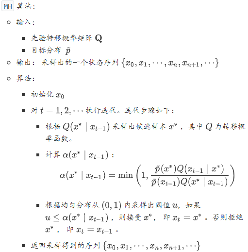
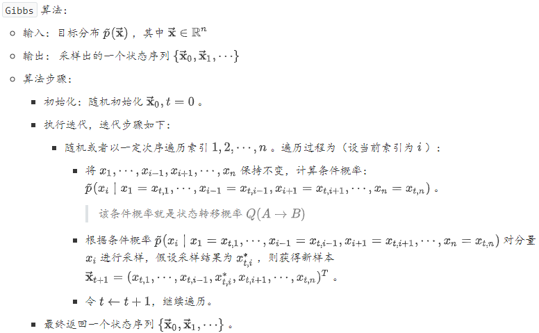

所有的向量都是列向量的形式：$\vec{\mathbf{x}}=\left(x_{1}, x_{2}, \cdots, x_{n}\right)^{T}$。$F$范数：$\|\mathbf{A}\|_{F}=\sqrt{\sum_{i, j} a_{i, j}^{2}}$，有性质：$\|\mathbf{A}\|_{F}=\sqrt{\operatorname{tr}\left(\mathbf{A} \mathbf{A}^{T}\right)}$。

两个向量的并矢：给定两个向量$\vec{\mathbf{x}}=\left(x_{1}, x_{2}, \cdots, x_{n}\right)^{T},\vec{\mathbf{t}}=\left(y_{1}, y_{2}, \cdots, y_{n}\right)^{T}$，则向量的并矢：
$$
\vec{\mathbf{x}}\vec{\mathbf{y}}^T=\vec{\mathbf{x}} \otimes \vec{\mathbf{y}}
$$
给定两个矩阵$\mathbf{A}=(a_{i,j})\in \mathbb{R}^{m\times n},\mathbf{B}=(b_{i,j})\in \mathbb{R}^{m\times n}$，定义：阿达马积：$\text{Hadamard product}$逐元素积
$$
\mathbf{A} \circ \mathbf{B}=\left[ \begin{array}{cccc}{a_{1,1} b_{1,1}} & {a_{1,2} b_{1,2}} & {\dots} & {a_{1, n} b_{1, n}} \\ {a_{2,1} b_{2,1}} & {a_{2,2} b_{2,2}} & {\dots} & {a_{2, n} b_{2, n}} \\ {\vdots} & {\vdots} & {\ddots} & {\vdots} \\ {a_{m, 1} b_{m, 1}} & {a_{m, 2} b_{m, 2}} & {\dots} & {a_{m, n} b_{m, n}}\end{array}\right]
$$
克罗内积：$\text{Kronnecker product}$
$$
\mathbf{A} \otimes \mathbf{B}=\left[ \begin{array}{cccc}{a_{1,1} \mathbf{B}} & {a_{1,2} \mathbf{B}} & {\dots} & {a_{1, n} \mathbf{B}} \\ {a_{2,1}\mathbf{B}} & {a_{2,2}\mathbf{B}} & {\dots} & {a_{2, n} \mathbf{B}} \\ {\vdots} & {\vdots} & {\ddots} & {\vdots} \\ {a_{m, 1} \mathbf{B}} & {a_{m, 2} \mathbf{B}} & {\dots} & {a_{m, n}\mathbf{B}}\end{array}\right]
$$
$\vec{\mathbf{x}}, \vec{\mathbf{a}}, \vec{\mathbf{b}}, \vec{\mathbf{c}}$为$n$阶向量，$\mathbf{A}, \mathbf{B}, \mathbf{C}, \mathbf{X}$为$n$阶方阵，则有：
$$
\begin{array}{1}
\frac{\partial\left(\vec{\mathbf{a}}^{T} \vec{\mathbf{x}}\right)}{\partial \vec{\mathbf{x}}}=\frac{\partial\left(\vec{\mathbf{x}}^{T} \vec{\mathbf{a}}\right)}{\partial \vec{\mathbf{x}}}=\vec{\mathbf{a}}\\
\frac{\partial\left(\vec{\mathbf{a}}^{T} \mathbf{X} \vec{\mathbf{b}}\right)}{\partial \mathbf{X}}=\vec{\mathbf{a}} \vec{\mathbf{b}}^{T}=\vec{\mathbf{a}} \otimes \vec{\mathbf{b}} \in \mathbb{R}^{n \times n}\\
\frac{\partial\left(\vec{\mathbf{a}}^{T} \mathbf{X}^{T} \vec{\mathbf{b}}\right)}{\partial \mathbf{X}}=\vec{\mathbf{b}} \vec{\mathbf{a}}^{T}=\vec{\mathbf{b}} \otimes \vec{\mathbf{a}} \in \mathbb{R}^{n \times n}\\
\frac{\partial\left(\vec{\mathbf{a}}^{T} \mathbf{X} \vec{\mathbf{a}}\right)}{\partial \mathbf{X}}=\frac{\partial\left(\vec{\mathbf{a}}^{T} \mathbf{X}^{T} \vec{\mathbf{a}}\right)}{\partial \mathbf{X}}=\vec{\mathbf{a}} \otimes \vec{\mathbf{a}}\\
\frac{\partial\left(\vec{\mathbf{a}}^{T} \mathbf{X}^{T} \mathbf{X} \vec{\mathbf{b}}\right)}{\partial \mathbf{X}}=\mathbf{X}(\vec{\mathbf{a}} \otimes \vec{\mathbf{b}}+\vec{\mathbf{b}} \otimes \vec{\mathbf{a}})\\
\frac{\partial\left[(\mathbf{A} \vec{\mathbf{x}}+\vec{\mathbf{a}})^{T} \mathbf{C}(\mathbf{B} \vec{\mathbf{x}}+\vec{\mathbf{b}})\right]}{\partial \vec{\mathbf{x}}}=\mathbf{A}^{T} \mathbf{C}(\mathbf{B} \vec{\mathbf{x}}+\vec{\mathbf{b}})+\mathbf{B}^{T} \mathbf{C}(\mathbf{A} \vec{\mathbf{x}}+\vec{\mathbf{a}})\\
\frac{\partial\left(\vec{\mathbf{x}}^{T} \mathbf{A} \vec{\mathbf{x}}\right)}{\partial \vec{\mathbf{x}}}=\left(\mathbf{A}+\mathbf{A}^{T}\right) \vec{\mathbf{x}}\\
\frac{\partial\left[(\mathbf{X} \vec{\mathbf{b}}+\vec{\mathbf{c}})^{T} \mathbf{A}(\mathbf{X} \vec{\mathbf{b}}+\vec{\mathbf{c}})\right]}{\partial \mathbf{X}}=\left(\mathbf{A}+\mathbf{A}^{T}\right)(\mathbf{X} \vec{\mathbf{b}}+\vec{\mathbf{c}}) \vec{\mathbf{b}}^{T}\\
\frac{\partial\left(\vec{\mathbf{b}}^{T} \mathbf{X}^{T} \mathbf{A} \mathbf{X} \vec{\mathbf{c}}\right)}{\partial \mathbf{X}}=\mathbf{A}^{T} \mathbf{X} \vec{\mathbf{b}} \vec{\mathbf{c}}^{T}+\mathbf{A} \mathbf{X} \vec{\mathbf{c}} \vec{\mathbf{b}}^{T}
\end{array}
$$
如果$f$是一元函数，则：其逐元向量函数为：$f(\vec{\mathbf{x}})=\left(f\left(x_{1}\right), f\left(x_{2}\right), \cdots, f\left(x_{n}\right)\right)^{T}$，其逐矩阵函数为：
$$
f(\mathbf{X})=\left[ \begin{array}{cccc}{f\left(x_{1,1}\right)} & {f\left(x_{1,2}\right)} & {\cdots} & {f\left(x_{1, n}\right)} \\ {f\left(x_{2,1}\right)} & {f\left(x_{2,2}\right)} & {\cdots} & {f\left(x_{2, n}\right)} \\ {\vdots} & {\vdots} & {\ddots} & {\vdots} \\ {f\left(x_{m, 1}\right)} & {f\left(x_{m, 2}\right)} & {\cdots} & {f\left(x_{m, n}\right)}\end{array}\right]
$$
其逐元导数分别为：
$$
\begin{array}{1}
f^{\prime}(\overrightarrow{\mathbf{x}})=\left(f^{\prime}(x 1), f^{\prime}(x 2), \cdots, f^{\prime}\left(x_{n}\right)\right)^{T}\\
f^{\prime}(\mathbf{X})=\left[ \begin{array}{cccc}{f^{\prime}\left(x_{1,1}\right)} & {f^{\prime}\left(x_{1,2}\right)} & {\cdots} & {f^{\prime}\left(x_{1, n}\right)} \\ {f^{\prime}\left(x_{2,1}\right)} & {f^{\prime}\left(x_{2,2}\right)} & {\cdots} & {f^{\prime}\left(x_{2, n}\right)} \\ {\vdots} & {\vdots} & {\ddots} & {\vdots} \\ {f^{\prime}\left(x_{m, 1}\right)} & {f^{\prime}\left(x_{m, 2}\right)} & {\cdots} & {f^{\prime}\left(x_{m, n}\right)}\end{array}\right]
\end{array}
$$
标量对向量的偏导数：
$$
\frac{\partial u}{\partial \vec{\mathbf{v}}}=\left(\frac{\partial u}{\partial v_{1}}, \frac{\partial u}{\partial v_{2}}, \cdots, \frac{\partial u}{\partial v_{n}}\right)^{T}
$$
标量对矩阵的偏导数：
$$
\frac{\partial u}{\partial \mathbf{V}}=\left[ \begin{array}{cccc}{\frac{\partial u}{\partial V_{1,1}}} & {\frac{\partial u}{\partial V_{1,2}}} & {\cdots} & {\frac{\partial u}{\partial V_{1, n}}} \\ {\frac{\partial u}{\partial V_{2,1}}} & {\frac{\partial u}{\partial V_{2,2}}} & {\cdots} & {\frac{\partial u}{\partial V_{2,1}}} \\ {\vdots} & {\vdots} & {\ddots} & {\vdots} \\ {\frac{\partial u}{\partial V_{m, 1}}} & {\frac{\partial u}{\partial V_{m, 2}}} & {\cdots} & {\frac{\partial u}{\partial V_{m, n}}}\end{array}\right]
$$
向量对标量的偏导数
$$
\frac{\partial \vec{\mathbf{u}}}{\partial v}=\left(\frac{\partial u_1}{\partial v}, \frac{\partial u_2}{\partial v}, \cdots, \frac{\partial u_m}{\partial v}\right)^{T}
$$
向量对向量的偏导数
$$
\frac{\partial \vec{\mathbf{u}}}{\partial \vec{\mathbf{v}}}=\left[ \begin{array}{cccc}{\frac{\partial u_1}{\partial v_1}} & {\frac{\partial u_1}{\partial v_2}} & {\cdots} & {\frac{\partial u_1}{\partial v_n}} \\ {\frac{\partial u_2}{\partial v_1}} & {\frac{\partial u_2}{\partial v_2}} & {\cdots} & {\frac{\partial u_2}{\partial v_n}} \\ {\vdots} & {\vdots} & {\ddots} & {\vdots} \\ {\frac{\partial u_m}{\partial v_1}} & {\frac{\partial u_m}{\partial v_2}} & {\cdots} & {\frac{\partial u_m}{\partial v_n}}\end{array}\right]
$$
矩阵对标量的偏导数
$$
\frac{\part \mathbf{U}}{\part v}= \left[ \begin{array}{cccc}{\frac{\partial U_{1,1}}{\partial v}} & {\frac{\partial U_{1,2}}{\partial v}} & {\cdots} & {\frac{\partial U_{1,n}}{\partial v}} \\ {\frac{\partial U{2,1}}{\partial v}} & {\frac{\partial U_{2,2}}{\partial v}} & {\cdots} & {\frac{\partial U_{2,n}}{\partial v}} \\ {\vdots} & {\vdots} & {\ddots} & {\vdots} \\ {\frac{\partial U_{m,1}}{\partial v}} & {\frac{\partial U_{m,2}}{\partial v}} & {\cdots} & {\frac{\partial U_{m,n}}{\partial v}}\end{array}\right]
$$
对于矩阵的迹，有下列偏导数成立：
$$
\begin{array}{1}
\frac{\partial[t r(f(\mathbf{X}))]}{\partial \mathbf{X}}=\left(f^{\prime}(\mathbf{X})\right)^{T}\\
\frac{\partial[t r(\mathbf{A} \mathbf{X} \mathbf{B})]}{\partial \mathbf{X}}=\mathbf{A}^{T} \mathbf{B}^{T}\\
\frac{\partial\left[t r\left(\mathbf{A} \mathbf{X}^{T} \mathbf{B}\right)\right]}{\partial \mathbf{X}}=\mathbf{B} \mathbf{A}\\
\frac{\partial[\operatorname{tr}(\mathbf{A} \otimes \mathbf{X})]}{\partial \mathbf{X}}=\operatorname{tr}(\mathbf{A}) \mathbf{I}\\
\frac{\partial[\operatorname{tr}(\mathbf{A} \mathbf{X} \mathbf{B} \mathbf{X})]}{\partial \mathbf{X}}=\mathbf{A}^{T} \mathbf{X}^{T} \mathbf{B}^{T}+\mathbf{B}^{T} \mathbf{X} \mathbf{A}^{T}\\
\frac{\partial\left[t r\left(\mathbf{X}^{T} \mathbf{B} \mathbf{X} \mathbf{C}\right)\right]}{\partial \mathbf{X}}=\mathbf{B X C}+\mathbf{B}^{T} \mathbf{X} \mathbf{C}^{T}\\
\frac{\partial\left[\operatorname{tr}\left(\mathbf{C}^{T} \mathbf{X}^{T} \mathbf{B} \mathbf{X} \mathbf{C}\right)\right]}{\partial \mathbf{X}}=\left(\mathbf{B}^{T}+\mathbf{B}\right) \mathbf{X} \mathbf{C} \mathbf{C}^{T}\\
\frac{\partial\left[t r\left(\mathbf{A} \mathbf{X} \mathbf{B} \mathbf{X}^{T} \mathbf{C}\right)\right]}{\partial \mathbf{X}}=\mathbf{A}^{T} \mathbf{C}^{T} \mathbf{X B}^{T}+\mathbf{C A X B}\\
\frac{\partial[\operatorname{tr}((\mathbf{A} \mathbf{X} \mathbf{B}+\mathbf{C})(\mathbf{A} \mathbf{X} \mathbf{B}+\mathbf{C}))]}{\partial \mathbf{X}}=2 \mathbf{A}^{T}(\mathbf{A} \mathbf{X} \mathbf{B}+\mathbf{C}) \mathbf{B}^{T}
\end{array}
$$

假设$\mathbf{U}=f(\mathbf{X})$是关于$\mathbf{X}$的矩阵值函数$(f : \mathbb{R}^{m \times n} \rightarrow \mathbb{R}^{m \times n})$，且$g(\mathbf{U})$是关于$\mathbf{U}$的实值函数$(g : \mathbb{R}^{m \times n} \rightarrow \mathbb{R})$，则下面链式法则成立：
$$
\begin{array}{l}\frac{\partial g(\mathbf{U})}{\partial \mathbf{X}}=\left(\frac{\partial g(\mathbf{U})}{\partial x_{i, j}}\right)_{m \times n}\\
=\left(\sum_{k} \sum_{l} \frac{\partial g(\mathbf{U})}{\partial u_{k, l}} \frac{\partial u_{k, l}}{\partial x_{i, j}}\right)_{m \times n}=\left(t r\left[\left(\frac{\partial g(\mathbf{U})}{\partial \mathbf{U}}\right)^{T} \frac{\partial \mathbf{U}}{\partial x_{i, j}}\right]\right)_{m \times n}
\end{array}
$$

##### 特殊函数

###### $\text{sigmoid}$函数

$$
\sigma(x)=\frac{1}{1+\exp(-x)}\\
\frac{d}{d x}\sigma(x)=\sigma(x)(1-\sigma(x))\\
1-\sigma(x)=\sigma(-x)
$$

###### $\text{softplus}$函数

$$
\zeta(x)=\log(1+\exp(x))\\
\frac{d}{dx}\zeta(x)=\sigma(x)
$$

#### 概率论

条件概率分布的链式法则：对于$n$个随机变量$X_1,\cdots,X_n$，有：
$$
P\left(X_{1}, X_{2}, \cdots, X_{n}\right)=P\left(X_{1}\right) \prod_{i=2}^{n} P\left(X_{i} | X_{1}, \cdots, X_{i-1}\right)
$$
两个随机变量$X,Y$关于随机变量$Z$条件独立的数学描述：
$$
P(X,Y|Z)=P(X|Z)P(Y|Z)
$$
对于随机变量$X$，设$Y=g(X)$也为随机变量，$g(\cdot)$是连续函数。若$X$为离散型随机变量，若$Y$的期望存在，则：$\mathbb{E}[Y]=\mathbb{E}[g(X)]=\sum_{i=1}^{\infin}g(x_i)p_i$。也记做：
$$
\mathbb{E}_{x\sim P(X)}[g(X)]=\sum_{x}g(x)p(x)
$$
若$X$为连续型随机变量，若$Y$的期望存在，则 ：$\mathbb{E}[Y]=\mathbb{E}[g(X)]=\int_{-\infin}^{\infin}g(x)p(x)dx$。也记做： 
$$
\mathbb{E}_{x\sim P(X)}[g(X)]=\int g(x)p(x)dx
$$
该定理的意义在于：当求$\mathbb{E}[Y]$时，不必计算出$Y$的分布，只需要利用$X$的分布即可。

该定理可以推广至两个或两个以上随机变量的情况。对于随机变量$X,Y$，假设$Z=g(X,Y)$也是随机变量，$g(\cdot)$为连续函数，则有：
$$
\mathbb{E}[Z]=\mathbb{E}[g(X,Y)]=\int_{-\infin}^{\infin}\int_{-\infin}^{\infin}g(x,y)p(x,y)dxdy
$$
切比雪夫不等式：假设随机变量$X$具有期望$\mu$， 方差$\sigma^2$，则对于任意正数$\epsilon$，下面的不等式成立：
$$
p\{|X-\mu|\ge\epsilon\}\le\frac{\sigma^2}{\epsilon^2}
$$
$n$维正态变量具有下列四条性质：

- $n$维正态变量的每一个分量都是正态变量；反之，若$X_1,\cdots,X_n$都是正态变量，且相互独立，则$(X_1,\cdots,X_n)$是$n$维正态变量。
- $n$维随机变量$(X_1,\cdots,X_n)$服从$n$维正态分布的充要条件是：$X_1,\cdots,X_n$的任意线性组合：$l_1X_1+\cdots+l_nX_n$服从一维正态分布，其中$l_1,\cdots,l_n$不全为 0 。
- 若$(X_1,\cdots,X_n)$服从$n$维正态分布，设$Y_1,\cdots,Y_k$是$X_j,j=1,\cdots,n$的线性函数，则$(Y_1,\cdots,Y_k)$也服从多维正态分布。
- 设$(X_1,\cdots,X_n)$服从$n$维正态分布，则$X_1,\cdots,X_n$相互独立充要条件$X_1,\cdots,X_n$两两不相关。

混合概率分布：它组合了其他几个分量的分布来组成。在每次生成样本中，首先通过`multinoulli`分布来决定选用哪个分量，然后由该分量的分布函数来生成样本。其概率分布函数为：
$$
p(x)=\sum_{i}P(c=i)p(x|c=i)
$$
其中$p(c=i)$为一个`multinoulli`分布，$c$的取值范围就是各分量的编号。

##### 信息论

信息论背后的原理是：从不太可能发生的事件中能学到更多的有用信息。发生可能性较大的事件包含较少的信息。发生可能性较小的事件包含较多的信息。独立事件包含额外的信息 。对于事件$X=x$，定义自信息`self-information`为：$I(x)=-\log P(x)$

信息熵的定义公式：
$$
H(X) = -\sum_{x\in\mathcal{X}}p(x)\log p(x)
$$
两个离散随机变量$\mathbf{X}$和$\mathbf{Y}$的互信息定义为：
$$
I(\mathbf{X},\mathbf{Y}) = \sum_{x\in\mathcal{X}}\sum_{y\in\mathcal{Y}}p(x,y)\log(\frac{p(x,y)}{p(x)p(y)})
$$
两个离散随机变量$\mathbf{X}$和$\mathbf{Y}$的联合熵为：
$$
H(\mathbf{X},\mathbf{Y})=\sum_{x\in\mathcal{X}}\sum_{y\in\mathcal{Y}}p(x,y)\log p(x,y)
$$
对于随机变量$Y$和$X$，条件熵$H(\mathbf{Y}|\mathbf{X})$表示在已知随机变量$\mathbf{X}$的条件下随机变量$\mathbf{Y}$的不确定性。
$$
H(Y | X)=\mathbb{E}_{X \sim P(X)}[H(Y | X=x)]=-\mathbb{E}_{(X, Y) \sim P(X, Y)} \log P(Y | X)\\
H(Y | X) = \sum_{x\in\mathcal{X}}p(x)H(Y|x)=-\sum_{x\in\mathcal{X}}p(x)\sum_{y\in\mathcal{Y}}p(y|x)\log p(y|x)
$$
据定义可以证明：$H(X,Y)=H(Y|X)+H(X)$

设$P(X)$和$Q(X)$离散随机变量$\mathbf{X}$的两个概率分布，其中$P(X)$为真实分布，$Q(X)$为非真实分布。交叉熵
$$
H(P, Q)=H(P)+D_{K L}(P \| Q)=-\mathbb{E}_{X \sim P(X)} \log Q(x)
\\H(P,Q) = -\sum_{x}P(x)\log Q(x)
$$
交叉熵刻画了使用错误分布$Q$来表示真实分布$P$中的样本的平均编码长度。

$P$对$Q$的相对熵或`KL`散度为
$$
D_{K L}(P \| Q)=\mathbb{E}_{X \sim P(X)}\left[\log \frac{P(x)}{Q(x)}\right]=\mathbb{E}_{X \sim P(X)}[\log P(x)-\log Q(x)]\\
D_{KL}(P||Q) = \sum_{x}P(x)\log\frac{P(x)}{Q(x)}
$$

`KL`散度非负：当它为 0 时，当且仅当 `P`和`Q`是同一个分布（对于离散型随机变量），或者两个分布几乎处处相等（对于连续型随机变量）。`KL`散度不对称：$D_{K L}(P \| Q)\ne D_{K L}(Q \| P)$。$D_{KL}(P||Q)$刻画了错误分布$$编Q码真实分布$P$带来的平均编码长度的增量。

#### 蒙特卡洛方法

蒙特卡洛方法`Monte Carlo` 可以通过采用随机投点法来求解不规则图形的面积。蒙特卡洛方法也可以用于根据概率分布来随机采样的任务。

###### 蒙特卡洛积分

期望法求积分：假设需要求解积分$I=\int_a^bf(x)dx$，则任意选择一个概率密度函数$p(x)$，其中$p(x)$满足条件：$\int_a^bp(x)dx=1$且当$f(x)\ne0$时，$p(x)\ne0$
$$
f^*(x)=\left\{ \begin{array}{ll}\frac{f(x)}{p(x)},& p(x)\ne0\\
0,&p(x)=0\end{array}\right.
$$
则有：$I=\int_a^bf(x)dx=\int_a^bf^*(x)p(x)dx$，设随机变量$X$服从分布$X\sim p(x)$，则$I=\mathbb{E}_{X\sim p}[f^*(X)]$。则期望法求积分的步骤是：

- 任选一个满足条件的概率分布$p(x)$。
- 根据$p(x)$，生成一组服从分布$p(x)$的随机数$x_1,\cdots,x_N$。
- 计算均值$\overline{I}=\frac{1}{N}\sum_{i=1}^Nf^*(x_i)$，并将$\overline{I}$作为$I$的近似。

###### 蒙特卡洛采样

采样问题的主要任务是：根据概率分布$p(x)$，生成一组服从分布$p(x)$的随机数$x_1, x_2, \cdots$。

- 如果$p(x)$就是均匀分布，则均匀分布的采样非常简单。

- 如果$p(x)$是非均匀分布，则可以通过均匀分布的采样来实现。其步骤是：首先根据均匀分布$U(0, 1)$随机生成一个样本$z_i$。设$\tilde{P}(x)$为概率分布$p(x)$的累计分布函数：$\tilde{P}(x)=\int_{-\infty}^{x} p(z) d z$。令$z_{i}=\tilde{P}\left(x_{i}\right)$，计算得到$x_{i}=\tilde{P}^{-1}\left(z_{i}\right)$，其中$\tilde{P}^{-1}$为反函数，则$x_i$为对$p(x)$的采样。

对于复杂的概率分布$p(x)$，难以通过均匀分布来实现采样。此时可以使用`接受-拒绝采样` 策略。

- 首先选定一个容易采样的概率分布$q(x)$，选择一个常数$k$，使得在定义域的所有位置都满足$p(x)\leq k\times q(x)$。
- 然后根据概率分布$q(x)$随机生成一个样本$x_i$。
- 计算$\alpha_{i}=\frac{p\left(x_{i}\right)}{k q\left(x_{i}\right)}$，以概率$\alpha_i$接受该样本。具体做法是：根据均匀分布$U(0, 1)$随机生成一个点$u_i$。如果$u_i \leq \alpha_i$，则接受该样本；否则拒绝该样本。

`接受-拒绝采样` 在高维的情况下会出现两个问题：合适的$q$分布比较难以找到。难以确定一个合理的$k$值。

##### 马尔可夫链

马尔可夫链是满足马尔可夫性质的随机过程。马尔可夫链$X_1, X_2, \cdots$描述了一个状态序列，其中每个状态值取决于前一个状态。$X_t$为随机变量，称为时刻$t$的状态，其取值范围称作状态空间。马尔可夫链的数学定义为： $P\left(X_{t+1} | X_{t}, X_{t-1}, \cdots, X_{1}\right)=P\left(X_{t+1} | X_{t}\right)$

###### 平稳分布

马尔可夫链定理：如果一个非周期马尔可夫链具有转移概率矩阵$\mathbf{P}$ ，且它的任何两个状态是联通的，则有
$$
\pi(j)=\sum_{i=0}^{\infty} \pi(i) P_{i, j}
$$
其中：$1,3,\cdots,j,\cdots$为所有可能的状态。$P_{i,j}$是转移概率矩阵$\mathbf{P}$的第$i$行第$j$列的元素，表示状态$i$转移到状态$j$的概率。概率分布$\vec{\pi}$是方程$\vec{\pi}\mathbf{P}=\vec{\pi}$的唯一解，其中
$$
\vec{\pi}=(\pi_1,\cdots,\pi_j,\cdots),\sum_{j=0}^{\infin}\pi_j=1
$$
称概率分布$\vec{\pi}$为马尔可夫链的平稳分布。

马尔可夫链的状态不要求有限，可以是无穷多个。非周期性在实际任务中都是满足的。两个状态的连通指的是：状态$i$可以通过有限的$j$步转移到达，并不要求从状态$i$可以直接一步转移到状态$j$。马尔可夫链的任何两个状态是联通的含义是：存在一个$n$，使得矩阵$\mathbf{P}^n$中的任何一个元素的数值都大于零。

如果从一个具体的初始状态$x_0$开始，然后沿着马尔可夫链按照概率转移矩阵做调整，则得到一个转移序列$x_0, x_1, \cdots, x_n, x_{n+1}, \cdots$。根据马尔可夫链的收敛行为，当$n$较大时，$x_n, x_{n+1}, \cdots$将是平稳分布$\vec{\pi}$的样本。

细致平稳性条件：如果非周期马尔可夫链的转移矩阵$\mathbf{P}$和某个分布$\vec{\pi}$满足: $\pi(i) P_{i, j}=\pi(j) P_{j, i}$则$\vec{\pi}$是马尔可夫链的平稳分布。
$$
\pi(i) P_{i, j}=\pi(j) P_{j, i} \rightarrow \sum_{i=1}^{\infty} \pi(i) P_{i, j}=\sum_{i=1}^{\infty} \pi(j) P_{j, i}=\pi(j) \sum_{i=1}^{\infty} P_{j, i}=\pi(j) \rightarrow \vec{\pi} \mathbf{P}=\vec{\pi}
$$

##### $\text{MCMC}$采样

`MCMC` 算法的基本思想是：先设法构造一条马尔可夫链，使其收敛到平稳分布恰好为$\vec{\mathbf{p}}$。然后通过这条马尔可夫链来产生符合$\vec{\mathbf{p}}$分布的样本。最后通过这些样本来进行估计。

假设已经提供了一条马尔可夫链，其转移矩阵为$\mathbf{Q}$。目标是另一个马尔科夫链，使转移矩阵为$\mathbf{P}$、平稳分布是$\tilde{p}$。通常$\tilde{p}(i) Q_{i, j} \neq \tilde{p}(j) Q_{j, i}$，即$\tilde{p}$并不满足细致平稳条件不成立。

可以改造已有的马尔可夫链，使得细致平稳条件成立。引入一个函数$\alpha(i, j)$，使其满足：$\tilde{p}(i) Q_{i, j} \alpha(i, j)=\tilde{p}(j) Q_{j, i} \alpha(j, i)$。若$\alpha(i, j)=\tilde{p}(j) Q_{j, i}$，则有：
$$
\tilde{p}(i) Q_{i, j} \alpha(i, j)=\tilde{p}(i) Q_{i, j} \tilde{p}(j) Q_{j, i}=\tilde{p}(j) Q_{j, i} \tilde{p}(i) Q_{i, j}=\tilde{p}(j) Q_{j, i} \alpha(j, i)
$$
令：$Q_{i, j}^{\prime}=Q_{i, j} \alpha(i, j), Q_{j, i}^{\prime}=Q_{j, i} \alpha(j, i)$，则有$\tilde{p}(i) Q_{i, j}^{\prime}=\tilde{p}(j) Q_{j, i}^{\prime}$。其中$Q_{i, j}^{\prime}$构成了转移矩阵$\mathbf{Q}^{\prime}$。而$Q^{\prime}$恰好满足细致平稳条件，因此它对应的马尔可夫链的平稳分布就是$\tilde{p}$。

在改造$\mathbf{Q}$的过程中引入的$\alpha(i, j)$称作接受率。其物理意义为：在原来的马尔可夫链上，从状态$i$以$Q_{i, j}$的概率跳转到状态$j$的时候，以$\alpha(i, j)$的概率接受这个转移。

- 如果接受率$\alpha(i, j)$太小，则改造马尔可夫链过程中非常容易原地踏步，拒绝大量的跳转。这样使得马尔可夫链遍历所有的状态空间需要花费太长的时间，收敛到平稳分布$\tilde{p}$的速度太慢。

- 根据推导$\alpha(i, j)=\tilde{p}(j) Q_{j, i}$，如果将系数从$1$提高到$K$，则有：

$$
\begin{aligned} \alpha^{*}(i, j) &=K \tilde{p}(j) Q_{j, i}=K \alpha(i, j) \\ \alpha^{*}(j, i) &=K \tilde{p}(i) Q_{i, j}=K \alpha(j, i) \end{aligned}
$$

将$\alpha(i, j), \alpha(j, i)$同比例放大，取：$\alpha(i, j)=\min \left\{\frac{\tilde{p}(j) Q_{j, i}}{\tilde{p}(i) Q_{i, j}}, 1\right\}$。当$\tilde{p}(j) Q_{j, i}=\tilde{p}(i) Q_{i, j}$时：$\alpha(i, j)=\alpha(j, i)=1$，此时满足细致平稳条件。当$\tilde{p}(j) Q_{j, i}>\tilde{p}(i) Q_{i, j}$时：$\alpha(i, j)=1, \alpha(j, i)=\frac{\tilde{p}(i) Q_{i, j}}{\tilde{p}(j) Q_{j, i}}$，此时满足细致平稳条件。当$\tilde{p}(j) Q_{j, i}<\tilde{p}(i) Q_{i, j}$时：$\alpha(i, j)=\frac{\tilde{p}(j) Q_{j, i}}{\tilde{p}(i) Q_{i, i}}, \alpha(j, i)=1$，此时满足细致平稳条件。

###### Gibbs算法

考虑二维的情形：假设有概率分布$\tilde{p}(x, y)$，考察状态空间上$x$坐标相同的两个点$A\left(x_{1}, y_{1}\right), B\left(x_{1}, y_{2}\right)$，可以证明有：
$$
\begin{array}{l}{\tilde{p}\left(x_{1}, y_{1}\right) \tilde{p}\left(y_{2} | x_{1}\right)=\tilde{p}\left(x_{1}\right) \tilde{p}\left(y_{1} | x_{1}\right) \tilde{p}\left(y_{2} | x_{1}\right)} \\ {\tilde{p}\left(x_{1}, y_{2}\right) \tilde{p}\left(y_{1} | x_{1}\right)=\tilde{p}\left(x_{1}\right) \tilde{p}\left(y_{2} | x_{1}\right) \tilde{p}\left(y_{1} | x_{1}\right)}\end{array}
$$
于是$\tilde{p}\left(x_{1}, y_{1}\right) \tilde{p}\left(y_{2} | x_{1}\right)=\tilde{p}\left(x_{1}, y_{2}\right) \tilde{p}\left(y_{1} | x_{1}\right)$。则在$x = x_1$这条平行于$y$轴的直线上，如果使用条件分布$\tilde{p}(y|x_1)$作为直线上任意两点之间的转移概率，则这两点之间的转移满足细致平稳条件。

可以构造状态空间上任意两点之间的转移概率矩阵$\mathbf{Q}$： 对于任意两点$A=\left(x_{A}, y_{A}\right), B=\left(x_{B}, y_{B}\right)$， 令从$A$转移到$B$的概率为$Q(A \rightarrow B)$：如果$x_{A}=x_{B}=x^{*}$，则$Q(A \rightarrow B)=\tilde{p}\left(y_{B} | x^{*}\right)$。如果$y_{A}=y_{B}=y^{*}$，则$Q(A \rightarrow B)=\tilde{p}\left(x_{B} | y^{*}\right)$。否则$Q(A \rightarrow B)=0$。采用该转移矩阵$\mathbf{Q}$，可以证明：对于状态空间中任意两点$A, B$，都满足细致平稳条件：$\tilde{p}(A) Q(A \rightarrow B)=\tilde{p}(B) Q(B \rightarrow A)$，于是这个二维状态空间上的马尔可夫链将收敛到平稳分布$\tilde{p}(x, y)$，这就是吉布斯采样的原理。

