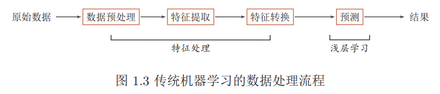
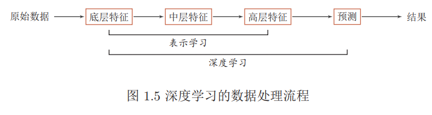
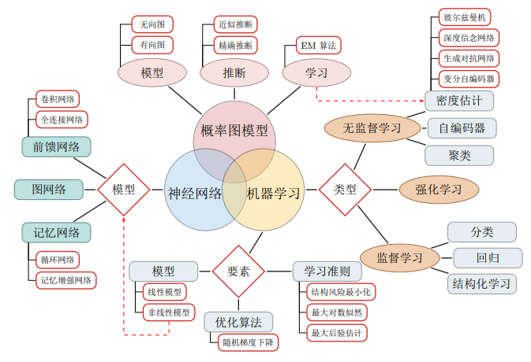
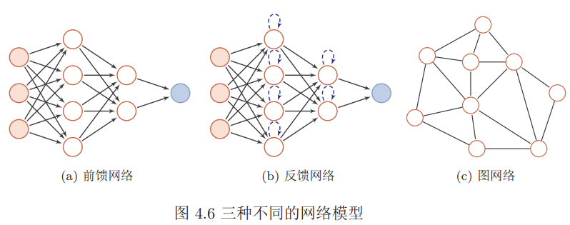
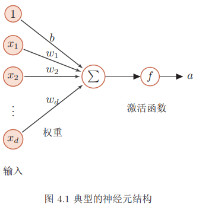

###### 机器学习

机器学习是指从有限的观测数据中学习出具有一般性的规律，并将这些规律应用到未观测样本上的方法。传统的机器学习主要关注于如何学习一个预测模型。一般需要首先将数据表示为一组特征，然后将这些特征输入到预测模型，并输出预测结果。这类机器学习可以看作是浅层学习。浅层学习的一个重要特点是不涉及特征学习，其特征主要靠人工经验或特征转换方法来抽取。

上述流程中，每步特征处理以及预测一般都是分开进行处理的。传统的机器学习模型主要关注于最后一步，即构建预测函数。但是实际操作过程中，不同预测模型的性能相差不多，而前三步中的特征处理对最终系统的准确性有着十分关键的作用。

在机器学习中，很多学习算法经常会对学习的问题做一些假设，这些假设就称为归纳偏置。归纳偏置在贝叶斯学习中也经常称为先验

###### 表示学习

**表示学习**如果直接用数据的原始特征来进行预测，对机器学习模型的能力要求比较高。这些原始特征可能存在以下几种不足：特征比较单一，需要进行非线性的组合才能发挥其作用；特征之间冗余度比较高；并不是所有的特征都对预测有用；很多特征通常是易变的；特征中往往存在一些噪声。

如果有一种算法可以自动地学习出有效的特征，并提高最终机器学习模型的性能，那么这种学习就是可以叫做**表示学习**。表示学习的关键是解决语义鸿沟问题。语义鸿沟问题是指输入数据的底层特征和高层语义信息之间的不一致性和差异性。表示学习中两个核心问题：什么是好的表示？如何学到好的表示？一个好的表示应该具有很强的表示能力，即同样大小的向量可以表示更多信息。 一个好的表示应该使后续的学习任务变得简单，即需要包含更高层的语义信息。一个好的表示应该具有一般性，是任务或领域独立的。虽然目前的大部分表示学习方法还是基于某个任务来学习，但我们期望其学到的表示可以比较容易的迁移到其它任务上。

传统机器学习中，通常使用局部表示和分布式表示，以颜色表示为例。一种表示颜色的方式是以不同名字来命名不同的颜色，这种表示方式叫做局部表示，也称为离散表示或符号表示。**局部表示**通常可以表示为one-hot向量。局部表示有两个不足之处：`one-hot`向量的维数很高，且不能扩展。不能计算不同颜色之间的相似度。另一种表示颜色的方式是用$\text{RGB}$值来表示颜色，不同颜色对应到R、G、B三维空间中一个点，这种表示方式叫做**分布式表示**。

###### 深度学习

深度学习是将原始的数据特征通过多步的特征转换得到一种特征表示，并进一步输入到预测函数得到最终结果。和“浅层学习”不同，深度学习需要解决的关键问题是贡献度分配问题Credit Assignment Problem即一个系统中不同的组件或其参数对最终系统输出结果的贡献或影响。

神经网络和深度学习并不等价。深度学习可以采用神经网络模型，也可以采用其它模型。但是由于神经网络模型可以比较容易地解决贡献度分配问题，因此神经网络模型成为深度学习中主要采用的模型。

传统机器学习方法需要将一个任务的输入和输出之间人为地切割成很多子模块或多个阶段，每个子模块分开学习。这种学习方式有两个问题：一是每一个模块都需要单独优化，并且其优化目标和任务总体目标并不能保证一致。二是错误传播，即前一步的错误会对后续的模型造成很大的影响。**端到端学习**，也称端到端训练，是指在学习过程中不进行分模块或分阶段进行训练，直接优化任务的总体目标。

#### 本文架构

#### 网络结构

前馈网络中各个神经元按接受信息的先后分为不同的组。每一组可以看作一个神经层。每一层中的神经元接受前一层神经元的输出，并输出到下一层神经元。整个网络中的信息是朝一个方向传播，没有反向的信息传播，可以用一个有向无环路图表示。

反馈网络中神经元不但可以接收其它神经元的信号，也可以接收自己的反馈信号。和前馈网络相比，反馈网络中的神经元具有记忆功能，在不同的时刻具有不同的状态。反馈神经网络中的信息传播可以是单向或双向传递，因此可用一个有向循环图或无向图来表示。

图网络是定义在图结构数据上的神经网络 。图中每个节点都一个或一组神经元构成。节点之间的连接可以是有向的，也可以是无向的。每个节点可以收到来自相邻节点或自身的信息。

#### 前馈神经网络

假设一个**神经元**接受$d$个输入$x_1, x_2, · · · , x_d$，令向量$x = [x_1; x_2; · · · ; x_d]$来表示这组输入，并用净输入$z ∈ R$表示一个神经元所获得的输入 净输入也叫净活性值。 信号$x$$的加权和，
$$
\begin{aligned} z &=\sum_{i=1}^{d} w_{i} x_{i}+b \\ &=\mathbf{w}^{\mathrm{T}} \mathbf{x}+b \end{aligned}
$$
其中$w = [w_1; w_2; · · · ; w_d] ∈ R^d$是d维的权重向量，$b ∈ R$是偏置。净输入$z$在经过一个非线性函数$f(·)$后，得到神经元的活性值$a=f(z)$

通常神经网络的代价函数与传统模型的代价函数相同。大多数现代的神经网络采用最大似然准则，令代价函数为负的对数似然函数。因此损失函数为：$J(\vec{\theta})=-\mathbb{E}_{\vec{\mathbf{x}}, y \sim \hat{p}_{\text {data}}} \log p_{\text {model}}(y | \vec{\mathbf{x}} ; \vec{\theta})$。$\hat{p}_{data}$为样本的经验分布：
$$
\hat{p}_{d a t a}\left(\vec{\mathbf{x}}_{i}, y_{i}\right)=\left\{\begin{array}{ll}{\frac{1}{N} \delta\left(\vec{\mathbf{x}}-\vec{\mathbf{x}}_{i}, y-y_{i}\right),} & {\left(\vec{\mathbf{x}}_{i}, y_{i}\right) \in \mathbb{D}} \\ {0,} & {\text { else }}\end{array}\right.
$$
$\delta(\cdot)$为狄拉克函数，它仅在原点处非0，在其它所有位置都为 0 ，其在整个定义域上的积分为 1 。$N$为数据集$\mathbb{D}$的大小。$p_{model}$为对数据建立的模型，$\vec{\theta}$为模型参数。代价函数的具体形式取决于$p_{model}$的形式，随不同的模型而改变。其实就是样本的经验分布$\hat{p}_{data}$与模型$p_{model}$的交叉熵 。

使用最大似然准则来导出代价函数的优势是：减轻了为每个模型设计代价函数的负担。一旦明确了一个模型$p_{\text {model}}(y | \vec{\mathbf{x}})$，则自动地确定了一个代价函数$-\log p_{\operatorname{model}}(y | \vec{\mathbf{x}})$。

##### 输出单元

###### 线性输出单元

最简单的输出单元为线性单元：它基于仿射变换，不包含非线性。

- 给定特征$\vec{\mathbf{h}}$，单个线性输出单元的输出为：$\hat{y}=\vec{\mathbf{w}}^T\vec{\mathbf{h}}+b$。
- 若输出层包含多个线性输出单元，则线性输出层的输出为：$\hat{y}=\mathbf{W}^T\vec{\mathbf{h}}+\vec{\mathbf{b}}$

线性输出层经常用于学习条件高斯分布的均值：$p(y|\vec{\mathbf{x}})=\mathcal{N}(y;\hat{y},\mathbf{I})$。给定$\vec{\mathbf{x}}$的条件下，$\tilde{y}$的分布为均值为$\hat{y}$、方差为 `1` 的高斯分布。此时最大化对数似然函数等价于最小化均方误差。

###### `sigmoid`输出单元

`sigmoid`单元：用于`Bernoulli`分布的输出。伯努利分布只需要一个参数来定义，因此神经网络只需要预测$p(y=1|\vec{\mathbf{x}})$，它必须位于区间 `[0,1]`之间。一种方案是采用线性单元，但是通过阈值来使它位于 `[0,1]`之间：
$$
p(y=1|\vec{\mathbf{x}})=\max\{0,\min\{1,\vec{\mathbf{w}}^T\vec{\mathbf{h}}+b\}\}
$$
另一种方案就是采用 `sigmoid`单元：$p(y=1|\vec{\mathbf{x}})=\sigma(\vec{\mathbf{w}}^T\vec{\mathbf{h}}+b)$。`sigmoid`单元的代价函数通常采用负的对数似然函数。当使用其他代价函数时，代价函数会在任何$\sigma(z)$饱和时饱和，此时梯度会变得非常小从而无法学习。`sigmoid`单元的代价函数通常采用负的对数似然函数

###### `softmax`输出单元

`softmax`单元用于`multinoulli`分布的输出。当表示一个具有 个可能取值的离散型随机变量分布时，可以采用`softmax`函数。它可以视作`sigmoid`函数的扩展：
$$
\begin{array}{c}\vec{\mathbf{z}}=\mathbf{W}^T\vec{\mathbf{h}}+\vec{\mathbf{b}}\\
\hat{y}_i=P(y=i|\vec{\mathbf{x}})=\text{softmax}(\vec{\mathbf{z}})_i=\frac{\exp(z_i)}{\sum_j\exp(z_j)}\end{array}
$$
当所有输入都加上一个相同常数时，`softmax`的输出不变。根据该性质，可以导出一个数值稳定的`softmax`函数的变体：$\text{softmax}(\vec{\mathbf{z}})=\text{softmax}(\vec{\mathbf{z}}-\max_iz_i)$

假设真实类别为 ，则`softmax` 输出的对数似然函数为：
$$
\log\text{softmax}(\vec{\mathbf{z}})_k=z_k-\log\sum_j\exp(z_j)
$$
其中：第一项$z_k$不会饱和（它的梯度不会为零），第二项近似为$\max_jz_j$​

##### 隐单元

大多数隐单元的工作都可以描述为下面三步：接受输入向量$\vec{\mathbf{x}}$。计算仿射变换$z=\vec{\mathbf{w}}^T\vec{\mathbf{x}}+b$。用非线性函数$g(z)$计算隐单元输出。函数$g(\cdot)$也称作激活函数，大多数隐单元的区别仅仅在于激活函数$g(\cdot)$的形式不同。神经网络的隐层由多个隐单元组成，隐层的输出为：$g(\mathbf{W}^T\vec{\mathbf{x}}+\vec{\mathbf{b}})$​

###### 修正线性单元

修正线性单元采用激活函数$g(z)=\max\{0,z\}$，它和线性单元非常类似，区别在于：修正线性单元在左侧的定义域上输出为零。

- 优点：采用基于梯度的优化算法时，非常易于优化。
- 缺点：无法通过基于梯度的方法学习那些使得修正线性单元处于非激活状态的参数，因为此时梯度为零。

对于修正线性单元$g(\mathbf{W}^T\vec{\mathbf{x}}+\vec{\mathbf{b}})$，初始化时可以将$\vec{\mathbf{b}}$的所有元素设置成一个小的正值，从而使得修正线性单元在初始时尽可能的对训练集中大多数输入呈现激活状态。

修正线性单元的三个扩展：当$z<0$时，使用一个非零的斜率 ：$h=g(z,\alpha)=\max(0,z)+\alpha\min(0,z)$。

- 绝对值修正： 使用$\alpha=-1$，此时$g(z)=|z|$。
- 渗透修正线性单元`leaky ReLU`：将$\alpha$固定成一个类似 0.01 的小值。
- 参数化修正线性单元`parametric ReLU`：将$\alpha$作为学习的参数。此时$\alpha$是与训练集相关的。不同的训练集，学得的$\alpha$​会不同。

###### `maxout`单元

`maxout`单元是修正线性单元的进一步扩展。`maxout`单元并不是作用于$\vec{\mathbf{z}}$​的每个元素 ，而是将$\vec{\mathbf{z}}$​​分成若干个小组，每个组有$k$个元素：
$$
\mathbb{G}_1=\{z_1,z_2,\cdots,z_k\}\\
\mathbb{G}_2=\{z_{k+1},z_{k+2},\cdots,z_{2k}\}\\
\cdots\\
\mathbb{G}_i=\{z_{(i-1)k+1},z_{(i-1)k+2},\cdots,z_{ik}\}
$$
然后`maxout`单元对每个组输出其中最大值的元素：$g(\vec{\mathbf{z}})_i=\max_{z_j\in\mathbb{G}_i}z_j$​。`maxout` 单元的$\vec{\mathbf{z}}$​通常是通过对输入$\vec{\mathbf{x}}$​执行多个仿射变换而来。设$\vec{\mathbf{x}}=(x_1,\cdots,x_n)^T\in\mathbb{R}^n$，`maxout` 单元有$k$个分组，输出为$y_1,\cdots,y_n$：
$$
y_1=\max(\vec{\mathbf{w}}_{1,1}^T\cdot\vec{\mathbf{x}}+b_{1,1},\cdots,\vec{\mathbf{w}}_{1,k}\cdot\vec{\mathbf{x}}+b_{1,k})\\
\cdots\\
y_n=\max(\vec{\mathbf{w}}_{n,1}^T\cdot\vec{\mathbf{x}}+b_{n,1},\cdots,\vec{\mathbf{w}}_{n,k}^T\vec{\mathbf{x}}+b_{n,k})
$$

$$
\mathbf{W}_1=\left[\begin{array}{cccc}\vec{\mathbf{w}}_{1,1}^T\\
\vec{\mathbf{w}}_{2,1}^T\\
\cdots\\
\vec{\mathbf{w}}_{n,1}^T
\end{array}\right] \quad\cdots\quad
\mathbf{W}_k=\left[\begin{array}{cccc}\vec{\mathbf{w}}_{1,k}^T\\
\vec{\mathbf{w}}_{2,k}^T\\
\cdots\\
\vec{\mathbf{w}}_{n,k}^T
\end{array}\right]\quad 
\vec{\mathbf{b}}_1=\left[\begin{array}{cccc}b_{1,1}\\
b_{2,1}\\
\cdots\\
b_{n,1}
\end{array}\right]\quad\cdots\quad
\vec{\mathbf{b}}_k=\left[\begin{array}{cccc}b_{1,k}\\
b_{2,k}\\
\cdots\\
b_{n,k}
\end{array}\right]
$$

则有：$\vec{\mathbf{y}}=\max(\mathbf{W}_1\vec{\mathbf{x}}+\vec{\mathbf{b}}_1,\cdots,\mathbf{W}_k\vec{\mathbf{x}}+\vec{\mathbf{b}}_k)$。

`maxout` 单元的优点：接近线性，模型易于优化。经过`maxout`层之后，输出维数降低到输入的$\frac{1}{k}$。由多个分组驱动，因此具有一些冗余度来抵抗遗忘灾难。在卷积神经网络中， `max pooling` 层就是由`maxout` 单元组成。

###### `sigmoid/tanh`单元

`sigmoid`单元和`tanh`单元：其激活函数分别为`sigmoid`函数和`tanh`函数。与修正线性单元不同，`sigmoid`单元和`tanh`单元在其大部分定义域内都饱和，仅仅当$z$在 0 附近才有一个较高的梯度，这会使得基于梯度的学习变得非常困难。如果必须选用`sigmoid`激活函数时，`tanh`激活函数通常表现更佳。因为`tanh`函数在 0点附近近似于单位函数$g(z)=z$​。
$$
\tanh(z)=2\sigma(2z)-1
$$

###### 其他隐单元

线性隐单元：它完全没有激活函数$g(z)$​，也可以认为是使用单位函数$g(z)=z$​作为激活函数。

`softmax`隐单元：激活函数为`softmax`函数。`softmax`单元既可以用作输出单元，也可以用作隐单元。`softmax`单元可以很自然地表示具有$k$​个可能取值的离散型随机变量的概率分布，因此它也可以视作一种开关。

径向基函数隐单元：激活函数为径向基函数`RBF`：
$$
h_i=\exp\left(-\frac{1}{\sigma^2}||\mathbf{W}_{:,i}-\vec{\mathbf{x}}||^2\right)
$$
其中$\mathbf{W}_{:,i}$表示权重矩阵的第$i$列。径向基函数在$\vec{\mathbf{x}}$接近$\mathbf{W}_{:,i}$时非常活跃，但是对于大部分$\vec{\mathbf{x}}$该函数值都饱和到 0，因此难以优化。

`softplus` 隐单元：激活函数为`softplus`函数：$g(z)=\zeta(z)=\log(1+e^z)$。这种单元是修正线性单元的平滑版本。

硬双曲正切隐单元：激活函数为硬双曲正切函数：$g(z)=\max(-1,\min(1,z))$。

激活函数选取准则：通常建议使用 `relu` 激活函数。注意设置好学习率，同时监控网络中死亡的神经元占比。如果神经元死亡比例过高，则使用 `leaky relu` 或者 `maxout` 激活函数。

#### 反向传播算法

反向传播算法`back propagation`允许来自代价函数的信息通过网络反向流动以便计算梯度。

在多维情况下，设：$\vec{\mathbf{x}}\in\mathbb{R}^m,\vec{\mathbf{y}}\in\mathbb{R}^n$，$g$为$\mathbb{R}^m$到$\mathbb{R}^n$的映射且满足$\vec{\mathbf{y}}=g(\vec{\mathbf{x}})$，$f$为$\mathbb{R}^n$到$\mathbb{R}$的映射且满足$z=f(\vec{\mathbf{y}})$。则有：
$$
\frac{\part z}{\part x_i}=\sum_{j=1}^n\frac{\part z}{\part y_j}\frac{\part y_j}{\part x_i},\quad i=1,\cdots,m\\
\nabla_{\vec{\mathbf{x}}}z=\left(\frac{\part \vec{\mathbf{y}}}{\part\vec{\mathbf{x}}}\right)^T\nabla_{\vec{\mathbf{y}}}z
$$
其中：$\frac{\part \vec{\mathbf{y}}}{\part\vec{\mathbf{x}}}$为$g$的$n\times m$阶雅可比矩阵。$\nabla_{\vec{\mathbf{x}}} z$为$z$对$\vec{\mathbf{x}}$的梯度，$\nabla_{\vec{\mathbf{y}}} z$为$z$对$\vec{\mathbf{y}}$的梯度：
$$
\nabla_{\vec{\mathbf{x}}} z=\left[\begin{array}{c}{\frac{\partial z}{\partial x_{1}}} \\ {\frac{\partial z}{\partial x_{2}}} \\ {\vdots} \\ {\frac{\partial z}{\partial x_{m}}}\end{array}\right] \quad \nabla_{\vec{\mathbf{y}}} z=\left[\begin{array}{c}{\frac{\partial z}{\partial y_{1}}} \\ {\frac{\partial z}{\partial y_{2}}} \\ {\vdots} \\ {\frac{\partial z}{\partial y_{n}}}\end{array}\right]\frac{\partial \vec{\mathbf{y}}}{\partial \vec{\mathbf{x}}}=\left[\begin{array}{cccc}{\frac{\partial y_{1}}{\partial x_{1}}} & {\frac{\partial y_{1}}{\partial x_{2}}} & {\cdots} & {\frac{\partial y_{1}}{\partial x_{m}}} \\ {\frac{\partial y_{2}}{\partial x_{1}}} & {\frac{\partial y_{2}}{\partial x_{2}}} & {\cdots} & {\frac{\partial y_{2}}{\partial x_{m}}} \\ {\vdots} & {\vdots} & {\ddots} & {\vdots} \\ {\frac{\partial y_{n}}{\partial x_{1}}} & {\frac{\partial y_{n}}{\partial x_{2}}} & {\cdots} & {\frac{\partial y_{n}}{\partial x_{m}}}\end{array}\right]
$$
链式法则不仅可以作用于向量，也可以应用于张量：首先将张量展平为一维向量。然后计算该向量的梯度。然后将该梯度重新构造为张量。

记$\nabla_{\mathbf{X}}z$为$z$对张量$\mathbf{X}$的梯度。$\mathbf{X}$现在有多个索引，可以使用单个变量$i$来表示$\mathbf{X}$的索引元组。这就与向量中的索引方式完全一致：$(\nabla_{\mathbf{X}}z)_i=\frac{\part z}{\part x_i}$。

设$\mathbf{Y}=g(\mathbf{X}),z=f(\mathbf{Y})$，用单个变量$j$来表示$\mathbf{Y}$的索引元组。则张量的链式法则为：
$$
\frac{\part z}{\part x_i}=\sum_{j=1}^n\frac{\part z}{\part y_j}\frac{\part y_j}{\part x_i}\Rightarrow\nabla_{\mathbf{X}}z=\sum_j(\nabla_{\mathbf{X}}y_j)\frac{\part z}{\part y_j}
$$
多层前馈神经网络可以看作是一个非线性复合函数$φ : R^d → R^{d′}$，将输入$\vec{\mathbf{x}}\in R^d $映射到输出$φ(\vec{\mathbf{x}}) \in R^{d′}$。因此，多层前馈神经网络也可以看成是一种特征转换方法，其输出$φ(\vec{\mathbf{x}})$作为分类器的输入进行分类。给定一个训练样本$ (\vec{\mathbf{x}}, y)$，先利用多层前馈神经网络将$\vec{\mathbf{x}}$映射到$φ(\vec{\mathbf{x}})$，然后再将$φ(\vec{\mathbf{x}})$输入到分类器$g(·)$。
$$
\hat{y}=g(\varphi(\vec{\mathbf{x}}), \theta)
$$
对第$l$​ 层中的参数$\mathbf{W}^l$ 和$\vec{\mathbf{b}}^l$​ 计算偏导数
$$
\begin{aligned} \frac{\partial \mathcal{L}(\mathbf{y}, \hat{\mathbf{y}})}{\partial W_{i j}^{l}} &=\left(\frac{\partial \vec{\mathbf{z}}^l}{\partial W_{i j}^{l}}\right)^{\mathrm{T}} \frac{\partial \mathcal{L}(\mathbf{y}, \hat{\mathbf{y}})}{\partial \vec{\mathbf{z}}^l} \\ \frac{\partial \mathcal{L}(\mathbf{y}, \hat{\mathbf{y}})}{\partial \vec{\mathbf{b}}^l} &=\left(\frac{\partial \vec{\mathbf{z}}^l}{\partial \vec{\mathbf{b}}^l}\right)^{\mathrm{T}} \frac{\partial \mathcal{L}(\mathbf{y}, \hat{\mathbf{y}})}{\partial \vec{\mathbf{z}}^l} \end{aligned}
$$
计算偏导数$\frac{\partial \vec{\mathbf{z}}^l}{\partial W_{i j}^{l}}$
$$
\begin{aligned}\frac{\partial \vec{\mathbf{z}}^l}{\partial W_{i j}^{l}}&=\frac{\partial\left(\mathbf{W}^{l}\vec{\mathbf{a}}^{l-1}+\vec{\mathbf{b}}^l\right)}{\partial W_{i j}^{l}}\\
&\triangleq \mathbb{I}_{i}\left(a_{j}^{l-1}\right)
\end{aligned}
$$

计算误差项$\frac{\partial \mathcal{L}(\mathbf{y}, \hat{\mathbf{y}})}{\partial \mathbf{z}^{(l)}}$
$$
\delta^{(l)}=\frac{\partial \mathcal{L}(\mathbf{y}, \hat{\mathbf{y}})}{\partial \mathbf{z}^{(l)}} \in \mathbb{R}^{(l)}
$$

$$
\begin{aligned} \delta^{(l)} & \triangleq \frac{\partial \mathcal{L}(\mathbf{y}, \hat{\mathbf{y}})}{\partial \mathbf{z}^{(l)}} \\ &=\frac{\partial \mathbf{a}^{(l)}}{\partial \mathbf{z}^{(l)}} \cdot \frac{\partial \mathbf{z}^{(l+1)}}{\partial \mathbf{a}^{(l)}} \cdot \frac{\partial \mathcal{L}(\mathbf{y}, \hat{\mathbf{y}})}{\partial \mathbf{z}^{(l+1)}} \\ &=\operatorname{diag}\left(f_{l}^{\prime}\left(\mathbf{z}^{(l)}\right)\right) \cdot\left(W^{(l+1)}\right)^{T} \cdot \delta^{(l+1)}\\&={f_{l}^{\prime}\left(\mathbf{z}^{(l)}\right) \odot\left(\left(W^{(l+1)}\right)^{\mathrm{T}} \delta^{(l+1)}\right)} \end{aligned}
$$

$$
\frac{\partial \mathcal{L}(\mathbf{y}, \hat{\mathbf{y}})}{\partial W_{i j}^{(l)}}=\mathbb{I}_{i}\left(a_{j}^{(l-1)}\right)^{\mathrm{T}} \delta^{(l)}=\delta_{i}^{(l)} a_{j}^{(l-1)}
$$

$$
\frac{\partial \mathcal{L}(\mathbf{y}, \hat{\mathbf{y}})}{\partial W^{(l)}}=\delta^{(l)}\left(\mathbf{a}^{(l-1)}\right)^{\mathrm{T}}
$$

$$
\frac{\partial \mathcal{L}(\mathbf{y}, \hat{\mathbf{y}})}{\partial \mathbf{b}^{(l)}}=\delta^{(l)}
$$

