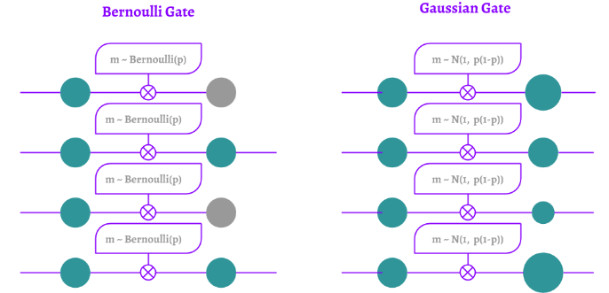

###### 数据增强

在数据量有限的情况下，可以通过数据增强来增加数据量，提高模型鲁棒性，避免过拟合。图像数据的增强主要是通过算法对图像进行转变，引入噪声等方法来增加数据的多样性。增强的方法主要有几种：旋转、翻转、缩放、平移、加噪声。

标签平滑：一种改善的正则化方法是标签平滑（Label Smoothing），即在输出标签中添加噪声来
避免模型过拟合。

一个样本$x$的标签一般用$onehot$向量表示$$
\mathbf{y}=[0, \cdots, 0,1,0, \cdots, 0]^{\mathrm{T}}$$
平滑后的标签为$\tilde{\mathbf{y}}=\left[\frac{\epsilon}{K-1}, \cdots, \frac{\epsilon}{K-1}, 1-\epsilon, \frac{\epsilon}{K-1}, \cdots, \frac{\epsilon}{K-1}\right]^{\mathrm{T}}$

##### 参数范数正则化

一些正则化方法通过对目标函数  添加一个参数范数正则化项  来限制模型的容量。正则化之后的目标函数为$\tilde{J} : \tilde{J}(\vec{\theta} ; \mathbf{X}, \overrightarrow{\mathbf{y}})=J(\vec{\theta} ; \mathbf{X}, \overrightarrow{\mathbf{y}})+\alpha \Omega(\vec{\theta})$

###### $\text{L2}$正则化

假设$\vec{\theta}$参数就是权重$\vec{\mathbf{w}}$，没有偏置参数，则：$\tilde{J}(\overrightarrow{\mathbf{w}} ; \mathbf{X}, \overrightarrow{\mathbf{y}})=J(\overrightarrow{\mathbf{w}} ; \mathbf{X}, \overrightarrow{\mathbf{y}})+\frac{\alpha}{2} \overrightarrow{\mathbf{w}}^{T} \overrightarrow{\mathbf{w}}$。对应的梯度为：$\nabla_{\vec{w}} \tilde{J}(\overrightarrow{\mathbf{w}} ; \mathbf{X}, \overrightarrow{\mathbf{y}})=\nabla_{\vec{w}} J(\overrightarrow{\mathbf{w}} ; \mathbf{X}, \overrightarrow{\mathbf{y}})+\alpha \overrightarrow{\mathbf{w}}$。使用梯度下降法来更新权重，则权重的更新公式为：$\overrightarrow{\mathbf{w}}<\overrightarrow{\mathbf{w}}-\epsilon\left(\nabla_{\overrightarrow{\mathbf{w}}} J(\overrightarrow{\mathbf{w}} ; \mathbf{X}, \overrightarrow{\mathbf{y}})+\alpha \overrightarrow{\mathbf{w}}\right)$。即：$\overrightarrow{\mathbf{w}} \leftarrow(1-\epsilon \alpha) \overrightarrow{\mathbf{w}}-\epsilon \nabla_{\overrightarrow{\mathbf{w}}} J(\overrightarrow{\mathbf{w}} ; \mathbf{X}, \overrightarrow{\mathbf{y}})$。$\text{L2}$正则化对于梯度更新的影响是：每一步执行梯度更新之前，会对权重向量乘以一个常数因子来收缩权重向量。因此`L2` 正则化也被称作权重衰减。

令$\overrightarrow{\mathbf{w}}^{*}=\arg \min _{\overrightarrow{\mathbf{w}}} J(\overrightarrow{\mathbf{w}})$，它就是无正则化项时使得目标函数最小的权重向量。根据极小值的条件，有$\nabla_{\overrightarrow{\mathbf{w}}} J\left(\overrightarrow{\mathbf{w}}^{*}\right)=\overrightarrow{\mathbf{0}}$。于是在$\overrightarrow{\mathbf{w}}^{*}$的邻域内泰勒展开$J(\overrightarrow{\mathbf{w}})$。
$$
\hat{J}(\overrightarrow{\mathbf{w}})=J\left(\overrightarrow{\mathbf{w}}^{*}\right)+\overrightarrow{\mathbf{0}}+\frac{1}{2}\left(\overrightarrow{\mathbf{w}}-\overrightarrow{\mathbf{w}}^{*}\right)^{T} \mathbf{H}\left(\overrightarrow{\mathbf{w}}-\overrightarrow{\mathbf{w}}^{*}\right), \quad \overrightarrow{\mathbf{w}} \in \mathbb{N}\left(\overrightarrow{\mathbf{w}}^{*}\right)
$$
则$J(\overrightarrow{\mathbf{w}})$的梯度为：$\nabla_{\overrightarrow{\mathbf{w}}} \hat{J}(\overrightarrow{\mathbf{w}})=\mathbf{H}\left(\overrightarrow{\mathbf{w}}-\overrightarrow{\mathbf{w}}^{*}\right), \quad \overrightarrow{\mathbf{w}} \in \mathbb{N}\left(\overrightarrow{\mathbf{w}}^{*}\right)$。

令$\overrightarrow{\overline{\mathbf{w}}}^{*}=\arg \min _{\overrightarrow{\mathbf{w}}} \tilde{J}(\overrightarrow{\mathbf{w}})$，它就是有正则化项时使得目标函数最小的权重向量。

假设$\tilde{\mathbf{w}}^{*} \in \mathbb{N}\left(\overrightarrow{\mathbf{w}}^{*}\right)$， 即$\tilde{\mathbf{w}}^{*} $在$\overrightarrow{\mathbf{w}}^{*}$的一个邻域内，则有：$\nabla_{\vec{w}} J\left(\tilde{\vec{\mathbf{w}}}^{*}\right)=\mathbf{H}\left(\hat{\vec{\mathbf{w}}}^{*}-\overrightarrow{\mathbf{w}}^{*}\right)$。

根据极小值条件，则有：$\mathbf{H}\left(\overrightarrow{\mathbf{w}}^{*}-\overrightarrow{\mathbf{w}}^{*}\right)+\alpha \overrightarrow{\mathbf{w}}^{*}=\overrightarrow{\mathbf{0}} \rightarrow(\mathbf{H}+\alpha \mathbf{I}) \overrightarrow{\mathbf{w}}^{*}=\mathbf{H} \overrightarrow{\mathbf{w}}^{*}$

$l_2$正则化就是在代价函数后面再加上一个正则化项：
$$
\begin{equation}\begin{array}{l}C = C_0 + \frac{\lambda}{2}\sum_{\omega}\omega^2\\
\frac{\partial C}{\partial \omega} = \frac{\partial C_0}{\partial \omega}+\lambda\omega\\
\omega\to\omega-\eta\frac{\partial C_0}{\partial \omega}-\eta\lambda\omega=(1-\eta\lambda)\omega-\eta\frac{\partial C_0}{\partial \omega}
\end{array}\end{equation}
$$
在不使用$l_2$正则化时。求导结果中$\omega$前系数为1，经变化后$\omega$前面系数为$1-\eta\lambda$，由于$\eta$、$\lambda$都是正的。所以$1-\eta\lambda$小于1，它的效果是减小$\omega$，这也就是权重衰减的由来。

###### $\text{L1}$正则化

模型参数$\vec{\mathbf{w}}$的$\mathbf{L}_1$的正则化形式为：$\Omega(\vec{\theta})=\|\overrightarrow{\mathbf{w}}\|_{1}=\sum_{i}\left|w_{i}\right|$。即各个参数的绝对值之和。$\mathbf{L}_1$正则化后的目标函数$\tilde{J}(\overrightarrow{\mathbf{w}} ; \mathbf{X}, \overrightarrow{\mathbf{y}}) : \tilde{J}(\overrightarrow{\mathbf{w}} ; \mathbf{X}, \overrightarrow{\mathbf{y}})=J(\overrightarrow{\mathbf{w}} ; \mathbf{X}, \overrightarrow{\mathbf{y}})+\alpha\|\overrightarrow{\mathbf{w}}\|_{1}$。对应的梯度为$\nabla_{\overrightarrow{\mathbf{w}}} \tilde{J}(\overrightarrow{\mathbf{w}} ; \mathbf{X}, \overrightarrow{\mathbf{y}})=\nabla_{\overrightarrow{\mathbf{w}}} J(\overrightarrow{\mathbf{w}} ; \mathbf{X}, \overrightarrow{\mathbf{y}})+\alpha \operatorname{sign}(\overrightarrow{\mathbf{w}})$。如果自变量大于零，则取值为 1；如果自变量小于零，则取值为 -1；如果自变量为零，则取值为零。使用梯度下降法来更新权重，给出权重的更新公式为：
$$
\begin{array}{l}{\overrightarrow{\mathbf{w}} \leftarrow \overrightarrow{\mathbf{w}}-\epsilon\left(\nabla_{\overrightarrow{\mathbf{w}}} J(\overrightarrow{\mathbf{w}} ; \mathbf{X}, \overrightarrow{\mathbf{y}})+\alpha \operatorname{sign}(\overrightarrow{\mathbf{w}})\right)} \\ {=(\overrightarrow{\mathbf{w}}-\epsilon \alpha \operatorname{sign}(\overrightarrow{\mathbf{w}}))-\epsilon \nabla_{\overrightarrow{\mathbf{w}}} J(\overrightarrow{\mathbf{w}} ; \mathbf{X}, \overrightarrow{\mathbf{y}})}\end{array}
$$

在原始的代价函数后面加上一个$l_1$正则化项,即全部权重$\omega$的绝对值的和，再乘以$\lambda$
$$
C = C_0+\lambda\sum_{\omega}|\omega|
$$
先计算导数：
$$
\frac{\partial C}{\partial \omega} = \frac{\partial C_0}{\partial \omega}+\lambda sgn(\omega)
$$
那么权重w的更新规则为：$\omega\to\omega^{\prime} = \omega-\eta\lambda sgn(\omega)-\eta\frac{\partial C_0}{\partial \omega}$。

当$\omega$为正时，$sgn(\omega)>0$, 则更新后的变小；当$\omega$为负时，$sgn(\omega)<0$, 则更新后的变大—因此它的效果就是让往0靠，使网络中的权重尽可能为0，也就相当于减小了网络复杂度，防止过拟合。

当$\omega$等于0时，$|W|$是不可导的。所以我们仅仅能依照原始的未经正则化的方法去更新$\omega$，这就相当于去掉$\eta\lambda sgn(\omega)$这一项，所以我们能够规定$sgn(0)=0$，这样就把$\omega=0$的情况也统一进来了。

##### 显式约束正则化

可以通过添加一个显式约束来实现正则化：$\min _{\vec{\theta}} J(\vec{\theta} ; \mathbf{X}, \overrightarrow{\mathbf{y}}), \quad$ st. $\Omega(\vec{\theta})<k$。其中$k$为一个常数。可以通过构建广义拉格朗日函数来求解该约束最优化问题。定义广义拉格朗日函数：$\mathcal{L}(\vec{\theta}, \alpha)=J(\vec{\theta})+\alpha(\Omega(\vec{\theta})-k)$。则上述约束最优化问题的解由下式给出：$\vec{\theta}^{*}=\arg \min _{\vec{\theta}} \max _{\alpha, \alpha>0} \mathcal{L}(\vec{\theta}, \alpha)$。假设$\alpha$的解为$\alpha^*$，固定$\alpha^*$则：$\vec{\theta}^{*}=\arg \min _{\vec{\theta}} J(\vec{\theta})+\alpha^{*} \Omega(\vec{\theta})$.

##### $\text{DropOut}$

`dropout`：在前向传播过程中，对网络中的每个隐层，每个隐单元都以一定的概率$p_{drop}$被删除，最后得到一个规模更小的网络。在反向传播过程中，仅仅针对该小网络进行权重更新。所谓的删除，即指定该该隐单元的输出都为0。一旦隐单元的权重为0，则该隐单元对后续神经元的影响均为0 。输入层和输出层的神经元不会被删除，因为这两个层的神经元的数量是固定的。

$$
\begin{equation}\begin{array}{l}\text{Train:}&\mathbf{y}=f(\mathbf{W}\mathbf{x})\odot\mathbf{m}, m_i\sim Bernoulli(p)\\
\text{Testing:}& \mathbf{y}=(1-p)f(\mathbf{W}\mathbf{x})
\end{array}\end{equation}
$$

###### $\text{DropConnect}$

$\text{DropConnect}$没有直接在神经元上应用dropout，而是应用在连接这些神经元的权重和偏置上。因此，我们找到了与标准Dropout方法相同的机制。除了掩码不是应用在某一层的神经元向量上，而是应用在连接该层与前一层的权重矩阵上。
$$
\begin{equation}\begin{array}{l}\text{Train:}&\mathbf{y}=f((\mathbf{W}\odot\mathbf{M})\mathbf{x}), M_{i,j}\sim Bernoulli(p)\\
\text{Testing:}& \mathbf{y}=f(\mathbf{W}\mathbf{x})\odot\hat{m}(\mathbf{Z})
\end{array}\end{equation}
$$
其中$\hat{m}(\mathbf{Z})=\frac{1}{Z}\sum_{i=0}^Zf(\hat{x}_{i,z}), \hat{x}_{i,z}\sim N(\mu_i, \sigma_i^2)$，其中$\mu=p\mathbf{Wx}, \sigma^2=p(1-p)(\mathbf{W}\odot\mathbf{W})(\mathbf{x}\odot\mathbf{x})$

###### Standout

Standout是一个标准的Dropout方法，基于一个Bernoulli mask。不同之处在于，神经元被遗漏的概率p在这一层中并不恒定。根据权重的值，它是自适应的。
$$
\begin{equation}\begin{array}{l}\text{Train:}&\mathbf{y}=f((\mathbf{W}\mathbf{x})\odot\mathbf{m}), m_i\sim Bernoulli(g(\mathbf{W}_s\mathbf{x}))\\
\text{Testing:}& \mathbf{y}=f(\mathbf{W}\mathbf{x})\odot(1-g(\mathbf{W}_s\mathbf{x}))
\end{array}\end{equation}
$$
适用于任何`g`激活函数，甚至是一个单独的神经网络。类似地，对于$\mathbf{W}_s$，可以是一个$\mathbf{W}$的函数。

###### Gaussian Dropout

逻辑上，通过在每次迭代中丢弃带有dropout的神经元，那些在迭代中丢弃的神经元在反向传播期间不会被更新。它们并不存在。所以训练阶段被“放慢”了。另一方面，通过使用Gaussian Dropout方法，在每次迭代和每个训练样本中，所有的神经元都暴露出来。这就避免了减速。

$$
\begin{equation}\begin{array}{l}\text{Train:}&\mathbf{y}=f(\mathbf{W}\mathbf{x})\odot\mathbf{m}, m_i\sim N(1,p(1-p))\\
\text{Testing:}& \mathbf{y}=f(\mathbf{W}\mathbf{x})
\end{array}\end{equation}
$$
隐单元删除发生在一个训练样本的训练期间。不同的训练样本，其删除的隐单元的集合是不同的，因此裁剪得到的小网络是不同的。不同的训练样本，隐单元被删除的概率   都是相同的。在不同`batch` 之间的同一个训练样本，其删除的隐单元的集合也是不同的。在不同的梯度更新周期，会从完整的网络中随机删除不同的神经元，因此裁剪得到的小网络是不同的。但是在这个过程中，隐单元被删除的概率是相同的。可以指定某一个隐层或者某几个隐层执行`dropout`，而没有必要针对所有的隐层执行`dropout` 。`dropout`可以视作集成了非常多的神经网络的`bagging`集成模型，这些网络包含了所有从基础网络中删除隐单元形成的子网络。`bagging`涉及训练多个模型，并且在每个测试样本上评估多个模型。当每个模型都是一个大型神经网络时，这种`bagging`计算量非常庞大，实际不可行。`dropout`提供了一种方便的`bagging`近似，它能够训练和评估指数级别的神经网络的集成。

