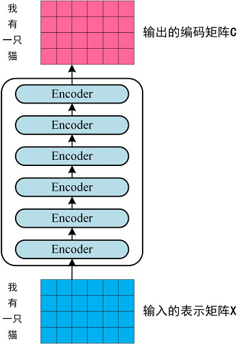
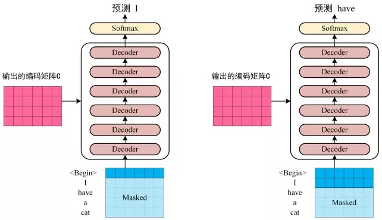
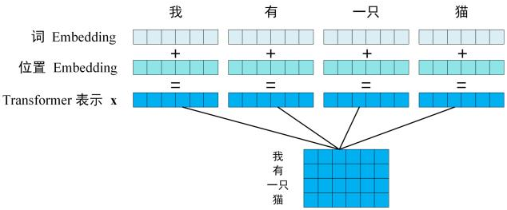

##### `attention`

设输入序列为$\{\vec{\mathbf{x}}^1,\cdots,\vec{\mathbf{x}}^{\tau_x}\}$，输出序列为$\{\vec{\mathbf{y}}^1,\cdots,\vec{\mathbf{y}}^{\tau_y}\}$，长度$\tau_x\ne\tau_y$。设`encoder` 的隐向量为$\vec{\mathbf{h}}_1,\vec{\mathbf{h}}_2,\cdots$，`decoder` 的隐向量为$\vec{\mathbf{s}}_1,\vec{\mathbf{s}}_2,\cdots$。

对于传统的 `encoder-decoder` 模型，`decoder` 的输入只有一个向量，该向量就是输入序列经过`encoder`编码的上下文向量$\vec{\mathbf{c}}$。通常将 `encoder` 的最后一个隐单元的隐向量$\vec{\mathbf{h}}_{\tau_x}$作为上下文向量。

对于 `attention encoder-decoder` 模型，`decoder` 的输入是一个向量序列，序列长度为$\tau_y$。`decoder`位置$i$的输入是采用了 `attention` 机制的上下文向量$\vec{\mathbf{c}}_i$，不同位置的上下文向量不同。

- 上下文向量$\vec{\mathbf{c}}_i$由 `encoder` 的所有隐向量加权得到：$\vec{\mathbf{c}}_i=\sum_{t=1}^{\tau_x}\alpha_{i,t}\vec{\mathbf{h}}_t$。其中$\sum_{t=1}^{\tau_x}\alpha_{i,t}=1,\quad\alpha_{i,t}\ge0$。

- 权重$\alpha_{i,t}$刻画了：在对第$i$个输出进行解码时，第$t$个输入的重要程度。一个直觉上的方法是：首先计算$\vec{\mathbf{s}}_{i-1}$与$\vec{\mathbf{h}}_t$的相关性，然后对所有的$t=1,\cdots,\tau_x$归一化即可得到权重系数。即：
  $$
  e_{i,t}=\text{score}(\vec{\mathbf{s}}_{i-1},\vec{\mathbf{h}}_t),\quad\alpha_{i,t}=\frac{\exp(e_{i,t})}{\sum_{k=1}^{\tau_x}\exp(e_{i,k})},\quad k=1,\cdots,\tau_x
  $$
  其中 `score` 由多种计算方式，不同的计算方式代表不同的 `attention` 模型（$\vec{\mathbf{v}}_{\alpha},\mathbf{W}_{\alpha}$为待学习的参数，`n` 为向量的维度）：
  $$
  \text{score}(\vec{\mathbf{s}}_{i-1},\vec{\mathbf{h}}_t)=\left\{\begin{array}{ll}\frac{\vec{\mathbf{s}}_{i-1}\cdot\vec{\mathbf{h}}_t}{||\vec{\mathbf{s}}_{i-1||}\times||\vec{\mathbf{h}}_t||},&\text{cosin}\\
  \vec{\mathbf{s}}_{i-1}\cdot\vec{\mathbf{h}}_t,&\text{dot}\\
  \frac{\vec{\mathbf{s}}_{i-1}\cdot\vec{\mathbf{h}}_t}{\sqrt{n}},&\text{scaled-dot}\\
  \vec{\mathbf{s}}_{i-1}^T\mathbf{W}_{\alpha}\vec{\mathbf{h}}_t,&\text{general}\\
  \vec{\mathbf{v}}_{\alpha}\tanh(\mathbf{W}_{\alpha}[\vec{\mathbf{s}}_{i-1}:\vec{\mathbf{h}}_t]),&\text{concat}\end{array}\right.
  $$

###### `self attention`

`self attention` 计算三种 `attention`：

- 在`encoder` 端计算自身的 `attention`，捕捉`input` 之间的依赖关系。
- 在 `decoder` 端计算自身的 `attention`，捕捉`output` 之间的依赖关系。
- 将 `encoder` 端得到的 `self attention` 加入到 `decoder` 端得到的 `attention` 中，捕捉输入序列的每个 `input` 和输出序列的每个 `output` 之间的依赖关系。

设输入序列为$\{\vec{\mathbf{x}}^1,\cdots,\vec{\mathbf{x}}^{\tau_x}\}$，输出序列为$\{\vec{\mathbf{y}}^1,\cdots,\vec{\mathbf{y}}^{\tau_y}\}$，长度$\tau_x\ne\tau_y$​。

`encoder` 端的 `self attention` ：

- 首先经过$\mathbf{W}_k^{\text{en}}$映射得到 `key` 向量序列$\{\vec{\mathbf{k}}_1^{\text{en}},\cdots,\vec{\mathbf{k}}_{\tau_x}^{\text{en}}\}$、经过$\mathbf{W}_q^{\text{en}}$映射得到 `query` 向量序列$\{\vec{\mathbf{q}}_1^{\text{en}},\cdots,\vec{\mathbf{q}}_{\tau_x}^{\text{en}}\}$。然后计算归一化的 `self attention`：
  $$
  e_{i,t}=\text{socre}(\vec{\mathbf{q}}_i^{\text{en}},\vec{\mathbf{k}}_t^{\text{en}})\quad v_{i,t}^{\text{en}}=\frac{\exp(e_{i,t})}{\sum_{k=1}^{\tau_x}\exp(e_{i,k})},\quad k=1,\cdots,\tau_x
  $$
  其中$\vec{\mathbf{v}}_i^{\text{en}}=(v_{i,1}^{\text{en}},\cdots,v_{i,\tau_x}^{\text{en}})$​表示各输入与第$i$​个输入的相关因子。最后得到经过加权的 `encoder` 输出向量：$\vec{\mathbf{c}}_i^{\text{en}}=\sum_{t=1}^{\tau_x}v_{i,t}^{\text{en}}\times\vec{\mathbf{x}}^t$​。

- `decoder` 端的 `self attention`：考虑到解码时$s$​​时刻不知道$s$​​时刻及其之后的结果，因此仅考虑$s$​​时刻之前的 `attention`，这被称作 `masked attention` 。因此对于时刻$s$​​：首先经过$\mathbf{W}_k^{\text{de}}$​​映射得到 `key` 向量序列$$\{\vec{\mathbf{k}}_1^{\text{de}},\cdots,\vec{\mathbf{k}}_{s-1}^{\text{de}}\}$$​​、经过$\mathbf{W}_q^{\text{de}}$​​映射得到 `query` 向量序列$$\{\vec{\mathbf{q}}_1^{\text{de}},\cdots,\vec{\mathbf{q}}_{s-1}^{\text{de}}\}$$​​。然后计算归一化的 `self attention`：
  $$
  \overline{e}_{i,t}=\text{socre}(\vec{\mathbf{q}}_i^{\text{de}},\vec{\mathbf{k}}_t^{\text{de}})\quad v_{i,t}^{\text{de}}=\frac{\exp(\overline{e}_{i,t})}{\sum_{k=1}^{\tau_x}\exp(\overline{e}_{i,k})},\quad k=1,\cdots,s-1
  $$
  其中$\vec{\mathbf{v}}_i^{\text{de}}=(v_{i,1}^{\text{de}},\cdots,v_{i,s-1}^{\text{de}})$​​表示各输入与第$i$​​个输入的相关因子。最后得到经过加权的 `encoder` 输出向量：$\vec{\mathbf{c}}_i^{\text{de}}=\sum_{t=1}^{s-1}v_{i,t}^{\text{de}}\times\vec{\mathbf{y}}^t$​​。

- `encoder` 和 `decoder` 的 `attention`：计算归一化的 `self attention`：
  $$
  \hat{e}_{i,t}=\text{socre}(\vec{\mathbf{c}}_i^{\text{de}},\vec{\mathbf{c}}_t^{\text{en}})\quad v_{i,t}=\frac{\exp(\hat{e}_{i,t})}{\sum_{k=1}^{\tau_x}\exp(\hat{e}_{i,k})},\quad k=1,\cdots,\tau_x
  $$
  其中$\vec{\mathbf{v}}_i=(v_{i,1},\cdots,v_{i,\tau_x})$​表示各输入与第$i$​个输出的相关因子。最后得到经过加权的 `attention` 上下文向量：$\vec{\mathbf{c}}_i=\sum_{t=1}^{\tau_x}v_{i,t}\times\vec{\mathbf{c}}^{\text{en}}_i$​。

- 最后将上下文向量$\vec{\mathbf{c}}_i$作为一个前馈神经网络的输入，其输出就是$\vec{\mathbf{y}}_s$。

#### Transformer

`Transformer` 相比较 `LSTM` 等循环神经网络模型的优点：可以直接捕获序列中的长距离依赖关系；模型并行度高，使得训练时间大幅度降低。

`Transformer` 包含一个编码器 `encoder` 和一个解码器 `decoder` 。编码器 `encoder` 包含一组 6 个相同的层 `Layer` ，每层包含两个子层 `SubLayer`。

- 第一个子层是一个多头自注意力 `multi-head self-attention` 层，第二个子层是一个简单的全连接层。

- 每个子层都使用残差直连，并且残差直连之后跟随一个`layer normalization:LN` 。假设子层的输入为$\vec{\mathbf{h}}$，则经过 `LN` 之后整体的输出为：$\text{LN}(\vec{\mathbf{h}}+\text{Sublayer}(\vec{\mathbf{h}}))$。

解码器 `decoder` 也包含一组 6 个相同的层 `Layer`，但是每层包含三个子层 `SubLayer` 

- 第一个子层也是一个多头自注意力 `multi-head self-attention` 层。但是，在计算位置$i$的 `self-attention` 时屏蔽掉了位置$i$之后的序列值，这意味着：位置$i$的 `attention` 只能依赖于它之前的结果，不能依赖它之后的结果。因此，这种 `self-attention` 也被称作 `masked self-attention`。
- 第二个子层是一个多头注意力`multi-head attention` 层，用于捕获 `decoder output` 和 `encoder output` 之间的 `attention` 。
- 第三个子层是一个简单的全连接层。
- 和 `encoder` 一样：每个子层都使用残差直连，并且残差直连之后跟随一个`LN` 。

##### `attention`

编码器和解码器的 `attention` 都是采用 `scaled dot attention` 。设有$M$​个 `query` 向量$\{\vec{\mathbf{q}}_1,\cdots,\vec{\mathbf{q}}_M\}$​、$M$​个 `key` 向量$\{\vec{\mathbf{k}}_1,\cdots,\vec{\mathbf{k}}_M\}$​、$M$​个 `value` 向量$\{\vec{\mathbf{v}}_1,\cdots,\vec{\mathbf{v}}_M\}$​，其中 `query` 向量和 `key` 向量的维度为$d_k$​，`value` 向量的维度为$d_v$​。经过 `attention` 之后，位置$m$的输出为：
$$
\tilde{\vec{\mathbf{v}}}_m=\sum_{i=1}^M\alpha_{m,i}\vec{\mathbf{v}}_i
$$
其中$\alpha_{m,i}$表示位置$m$与位置$i$之间的权重：
$$
\text{score}_{m,i}=\frac{\vec{\mathbf{q}}_m\cdot \vec{\mathbf{k}}_i}{\sqrt{d_k}},\alpha_{m,i}=\frac{\exp(\text{score}_{m,i})}{\sum_{j=1}^M\text{score}_{m,j}},i=1,2,\cdots,M
$$
除以$\sqrt{d_k}$是为了降低$\text{score}_{m,i}$的数值，防止它落入到 `softmax` 函数的饱和区间。因为 `softmax` 函数的饱和区梯度几乎为 0 ，容易发生梯度消失。

如果使用了 `Masked attention`，则有：
$$
\text{score}_{m,i}=\left\{ \begin{array}{ll}\frac{\vec{\mathbf{q}}_m\cdot \vec{\mathbf{k}}_i}{\sqrt{d_k}},&i=1,2,\cdots,m\\
-\infin,&i=m+1,\cdots,M\end{array}\right.
$$

$$
\mathbf{Q}=\left[\begin{array}{cccc}\vec{\mathbf{q}}_1^T\\\vec{\mathbf{q}}_2^T\\
\cdot\\
\cdot\\
\vec{\mathbf{q}}_M^T\end{array}\right]\in\mathbb{R}^{M\times d_k},\mathbf{K}=\left[\begin{array}{cccc}\vec{\mathbf{k}}_1^T\\\vec{\mathbf{k}}_2^T\\
\cdot\\
\cdot\\
\vec{\mathbf{k}}_M^T\end{array}\right]\in\mathbb{R}^{M\times d_k},\mathbf{V}=\left[\begin{array}{cccc}\vec{\mathbf{v}}_1^T\\\vec{\mathbf{v}}_2^T\\
\cdot\\
\cdot\\
\vec{\mathbf{v}}_M^T\end{array}\right]\in\mathbb{R}^{M\times d_v},\tilde{\mathbf{V}}=\left[\begin{array}{cccc}\tilde{\vec{\mathbf{v}}}_1^T\\\tilde{\vec{\mathbf{v}}}_2^T\\
\cdot\\
\cdot\\
\tilde{\vec{\mathbf{v}}}_M^T\end{array}\right]\in\mathbb{R}^{M\times d_v}
$$

则有：
$$
\mathbf{QK}^T=\left[\begin{array}{cccc}\vec{\mathbf{q}}_1\cdot \vec{\mathbf{k}}_1&\vec{\mathbf{q}}_1\cdot \vec{\mathbf{k}}_2&\cdots&\vec{\mathbf{q}}_1\cdot \vec{\mathbf{k}}_M\\\vec{\mathbf{q}}_2\cdot \vec{\mathbf{k}}_1&\vec{\mathbf{q}}_2\cdot \vec{\mathbf{k}}_2&\cdots&\vec{\mathbf{q}}_2\cdot \vec{\mathbf{k}}_M\\
\cdot&\cdot&\cdots&\cdot\\
\cdot&\cdot&\cdots&\cdot\\
\vec{\mathbf{q}}_M\cdot \vec{\mathbf{k}}_1&\vec{\mathbf{q}}_M\cdot \vec{\mathbf{k}}_2&\cdots&\vec{\mathbf{q}}_M\cdot \vec{\mathbf{k}}_M\end{array}\right]\in\mathbb{R}^{M\times M}
$$
令：$\mathbf{S}=\text{softmax}(\frac{\mathbf{QK}^T}{\sqrt{d_k}})$。则有：$\tilde{\mathbf{V}}=\mathbf{S}\mathbf{V}$。

一组多个`attention` 的效果要优于单个 `attention`，这称作`multi-head attention` 。给定 `query` 矩阵$\mathbf{Q}$、`key` 矩阵$\mathbf{K}$、`value` 矩阵$\mathbf{V}$，`multi-head attention` 的 `head i` 先通过一个线性映射然后再经过 `attention`，得到 `head i` 的输出$\tilde{\mathbf{V}}$：
$$
\tilde{\mathbf{V}}=\text{Attention}(\mathbf{Q}\mathbf{W}^Q_i,\mathbf{K}\mathbf{W}_i^K,\mathbf{V}\mathbf{W}^V_i)\in \mathbb{R}^{M\times d_{v^{\prime}}}
$$
其中：$\mathbf{W}^Q_i\in\mathbb{R}^{d_k\times d_{k^{\prime}}}$将$M$个 `query` 向量$\vec{\mathbf{q}}_m$从$d_k$维降低到$d_{k^{\prime}}$维；$\mathbf{W}^K_i\in\mathbb{R}^{d_k\times d_{k^{\prime}}}$将$M$个 `key` 向量$\vec{\mathbf{k}}_m$从$d_k$维降低到$d_{k^{\prime}}$维；$\mathbf{W}^V_i\in\mathbb{R}^{d_v\times d_{v^{\prime}}}$将$M$个 `value` 向量$\vec{\mathbf{v}}_m$从$d_v$维降低到$d_{v^{\prime}}$维。

将多个 `head i` 的输出 进行拼接，并再经过一个线性映射即可得到多头`attention` 的结果：
$$
\text{MultiHead}(\mathbf{Q},\mathbf{K},\mathbf{V})=\text{Concat}(\tilde{\mathbf{V}}_1,\cdots,\tilde{\mathbf{V}}_a)\mathbf{W}^O
$$
其中：`a` 为 `head` 的数量，$\mathbf{W}^O\in \mathbf{R}^{(ad_{v^{\prime}})\times d_v}$是为了确保`multi-head attention` 前后的输入输出维度一致。`concate` 操作在 `M` 个向量上进行：
$$
\text{Concat}(\tilde{\mathbf{V}}_1,\cdots,\tilde{\mathbf{V}}_a)=\left[\begin{array}{cccc}\tilde{\vec{\mathbf{v}}}_{1,1}^T&\tilde{\vec{\mathbf{v}}}_{2,1}^T&\cdots&\tilde{\vec{\mathbf{v}}}_{a,1}^T\\\tilde{\vec{\mathbf{v}}}_{1,2}^T&\tilde{\vec{\mathbf{v}}}_{2,2}^T&\cdots&\tilde{\vec{\mathbf{v}}}_{a,2}^T\\
\cdot&\cdot&\cdots&\cdot\\
\cdot&\cdot&\cdots&\cdot\\
\tilde{\vec{\mathbf{v}}}_{1,M}^T&\tilde{\vec{\mathbf{v}}}_{2,M}^T&\cdots&\tilde{\vec{\mathbf{v}}}_{a,M}^T\end{array}\right]
$$
其中$\tilde{\vec{\mathbf{v}}}_{i,m}$为第$i$个 `head` 的第$m$个输出向量。

`multi-head attention` 将整个 `attention` 空间拆分成多个 `attention` 子空间，其表达能力更强。从原理上看，`multi-head` 相当于在整体计算代价几乎保持不变的条件下，引入了更多的非线性从而增强了模型的表达能力。

在论文中，有三种方式使用多头注意力机制：

- `encoder-decoder attention`：`query` 来自前一个 `decoder` 层的输出，`keys,values` 来自 `encoder` 的输出。其意义是： `decoder` 的每个位置去查询它与 `encoder` 的哪些位置相关，并用 `encoder` 的这些位置的 `value` 来表示。
- `encoder self-attention`：`query,key,value` 都来自前一层 `encoder` 的输出。这允许 `encoder` 的每个位置关注 `encoder` 前一层的所有位置。
- `decoder masked self-attention`：`query,key,value` 都来自前一层 `decoder` 的输出。这允许 `decoder` 的每个位置关注 `encoder` 前一层的、在该位置之前的所有位置。

##### 全连接层

`encoder` 和 `decoder` 还包含有全连接层。对 `encoder/decoder` 的每个 `attention` 输出，全连接层通过一个 `ReLU` 激活函数以及一个线性映射：
$$
\vec{\mathbf{o}}_m=\mathbf{W}\max(0,\tilde{\vec{\mathbf{v}}}_m+\vec{\mathbf{b}}_1)+\vec{\mathbf{b}}_2
$$
对于同一个 `multi-head attention` 的所有 个输出，采用相同的参数；对于不同的 `multi-head attention` 的输出，采用不同的参数。

##### `embedding`层

网络涉及三个 `embedding` 层：

- `encoder` 输入 `embedding` 层：将 `encoder` 输入 `token` 转化为$d_{\text{model}}$维的向量。
- `decoder` 输入 `embedding` 层：将 `decoder` 输入 `token` 转化为$d_{\text{model}}$维的向量。
- `decoder` 输出 `embedding` 层：将 `decoder` 输出 `token` 转化为$d_{\text{model}}$维的向量。

##### Position Embedding

从 `attention` 的计算公式$\tilde{\vec{\mathbf{v}}}_m=\sum_{i=1}^M\alpha_{m,i}\vec{\mathbf{v}}_i$可以看到：调整输入的顺序对 `attention` 的结果没有任何影响。即：`attention` 的输出中不包含任何顺序信息。

论文通过将位置编码添加到 `encoder` 和 `decoder` 底部的输入 `embedding` 来解决问题。即有：
$$
\tilde{\vec{\mathbf{v}}}_m=\sum_{i=1}^M\alpha_{m,i}^p\vec{\mathbf{v}}_i^p\\
\vec{\mathbf{v}}_i^p=\vec{\mathbf{v}}_i+\vec{\mathbf{p}}_i
$$
其中$\vec{\mathbf{p}}_i$为位置 的`position embedding` ，$\alpha_{m,i}^p$`attention` 权重与位置有关。

位置编码有两种选择：

- 可以作为参数来学习，即：将 `encoder` 的每个输入的位置`embedding` 、`decoder` 的每个输入的位置`embedding` 作为网络的参数，这些参数都从训练中学得。
- 也可以人工设定固定值。论文中使用：

$$
\vec{\mathbf{p}}_i=(p_{i,1},\cdots,p_{i,d_{\text{model}}})^T\\
p_{i,2j}=\sin\left(\frac{i}{10000^{2j/d_{\text{model}}}}\right),p_{i,2j+1}=\cos\left(\frac{i}{10000^{2j/d_{\text{model}}}}\right)
$$

其中$i=1,2\cdots$表示位置编号，$j=0,1,\cdots,d_{\text{model}}/2$表示向量的维度。

##### `Universal Transformer`

`Universal Transformer` 总体计算流程如下图所示：

- 和 `Transformer` 相同，它使用自注意力机制来组合来自不同位置的信息。
- 和 `Transformer` 不同，它在所有的时间步的所有位置上应用一个转换函数`Transition Function` 。
- 和 `Transformer` 不同，它的时间步不再是固定的，而是一个循环。循环的停止条件由动态停止`dynamic halting` 技术决定，并且每个位置的停止时间可以不同。

图中：箭头表示计算的依赖关系，$\vec{\mathbf{h}}^t_1,\cdots,\vec{\mathbf{h}}^t_m$表示第 个时间步各位置的向量表达。其中$\vec{\mathbf{h}}^0_1,\cdots,\vec{\mathbf{h}}^0_m$由输入 `token` 的 `embedding` 来初始化。

与 `Transformer` 不同，`Universal Transformer` 的 `position embedding` 在每个时间步都发生变化，而不仅仅只有起始时设置一次。设时间步$t$时，位置$i$的 `position embedding` 为$\vec{\mathbf{p}}_i^t$，则有：
$$
p_{i,2j}^t=\sin\left(\frac{i}{10000^{2j/d_{\text{model}}}}\right)+\sin\left(\frac{t}{10000^{2j/d_{\text{model}}}}\right)\\
p_{i,2j+1}^t=\cos\left(\frac{i}{10000^{2j/d_{\text{model}}}}\right)+\cos\left(\frac{t}{10000^{2j/d_{\text{model}}}}\right)
$$

其中$j=0,1,\cdots,d_{\text{model}}/2$表示向量的维度，$m$为序列的长度。写成矩阵的形式有：
$$
\mathbf{P}^t=\left[\begin{array}{cccc}p_{1,1}^t &p_{1,2}^t&\cdots&p_{1,d_{\text{model}}}^t\\
p_{2,1}^t &p_{2,2}^t&\cdots&p_{2,d_{\text{model}}}^t\\
\cdot&\cdot&\cdots&\cdot\\
p_{m,1}^t &p_{m,2}^t&\cdots&p_{m,d_{\text{model}}}^t
\end{array}\right]\in\mathbb{R}^{m\times d_{\text{model}}}
$$

编码器 `encoder` ：给定一个长度为$m$的输入`token` 序列$\{w_1,\cdots,w_m\}$：

- 首先根据每个 `token` 的$d$维 `embedding`，得到一个初始输入矩阵$\mathbf{H}^0$：
  $$
  \mathbf{H}^0=\left[\begin{array}{cccc}\vec{\mathbf{x}}^T_1\\
  \vec{\mathbf{x}}^T_2\\
  \cdots\\
  \vec{\mathbf{x}}^T_m
  
  \end{array}\right]\in\mathbb{R}^{m\times d}
  $$
  其中$\vec{\mathbf{x}}_i\in\mathbb{R}^{d\times 1}$为 `token`$w_i$的一维 `embedding` 。

- 然后在时刻$t$，根据 `self attention` 机制和 `Transition Function` 来并行计算 。`self attention` 机制：
  $$
  \text{Attention}(\mathbf{H}^t,\mathbf{H}^t,\mathbf{H}^t)=\text{softmax}\left(\frac{\mathbf{H}^t(\mathbf{H}^t)^T}{\sqrt{d}}\right)\mathbf{H}^t\\
  \tilde{\mathbf{V}}_i=\text{Attention}(\mathbf{H}^t\mathbf{W}_i^Q,\mathbf{H}^t\mathbf{W}_i^K,\mathbf{H}^t\mathbf{W}_i^V)\in\mathbb{R}^{m\times{d/k}},i=1,2,\cdots,k\\
  \text{MultiHead}(\mathbf{H}^t,\mathbf{H}^t,\mathbf{H}^t)=\text{Concat}(\tilde{\mathbf{V}}_1,\cdots,\tilde{\mathbf{V}}_k)\mathbf{W}^O
  $$
  其中$\mathbf{W}_i^Q,\mathbf{W}_i^K,\mathbf{W}_i^V\in\mathbb{R}^{d\times (d/k)}$​分别将 `query, key, value` 映射成$d/k$维度，$\mathbf{W}^O\in\mathbb{R}^{d\times d}$用于调整 `concate` 的输出结果。

- 整体步骤（其中 `LN` 为 `Layer Normalize`，`Trans` 为 `Transition Function` ：

  - 计算$t$时刻的输入：$\mathbf{I}^t=\mathbf{H}^{t-1}+\mathbf{P}^t$。
  - 计算`self attention`：$\mathbf{B}^t=\text{LN}(\mathbf{I}^t+\text{MultiHead}(\mathbf{I}^t,\mathbf{I}^t,\mathbf{I}^t))$。
  - 计算`Transition Function` ：$\mathbf{H}^t=\text{LN}(\mathbf{B}^t+\text{Trans}(\mathbf{B}^t))$。

解码器和编码器的结构基本相同，有以下不同的地方：

- 与 `Transformer` 相同，`Universal Transformer` 的解码器也采用的是 `masked self-attention` 机制。

- 与 `Transformer` 不同，`Universal Transformer` 的解码器对编码器$\tau$步的输出$\mathbf{H}^{\tau}$计算注意力，其中 `query` 来自解码器、`key,value` 来自编码器。

- 设解码器在$\tau$​步的输出为$\mathbf{H}^{\tau}_{\text{dec}}$​，则输出 `token` 为$y_j$的概率为：
  $$
  p(y_j|y_1,\cdots,y_{j-1},\mathbf{H}^{\tau})=\text{softmax}(\mathbf{W}\mathbf{H}^{\tau}_{\text{dec}})
  $$
  其中$j$为输出的位置。

##### `Transformer XL`

将整个语料库分割成固定大小的、较短的片段`segment` ，然后用每个片段来训练模型，而忽略之前所有片段的信息。这种模型称作 `vanilla model`，这也是 `Transformer` 的做法。

`vanilla model` 没有任何跨 `segment` 的信息流，这会带来两个问题：

- 模型能够捕获的最大依赖的长度不超过 `segment` 的大小。
- 划分 `segment` 的时候未考虑句子边界或者短语的边界，这破坏了语义完整性。因此模型缺乏必要的上下文信息来预测 `segment` 的开头的前几个 `token` 和结束的尾部几个 `token` 。这会导致低效的优化效率和更差的泛化能力。这个问题称作上下文碎片化 `context fragmentation` 问题。

##### `BERT`

