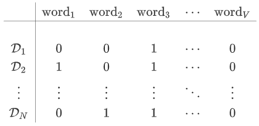

给定包含$N$篇文档的语料库$\mathbb{D}=\{\mathcal{D}_1,\mathcal{D}_2,\cdots,\mathcal{D}_N\}$，所有的单词来自于包含$V$个词汇的词汇表$\mathbb{V}=\{\text{word}_1,\text{word}_2,\cdots,\text{word}_V\}$，其中$V$表示词汇表的大小 。每篇文档$\mathbb{D}_i$包含单词序列$\{\text{word}_{w_1^i},\text{word}_{w_2^i},\cdots,\text{word}_{w_{n_i}^i}\}$，其中$w_i^j\in\{1,2,\cdots,V\}$表示第$i$篇文档的第$j$个单词在词汇表中的编号，$n_i$表示第$i$篇文档包含$n_i$个单词。词的表达任务的问题是如何表示每个词汇$\text{word}_v$。

最简单的表示方式是`one-hot` 编码：对于词汇表中第$v$个单词$\text{word}_v$，将其表示为$\text{word}_v\to(0,\cdots,1,\cdots,0)^T$，即第$v$位取值为`1`，剩余位取值为`0` 。这种表示方式有两个主要缺点：无法表达单词之间的关系，任何两个单词之间的距离一样；向量维度过高。

`BOW:Bag of Words`：词在文档中不考虑先后顺序，这称作词袋模型。

###### `TF-IDF`

`TF-IDF`有两层意思，一层是词频，另一层是逆文档频率。当有`TF`和`IDF`后，将这两个词相乘，就能得到一个词的`TF-IDF`的值。某个词在文章中的`TF-IDF`越大，那么一般而言这个词在这篇文章的重要性会越高，由大到小排序，排在最前面的几个词，就是该文章的关键词。

计算词频：词频`TF` = $\frac{\text{某个词在文章中的出现次数}}{\text{文章的总词数}}$

计算逆文档频率：逆文档频率`IDF`= $\log(\frac{\text{语料库的文档总数}}{\text{包含该词的文档数}+1})$

计算`TF-IDF`：`TF-IDF`=$\text{TF}\times \text{IDF}$

#### 向量空间模型`VSM`

向量空间模型假设单词和单词之间是相互独立的，每个单词代表一个独立的语义单元。实际上该假设很难满足：①文档中的单词和单词之间存在一定关联性，单词和其前面几个单词、后面几个单词可能存在语义上的相关性；②文档中存在很多的一词多义和多词同义的现象，每个单词并不代表一个独立的语义单元。

给定语料库$\mathbb{D}$和词汇表$\mathbb{V}$，定义`文档-单词` 矩阵为：

令矩阵为$\mathbf{D}$，则：$D(i,j)=1$表示文档$\mathcal{D}_i$中含有单词$\text{word}_j$；$D(i,j)=0$表示文档$\mathcal{D}_i$中不含单词$\text{word}_j$。文档的上述表达并未考虑单词的顺序，也未考虑单词出现的次数。一种改进策略是考虑单词出现的次数，从而赋予`文档-单词` 矩阵以不同的权重：
$$
\mathbf{D}=\left[\begin{array}{c}w_{1,1} & w_{1,2} & \cdots & w_{1,V}\\
w_{2,1} & w_{2,2} & \cdots & w_{2,V}\\
\cdot & \cdot & \cdots & \cdot\\
w_{N,1} & w_{N,2} & \cdots & w_{N,V}
\end{array}

\right]
$$
其中$w_{i,j}$表示单词$\text{word}_j$在文档$\mathcal{D}_i$中的权重。如果单词$\text{word}_j$在文档$\mathcal{D}_i$中未出现，则权重$w_{i,j}=0$。如果单词$\text{word}_j$在文档$\mathcal{D}_i$中出现，则权重$w_{i,j}\ne0$。

权重$w_{i,j}$有两种常用的选取方法：

- 单词权重等于单词出现的频率`TF`：$w_{i,j}=TF(\mathcal{D}_i,\text{word}_j)$，返回单词$\text{word}_j$在文档$\mathcal{D}_i$中出现的频数；其缺点是：一些高频词以较大的权重出现在每个文档中，这意味着对每篇文档这些高频词是比较重要的。

- 单词权重等于单词的`TF-IDF`：$\omega_{i,j}=\text{TF}(\mathcal{D}_i,\text{word}_j)\times\text{IDF}(\text{word}_j)$

给定 `文档-单词` 矩阵，得到文档的向量表达：$\mathcal{D}_i\to(w_{i,1},\cdots,w_{i,V})^T$。给定文档$\mathcal{D}_i,\mathcal{D}_j$，则文档的相似度为：
$$
\text{similar}(\mathcal{D}_i,\mathcal{D}_j)=\cos(\vec{\mathbf{w}}_i,\vec{\mathbf{w}}_j)=\frac{\vec{\mathbf{w}}_i\cdot\vec{\mathbf{w}}_j}{||\vec{\mathbf{w}}_i||\cdot||\vec{\mathbf{w}}_j||}
$$

其中$\vec{\mathbf{w}}_i=(w_{i,1},\cdots,w_{i,V})^T,\quad\vec{\mathbf{w}}_j=(w_{j,1},\cdots,w_{j,V})^T$

#### `LSA`

基本假设是：如果两个词多次出现在同一篇文档中，则这两个词具有语义上的相似性。

给定`文档-单词` 矩阵$\mathbf{D}$​​
$$
\mathbf{D}=\left[\begin{array}{c}w_{1,1} & w_{1,2} & \cdots & w_{1,V}\\
w_{2,1} & w_{2,2} & \cdots & w_{2,V}\\
\cdot & \cdot & \cdots & \cdot\\
w_{N,1} & w_{N,2} & \cdots & w_{N,V}
\end{array}

\right]
$$
其中$w_{i,j}$​表示单词$\text{word}_j$​在文档$\mathcal{D}_i$​中的权重。

给定$\vec{\mathbf{v}}_j = (w_{1,j},\cdots,w_{N,j})^T$，它为矩阵$\mathbf{D}$的第$j$列，代表单词$\text{word}_j$的`单词-文档向量`向量，描述了该单词和所有文档的关系。向量内积$\vec{\mathbf{v}}_p\cdot \vec{\mathbf{v}}_q$描述了单词$\text{word}_p$和单词$\text{word}_q$在文档集合中的相似性。矩阵乘积$\mathbf{D}^T\mathbf{D}\in \mathbb{R}^{V\times V}$包含了所有词向量内积的结果。

给定$\vec{\mathbf{d}}_i = (w_{i,1},\cdots,w_{i,v})^T$，它为矩阵$\mathbf{D}$的第$i$行，代表文档$\mathcal{D}_i$的`单词-文档向量`向量，描述了该单词和所有文档的关系。向量内积$\vec{\mathbf{d}}_s\cdot \vec{\mathbf{d}}_t$描述了文档$\mathcal{D}_s$和文档$\mathcal{D}_t$的相似性。矩阵乘积$\mathbf{D}\mathbf{D}^T\in \mathbb{R}^{N\times N}$包含了所有文档向量内积的结果。

对矩阵$\mathbf{D}$​进行`SVD` 分解。假设矩阵$\mathbf{D}$​可以分解为：$\mathbf{D}=\mathbf{P}\mathbf{\Sigma}\mathbf{Q}^T$​。其中：$\mathbf{P}\in \mathbb{R}^{N\times N},\quad \mathbf{Q}\in \mathbb{R}^{V\times V}$​为单位正交矩阵。$\mathbf{\Sigma} \in \mathbb{R}^{N\times V}$​为广义对角矩阵。

`SVD` 分解的物理意义为：将文档按照主题分解。所有的文档一共有$r$个主题，每个主题的强度分别为：$\sigma_1,\cdots,\sigma_r$。

第$i$篇文档$\mathcal{D}_i$由这$r$个主题组成，文档的主题概率分布（称作`文档-主题向量`）为：
$$
\vec{\mathbf{p}}^{i}=(P(i,1),\cdots, P(i,r))^T
$$
第$t$个主题由$V$个单词组成，主题的单词概率分布（称作`主题-单词向量` ）为：
$$
\vec{\mathbf{q}}^{t}=(Q(t,1),\cdots, Q(t,V))^T
$$
第$j$个单词由$r$个主题组成，单词的主题概率分布（称作 `单词-主题` 向量）为：
$$
\vec{\mathbf{v}}^{j}=(Q(1,j),\cdots, Q(r,j))^T
$$
根据$\mathbf{D}=\mathbf{P}\mathbf{\Sigma}\mathbf{Q}^T$有：则该分解的物理意义为：`文档-单词` 矩阵 = `文档-主题` 矩阵 x `主题强度` x `主题-单词` 矩阵。

得到了文档的主题分布、单词的主题分布之后，可以获取文档的相似度和单词的相似度。文档$\mathcal{D}_i$和文档$\mathcal{D}_j$的相似度：
$$
\text{similar}(\mathcal{D}_i,\mathcal{D}_j)==\frac{\vec{\mathbf{p}}^i\cdot\vec{\mathbf{p}}^j}{||\vec{\mathbf{p}}^i||\cdot||\vec{\mathbf{p}}^j||}
$$
单词$\text{word}_i$和单词$\text{word}_j$的相似度：
$$
\text{similar}(\text{word}_i,\text{word}_i)==\frac{\vec{\mathbf{v}}^i\cdot\vec{\mathbf{v}}^j}{||\vec{\mathbf{v}}^i||\cdot||\vec{\mathbf{v}}^j||}
$$
`文档-主题向量`由$\mathbf{P}$决定。根据
$$
\mathbf{D}=\mathbf{P}\mathbf{\Sigma}\mathbf{D}^T\to\mathbf{P}=\mathbf{D}\mathbf{Q}\mathbf{\Sigma}^{-1}\to\mathbf{P}^T=\mathbf{\Sigma}^{-1}\mathbf{Q}^T\mathbf{D}^T
$$
而`文档-主题向量`为$\mathbf{P}$的行向量，也就是$\mathbf{P}^T$的列向量。`文档-单词向量`为$\mathbf{D}$的行向量，也就是$\mathbf{D}^T$的列向量。因此对于一篇新的文档$\mathcal{D}_s$，假设其`文档-单词向量`为$\vec{\mathbf{w}}_s$，则其`文档-主题向量`为：$\vec{\mathbf{p}}^s=\mathbf{\Sigma}^{-1}\mathbf{Q}^T\vec{\mathbf{w}}_s$

`LSA` 可以应用在以下几个方面：

- 通过对文档的`文档-主题向量` 进行比较，从而进行基于主题的文档聚类或者分类。
- 通过对单词的`单词-主题向量`进行比较，从而用于同义词、多义词进行检测。
- 通过将`query` 映射到主题空间，进而进行信息检索。

#### `Word2Vec`

##### `CBOW`模型

在一个单词上下文的`CBOW` 模型中：输入是前一个单词，输出是后一个单词，输入为输出的上下文。由于只有一个单词作为输入，因此称作一个单词的上下文。一个单词上下文的`CBOW` 模型如下

其中：$N$为隐层的大小，即隐向量$\vec{\mathbf{h}}=(h_1,\cdots,h_N)^T$。网络输入$\vec{\mathbf{x}}=(x_1,\cdots,x_V)^T\in\mathbb{R}^V$，它是输入单词的 `one-hote` 编码，其中只有一位为 1，其他位都为 0 。网络输出$\vec{\mathbf{y}}=(y_1,\cdots,y_V)^T\in\mathbb{R}^V$，它是输出单词为词汇表各单词的概率。相邻层之间为全连接：输入层和隐层之间的权重矩阵为$\mathbf{W}\in\mathbb{R}^{V\times N}$。隐层和输出层之间的权重矩阵为$\mathbf{W}^{\prime}\in\mathbb{R}^{N\times V}$

假设没有激活函数，没有偏置项。给定输入$\vec{\mathbf{x}}\in\mathbb{R}^V$​，则其对应的隐向量$\vec{\mathbf{h}}\in\mathbb{R}^N$​为：$\vec{\mathbf{h}}=\mathbf{W}^T\vec{\mathbf{x}}$​。$\mathbf{W}=(\vec{\mathbf{w}}_1^T,\cdots,\vec{\mathbf{w}}_V^T)^T$​​。由于$\vec{\mathbf{x}}$是个`one-hot`编码，假设它为词表$\mathbb{V}$中第$j$个单词则有：$\vec{\mathbf{h}}=\vec{\mathbf{w}}_j$。

给定隐向量$\vec{\mathbf{h}}$​，其对应的输出向量$\vec{\mathbf{u}}\in\mathbb{R}^V$​为：$\vec{\mathbf{u}}=\mathbf{W}^{\prime T}\vec{\mathbf{h}}$​。令：
$$
\mathbf{W}^{\prime}=[\vec{\mathbf{w}}_1^{\prime},\cdots,\vec{\mathbf{w}}_V^{\prime}]
$$
则有：$u_j=\vec{\mathbf{w}}_j\cdot \vec{\mathbf{h}}$。$\vec{\mathbf{u}}$之后接入一层 `softmax` 层，则有：
$$
y_j=p(\text{word}_j|\vec{\mathbf{x}})=\frac{\exp(u_j)}{\sum_{i=1}^V\exp(u_i)}
$$
假设输入单词为$\text{word}_I$，观测到它的下一个单词为$\text{word}_O$。令输入单词的对应的网络输入为$\vec{\mathbf{x}}$，其隐向量为$\vec{\mathbf{w}}_I$，输入输出单词对应的输出单元为$j^*$，则采用交叉熵的损失函数为：
$$
E(\text{word}_I,\text{word}_O)=-\log\frac{\exp(u_j^*)}{\sum_{i=1}^V\exp(u_i)}=-\vec{\mathbf{w}}_{j^*}^{\prime}\cdot \vec{\mathbf{w}}_I+\log\sum_{i=1}^V\exp(\vec{\mathbf{w}}_{i}^{\prime}\cdot \vec{\mathbf{w}}_I)
$$
考虑语料库$\mathbb{D}$中所有的样本，则整体经验损失函数为：
$$
\mathcal{L}=\sum_{(\text{word}_I,\text{word}_O)\in\mathbb{D}}E(\text{word}_I,\text{word}_O)
$$
则网络的优化目标为：
$$
\min\mathcal{L}=\min_{\mathbf{W},\mathbf{W}^{\prime}}\sum_{(\text{word}_I,\text{word}_O)\in\mathbb{D}}\left(-\vec{\mathbf{w}}_{j^*}^{\prime}\cdot \vec{\mathbf{w}}_I+\log\sum_{i=1}^V\exp(\vec{\mathbf{w}}_{i}^{\prime}\cdot \vec{\mathbf{w}}_I)\right)
$$
设张量$\mathbf{A}$为某个网络参数，则有：
$$
\nabla_{\mathbf{A}}\mathcal{L}=\sum_{(\text{word}_I,\text{word}_O)}\nabla_{\mathbf{A}}E
$$
则该参数的单次更新$\mathbf{A}\leftarrow\mathbf{A}-\eta\nabla_{\mathbf{A}}\mathcal{L}$​，可以表示为单个样本的多次更新：$\mathbf{A}\leftarrow\mathbf{A}-\eta\nabla_{\mathbf{A}}E$​

###### 参数更新

定义$t_j=\mathbb{I}(j=j^*)$，即第$j$个输出单元对应于真实的输出单词$\text{word}_O$时，它为1；否则为0。定义：$e_j=\frac{\part E}{\part u_j}=y_j-t_j$。根据：$u_j=\vec{\mathbf{w}}^{\prime}_j\cdot\vec{\mathbf{h}}\to\frac{\part u_j}{\part \vec{\mathbf{w}}^{\prime}_j}=\vec{\mathbf{h}}$，则有：
$$
\frac{\part E}{\part \vec{\mathbf{w}}^{\prime}_j}=\frac{\part E}{\part u_j}\times\frac{\part u_j}{\part \vec{\mathbf{w}}^{\prime}_j}=e_j\vec{\mathbf{h}}
$$
则$\vec{\mathbf{w}}^{\prime}_j$更新规则为：$\vec{\mathbf{w}}^{\prime}_j\leftarrow\vec{\mathbf{w}}^{\prime}_j-\eta e_j\vec{\mathbf{h}}$。定义：
$$
\overrightarrow{\mathbf{EH}}=\frac{\part E}{\part \vec{\mathbf{h}}}=\left(\frac{\part \vec{\mathbf{u}}}{\part \vec{\mathbf{h}}}\right)^T\frac{\part E}{\part \vec{\mathbf{u}}}
$$
根据：$\vec{\mathbf{u}}=\mathbf{W}^{\prime T}\vec{\mathbf{h}}\to\frac{\part \vec{\mathbf{u}}}{\part \vec{\mathbf{h}}}=\mathbf{W}^{\prime}$，则有： $\overrightarrow{\mathbf{EH}}=\mathbf{W}^{\prime}\vec{\mathbf{e}}=\sum_{j=1}^Ve_j\vec{\mathbf{w}}^{\prime}_j$。考虑到$\vec{\mathbf{h}}=\mathbf{W}^T\vec{\mathbf{x}}$，则有：
$$
\frac{\part E}{\part w_{k,i}}=\frac{\part E}{\part h_i}\times\frac{\part h_i}{\part w_{k,i}}=EH_i\times x_k
$$
写成矩阵的形式为：$\frac{\part E}{\part \mathbf{W}}=\vec{\mathbf{x}}\otimes\overrightarrow{\mathbf{EH}}$，其中$\otimes$为克罗内克积。由于$\vec{\mathbf{x}}$是`one-hote` 编码，所以它只有一个分量非零，因此$\frac{\part E}{\part \mathbf{W}}$只有一行非零，且该非零行就等于$\overrightarrow{\mathbf{EH}}$。因此得到更新方程：$\vec{\mathbf{w}}_I\leftarrow\vec{\mathbf{w}}_I-\eta\overrightarrow{\mathbf{EH}}$。其中$\vec{\mathbf{w}}_I$为$\vec{\mathbf{x}}$非零分量对应的$\mathbf{W}$​中的行

###### 多个单词上下文

考虑输入为目标单词前后的多个单词，输入为$C$​个单词：$\vec{\mathbf{x}}_1,\cdots,\vec{\mathbf{x}}_C$​。对于每个输入单词，其权重矩阵都为$\mathbf{W}$​，这称作权重共享。这里的权重共享隐含着：每个单词的表达是固定的、唯一的，与它的上下文无关。隐向量为所有输入单词映射结果的均值：
$$
\vec{\mathbf{h}}=\frac{1}{C}\mathbf{W}^T(\vec{\mathbf{x}}_1+\cdots+\vec{\mathbf{x}}_C)=\frac{1}{C}(\vec{\mathbf{w}}_{I_1}+\cdots+\vec{\mathbf{w}}_{I_C})
$$
其中：$I_i$表示第$i$个输入单词在词汇表$\mathbb{V}$中的编号，$\vec{\mathbf{w}}_j$为矩阵$\mathbf{W}$的第$j$行，它是对应输入单词的输入向量。

假设给定一个单词序列$\text{word}_{I_1},\cdots,\text{word}_{I_C}$，观测到它的下一个单词为$\text{word}_{O}$。$\text{word}_{O}$对应的网络输出编号为$j^*$。定义损失函数为交叉熵：
$$
E=-u_{j^*}+\log\sum_{i=1}^V\exp(u_i)=-\vec{\mathbf{w}}_{j^*}^{\prime}\cdot \vec{\mathbf{h}}+\log\sum_{i=1}^V\vec{\mathbf{w}}_{i}^{\prime}\cdot \vec{\mathbf{h}}
$$
则网络的优化目标为：
$$
\min\mathcal{L}=\min_{\mathbf{W},\mathbf{W}^{\prime}}\sum_{(\text{word}_{I_1},\cdots,\text{word}_{I_C},\text{word}_O)\in\mathbb{D}}\left(-\vec{\mathbf{w}}_{j^*}^{\prime}\cdot \vec{\mathbf{w}}_I+\log\sum_{i=1}^V\exp(\vec{\mathbf{w}}_{i}^{\prime}\cdot \vec{\mathbf{w}}_I)\right)
$$

与`一个单词上下文`中推导的结果相同，这里给出参数更新规则：更新$\mathbf{W}^{\prime}$：

$$
\vec{\mathbf{w}}^{\prime}_j\leftarrow\vec{\mathbf{w}}^{\prime}_j-\eta e_j\vec{\mathbf{h}},\quad j=1,2,\cdots,V
$$
更新$\mathbf{W}$：

$$
\vec{\mathbf{w}}_{I_i}\leftarrow\vec{\mathbf{w}}_{I_i}-\frac{1}{C}\times\eta\times\overrightarrow{\mathbf{EH}},\quad i=1,2,\cdots,C
$$
其中 ：$\overrightarrow{\mathbf{EH}}=\mathbf{W}^{\prime}\vec{\mathbf{e}}=\sum_{j=1}^Ve_j\vec{\mathbf{w}}^{\prime}_j$​它是词汇表$\mathbb{V}$中所有单词的输出向量的加权和，其权重为$e_j$。$I_i$为第$i$个输入单词在词表$\mathbb{V}$中的编号。

##### `Skip-Gram`

`Skip-Gram` 模型是根据一个单词来预测其前后附近的几个单词。`Skip-Gram` 网络模型

网络输入$\vec{\mathbf{x}}=(x_1,\cdots,x_V)^T\in\mathbb{R}^V$，它是输入单词的 `one-hote` 编码，其中只有一位为 1，其他位都为 0 。网络输出$\vec{\mathbf{y}}_1,\cdots,\vec{\mathbf{y}}_C$，其中$\vec{\mathbf{y}}_c=(y_1^c,\cdots,y_V^c)^T\in\mathbb{R}^V$是第$c$个输出单词为词汇表各单词的概率。对于网络的每个输出$\vec{\mathbf{y}}_c$，其权重矩阵都相同，为$\mathbf{W}^{\prime}$​。这称作权重共享。这里的权重共享隐含着：每个单词的输出向量是固定的、唯一的，与其他单词的输出无关。

`Skip-Gram` 网络模型中，设网络第$c$个输出的第$j$个分量为$u_j^c=\vec{\mathbf{w}}^{\prime}_j\cdot\vec{\mathbf{h}}$，则有：
$$
y_j^c=p(\text{word}_j^c|\vec{\mathbf{x}})=\frac{\exp(u_j^c)}{\sum_{k=1}^V\exp(u_k^c)},\quad c=1,\cdots,C;\quad j=1,\cdots,V
$$
$y_j^c$表示第$c$个输出中，词汇表$\mathbb{V}$中第$j$个单词$\text{word}_j$为真实输出单词的概率。

因为$\mathbf{W}^{\prime}$在多个单元之间共享，所以对于网络每个输出，其得分的分布$\vec{\mathbf{u}}_c=(u_1^c,\cdots,u_V^c)^T$是相同的。因为每个输出中，概率分布都相同，即：$\vec{\mathbf{y}}_1=\cdots=\vec{\mathbf{y}}_C$。`Skip-Gram` 网络的目标是：网络的多个输出之间的联合概率最大。

假设输入为单词$\text{word}_I$，输出单词序列为$\text{word}_{O_1},\cdots,\text{word}_{O_C}$。定义损失函数为：
$$
E=-\log p(\text{word}_{O_1},\cdots,\text{word}_{O_C}|\text{word}_I)=-\log\prod_{c=1}^C \frac{\exp(u^c_{j^*_c})}{\sum_{j=1}^V\exp(u_j^c)}
$$
其中$j_1^*,\cdots,j_C^*$为输出单词序列对应于词典$\mathbb{V}$中的下标序列。由于网络每个输出的得分的分布都相同，令$u_j=u_j^c=\vec{\mathbf{w}}^{\prime}_j\cdot\vec{\mathbf{h}}$，则上式化简为：
$$
E=-\sum_{c=1}^Cu_{j^*_c}^c+C\log\sum_{j=1}^V\exp(u_j)
$$

###### 参数更新

定义$t_j^c=\mathbb{I}(j_c=j_c^*)$，即网络第$c$个输出的第$j$个分量对应于第$c$个真实的输出单词$\text{word}_{j_c^*}$时，它为 1；否则为0。定义：$e_j^c=\frac{\part E}{\part u_j^c}=y_j^c-t_j^c$。根据：$u_j=\vec{\mathbf{w}}^{\prime}_j\cdot\vec{\mathbf{h}}\to\frac{\part u_j}{\part \vec{\mathbf{w}}^{\prime}_j}=\vec{\mathbf{h}}$，则有：
$$
\frac{\part E}{\part \vec{\mathbf{w}}^{\prime}_j}=\sum_{c=1}^C\frac{\part E}{\part u_j^c}\times\frac{\part u_j^c}{\part \vec{\mathbf{w}}^{\prime}_j}=\sum_{c=1}^Ce_j^c\vec{\mathbf{h}}
$$
定义$EI_j=\sum_{c=1}^Ce_j^c$，它为网络每个输出的第$j$个分量的误差之和。于是有：$\frac{\part E}{\part \vec{\mathbf{w}}^{\prime}_j}=EI_j\times\vec{\mathbf{h}}$。则有更新方程：
$$
\vec{\mathbf{w}}^{\prime}_j\leftarrow\vec{\mathbf{w}}^{\prime}_j-\eta\times EI_j\times\vec{\mathbf{h}},\quad j=1,2,\cdots,V
$$
定义：
$$
\overrightarrow{\mathbf{EH}}=\frac{\part E}{\part \vec{\mathbf{h}}}=\sum_{c=1}^C\left(\frac{\part \vec{\mathbf{u}}^c}{\part \vec{\mathbf{h}}}\right)^T\frac{\part E}{\part \vec{\mathbf{u}}^c}
$$
根据：$\vec{\mathbf{u}}^c=\mathbf{W}^{\prime T}\vec{\mathbf{h}}\to\frac{\part \vec{\mathbf{u}}^c}{\part \vec{\mathbf{h}}}=\mathbf{W}^{\prime}$。则有：$\overrightarrow{\mathbf{EH}}=\sum_{c=1}^C\mathbf{W}^{\prime}\vec{\mathbf{e}}^c=\sum_{j=1}^VEI_j\vec{\mathbf{w}}^{\prime}_j$

考虑到$\vec{\mathbf{h}}=\mathbf{W}^T\vec{\mathbf{x}}$，则有：
$$
\frac{\part E}{\part w_{k,i}}=\frac{\part E}{\part h_i}\times\frac{\part h_i}{\part w_{k,i}}=EH_i\times x_k
$$
写成矩阵的形式为：$\frac{\part E}{\part \mathbf{W}}=\vec{\mathbf{x}}\otimes\overrightarrow{\mathbf{EH}}$，其中$\otimes$为克罗内克积。由于$\vec{\mathbf{x}}$是`one-hote` 编码，所以它只有一个分量非零，因此$\frac{\part E}{\part \mathbf{W}}$只有一行非零，且该非零行就等于$\overrightarrow{\mathbf{EH}}$。因此得到更新方程：$\vec{\mathbf{w}}_I\leftarrow\vec{\mathbf{w}}_I-\eta\overrightarrow{\mathbf{EH}}$。其中$\vec{\mathbf{w}}_I$为$\vec{\mathbf{x}}$非零分量对应的$\mathbf{W}$​中的行

有两种优化策略：通过分层 `softmax` 来高效计算 `softmax` 函数。通过负采样来缩减输出单元的数量。

###### 分层`softmax`

###### 负采样

在网络的输出层，真实的输出单词对应的输出单元作为正向单元，其它所有单词对应的输出单元为负向单元。

- 正向单元的数量为 1，正向单元必须输出。

- 负向单元的数量为$V-1$，其中$V$​为词表的大小。如果计算所有负向单元的输出概率，则计算量非常庞大。可以从所有负向单元中随机采样一批负向单元，仅仅利用这批负向单元来更新。这称作负采样。

负采样的核心思想是：利用负采样后的输出分布来模拟真实的输出分布。对于真实的输出分布，有：
$$
y_j=p(\text{word}_j|\vec{\mathbf{x}})=\frac{\exp(u_j)}{\sum_{k=1}^V\exp(u_k)},\quad j=1,2,\cdots,V
$$
对于负采样后的输出分布，假设真实输出单词$\text{word}_O$对应于输出单元$j^*$，负采样的$K$个单词对应的输出单元$\mathcal{W}_{n}=\{j_{n_1},\cdots,j_{n_K}\}$，则有：
$$
\hat{y}_j=p(\text{word}_j|\vec{\mathbf{x}})=\left\{\begin{array}{ll}\frac{\exp(u_j)}{\sum_{k\in\mathcal{W}_n \text{ or }j^*}\exp(u_k)},&j\in\{j^*\text{ or } \mathcal{W}_n\}\\
0,& j\not\in\{j^*\text{ or } \mathcal{W}_n\}\end{array}\right.
$$
对于未被采样到的负向单元$j$​，其输出单元的预测误差$e_j=0$​， 则$\vec{\mathbf{w}}^{\prime}_j$​不会被更新。$\overrightarrow{\mathbf{EH}}=\mathbf{W}^{\prime}\vec{\mathbf{e}}=\sum_{j=1}^Ve_j\vec{\mathbf{w}}^{\prime}_j$​中仅有负采样的单元$j_{n_1},\cdots,j_{n_K}$​起作用，因此$\vec{\mathbf{w}}_I$的更新仅仅依赖于正向单元和负采样的单元。

负采样时，每个负向单元是保留还是丢弃是随机的。负向单元采样的概率分布称作`noise` 分布，记做$P_n(w)$​。$P_n(w)$​可以为任意的概率分布，通常需要根据经验来选择。根据下面公式来采样：
$$
P_n(w)=\frac{\text{freq}(w)^{3/4}}{\sum_{w^{\prime}\ne j^*}\text{freq}(w^{\prime})^{3/4}}
$$
其中：$\text{freq}(w)$​为单词在语料库中出现的概率，分母仅考虑负向单元。

假设输出的单词分类两类：正类：只有一个，即真实的输出单词$\text{word}_O$；负类：从$P_n(w)$采样得到的$K$个单词$\mathcal{W}_{n}=\{j_{n_1},\cdots,j_{n_K}\}$。下面的训练目标能够得到更好的结果：
$$
E=-\log\sigma(\vec{\mathbf{w}}^{\prime}_{j^*}\cdot\vec{\mathbf{h}})-\sum_{j\in\mathcal{W}_n}\log\sigma(-\vec{\mathbf{w}}^{\prime}_j\cdot\vec{\mathbf{h}})
$$
其中：$\vec{\mathbf{w}}^{\prime}_{j^*}$为真实的输出单词对应的输出向量，$\vec{\mathbf{w}}^{\prime}_j$为负采样的单词得到的输出向量。$\sigma(\vec{\mathbf{w}}^{\prime}_{j^*}\cdot\vec{\mathbf{h}})$在单词$j^*$上输出为正类的概率；$\sigma(-\vec{\mathbf{w}}^{\prime}_j\cdot\vec{\mathbf{h}})$在单词$j$上输出为负类的概率。

该目标函数是一个经验公式，而不是采用理论上的交叉熵 。它是从另一个角度考虑：输出为正向单元的概率$\times$输出为负向单元的概率。
$$
\sigma(\vec{\mathbf{w}}^{\prime}_{j^*}\cdot\vec{\mathbf{h}})\prod_{j\ne j^*}\sigma(\vec{\mathbf{w}}^{\prime}_{j}\cdot\vec{\mathbf{h}})
$$
其负的对数似然为：$-\log\sigma(\vec{\mathbf{w}}^{\prime}_{j^*}\cdot\vec{\mathbf{h}})-\sum_{j\ne j^*}\log\sigma(-\vec{\mathbf{w}}^{\prime}_j\cdot\vec{\mathbf{h}})$。仅仅考虑负采样，则可得到： $E=-\log\sigma(\vec{\mathbf{w}}^{\prime}_{j^*}\cdot\vec{\mathbf{h}})-\sum_{j\in\mathcal{W}_n}\log\sigma(-\vec{\mathbf{w}}^{\prime}_j\cdot\vec{\mathbf{h}})$

根据$E$的定义，有：
$$
\frac{\part E}{\part (\vec{\mathbf{w}}^{\prime}_{j}\cdot\vec{\mathbf{h}})}=\left\{\begin{array}{ll}\sigma(\vec{\mathbf{w}}^{\prime}_{j}\cdot\vec{\mathbf{h}})-1,&j=j^*\\
\sigma(\vec{\mathbf{w}}^{\prime}_{j}\cdot\vec{\mathbf{h}}),& j\in\mathcal{W}_n
\end{array}\right.=\sigma(\vec{\mathbf{w}}^{\prime}_{j}\cdot\vec{\mathbf{h}})-t_j
$$
令$e_j=\sigma(\vec{\mathbf{w}}^{\prime}_{j}\cdot\vec{\mathbf{h}})-t_j$，它刻画了网络在正类单词和负类单词上的预测误差。当$j=j^*$时，$e_j$表示对正类单词预测概率的不足。当$j\in\mathcal{W}_n$时，$e_j$表示对负类单词预测概率的过量。根据：
$$
\frac{\part E}{\part \vec{\mathbf{w}}^{\prime}_{j}}=\frac{\part E}{\part (\vec{\mathbf{w}}^{\prime}_{j}\cdot\vec{\mathbf{h}})}\times\frac{\part (\vec{\mathbf{w}}^{\prime}_{j}\cdot\vec{\mathbf{h}})}{\part \vec{\mathbf{w}}^{\prime}_{j}} =e_j\times \vec{\mathbf{h}}
$$
则有输出向量的更新方程：$\vec{\mathbf{w}}^{\prime}_{j}\leftarrow\vec{\mathbf{w}}^{\prime}_{j}-\eta\times e_j\times\vec{\mathbf{h}}$

给定一个样本，在更新输出向量时，只有$K+1$个输出向量（ 1 个输出单词$\text{word}_o$、$K$个负采样单词对应的输出向量）得到更新，其中$K$通常数量很小。其它所有单词对应的输出向量未能得到更新。输出向量的更新方程可以用于`CBOW` 模型和 `Skip-Gram` 模型。若用于`Skip-Gram` 模型，则对每个输出依次执行输出向量的更新。

`CBOW` 输入向量参数更新：对于 `CBOW` 模型，定义：
$$
\overrightarrow{\mathbf{EH}}=\frac{\part E}{\part \vec{\mathbf{h}}}=\sum_{j\in\{j^*\}\cup\mathcal{W}_n}\frac{\part E}{\part (\vec{\mathbf{w}}^{\prime}_{j}\cdot\vec{\mathbf{h}})}\times\frac{\part (\vec{\mathbf{w}}^{\prime}_{j}\cdot\vec{\mathbf{h}})}{\part \vec{\mathbf{h}}}=\sum_{j\in\{j^*\}\cup\mathcal{W}_n}e_j\times\vec{\mathbf{w}}^{\prime}_{j}
$$
与`分层softmax: CBOW 输入向量参数更新` 中的推导相同，$\mathbf{W}$的更新方程为：
$$
\vec{\mathbf{w}}_{I_i}\leftarrow\vec{\mathbf{w}}_{I_i}-\frac{1}{C}\times\eta\times\overrightarrow{\mathbf{EH}},\quad i=1,2,\cdots,C
$$
其中$I_i$为第$i$个输入单词在词表$\mathbb{V}$中的编号。

`Skip-Gram` 输入向量参数更新：对于 `Skip-Gram` 模型，定义：
$$
\overrightarrow{\mathbf{EH}}=\frac{\part E}{\part \vec{\mathbf{h}}}=\sum_{c=1}^C\sum_{j\in\{j^*_c\}\cup\mathcal{W}_n^c}\frac{\part E}{\part (\vec{\mathbf{w}}^{\prime}_{j}\cdot\vec{\mathbf{h}})}\times\frac{\part (\vec{\mathbf{w}}^{\prime}_{j}\cdot\vec{\mathbf{h}})}{\part \vec{\mathbf{h}}}=\sum_{c=1}^C\sum_{j\in\{j^*_c\}\cup\mathcal{W}_n^*}e_j\times\vec{\mathbf{w}}^{\prime}_{j}
$$
其中：$j^*_c$表示网络第$c$个输出的输出单词，$\mathcal{W}_n^c$表示网络第$c$个输出的负采样单词集。注意：由于引入负采样，导致网络每个输出中，对应的输出单词有所不同，负采样单词也有所不同。因此$\{j^*_c\}\cup\mathcal{W}_n^c$会因为$c$的不同而不同。与`Skip-Gram` 中推导相同，$\mathbf{W}$的更新方程为：
$$
\vec{\mathbf{w}}_I\leftarrow\vec{\mathbf{w}}_I-\eta\times\overrightarrow{\mathbf{EH}}
$$
其中$\vec{\mathbf{w}}_I$为$\vec{\mathbf{x}}$非零分量对应的$\mathbf{W}$中的行，而$\mathbf{W}$的其它行在本次更新中都保持不变。

###### 降采样

对于一些常见单词，比如 `the`，我们可以在语料库中随机删除它。这有两个原因：

- 当 `the` 出现在上下文时，该单词并不会为目标词提供多少语义上的信息。
- 当 `the` 作为目标词时，该单词从语义上本身并没有多大意义，因此没必要频繁更新。

降采样过程中，单词$w$​被保留的概率为：
$$
p(w)=\left(\sqrt{\frac{z(w)}{\text{ratio}}}+1\right)\times\frac{\text{ratio}}{z(w)}
$$
其中$z(w)$为单词$w$在语料库中出现的概率，$\text{ratio}$为降采样率

###### `subword embedding`

每个单词表示为一组 `character n-gram` 字符（不考虑顺序），以单词 `where`、 `n=3` 为例：首先增加特殊的边界字符 `<` （单词的左边界）和 `>` （单词的右边界）。然后拆分出一组 `character n-gram` 字符：`<wh, whe,her,ere,re>` 。最后增加单词本身：`<where>`。

#### `GloVe`

词向量学习算法有两个主要的模型族：

- 基于全局矩阵分解的方法，如：`LSA` 。优点：能够有效的利用全局的统计信息。缺点：在单词类比任务中表现相对较差。
- 基于局部上下文窗口的方法，如：`word2vec`。优点：在单词类比任务中表现较好。缺点：因为`word2vec` 在独立的局部上下文窗口上训练，因此难以利用单词的全局统计信息。

`GloVe` 结合了`LSA` 算法和`Word2Vec` 算法的优点，既考虑了全局统计信息，又利用了局部上下文。

一旦拆分出单词，则：词典$\mathbb{V}$扩充为包含所有单词和 `N-gram` 字符。网络输入包含单词本身以及该单词的所有 `character n-gram` ，网络输出仍然保持为单词本身。

模型采用 `word2vec` ，训练得到每个`character n-gram embedding` 。最终单词的词向量是其所有 `character n-gram embedding`包括其本身 `embedding` 的和（或者均值）。

设`单词-单词` 共现矩阵为$\mathbf{X}$，其中$X_{i,j}$表示在整个语料库中单词$\text{word}_j$在单词$\text{word}_i$上下文中出现的次数。 令：

-  $X_i=\sum_{k=1}^VX_{i,k}$表示单词$\text{word}_i$上下文中出现的所有单词的总数。
-  $P_{i,j}=P(\text{word}_j|\text{word}_i)=\frac{X_{i,j}}{X_i}$表示单词$\text{word}_j$出现在单词$\text{word}_i$的上下文中的概率。
-  $R_{i,j}^k=\frac{P_{i,k}}{P_{j,k}}$表示单词$\text{word}_k$出现在单词$\text{word}_i$的上下文中的概率，相对于单词$\text{word}_j$出现在单词$\text{word}_i$的上下文中的概率的比值。

假设单词$\text{word}_i,\text{word}_j,\text{word}_k$的词向量分别为$\vec{\mathbf{w}}_i,\vec{\mathbf{w}}_j,\vec{\mathbf{w}}_k$。`GloVe` 认为：这三个单词的词向量经过某个函数的映射之后等于$R^k_{i,j}$。假设这个映射函数为 ，则有：$F(\vec{\mathbf{w}}_i,\vec{\mathbf{w}}_j,\vec{\mathbf{w}}_k)=R^k_{i,j}$

由于$F(\cdot)$映射的是向量空间，而向量空间是一个线性空间。从右侧的除法可以联想到对$\vec{\mathbf{w}}_i$和$\vec{\mathbf{w}}_j$做减法。即：$F(\vec{\mathbf{w}}_i-\vec{\mathbf{w}}_j,\vec{\mathbf{w}}_k)=R^k_{i,j}$。由于$\vec{\mathbf{w}}_i-\vec{\mathbf{w}}_j$和$\vec{\mathbf{w}}_k$均为向量，而$R^k_{i,j}$为标量。即：$F((\vec{\mathbf{w}}_i-\vec{\mathbf{w}}_j)^T\vec{\mathbf{w}}_k)=R^k_{i,j}$。上式左边为差的形式，右边为商的形式。即：$\vec{\mathbf{w}}_i^T\vec{\mathbf{w}}_k-\vec{\mathbf{w}}_j^T\vec{\mathbf{w}}_k=\log P_{i,k}-\log P_{j,k}$。向量的内积具有对称性，而$\log P_{i,k}\ne\log P_{k,i}$。为了解决这个问题，模型引入两个偏置项：$\log X_{i,k}=\vec{\mathbf{w}}_i^T\vec{\mathbf{w}}_k+b_i+\tilde{b}_k$​。上面的公式仅仅是理想状态，实际上只能要求左右两边尽可能相等。于是设计代价函数为：
$$
J=\sum_{i,k}(\vec{\mathbf{w}}_i^T\vec{\mathbf{w}}_k+b_i+\tilde{b}_k-\log X_{i,k})^2
$$
根据经验，如果两个词共现的次数越多，则这两个词在代价函数中的影响就应该越大。因此可以设计一个权重来对代价函数中的每一项进行加权，权重为共现次数的函数：
$$
J=\sum_{i,k}f(X_{i,k})(\vec{\mathbf{w}}_i^T\vec{\mathbf{w}}_k+b_i+\tilde{b}_k-\log X_{i,k})^2
$$
其中权重函数应该符合三个条件：$f(0)=0$；$f(\cdot)$是非递减的。$f(\cdot)$对于较大的$X_{i,k}$不能取太大的值。`GloVe` 论文给出的权重函数$f(\cdot)$为：
$$
f(x)=\left\{\begin{array}{ll}\left(\frac{x}{x_{\text{max}}} \right)^{\alpha}& x<x_{\text{max}}\\
1, &\text{else}
\end{array}\right.
$$

#### `FastText`

`fastText` 的网络结构与 `word2vec` 的 `CBOW` 非常相似。区别在两个地方：

- 输入：单篇文档的所有单词都作为网络的输入。因此这里的参数 `C` 是动态的，它等于当前文档的单词数量。
- 输出：这里网络的输出是各类别的概率。通常文本分类的类别$K$远小于词典大小$V$，因此可以不必进行分层 `softmax` 和负采样。

隐向量为所有输入单词映射结果的均值：

$$
\vec{\mathbf{h}}=\frac{1}{C}\mathbf{W}^T(\vec{\mathbf{x}}_1+\cdots+\vec{\mathbf{x}}_C)=\frac{1}{C}(\vec{\mathbf{w}}_{I_1}+\cdots+\vec{\mathbf{w}}_{I_C})
$$
其中：$I_i$表示第$i$个输入单词在词汇表$\mathbb{V}$中的编号，$\vec{\mathbf{w}}_{j}$为矩阵$\mathbf{W}$的第$j$行，它是对应输入单词的输入向量。

单个样本的损失函数为（$k^*$为真实类别标签）：

$$
E=-u_{k^*}+\log\sum_{k=1}^K\exp(u_k)=\vec{\mathbf{w}}_{k^*}^{\prime}\cdot\vec{\mathbf{h}}+\log\sum_{k=1}^K\exp(\vec{\mathbf{w}}_{k}^{\prime}\cdot\vec{\mathbf{h}})
$$
定义每个输出单元的预测误差$e_k=\frac{\part E}{\part u_k}=y_k-t_k$，与`CBOW` 多个单词上下文的推导相同：更新$\mathbf{W}^{\prime}$：

$$
\vec{\mathbf{w}}_{k}^{\prime}\leftarrow\vec{\mathbf{w}}_{k}^{\prime}-\eta\times e_k\vec{\mathbf{h}},\quad k=1,2,\cdots,K
$$
更新$\mathbf{W}$：

$$
\vec{\mathbf{w}}_{I_i}\leftarrow\vec{\mathbf{w}}_{I_i}-\frac{1}{C}\times\eta\times\overrightarrow{\mathbf{EH}},\quad i=1,2,\cdots,C
$$
其中：$\overrightarrow{\mathbf{EH}}=\mathbf{W}^{\prime}\vec{\mathbf{e}}=\sum_{k=1}^Ke_k\vec{\mathbf{w}}_{k}^{\prime}$，$I_i$为第$i$个输入单词在词表$\mathbb{V}$中的编号。

如果考虑词序则分类的效果还可以进一步提升，因此在 `fastText` 中可以引入 `N-gram` 特征。如：`2-gram` 合并文档中连续的2个单词作为特征。

`fastText` 生成的词向量嵌入的是分类的信息，而`word2vec` 生成的词向量更多的嵌入了通用语义信息。

- `fastText` 词向量得到的相似度是基于分类类别的相似。
- `word2vec` 词向量得到的相似度是基于语义的相似。此时 `好吃` 和 `美味` 是相似的，因为这二者经常出现在类似的上下文中。

#### `ELMo`

`ELMo`引入了一种新的单词表示方式，该表示方式的建模目标是：对单词的复杂特征建模，以及能适应不同的上下文。

- `ELMo` 词向量是由双向神经网络语言模型的内部多层向量的线性加权组成。
  - `LSTM` 高层状态向量捕获了上下文相关的语义信息，可以用于语义消岐等任务。
  - `LSTM` 底层状态向量捕获了语法信息，可以用于词性标注等任务。
- `ELMo` 词向量与传统的词向量（`word2vec` ）不同。在`ELMo` 中每个单词的词向量不再是固定的，而是单词所在的句子的函数，由单词所在的上下文决定。因此`ELMo` 词向量可以解决多义词问题。

给定一个句子：$\{\text{word}_{w_1},\cdots,\text{word}_{w_N}\}$，其中$w_i\in\{1,2,\cdots,V\}$，$N$为句子的长度。用$(w_1,\cdots,w_N)$代表该句子， 则生成该句子的概率为：
$$
p(w_1,\cdots,w_N)=\prod_{i=1}^Np(w_i|w_1,\cdots,w_{i-1})
$$
可以用一个 层的前向 `LSTM` 模型来实现该概率。其中：$\vec{\mathbf{x}}_i$​表示输入$w_i$​的 `embedding` 向量，$\vec{\mathbf{h}}_{i,j}$​表示第$j$​层 `LSTM` 层的第$i$​个单元的输出隐向量。第$L$​层 `LSTM` 的输出经过 `softmax` 输出层输出对应的条件概率。

`ELMo` 模型采用双向神经网络语言模型，它由一个前向`LSTM` 网络和一个逆向 `LSTM` 网络组成。`ELMo` 最大化句子的对数前向生成概率和对数逆向生成概率。
$$
E=\sum_{i=1}^N\left[\log p(w_i|w_1,\cdots,w_{i-1};\Theta_x,\vec{\Theta}_{\text{LSTM}},\Theta_{s})+\log p(w_i|w_{i+1},\cdots,w_N;\Theta_x,\overleftarrow{\Theta}_{\text{LSTM}},\Theta_{s})\right]
$$
其中：前向 `LSTM` 网络和逆向 `LSTM` 网络共享`embedding` 层的参数$\Theta_x$、共享`softmax` 输出层的参数$\Theta_s$。$\vec{\Theta}_{\text{LSTM}}$为前向 `LSTM` 网络的参数，$\overleftarrow{\Theta}_{\text{LSTM}}$为逆向 `LSTM` 网络的参数。

`ELMo` 认为单词$w_i$的表达由$2L+1$个向量组成：$\mathbb{H}_i=\{\vec{\mathbf{x}}_i,\vec{\mathbf{h}}_{i,j},\overleftarrow{\mathbf{h}}_{i,j}|j=1,\cdots,L\}$，是这$2L+1$个向量的函数。

- 最简单的情况下，`ELMo` 取出第$L$层（或者其它单层）的输出作为词的表达：$\overrightarrow{\mathbf{EM}}_i=\vec{\mathbf{h}}_{i,L}:\overleftarrow{\mathbf{h}}_{i,L}$。其中 `:` 表示向量的拼接。

- 也可以直接采用这$2L+1$个向量的均值作为单词$w_i$的表达。

- 可以给每层的向量一个权重，而这些权重可以从具体任务中学习到。此时`ELMo` 通用的词表达为：这 个向量的加权：
  $$
  \overrightarrow{\mathbf{EM}}_i=\gamma\sum_{\vec{\mathbf{v}}_k\in\mathbb{H}_i}s_k\vec{\mathbf{v}}_k
  $$
  其中$s_k$为对应层的权重的 `softmax` 归一化结果，$k=0,1,\cdots,2L$；而$\gamma$​是所有层的缩放因子，由具体任务决定。

应用 `ELMo` 时，首先训练无监督的 `ELMo` 模型，获取每个单词的$2L+1$个中间表示。然后在监督学习任务中，训练这$2L+1$个向量的线性组合，方法为：

- 冻结 `ELMo` 的模型参数并计算得到$\overrightarrow{\mathbf{EM}}_i$。
- 拼接$\vec{\mathbf{x}}_i$和$\overrightarrow{\mathbf{EM}}_i$，作为监督学习网络的输入，其中$\vec{\mathbf{x}}_i$是监督学习网络的单词输入 `embedding` 。
- 对于 `RNN` 网络，还可以将$\overrightarrow{\mathbf{EM}}_i$拼接隐层输出$\vec{\mathbf{h}}_i$，其中$\vec{\mathbf{h}}_i$是监督学习网络的隐向量。

#### 其他变种

##### `Item2Vec`

受到 `word2vec` 算法的启发，可以将用户在一个 `session` 内浏览的商品集合作为一个句子，每个商品作为一个 `word` 。出现在同一个集合内的 `商品对` 视作正类，设商品集合为$\mathbb{S}=\{\text{item}_{w_1},\cdots,\text{item}_{w_K}\}$，所有商品的全集为$\mathbb{A}=\{\text{item}_{1},\cdots,\text{item}_{I}\}$。定义目标函数为：
$$
L=\frac{1}{K}\sum_{i=1}^K\sum_{j\ne i}^K\log p(\text{item}_{w_j}|\text{item}_{w_i})
$$
类似 `word2vec`，采用负采样和降采样，使用 `SGD` 学习模型则得到每个商品的`embedding` 。一旦得到了商品的 `embedding`，两两计算 `cosine` 即可得到 `item` 之间的相似度。

##### `sentence2vec`

获得`sentence` 的表达的最简单的方式是：基于句子中词的`embedding` 来取简单平均或者加权平均，权重为单词的 `tf-idf` 值。

###### `Skip-Thought`

根据 `word2vec` 的思想提出了一种通用的、分布式的 `sentence embedding` 方法：通过当前 `sentence` 来预测前一个 `sentence` 和下一个 `sentence` 。最终语义和语法属性一致的 `sentence` 被映射到相似的向量表示。

###### `Quick Thought`

###### `inferSent`

##### `doc2vec`

