### 卷积神经网络

卷积神经网络是一种具有局部连接、权重共享等特性的深层前馈神经网络。

局部特征最重要是需要满足**可重复性**：同一场景在不同视角（几何变形）下，特征能保持自身的稳定（也就是不变性：令$f$为特征提取函数，$t$为某种几何变换，对于图像$x$，应有 $f(t(x))=f(x)$）

全连接前馈网络来处理图像时，会存在以下两个问题：参数过多、局部不变性特征：自然图像中的物体都具有局部不变性特征，比如在尺度缩放、平移、旋转等操作不影响其语义信息。(全连接前馈网络很难提取这些局部不变特征，一般需要进行数据增强来提高性能)。

目前的卷积神经网络一般是由卷积层、汇聚层和全连接层交叉堆叠而成的前馈神经网络，使用反向传播算法进行训练。卷积神经网络有三个结构上的特性：**局部连接，权重共享以及汇聚**。这些特性使得卷积神经网络具有一定程度上的平移、缩放和旋转不变性

#### 卷积

假设滤波器长度为$m$，它和一个信号序列$x_1, x_2, · · · $的卷积为
$$
y_{t}=\sum_{k=1}^{m} w_{k} \cdot x_{t-k+1}
$$
**二维卷积**也经常用在图像处理中。因为图像为一个两维结构，所以需要将一维卷积进行扩展。给定一个图像$X ∈ R^{M×N}$，和滤波器$W ∈ R^{m×n}$，一般$m << M, n << N$，其卷积为
$$
y_{i j}=\sum_{u=1}^{m} \sum_{v=1}^{n} w_{u v} \cdot x_{i-u+1, j-v+1}
$$
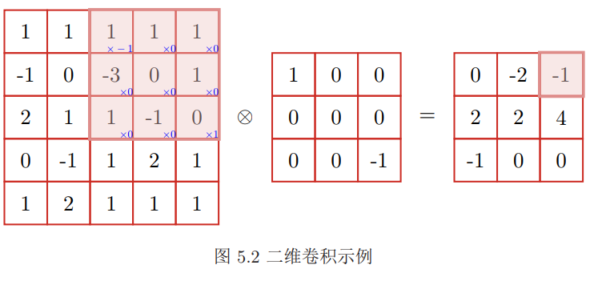

卷积的主要功能是在一个图像或某种特征上滑动一个卷积核即滤波器，通过卷积操作得到一组新的特征。在计算卷积的过程中，需要进行卷积核翻转。在具体实现上，一般会以互相关操作来代替卷积，从而会减少一些不必要的操作或开销。互相关是一个衡量两个序列相关性的函数，通常是用滑动窗口的点积计算来实现。给定一个图像$X ∈ R^{M×N}$和卷积核$W ∈ R^{m×n}$，它们的互相关为
$$
y_{i j}=\sum_{u=1}^{m} \sum_{v=1}^{n} w_{u v} \cdot x_{i+u-1, j+v-1}
$$
也可以记为：$Y=W \otimes X$

为了实现上的方便起见，我们用互相关来代替卷积。互相关和卷积的区别在于卷积核仅仅是否进行翻转。因此互相关也可以称为不翻转卷积。 

在卷积的标准定义基础上，还可以引入滤波器的滑动步长和零填充来增加卷积的多样性，可以更灵活地进行特征抽取。

窄卷积：步长$s = 1$，两端不补零$p = 0$，卷积后输出长度为$n − m + 1$。
宽卷积：步长$s = 1$，两端补零$p = m − 1$，卷积后输出长度$n + m − 1$。
等宽卷积：步长$s = 1$，两端补零$p = (m −1)/2$，卷积后输出长度$n$。

根据卷积的定义，卷积层有两个很重要的性质:

**局部连接**在卷积层（假设是第$l $层）中的每一个神经元都只和下一层（第$l − 1$层）中某个局部窗口内的神经元相连，构成一个局部连接网络。

**权重共享**作为参数的滤波器$w^{(l)}$ 对于第$l$层的所有的神经元都是相同的。

##### 卷积的数学性质

$$
W \tilde{\otimes} X \triangleq W \otimes \tilde{X}
$$

其中为$\tilde{\otimes} $宽卷积操作。宽卷积具有交换性，即
$$
W \tilde{\otimes} X=X \tilde{\otimes} W
$$

###### 导数

假设$Y=W \otimes X$，其中$X \in \mathbb{R}^{M \times N}, W \in \mathbb{R}^{m \times n}, Y \in \mathbb{R}^{(M-m+1) \times(N-n+1)}$，函数$f(Y ) ∈ R$为一个标量函数，则
$$
\begin{aligned} \frac{\partial f(Y)}{\partial w_{u v}} &=\sum_{i=1}^{M-m+1 N-n+1} \frac{\partial y_{i j}}{\partial w_{u v}} \frac{\partial f(Y)}{\partial y_{i j}} \\ &=\sum_{i=1}^{M-m+1} \sum_{j=1}^{N-n+1} x_{i+u-1, j+v-1} \frac{\partial f(Y)}{\partial y_{i j}} \\ &=\sum_{i=1}^{M-m+1} \sum_{j=1}^{N-n+1} \frac{\partial f(Y)}{\partial y_{i j}} x_{u+i-1, v+j-1} \end{aligned}
$$

$$
\frac{\partial f(Y)}{\partial W}=\frac{\partial f(Y)}{\partial Y} \otimes X
$$

$$
\begin{aligned} \frac{\partial f(Y)}{\partial x_{s t}} &=\sum_{i=1}^{M-m+1} \sum_{j=1}^{N-n+1} \frac{\partial y_{i j}}{\partial x_{s t}} \frac{\partial f(Y)}{\partial y_{i j}} \\ &=\sum_{i=1}^{M-m+1} \sum_{j=1}^{N-n+1} w_{s-i+1, t-j+1} \frac{\partial f(Y)}{\partial y_{i j}} \end{aligned}
$$

其中当$(s − i + 1) < 1$，或$(s − i + 1) > m$，或$(t − j + 1) < 1$，或$(t − j + 1) > n$
时，$w_{s−i+1,t−j+1} = 0$。即相当于对W 进行了$p = (M − m, N − n)$的零填充。
$$
\begin{aligned} \frac{\partial f(Y)}{\partial X} &=\operatorname{rot} 180\left(\frac{\partial f(Y)}{\partial Y}\right) \tilde{\otimes} W \\ &=\operatorname{rot} 180(W) \tilde{\otimes} \frac{\partial f(Y)}{\partial Y} \end{aligned}
$$
其中$rot180(·)$表示旋转$180$度。

#### 卷积层

输入特征映射组：$X ∈ R^{M×N×D}$为三维张量，其中每个切片矩阵$X^d ∈ R^{M×N}$为一个输入特征映射，$1 ≤ d ≤ D$
 输出特征映射组：$Y ∈ R^{M′×N′×P}$为三维张量，其中每个切片矩阵$Y^p ∈R^{M′×N′}$ 为一个输出特征映射，$1 ≤ p ≤ P$；
卷积核：$W ∈ R^{m×n×D×P}$为四维张量，其中每个切片矩阵$W_{p,d}∈ R^{m×n}$为一个两维卷积核，$1 ≤ d ≤ D, 1 ≤ p ≤ P$。

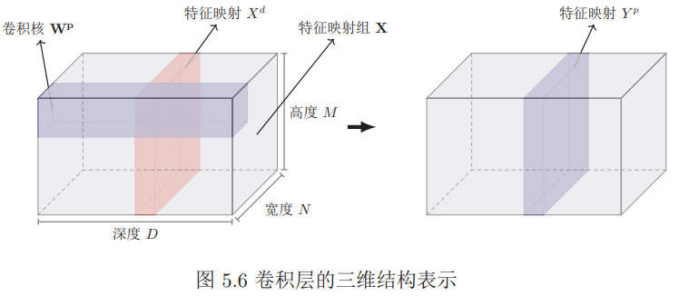
$$
\begin{aligned} Z^{p} &=\mathbf{W}^{p} \otimes \mathbf{X}+b^{p}=\sum_{d=1}^{D} W^{p, d} \otimes X^{d}+b^{p} \\ Y^{p} &=f\left(Z^{p}\right) \end{aligned}
$$
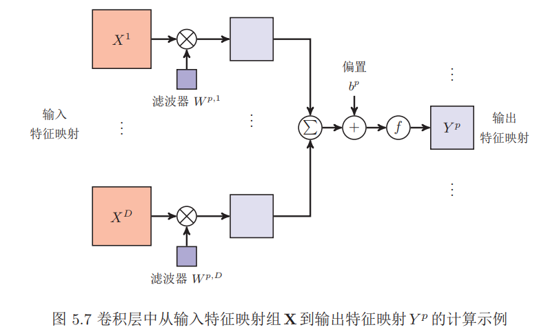

#### 池化层

其作用是进行特征选择，降低特征数量，并从而减少参数数量。

假设汇聚层的输入特征映射组为$X ∈ R^{M×N×D}$，对于其中每一个特征映射$X^d$，将其划分为很多区域$R^d{m,n}, 1 ≤ m ≤ M′, 1 ≤ n ≤ N′$，这些区域可以重叠，也可以不重叠。汇聚 (Pooling) 是指对每个区域进行下采样得到一个值，作为这个区域的概括。

最大汇聚：$Y_{m, n}^{d}=\max _{i \in R_{m, n}^{d}} x_{i}$；平均汇聚：$Y_{m, n}^{d}=\frac{1}{\left|R_{m, n}^{d}\right|} \sum_{i \in R_{m, n}^{d}} x_{i}$

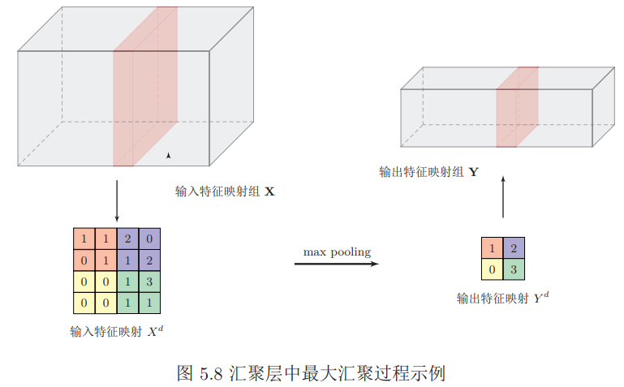

#### 参数学习

在全连接前馈神经网络中，梯度主要通过每一层的误差项$δ$进行反向传播，并进一步计算每层参数的梯度。

不失一般性，对第$l$层为卷积层，第$l − 1 $层的输入特征映射为 $X^{(l−1)} ∈R^{M×N×D}$，通过卷积计算得到第$l $层的特征映射净输入$Z
^{(l)} ∈ R^{M′×N′×P}$。第$l$层的第$p(1 ≤ p ≤ P)$个特征映射净输入。
$$
Z^{(l, p)}=\sum_{d=1}^{D} W^{(l, p, d)} \otimes X^{(l-1, d)}+b^{(l, p)}
$$
其中$W^{(l,p,d)}$ 和$b^{(l,p)}$ 为卷积核以及偏置。第$l$层中共有$P × D $个卷积核和$P $个偏置，可以分别使用链式法则来计算其梯度。
$$
\begin{aligned} \frac{\partial \mathcal{L}(Y, \hat{Y})}{\partial W^{(l, p, d)}} &=\frac{\partial \mathcal{L}(Y, \hat{Y})}{\partial Z^{(l, p)}} \otimes X^{(l-1, d)} \\ &=\delta^{(l, p)} \otimes X^{(l-1, d)} \end{aligned}
$$
其中$\delta^{(l, p)}=\frac{\partial \mathcal{L}(Y, \hat{Y})}{\partial Z^{(l, p)}}$为损失函数关于第$l$层的第$p$个特征映射的净输入$Z^{(l,p)}$的偏导数。

同理可得，损失函数关于第$l$层的第$p$个偏置$b^{(l,p)}$的偏导数为
$$
\frac{\partial \mathcal{L}(Y, \hat{Y})}{\partial b^{(l, p)}}=\sum_{i, j}\left[\delta^{(l, p)}\right]_{i, j}
$$

##### 误差项计算

汇聚层当第$l + 1$层为汇聚层时，因为汇聚层是下采样操作，$l + 1$层的每个神经元的误差项 $δ $对应于第 $l $层的相应特征映射的一个区域。$l $层的第$ p $个特征映射中的每个神经元都有一条边和$ l + 1 $层的第$ p$ 个特征映射中的一个神经元相连。根据链式法则，第$l $层的一个特征映射的误差项$δ^{(l,p)}$，只需要将$l + 1$层对应特征映射的误差项$δ^{(l+1,p)}$ 进行上采样操作（和第$l $层的大小一样），再和$l$ 层特征映射的激活值偏导数逐元素相乘，就得到了$^{δ(l,p)}$。

第$l $层的第$p$个特征映射的误差项$^{δ(l,p)}$的具体推导过程如下
$$
\begin{aligned} \delta^{(l, p)} & \triangleq \frac{\partial \mathcal{L}(Y, \hat{Y})}{\partial Z^{(l, p)}} \\ &=\frac{\partial X^{(l, p)}}{\partial Z^{(l, p)}} \cdot \frac{\partial Z^{(l+1, p)}}{\partial X^{(l+1, p)}} \cdot \frac{\partial \mathcal{L}(Y, \hat{Y})}{\partial Z^{(l+1, p)}} \\ &=f_{l}^{\prime}\left(Z^{(l, p)}\right) \odot \mathbf{u p}\left(\delta^{(l+1, p)}\right) \end{aligned}
$$
其中$f′_l(·)$为第$l$层使用的激活函数导数，$\mathbf{up}$为上采样函数，与汇 聚层中使用的下采样操作刚好相反。如果下采样是最大汇聚，误差项 $^{δ(l+1,p)}$中每个值会直接传递到上一层对应区域中的最大值所对应的神经元，该区域中其它神经元的误差项的都设为0。如果下采样是平均汇聚，误差项$^{δ(l+1,p)}$中每个值会被平均分配到上一层对应区域中的所有神经元上。

卷积层当$l + 1$层为卷积层时，假设特征映射净输入$Z^{(l+1)} ∈ R^{M′×N′×P}$，其中第$p(1 ≤ p ≤ P)$个特征映射净输入
$$
Z^{(l+1, p)}=\sum_{d=1}^{D} W^{(l+1, p, d)} \otimes X^{(l, d)}+b^{(l+1, p)}
$$
其中$W^{(l+1,p,d)}$ 和$b^{(l+1,p)}$ 为第$l+1$层的卷积核以及偏置。第$l+1$层中共有$P ×D$个卷积核和$P$ 个偏置。

第$l $层的第$d$个特征映射的误差项$^{δ(l,d)}$ 的具体推导过程如下:
$$
\begin{aligned} \delta^{(l, d)} & \triangleq \frac{\partial \mathcal{L}(Y, \hat{Y})}{\partial Z^{(l, d)}} \\ &=\frac{\partial X^{(l, d)}}{\partial Z^{(l, d)}} \cdot \frac{\partial \mathcal{L}(Y, \hat{Y})}{\partial X^{(l, d)}} \\ &=f_{l}^{\prime}\left(Z^{(l)}\right) \odot \sum_{p=1}^{P}\left(\operatorname{rot} 180\left(W^{(l+1, p, d)}\right) \tilde{\otimes} \frac{\partial \mathcal{L}(Y, \hat{Y})}{\partial Z^{(l+1, p)}}\right) \\ &=f_{l}^{\prime}\left(Z^{(l)}\right) \odot \sum_{p=1}^{P}\left(\operatorname{rot} 180\left(W^{(l+1, p, d)}\right) \tilde{\otimes} \delta^{(l+1, p)}\right) \end{aligned}
$$
**连接表**卷积层的每一个输出特征映射都依赖于所有输入特征映射，相当于卷积层的输入和输出特征映射之间是全连接的关系。实际上，这种全连接关系不是必须的。我们可以让每一个输出特征映射都依赖于少数几个输入特征映射。定义一个连接表$T$ 来描述输入和输出特征映射之间的连接关系。如果第$p$个输出特征映射依赖于第$d$个输入特征映射，则$T_{p,d} = 1$，否则为$0$。
$$
Y^{p}=f\left(\sum_{d,\\T_{p, d}=1} W^{p, d} \otimes X^{d}+b^{p}\right)
$$
其中$T$ 为$P × D$ 大小的连接表。假设连接表$T $的非零个数为$K$，每个滤波器的大小为$m × n$，那么共需要$K × m × n + P $参数

#### 卷积神经网络

卷积神经网络是指那些至少在网络的某一层中使用了卷积运算来代替一般的矩阵乘法运算的神经网络。

离散卷积可以视作输入矩阵与一个特殊的核矩阵的乘法。对于一维的离散卷积，核矩阵的每一行必须和上一行移动一个元素后相等。这种类型的矩阵叫做`Toeplitz`矩阵。对于二维的离散卷积，核矩阵对应着一个双重块循环矩阵。该矩阵大部分元素相等，且非常稀疏。

假设有两个长度分别为$M$和$N$的序列$x(i)$和$w(i)$， 则一维卷积为：$s(i)=x(i) * w(i)=\sum_{j} x(j) w(i-j)$。卷积的长度为$L=M+N-1$。首先用0扩充序列$x, w$:
$$
x_{p}(i)=\left\{\begin{array}{ll}{x(i)} & {, 0 \leq i \leq M-1} \\ {0} & {, M-1<i \leq L-1}\end{array}\right.\\
w_{p}(i)=\left\{\begin{array}{ll}{w(i)} & {, 0 \leq i \leq N-1} \\ {0} & {, N-1<i \leq L-1}\end{array}\right.
$$
由于用$w$取卷积$x$，因此构造$w$的循环矩阵：
$$
\mathbf{W}=\left[\begin{array}{ccccc}{w_{p}(0)} & {w_{p}(L-1)} & {w_{p}(L-2)} & {\dots} & {w_{p}(1)} \\ {w_{p}(1)} & {w_{p}(0)} & {w_{p}(L-1)} & {\dots} & {w_{p}(2)} \\ {\vdots} & {\vdots} & {\vdots} & {\ddots} & {\vdots} \\ {w_{p}(L-1)} & {w_{p}(L-2)} & {w_{p}(L-3)} & {\cdots} & {w_{p}(0)}\end{array}\right]
$$

$$
\overrightarrow{\mathbf{s}}=\mathbf{W} \cdot x_{p}=\left[\begin{array}{cccc}{w_{p}(0)} & {w_{p}(L-1)} & {w_{p}(L-2)} & {\cdots} & {w_{p}(1)} \\ {w_{p}(1)} & {w_{p}(0)} & {w_{p}(L-1)} & {\dots} & {w_{p}(2)} \\ {\vdots} & {\vdots} & {\vdots} & {\vdots} \\ {w_{p}(L-1)} & {w_{p}(L-2)} & {w_{p}(L-3)} & {\cdots} & {w_{p}(0)}\end{array}\right] \cdot\left[\begin{array}{c}{x_{p}(0)} \\ {x_{p}(1)} \\ {\vdots} \\ {x_{p}(L-1)}\end{array}\right]
$$

###### 二维卷积和矩阵乘法

$\mathbf{S}(i, j)=(\mathbf{I} * \mathbf{K})(i, j)=\sum_{m} \sum_{n} \mathbf{I}(m, n) \mathbf{K}(i-m, j-n)$先将$\mathbf{I}$, $\mathbf{K}$扩充到$M\times N$维：$M=M_I+M_K-1, N=N_I+N_K-1$。扩充之后的新矩阵为$\mathbf{I}_p, \mathbf{K}_p$。其中：
$$
\mathbf{I}_{p}=\left[\begin{array}{ccccccc}{I_{1,1}} & {I_{1,2}} & {\cdots} & {I_{1, N_{I}}} & {0} & {\cdots} & {0} \\ {I_{2,1}} & {I_{2,2}} & {\cdots} & {I_{2, N_{I}}} & {0} & {\cdots} & {0} \\ {\vdots} & {\vdots} & {\ddots} & {\vdots} & {0} & {\cdots} & {0} \\ {I_{M_{l}, 1}} & {I_{M_{l}, 2}} & {\cdots} & {I_{M, N_{I}}} & {0} & {\cdots} & {0} \\ {0} & {0} & {\cdots} & {0} & {0} & {\cdots} & {0} \\ {\vdots} & {\vdots} & {\ddots} & {\vdots} & {\vdots} & {\ddots} & {\vdots} \\ {0} & {0} & {\cdots} & {0} & {0} & {\cdots} & {0}\end{array}\right]
$$

$$
\mathbf{K}_{p}=\left[\begin{array}{ccccccc}{K_{1,1}} & {K_{1,2}} & {\cdots} & {K_{1, N_{K}}} & {0} & {\cdots} & {0} \\ {K_{2,1}} & {K_{2,2}} & {\cdots} & {K_{2, N_{K}}} & {0} & {\cdots} & {0} \\ {\vdots} & {\vdots} & {\ddots} & {\vdots} & {0} & {\cdots} & {0} \\ {K_{M_{K}, 1}} & {K_{M_{K}, 2}} & {\cdots} & {K_{M_{K}, N_{K}}} & {0} & {\cdots} & {0} \\ {0} & {0} & {\cdots} & {0} & {0} & {\cdots} & {0} \\ {\vdots} & {\vdots} & {\ddots} & {\vdots} & {\vdots} & {\ddots} & {\vdots} \\ {0} & {0} & {\cdots} & {0} & {0} & {\cdots} & {0}\end{array}\right]
$$

用$\mathbf{I}_p$构造一个列向量$f_p$：将$\mathbf{I}_p$的第一行转置之后将其成为$f_p$的前$N$个元素；接下来是第二行的转置....第$M$行的转置。
$$
f_{p}=\left(I_{1,1}, I_{1,2}, \cdots, I_{1, N_{I}}, 0, \cdots, I_{M_{I}, 1}, I_{M_{I}, 2}, \cdots, I_{M_{I}, N_{I}}, 0, \cdots\right)^{T}
$$
将$\mathbf{K}_{p}$中的每一行，都按照一维卷积中介绍的循环矩阵生成的方法构成一个$N\times N$的循环矩阵。这些矩阵记做：$\mathbf{G}_{1}, \mathbf{G}_{2}, \cdots \mathbf{G}_{M}$。
$$
\mathbf{G}_{m}=\left[\begin{array}{cccc}{K_{m, 1}} & {0} & {\cdots} & {K_{m, 2}} \\ {K_{m, 2}} & {K_{m, 1}} & {\cdots} & {K_{m, 3}} \\ {\vdots} & {\vdots} & {\ddots} & {\vdots} \\ {K_{m, N_{K}}} & {K_{m, N_{K}-1}} & {\cdots} & {0} \\ {0} & {K_{m, N_{K}}} & {\cdots} & {0} \\ {\vdots} & {\vdots} & {\ddots} & {\vdots} \\ {0} & {0} & {\cdots} & {K_{m, 1}}\end{array}\right], \quad m=1,2, \cdots, M
$$
用这些循环矩阵构造一个大的块循环矩阵：
$$
\mathbf{G}_{b}=\left[\begin{array}{cccc}{\left[\mathbf{G}_{1}\right]} & {\left[\mathbf{G}_{M}\right]} & {\cdots} & {\left[\mathbf{G}_{2}\right]} \\ {\left[\mathbf{G}_{2}\right]} & {\left[\mathbf{G}_{1}\right]} & {\cdots} & {\left[\mathbf{G}_{3}\right]} \\ {\vdots} & {\vdots} & {\ddots} & {\vdots} \\ {\left[\mathbf{G}_{M}\right]} & {\left[\mathbf{G}_{M-1}\right]} & {\cdots} & {\left[\mathbf{G}_{1}\right]}\end{array}\right]
$$
计算：$h_{b}=\mathbf{G}_{b} \cdot f_{p}$。将$h_b$的结果分配到$\mathbf{S}$的各行与构造$f_p$相反的过程，即得到二维卷积。

单个卷积核只能提取一种类型的特征。如果希望卷积层能够提取多个特征，则可以并行使用多个卷积核，每个卷积核提取一种特征。我们称输出的`feature map` 具有多个通道`channel` 。`feature map` 特征图是卷积层的输出的别名，它由多个通道组成，每个通道代表通过卷积提取的某种特征

###### 输入填充

对输入$\mathbf{V}$有三种填充零的方式：`valid` 填充、`same` 填充、`full` 填充。`valid` 填充：不使用零来填充输入，卷积核只允许访问那些图像中能完全包含整个核的位置。在`valid` 填充模式中，输出的大小在每一层都缩减。假设核的宽度是$k$，则每经过一层，输出的宽度减少了$k-1$。如果输入图像的宽度是$m$，则网络经过了$d$层之后，输出的宽度变成$m-(k-1)\times d$。如果核的宽度$k$非常大时，缩减非常明显。最终网络会缩减到 1。

`same` 填充：使用足够的零来填充，使得输出和输入保持相同的大小。这是最常见的填充方式。在`same`填充模式中，网络可以包含任意多的卷积层，因为它不存在网络输出宽度缩减的问题。`same` 填充模式的一个问题是：输入的边缘单元可能存在一定程度上的欠表达。因为输入的中间区域的单元的影响域为全部的输出单元，这意味着这些输入单元的信息会被很多输出单元所编码。而输入的边缘区域的单元的影响域只是输出单元的一部分，这意味着这些输入单元的信息仅仅被少量输出单元所编码。

`full` 填充：在输入的两端各填充$k-1$个零，使得每个输入单元都恰好被卷积核访问$k$次。其中$k$为卷积核的宽度。它将从卷积核和输入开始相交的时候开始做卷积。假设核的宽度是$k$，则每经过一层，输出的宽度增加了$k-1$。如果输入图像的宽度是$m$，则网络经过了$d$层之后，输出的宽度变成$m+(k-1)\times d$。它使得输入的边缘单元也能够得到充分表达。

##### 卷积层

传统的网络层是全连接的，使用矩阵乘法来建立输入与输出的连接关系。矩阵的每个参数都是独立的，它描述了每个输入单元与输出单元的交互。这意味着每个输出单元与所有的输入单元都产生关联。卷积层通过使用核矩阵来实现稀疏交互，每个输出单元仅仅与少量的输入单元产生关联。这降低了网络的参数和计算量，不仅减少了模型的存储需求，也降低了计算复杂度。

参数共享：在模型的多个位置使用相同的参数。传统的全连接层中，权重矩阵不同位置处的参数相互独立。卷积层中，同一个核会在输入的不同区域做卷积运算。核函数会在输入的不同区域之间共享，这些区域的大小就是核函数的大小。

如果一个函数满足：输入发生改变，输出也以同样的方式改变，则称它是等变的。如果函数$f(x), g(x)$满足$f(g(x))=g(f(x))$，则称$f(x)$对于变换$g$具有等变性。对于卷积层，它具有平移等变的性质：如果$g$是输入的任何一个平移函数，则下面的两个操作的结果是相同的：先对图片进行卷积之后，再对结果应用平移函数  先对图片应用平移函数  ，再对图片进行卷积

##### 基本卷积的变体

###### 局部连接

局部连接与卷积很类似：局部连接也是连接受限的，但是每个连接都有自己的权重。即：局部连接实现了稀疏交互，但是没有实现参数共享。

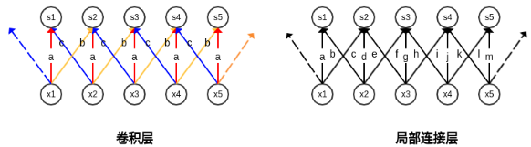

###### 拼接卷积

拼接卷积 对卷积和局部连接进行了折中：学习一组核，使得当核在空间移动时，它们可以循环利用。

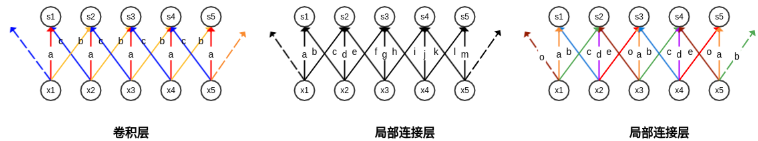

拼接卷积在相邻的位置上拥有不同的过滤器，就像局部连接层一样。拼接卷积每隔一定的位置，使用相同的过滤器，就像卷积层一样。拼接卷积的参数仅仅会增长常数倍，常数就是过滤器集合的大小。

###### 分组卷积

分组卷积：将多个卷积核拆分为分组，每个分组单独执行一系列运算之后，最终在全连接层再拼接在一起。

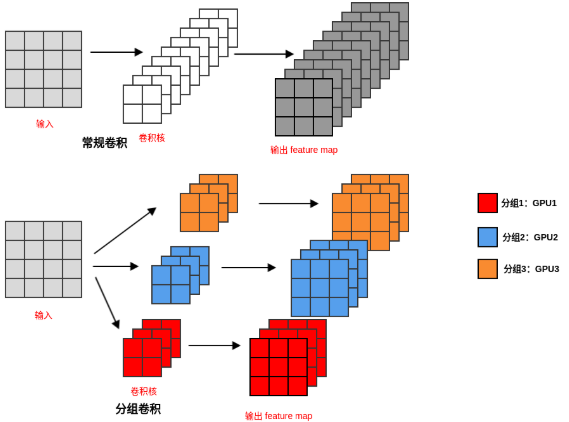

假设输入具有$C_I$的输入通道、宽/高分别为$W_I, H_I$，假设卷积核的宽/高分别为$W_K, H_K$，有$C_O$个卷积核。则：参数数量： $W_{K} \times H_{K} \times C_{I} \times C_{O}$。计算量：$W_{K} \times H_{K} \times C_{I} \times W_{O} \times H_{O} \times C_{O}$。假设采用分组卷积，将输入通道分成了$G$组，则分组之后：参数数量：$G \times W_{K} \times H_{K} \times \frac{C_{I}}{G} \times \frac{C_{O}}{G}$计算量以一次`乘-加`计算为单位：$G \times W_{K} \times H_{K} \times \frac{C_{T}}{G} \times W_{O} \times H_{O} \times \frac{C_{0}}{G}$。

###### 小卷积核替代

卷积核的尺寸越大，则看到的图片信息越多，因此获得的特征会越好。但是卷积核的尺寸越大，模型的参数数量会爆涨，不利于模型的深度的增加，计算量和存储量也大幅上升。卷积核的尺寸越小，模型的参数数量越少，模型可以越深。但是卷积核的尺寸太小，则只能看到图片的一个非常小的局部区域，获得的特征越差。一种解决方案是：用多个小卷积层的堆叠来代替较大的卷积核。假设大卷积核的宽度是$k$，则每经过一层，输出的宽度减少了$k-1$。假设希望通过$n$个宽度为$k^{\prime}$的小卷积核来代替，则为了保持输出的大小一致，需要满足：$k-1=n\left(k^{\prime}-1\right)$

用多个小卷积层的堆叠代替一个大卷积层的优点：可以实现与大卷积层相同的感受野。具有更大的非线性，网络表达能力更强。虽然卷积是线性的，但是卷积层之后往往跟随一个`ReLU` 激活函数。这使得多个小卷积层的堆叠注入了更大的非线性。具有更少的参数数量。小卷积层堆叠的缺点是：加深了网络的深度，容易引发梯度消失等问题，从而使得网络的训练难度加大。用多个小卷积层的堆叠代替一个大卷积层可以看作是一种正则化：要求大卷积核通过多个小卷积核进行分解。感受野：一个特定的`CNN` 输出单元在输入空间所受影响的区域。上图中，染色的区域为某个输出单元的感受野。一个感受野可以用中心位置和大小来表示。用多个小卷积核来代替大卷积核时，输出单元的感受野不会受到影响。

###### 非对称卷积核

在卷积核分解过程中，还有一种分解方式：非对称卷积核分解，将`nxn` 卷积替换为`1xn` 卷积和`nx1` 卷积。

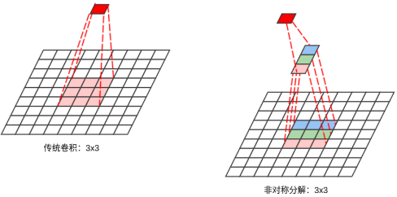

非对称卷积核的分解有以下优点：感受野保持不变。节省计算成本，尤其是当`n` 较大时。假设输入通道数和输出通道数都为$C$，原始卷积`nxn` 的参数数量为：$n \times n \times C \times C=n^{2} C^{2}$。假设非对称卷积的`1xn` 的输出通道数也是$C$，则非对称分解时参数数量为：$1 \times n \times C \times C+n \times 1 \times C \times C=2 n C^{2}$。它是原始卷积的参数数量的$\frac{2}{n}$。

###### 多尺寸卷积核

由于信息区域的巨大差异，为卷积操作选择合适的卷积核尺寸就非常困难。信息分布更具有全局性的图像中，更倾向于使用较大的卷积核。信息分布更具有局部性的图像中，更倾向于使用较小的卷积核。一个解决方案是：分别使用多个不同尺寸的卷积核从而获得不同尺度的特征。然后将这些特征拼接起来。通过多种尺度的卷积核，无论感兴趣的信息区域尺寸多大，总有一种尺度的卷积核与之匹配。这样总可以提取到合适的特征。

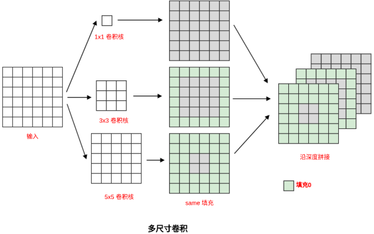

###### $1 \times 1$卷积核

`1x1` 卷积并不是复制输入，它会进行跨通道的卷积。它有三个作用：实现跨通道的信息整合。进行通道数的升维和降维。在不损失分辨率的前提下，大幅增加非线性。

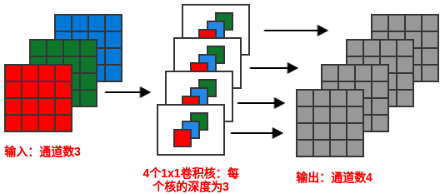

假设输入张量为$\mathbf{I} \in \mathbb{R}^{\left(C_{I} \times W_{I} \times H_{I}\right)}$。如果图片直接通过一个宽度为$W_K$，高度为$H_K$、输出通道为$C_O$的卷积层，则参数数量为：$C_{I} \times C_{O} \times W_{K} \times H_{K}$。如果图片先通过一个`1x1`、输出通道为$\sqrt{C_O}$的卷积层，再经过一个$W_K\times H_K$、输出通道为$\sqrt{C_O}$的卷积层；最后经过一个`1x1`、输出通道为$C_O$的卷积层。则参数数量为：$C_{I} \sqrt{C_{O}}+W_{K} H_{K} C_{O}+C_{O}^{3 / 2}$

`1x1` 卷积层通常会形成瓶颈层`bottleneck layer` 。瓶颈层指的是网络中信息被压缩的层。输入`feature map` 先经过`1x1` 卷积的压缩，这会导致该段信息容量的下降；然后经过常规卷积，此段信息容量不变；最后经过`1x1` 卷积的膨胀，恢复了信息容量。整体而言模型的信息容量很像一个`bottleneck`，因此`1x1` 卷积层也被称作瓶颈层。

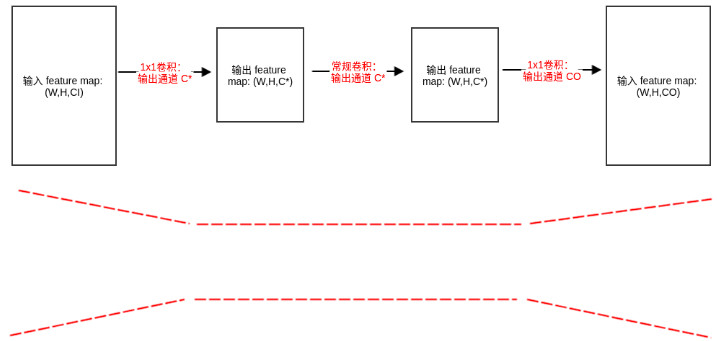

事实上，不仅`1x1` 卷积层会形成`bottleneck`，任何会降低模型信息容量的层都会形成瓶颈。因此在卷积神经网络中，通常每经过一个卷积层，输出尺寸减半、输出通道数翻倍。瓶颈层中的信息膨胀阶段不是必须存在，通常信息膨胀过程是为了保持整个瓶颈层的输入尺寸、输出尺寸满足某些约束。

###### $\text{DepthWise}$卷积

标准的卷积会考虑所有的输入通道，而`DepthWise` 卷积会针对每一个输入通道进行卷积操作，然后接一个`1x1` 的跨通道卷积操作。

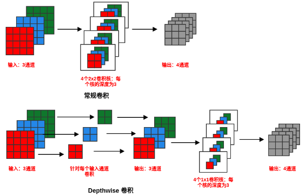

###### 通道混洗分组卷积

在分组卷积中，特征的通道被平均分配到不同的分组中。如果融合的时刻非常靠后，则对模型的泛化性相当不利，因为如果能在早期知道其它通道的一些信息，则很可能得到更有效的特征。通道混洗分组卷积在每一次分组卷积之后执行一次通道混洗，被混洗过的通道被分配到不同的分组中。经过通道混洗之后，每个分组输出的特征能够考虑到更多的通道，因此输出特征的表达能力更强。

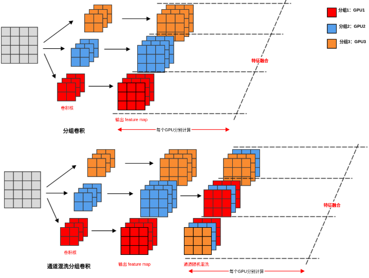

###### 通道加权卷积

在常规卷积中，各通道产生的特征都是不分权重直接结合的。通道加权卷积中，不同的通道具有不同的权重，各通道产生的特征经过加权之后再结合。所用到的权重是输入的函数。`SEnet`（`Squeeze-and-Excitation Networks`）网络大量使用通道加权卷积。在`SEnet` 中存在三个关键的操作：`Squeeze` 操作：沿着空间维度压缩特征，将每个二维的`feature map` 通道压缩成一个实数。该实数具有全局的感受野，表征了在该`feature map` 通道上响应的全局分布。`Excitation` 操作：通过一个类似循环神经网络中的门机制，用一个`sigmoid` 激活函数的全连接层获取每个`feature map` 通道的权重。`Reweight` 操作：将特征通道的权重通过乘法逐通道的加权到先前的`feature map` 上。

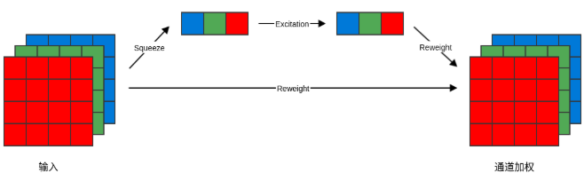

###### 空洞卷积

空洞卷积：对于空洞数为$d$的空洞卷积，卷积结果为：
$$
\mathbf{S}(i, j)=\sum_{m} \sum_{n} \mathbf{I}(i+m(d+1)+1, j+n(d+1)+1) \mathbf{K}(m, n)
$$
它实际上等价于一个卷积核为$(d+1)\times K +1$的新的卷积核，其中$K$为当前卷积核的大小。新的卷积核的特点是：每隔$d$个位置，权重非零；否则权重为零。另外首行、首列、尾行、尾列权重均为零。$d+1$称作膨胀比。

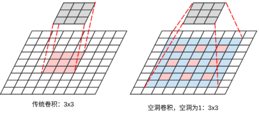

空洞卷积的优点：在不做池化损失信息的情况下，加大感受野，让每个卷积的输出都包含较大范围的信息。

空洞卷积的缺点：网格效应(`Gridding Effect` )。如果仅仅多次叠加多个 `dilation rate=2` 的 `3x3` 的卷积核时，会发现：并不是所有的输入像素都得到计算，也就是卷积核不连续。长距离信息可能与任务无关。采用空洞卷积可能对大物体的分割有效果，但是对于小物体的分割可能没有好处。

为了解决空洞卷积的缺点，人们提出了一种混合空洞卷积的结构`Hybrid Dilated Convolution:HDC`。该结构有三个特性：叠加的空洞卷积的`dilation rate` 不能有大于1的公约数。这是为了对抗网格效应。将`dilation rate` 设计成锯齿状结构。这是为了同时满足小物体、大物体的分割要求。如`[1,2,5,1,2,5]` 的循环结构。最后一层的空洞卷积的`dilation rate` 最大，且`dilation rate` 小于等于卷积核的大小。这也是为了对抗网格效应。