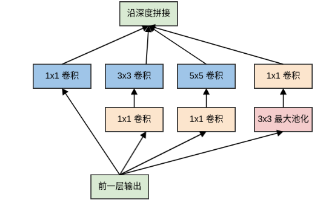
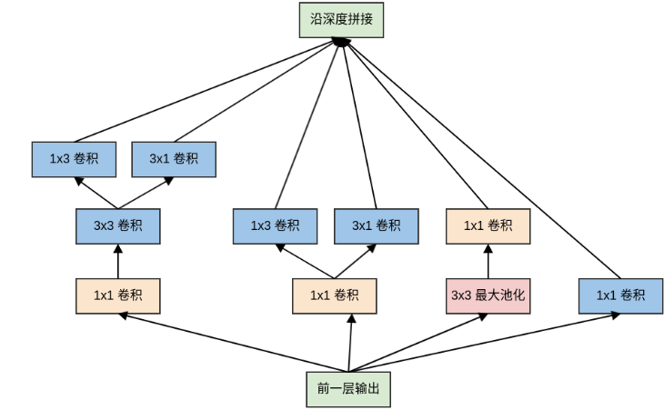

##### `AlexNet`

###### 设计技巧

`AlexNet` 中使用的数据集增强手段：随机裁剪、随机水平翻转：原始图片的尺寸为`256xx256`，裁剪大小为`224x224`。

- 每一个`epoch` 中，对同一张图片进行随机性的裁剪，然后随机性的水平翻转。理论上相当于扩充了数据集$(256-224)^2\times 2=2048$倍。
- 在预测阶段不是随机裁剪，而是固定裁剪图片四个角、一个中心位置，再加上水平翻转，一共获得 10 张图片。用这10张图片的预测结果的均值作为原始图片的预测结果。

`PCA` 降噪：对`RGB`空间做`PCA` 变换来完成去噪功能。同时在特征值上放大一个随机性的因子倍数，从而保证图像的多样性。每一个`epoch` 重新生成一个随机因子。先使用PCA对图像进行降维，然后再恢复，就可以完成降噪过程。

`AlexNet` 的预测方法存在两个问题：这种固定裁剪四个角、一个中心的方式，把图片的很多区域都给忽略掉了。很有可能一些重要的信息就被裁剪掉；裁剪窗口重叠，这会引起很多冗余的计算。

改进的思路是：执行所有可能的裁剪方式，对所有裁剪后的图片进行预测。将所有预测结果取平均，即可得到原始测试图片的预测结果；减少裁剪窗口重叠部分的冗余计算。

具体做法为：将全连接层用等效的卷积层替代，然后直接使用原始大小的测试图片进行预测。将输出的各位置处的概率值按每一类取平均（或者取最大），则得到原始测试图像的输出类别概率。

`LRN` 的思想：输出通道$i$在位置$(x,y)$处的输出会受到相邻通道在相同位置输出的影响。为了刻画这种影响，将输出通道$i$的原始值除以一个归一化因子。
$$
\hat{a}_{i}^{(x,y)} = \frac{a_{i}^{(x,y)}}{(k+\alpha\sum_{j=\max(0,i-n/2)}^{\min(N-1,i+n/2)}(a_j^{(x,y)})^2)^\beta}
$$
其中：$a_{i}^{(x,y)}$为输出通道$i$在位置$(x,y)$处的原始值，$\hat{a}_{i}^{(x,y)}$为归一化之后的值。$n$为影响第$i$通道的通道数量。$\alpha, \beta, k$为超参数。一般考虑$k=2, n=5, \alpha=10^{-4}, \beta=0.75$。

标准的带动量的`mini-batch` 随机梯度下降法为：

##### `VGG-Net`

`VGG-Net` 的主要贡献是：

- 证明了小尺寸卷积核（`3x3` ）的深层网络要优于大尺寸卷积核的浅层网络。
- 证明了深度对网络的泛化性能的重要性。
- 验证了尺寸抖动`scale jittering` 这一数据增强技术的有效性。

###### 优化技巧

输入预处理：通道像素零均值化。

- 先统计训练集中全部样本的通道均值：所有红色通道的像素均值$\overline{\text{Red}}$、所有绿色通道的像素均值$\overline{\text{Green}}$、所有蓝色通道的像素均值$\overline{\text{Blue}}$。
  $$
  \overline{\text{Red}} = \sum_{n}\sum_{i}\sum_{j}I_{n,0,i,j}
  $$
  假设红色通道为通道`0`，绿色通道为通道`1`，蓝色通道为通道`2` ； 遍历所有的训练样本，$i,j$遍历图片空间上的所有坐标。对每个样本：红色通道的每个像素值减去$\overline{\text{Red}}$，绿色通道的每个像素值减去$\overline{\text{Green}}$，蓝色通道的每个像素值减去$\overline{\text{Blue}}$。

  

##### `Inception`

`Inception` 网络考虑的是多种卷积核的并行计算，扩展了网络的宽度。

原始的`Inception` 模块对输入同时执行：3个不同大小的卷积操作（`1x1、3x3、5x5`）、1个最大池化操作（`3x3` ）。所有操作的输出都在深度方向拼接起来，向后一级传递。

- 三种不同大小卷积：通过不同尺寸的卷积核抓取不同大小的对象的特征。使用`1x1、3x3、5x5` 这些具体尺寸仅仅是为了便利性，事实上也可以使用更多的、其它尺寸的滤波器。
- 1个最大池化：提取图像的原始特征

原始`Inception` 模块中，模块的输出通道数量为四个子层的输出通道数的叠加。这种叠加不可避免的使得`Inception` 模块的输出通道数增加，这就增加了`Inception` 模块中每个卷积的计算量。因此在经过若干个模块之后，计算量会爆炸性增长。

解决方案是：在`3x3` 和 `5x5` 卷积层之前额外添加`1x1` 卷积层，来限制输入给卷积层的输入通道的数量。

`Inception v2` 的主要贡献是提出了`Batch Normalization` 。论文指出，使用了`Batch Normalization` 之后：可以加速网络的学习；网络具有更好的泛化能力。

`Inception v3` 的网络深度为42层，它相对于`Inception v1` 网络主要做了以下改动：

- `7x7` 卷积替换为3个`3x3` 卷积。
- 模块中的`5x5` 卷积替换为2个`3x3` 卷积，同时使用后面描述的网格尺寸缩减技术。
- 模块中的`5x5` 卷积替换为2个`3x3` 卷积之后，所有的`nxn` 卷积进行非对称分解，同时使用后面描述的网格尺寸缩减技术。

`Inception v3` 总结出网络设计的一套通用设计原则：

- 避免`representation` 瓶颈：`representation` 的大小应该从输入到输出缓缓减小，避免极端压缩。在缩小`feature map` 尺寸的同时，应该增加`feature map` 的通道数。`representation` 大小通常指的是`feature map` 的容量，即`feature map` 的`width x height x channel` 。
- 空间聚合：可以通过空间聚合来完成低维嵌入，而不会在表达能力上有较大的损失。因此通常在`nxn` 卷积之前，先利用`1x1` 卷积来降低输入维度。
- 平衡网络的宽度和深度：增加网络的宽度或者深度都可以提高网络的泛化能力，因此计算资源需要在网络的深度和宽度之间取得平衡。

卷积尺寸分解：大卷积核的分解：将大卷积核分解为多个小的卷积核；`nxn` 卷积核的非对称分解：将`nxn` 卷积替换为`1xn` 卷积和`nx1` 卷积。

##### `ResNet`

`ResNet` 提出了一种残差学习框架来解决网络退化问题，从而训练更深的网络。这种框架可以结合已有的各种网络结构，充分发挥二者的优势。

`ResNet`以三种方式挑战了传统的神经网络架构：`ResNet` 通过引入跳跃连接来绕过残差层，这允许数据直接流向任何后续层。