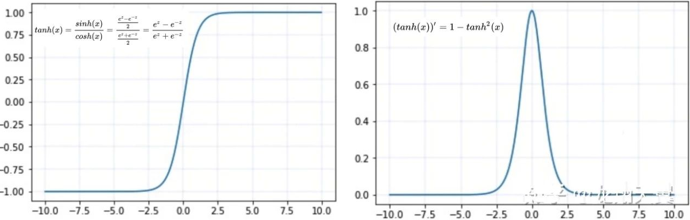
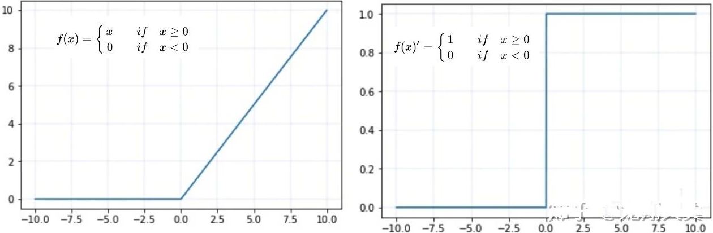
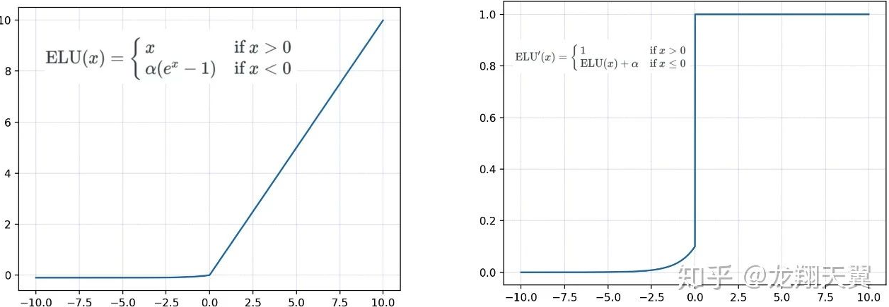
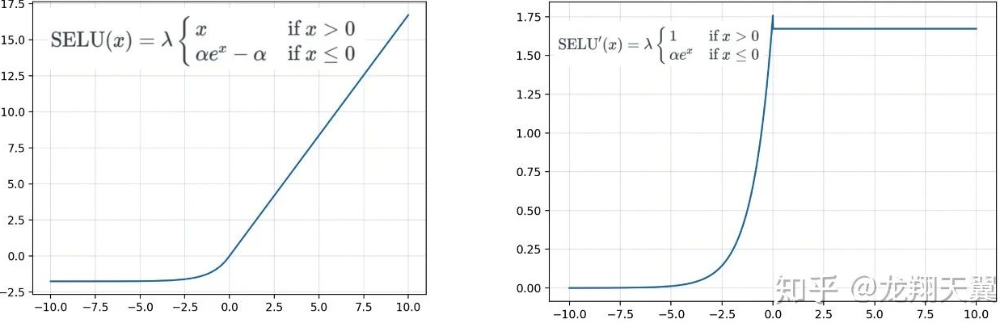
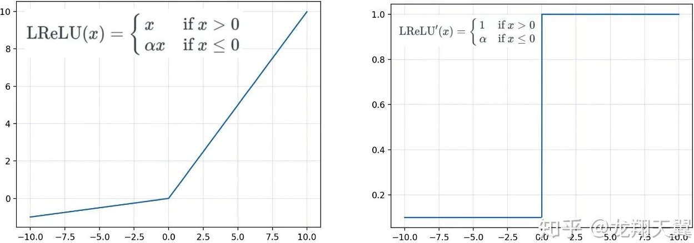
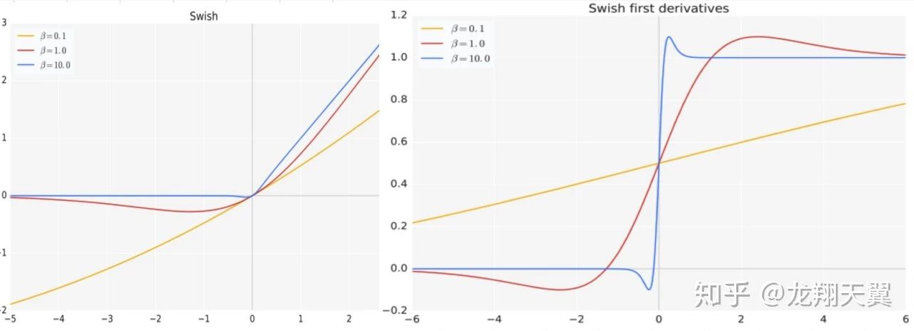

### 绪论

###### 人工智能的流派

**符号主义**是通过分析人类智能的功能，然后通过计算机来实现这些功能。符号主义有两个基本假设：信息可以用符号来表示；符号可以通过显式的规则（比如逻辑运算）来操作。人类的认知过程可以看作是符号操作过程。

**连接主义**是认知科学领域中的一类信息处理的方法和理论。在认知科学领域，人类的认知过程可以看做是一种信息处理过程。连接主义认为人类的认知过程是由大量简单神经元构成的神经网络中的信息处理过程，而不是符号运算。因此，联结主义模型的主要结构是由大量的简单的信息处理单元组成的互联网络，具有非线性、分布式、并行化、局部性计算以及适应性等特性。

###### 机器学习

机器学习是指从有限的观测数据中学习出具有一般性的规律，并将这些规律应用到未观测样本上的方法。传统的机器学习主要关注于如何学习一个预测模型。一般需要首先将数据表示为一组特征，然后将这些特征输入到预测模型，并输出预测结果。这类机器学习可以看作是浅层学习。浅层学习的一个重要特点是不涉及特征学习，其特征主要靠人工经验或特征转换方法来抽取。

上述流程中，每步特征处理以及预测一般都是分开进行处理的。传统的机器学习模型主要关注于最后一步，即构建预测函数。但是实际操作过程中，不同预测模型的性能相差不多，而前三步中的特征处理对最终系统的准确性有着十分关键的作用。

在机器学习中，很多学习算法经常会对学习的问题做一些假设，这些假设就称为归纳偏置。归纳偏置在贝叶斯学习中也经常称为先验

###### 表示学习

**表示学习**如果直接用数据的原始特征来进行预测，对机器学习模型的能力要求比较高。这些原始特征可能存在以下几种不足：特征比较单一，需要进行非线性的组合才能发挥其作用；特征之间冗余度比较高；并不是所有的特征都对预测有用；很多特征通常是易变的；特征中往往存在一些噪声。

如果有一种算法可以自动地学习出有效的特征，并提高最终机器学习模型的性能，那么这种学习就是可以叫做**表示学习**。表示学习的关键是解决语义鸿沟问题。语义鸿沟问题是指输入数据的底层特征和高层语义信息之间的不一致性和差异性。表示学习中两个核心问题：什么是好的表示？如何学到好的表示？一个好的表示应该具有很强的表示能力，即同样大小的向量可以表示更多信息。 一个好的表示应该使后续的学习任务变得简单，即需要包含更高层的语义信息。一个好的表示应该具有一般性，是任务或领域独立的。虽然目前的大部分表示学习方法还是基于某个任务来学习，但我们期望其学到的表示可以比较容易的迁移到其它任务上。

传统机器学习中，通常使用局部表示和分布式表示，以颜色表示为例。一种表示颜色的方式是以不同名字来命名不同的颜色，这种表示方式叫做局部表示，也称为离散表示或符号表示。**局部表示**通常可以表示为one-hot向量。局部表示有两个不足之处：`one-hot`向量的维数很高，且不能扩展。不能计算不同颜色之间的相似度。另一种表示颜色的方式是用$\text{RGB}$值来表示颜色，不同颜色对应到R、G、B三维空间中一个点，这种表示方式叫做**分布式表示**。

###### 深度学习

深度学习是将原始的数据特征通过多步的特征转换得到一种特征表示，并进一步输入到预测函数得到最终结果。和“浅层学习”不同，深度学习需要解决的关键问题是贡献度分配问题Credit Assignment Problem即一个系统中不同的组件或其参数对最终系统输出结果的贡献或影响。

神经网络和深度学习并不等价。深度学习可以采用神经网络模型，也可以采用其它模型。但是由于神经网络模型可以比较容易地解决贡献度分配问题，因此神经网络模型成为深度学习中主要采用的模型。

传统机器学习方法需要将一个任务的输入和输出之间人为地切割成很多子模块或多个阶段，每个子模块分开学习。这种学习方式有两个问题：一是每一个模块都需要单独优化，并且其优化目标和任务总体目标并不能保证一致。二是错误传播，即前一步的错误会对后续的模型造成很大的影响。**端到端学习**，也称端到端训练，是指在学习过程中不进行分模块或分阶段进行训练，直接优化任务的总体目标。

#### 本文架构

### 2. 基础模型

深度学习的一个重要方面是代价函数的选取。代价函数给出的是单个样本的损失，损失函数是代价函数在所有样本上的和。通常神经网络的代价函数与传统模型的代价函数相同。大多数现代的神经网络采用最大似然准则，令代价函数为负的对数似然函数。因此损失函数为：$J(\vec{\theta})=-\mathbb{E}_{\overrightarrow{\mathbf{x}}, y \sim \hat{p}_{\text {data}}} \log p_{\text {model}}(y | \overrightarrow{\mathbf{x}} ; \vec{\theta})$。$\hat{p}_{data}$为样本的经验分布：
$$
\hat{p}_{d a t a}\left(\overrightarrow{\mathbf{x}}_{i}, y_{i}\right)=\left\{\begin{array}{ll}{\frac{1}{N} \delta\left(\overrightarrow{\mathbf{x}}-\overrightarrow{\mathbf{x}}_{i}, y-y_{i}\right),} & {\left(\overrightarrow{\mathbf{x}}_{i}, y_{i}\right) \in \mathbb{D}} \\ {0,} & {\text { else }}\end{array}\right.
$$
$\delta(\cdot)$为狄拉克函数，它仅在原点处非0，在其它所有位置都为 0 ，其在整个定义域上的积分为 1 。$N$为数据集$\mathbb{D}$的大小。$p_{model}$为对数据建立的模型，$\vec{\theta}$为模型参数。代价函数的具体形式取决于$p_{model}$的形式，随不同的模型而改变。其实就是样本的经验分布$\hat{p}_{data}$与模型$p_{model}$的交叉熵 。使用最大似然准则来导出代价函数的优势是：减轻了为每个模型设计代价函数的负担。一旦明确了一个模型$p_{\text {model}}(y | \overrightarrow{\mathbf{x}})$，则自动地确定了一个代价函数$-\log p_{\operatorname{model}}(y | \overrightarrow{\mathbf{x}})$。

### 2.1. 前馈神经网络

假设一个**神经元**接受$d$个输入$x_1, x_2, · · · , x_d$，令向量$x = [x_1; x_2; · · · ; x_d]$来表示这组输入，并用净输入$z ∈ R$表示一个神经元所获得的输入 净输入也叫净活性值。 信号$x$$的加权和，
$$
\begin{aligned} z &=\sum_{i=1}^{d} w_{i} x_{i}+b \\ &=\mathbf{w}^{\mathrm{T}} \mathbf{x}+b \end{aligned}
$$
其中$w = [w_1; w_2; · · · ; w_d] ∈ R^d$是d维的权重向量，$b ∈ R$是偏置。净输入$z$在经过一个非线性函数$f(·)$后，得到神经元的活性值$a=f(z)$

#### 激活函数

激活函数需要具备以下几点性质：连续并可导允许少数点上不可导的非线性函数。可导的激活函数可以直接利用数值优化的方法来学习网络参数。激活函数及其导函数要尽可能的简单，有利于提高网络计算效率。激活函数的导函数的值域要在一个合适的区间内，不能太大也不能太小，否则会影响训练的效率和稳定性。

对于函数$f(x)$，若$x → −∞$时，其导数$f′(x) → 0$，则称其为左饱和。若$x → +∞$时，其导数$f′(x) → 0$，则称其为右饱和。当同时满足左、右饱和时，就称为两端饱和。

##### $\text{maxout}$单元

$\text{maxout}$也就做$\text{maxout}$网络。单元的输入是上一层神经元的全部原始输入，是一个向量$\mathbf{x} = [x_1; x_2; · · · , x_d]$,每个$maxout$单元有$K$个权重向量$w_k ∈ R^d$和偏置$b_k (1 ≤ k ≤ K)$。对于输入$x$，可以得到K 个净输入$z_k, 1 ≤ k ≤ K$。$ z_k = w_k^Tx+b_K$，其中$w_k = [w_{k,1}, · · · , w_{k,d}]^T$ 为第k 个权重向量。$Maxout$单元的非线性函数定义为
$$
\operatorname{maxout}(\mathbf{x})=\max _{k \in[1, K]}\left(z_{k}\right)
$$

#### 网络结构

前馈网络中各个神经元按接受信息的先后分为不同的组。每一组可以看作一个神经层。每一层中的神经元接受前一层神经元的输出，并输出到下一层神经元。整个网络中的信息是朝一个方向传播，没有反向的信息传播，可以用一个有向无环路图表示。反馈网络中神经元不但可以接收其它神经元的信号，也可以接收自己的反馈信号。和前馈网络相比，反馈网络中的神经元具有记忆功能，在不同的时刻具有不同的状态。反馈神经网络中的信息传播可以是单向或双向传递，因此可用一个有向循环图或无向图来表示。图网络是定义在图结构数据上的神经网络 。图中每个节点都一个或一组神经元构成。节点之间的连接可以是有向的，也可以是无向的。每个节点可以收到来自相邻节点或自身的信息。

#### 反向传播算法

多层前馈神经网络可以看作是一个非线性复合函数$φ : R^d → R^{d′}$，将输入$x ∈ R^d $映射到输出$φ(x) ∈ R^{d′}$。因此，多层前馈神经网络也可以看成是一种特征转换方法，其输出$φ(x)$作为分类器的输入进行分类。给定一个训练样本$ (\mathbf{x}, y)$，先利用多层前馈神经网络将$\mathbf{x} $映射到$φ(x)$，然后再将$φ(x)$输入到分类器$g(·)$。
$$
\hat{y}=g(\varphi(\mathbf{x}), \theta)
$$
对第$l$ 层中的参数$W^{(l)}$ 和$b^{(l)}$ 计算偏导数
$$
\begin{aligned} \frac{\partial \mathcal{L}(\mathbf{y}, \hat{\mathbf{y}})}{\partial W_{i j}^{(l)}} &=\left(\frac{\partial \mathbf{z}^{(l)}}{\partial W_{i j}^{(l)}}\right)^{\mathrm{T}} \frac{\partial \mathcal{L}(\mathbf{y}, \hat{\mathbf{y}})}{\partial \mathbf{z}^{(l)}} \\ \frac{\partial \mathcal{L}(\mathbf{y}, \hat{\mathbf{y}})}{\partial \mathbf{b}^{(l)}} &=\left(\frac{\partial \mathbf{z}^{(l)}}{\partial \mathbf{b}^{(l)}}\right)^{\mathrm{T}} \frac{\partial \mathcal{L}(\mathbf{y}, \hat{\mathbf{y}})}{\partial \mathbf{z}^{(l)}} \end{aligned}
$$
计算偏导数$\frac{\partial \mathbf{z}^{(l)}}{\partial W_{i j}^{(l)}}$
$$
\begin{aligned}\frac{\partial \mathbf{z}^{(l)}}{\partial W_{i j}^{(l)}}&=\frac{\partial\left(W^{(l)} \mathbf{a}^{(l-1)}+\mathbf{b}^{(l)}\right)}{\partial W_{i j}^{(l)}}\\
&\triangleq \mathbb{I}_{i}\left(a_{j}^{(l-1)}\right)
\end{aligned}
$$

计算误差项$\frac{\partial \mathcal{L}(\mathbf{y}, \hat{\mathbf{y}})}{\partial \mathbf{z}^{(l)}}$
$$
\delta^{(l)}=\frac{\partial \mathcal{L}(\mathbf{y}, \hat{\mathbf{y}})}{\partial \mathbf{z}^{(l)}} \in \mathbb{R}^{(l)}
$$

$$
\begin{aligned} \delta^{(l)} & \triangleq \frac{\partial \mathcal{L}(\mathbf{y}, \hat{\mathbf{y}})}{\partial \mathbf{z}^{(l)}} \\ &=\frac{\partial \mathbf{a}^{(l)}}{\partial \mathbf{z}^{(l)}} \cdot \frac{\partial \mathbf{z}^{(l+1)}}{\partial \mathbf{a}^{(l)}} \cdot \frac{\partial \mathcal{L}(\mathbf{y}, \hat{\mathbf{y}})}{\partial \mathbf{z}^{(l+1)}} \\ &=\operatorname{diag}\left(f_{l}^{\prime}\left(\mathbf{z}^{(l)}\right)\right) \cdot\left(W^{(l+1)}\right)^{T} \cdot \delta^{(l+1)}\\&={f_{l}^{\prime}\left(\mathbf{z}^{(l)}\right) \odot\left(\left(W^{(l+1)}\right)^{\mathrm{T}} \delta^{(l+1)}\right)} \end{aligned}
$$

$$
\frac{\partial \mathcal{L}(\mathbf{y}, \hat{\mathbf{y}})}{\partial W_{i j}^{(l)}}=\mathbb{I}_{i}\left(a_{j}^{(l-1)}\right)^{\mathrm{T}} \delta^{(l)}=\delta_{i}^{(l)} a_{j}^{(l-1)}
$$

$$
\frac{\partial \mathcal{L}(\mathbf{y}, \hat{\mathbf{y}})}{\partial W^{(l)}}=\delta^{(l)}\left(\mathbf{a}^{(l-1)}\right)^{\mathrm{T}}
$$

$$
\frac{\partial \mathcal{L}(\mathbf{y}, \hat{\mathbf{y}})}{\partial \mathbf{b}^{(l)}}=\delta^{(l)}
$$

神经网络的参数学习比线性模型要更加困难，主要原因有两点：非凸优化问题和梯度消失问题。

计算图：图中的每个节点代表一个变量。操作：为一个或者多个变量的简单函数。多个操作组合在一起可以描述一个更复杂的函数。一个操作仅返回单个输出变量。如果变量$\mathbf{y}$是变量$\mathbf{x}$通过一个操作计算得到，则在图中绘制一条从$\mathbf{y}$到$\mathbf{x}$的有向边。

在多维情况下，设：$\overrightarrow{\mathbf{x}} \in \mathbb{R}^{m}, \overrightarrow{\mathbf{y}} \in \mathbb{R}^{n}$，$g$为$\mathbb{R}^m到$$\mathbb{R}^n$的映射且满足$\overrightarrow{\mathbf{y}}=g(\overrightarrow{\mathbf{x}})$，$f$为$\mathbb{R}^n$到$\mathbb{R}$的映射且满足$z=f(\overrightarrow{\mathbf{y}})$。则有：$\frac{\partial z}{\partial x_{i}}=\sum_{j=1}^{n} \frac{\partial z}{\partial y_{j}} \frac{\partial y_{j}}{\partial x_{i}}, \quad i=1,2, \cdots, m$。使用向量记法，可以等价地写作：$\nabla_{\overrightarrow{\mathbf{x}}} z=\left(\frac{\partial \overrightarrow{\mathbf{y}}}{\partial \overrightarrow{\mathbf{x}}}\right)^{T} \nabla_{\overrightarrow{\mathbf{y}}} z$。使用向量记法，可以等价地写作：$\nabla_{\overrightarrow{\mathbf{x}}} z=\left(\frac{\partial \overrightarrow{\mathbf{y}}}{\partial \overrightarrow{\mathbf{x}}}\right)^{T} \nabla_{\overrightarrow{\mathbf{y}}} z$。其中：$\frac{\partial \overrightarrow{\mathbf{y}}}{\partial \overrightarrow{\mathbf{x}}}$为$g$的$n\times m$阶雅可比矩阵，$\nabla_{\overrightarrow{\mathbf{x}}} z$为$z$对$\vec{\mathbf{x}}$的梯度，$\nabla_{\overrightarrow{\mathbf{y}}} z$为$z$对$\vec{\mathbf{y}}$的梯度：

$$
\nabla_{\overrightarrow{\mathbf{x}}} z=\left[\begin{array}{c}{\frac{\partial z}{\partial x_{1}}} \\ {\frac{\partial z}{\partial x_{2}}} \\ {\vdots} \\ {\frac{\partial z}{\partial x_{m}}}\end{array}\right] \quad \nabla_{\overrightarrow{\mathbf{y}}} z=\left[\begin{array}{c}{\frac{\partial z}{\partial y_{1}}} \\ {\frac{\partial z}{\partial y_{2}}} \\ {\vdots} \\ {\frac{\partial z}{\partial y_{n}}}\end{array}\right]\frac{\partial \overrightarrow{\mathbf{y}}}{\partial \overrightarrow{\mathbf{x}}}=\left[\begin{array}{cccc}{\frac{\partial y_{1}}{\partial x_{1}}} & {\frac{\partial y_{1}}{\partial x_{2}}} & {\cdots} & {\frac{\partial y_{1}}{\partial x_{m}}} \\ {\frac{\partial y_{2}}{\partial x_{1}}} & {\frac{\partial y_{2}}{\partial x_{2}}} & {\cdots} & {\frac{\partial y_{2}}{\partial x_{m}}} \\ {\vdots} & {\vdots} & {\ddots} & {\vdots} \\ {\frac{\partial y_{n}}{\partial x_{1}}} & {\frac{\partial y_{n}}{\partial x_{2}}} & {\cdots} & {\frac{\partial y_{n}}{\partial x_{m}}}\end{array}\right]
$$
链式法则不仅可以作用于向量，也可以应用于张量：首先将张量展平为一维向量。然后计算该向量的梯度。然后将该梯度重新构造为张量。记$\nabla_{\mathbf{X}} z$为$z$对张量$\mathbf{X}$的梯度。现在有多个索引，可以使用单个变量$i$来表示$\mathbf{X}$的索引元组。这就与向量中的索引方式完全一致：$\left(\nabla_{\mathbf{X}} z\right)_{i}=\frac{\partial z}{\partial x_{i}}$。

设$\mathbf{Y}=g(\mathbf{X}), z=f(\mathbf{Y})$，用单个变量$j$来表示$\mathbf{Y}$的索引元组。则张量的链式法则为：
$$
\frac{\partial z}{\partial x_{i}}=\sum_{j} \frac{\partial z}{\partial y_{j}} \frac{\partial y_{j}}{\partial x_{i}} \Rightarrow \nabla_{\mathbf{X}} z=\sum_{j}\left(\nabla_{\mathbf{x}} y_{j}\right) \frac{\partial z}{\partial y_{j}}
$$

##### 激活函数

###### 激活函数的性质

1. 非线性：即导数不是常数。保证多层网络不退化成单层线性网络。这也是激活函数的意义所在。 

2. 可微性：保证了在优化中梯度的可计算性。虽然 ReLU 存在有限个点处不可微，但处处 subgradient，可以替代梯度。

3. 计算简单：激活函数复杂就会降低计算速度，因此 RELU 要比 Exp 等操作的激活函数更受欢迎。 

**4. **非饱和性**（saturation）：**饱和指的是在某些区间梯度接近于零（即梯度消失），使得参数无法继续更新的问题。最经典的例子是 Sigmoid，它的导数在 x 为比较大的正值和比较小的负值时都会接近于 0。RELU 对于 x<0，其梯度恒为 0，这时候它也会出现饱和的现象。Leaky ReLU 和 PReLU 的提出正是为了解决这一问题。 

**5. **单调性**（monotonic）：**即导数符号不变。当激活函数是单调的时候，单层网络能够保证是凸函数。但是激活函数如 mish 等并不满足单调的条件，因此单调性并不是硬性条件，因为神经网络本来就是非凸的。

**6. **参数少**：**大部分激活函数都是没有参数的。像 PReLU 带单个参数会略微增加网络的大小。还有一个例外是 Maxout，尽管本身没有参数，但在同样输出通道数下 k 路 Maxout 需要的输入通道数是其它函数的 k 倍，这意味着神经元数目也需要变为 k 倍。

###### $sigmoid$激活函数

**优点：**

- 梯度平滑
- 输出值在 0-1 之间

**缺点：**

- 激活函数计算量大（在正向传播和反向传播中都包含幂运算和除法）；
- 梯度消失：输入值较大或较小（图像两侧）时，sigmoid 函数值接近于零。sigmoid 导数则接近于零，导致最终的梯度接近于零，无法实现更新参数的目的；
- Sigmoid 的输出不是 0 为中心（zero-centered）。

###### tanh

**优点：**

- 同 sigmoid
- tanh(x) 的梯度消失问题比 sigmoid 要轻，收敛更快
- 输出是以 0 为中心 zero-centered

**缺点：**

- 同 sigmoid

###### ReLU

**优点：**

- 简单高效：不涉及指数等运算；
- 一定程度**缓解梯度消失**问题：因为导数为 1，不会像 sigmoid 那样由于导数较小，而导致连乘得到的梯度逐渐消失。

**缺点：**

dying Relu：即网络的部分分量都永远不会更新

###### ELU

**优点：**

- 能避免死亡 ReLU 问题：x 小于 0 时函数值不再是 0，因此可以避免 dying relu 问题；
- 能得到负值输出，这能帮助网络向正确的方向推动权重和偏置变化。

**缺点：**

- 计算耗时：包含指数运算；
- α 值是超参数，需要人工设定

###### SELU

**优点：**

- SELU 激活能够对神经网络进行自归一化（self-normalizing）；
- 不可能出现梯度消失或爆炸问题，论文附录的定理 2 和 3 提供了证明。

**缺点：**

- 应用较少，需要更多验证； 
- lecun_normal 和 Alpha Dropout：需要 lecun_normal 进行权重初始化；如果 dropout，则必须用 Alpha Dropout 的特殊版本。

###### Leaky ReLU

**优点：**

- 类似于 ELU，能避免死亡 ReLU 问题：x 小于 0 时候，导数是一个小的数值，而不是 0；
- 与 ELU 类似，能得到负值输出；
- 计算快速：不包含指数运算。

**缺点：**

- 同 ELU，α 值是超参数，需要人工设定；
- 在微分时，两部分都是线性的；而 ELU 的一部分是线性的，一部分是非线性的。

###### Swish

$f(x)=x\times sigmoid(\beta x)$

- β 是个常数或可训练的参数，通常所说的 Swish 是指 β=1；
- β=1.702 时，可以看作是 GELU 激活函数

