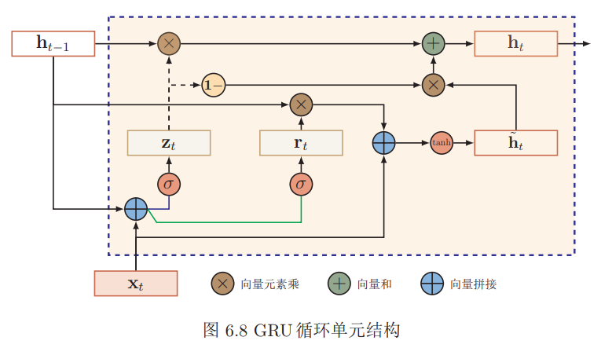

### 循环神经网络

虽然简单循环网络理论上可以建立长时间间隔的状态之间的依赖关系，但是由于梯度爆炸或消失问题，实际上只能学习到短期的依赖关系。这样，如果$t$时刻的输出$y_t$依赖于$t−k$时刻的输入$x_{t−k}$，当间隔$k$比较大时，简单神经网络很难建模这种长距离的依赖关系，称为长期依赖问题。

#### 给网络增加记忆力

##### 延时神经网络

延时神经网络是在前馈网络中的非输出层都添加一个延时器，记录最近几次神经元的输出。在第$t$个时刻，第$l + 1$层神经元和第$l$层神经元的最近$p$次输出相关，即
$$
\mathbf{h}_{t}^{(l+1)}=f\left(\mathbf{h}_{t}^{(l)}, \mathbf{h}_{t-1}^{(l)}, \cdots, \mathbf{h}_{t-p+1}^{(l)}\right)
$$

##### 有外部输入的非线性自回归模型

在每个时刻$t$都有一个外部输入$x_t$，产生一个输出$y_t$。$NARX$通过一个延时器记录最近几次的外部输入和输出，第$t$个时刻的输出$y_t$ 为
$$
\mathbf{y}_{t}=f\left(\mathbf{x}_{t}, \mathbf{x}_{t-1}, \cdots, \mathbf{x}_{t-p}, \mathbf{y}_{t-1}, \mathbf{y}_{t-2}, \cdots, \mathbf{y}_{t-q}\right)
$$
其中$f(·)$表示非线性函数，可以是一个前馈网络，$p$和$q $为超参数。

##### 循环神经网络

给定一个输入序列$x_{1:T} = (x_1, x_2, . . . , x_t, . . . , x_T )$，循环神经网络通过下面公式更新带反馈边的隐藏层的活性值$h_t$：
$$
\mathbf{h}_{t}=f\left(\mathbf{h}_{t-1}, \mathbf{x}_{t}\right)
$$
其中$h_0 = 0$，$f(·)$为一个非线性函数，也可以是一个前馈网络。

#### 简单循环神经网络

假设在时刻$t$时，网络的输入为$x_t$，隐藏层状态为$h_t$ 不仅和当前时刻的输入$x_t$ 相关，也和上一个时刻的隐藏层状态$h_{t−1}$ 相关。
$$
\begin{aligned} \mathbf{z}_{t} &=U \mathbf{h}_{t-1}+W \mathbf{x}_{t}+\mathbf{b} \\ \mathbf{h}_{t} &=f\left(\mathbf{z}_{t}\right) \end{aligned}
$$
其中$z_t$ 为隐藏层的净输入，$f(·)$是非线性激活函数，通常为$logistic$函数或$tanh$函数，$U $为状态-状态权重矩阵，$W $为状态-输入权重矩阵,$b$为偏置。

##### 序列到类别模式

序列到类别模式主要用于序列数据的分类问题：输入为序列，输出为类别。

假设一个样本$x_{1:T} = (x_1, x_2, . . . , x_t, . . . , x_T )$为一个长度为$T $的序列，输出为一个类别 $y ∈ \{1, · · · , C\}$。我们可以将样本$ x $按不同时刻输入到循环神经网络中，并得到不同时刻的隐藏状态$h_1, · · · , h_T$。我们可以将$h_T $看作整个序列的最终表示（或特征），并输入给分类器$g(·)$进行分类
$$
\hat{y}=g\left(\mathbf{h}_{T}\right)
$$
其中$g(·)$可以是简单的线性分类器（比如Logistic回归）或复杂的分类器（比如多层前馈神经网络）

除了将最后时刻的状态作为序列表示之外，我们还可以对整个序列的所有状态进行平均，并用这个平均状态来作为整个序列的表示
$$
\hat{y}=g\left(\frac{1}{T} \sum_{t=1}^{T} \mathbf{h}_{t}\right)
$$

##### 同步的序列到序列模式

同步的序列到序列模式主要用于序列标注任务，即每一时刻都有输入和输出，输入序列和输出序列的长度相同。

在同步的序列到序列模式中，输入为一个长度为T 的序列$x_{1:T} = (x_1, x_2, . . . , x_t, . . . , x_T )$，输出为序列$y_{1:T} = (y_1, y_2, . . . , y_t, . . . , y_T )$。样本$x$按不同时刻输入到循环神经网络中，并得到不同时刻的隐状态$h_1, · · · , h_T$。每个时刻的隐状态$h_t$ 代表了当前时刻和历史的信息，并输入给分类器$g(·)$得到当前时刻的标签$\hat{y}_t$。
$$
\hat{y}_{t}=g\left(\mathbf{h}_{t}\right), \quad \forall t \in[1, T]
$$

##### 异步的序列到序列模式

异步的序列到序列模式也称为编码器-解码器（Encoder-Decoder）模型，即输入序列和输出序列不需要有严格的对应关系，也不需要保持相同的长度。

在异步的序列到序列模式中，输入为一个长度为$T $的序列$x_{1:T} = (x_1, x_2, . . . , x_T )$，输出为长度为$M$ 的序列$y_{1:M} = (y_1, y_2, . . . , y_M )$。经常通过先编码后解码的方式来实现。先将样本$x$按不同时刻输入到一个循环神经网络（编码器）中，并得到其编码$h_T$。然后在使用另一个循环神经网络（解码器）中，得到输出序列$\hat{y}_{1:M}$。为了建立输出序列之间的依赖关系，在解码器中通常使用非线性的自回归模型。
$$
\mathbf{h}_{t}=f_{1}\left(\mathbf{h}_{t-1}, \mathbf{x}_{t}\right), \quad \forall t \in[1, T]\\

\begin{aligned} \mathbf{h}_{T+t} &=f_{2}\left(\mathbf{h}_{T+t-1}, \hat{\mathbf{y}}_{t-1}\right), \quad \forall t \in[1, M] \\ \hat{y}_{t} &=g\left(\mathbf{h}_{T+t}\right), \quad \forall t \in[1, M] \end{aligned}
$$

#### 参数学习

###### BPTT

给定一个训练样本$(x, y)$，其中$x_{1:T} = (x_1, · · · , x_T )$为长度是$T $的输入序列，$y_{1:T} = (y_1, · · · , y_T )$是长度为$T $的标签序列。即在每个时刻$t$，都有一个监督信息$y_t$，我们定义时刻$t$的损失函数为
$$
\mathcal{L}_{t}=\mathcal{L}\left(y_{t}, g\left(\mathbf{h}_{t}\right)\right)
$$
其中$g(h_t)$为第t时刻的输出，$\mathcal{L}$为可微分的损失函数。那么整个序列上损失函数为
$$
\mathcal{L}=\sum_{t=1}^{T} \mathcal{L}_{t}
$$
整个序列的损失函数$\mathcal{L}$关于参数$U$的梯度为
$$
\frac{\partial \mathcal{L}}{\partial U}=\sum_{t=1}^{T} \frac{\partial \mathcal{L}_{t}}{\partial U}
$$
计算偏导数$\frac{\partial \mathcal{L}_{t}}{\partial U}$

因为参数 $U$ 和隐藏层在每个时刻$ k(1 ≤ k ≤ t)$ 的净输入 $z_k = Uh_{k−1} +Wx_k + b$有关，因此第$t$时刻损失的损失函数$\mathcal{L}_t$ 关于参数$U_{ij}$ 的梯度为：
$$
\begin{aligned} \frac{\partial \mathcal{L}_{t}}{\partial U_{i j}} &=\sum_{k=1}^{t} \operatorname{tr}\left(\left(\frac{\partial \mathcal{L}_{t}}{\partial \mathbf{z}_{k}}\right)^{\mathrm{T}} \frac{\partial^{+} \mathbf{z}_{k}}{\partial U_{i j}}\right) \\ &=\sum_{k=1}^{t}\left(\frac{\partial^{+} \mathbf{z}_{k}}{\partial U_{i j}}\right)^{\mathrm{T}} \frac{\partial \mathcal{L}_{t}}{\partial \mathbf{z}_{k}} \end{aligned}
$$
其中 $\frac{\partial^{+} \mathbf{z}_{k}}{\partial U_{i j}}$ 表示“直接”偏导数，即公式$z_k = Uh_{k−1} +Wx_k + b$中保持$h_{k−1}$ 不变，对$U_{ij }$进行求偏导数，得到
$$
\frac{\partial^{+} \mathbf{z}_{k}}{\partial U_{i j}}=\left[ \begin{array}{c}{0} \\ {\vdots} \\ {\left[\mathrm{h}_{k-1}\right]_{j}} \\ {\vdots} \\ {0}\end{array}\right] \triangleq \mathbb{I}_{i}\left(\left[\mathbf{h}_{k-1}\right]_{j}\right)
$$
其中$[h_{k−1}]_j$ 为第$k − 1$时刻隐状态的第$j $维；$\mathbb{I}_{i}(x)$除了第$i$行值为$x$外，其余都为$0$的向量。

定义$\delta_{t, k} =\frac{\partial \mathcal{L}_{t}}{\partial \mathbf{z}_{k}} $为第 $t $时刻的损失对第$ k $时刻隐藏神经层的净输入$ z_k$ 的导数，则
$$
\begin{aligned} \delta_{t, k} &=\frac{\partial \mathcal{L}_{t}}{\partial \mathbf{z}_{k}} \\ &=\frac{\partial \mathbf{h}_{k}}{\partial \mathbf{z}_{k}} \frac{\partial \mathbf{z}_{k+1}}{\partial \mathbf{h}_{k}} \frac{\partial \mathcal{L}_{t}}{\partial \mathbf{z}_{k+1}} \\ &=\operatorname{diag}\left(f^{\prime}\left(\mathbf{z}_{k}\right)\right) U^{\mathrm{T}} \delta_{t, k+1} \end{aligned}
$$

$$
\frac{\partial \mathcal{L}_{t}}{\partial U_{i j}}=\sum_{k=1}^{t}\left[\delta_{t, k}\right]_{i}\left[\mathbf{h}_{k-1}\right]_{j}
$$
将上式写成矩阵形式为
$$
\frac{\partial \mathcal{L}_{t}}{\partial U}=\sum_{k=1}^{t} \delta_{t, k} \mathbf{h}_{k-1}^{\mathrm{T}}
$$
同理可得，$\mathcal{L}$关于权重$W$ 和偏置$b$的梯度为
$$
\begin{aligned} \frac{\partial \mathcal{L}}{\partial W} &=\sum_{t=1}^{T} \sum_{k=1}^{t} \delta_{t, k} \mathbf{x}_{k}^{\mathrm{T}} \\ \frac{\partial \mathcal{L}}{\partial \mathbf{b}} &=\sum_{t=1}^{T} \sum_{k=1}^{t} \delta_{t, k} \end{aligned}
$$

###### RTRL

假设循环网络网络中第$t + 1$时刻的状态$h_{t+1}$ 为
$$
\mathbf{h}_{t+1}=f\left(\mathbf{z}_{t+1}\right)=f\left(U \mathbf{h}_{t}+W \mathbf{x}_{t+1}+\mathbf{b}\right)
$$
其关于参数$U_{ij}$ 的偏导数为
$$
\begin{aligned} \frac{\partial \mathbf{h}_{t+1}}{\partial U_{i j}} &=\frac{\partial \mathbf{h}_{t+1}}{\partial \mathbf{z}_{t+1}}\left(\frac{\partial^{+} \mathbf{z}_{t+1}}{\partial U_{i j}}+U \frac{\partial \mathbf{h}_{t}}{\partial U_{i j}}\right) \\ &=\operatorname{diag}\left(f^{\prime}\left(\mathbf{z}_{t+1}\right)\right)\left(\mathbb{I}_{i}\left(\mathbf{h}_{t}\right]_{j}\right)+U \frac{\partial \mathbf{h}_{t}}{\partial U_{i j}} ) \\ &=f^{\prime}\left(\mathbf{z}_{t+1}\right) \odot\left(\mathbb{I}_{i}\left(\left[\mathbf{h}_{t}\right]_{j}\right)+U \frac{\partial \mathbf{h}_{t}}{\partial U_{i j}}\right) \end{aligned}
$$
$RTRL$算法从第$1$个时刻开始，除了计算循环神经网络的隐状态之外，还利用上面公式依次前向计算偏导数 $\frac{\partial \mathbf{h}_{1}}{\partial U_{i j}}, \frac{\partial \mathbf{h}_{2}}{\partial U_{i j}}, \frac{\partial \mathbf{h}_{3}}{\partial U_{i j}},\cdot{...}$

假设第$t$个时刻存在一个监督信息，其损失函数为$\mathcal{L}_t$，就可以同时计算损失函数对$U_{ij}$ 的偏导数
$$
\frac{\partial \mathcal{L}_{t}}{\partial U_{i j}}=\left(\frac{\partial \mathbf{h}_{t}}{\partial U_{i j}}\right)^{\mathrm{T}} \frac{\partial \mathcal{L}_{t}}{\partial \mathbf{h}_{t}}
$$
这样在第t时刻，可以实时地计算损失$\mathcal{L}_t$ 关于参数$U $的梯度，并更新参数。参数$W$ 和$b$的梯度也可以同样按上述方法实时计算。

两种算法比较$ RTRL$算法和$BPTT$算法都是基于梯度下降的算法，分别通过前向模式和反向模式应用链式法则来计算梯度。在循环神经网络中，一般网络输出维度远低于输入维度，因此$BPTT$算法的计算量会更小，但是$BPTT$算法需要保存所有时刻的中间梯度，空间复杂度较高。$RTRL$算法不需要梯度回传，因此非常适合用于需要在线学习或无限序列的任务中

#### 改进方案

梯度爆炸一般而言，循环网络的梯度爆炸问题比较容易解决，一般通过权重衰减或梯度截断来避免。 权重衰减是通过给参数增加 $ℓ_1$ 或$ ℓ_2$ 范数的正则化项来限制参数的取值范围，从而使得$γ ≤ 1$。梯度截断是另一种有效的启发式方法，当梯度的模大于一定阈值时，就将它截断成为一个较小的数。梯度消失是循环网络的主要问题。除了使用一些优化技巧外，更有效的方式就是改变模型，比如让$U = I$，同时使用$f′(z_i) = 1$，即

$$
\mathbf{h}_{t}=\mathbf{h}_{t-1}+g\left(\mathbf{x}_{t} ; \theta\right)
$$
其中$g(·)$是一个非线性函数，$θ $为参数。

这种改变也丢失了神经元在反馈边上的非线性激活的性质，因此也降低了模型的表示能力。为了避免这个缺点，我们可以采用一个更加有效的改进策略：
$$
\mathbf{h}_{t}=\mathbf{h}_{t-1}+g\left(\mathbf{x}_{t}, \mathbf{h}_{t-1} ; \theta\right)
$$
但这种改进依然有一个问题就是记忆容量。随着$\mathbf{h}_t$ 不断累积存储新的输入信息，会发生饱和现象。假设$g(·)$为$logistic$函数，则随着时间$t$的增长，$\mathbf{h}_t$ 会变得越来越大，从而导致$\mathbf{h}$变得饱和。也就是说，隐状态$\mathbf{h}_t$ 可以存储的信息是有限的，随着记忆单元存储的内容越来越多，其丢失的信息也越来越多。为了解决容量问题，可以有两种方法。一种是增加一些额外的存储单元：外部记忆；另一种是进行选择性的遗忘，同时也进行有选择的更新。

##### 基于门控技术的循环神经网络

###### LSTM

$LSTM$网络引入一个新的内部状态$\mathbf{c}_t$ 专门进行线性的循环信息传递，同时（非线性）输出信息给隐藏层的外部状态$\mathbf{h}_t$ 。
$$
\begin{aligned} \mathbf{c}_{t} &=\mathbf{f}_{t} \odot \mathbf{c}_{t-1}+\mathbf{i}_{t} \odot \tilde{\mathbf{c}}_{t} \\ \mathbf{h}_{t} &=\mathbf{o}_{t} \odot \tanh \left(\mathbf{c}_{t}\right) \end{aligned}
$$
其中$\mathbf{f}_t$ ，$\mathbf{i}_t$ 和$\mathbf{o}_t$  为三个门来控制信息传递的路径；$⊙$为向量元素乘积；$\mathbf{c}_{t-1}$  为上一时刻的记忆单元；$\tilde{\mathbf{c}}_{t}$是通过非线性函数得到候选状态，
$$
\tilde{\mathbf{c}}_{t}=\tanh \left(W_{c} \mathbf{x}_{t}+U_{c} \mathbf{h}_{t-1}+\mathbf{b}_{c}\right)
$$
遗忘门$\mathbf{f}_t$控制上一个时刻的内部状态$\mathbf{c}_{t-1}$ 需要遗忘多少信息。
输入门$\mathbf{i}_t$ 控制当前时刻的候选状态$\tilde{\mathbf{c}}_{t}$有多少信息需要保存。
输出门$\mathbf{o}_t$控制当前时刻的内部状态$\mathbf{c}_t$有多少信息需要输出给外部状态$\mathbf{h}_{t}$。

$$
\left[ \begin{array}{c}{\tilde{\mathbf{c}}_{t}} \\ {\mathbf{o}_{t}} \\ {\mathbf{i}_{t}} \\ {\mathbf{f}_{t}}\end{array}\right]=\left[ \begin{array}{c}{\tanh } \\ {\sigma} \\ {\sigma} \\ {\sigma}\end{array}\right]\left(W \left[ \begin{array}{c}{\mathbf{x}_{t}} \\ {\mathbf{h}_{t-1}}\end{array}\right]+\mathbf{b}\right)\\

\begin{aligned} \mathbf{c}_{t} &=\mathbf{f}_{t} \odot \mathbf{c}_{t-1}+\mathbf{i}_{t} \odot \tilde{\mathbf{c}}_{t} \\ \mathbf{h}_{t} &=\mathbf{o}_{t} \odot \tanh \left(\mathbf{c}_{t}\right) \end{aligned}
$$
$\mathbf{peephole}$ 连接 另外一种变体是三个门不但依赖于输入$\mathbf{x}_t$和上一时刻的隐状态$\mathbf{h}_{t−1}$，也依赖于上一个时刻的记忆单元$\mathbf{c}_{t−1}$。
$$
\begin{aligned} \mathbf{i}_{t} &=\sigma\left(W_{i} \mathbf{x}_{t}+U_{i} \mathbf{h}_{t-1}+V_{i} \mathbf{c}_{t-1}+\mathbf{b}_{i}\right) \\ \mathbf{f}_{t} &=\sigma\left(W_{f} \mathbf{x}_{t}+U_{f} \mathbf{h}_{t-1}+V_{f} \mathbf{c}_{t-1}+\mathbf{b}_{f}\right) \\ \mathbf{o}_{t} &=\sigma\left(W_{o} \mathbf{x}_{t}+U_{o} \mathbf{h}_{t-1}+V_{o} \mathbf{c}_{t}+\mathbf{b}_{o}\right) \end{aligned}
$$
其中$V_i$，$V_f$ 和$V_o$ 为对角阵形式的参数。

耦合输入门和遗忘门$LSTM$网络中的输入门和遗忘门有些互补关系，因此同时用两个门比较冗余。为了减少$LSTM$网络的计算复杂度，将这两门合并为一个门。令
$$
\mathbf{f}_{t}=\mathbf{1}-\mathbf{i}_{t}
$$

###### GRU

当前时刻的候选状态$\tilde{\mathbf{h}}_{t}$ 为
$$
\tilde{\mathbf{h}}_{t}=\tanh \left(W_{h} \mathbf{x}_{t}+U_{h}\left(\mathbf{r}_{t} \odot \mathbf{h}_{t-1}\right)+\mathbf{b}_{h}\right)
$$
其中$\mathbf{r}_t ∈ [0, 1]$为重置门（reset gate），用来控制候选状态$\tilde{\mathbf{h}}_{t}$的计算是否依赖上一时刻的状态$\mathbf{h}_{t-1}$。
$$
\mathbf{r}_{t}=\sigma\left(W_{r} \mathbf{x}_{t}+U_{r} \mathbf{h}_{t-1}+\mathbf{b}_{r}\right)
$$
GRU网络的隐状态$\mathbf{h}_t$更新方式为
$$
\mathbf{h}_{t}=\mathbf{z}_{t} \odot \mathbf{h}_{t-1}+\left(\underline{1}-\mathbf{z}_{t}\right) \odot \tilde{\mathbf{h}}_{t}
$$
其中$\mathbf{z} ∈ [0, 1]$为更新门（update gate），用来控制当前状态需要从历史状态中保留多少信息（不经过非线性变换），以及需要从候选状态中接受多少新信息。
$$
\mathbf{z}_{t}=\sigma\left(\mathbf{W}_{z} \mathbf{x}_{t}+\mathbf{U}_{z} \mathbf{h}_{t-1}+\mathbf{b}_{z}\right)
$$

#### 深层循环神经网络

##### 堆叠循环神经网络

第$l$ 层网络的输入是第$l − 1$层网络的输出。我们定义$h^{(l)}_t$ 为在时刻$t$时第$l $层的隐状态
$$
\mathbf{h}_{t}^{(l)}=f\left(U^{(l)} \mathbf{h}_{t-1}^{(l)}+W^{(l)} \mathbf{h}_{t}^{(l-1)}+\mathbf{b}^{(l)}\right)
$$
其中$U^{(l)}$，$W^{(l)}$和$b^{{l}}$为权重矩阵和偏置向量，$h^{(0)}_t = \mathbf{x}_t$。

##### 双向循环神经网络

假设第$1$层按时间顺序，第$2$层按时间逆序，在时刻$t$时的隐状态定义为$h^{(1)}_t$和$h^{(2)}_t$ ，则
$$
\begin{aligned} \mathbf{h}_{t}^{(1)} &=f\left(U^{(1)} \mathbf{h}_{t-1}^{(1)}+W^{(1)} \mathbf{x}_{t}+\mathbf{b}^{(1)}\right) \\ \mathbf{h}_{t}^{(2)} &=f\left(U^{(2)} \mathbf{h}_{t+1}^{(2)}+W^{(2)} \mathbf{x}_{t}+\mathbf{b}^{(2)}\right) \\ \mathbf{h}_{t} &=\mathbf{h}_{t}^{(1)} \oplus \mathbf{h}_{t}^{(2)} \end{aligned}
$$
其中$⊕$为向量拼接操作。

##### 递归神经网络

##### 图网络

对于一个任意的图结构$G(\mathcal{V}, \mathcal{E})$，其中$\mathcal{V}$表示节点集合，$\mathcal{E}$表示边集合。每条边表示两个节点之间的依赖关系。节点之间的连接可以是有向的，也可以是无向的。图中每个节点 $v$ 都用一组神经元来表示其状态$ h^{(v)}$，初始状态可以为
节点 $v $的输入特征$ x^{(v)}$。每个节点可以收到来自相邻节点的消息，并更新自己的状态。
$$
\mathbf{m}_{t}^{(v)}=\sum_{u \in N(v)} f\left(\mathbf{h}_{t-1}^{(v)}, \mathbf{h}_{t-1}^{(u)}, \mathbf{e}^{(u, v)}\right)\\

\mathbf{h}_{t}^{(v)}=g\left(\mathbf{h}_{t-1}^{(v)}, \mathbf{m}_{t}^{(v)}\right)
$$
其中$N(v)$表示节点$v $的邻居，$m^{(v)}_t$ 表示在第$t$时刻节点$v $收到的信息，$e^{(u,v)}$ 为边$e^{(u,v)}$上的特征。