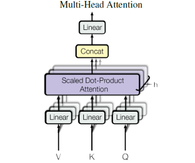
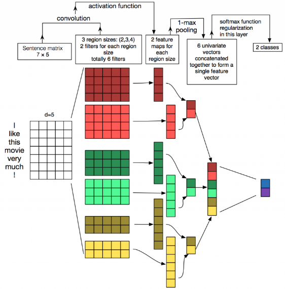

#### Transformer

`Transformer` 相比较 `LSTM` 等循环神经网络模型的优点：可以直接捕获序列中的长距离依赖关系；模型并行度高，使得训练时间大幅度降低。

##### 结构

`Transformer` 包含一个编码器 `encoder` 和一个解码器 `decoder` 。

编码器 `encoder` 包含一组 6 个相同的层 `Layer` ，每层包含两个子层 `SubLayer`。

- 第一个子层是一个多头自注意力 `multi-head self-attention` 层，第二个子层是一个简单的全连接层。

- 每个子层都使用残差直连，并且残差直连之后跟随一个`layer normalization:LN` 。

  假设子层的输入为$\vec{\mathbf{h}}$，则经过 `LN` 之后整体的输出为：$\text{LN}(\vec{\mathbf{h}}+\text{Sublayer}(\vec{\mathbf{h}}))$。

解码器 `decoder` 也包含一组 6 个相同的层 `Layer`，但是每层包含三个子层 `SubLayer` 。

- 第一个子层也是一个多头自注意力 `multi-head self-attention` 层。但是，在计算位置$i$的 `self-attention` 时屏蔽掉了位置$i$之后的序列值，这意味着：位置$i$的 `attention` 只能依赖于它之前的结果，不能依赖它之后的结果。因此，这种 `self-attention` 也被称作 `masked self-attention`。
- 第二个子层是一个多头注意力`multi-head attention` 层，用于捕获 `decoder output` 和 `encoder output` 之间的 `attention` 。
- 第三个子层是一个简单的全连接层。
- 和 `encoder` 一样：每个子层都使用残差直连，并且残差直连之后跟随一个`LN` 。

###### Position Embedding

Position Embedding，也就是“位置向量”，将每个位置编号，然后每个编号对应一个向量，通过结合位置向量和词向量，就给每个词都引入了一定的位置信息，这样 Attention 就可以分辨出不同位置的词了。 而 Google 直接给出了一个构造 Position Embedding 的公式：
$$
\begin{cases}PE_{21}(p) = \sin(p/10000^{2i/d_{pos}})\\
PE_{2i+1}(p) = \cos(p/10000^{2i/d_{pos}})
\end{cases}
$$
将`id`为$p$的位置映射为一个$d_{pos}$维的位置向量，这个向量的第$i$个元素的数值就是$PE_i(p)$。结合位置向量和词向量有几个可选方案，可以把它们拼接起来作为一个新向量，也可以把位置向量定义为跟词向量一样大小，然后两者加起来。

**第一步：**获取输入单词的词向量 X，X 由词嵌入和位置嵌入相加得到。

**第二步：**将第一步得到的向量矩阵传入编码器，编码器包含 6 个 block ，输出编码后的信息矩阵 C。每一个编码器输出的 block 维度与输入完全一致。

第三步：将编码器输出的编码信息矩阵 C 传递到解码器中，解码器会根据当前翻译过的单词 1~ i 依次翻译下一个单词 i+1，

###### `Attention`

编码器和解码器的 `attention` 都是采用 `scaled dot attention` 。

设有$M$个 `query` 向量$\{\vec{\mathbf{q}}_1,\cdots,\vec{\mathbf{q}}_M\}$、$M$个 `key` 向量$\{\vec{\mathbf{k}}_1,\cdots,\vec{\mathbf{k}}_M\}$、$M$个 `value` 向量$\{\vec{\mathbf{v}}_1,\cdots,\vec{\mathbf{v}}_M\}$，其中 `query` 向量和 `key` 向量的维度为$d_k$，`value` 向量的维度为$d_v$。经过 `attention` 之后，位置 的输出为：
$$
\tilde{\vec{\mathbf{v}}}_m=\sum_{i=1}^M\alpha_{m,i}\vec{\mathbf{v}}_i
$$
其中$\alpha_{m,i}$表示位置$m$与位置$i$之间的权重：
$$
S_{m,i}=\frac{\vec{\mathbf{q}}_m\cdot \vec{\mathbf{k}}_i}{\sqrt{d_k}},\alpha_{m,i}=\frac{\exp(S_{m,i})}{\sum_{j=1}^MS_{m,j}},i=1,2,\cdots,M
$$
除以$\sqrt{d_k}$是为了降低$S_{m,i}$的数值，防止它落入到 `softmax` 函数的饱和区间。因为 `softmax` 函数的饱和区梯度几乎为 0 ，容易发生梯度消失。

如果使用了 `Masked attention`，则有：
$$
S_{m,i}=\left\{ \begin{array}{ll}\frac{\vec{\mathbf{q}}_m\cdot \vec{\mathbf{k}}_i}{\sqrt{d_k}},&i=1,2,\cdots,m\\
-\infin,&i=m+1,\cdots,M\end{array}\right.
$$

$$
\mathbf{Q}=\left[\begin{array}{cccc}\vec{\mathbf{q}}_1^T\\\vec{\mathbf{q}}_2^T\\
\cdot\\
\cdot\\
\vec{\mathbf{q}}_M^T\end{array}\right]\in\mathbb{R}^{M\times d_k},\mathbf{K}=\left[\begin{array}{cccc}\vec{\mathbf{k}}_1^T\\\vec{\mathbf{k}}_2^T\\
\cdot\\
\cdot\\
\vec{\mathbf{k}}_M^T\end{array}\right]\in\mathbb{R}^{M\times d_k},\mathbf{V}=\left[\begin{array}{cccc}\vec{\mathbf{v}}_1^T\\\vec{\mathbf{v}}_2^T\\
\cdot\\
\cdot\\
\vec{\mathbf{v}}_M^T\end{array}\right]\in\mathbb{R}^{M\times d_v},\tilde{\mathbf{V}}=\left[\begin{array}{cccc}\tilde{\vec{\mathbf{v}}}_1^T\\\tilde{\vec{\mathbf{v}}}_2^T\\
\cdot\\
\cdot\\
\tilde{\vec{\mathbf{v}}}_M^T\end{array}\right]\in\mathbb{R}^{M\times d_v}
$$

则有：
$$
\mathbf{QK}^T=\left[\begin{array}{cccc}\vec{\mathbf{q}}_1\cdot \vec{\mathbf{k}}_1&\vec{\mathbf{q}}_1\cdot \vec{\mathbf{k}}_2&\cdots&\vec{\mathbf{q}}_1\cdot \vec{\mathbf{k}}_M\\\vec{\mathbf{q}}_2\cdot \vec{\mathbf{k}}_1&\vec{\mathbf{q}}_2\cdot \vec{\mathbf{k}}_2&\cdots&\vec{\mathbf{q}}_2\cdot \vec{\mathbf{k}}_M\\
\cdot&\cdot&\cdots&\cdot\\
\cdot&\cdot&\cdots&\cdot\\
\vec{\mathbf{q}}_M\cdot \vec{\mathbf{k}}_1&\vec{\mathbf{q}}_M\cdot \vec{\mathbf{k}}_2&\cdots&\vec{\mathbf{q}}_M\cdot \vec{\mathbf{k}}_M\end{array}\right]\in\mathbb{R}^{M\times M}
$$
令：$\mathbf{S}=\text{softmax}(\frac{\mathbf{QK}^T}{\sqrt{d_k}})$。则有：$\tilde{\mathbf{V}}=\mathbf{S}\mathbf{V}$。

一组多个`attention` 的效果要优于单个 `attention`，这称作`multi-head attention` 。给定 `query` 矩阵$\mathbf{Q}$、`key` 矩阵$\mathbf{K}$、`value` 矩阵$\mathbf{V}$，`multi-head attention` 的 `head i` 先通过一个线性映射然后再经过 `attention`，得到 `head i` 的输出$\tilde{\mathbf{V}}$：
$$
\tilde{\mathbf{V}}=\text{Attention}(\mathbf{Q}\mathbf{W}^Q_i,\mathbf{K}\mathbf{W}_i^K,\mathbf{V}\mathbf{W}^V_i)\in \mathbb{R}^{M\times d_{v^{\prime}}}
$$
其中：$\mathbf{W}^Q_i\in\mathbb{R}^{d_k\times d_{k^{\prime}}}$将$M$个 `query` 向量$\vec{\mathbf{q}}_m$从$d_k$维降低到$d_{k^{\prime}}$维；$\mathbf{W}^K_i\in\mathbb{R}^{d_k\times d_{k^{\prime}}}$将$M$个 `key` 向量$\vec{\mathbf{k}}_m$从$d_k$维降低到$d_{k^{\prime}}$维；$\mathbf{W}^V_i\in\mathbb{R}^{d_v\times d_{v^{\prime}}}$将$M$个 `value` 向量$\vec{\mathbf{v}}_m$从$d_v$维降低到$d_{v^{\prime}}$维。

将多个 `head i` 的输出 进行拼接，并再经过一个线性映射即可得到多头`attention` 的结果：
$$
\text{MultiHead}(\mathbf{Q},\mathbf{K},\mathbf{V})=\text{Concat}(\tilde{\mathbf{V}}_1,\cdots,\tilde{\mathbf{V}}_a)\mathbf{W}^O
$$
其中：`a` 为 `head` 的数量，$\mathbf{W}^O\in \mathbf{R}^{(ad_{v^{\prime}})\times d_v}$是为了确保`multi-head attention` 前后的输入输出维度一致。`concate` 操作在 `M` 个向量上进行：
$$
\text{Concat}(\tilde{\mathbf{V}}_1,\cdots,\tilde{\mathbf{V}}_a)=\left[\begin{array}{cccc}\tilde{\vec{\mathbf{v}}}_{1,1}^T&\tilde{\vec{\mathbf{v}}}_{2,1}^T&\cdots&\tilde{\vec{\mathbf{v}}}_{a,1}^T\\\tilde{\vec{\mathbf{v}}}_{1,2}^T&\tilde{\vec{\mathbf{v}}}_{2,2}^T&\cdots&\tilde{\vec{\mathbf{v}}}_{a,2}^T\\
\cdot&\cdot&\cdots&\cdot\\
\cdot&\cdot&\cdots&\cdot\\
\tilde{\vec{\mathbf{v}}}_{1,M}^T&\tilde{\vec{\mathbf{v}}}_{2,M}^T&\cdots&\tilde{\vec{\mathbf{v}}}_{a,M}^T\end{array}\right]
$$
其中$\tilde{\vec{\mathbf{v}}}_{i,m}$为第$i$个 `head` 的第$m$个输出向量。

从数据结构上来看，CNN 输入数据为文本序列，假设句子长度为 n，词向量的维度为 d，那么输入就是一个 n×d 的矩阵。显然，矩阵的同一行为一个词的向量表征，而不同行表示不同的词。要让卷积网络能够正常地「读」出文本，我们就需要使用一维卷积。

卷积核大小会对输出值的长度有所影响。但经过池化之后，可映射到相同的特征长度。之后将池化后的值进行组合，就得到 5 个池化后的特征组合。

这样做的优点是：无论输入值的大小是否相同，要用相同数量的卷积核进行卷积，经过池化后就会获得相同长度的向量，这样接下来就可以使用全连接层了。

但 CNN 网络也存在缺点，即网络结构不深。它只有一个卷积层，无法捕获长距离特征，卷积层做到 2 至 3 层，就没法继续下去。再就是池化方法，文本特征经过卷积层再经过池化层，会损失掉很多位置信息。而位置信息对文本处理来说非常重要，因此需要找到更好的文本特征提取器。