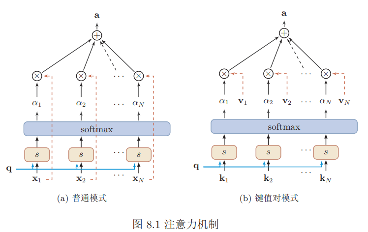
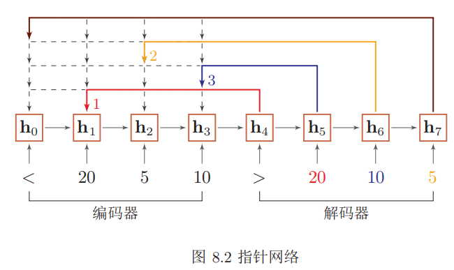
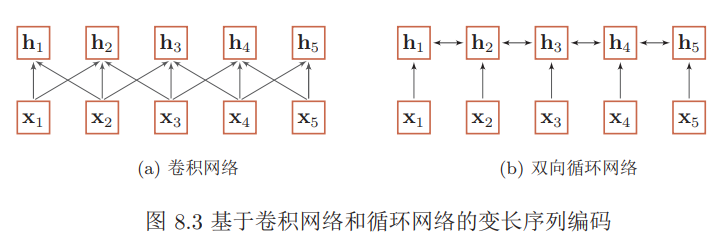
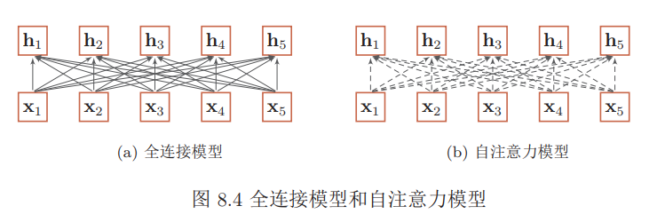
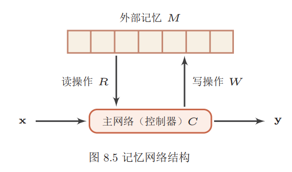
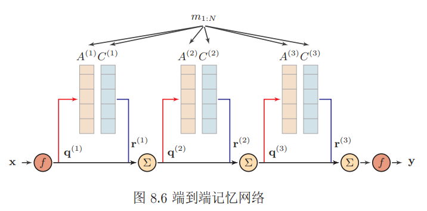

###  注意力机制与外部记忆

#### 注意力机制

注意力机制是解决信息超载问题的主要手段的一种资源分配方案，将计算资源分配给更重要的任务。注意力一般分为两种：一种是自上而下的有意识的注意力，称为聚焦式注意力。聚焦式注意力是指有预定目的、依赖任务的、主动有意识地聚焦于某一对象的注意力；另一种是自下而上的无意识的注意力，称为基于显著性的注意力。基于显著性的注意力是由外界刺激驱动的注意，不需要主动干预，也和任务无关。

**注意力机制的计算**可以分为两步：一是在所有输入信息上计算注意力分布，二是根据注意力分布来计算输入信息的加权平均。

用$X = [x_1, · · · , x_N ]$表示$N $个输入信息，为了节省计算资源，不需要将所有的$N$个输入信息都输入到神经网络进行计算，只需要从$X$ 中选择一些和任务相关的信息输入给神经网络。给定一个和任务相关的查询向量$\mathbf{q}$，我们用注意力变量 $z ∈ [1, N]$来表示被选择信息的索引位置。我们采用一种“软性”的信息选择机制，首先计算在给定$\mathbf{q} $和$X $下，选择第$i$个输入信息的概率$α_i$
$$
\begin{aligned} \alpha_{i} &=p(z=i | X, \mathbf{q}) \\ &=\operatorname{softmax}\left(s\left(\mathbf{x}_{i}, \mathbf{q}\right)\right) \\ &=\frac{\exp \left(s\left(\mathbf{x}_{i}, \mathbf{q}\right)\right)}{\sum_{j=1}^{N} \exp \left(s\left(\mathbf{x}_{j}, \mathbf{q}\right)\right)} \end{aligned}
$$
其中$α_i$ 称为注意力分布，$s(\mathbf{x}_i, \mathbf{q})$为注意力打分函数。

加性模型：$s\left(\mathbf{x}_{i}, \mathbf{q}\right)=\mathbf{v}^{\mathrm{T}} \tanh \left(W \mathbf{x}_{i}+U \mathbf{q}\right)$

点积模型：$s\left(\mathbf{x}_{i}, \mathbf{q}\right)=\mathbf{x}_{i}^{\mathrm{T}} \mathbf{q}$

缩放点积模型：$s\left(\mathbf{x}_{i}, \mathbf{q}\right)=\frac{\mathbf{x}_{i}^{\mathrm{T}} \mathbf{q}}{\sqrt{d}}$

双线性模型：$s\left(\mathbf{x}_{i}, \mathbf{q}\right)=\mathbf{x}_{i}^{\mathrm{T}} W \mathbf{q}$

其中$W, U, \mathbf{v}$为可学习的网络参数，$d$为输入信息的维度。

加权平均注意力分布$α_i$可以解释为在给定任务相关的查询$\mathbf{q}$时，第$i$个信息受关注的程度。我们采用一种“软性”的信息选择机制对输入信息进行汇总。
$$
\begin{aligned} \operatorname{att}(X, \mathbf{q}) &=\sum_{i=1}^{N} \alpha_{i} \mathbf{x}_{i} \\ &=\mathbb{E}_{z \sim p(z | X, \mathbf{q})}[\mathbf{x}] \end{aligned}
$$
硬性注意力有两种实现方式：
$$
\operatorname{att}(X, \mathbf{q})=\mathbf{x}_{j}
$$
其中$j$为概率最大的输入信息的下标，即$j=\arg _{i=1}^{N} \max \alpha_{i}$

另一种硬性注意力可以通过在注意力分布式上随机采样的方式实现。硬性注意力的一个缺点是基于最大采样或随机采样的方式来选择信息。因此最终的损失函数与注意力分布之间的函数关系不可导，因此无法使用在反向传播算法进行训练。

**键值对注意力**我们可以用键值对格式来表示输入信息，其中“键”用来计算注意力分布$α_i$，“值”用来计算聚合信息。

用$(K, V ) = [(\mathbf{k}_1, \mathbf{v}_1), · · · ,(\mathbf{k}_N , \mathbf{v}_N )]$表示$N$ 个输入信息，给定任务相关的查询向量$\mathbf{q} $时，注意力函数为
$$
\begin{aligned} \operatorname{att}((K, V), \mathbf{q}) &=\sum_{i=1}^{N} \alpha_{i} \mathbf{v}_{i} \\ &=\sum_{i=1}^{N} \frac{\exp \left(s\left(\mathbf{k}_{i}, \mathbf{q}\right)\right)}{\sum_{j} \exp \left(s\left(\mathbf{k}_{j}, \mathbf{q}\right)\right)} \mathbf{v}_{i} \end{aligned}
$$
其中$s(\mathbf{k}_i, \mathbf{q})$为打分函数。

多头注意力是利用多个查询$Q = [q_1, · · · , q_M]$，来平行地计算从输入信息中选取多个信息。每个注意力关注输入信息的不同部分。
$$
\operatorname{att}((K, V), Q)=\operatorname{att}\left((K, V), \mathbf{q}_{1}\right) \oplus \cdots \oplus \operatorname{att}\left((K, V), \mathbf{q}_{M}\right)
$$
其中$⊕$表示向量拼接。

##### 注意力机制的应用

###### 指针网络

指针网络是一种序列到序列模型，输入是长度为n的向量序列$X=\mathbf{x}_{1}, \cdots, \mathbf{x}_{n}$，输出是下标序列$c_{1 : m}=c_{1}, c_{2}, \cdots, c_{m}，c_{i} \in[1, n], \forall i$。和一般的序列到序列任务不同，这里的输出序列是输入序列的下标。

条件概率$p(c_{1:m}|\mathbf{x}_{1:n})$可以写为
$$
\begin{aligned} p\left(c_{1 : m} | \mathbf{x}_{1 : n}\right) &=\prod_{i=1}^{m} p\left(c_{i} | c_{1 : i-1}, \mathbf{x}_{1 : n}\right) \\ & \approx \prod_{i=1}^{m} p\left(c_{i} | \mathbf{x}_{c_{1}}, \cdots, \mathbf{x}_{c_{i-1}}, \mathbf{x}_{1 : n}\right) \end{aligned}
$$
其中条件概率 $p\left(c_{i} | \mathbf{x}_{c_{1}}, \cdots, \mathbf{x}_{c_{i-1}}, \mathbf{x}_{1 : n}\right)$ 可以通过注意力分布来计算。假设用一个循环神经网络对$\mathbf{x}_{c_{1}}, \cdots, \mathbf{x}_{c_{i-1}}, \mathbf{x}_{1 : n}$ 进行编码得到向量$\mathbf{h}_i$则
$$
p\left(c_{i} | c_{1 : i-1}, \mathbf{x}_{1 : n}\right)=\operatorname{softmax}\left(s_{i, j}\right)
$$
其中$s_{i,j}$ 为在解码过程的第i步时，每个输入向量的未归一化的注意力分布，
$$
s_{i, j}=\mathbf{v}^{\mathrm{T}} \tanh \left(W \mathbf{x}_{j}+U \mathbf{h}_{i}\right), \forall j \in[1, n]
$$

###### 自注意力模型

当使用神经网络来处理一个变长的向量序列时，我们通常可以使用卷积网络或循环网络进行编码来得到一个相同长度的输出向量序列。

基于卷积或循环网络的序列编码都是可以看做是一种局部的编码方式，只建模了输入信息的局部依赖关系。如果要建立输入序列之间的长距离依赖关系，可以使用以下两种方法：一种方法是增加网络的层数，通过一个深层网络来获取远距离的信息交互另一种方法是使用全连接网络。全连接网络是一种非常直接的建模远距离依赖的模型，但是无法处理变长的输入序列。不同的输入长度，其连接权重的大小也是不同的。这时我们就可以利用注意力机制来“动态”地生成不同连接的权重，这就是自注意力模型。

假设输入**序列**为$X = [\mathbf{x}_1, · · · , \mathbf{x}_N ] ∈ R^{d_1×N}$，输出序列为$H = [\mathbf{h}_1, · · · , \mathbf{h}_N ] ∈R^{d_2×N}$，首先我们可以通过线性变换得到三组向量序列
$$
\begin{aligned} Q &=W_{Q} X \in \mathbb{R}^{d_{3} \times N} \\ K &=W_{K} X \in \mathbb{R}^{d_{3} \times N} \\ V &=W_{V} X \in \mathbb{R}^{d_{2} \times N} \end{aligned}
$$

其中$Q, K, V$分别为查询向量序列，键向量序列和值向量序列，$W_Q, W_K, W_V$ 分别为可学习的参数矩阵。

可以得到输出向量$\mathbf{h}_i$，
$$
\begin{aligned} \mathbf{h}_{i} &=\operatorname{att}\left((K, V), \mathbf{q}_{i}\right) \\ &=\sum_{j=1}^{N} \alpha_{i j} \mathbf{v}_{j} \\ &=\sum_{j=1}^{N} \operatorname{softmax}\left(s\left(\mathbf{k}_{j}, \mathbf{q}_{i}\right)\right) \mathbf{v}_{j} \end{aligned}
$$
其中$i, j ∈ [1, N]$为输出和输入向量序列的位置，连接权重$α_{ij}$由注意力机制动态生成。

其中实线表示为可学习的权重，虚线表示动态生成的权重。自注意力模型可以作为神经网络中的一层来使用，既可以用来替换卷积层和循环层，也可以和它们一起交替使使用。

#### 外部记忆

##### 结构化的外部记忆

为了增强网络容量，一种比较简单的方式是引入结构化的记忆模块，将和任务相关的短期记忆保存在记忆中，需要时再进行读取。这种装备外部记忆的神经网络也称为记忆网络或记忆增强神经网络

主网络 $C$：也称为控制器，负责信息处理，并与外界的交互--接受外界的输入信息并产生输出到外界。主网络还同时通过读写模块和外部记忆进行交互。

外部记忆单元$M$：外部记忆单元用来存储信息，一般可以分为很多记忆片段，这些记忆片段按照一定的结构来进行组织。记忆片段一般用向量来表示，外部记忆单元可以用一组向量$\mathbf{m}_{1:N} = [\mathbf{m}_1, · · · , \mathbf{m}_N ]$来表示。这些向量的组织方式可以是集合、树、栈或队列等。大部分信息存储于外部记忆中，不需要全时参与主网络的运算。

读取模块$R$：根据主网络生成的查询向量$\mathbf{q}_r$，从外部记忆单元中读取相应的信息$\mathbf{r} = R(\mathbf{m}_{1:N} , \mathbf{q}_r)$。

写入模块$W$：根据主网络生成的查询向量$\mathbf{q}_w$ 和要写入的信息$\mathbf{a}$ 来更新外部记忆$\mathbf{m}_{1:N} = W(\mathbf{m}_{1:N} , \mathbf{q}_w, \mathbf{a})$。

这种结构化的外部记忆是带有地址的，即每个记忆片段都可以按地址读取和写入。要实现类似于人脑神经网络的联想记忆能力，就需要按内容寻址的方式进行定位，然后进行读取或写入操作。按内容寻址通常使用注意力机制来进
行。通过注意力机制可以实现一种“软性”的寻址方式，即计算一个在所有记忆片段上的分布，而不是一个单一的绝对地址。

###### 端到端记忆网络

在端到端记忆网络中，外部记忆单元是只读的。

给定一组需要存储的信息$m_{1:N} = \{m_1, · · · , m_N \}$，首先将转换成两组记忆片段 $A = [\mathbf{a}_1, · · · , \mathbf{a}_N ] $和 $C = [\mathbf{c}_1, · · · , \mathbf{c}_N ]$，分别存放在两个外部记忆单元中，其中$A$用来进行寻址，$C$ 用来进行输出。

主网络根据输入 $\mathbf{x}$ 生成$\mathbf{ q}$，并使用注意力机制来从外部记忆中读取相关信息$\mathbf{r}$
$$
\mathbf{r}=\sum_{i=1}^{N} \operatorname{softmax}\left(\mathbf{a}_{i}^{\mathrm{T}} \mathbf{q}\right) \mathbf{c}_{i}
$$
并产生输出$\mathbf{y}=f(\mathbf{q}+\mathbf{r})$，其中$f(·)$为预测函数。

多跳操作为了实现更新复杂的计算，我们可以让主网络和外部记忆进行多轮交互。在第$k $轮交互中，主网络根据上次从外部记忆中读取的信息$\mathbf{r}^{(k−1)}$，产生新的查询向量
$$
\mathbf{q}^{(k)}=\mathbf{r}^{(k-1)}+\mathbf{q}^{(k-1)}
$$
其中$\mathbf{q}^{(0)}$ 为初始的查询向量，$\mathbf{r}^{(0)} = 0$。
假设第$k$ 轮交互的外部记忆为$A^{(k)} $和$C^{(k)}$，主网络从外部记忆读取信息为
$$
\mathbf{r}^{(k)}=\sum_{i=1}^{N} \operatorname{softmax}\left(\left(\mathbf{a}_{i}^{(k)}\right)^{\mathrm{T}} \mathbf{q}^{(k)}\right) \mathbf{c}_{i}^{(k)}
$$
在$K$ 轮交互后，用$y = f(q^{(K)} +r^{(K)})$进行预测。这种多轮的交互方式也称为多跳（Multi-Hop）操作。多跳操作中的参数一般是共享的。为了简化起见，每轮交互的外部记忆也可以共享使用。

##### 基于神经动力学的联想记忆

联想记忆模型主要是通过神经网络的动态演化来进行联想，有两种应用场景：1）输入的模式和输出的模式在同一空间，这种模型叫做自联想记忆模型。自联想模型可以通过前馈神经网络或者循环神经网络来实现，也经常称为自编码器；2）输入的模式和输出的模式不在同一空间，这种模型叫做异联想记忆模型。从广义上讲，大部分模式识别问题都可以看作是异联想，因此异联想记忆模型可以作为分类器使用。

### 序列生成模型

给定一个序列样本$\mathbf{x}_{1 : T}=x_{1}, x_{2}, \cdots, x_{T}$，其概率可以看出是$T $个词的联合概率。 
$$
\begin{aligned} P\left(\mathbf{X}_{1 : T}=\mathbf{x}_{1 : T}\right) &=P\left(X_{1}=x_{1}, X_{2}=x_{2}, \cdots, X_{T}=x_{T}\right) \\ &=p\left(\mathbf{x}_{1 : T}\right) \end{aligned}
$$
和一般的概率模型类似，序列概率模型有两个基本问题：学习问题：给定一组序列数据，估计这些数据背后的概率分布；生成问题：从已知的序列分布中生成新的序列样本。

#### 序列概率模型

序列数据有两个特点：样本是变长的；样本空间为非常大。对于一个长度为$T $的序列，其样本空间为$|\mathcal{V}|^T$。

根据概率的乘法公式，序列$\mathbf{x}_{1:T}$ 的概率可以写为
$$
\begin{aligned} p\left(\mathbf{x}_{1 : T}\right) &=p\left(x_{1}\right) p\left(x_{2} | x_{1}\right) p\left(x_{3} | \mathbf{x}_{1 : 2}\right) \cdots p\left(x_{T} | \mathbf{x}_{1 :(T-1)}\right) \\ &=\prod_{t=1}^{T} p\left(x_{t} | \mathbf{x}_{1 :(t-1)}\right) \end{aligned}
$$
其中$x_t ∈ \mathcal{V}, t ∈ [1, T]$为词表$\mathcal{V} $中的一个词，$p(x_1|x_0) = p(x_1)$。

一旦通过最大似然估计训练了模型$p_θ(x|\mathbf{x}_{1:(t−1)})$，就可以通过时间顺序来生成一个完整的序列样本。令$\hat{x}_t$ 为在第$t$时根据分布$p_θ(x|\hat{\mathbf{x}}_{1:(t−1)})$生成的
$$
\hat{x}_{t} \sim p_{\theta}\left(x | \hat{\mathbf{x}}_{1 :(t-1)}\right)
$$
其中$\hat{\mathbf{x}}_{1:(t−1)} = \hat{x}_1, · · · , \hat{x}_{t−1 }$为前面$t − 1$步中生成的前缀序列。
自回归的方式可以生成一个无限长度的序列。为了避免这种情况，通常会设置一个特殊的符号$eos$来表示序列的结束。在训练时，每个序列样本的结尾都加上符号$eos$。在测试时，一旦生成了符号$eos$，就中止生成过程。

**束搜索**当使用自回归模型生成一个最可能的序列时，生成过程是一种从左到右的贪婪式搜索过程。在每一步都生成最可能的词，
$$
\hat{x}_{t}=\underset{x \in \mathcal{V}}{\arg \max } p_{\theta}\left(x | \hat{\mathbf{x}}_{1 :(t-1)}\right)
$$
这种贪婪式的搜索方式是次优的，生成的序列$\hat{\mathbf{x}}_{1:T}$ 并不保证是全局最优的
$$
\prod_{t=1}^{T} \max _{x_{t} \in \mathcal{V}} p_{\theta}\left(x_{t} | \hat{\mathbf{x}}_{1 :(t-1)}\right) \leq \max _{\mathbf{x}_{1 : T} \in \mathcal{V}^{T}} \prod_{t=1}^{T} p_{\theta}\left(x | \mathbf{x}_{1 :(t-1)}\right)
$$
一种常用的减少搜索错误的启发式方法是束搜索。在每一步的生成中，生成$K $个最可能的前缀序列，其中$K $为束的大小，是一个超参数。
束搜索的过程如下：在第$1$步时，生成$K $个最可能的词。在后面每一步中，从$K|\mathcal{V}|$个候选输出中选择$K$个最可能的序列。

#### N 元统计模型

假设每个词$x_t $只依赖于其前面的$n − 1$个词:n阶马尔可夫性质，即
$$
p\left(x_{t} | \mathbf{x}_{1 :(t-1)}\right)=p\left(x_{t} | \mathbf{x}_{(t-n+1) :(t-1)}\right)
$$
平滑技术：$N$元模型的一个主要问题是数据稀疏问题。数据稀疏问题在基于统计的机器学习中是一个常见的问题，主要是由于训练样本不足而导致密度估计不准.

数据稀疏问题的一种解决方法是平滑技术，即给一些没有出现的词组合赋予一定先验概
$$
p\left(x_{t} | \mathbf{x}_{(t-n+1) :(t-1)}\right)=\frac{\mathrm{m}\left(\mathrm{x}_{(t-n+1) : t}\right)+\delta}{\mathrm{m}\left(\mathrm{x}_{(t-n+1) :(t-1)}\right)+\delta|\mathcal{V}|}
$$

#### 深度序列模型

深度序列模型是指利用神经网络模型来估计条件概率$p_θ(x_t|\mathbf{x}_{1:(t−1)})$，

假设一个神经网络$f(·, θ)$，其输入为历史信息$\mathbf{h}_t = \mathbf{x}_{1:(t−1)}$，输出为词表$\mathcal{V}$中的每个词$v_k(1 ≤ k ≤ |\mathcal{V}|)$出现的概率，并满足
$$
\sum_{k=1}^{|\mathcal{V}|} f_{k}\left(\mathbf{x}_{1 :(t-1)}, \theta\right)=1
$$
其中$θ $表示网络参数。条件概率$p_θ(x_t|\mathbf{x}{1:(t−1)})$可以从神经网络的输出中得到
$$
p_{\theta}\left(x_{t} | \mathbf{x}_{1 :(t-1)}\right)=f_{k_{x_{t}}}\left(\mathbf{x}_{1 :(t-1)} ; \theta\right)
$$
其中$k_{x_t}$为$x_t $在词表$\mathcal{V} $中索引。

深度序列模型一般可以分为三个部分：嵌入层、特征层、输出层

嵌入层 令$\mathbf{h}_t = \mathbf{x}_{1:(t−1)} $表示输入的历史信息，一般为符号序列。由于神经网络模型一般要求输入形式为实数向量，因此为了能够使得神经网络模型能处理符号数据，需要将这些符号转换为向量形式。一种简单的转换方法是通过一个嵌入表来将每个符号直接映射成向量表示。嵌入表也称为嵌入矩阵或查询表。令$M ∈ R^{d_1×|\mathcal{V}| }$为嵌入矩阵，其中第$k$列向量$\mathbf{m}_k ∈ R^{d_1}$表示词表中第$k $个词对应的向量表示

假设词$ x_t $对应词表中的索引为$ k$，则其$one-hot$向量表示为$ δ_t ∈ {0, 1}^{|\mathcal{V}|}$，即第$k $维为$1$，其余为$0$的$|\mathcal{V}|$维向量。词$x_t $对应的向量表示
$$
\mathbf{e}_{t}=M \delta_{t}=\mathbf{m}_{k}
$$
通过上面的映射可以得到序列$\mathbf{x}_{1:(t−1)} $对应的向量序列$\mathbf{e}_1, · · · , \mathbf{e}_{t−1}$。

特征层 特征层用于从输入向量序列$\mathbf{e}_1, · · · , \mathbf{e}_{t−1}$中提取特征，输出为一个可以表示历史信息的向量$\mathbf{h}_t$。

简单平均：$\mathbf{h}_{t}=\sum_{i=1}^{t-1} \alpha_{i} \mathbf{e}_{i}$，权重$α_i $可以和位置$i$及其表示$\mathbf{e}_i $相关，也可以无关。

前馈神经网络

首先将这$n − 1$个的词向量的$\mathbf{e}_{t−n+1}, · · · , \mathbf{e}_{t−1 }$拼接成一个$d_1 × (n − 1)$维的向量$\mathbf{h} ′$。
$$
\mathbf{h}^{\prime}=\mathbf{e}_{t-n+1} \oplus \cdots \oplus \mathbf{e}_{t-1}
$$
然后将$\mathbf{h} ′$输入到由前馈神经网络构成的隐藏层，最后一层隐藏层的输出$\mathbf{h}_t$。
$$
\mathbf{h}_{t}=g\left(\mathbf{h}^{\prime}, \theta_{g}\right)
$$
其中$g(·, θ_g)$可以为全连接的前馈神经网络或卷积神经网络，$θ_g $为网络参数

循环神经网络

循环神经网络可以接受变长的输入序列，依次接受输入$\mathbf{e}_1, · · · , \mathbf{e}_{t−1}$，得到时刻$t$的隐藏状态$\mathbf{h}_t$。
$$
\mathbf{h}_{t}=g\left(\mathbf{h}_{t-1}, \mathbf{e}_{t}, \theta_{g}\right)
$$
其中$g(·)$为一个非线性函数，$θ_g $为循环网络的参数，$\mathbf{h}_0 = 0$。

输出层 输出层为一般使用$softmax$分类器，接受历史信息的向量表示$\mathbf{h}_t ∈ R^{d_2}$，输出为词表中每个词的后验概率，输出大小为$|\mathbf{V}|$。
$$
\begin{aligned} \mathbf{o}_{t} &=\operatorname{softmax}\left(\hat{\mathbf{o}}_{t}\right) \\ &=\operatorname{softmax}\left(W \mathbf{h}_{t}+\mathbf{b}\right) \end{aligned}
$$
其中输出向量$\mathbf{o}_t ∈ (0, 1)^{|\mathcal{V}|} $为预测的概率分布，第k维是词表中第k个词出现的条件概率；$\hat{\mathbf{o}}_t $是为归一化的得分向量；$W ∈ R^{|\mathcal{V}|×d_2}$ 是最后一层隐藏层到输出层直接的权重矩阵，$b ∈ R^{|\mathcal{V}| }$为偏置。

#### 评价方法

困惑度:Perplexity是信息论的一个概念，可以用来衡量一个分布的不确定性。对于离散随机变量$X ∈ \mathcal{X}$，其概率分布为$p(x)$，困惑度为
$$
2^{H(p)}=2^{-\sum_{x \in \mathcal{X}} p(x) \log _{2} p(x)}
$$
其中$H(p)$为分布$p$的熵。

困惑度也可以用来衡量两个分布之间差异。对于一个未知的数据分布$p_r(x)$和一个模型分布$p_θ(x)$，我们从$p_r(x)$中采样出一组测试样本$x^{(1)}, · · · , x^{(N)}$，模型分布$p_θ(x)$的困惑度为
$$
2^{H\left(\tilde{p}_{r}, p_{\theta}\right)}=2^{-\frac{1}{N} \sum_{n=1}^{N} \log _{2} p_{\theta}\left(x^{(n)}\right)}
$$
其中$H\left(\tilde{p}_{r}, p_{\theta}\right)$为样本的经验分布$\tilde{p}_{r}$与模型分布$p_θ $之间的交叉熵，也是所有样本上的负对数似然函数。

困惑度可以衡量模型分布与样本经验分布之间的契合程度。困惑度越低则两个分布越接近。因此模型分布$p_θ(x)$的好坏可以用困惑度来评价。

假设测试集合共有独立同分布的$ N $个序列 $\left\{\mathbf{X}_{1 : T_{n}}^{(n)}\right\}_{n=1}^{N}$。我们可以用模型$p_θ(\mathbf{x})$对每个序列计算其概率$p_{\theta}\left(\mathbf{x}_{1 : T_{n}}^{(n)}\right)$，整个测试集的联合概率为
$$
\prod_{n=1}^{N} p_{\theta}\left(\mathbf{x}_{1 : T_{n}}^{(n)}\right)=\prod_{n=1}^{N} \prod_{t=1}^{T_{n}} p_{\theta}\left(x_{t}^{(n)} | \mathbf{x}_{1 :(t-1)}^{(n)}\right)
$$
模型$p_θ(\mathbf{x})$的困惑度定
$$
\begin{aligned} \operatorname{PPL}(\theta) &=2^{-\frac{1}{T} \sum_{n=1}^{N} \log p_{\theta}\left(\mathbf{x}_{1 : T_{n}}^{(n)}\right)} \\ &=2^{-\frac{1}{T} \sum_{n=1}^{N} \sum_{t=1}^{T_{n}} \log p_{\theta}\left(x_{t}^{(n)} | \mathbf{x}_{1 :(t-1)}^{(n)}\right)} \\ &=\left(\prod_{n=1}^{N} \prod_{t=1}^{T_{n}} p_{\theta}\left(x_{t}^{(n)} | \mathbf{x}_{1 :(t-1)}^{(n)}\right)\right)^{-1 / T} \end{aligned}
$$
其中 $T=\sum_{n=1}^{N} T_{n}$为测试数据集中序列的总长度。可以看出，困惑度为每个词条件概率$p_{\theta}\left(x_{t}^{(n)} | \mathbf{x}_{1 :(t-1)}^{(n)}\right)$的几何平均数的倒数。测试集中所有序列的概率越大，困惑度越小，模型越好。
假设从模型分布$p_θ $中生成一个候选:Candidate序列$\mathbf{x}$，从真实数据分布中采样出的一组参考Reference序列$\mathbf{s}^{(1)}, \cdots,\mathbf{s}^{(K)}$，我们首先从生成序列中提取$N$元组合的集合$W$，并计算N元组合的精度:Precision
$$
P_{n}(\mathbf{x})=\frac{\sum_{w \in \mathcal{W}} \min \left(c_{w}(\mathbf{x}), \max _{k=1}^{K} c_{w}\left(\mathbf{s}^{(k)}\right)\right)}{\sum_{w \in \mathcal{W}} c_{w}(\mathbf{x})}
$$
其中$c_w(\mathbf{x})$是N元组合w在生成序列$\mathbf{x}$中出现的次数，$c_w(\mathbf{s}^{(k)})$是$N$元组合$w$在参考序列$\mathbf{s}^{(k) }$中出现的次数。$N $元组合的精度 $P_n(\mathbf{x}) $是计算生成序列中的$ N $元组合有多少比例在参考序列中出现。

由于精度只衡量生成序列中的$N$元组合是否在参考序列中出现，生成序列越短，其精度会越高，因此可以引入长度惩罚因子:Brevity Penalty。如果生成序列的长度短于参考序列，就对其进行惩罚
$$
b(\mathbf{x})=\left\{\begin{array}{cc}{1} & {\text { if } l_{x}>l_{s}} \\ {\exp \left(1-l_{s} / l_{x}\right)} & {\text { if } l_{x} \leq l_{s}}\end{array}\right.
$$
其中$l_x $为生成序列$x$的长度，$l_s $为参考序列的最短长度。
$BLEU $是通过计算不同长度的$ N$元组合的精度，并进行几何加权平均而得到
$$
\operatorname{BLEU}_{-} \mathrm{N}(\mathbf{x})=b(\mathbf{x}) \times \exp \left(\sum_{n=1}^{N} w_{n} \log P_{n}\right)
$$
)
其中$w_n $为不同$N$元组合的权重，一般设为$\frac{1}{N}$ 。$BLEU$取值范围是$[0, 1]$，越大表明生成的质量越好。但是$BLEU$只计算精度，而不关心召回率。

$ROUGE-N$的定义
$$
\operatorname{ROUGE}_{-} \mathrm{N}(\mathbf{x})=\frac{\sum_{k=1}^{K} \sum_{w \in \mathcal{W}} \min \left(c_{w}(\mathbf{x}), c_{w}\left(\mathbf{s}^{(k)}\right)\right)}{\sum_{k=1}^{K} \sum_{w \in \mathcal{W}} c_{w}\left(\mathbf{s}^{(k)}\right)}
$$

#### 序列生成模型中的学习问题

##### 曝光偏差问题

在自回归生成模型中，第t步的输入为模型生成的前缀序列$\hat{\mathbf{x}}_{1:(t−1)}$。而在训练时，我们使用的前缀序列是训练集中的真实数据$\mathbf{x}_{1:(t−1)}$，而不是模型预测的$\hat{\mathbf{x}}_{1:(t−1)}$。这种学习方式也称为教师强制。

模型生成的分布 $p_θ(\mathbf{x}_{1:(t−1)})$和真实数据分布 $p_r(\mathbf{x}_{1:(t−1)})$并不严格一致，因此条件概率$ p_θ(x|\mathbf{x}_{1:(t−1)})$在训练和测试会存在协变量偏移问题。一旦在预测前缀$\hat{\mathbf{x}}_{1:(t−1)}$的过程中存在错误，会导致错误传播，使得后续生成的序列也会偏离真实分布。这个问题称为曝光偏差。

**计划采样**为了缓解曝光偏差的问题，我们可以在训练时混合使用真实数据和模型生成数据。在第$t$步时，模型随机使用真实数据$x_{t−1 }$或前一步生成的词$\hat{x}_{t−1}$作为输

令$ϵ ∈ [0, 1] $为一个控制替换率的超参数，在每一步时，以$ ϵ $的概率使用真实数据$x_{t−1}$，以$1 − ϵ$的概率来使用生成数据$\hat{x}_{t−1}$。当令$ϵ = 1$时，训练和最大似然估计一样，使用真实数据；当令$ϵ = 0$时，训练时全部使用模型生成数据。直觉上，如果一开始训练时的$ ϵ $过小，模型相当于在噪声很大的数据上训练，会导致模型性能变差，并且难以收敛。因此，一个较好的策略是在训练初期赋予$ϵ$较大的值，随着训练次数的增加逐步减少$ϵ$的取值。这种策略称为计划采样。

##### 训练目标不一致问题

序列生成模型一般是采用和任务相关的指标来进行评价，比如$BLEU、ROUGE$等，而训练时是使用最大似然估计，这导致训练目标和评价方法不一致。并且这些评价指标一般都是不可微的，无法直接使用基于梯度的方法来进行优化。

基于强化学习的序列生成 为了可以直接优化评价目标，我们可以将自回归的序列生成可以看作是一种马尔可夫决策过程，并使用强化学习的方法来进行训练。

在第$t$步，动作$a_t $可以看作是从词表中选择一个词，策略为$π_θ(a|s_t)$，其中状态$ s_t $为之前步骤中生成的前缀序列$\mathbf{x}_{1:(t−1)}$。一个序列$ \mathbf{x}_{1:T}$ 可以看作是马尔克夫决策过程的一个轨迹

轨迹$τ $的概率为
$$
p_{\theta}(\tau)=\prod_{t=1}^{T} \pi_{\theta}\left(a_{t}=x_{t} | s_{t}=x_{1 :(t-1)}\right)
$$
其中状态转移概$p\left(s_{t}=\mathbf{x}_{1 : t} | s_{t-1}=\mathbf{x}_{1 :(t-2)}, a_{t-1}=x_{t-1}\right)=1$是确定性的，可以被忽略。

强化学习的目标是学习一个策略$π_θ(a|s_t)$使得期望回报最大
$$
\begin{aligned} \mathcal{J}(\theta) &=\mathbb{E}_{\tau \sim p_{\theta}(\tau)}[G(\tau)] \\ &=\mathbb{E}_{\mathbf{x}_{1 : T} \sim p_{\theta}\left(\mathbf{x}_{1 : T}\right)}\left[G\left(\mathbf{x}_{1 : T}\right)\right] \end{aligned}
$$
其中$G(\mathbf{x}_{1:T })$为序列$\mathbf{x}_{1:T} $的总回报，可以为$BLEU、ROUGE$或其它评价指标。
这样序列生成问题就转换为强化学习问题，其策略函数$ π_θ(a|s_t) $可以通过$REINFORCE$算法或$Actor-Critic$算法来进行学习。为了改进强化学习的效率，策略函数$π_θ(a|s_t)$一般会通过最大似然估计来进行预训练。

##### 计算效率问题

序列生成模型的输出层为词表中所有词的条件概率，需要$softmax$归一化。当词表比较大时，计算效率比较低。

在第$t$步时，前缀序列为$h_t = \mathbf{x}_{1:(t−1)}$，词$x_t $的条件概率为
$$
\begin{aligned} p_{\theta}\left(x_{t} | h_{t}\right) &=\operatorname{softmax}\left(s\left(x_{t}, h_{t} ; \theta\right)\right) \\ &=\frac{\exp \left(s\left(x_{t}, h_{t} ; \theta\right)\right)}{\sum_{v \in \mathcal{V}} \exp \left(s\left(v, h_{t} ; \theta\right)\right)} \end{aligned}
$$

###### 层次化$Softmax$

我们先来考虑两层的来组织词表，即将词表中词分成k 组，并每一个词只能属于一个分组，每组大小为$ |\mathcal{V}|^k$ 。假设词$w $所属的组为$c(w)$，则
$$
\begin{aligned} p(w | h) &=p(w, c(w) | h) \\ &=p(w | c(w), h) p(c(w) | h) \end{aligned}
$$
其中$p(c(w)|h)$是给定历史信息h条件下，类$c(w)$的后验概率，$p(w|c(w), h)$是给定历史信息$h$和类$c(w)$条件下，词$w $的后验概率。

为了进一步降低$ softmax $的计算复杂度，我们可以更深层的树结构来组织词汇表。假设用二叉树来组织词表中的所有词，二叉树的叶子节点代表词表中的词，非叶子节点表示不同层次上的类别。

如果我们将二叉树上所有左链接标记为$0$，右链接标记为$1$。每一个词可以用根节点到它所在的叶子之间路径上的标记来进行编码。

假设词$v $在二叉树上从根节点到其所在叶子节点的路径长度为$m$，其编码可以表示一个位向量：$[b_1, · · · , b_m]^T$。词$v$的条件概率为
$$
\begin{aligned} P(v | h) &=p\left(b_{1}, \cdots, b_{m} | h\right) \\ &=\prod_{j=1}^{m} p\left(b_{j} | b_{1}, \cdots, b_{j-1}, h\right) \\ &=\prod_{j=1}^{m} p\left(b_{j} | b_{j-1}, h\right) \end{aligned}
$$
由于$b_j ∈ \{0, 1\}$为二值变量，$p(b_j |b_{j−1}, h)$可以看作是两类分类问题，可以使用$logistic$回归来进行
$$
p\left(b_{j}=1 | b_{j-1}, h\right)=\sigma\left(\mathbf{w}_{n\left(b_{j-1}\right)}^{\mathrm{T}} \mathbf{h}+\mathbf{b}_{n\left(b_{j-1}\right)}\right)
$$
其中$n(b_j−1)$为词$v $在树$T $上的路径上的第$j − 1$个节点。

###### 重要性采样

另一种加速训练速度的方法是基于采样的方法，即通过采样来近似计算训练时的梯度。

用随机梯度上升来更新参数$ θ $时，第$ t $个样本$ (h_t, x_t) $的目标函数关于$ θ $的梯度为
$$
\begin{aligned}\frac{\partial \log p_{\theta}\left(x_{t} | h_{t}\right)}{\partial \theta}&=\frac{\partial s\left(x_{t}, h_{t} ; \theta\right)}{\partial \theta}-\frac{\partial \log \left(\sum_{v} \exp \left(s\left(v, h_{t} ; \theta\right)\right)\right)}{\partial \theta}\\
 &=\frac{\partial s\left(x_{t}, h_{t} ; \theta\right)}{\partial \theta}-\frac{1}{\sum_{v} \exp \left(s\left(v, h_{t} ; \theta\right)\right)} \cdot \frac{\partial \sum_{v} \exp \left(s\left(v, h_{t} ; \theta\right)\right)}{\partial \theta} \\ &=\frac{\partial s\left(x_{t}, h_{t} ; \theta\right)}{\partial \theta}-\sum_{v} \frac{1}{\sum_{w} \exp \left(s\left(w, h_{t} ; \theta\right)\right)} \cdot \frac{\partial \exp \left(s\left(v, h_{t} ; \theta\right)\right)}{\partial \theta} \\
 &=\frac{\partial s\left(x_{t}, h_{t} ; \theta\right)}{\partial \theta}-\sum_{v} \frac{\exp \left(s\left(v, h_{t} ; \theta\right)\right)}{\sum_{w} \exp \left(s\left(w, h_{t} ; \theta\right)\right)}\cdot \frac{\partial s\left(v, h_{t} ; \theta\right)}{\partial \theta}\\
&=\frac{\partial s\left(x_{t}, h_{t} ; \theta\right)}{\partial \theta}-\sum_{v} p_{\theta}\left(v | h_{t}\right)\cdot \frac{\partial s\left(v, h_{t} ; \theta\right)}{\partial \theta} \\ &=\frac{\partial s\left(x_{t}, h_{t} ; \theta\right)}{\partial \theta}-\sum_{p_{\theta}\left(v | h_{t}\right)}\frac{\partial s\left(v, h_{t} ; \theta\right)}{\partial \theta}.
\end{aligned}
$$
重要性采样是用一个容易采样的提议分布$q$，来近似估计$p$。
$$
\begin{aligned} \mathbb{E}_{p_{\theta}\left(v | h_{t}\right)}\left[\frac{\partial s\left(v, h_{t} ; \theta\right)}{\partial \theta}\right] &=\sum_{v \in \mathcal{V}} p_{\theta}\left(v | h_{t}\right) \frac{\partial s\left(v, h_{t} ; \theta\right)}{\partial \theta} \\ &=\sum_{v \in \mathcal{V}} q\left(v | h_{t}\right) \frac{p_{\theta}\left(v | h_{t}\right)}{q\left(v | h_{t}\right)} \cdot \frac{\partial s\left(v, h_{t} ; \theta\right)}{\partial \theta} \\ &=\mathbb{E}_{q\left(v | h_{t}\right)}\left[\frac{p_{\theta}\left(v | h_{t}\right)}{q\left(v | h_{t}\right)} \cdot \frac{\partial s\left(v, h_{t} ; \theta\right)}{\partial \theta}\right] \end{aligned}
$$
分布函数。根据分布$Q(v|h_t)$独立采样$K $个样本$v_1, · · · , v_K $来近似求解公式。
$$
\mathbb{E}_{p_{\theta}\left(v | h_{t}\right)}\left[\frac{\partial s\left(v, h_{t} ; \theta\right)}{\partial \theta}\right] \approx \frac{1}{K} \sum_{k=1}^{K} \frac{p_{\theta}\left(v_{k} | h_{t}\right)}{q\left(v_{k} | h_{t}\right)} \frac{\partial s\left(v_{k}, h_{t} ; \theta\right)}{\partial \theta}
$$
依然需要每一个计算抽取样本的概率$p_θ(v_k|h)$
$$
p_{\theta}\left(v_{k} | h_{t}\right)=\frac{s\left(v_{k}, h_{t} ; \theta\right)}{Z\left(h_{t}\right)}
$$

###### 噪声对比估计

噪声对比估计的数学描述如下：假设有三个分布，一个是需要建模真实数据分布$p_r(x)$；第二是模型布$p_θ(x)$，并期望调整模型参数$θ $来使得$p_θ(x)$来拟合真实数据分布$p_r(x)$；第三个是噪声分布$q(x)$，用来对比学习。给定一个样本$x$，如果$x$是从$p_r(x)$中抽取的，称为真实样本，如果$x$是从$q(x)$中抽取的，则称为噪声样本。为了判断样本$x$是真实样本还是噪声样本，引入一个辨别函数$D$。

#### 序列到序列模型

序列到序列是一种条件的序列生成问题，给定一个序列$\mathbf{x}_{1:S}$，生成另一个序列$\mathbf{y}_{1:T}$。输入序列的长度$S $和输出序列的长度$T $可以不同。 

序列到序列模型的目标是估计条件概率
$$
p_{\theta}\left(\mathbf{y}_{1 : T} | \mathbf{x}_{1 : S}\right)=\prod_{t=1}^{T} p_{\theta}\left(y_{t} | \mathbf{y}_{1 :(t-1)}, \mathbf{x}_{1 : S}\right)
$$
给定一组训练数据$\left\{\left(\mathbf{x}_{S_{n}}, \mathbf{y}_{T_{n}}\right)\right\}_{n=1}^{N}$，我们可以使用最大似然估计来训练模型参数。
$$
\max _{\theta} \sum_{n=1}^{N} \log p_{\theta}\left(\mathbf{y}_{1 : T_{n}} | \mathbf{x}_{1 : S_{n}}\right)
$$
一旦训练完成，模型就可以根据一个输入序列$\mathbf{x}$来生成最可能的目标序列，
$$
\hat{\mathbf{y}}=\underset{\mathbf{y}}{\arg \max } p_{\theta}(\mathbf{y} | \mathbf{x})
$$

##### 基于循环神经网络的序列到序列模型

编码器 首先使用一个循环神经网络$R_{enc} $来编码输入序列$\mathbf{x}_{1:S }$得到一个固定维数的向量$\mathbf{u}$，$\mathbf{u}$一般为编码循环神经网络最后时刻的隐状态。
$$
\mathbf{h}_{t}^{e}=f_{\mathrm{enc}}\left(\mathbf{h}_{t-1}^{e}, \mathbf{e}_{x_{t-1}}, \theta_{\mathrm{enc}}\right), \quad \forall t \in[1 : S]\\
\mathbf{u}=\mathbf{h}_{S}^{e}
$$
解码器 在生成目标序列时，使用另外一个循环神经网络$ R_{dec} $来进行解码。在解码过程的第$t$步时，已生成前缀序列为$\mathbf{y}_{1:(t−1)}$。令$\mathbf{h}_t$ 表示在网络$R_{dec }$的隐状态，$\mathbf{o}_t ∈ (0, 1)^{|\mathcal{V}|} $为词表中所有词的后验概率，则
$$
\begin{aligned} \mathbf{h}_{0}^{d} &=\mathbf{u} \\ \mathbf{h}_{t}^{d} &=f_{\mathrm{dec}}\left(\mathbf{h}_{t-1}^{d}, \mathbf{e}_{y_{t-1}}, \theta_{\mathrm{dec}}\right) \\ \mathbf{o}_{t} &=g\left(\mathbf{h}_{t}^{d}, \theta_{o}\right) \end{aligned}
$$
基于循环神经网络的序列到序列模型的缺点是：向量$\mathbf{c}$的容量问题，输入序列的信息很难全部保存在一个固定维度的向量中；当序列很长时，由于循环神经网络的长期依赖问题，容易丢失输入序列的信息。

##### 基于注意力的序列到序列模型

在解码过程的第$t$步时，先用上一步的隐状态$\mathbf{h}^d_{t−1 }$作为查询向量，利用注意力机制从所有输入序列的隐状态$H^e = [\mathbf{h}^e_1, · · · , \mathbf{h}^e_S]$中选择相关信息。
$$
\begin{aligned} \mathbf{c}_{t} &=\operatorname{att}\left(H^{e}, \mathbf{h}_{t-1}^{d}\right)=\sum_{i=1}^{S} \alpha_{i} \mathbf{h}_{i}^{e} \\ &=\sum_{i=1}^{S} \operatorname{softmax}\left(s\left(\mathbf{h}_{i}^{e}, \mathbf{h}_{t-1}^{d}\right)\right) \mathbf{h}_{i}^{e} \end{aligned}
$$
其中$s(·)$为注意力打分函数。

解码器第$t$步的隐状态
$$
\mathbf{h}_{t}^{d}=f_{\operatorname{dec}}\left(\mathbf{h}_{t-1}^{d},\left[\mathbf{e}_{y_{t-1}} ; \mathbf{c}_{t}\right], \theta_{\operatorname{dec}}\right)
$$

#####  基于自注意力的序列到序列模

对于一个向量序列$H = [\mathbf{h}_1, · · · , \mathbf{h}_T ] ∈ R^{d_h×T}$，首先用自注意力模型来对其进行编码。
$$
\begin{array}{l}{\operatorname{self}-\operatorname{att}(Q, K, V)=\operatorname{softmax}\left(\frac{K^{\mathrm{T}} Q}{\sqrt{d_{h}}} V\right)} \\ {Q=W_{Q} H, K=W_{K} X, V=W_{V} X}\end{array}
$$
其中$d_h $是输入向量$h_t $的维度，$W_Q ∈ R^{d_k×d_h} , W_K ∈ R^{d_k×d_h} , W_V ∈ R^{d_v×d_h }$为三个投影矩阵。

###### 多头自注意力

自注意力模型可以看作是在一个线性投影空间中建立向量$ H $之间交互关系。为了提取更多的交互信息，我们可以使用多头注意力，在多个不同的投影空间中捕捉不同的交互信息。
$$
\begin{aligned} &\text { MultiHead }(H) =W_{O}\left[\operatorname{head}_{1} ; \cdots ; \operatorname{head}_{M}\right] \\ &\text { head }_{m} =\operatorname{self}-\operatorname{att}\left(Q_{m}, K_{m}, V_{m}\right)\\
&\forall m \in[1 : M], \quad Q_{m}=W_{Q}^{m} H, K=W_{K}^{m} X, V=W_{V}^{m} X
\end{aligned}
$$
其中$ W_O ∈ R^{d_h×Md_v} $为输出投影矩阵，$W^m_Q ∈ R^{d_k×d_h} , W^m_K ∈ R^{d_k×d_h} , W^m_V ∈R^{d_v×d_h} $为投影矩阵，$m ∈ [1, M]$。

###### 基于自注意力模型的序列编码

对于一个序列$\mathbf{x}_{1:T}$，我们可以构建一个多层的多头自注意力来对其进行编码。由于自注意力模型忽略了输入信息的位置信息，因此初始的输入序列中加入位置编码信息来进行修正。对于一个输入序列$\mathbf{x}_{1:T}$，
$$
H^{(0)}=\left[\mathbf{e}_{x_{1}} \oplus \mathbf{p}_{1}, \cdots, \mathbf{e}_{x_{T}} \oplus \mathbf{p}_{T}\right]
$$
其中$\mathbf{e}_{x_t }$为词$x_t $的嵌入向量表示，$\mathbf{p}_t $为位置$t$的向量表示。

第$l $层的隐状态$H(l) $为
$$
\begin{aligned} Z^{(l)} &=\operatorname{norm}\left(H^{(l-1)}+\text { MultiHead }\left(H^{(l-1)}\right)\right) \\ H^{(l)} &=\operatorname{norm}\left(\mathbf{Z}^{(l)}+\operatorname{FFN}\left(Z^{(l)}\right)\right) \end{aligned}
$$
其中$norm(·)$表示层归一化，$FFN(·)$表示逐位置的前馈神经网络，为一个简单的两层网络。对于输入序列中每个位置上向量$\mathbf{z}$，
$$
\mathrm{FFN}(\mathbf{z})=W_{2} \operatorname{ReLu}\left(W_{1} \mathbf{z}+\mathbf{b}_{1}\right)+\mathbf{b}_{2}
$$
其中$W_1, W_2, b_1, b_2 $为网络参数。

基于自注意力模型的序列编码可以看作是一个全连接的前馈神经网络，第$l $层的每个位置都接受第$l − 1$层的所有位置的输出。不同的是，其连接权重是通过注意力机制动态计算得到。

###### 基于自注意力模型的序列到序列模型

将自注意力模型应用在序列到序列任务中，其整个网络结构可以分为两部分：

编码器只包含多层的自注意力模块，每一层都接受前一层的输出作为输入。编码器的输入为序列$\mathbf{x}_{1:S}$，输出为一个向量序列$H_e = [\mathbf{h}^e_1, · · · , \mathbf{h}^e_S]$
解码器依是通过自回归的方式来生成目标序列。和编码器不同，解码器可以由以下三个模块构成：

自注意力模块：第$t$步时，先使用自注意力模型对已生成的前缀序列$\mathbf{y}_{1:(t−1)}$进行编码得到$H_d = [\mathbf{h}^d_1, · · · , \mathbf{h}^d_{(t−1)}]$。在训练时，解码器的输入为整个目标序列，这时可以通过一个掩码来阻止每个位置选择其后面的输入信息。

解码器到编码器注意力模块：使用$\mathbf{h}^d_{(t−1) }$作为查询向量，通过注意力机制来从输入序列$H_e $中选取有用的信息。

逐位置的前馈神经网络：使用一个前馈神经网络来综合得到所有信息。将上述三个步骤重复多次，最后通过一个全连接前馈神经网络来计算输出概率。

