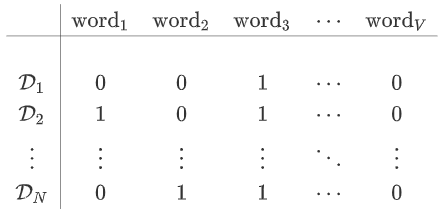

给定包含$N$篇文档的语料库$\mathbb{D}=\{\mathcal{D}_1,\mathcal{D}_2,\cdots,\mathcal{D}_N\}$，所有的单词来自于包含$V$个词汇的词汇表$\mathbb{V}=\{\text{word}_1,\text{word}_2,\cdots,\text{word}_V\}$，其中$V$表示词汇表的大小 。每篇文档$\mathbb{D}_i$包含单词序列$\{\text{word}_{w_1^i},\text{word}_{w_2^i},\cdots,\text{word}_{w_{n_i}^i}\}$，其中$w_i^j\in\{1,2,\cdots,V\}$表示第$i$篇文档的第$j$个单词在词汇表中的编号，$n_i$表示第$i$篇文档包含$n_i$个单词。词的表达任务的问题是如何表示每个词汇$\text{word}_v$。

###### one-hot编码

对于词汇表中第$v$个单词$\text{word}_v$，将其表示为$\text{word}_v\to(0,\cdots,1,\cdots,0)^T$，即第$v$位取值为`1`，剩余位取值为`0` 。

这种表示方式有两个主要缺点：无法表达单词之间的关系，任何两个单词之间的距离一样；向量维度过高。

###### `TF-IDF`

`TF-IDF`是一种用于信息检索与数据挖掘的常用加权技术，常用于挖掘文章中的关键词。`TF-IDF`有两层意思，一层是词频，另一层是逆文档频率。当有`TF`和`IDF`后，将这两个词相乘，就能得到一个词的`TF-IDF`的值。某个词在文章中的`TF-IDF`越大，那么一般而言这个词在这篇文章的重要性会越高，由大到小排序，排在最前面的几个词，就是该文章的关键词。

计算词频：词频`TF` = $\frac{\text{某个词在文章中的出现次数}}{\text{文章的总词数}}$

计算逆文档频率：逆文档频率`IDF`= $\log(\frac{\text{语料库的文档总数}}{\text{包含该词的文档数}+1})$

计算`TF-IDF`：`TF-IDF`=$\text{TF}\times \text{IDF}$

#### 向量空间模型

向量空间模型假设单词和单词之间是相互独立的，每个单词代表一个独立的语义单元。实际上该假设很难满足：①文档中的单词和单词之间存在一定关联性，单词和其前面几个单词、后面几个单词可能存在语义上的相关性，而向量空间模型忽略了这种上下文的作用；②文档中存在很多的一词多义和多词同义的现象，每个单词并不代表一个独立的语义单元。

给定语料库$\mathbb{D}$和词汇表$\mathbb{V}$，定义`文档-单词` 矩阵为：

令矩阵为$\mathbf{D}$，则：$D(i,j)=1$表示文档$\mathcal{D}_i$中含有单词$\text{word}_j$；$D(i,j)=0$表示文档$\mathcal{D}_i$中不含单词$\text{word}_j$。文档的上述表达并未考虑单词的顺序，也未考虑单词出现的次数。一种改进策略是考虑单词出现的次数，从而赋予`文档-单词` 矩阵以不同的权重：
$$
\mathbf{D}=\left[\begin{array}{c}w_{1,1} & w_{1,2} & \cdots & w_{1,V}\\
w_{2,1} & w_{2,2} & \cdots & w_{2,V}\\
\cdot & \cdot & \cdots & \cdot\\
w_{N,1} & w_{N,2} & \cdots & w_{N,V}
\end{array}

\right]
$$
其中$w_{i,j}$表示单词$\text{word}_j$在文档$\mathcal{D}_i$中的权重。如果单词$\text{word}_j$在文档$\mathcal{D}_i$中未出现，则权重$w_{i,j}=0$。如果单词$\text{word}_j$在文档$\mathcal{D}_i$中出现，则权重$w_{i,j}\ne0$。

权重$w_{i,j}$有两种常用的选取方法：单词权重等于单词出现的频率`TF`：$w_{i,j}=TF(\mathcal{D}_i,\text{word}_j)$，返回单词$\text{word}_j$在文档$\mathcal{D}_i$中出现的频数；单词权重等于单词的`TF-IDF`：

给定 `文档-单词` 矩阵，得到文档的向量表达：$\mathcal{D}_i\to(w_{i,1},\cdots,w_{i,V})^T$。给定文档$\mathcal{D}_i,\mathcal{D}_j$，则文档的相似度为：$\cos(\mathbf{D}_i,\mathcal{D}_j)$

##### `LSA`

基本假设是：如果两个词多次出现在同一篇文档中，则这两个词具有语义上的相似性。

给定`文档-单词` 矩阵$\mathbf{D}$，其中$w_{i,j}$表示单词$\text{word}_j$在文档$\mathcal{D}_i$中的权重，可以为：单词$\text{word}_j$在文档$\mathcal{D}_i$中是否出现的`0/1`值、单词$\text{word}_j$在文档$\mathcal{D}_i$中出现的频次、单词$\text{word}_j$在文档$\mathcal{D}_i$中的`TF-IDF`值

给定$\vec{\mathbf{v}}_j = (w_{1,j},\cdots,w_{N,j})^T$，它为矩阵$\mathbf{D}$的第$j$列，代表单词$\text{word}_j$的`单词-文档向量`向量，描述了该单词和所有文档的关系。向量内积$\vec{\mathbf{v}}_p\cdot \vec{\mathbf{v}}_q$描述了单词$\text{word}_p$和单词$\text{word}_q$在文档集合中的相似性。矩阵乘积$\mathbf{D}^T\mathbf{D}\in \mathbb{R}^{V\times V}$包含了所有词向量内积的结果。

给定$\vec{\mathbf{d}}_i = (w_{i,1},\cdots,w_{i,v})^T$，它为矩阵$\mathbf{D}$的第$i$行，代表文档$\mathcal{D}_i$的`单词-文档向量`向量，描述了该单词和所有文档的关系。向量内积$\vec{\mathbf{d}}_s\cdot \vec{\mathbf{d}}_t$描述了文档$\mathcal{D}_s$和文档$\mathcal{D}_t$的相似性。矩阵乘积$\mathbf{D}\mathbf{D}^T\in \mathbb{R}^{N\times N}$包含了所有文档向量内积的结果。

对矩阵$\mathbf{D}$进行`SVD` 分解。假设矩阵$\mathbf{D}$可以分解为：$\mathbf{D}=\mathbf{P}\mathbf{\Sigma}\mathbf{Q}^T$。其中：

$\mathbf{P}\in \mathbb{R}^{N\times N} \mathbf{Q}\in \mathbb{R}^{V\times V}$为单位正交矩阵。$\mathbf{\Sigma} \in \mathbb{R}^{N\times V}$为广义对角矩阵。

`SVD` 分解的物理意义为：将文档按照主题分解。所有的文档一共有$r$个主题，每个主题的强度分别为：$\sigma_1,\cdots,\sigma_r$。

第$i$篇文档$\mathcal{D}_i$由这$r$个主题组成，文档的主题概率分布（称作`文档-主题向量`）为：
$$
\vec{\mathbf{p}}^{i}=(P(i,1),\cdots, P(i,r))^T
$$
第$t$个主题由$V$个单词组成，主题的单词概率分布（称作`主题-单词向量` ）为：
$$
\vec{\mathbf{q}}^{t}=(Q(t,1),\cdots, Q(t,V))^T
$$
第$j$个单词由$r$个主题组成，单词的主题概率分布（称作 `单词-主题` 向量）为：
$$
\vec{\mathbf{v}}^{j}=(Q(1,j),\cdots, Q(r,j))^T
$$
根据$\mathbf{D}=\mathbf{P}\mathbf{\Sigma}\mathbf{Q}^T$有：则该分解的物理意义为：`文档-单词` 矩阵 = `文档-主题` 矩阵 x `主题强度` x `主题-单词` 矩阵。

#### `Word2Vec`

