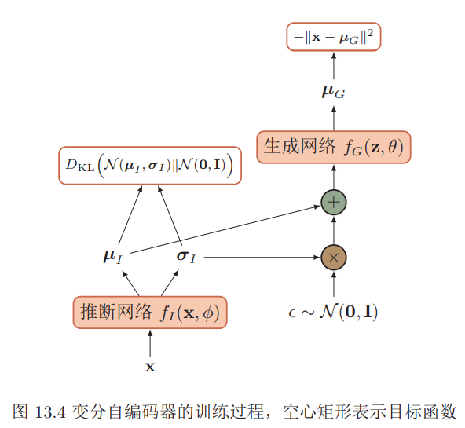
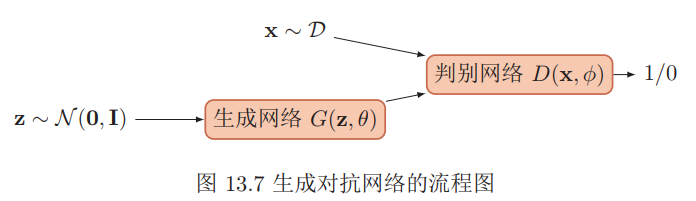
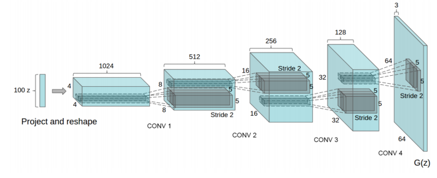

### 无监督学习

#### 无监督特征学习

无监督特征学习是指从无标注的数据中自动学习有效的数据表示，从而能够帮助后续的机器学习模型更快速地达到更好的性能。无监督特征学习主要方法有主成分分析、稀疏编码、自编码器等。

###### 稀疏编码

在数学上，编码是指给定一组基向量$A = [\mathbf{a}_1, · · · , \mathbf{a}_p]$，将输入样本$\mathbf{x} ∈ R^d$ 表示为这些基向量的线性组合
$$
\begin{aligned} \mathbf{x} &=\sum_{i=1}^{p} z_{i} \mathbf{a}_{i} \\ &=A \mathbf{z} \end{aligned}
$$
其中基向量的系数$ \mathbf{z} = [z_1;· · · ; z_p]$ 称为输入样本 $\mathbf{x}$的编码，基向量$A$也称为字典

编码是对$d$维空间中的样本$\mathbf{x}$找到其在$p$维空间中的表示（或投影），其目标通常是编码的各个维度都是统计独立的，并且可以重构出输入样本。如果$p$个基向量刚好可以支撑$p$维的欧氏空间，则这$p$个基向量是完备的。如果$p$个基向量可以支撑$d$维的欧氏空间，并且$p > d$，则这$p$个基向量是过完备的，冗余的。

给定一组$N $个输入向量$\mathbf{x}^{(1)}, · · · , \mathbf{x}^{(N)}$，其稀疏编码的目标函数定义为
$$
L(A, Z)=\sum_{n=1}^{N}\left(\left\|\mathbf{x}^{(n)}-A \mathbf{z}^{(n)}\right\|^{2}+\eta \rho\left(\mathbf{z}^{(n)}\right)\right)
$$
其中$ρ(·)$是一个稀疏性衡量函数，$η $是一个超参数，用来控制稀疏性的强度。

常用稀疏衡量函数

ℓ1 范数：$\rho(\mathbf{z})=\sum_{i=1}^{p}\left|z_{i}\right|$

对数函数：$\rho(\mathbf{z})=\sum_{i=1}^{p} \log \left(1+z_{i}^{2}\right)$

指数函数：$\rho(\mathbf{z})=\sum_{i=1}^{p}-\exp \left(-z_{i}^{2}\right)$

给定一组$N $个输入向量$\mathbf{x}^{(1)}, · · · , \mathbf{x}^{(N)}$，需要同时学习基向量$A$以及每个输入样本对应的稀疏编码$\mathbf{z}^{(1)}, · · · , \mathbf{z}^{(N)}$。

稀疏编码的训练过程一般用交替优化的方法进行。

固定基向量$A$，对每个输入$\mathbf{x}^{(n)}$，计算其对应的最优编码
$$
\min _{\mathbf{x}^{(n)}}\left\|\mathbf{x}^{(n)}-A \mathbf{z}^{(n)}\right\|^{2}-\eta \rho\left(\mathbf{z}^{(n)}\right), \forall n \in[1, N]
$$
固定上一步得到的编码$\mathbf{z}^{(1)}, · · · , \mathbf{z}^{(N)}$，计算其最优的基向量
$$
\min _{A} \sum_{n=1}^{N}\left(\left\|\mathbf{x}^{(n)}-A \mathbf{z}^{(n)}\right\|^{2}\right)+\lambda \frac{1}{2}\|A\|^{2}
$$

###### 自编码器

假设有一组$d$维的样本$\mathbf{x}^{(n)} ∈ R^d, 1 ≤ n ≤ N$，自编码器将这组数据映射到特征空间得到每个样本的编$\mathbf{z}^{(n)} ∈ R^p, 1 ≤ n ≤ N$，并且希望这组编码可以重构出原来的样本。

自编码器的结构可分为两部分：

编码器：$f : \mathbb{R}^{d} \rightarrow \mathbb{R}^{p}$

解码器：$g : \mathbb{R}^{p} \rightarrow \mathbb{R}^{d}$

自编码器的学习目标是最小化重构错误：
$$
\begin{aligned} \mathcal{L} &=\sum_{n=1}^{N}\left\|\mathbf{x}^{(n)}-g\left(f\left(\mathbf{x}^{(n)}\right)\right)\right\|^{2} \\ &=\sum_{n=1}^{N}\left\|\mathbf{x}^{(n)}-f \circ g\left(\mathbf{x}^{(n)}\right)\right\|^{2} \end{aligned}
$$
自编码器除了可以学习低维编码之外，也学习高维的稀疏编码。假设中间隐藏层$\mathbf{z}$的维度为$p$大于输入样本$\mathbf{x}$的维度$d$，并让$\mathbf{z}$尽量稀疏，这就是稀疏自编码器
$$
\mathcal{L}=\sum_{n=1}^{N} \| \mathbf{x}^{(n)}-\mathbf{x}^{(n)} )\left\|^{2}+\eta \rho\left(\mathbf{z}^{(n)}\right)\right)+\lambda\|W\|^{2}
$$
稀疏性度量函数$ρ(·)$除了上面提到的之外，还可以定义为一组训练样本中每一个神经元激活的频率。给定$N $个训练样本，隐藏层第$j $个神经元平均活性值为$\hat{\rho}_{j}=\frac{1}{N} \sum_{n=1}^{N} z_{j}^{(n)}$ ，$\hat{\rho}_{j}$可以近似地看作是第$j$ 个神经元激活的概率。我们希望$\hat{\rho}_{j}$接近于一个事先给定的值$ρ∗$，可以通过$KL$距离来衡量$\hat{\rho}_{j}$和$ρ∗$ 的差异，即
$$
\mathrm{KL}\left(\rho^{*} \| \hat{\rho}_{j}\right)=\rho^{*} \log \frac{\rho^{*}}{\hat{\rho}_{j}}+\left(1-\rho^{*}\right) \log \frac{1-\rho^{*}}{1-\hat{\rho}_{j}}
$$
稀疏性度量函数定义为
$$
\rho\left(\mathbf{z}^{(n)}\right)=\sum_{j=1}^{p} \mathrm{KL}\left(\rho^{*} \| \hat{\rho}_{j}\right)
$$
对于很多数据来说，仅使用两层神经网络的自编码器还不足以获取一种好的数据表示。为了获取更好的数据表示，我们可以使用更深层的神经网络。深层神经网络作为自编码器提取的数据表示一般会更加抽象，能够更好地捕捉到数据的语义信息。在实践中经常使用逐层堆叠的方式来训练一个深层的自编码器，称为堆叠自编码器。堆叠自编码一般可以采用逐层训练来学习网络参数。

我们使用自编码器是为了得到有效的数据表示，而有效的数据表示除了具有最小重构错误或稀疏性等性质之外，我们还可以要求其具备其它性质，比如对数据部分损坏的鲁棒性。降噪自编码器就是一种通过引入噪声来增加编码鲁棒性的自编码器。对于一个向量$\mathbf{x}$，我们首先根据一个比例$\mu$随机将$\mathbf{x}$的一些维度的值设置为$0$，得到一个被损坏的向量$\tilde{\mathbf{x}}$。然后将被损坏的向量$\tilde{\mathbf{x}}$输入给自编码器得到编码$\mathbf{z}$，并重构出原始的无损输入$\mathbf{x}$。

#### 密度估计

###### 参数密度估计

参数密度估计是根据先验知识假设随机变量服从某种分布，然后通过训练样本来估计分布的参数。令$\mathcal{D}=\left\{\mathbf{x}^{(n)}\right\}_{i=1}^{N}$为从某个未知分布中独立抽取的$N $个训练样本，假设这些样本服从一个概率分布函数$p(\mathbf{x}|θ)$，其对数似然函数为

$$
\log p(\mathcal{D} | \theta)=\sum_{n=1}^{N} \log p\left(\mathbf{x}^{(n)} | \theta\right)
$$
我们要估计一个参数$θ^{ML}$ 来使得
$$
\theta^{M L}=\underset{\theta}{\arg \max } \sum_{n=1}^{N} \log p\left(\mathbf{x}^{(n)} | \theta\right)
$$
在实际应用中，参数密度估计一般存在以下问题：模型选择问题：即如何选择数据分布的密度函数。实际数据的分布往往是非常复杂的，而不是简单的正态分布或多项分布。不可观测变量问题：即我们用来训练的样本只包含部分的可观测变量，还有一些非常关键的变量是无法观测的，这导致我们很难准确估计数据的真实分布。维度灾难问题：即高维数据的参数估计十分困难。随着维度的增加，估计参数所需要的样本数量指数增加。在样本不足时会出现过拟合。

###### 非参数密度估计

非参数密度估计是不假设数据服从某种分布，通过将样本空间划分为不同的区域并估计每个区域的概率来近似数据的概率密度函数。

对于高维空间中的一个随机向量$\mathbf{x}$，假设其服从一个未知分布$p(\mathbf{x})$，则$\mathbf{x}$落入空间中的小区域$\mathcal{R}$的概率为
$$
P=\int_{\mathcal{R}} p(\mathbf{x}) d \mathbf{x}
$$
给定$N$ 个训练样本$\mathcal{D}=\left\{\mathbf{x}^{(n)}\right\}_{i=1}^{N}$落入区域$\mathcal{R}$的样本数量$K $服从二项分布
$$
P_{K}=\left( \begin{array}{c}{N} \\ {K}\end{array}\right) P^{K}(1-P)^{1-K}
$$
其中$\frac{K}{N} $的期望为$E[\frac{K}{N}] = P$，方差为$var(\frac{K}{N}) = \frac{P(1 − P)}{N}$。当$N$非常大时，我们可以近似认为$P \approx \frac{K}{N}$。假设区域$\mathcal{R}$足够小，其内部的概率密度是相同的，则有$P \approx p(\mathbf{x}) V$，其中$V $为区域$\mathcal{R}$的体积。结合上述两个公式，得到$p(\mathbf{x}) \approx \frac{K}{N V}$。实践中非参数密度估计通常使用两种方式：（1）固定区域大小$V$ ，统计落入不同区域的数量，这种方式包括直方图方法和核方法两种。（2）改变区域大小以使得落入每个区域的样本数量为$K$，这种方式称为K近邻方法。

核密度估计，也叫$\text{Parzen}$窗方法，是一种直方图方法的改进。假设$\mathcal{R}$为$d$维空间中的一个以点$\mathbf{x}$为中心的超立方体，并定义核函数
$$
\phi\left(\frac{\mathbf{z}-\mathbf{x}}{h}\right)=\left\{\begin{array}{ll}{1} & {\text { if }\left|z_{i}-x_{i}\right|<\frac{h}{2}, 1 \leq i \leq d} \\ {0} & {\text { else }}\end{array}\right.
$$
来表示一个样本$\mathbf{z}$是否落入该超立方体中，其中$h$为超立方体的边长，也称为核
函数的宽度。给定$N $个训练样本$\mathcal{D}=\left\{\mathbf{x}^{(n)}\right\}_{i=1}^{N}$，落入区域$\mathcal{R}$的样本数量$K$ 为
$$
K=\sum_{n=1}^{N} \phi\left(\frac{\mathrm{x}^{(n)}-\mathrm{x}}{h}\right)
$$
则点$\mathbf{x}$的密度估计为
$$
p(\mathbf{x})=\frac{K}{N h^{d}}=\frac{1}{N h^{d}} \sum_{n=1}^{N} \phi\left(\frac{\mathbf{x}^{(n)}-\mathbf{x}}{h}\right)
$$

### 深度生成模型

假设在一个连续的或离散的高维空间$\mathcal{X}$ 中，存在一个随机向量$\mathbf{X}$服从一个未知的数据分布$p_r(\mathbf{x}), \mathbf{x} ∈ \mathcal{X}$。生成模型是根据一些可观测的样本$\mathbf{x}^{(1)}, \mathbf{x}^{(2)}, · · · , \mathbf{x}^{(N)}$ 来学习一个参数化的模型$p_θ(\mathbf{x})$来近似未知分布$p_r(\mathbf{x})$，并可以用这个模型来生成一些样本，使得生成的样本和真实的样本尽可能地相似。深度生成模型就是利用深层神经网络可以近似任意函数的能力来建模一个复杂的分布$p_r(\mathbf{x})$。假设一个随机向量$\mathcal{Z}$ 服从一个简单的分布$p(\mathbf{z}), \mathbf{z} ∈ \mathcal{Z}$，我们使用一个深层神经网络 $g : \mathcal{Z} → \mathcal{X}$，并使得 $g(\mathbf{z})$服从$p_r(\mathbf{x})$。

生成模型一般具有两个基本功能：密度估计和生成样本。给定一组数据$\mathcal{D} = \{\mathbf{x}^{
(i)}\}, 1 ≤ i ≤ N$，假设它们都是从独立地从相同的概率密度函数为$p_r(\mathbf{x})$的未知分布中产生的。密度估计是根据数据集$\mathcal{D}$来估计其概率密度函数$p_θ(\mathbf{x})$。生成模型也可以应用于监督学习。监督学习的目标是建模输出标签的条件概率密度函数$p(y|\mathbf{x})$。根据贝叶斯公式，我们可以将监督学习问题转换为联合概率密度函数$p(\mathbf{x}, y)$的密度估计问题。

生成样本就是给定一个概率密度函数为$p_θ(\mathbf{x})$的分布，生成一些服从这个分布的样本，也称为采样。在得到$p(\mathbf{z}, θ)$和$p(\mathbf{x}|\mathbf{z}, θ)$之后，我们就可以生成数据$\mathbf{x}$，具体过程可以分为两步进行：根据隐变量的先验分布$p(\mathbf{z}, θ)$进行采样，得到样本$\mathbf{z}$；根据条件分布$p(\mathbf{x}|\mathbf{z}, θ)$进行采样，得到$\mathbf{x}$。因此在生成模型中，重点是估计条件分布$p(\mathbf{x}|\mathbf{z}, θ)$。

#### 变分自编码器

假设一个生成模型中包含隐变量，即有部分变量是不可观测的，其中观测变量$\mathbf{X}$是一个高维空间$\mathcal{X}$ 中的随机向量，隐变量$\mathbf{Z}$是一个相对低维的空间$\mathcal{Z} $中的随机向量。这个生成模型的联合概率密度函数可以分解为
$$
p(\mathbf{x}, \mathbf{z} | \theta)=p(\mathbf{x} | \mathbf{z}, \theta) p(\mathbf{z} | \theta)
$$
其中$p(\mathbf{z}|θ)$为隐变量$\mathbf{z}$先验分布的概率密度函数，$p(\mathbf{x}|\mathbf{z}, θ)$为已知$\mathbf{z}$时观测变量$\mathbf{x}$的条件概率密度函数，$θ $表示两个密度函数的参数。一般情况下，我们可以假设$p(\mathbf{z}|θ)$和$p(\mathbf{x}|\mathbf{z}, θ)$为某种参数化的分布族。这些分布的形式已知，只是参数$θ$未知，可以通过最大化似然来进行估计。

给定一个样本$\mathbf{x}$，其对数边际似然$log p(\mathbf{x}|θ)$可以分解为
$$
\log p(\mathbf{x} | \theta)=E L B O(q, \mathbf{x} | \theta, \phi)+D_{\mathrm{KL}}(q(\mathbf{z} | \phi) \| p(\mathbf{z} | \mathbf{x}, \theta))
$$
其中$q(\mathbf{z}|ϕ)$是额外引入的变分密度函数，其参数为$ϕ$，$ELBO(q, \mathbf{x}|θ, ϕ)$为证据下界
$$
E L B O(q, \mathbf{x} | \theta, \phi)=\mathbb{E}_{\mathbf{z} \sim q(\mathbf{z} | \phi)}\left[\log \frac{p(\mathbf{x}, \mathbf{z} | \theta)}{q(\mathbf{z} | \phi)}\right]
$$
最大化对数边际似然$log p(\mathbf{x}|θ)$可以用$\text{EM}$算法来求解，具体可以分为两步：$\text{E-step}$: 寻找一个密度函数$q(\mathbf{z}|ϕ)$使其等于或接近于后验密度函数$p(\mathbf{z}|\mathbf{x}, θ)$；$\text{M-step}$: 保持$q(\mathbf{z}|ϕ)$固定，寻找$θ $来最大化$ELBO(q, \mathbf{x}|θ, ϕ)$。这样个步骤不断重复，直到收敛。

在$\text{EM}$算法的每次迭代中，理论上最优的$q(\mathbf{z}|ϕ)$为隐变量的后验概率密度函数$p(\mathbf{z}|\mathbf{x}, θ)$，
$$
p(\mathbf{z} | \mathbf{x}, \theta)=\frac{p(\mathbf{x} | \mathbf{z}, \theta) p(\mathbf{z} | \theta)}{\int_{z} p(\mathbf{x} | \mathbf{z}, \theta) p(\mathbf{z} | \theta) d \mathbf{z}}
$$
变分自编码器是一种深度生成模型，其思想是利用神经网络来分别建模两个复杂的条件概率密度函数。用神经网络来产生变分分布$q(\mathbf{z}|ϕ)$，称为推断网络。理论上$q(\mathbf{z}|ϕ)$可以不依赖$\mathbf{x}$。但由于的目$q(\mathbf{z}|ϕ)$标是近似后验分布$p(\mathbf{z}|\mathbf{x}, θ)$，其和$\mathbf{x}$相关，因此变分密度函数一般写为$p(\mathbf{z}|\mathbf{x}, θ)$。推断网络的输入为$\mathbf{x}$，输出为变分分布$p(\mathbf{z}|\mathbf{x}, θ)$用神经网络来产生概率分布$p(\mathbf{x}|\mathbf{z}, θ)$，称为生成网络。生成网络的输入为$\mathbf{z}$，输出为概率分布$p(\mathbf{x}|\mathbf{z}, θ)$。

##### 推断网络

为了简单起见，假设$q(\mathbf{z}|\mathbf{x}, ϕ)$是服从对角化协方差的高斯分布，
$$
q(\mathbf{z} | \mathbf{x}, \phi)=\mathcal{N}\left(\mathbf{z} | \boldsymbol{\mu}_{I}, \boldsymbol{\sigma}_{I}^{2} I\right)
$$
其中$µ_I$ 和$σ^2_I$是高斯分布的均值和方差，可以通过推断网络$f_I (\mathbf{x}, ϕ)$来预测。
$$
\left[ \begin{array}{c}{\boldsymbol{\mu}_{I}} \\ {\boldsymbol{\sigma}_{I}}\end{array}\right]=f_{I}(\mathbf{x}, \phi)
$$
其中推断网络$f_I (\mathbf{x}, ϕ)$可以是一般的全连接网络或卷积网络，比如一个两层的神经网络
$$
\begin{aligned} \mathbf{h} &=\sigma\left(W^{(1)} \mathbf{x}+\mathbf{b}^{(1)}\right) \\ \boldsymbol{\mu}_{I} &=W^{(2)} \mathbf{h}+\mathbf{b}^{(2)} \\ \boldsymbol{\sigma}_{I} &=\operatorname{softplus}\left(W^{(3)} \mathbf{h}+\mathbf{b}^{(3)}\right) \end{aligned}
$$

###### 推断网络的目标

推断网络的目标是使得$q(\mathbf{z}|\mathbf{x}, ϕ)$来尽可能接近真实的后验$p(\mathbf{z}|\mathbf{x}, θ)$，需要找到变分参数$ϕ^∗$来最小化两个分布的KL散度。
$$
\phi^{*}=\underset{\phi}{\arg \min } D_{\mathrm{KL}}(q(\mathbf{z} | \mathbf{x}, \phi) \| p(\mathbf{z} | \mathbf{x}, \theta))
$$
变分分布$q(\mathbf{z}|\mathbf{x}, ϕ)$与真实后验$q(\mathbf{z}|\mathbf{x}, ϕ)$的KL散度等于对数边际似然$log p(\mathbf{x}|θ)$与其下界$ELBO(q, \mathbf{x}|θ, ϕ)$的差。
$$
D_{\mathrm{KL}}(q(\mathbf{z} | \mathbf{x}, \phi) \| p(\mathbf{z} | \mathbf{x}, \theta))=\log p(\mathbf{x} | \theta)-E L B O(q, \mathbf{x} | \theta, \phi)
$$
因此，推断网络的目标函数为
$$
\begin{aligned} \phi^{*} &=\arg \min _{\phi} D_{\mathrm{KL}}(q(\mathbf{z} | \mathbf{x}, \phi) \| p(\mathbf{z} | \mathbf{x}, \theta)) \\ &=\underset{\phi}{\arg \min } \log p(\mathbf{x} | \theta)-E L B O(q, \mathbf{x} | \theta, \phi) \\ &=\underset{\phi}{\arg \max } E L B O(q, \mathbf{x} | \theta, \phi) \end{aligned}
$$

##### 生成网络

生成模型的联合分布$p(\mathbf{x}, \mathbf{z}|θ)$可以分解为两部分：隐变量$\mathbf{z}$的先验分布$p(\mathbf{z}|θ)$和条件概率分布$p(\mathbf{x}|\mathbf{z}, θ)$。先验分布$p(\mathbf{z}|θ)$一般假设隐变量$\mathbf{z}$的先验分布为各向同性的标准高斯分布$N (\mathbf{z}|0, I)$。隐变量$\mathbf{z}$的每一维之间都是独立的。条件概率分布$p(\mathbf{x}|\mathbf{z}, θ) $建模条件分布$p(\mathbf{x}|\mathbf{z}, θ)$通过生成网络来建模。为了简单起见，我们同样用参数化的分布族来表示条件概率分布$ p(\mathbf{x}|\mathbf{z}, θ)$，这些分布族的参数可以用生成网络来计算得到。

###### 生成网络的目标

生成网络的目标是找到一组$θ^∗$ 最大化证据下界$ELBO(q, \mathbf{x}|θ, ϕ)$。
$$
\theta^{*}=\underset{\theta}{\arg \max } E L B O(q, \mathbf{x} | \theta, \phi)
$$
推断网络和生成网络的目标都为最大化证据下界$ELBO(q, \mathbf{x}|θ, ϕ)$。因此，变分自编码器的总目标函数为
$$
\begin{array}{l}{\max _{\theta, \phi} E L B O(q, \mathbf{x} | \theta, \phi)=\max _{\theta, \phi} \mathbb{E}_{\mathbf{z} \sim q(\mathbf{z} | \phi)}\left[\log \frac{p(\mathbf{x} | \mathbf{z}, \theta) p(\mathbf{z} | \theta)}{q(\mathbf{z} | \phi)}\right]} \\ {=\max _{\theta, \phi} \mathbb{E}_{\mathbf{z} \sim q(\mathbf{z} | \mathbf{x}, \phi)}[\log p(\mathbf{x} | \mathbf{z}, \theta)]-D_{\mathrm{KL}}(q(\mathbf{z} | \mathbf{x}, \phi) \| p(\mathbf{z} | \theta))}\end{array}
$$
其中先验分布$p(\mathbf{z}|θ) = N (\mathbf{z}|0, I)$，$θ$ 和$ϕ$分别表示生成网络和推断网络的参数。

中的期望$\mathbb{E}_{\mathbf{z} \sim q(\mathbf{z} | \mathbf{x}, \phi)}[\log p(\mathbf{x} | \mathbf{z}, \theta)]$一般通过采样的方式进行计算。对于每个样本$\mathbf{x}$，根据$q(\mathbf{z}|\mathbf{x}, ϕ)$采集$M $个$\mathbf{z}^{(m)}, 1 ≤ m ≤ M$
$$
\mathbb{E}_{\mathbf{z} \sim q(\mathbf{z} | \mathbf{x}, \phi)}[\log p(\mathbf{x} | \mathbf{z}, \theta)] \approx \frac{1}{M} \sum_{m=1}^{M} \log p\left(\mathbf{x} | \mathbf{z}^{(m)}, \theta\right)
$$

##### 训练

给定一个数据集$\mathcal{D}$，包含$ N $个从未知数据分布中抽取的独立同分布样本$\mathbf{x}^{(1)}, \mathbf{x}^{(2)}, \cdots, \mathbf{x}^{(N)}$。变分自编码器的目标函数为
$$
\mathcal{J}(\phi, \theta | \mathcal{D})=\sum_{n=1}^{N}\left(\frac{1}{M} \sum_{m=1}^{M} \log p\left(\mathbf{x}^{(n)} | \mathbf{z}^{(n, m)}, \theta\right)-D_{\mathrm{KL}}\left(q\left(\mathbf{z} | \mathbf{x}^{(n)}, \phi\right) \| \mathcal{N}(\mathbf{z} | \mathbf{0}, \mathbf{I})\right)\right)
$$
其中$\mathbf{z}^{(n,m) }$为第$n$个样本的变分分布$q(\mathbf{z}|\mathbf{x}^{(n)}, ϕ)$的第$m$个采样。如果采用随机梯度方法，每次从数据集中采一个样本$\mathbf{x}$，然后根据$q(\mathbf{z}|\mathbf{x}, ϕ)$采一个隐变量$\mathbf{z}$，则目标函数变为

$$
\mathcal{J}(\phi, \theta | \mathbf{x})=\log p(\mathbf{x} | \mathbf{z}, \theta)-D_{\mathrm{KL}}(q(\mathbf{z} | \mathbf{x}, \phi) \| \mathcal{N}(\mathbf{z} | \mathbf{0}, \mathbf{I}))
$$
对于两个正态分布$N (µ_1, Σ_1)$和$N (µ_2, Σ_2)$，其$\text{KL}$散度为
$$
\begin{array}{l}{D_{\mathrm{KL}}\left(\mathcal{N}\left(\boldsymbol{\mu}_{1}, \Sigma_{1}\right) \| \mathcal{N}\left(\boldsymbol{\mu}_{2}, \Sigma_{2}\right)\right)} \\ {=\frac{1}{2}\left(\operatorname{tr}\left(\Sigma_{2}^{-1} \Sigma_{1}\right)+\left(\boldsymbol{\mu}_{2}-\boldsymbol{\mu}_{1}\right)^{\top} \Sigma_{2}^{-1}\left(\boldsymbol{\mu}_{2}-\boldsymbol{\mu}_{1}\right)-k+\log \frac{\left|\Sigma_{2}\right|}{\left|\Sigma_{1}\right|}\right)}\end{array}
$$
这样当$q(\mathbf{z}|\mathbf{x}^{(n)}, ϕ)$为$N (µ_I,σ^2_II)$时，
$$
\begin{array}{l}{D_{\mathrm{KL}}(q(\mathbf{z} | \mathbf{x}, \phi) \| p(\mathbf{z}, \theta))} \\ {=\frac{1}{2}\left(\operatorname{tr}\left(\boldsymbol{\sigma}_{I}^{2} I\right)+\boldsymbol{\mu}_{I}^{\top} \boldsymbol{\mu}_{I}-k-\log \left(\left|\boldsymbol{\sigma}_{I}^{2} I\right|\right)\right.}\end{array}
$$
其中$µ_I$和$σ_I$为推断网络$f_I(\mathbf{x}, ϕ)$的输出。

假设$q(\mathbf{z}|\mathbf{x}, ϕ)$为正态分布$N(µ_I,σ^2_II)$，我们可以通过下面方式来采样$\mathbf{z}$。
$$
\mathbf{z}=\boldsymbol{\mu}_{I}+\boldsymbol{\sigma}_{I} \odot \boldsymbol{\epsilon}
$$
其中$ϵ ∼ N (0, I)$，$µ_I $和$σ_I $是推断网络$f_I (x, ϕ)$的输出。这样$\mathbf{z}$和$µ_I,σ_I $的关系从采样关系变为函数关系，就可以求$\mathbf{z}$关于$ϕ$的导数。如果进一步假设$p(\mathbf{x}|\mathbf{z}, θ)$服从高斯分布$N (\mathbf{x}|µ_G, I)$，其中$µ_G = f_G(\mathbf{z}, θ)$是生成网络的输出，则目标函数可以简化为

$$
\mathcal{J}(\phi, \theta | \mathbf{x})=-\left\|\mathbf{x}-\boldsymbol{\mu}_{G}\right\|^{2}+D_{\mathrm{KL}}\left(\mathcal{N}\left(\boldsymbol{\mu}_{I}, \boldsymbol{\sigma}_{I}\right) \| \mathcal{N}(\mathbf{0}, \mathbf{I})\right)
$$
其中第一项可以近似看作是输入$\mathbf{x}$的重构正确性，第二项可以看作是正则化项。

#### 生成对抗网络

如果只是希望有一个模型能生成符合数据分布$p_r(\mathbf{x}) $的样本，那么可以不显示地估计出数据分布的密度函数。假设在低维空间$\mathcal{Z} $中有一个简单容易采样的分布$p(\mathbf{z})$。我们用神经网络构建一个映射函数$G : \mathcal{Z} → \mathcal{X}$，称为生成网络。利用神经网络强大的拟合能力，使得$G(\mathbf{z})$服从数据分布$p_r(\mathbf{x})$。这种模型就称为隐式密度模型。

##### 判别网络

在生成对抗网络中，有两个网络进行对抗训练。一个是判别网络，目标是尽量准确地判断一个样本是来自于真实数据还是生成网络产生的；另一个是生成网络，目标是尽量生成判别网络无法区分来源的样本。这两个目标相反的网络不断地进行交替训练。当最后收敛时，如果判别网络再也无法判断出一个样本的来源，那么也就等价于生成网络可以生成符合真实数据分布的样本。

判别网络：$D(\mathbf{x}, ϕ)$的目标是区分出一个样本$\mathbf{x}$时来自于真实分布$p_r(\mathbf{x})$还是来自于生成模型$p_θ(\mathbf{x})$，因此判别网络实际上是一个两类分类器。用标签$y = 1$来表示样本来自真实分布，$y = 0$表示样本来自模型，判别网络$D(\mathbf{x}, ϕ)$的输出为$\mathbf{x}$属于真实数据分布的概率，即
$$
p(y=1 | \mathbf{x})=D(\mathbf{x}, \phi)
$$
给定一个样本$(\mathbf{x}, y)，y = \{1, 0\}$表示其自于$p_r(\mathbf{x})$还是$p_θ(\mathbf{x})$，判别网络的目标函数为最小化交叉熵，即最大化对数似然
$$
\begin{aligned} & \min _{\phi}-\left(\mathbb{E}_{\mathbf{x}}[y \log p(y=1 | \mathbf{x})+(1-y) \log p(y=0 | \mathbf{x})]\right) \\=& \max _{\phi}\left(\mathbb{E}_{\mathbf{x} \sim p_{r}(\mathbf{x})}[\log D(\mathbf{x}, \phi)]+\mathbb{E}_{\mathbf{x}^{\prime} \sim p_{\theta}\left(\mathbf{x}^{\prime}\right)}\left[\log \left(1-D\left(\mathbf{x}^{\prime}, \phi\right)\right)\right]\right) \\=& \max _{\phi}\left(\mathbb{E}_{\mathbf{x} \sim p_{r}(\mathbf{x})}[\log D(\mathbf{x}, \phi)]+\mathbb{E}_{\mathbf{z} \sim p(\mathbf{z})}[\log (1-D(G(\mathbf{z}, \theta), \phi))]\right) \end{aligned}
$$
其中$θ $和$ϕ$分布时生成网络和判别网络的参数。

##### 生成网络

生成网络的目标刚好和判别网络相反，即让判别网络将自己生成的样本判别为真实样本。
$$
\begin{array}{c}{\max _{\theta}\left(\mathbb{E}_{\mathbf{z} \sim p(\mathbf{z})}[\log D(G(\mathbf{z}, \theta), \phi)]\right)} \\ {=\min _{\theta}\left(\mathbb{E}_{\mathbf{z} \sim p(\mathbf{z})}[\log (1-D(G(\mathbf{z}, \theta), \phi))]\right)}\end{array}
$$
生成对抗网络是指一类采用对抗训练方式来进行学习的深度生成模型，其包含的判别网络和生成网络都可以根据不同的生成任务使用不同的网络

深度卷积生成对抗网络：在$DCGAN$中，判别网络是一个传统的深度卷积网络，但使用了带步长的卷积来实现下采样操作，不用最大汇聚操作。生成网络使用一个特殊的深度卷积网络来实现，使用微步卷积来生成$64 × 64 ×3$大小的图像。

$DCGAN$的主要优点是通过一些经验性的网络结构设计使得对抗训练更加稳定。使用代步长的卷积（在判别网络中）和微步卷积（在生成网络中）来代替汇聚操作，以免损失信息；使用批量归一化；去除卷积层之后的全连接层；在生成网络中，除了最后一层使用$Tanh$激活函数外，其余层都使用$ReLU$函数；在判别网络中，都使用$LeakyReLU$激活函数。

##### 模型分析

将判别网络和生成网络合并，整个生成对抗网络的整个目标函数看作最小化最大化游戏
$$
\begin{aligned} & \min _{\theta} \max _{\phi}\left(\mathbb{E}_{\mathbf{x} \sim p_{r}(\mathbf{x})}[\log D(\mathbf{x}, \phi)]+\mathbb{E}_{\mathbf{x} \sim p_{\theta}(\mathbf{x})}[\log (1-D(\mathbf{x}, \phi))]\right) \\=& \min _{\theta} \max _{\phi}\left(\mathbb{E}_{\mathbf{x} \sim p_{r}(\mathbf{x})}[\log D(\mathbf{x}, \phi)]+\mathbb{E}_{\mathbf{z} \sim p(\mathbf{z})}[\log (1-D(G(\mathbf{z}, \theta), \phi)])\right.\end{aligned}
$$
假设$p_r(\mathbf{x})$和$p_θ(\mathbf{x})$已知，则最优的判别器为
$$
D^{\star}(\mathbf{x})=\frac{p_{r}(\mathbf{x})}{p_{r}(\mathbf{x})+p_{\theta}(\mathbf{x})}
$$
将最优的判别器$D^⋆(\mathbf{x})$代入，其目标函数变为
$$
\begin{aligned} \mathcal{L}\left(G | D^{\star}\right) &=\mathbb{E}_{\mathbf{x} \sim p_{r}(\mathbf{x})}\left[\log D^{\star}(\mathbf{x})\right]+\mathbb{E}_{\mathbf{x} \sim p_{\theta}(\mathbf{x})}\left[\log \left(1-D^{\star}(\mathbf{x})\right)\right] \\ &=\mathbb{E}_{\mathbf{x} \sim p_{r}(\mathbf{x})}\left[\log \frac{p_{r}(\mathbf{x})}{p_{r}(\mathbf{x})+p_{\theta}(\mathbf{x})}\right]+\mathbb{E}_{\mathbf{x} \sim p_{\theta}(\mathbf{x})}\left[\log \frac{p_{\theta}(\mathbf{x})}{p_{r}(\mathbf{x})+p_{\theta}(\mathbf{x})}\right] \\ &=D_{\mathrm{KL}}\left(p_{r} \| p_{a}\right)+D_{\mathrm{KL}}\left(p_{\theta} \| p_{a}\right)-2 \log 2 \\ &=2 D_{\mathrm{JS}}\left(p_{r} \| p_{\theta}\right)-2 \log 2 \end{aligned}
$$
在生成对抗网络中，当判断网络为最优时，生成网络的优化目标是最小化真实分布$p_r$和模型分布$p_θ $之间的$JS$散度。当两个分布相同时，$JS$散度为$0$，最优生成网络$G^⋆ $对应的损失为$L(G^⋆| D^⋆) = −2 \log 2$。

然而，$JS$散度的一个问题是：当两个分布没有重叠时，它们之间的$JS$散度恒等于常数$\log 2$。对生成网络来说，目标函数关于参数的梯度为$0$。
$$
\frac{\partial \mathcal{L}\left(G | D^{\star}\right)}{\partial \theta}=0
$$

###### 模型坍塌

前向和逆向$KL$散度分别定义为
$$
\begin{aligned} D_{\mathrm{KL}}\left(p_{r} \| p_{\theta}\right) &=\int p_{r}(\mathbf{x}) \log \frac{p_{r}(\mathbf{x})}{p_{\theta}(\mathbf{x})} d \mathbf{x} \\ D_{\mathrm{KL}}\left(p_{\theta} \| p_{r}\right) &=\int p_{\theta}(\mathbf{x}) \log \frac{p_{\theta}(\mathbf{x})}{p_{r}(\mathbf{x})} d \mathbf{x} \end{aligned}
$$
在前向$KL$散度中，当$p_r(\mathbf{x}) → 0$而$p_θ(\mathbf{x}) > 0$时，$p_{r}(\mathbf{x}) \log \frac{p_{r}(\mathbf{x})}{p_{\theta}(\mathbf{x})} \rightarrow 0$。不管$p_θ(\mathbf{x})$如何取值，都对前向$KL$散度的计算没有贡献。当$p_r(\mathbf{x}) → 0$而$p_θ(\mathbf{x}) > 0$时，$p_{r}(\mathbf{x}) \log \frac{p_{r}(\mathbf{x})}{p_{\theta}(\mathbf{x})} \rightarrow \infin$。前向KL散度会变得非常大。因此，前向$KL$散度会鼓励模型分布$p_θ(\mathbf{x})$尽可能覆盖所有真实分布$p_r(\mathbf{x})0 >0$的点，而不用回避$p_r(\mathbf{x}) ≈ 0$的点。

在逆向$KL$散度中，当$p_r(\mathbf{x}) → 0$而$p_θ(\mathbf{x}) > 0$时，$p_{\theta}(\mathbf{x}) \log \frac{p_{\theta}(\mathbf{x})}{p_{r}(\mathbf{x})} \rightarrow \infty$。即当$p_θ(\mathbf{x})$接近于$0$，而$p_θ(\mathbf{x})$有一定的密度时，逆向$KL$散度会变得非常大。当$p_θ(\mathbf{x}) → 0$时，不管$p_r(\mathbf{x})$如何取值，$p_{\theta}(\mathbf{x}) \log \frac{p_{\theta}(\mathbf{x})}{p_{r}(\mathbf{x})} \rightarrow 0$。因此，逆向$KL$散度会鼓励模型分布$p_θ(\mathbf{x})$尽可能避开所有真实分布$p_r(\mathbf{x}) ≈0$的点，而不需要考虑是否覆盖所有布$p_r(\mathbf{x}) > 0$的点。

如果使用上面公式作为生成网络的目标函数，将最优判断网络$D^⋆$ 代入，得到
$$
\begin{array}{l}{\mathcal{L}^{\prime}\left(G | D^{\star}\right)=\mathbb{E}_{\mathbf{x} \sim p_{\theta}(\mathbf{x})}\left[\log D^{\star}(\mathbf{x})\right]} \\ {\quad=\mathbb{E}_{\mathbf{x} \sim p_{\theta}(\mathbf{x})}\left[\log \frac{p_{r}(\mathbf{x})}{p_{r}(\mathbf{x})+p_{\theta}(\mathbf{x})} \cdot \frac{p_{\theta}(\mathbf{x})}{p_{\theta}(\mathbf{x})}\right]}\\
{\quad=-\mathbb{E}_{\mathbf{x} \sim p_{\theta}(\mathbf{x})}\left[\log \frac{p_{\theta}(\mathbf{x})}{p_{r}(\mathbf{x})}\right]+\mathbb{E}_{\mathbf{x} \sim p_{\theta}(\mathbf{x})}\left[\log \frac{p_{\theta}(\mathbf{x})}{p_{r}(\mathbf{x})+p_{\theta}(\mathbf{x})}\right]} \\ {\quad=-D_{\mathrm{KL}}\left(p_{\theta} \| p_{r}\right)+\mathbb{E}_{\mathbf{x} \sim p_{\theta}(\mathbf{x})}\left[\log \left(1-D^{\star}(\mathbf{x})\right)\right]} \\ {\quad=-D_{\mathrm{KL}}\left(p_{\theta} \| p_{r}\right)+2 D_{\mathrm{JS}}\left(p_{r} \| p_{\theta}\right)-2 \log 2-\mathbb{E}_{\mathbf{x} \sim p_{r}(\mathbf{x})}\left[\log D^{\star}(\mathbf{x})\right]}
\end{array}
$$
其中后两项和生成网络无关，因此
$$
\max _{\theta} \mathcal{L}^{\prime}\left(G | D^{\star}\right)=\min _{\theta} D_{\mathrm{KL}}\left(p_{\theta} \| p_{r}\right)-2 D_{\mathrm{JS}}\left(p_{r} \| p_{\theta}\right)
$$
其中$JS$散度$D_{\mathrm{JS}}\left(p_{r} \| p_{\theta}\right)∈ [0, log 2]$为有界函数，因此生成网络的目标为更多的是受逆向KL散度$D_{\mathrm{KL}}\left(p_{\theta} \| p_{r}\right)$影响，使得生成网络更倾向于生成一些更“安全”的样本，从而造成模型坍塌问题。