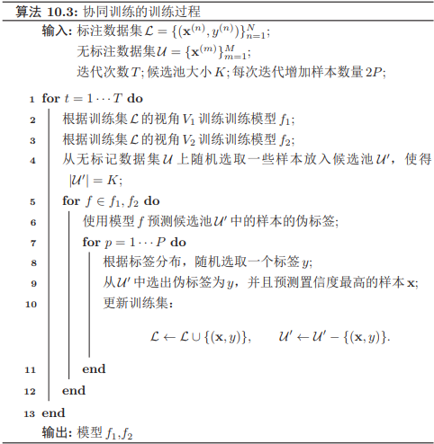
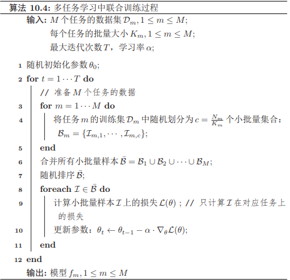

###  模型独立的学习方式

#### 自训练和协同训练

监督学习往往需要大量的标注数据，而标注数据的成本比较高，因此如何利用大量的无标注数据来提高监督学习的效果，有十分重要的意义。这种利用少量标注数据和大量无标注数据进行学习的方式称为半监督学习。

自训练是首先使用标注数据来训练一个模型，并使用这个模型来预测无标注样本的标签，把预测置信度比较高的样本及其预测的伪标签加入训练集，然后重新训练新的模型，并不断重复这个过程。

自训练的缺点是无法保证每次加入训练集的样本的伪标签是正确的。如果选择样本的伪标签是错误的，反而会损害模型的预测能力。因此，自训练最关键的步骤是如何设置挑选样本的标准。

协同训练是自训练的一种改进方法，通过两个基于不同视角的分类器来相互促进。很多数据都有相对独立的不同视角。比如互联网上的每个网页都由两种视角组成：文字内容和指向其它网页的链接。假设一个样本$\mathbf{x} = [\mathbf{x}_1, \mathbf{x}_2]$，其中$\mathbf{x}_1 $和$\mathbf{x}_2 $分别表示两种不同视角$V_1 $和$V_2 $的特征，并满足下面两个假设:条件独立性：给定样本标签$y $时，两种特征条件独立$p(\mathbf{x}_1, \mathbf{x}_2|y) = p(\mathbf{x}_1|y)p(\mathbf{x}_2|y)$；充足和冗余性：当数据充分时，每种视角的特征都可以足以单独训练出一个正确的分类器。令$y = g(\mathbf{x})$为需要学习的真实映射函数，$f_1 $和$f_2 $分别为两个视角的分类器，有

$$
\exists f_{1}, f_{2}, \quad \forall \mathbf{x} \in \mathcal{X}, \quad f_{1}\left(\mathbf{x}_{1}\right)=f_{2}\left(\mathbf{x}_{2}\right)=g(\mathbf{x})
$$
首先在训练集上根据不同视角分别训练两个模型$f_1$和$f_2$，然后用$f_1 $和$f_2 $在无标记数据集上进行预测，各选取预测置信度比较高的样本加入训练集，重新训练两个不同视角的模型，并不断重复这个过程。

#### 多任务学习

多任务学习是指同时学习多个相关任务，让这些任务在学习过程中共享知识，利用多个任务之间的相关性来改进模型在每个任务的性能和泛化能力。多任务学习可以看作是一种归纳迁移学习，即通过利用包含在相关任务中的信息作为**归纳偏置**来提高泛化能力。

多任务学习的主要挑战在于如何设计多任务之间的共享机制。目前多任务学习中常见的有共享模式。**硬共享模式**：让不同任务的神经网络模型共同使用一些共享模块一般是低层来提取一些通用特征，然后再针对每个不同的任务设置一些私有模块一般是高层来提取一些任务特定的特征。**软共享模式**：不显式地设置共享模块，但每个任务都可以从其它任务中“窃取”一些信息来提高自己的能力。窃取的方式包括直接复制使用其它任务的隐状态，或使用注意力机制来主动选取有用的信息。**层次共享模式**：一般神经网络中不同层抽取的特征类型不同。底层一般抽取一些低级的局部特征，高层抽取一些高级的抽象语义特征。因此如果多任务学习中不同任务也有级别高低之分，那么一个合理的共享模式是让低级任务在底层输出，高级任务在高层输出。**共享-私有模式**：一个更加分工明确的方式是将共享模块和任务特定私有模块的责任分开。共享模块捕捉一些跨任务的共享特征，而私有模块只捕捉和特定任务相关的特征。最终的表示由共享特征和私有特征共同构成。

假设有$M $个相关任务，第$m$个任务的训练集为$\mathcal{D}_m$，包含$N_m$ 个样本。
$$
\mathcal{D}_{m}=\left\{\left(\mathbf{x}^{(m, n)}, y^{(m, n)}\right)\right\}_{n=1}^{N_{m}}
$$
其中$\mathbf{x}^{(m,n)}$ 和$\mathbf{y}^{(m,n)}$ 表示第$m$个任务中的第$n$个样本以及它的标签。假设这$M $任务对应的模型分别为$f_m(x, θ), 1 ≤ m ≤ M$，多任务学习的联合目标函数为所有任务损失函数的线性加权。
$$
\mathcal{L}(\theta)=\sum_{m=1}^{M} \sum_{n=1}^{N_{m}} \eta_{m} \mathcal{L}_{m}\left(f_{m}\left(x^{(m, n)}, \theta\right), y^{(m, n)}\right)
$$
其中$\mathcal{L}_m(·)$为第$m$个任务的损失函数，$η_m$ 是第$m$个任务的权重，$θ $表示包含了共享模块和私有模块在内的所有参数。

多任务学习的流程可以分为两个阶段：**联合训练阶段**：每次迭代时，随机挑选一个任务，然后从这个任务中随机选择一些训练样本，计算梯度并更新参数；**单任务精调阶段**：基于多任务的学习到的参数，分别在每个单独任务进行精调。其中单任务精调阶段为可选阶段。当多个任务的差异性比较大时，在每个单任务上继续优化参数可以进一步提升模型能力。

多任务学习通常可以获得比单任务学习更好的泛化能力，主要由于以下几个原因：多任务学习在多个任务的数据集上进行训练，比单任务学习的**训练集更大**。由于多个任务之间有一定的相关性，因此多任务学习相当于是一种隐式的数据增强，可以提高模型的泛化能力。多任务学习中的共享模块需要兼顾所有任务，这在一定程度上避免了模型过拟合到单个任务的训练集，可以看作是一种**正则化**。既然一个好的表示通常需要适用于多个不同任务。它会比单任务学习可以获得一个**更好的表示**。在多任务学习中，每个任务都可以**“选择性”利用其他任务中学习到的隐藏特征**，从而提高自身的能力。

#### 迁移学习

假设一个机器学习任务T 的样本空间为$\mathcal{X} × \mathcal{Y}$，其中$\mathcal{X} $为输入空间和$\mathcal{Y} $为输出空间，其概率密度函数为$p(\mathbf{x}, y)$。一个样本空间及其分布可以称为一个领域--Domain：$\mathcal{D} = (X , Y, p(x, y))$。给定两个领域，如果它们的输入空间、输出空间或概率分布中至少一个不同，那么这两个领域就被认为是不同的。从统计学习的观点来看，一个机器学习任务$\mathcal{T} $定义为在一个领域$\mathcal{D}$ 上的条件概率$p(y|\mathbf{x})$的建模问题。

迁移学习是指两个不同领域的知识迁移过程，利用源领域--Source Domain$\mathcal{D}_S$ 中学到的知识用来帮助目标领域--Target Domain$\mathcal{D}_T$ 上的学习任务。源领域的训练样本数量一般远大于目标领域。

一般的机器学习都是指归纳学习，即希望在训练数据集上学习到使得期望风险最小的模型。而转导学习的目标是学习一种在给定测试集上错误率最小的模型， 在训练阶段可以利用测试集的信息。迁移学习根据不同的迁移方式又分为两个类型：归纳迁移学习$\text{Inductive Transfer Learning}$和推导迁移学习$\text{Transductive Transfer Learning}$。归纳迁移学习是指在源领域和任务上学习出一般的规律，然后将这个规律迁移到目标领域和任务上；而转导迁移学习是一种从样本到样本的迁移，直接利用源领域和目标领域的样本进行迁移学习。

##### 归纳迁移学习

在归纳迁移学习中，源领域和目标领域有相同的输入空间 $\mathcal{X}_S =\mathcal{X}_T$，输出空间可以相同也可以不同，源任务和目标任务一般都不相同  $\mathcal{T}_S \ne\mathcal{T}_T$，即$p_S(y|\mathbf{x}) \ne p_T (y|\mathbf{x})$。一般而言，归纳迁移学习要求源领域和目标领域是相关的，并且源领域$\mathcal{D}_S$ 有大量的训练样本，这些样本可以是有标注的样本也可以是无标注样本。**当源领域只有大量无标注数据时**，源任务可以转换为无监督学习任务，比如自编码和密度估计任务。通过这些无监督任务学习一种可迁移的表示，然后在将这种表示迁移到目标任务上。这种学习方式和自学习以及半监督学习比较类似。**当源领域有大量的标注数据时**，可以直接将源领域上训练的模型迁移到目标领域上。

归纳迁移学习一般有下面两种迁移方式：**基于特征的方式**：将预训练模型的输出或者是中间隐藏层的输出作为特征直接加入到目标任务的学习模型中。目标任务的学习模型可以是一般的浅层分类器或一个新的神经网络模型。**精调的方式**：在目标任务上复用预训练模型的部分组件，并对其参数进行精调$\text{fine-tuning}$。

假设预训练的模型是一个深层神经网络，不同层的可迁移性也不尽相同。通常来说，网络的低层学习一些通用的低层特征，中层或高层学习抽象的高级语义特征，而最后几层一般学习和特定任务相关的特征。因此，根据目标任务的自身特点以及和源任务的相关性，可以针对性地选择预训练模型的不同层来迁移到目标任务中。将预训练模型迁移目标任务上通常会比从零开始学习的方式更好，主要体现在以下三点：初始模型的性能一般比随机初始化的模型要好；训练时模型的学习速度比从零开始学习要快，收敛性更好；模型的最终性能更好，具有更好的泛化性。

##### 转导迁移学习

转导迁移学习是一种从样本到样本的迁移，直接利用源领域和目标领域的样本进行迁移学习。转导迁移学习可以看作一个种特殊的转导学习。转导迁移学习通常假设源领域有大量的标注数据，而目标领域没有或有少量标注数据，但是有大量的无标注数据。目标领域的数据在训练阶段是可见的。

转导迁移学习的一个常见子问题是领域适应--Domain Adaptation。在领域适应问题中，一般假设源领域和目标领域有相同的样本空间，但是数据分布不同$p_S(\mathbf{x}, y) \ne p_T (\mathbf{x}, y)$。

根据贝叶斯公式，$p(\mathbf{x}, y) = p(\mathbf{x}|y)p(y) = p(y|\mathbf{x})p(\mathbf{x})$，因此数据分布的不一致通常由三种情况造成:**协变量偏移**$\text{Covariate Shift}$：源领域和目标领域的输入边际分布不同$p_S(\mathbf{x}) \ne p_T (\mathbf{x})$，但后验分布相同 $p_S(y|\mathbf{x}) = p_T (y|\mathbf{x})$，即学习任务相同$\mathcal{T}_S = \mathcal{T}_T$。**概念偏移**$\text{Concept Shift}$：输入边际分布相同$p_S(\mathbf{x}) = p_T (\mathbf{x})$，但后验分布不同$p_S(y|\mathbf{x}) \ne p_T (y|\mathbf{x})$，即学习任务不同$\mathcal{T}_S \ne \mathcal{T}_T$。**先验偏移**$\text{Prior Shift}$：源领域和目标领域中的输出 $y $先验分布不同$p_S(y) \ne p_T (y)$，条件分布相同 $p_S(y|\mathbf{x}) = p_T (y|\mathbf{x})$)。在这样情况下，目标领域必须提供一定数量的标注样本。

大多数的领域适应问题主要关注于协变量偏移，这样领域适应问题在关键就在于如何学习领域无关$\text{Domain-Invariant}$的表示。假设$p_S(y|\mathbf{x}) = p_T (y|\mathbf{x})$，领域适应的目标是学习一个模型$f : \mathcal{X} → \mathcal{Y}$ 使得
$$
\begin{aligned} \mathcal{R}_{T}\left(\theta_{f}\right) &=\mathbb{E}_{(\mathbf{x}, y) \sim p_{T}(\mathbf{x}, y)}\left[\mathcal{L}\left(f\left(\mathbf{x}, \theta_{f}\right), y\right)\right] \\ &=\mathbb{E}_{(\mathbf{x}, y) \sim p_{S}(\mathbf{x}, y)} \frac{p_{T}(\mathbf{x}, y)}{p_{S}(\mathbf{x}, y)}\left[\mathcal{L}\left(f\left(\mathbf{x}, \theta_{f}\right), y\right)\right] \\ &=\mathbb{E}_{(\mathbf{x}, y) \sim p_{S}(\mathbf{x}, y)} \frac{p_{T}(\mathbf{x})}{p_{S}(\mathbf{x})}\left[\mathcal{L}\left(f\left(\mathbf{x}, \theta_{f}\right), y\right)\right] \end{aligned}
$$
如果我们可以学习一个映射函数$g : \mathcal{X} → R^d$，将$\mathbf{x}$ 映射到一个特征空间中，并在这个特征空间中使得源领域和目标领域的边际分布相同$p_S(g(\mathbf{x}, θ_g))=p_T(g(\mathbf{x}, θ_g)), ∀\mathbf{x} ∈ \mathcal{X}$，其中$θ_g$ 为映射函数的参数，那么目标函数可以近似为
$$
\begin{aligned} \mathcal{R}_{T}\left(\theta_{f}, \theta_{g}\right) &=\mathbb{E}_{(\mathbf{x}, y) \sim p_{S}(\mathbf{x}, y)}\left[\mathcal{L}\left(f\left(g\left(\mathbf{x}, \theta_{g}\right), \theta_{f}\right), y\right)\right]+\gamma d_{g}(S, T) \\ &=\mathcal{R}_{S}\left(\theta_{f}, \theta_{g}\right)+\gamma d_{g}(S, T) \end{aligned}
$$
其中$\mathcal{R}_S(θ_f , θ_g)$为源领域上的期望风险函数，$d_g(S, T)$是一个分布差异的度量函数，用来计算在映射特征空间中源领域和目标领域的样本分布的距离，$γ$ 为一个超参数用来平衡两个子目标的重要性比例。这样，学习的目标是优化参数$θ_f , θ_g$使得提取的特征是领域无关的，并且在源领域上损失最小。
$$
\begin{aligned} \mathcal{D}_{S} &=\left\{\left(\mathbf{x}_{S}^{(n)}, y_{S}^{(n)}\right)\right\}_{n=1}^{N} \sim p_{S}(\mathbf{x}, y) \\ \mathcal{D}_{T} &=\left\{\mathbf{x}_{T}^{(m)}\right\}_{m=1}^{M} \sim p_{T}(\mathbf{x}, y) \end{aligned}
$$
分别为源领域和目标领域的训练数据，我们首先用映射函数$g(x, θ_g)$ 将两个领域中训练样本的输入$\mathbf{x}$映射到特征空间，并优化参数$θ_g$ 使得映射后两个领域的输入分布差异最小。

以对抗学习为例，我们可以引入一个领域判别器$ c$ 来判断一个样本是来自于哪个领域。如果领域判别器$ c$无法判断一个映射特征的领域信息，就可以认为这个特征是一种领域无关的表示。对于训练集中的每一个样本$\mathbf{x}$，我们都赋予$z ∈ \{1, 0\}$表示它是来自于源领域还是目标领域，领域判别器$c(h, θ_c)$根据其映射特征$h = g(x, θ_g)$来预测它自于源领域的概率$p(z = 1|x)$。因此，领域判别器的损失函数
$$
\mathcal{L}_{c}\left(\theta_{g}, \theta_{c}\right)=\frac{1}{N} \sum_{n=1}^{N} \log c\left(\mathbf{h}_{S}^{(n)}, \theta_{c}\right)+\frac{1}{M} \sum_{m=1}^{M} \log \left(1-c\left(\mathbf{h}_{D}^{(m)}, \theta_{c}\right)\right)
$$
其中$\mathbf{h}_{S}^{(n)}=g\left(\mathbf{x}_{S}^{(n)}, \theta_{g}\right), \mathbf{h}_{D}^{(m)}=g\left(\mathbf{x}_{D}^{(m)}, \theta_{g}\right)$g) 分别为样本$x^{(n)}_S$ 和$x^{(m)}_D$ 的特征。

这样，领域迁移的目标函数可以分解为两个对抗的目标。一方面，要学习参数$θ_c$ 使得领域判别器$c(h, θ_c)$尽可能区分出一个表示$h = g(x, θ_g)$是来自于哪个领域；另一方面，要学习参数$θ_g$ 使得提取的表示$\mathbf{h}$无法被领域判别器$c(h, θ_c)$预测出来，并同时学习参数$θ_g$ 使得模型$f(h, θ_f )$在源领域的损失最小。
$$
\begin{array}{ll}{\min _{\theta_{c}}} & {\mathcal{L}_{c}\left(\theta_{g}, \theta_{c}\right)} \\ {\min _{\theta_{f}, \theta_{g}}} & {\sum_{n=1}^{N} \mathcal{L}\left(f\left(g\left(\mathbf{x}_{S}^{(n)}, \theta_{g}\right), \theta_{f}\right), y_{S}^{(n)}\right)-\gamma \mathcal{L}_{c}\left(\theta_{g}, \theta_{c}\right)}\end{array}
$$

#### 终生学习

终生学习或持续学习，是指像人类一样具有持续不断的学习能力，根据历史任务中学到的经验来帮助学习不断出现的新任务，并且这些经验和知识是持续累积的，不会因为新的任务而忘记旧的知识。在终生学习中，假设一个终生学习算法已经在历史任务$\mathcal{T}_{1}, \mathcal{T}_{2}, \cdots, \tau_{m}$上学习到一个模型，当出现一个新任务$\mathcal{T}_{m+1}$时，这个算法可以根据过去在$m$个任务上学习的知识来帮助第$m + 1$个任务，同时累积所有的$m + 1$个任务上的知识。

灾难性遗忘，即按照一定顺序学习多个任务时，在学习新任务的同时不忘记先前学会的历史任务。比如在神经网络模型中，一些参数对任务$\mathcal{T}_A$ 非常重要，如果在学任务$\mathcal{T}_B$ 时被改变了，就可能给任务$\mathcal{T}_A$ 造成不好的影响。

#### 元学习

即使面对一个新的任务，人们往往也可以很快找到其学习方式。这种可以动态调整学习方式的能力，称为元学习。元学习的目的是从已有任务中学习一种学习方法或元知识，可以加速新任务的学习。从这个角度来说，元学习十分类似于归纳迁移学习，但元学习更侧重从多种不同甚至是不相关的任务中归纳出一种学习方法。

###### 基于优化器的元学习

目前神经网络的学习方法主要是定义一个目标损失函数$\mathcal{L}(θ)$，并通过梯度下降算法来最小化$\mathcal{L}(θ)$，
$$
\theta_{t} \leftarrow \theta_{t-1}-\alpha \nabla \mathcal{L}\left(\theta_{t-1}\right)
$$
其中$θ_t $为第$t$步时的模型参数，$\nabla \mathcal{L}\left(\theta_{t-1}\right)$为梯度，$α $为学习率。根据没有免费午餐定理，没有一种通用的优化算法在所有任务上都有效。因此在不同的任务上，我们需要选择不同的学习率以及不同的优化方法。对于一个新的任务，我们往往通过经验或超参搜索来选择一个合适的设置。不同的优化算法的区别在于更新参数的规则不同，因此一种很自然的元学习就是自动学习一种更新参数的规则，即通过另一个神经网络来建模梯度下降的过程。

我们用函数$g_t(·)$来预测第$t$步时参数更新的差值$\Delta \theta_{t}=\theta_{t}-\theta_{t-1}$。函数$g_t(·)$称为优化器，输入是当前时刻的梯度值，输出是参数的更新差值$∆θ_t$。这样第$t$步的更新规则可以写为
$$
\theta_{t+1}=\theta_{t}+g_{t}\left(\nabla \mathcal{L}\left(\theta_{t}\right), \phi\right)
$$
学习优化器$g_t(·)$的过程可以看做是一种元学习过程，其目标是找到一个适用于多个不同任务的优化器。在标准梯度下降中，每步迭代的目标是使得$\mathcal{L}(θ)$下降。而在优化器的元学习中，我们希望在每步迭代的目标是$\mathcal{L}(θ)$最小，具体的目标函数为
$$
\begin{aligned} \mathcal{L}(\phi) &=\mathbb{E}_{f}\left[\sum_{t=1}^{T} w_{t} \mathcal{L}\left(\theta_{t}\right)\right] \\ \theta_{t} &=\theta_{t-1}+\mathbf{g}_{t} \\\left[\mathbf{g}_{t} ; \mathbf{h}_{t}\right] &=\mathbf{L} \mathbf{S} \mathbf{T} \mathbf{M}\left(\nabla \mathcal{L}\left(\theta_{t-1}\right), \mathbf{h}_{t-1}, \phi\right) \end{aligned}
$$

###### 模型无关的元学习

模型无关的元学习是一个简单的模型无关、任务无关的元学习算法。假设所有的任务都来自于一个任务空间，其分布为$p(\mathcal{T} )$，我们可以在这个任务空间的所有任务上学习一种通用的表示，这种表示可以经过梯度下降方法在一个特定的单任务上进行精调。假设一个模型为$f(θ)$，如果我们让这个模型适应到一个新任务$\mathcal{T}_m $上，通过一步或多步的梯度下降更新，学习到的任务适配参数为
$$
\theta_{m}^{\prime}=\theta-\alpha \nabla_{\theta} \mathcal{L}_{m}\left(f_{\theta}\right)
$$
$MAML$的目标是学习一个参数θ 使得其经过一个梯度迭代就可以在新任务上达到最好的性能。
$$
\min _{\theta} \sum_{\mathcal{T}_{m} \sim p(\mathcal{T})} \mathcal{L}_{\mathcal{T}_{m}}\left(f\left(\theta_{m}^{\prime}\right)\right)=\sum_{\mathcal{T}_{m} \sim p(\mathcal{T})} \mathcal{L}_{\mathcal{T}_{m}}\left(f\left(\theta-\alpha \nabla_{\theta} \mathcal{L}_{\mathcal{T}_{m}}\left(f_{\theta}\right)\right)\right)
$$
在所有任务上的元优化--Meta-Optimization也采用梯度下降来进行优化，
$$
\theta \leftarrow \theta-\beta \nabla_{\theta} \sum_{m=1}^{M} \mathcal{L}_{\mathcal{T}_{m}}\left(f_{\theta_{m}^{\prime}}\right)
$$

$$
\begin{aligned} \log p(\mathbf{x} | \theta) &=\log \sum_{\mathbf{z}} q(\mathbf{z}) \frac{p(\mathbf{x}, \mathbf{z} | \theta)}{q(\mathbf{z})} \\ & \geq \sum_{\mathbf{z}} q(\mathbf{z}) \log \frac{p(\mathbf{x}, \mathbf{z} | \theta)}{q(\mathbf{z})} \\ & \triangleq E L B O(q, \mathbf{x} | \theta) \end{aligned}
$$