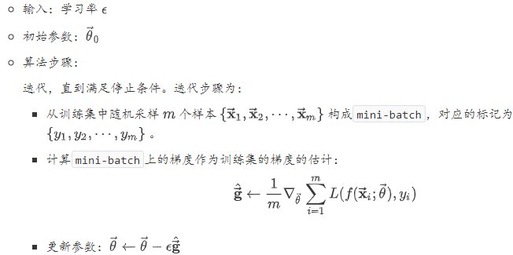
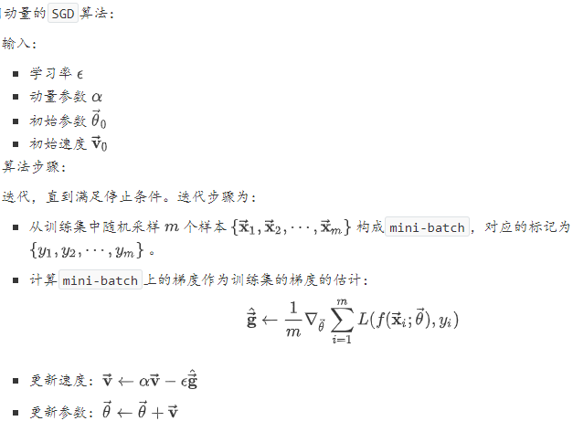
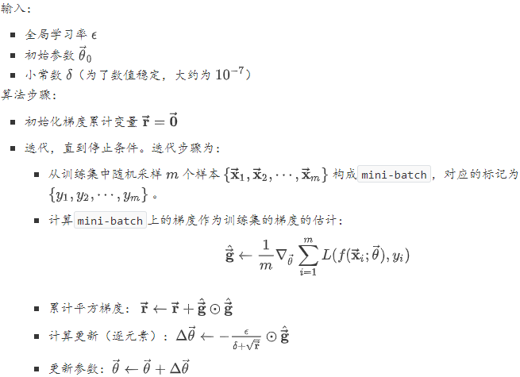
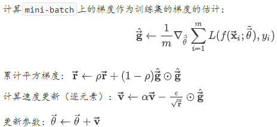
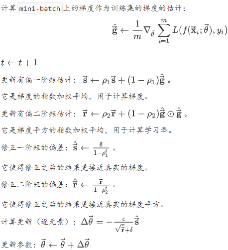
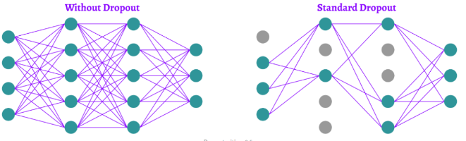
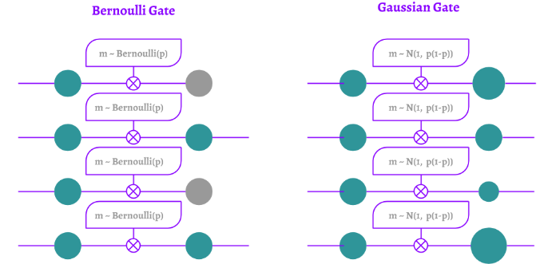
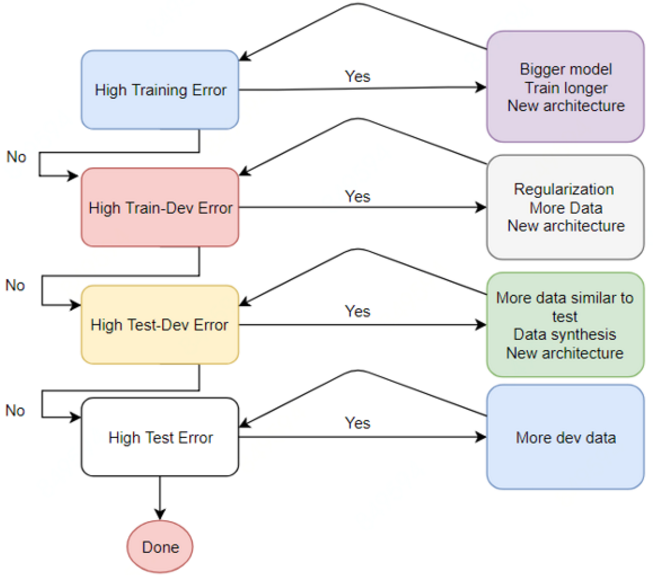

### 网络优化和正则化

#### 网络优化

网络优化的难点：网络结构多样性、高维变量的非凸优化。

低维空间的非凸优化问题主要是存在一些局部最优点。基于梯度下降的优化方法会陷入局部最优点，因此低维空间非凸优化的主要难点是如何选择初始化参数和逃离局部最优点。深层神经网络的参数非常多，其参数学习是在非常
高维空间中的非凸优化问题，其挑战和在低维空间的非凸优化问题有所不同。鞍点 在高维空间中，非凸优化的难点并不在于如何逃离局部最优点，而是如何逃离鞍点。鞍点的梯度是0，但是在一些维度上是最高点，在另一些维度上是最低点。平坦底部 深层神经网络的参数非常多，并且有一定的冗余性，这导致每单个参数对最终损失的影响都比较小，这导致了损失函数在局部最优点附近是一个平坦的区域，称为平坦最小值。并且在非常大的神经网络中，大部分的局部最小值是相等的。虽然神经网络有一定概率收敛于比较差的局部最小值，但随着网络规模增加，网络陷入局部最小值的概率大大降低。

有时候真正的代价函数无法有效优化，此时可以考虑使用`替代损失函数` 来代替真实的损失函数。一般的优化和机器学习优化的一个重要不同：机器学习算法通常并不收敛于代价函数的局部极小值。因为：机器学习算法通常使用替代损失函数。算法终止时，可能出现：采用 `替代损失函数`的代价函数的导数较小，而采用真实损失函数的代价函数的导数仍然较大相比较于0值。机器学习算法可能会基于早停策略而提前终止。

##### 神经网络最优化挑战

###### 病态黑塞矩阵

病态的黑塞矩阵$\mathbf{H}$是凸优化或者其他形式优化中普遍存在的问题。在神经网络训练过程中，如果$\mathbf{H}$是病态的，则随机梯度下降会“卡”在某些地方：此时即使很小的更新步长也会增加代价函数。当黑塞矩阵是病态时，牛顿法是一个很好的解决方案。但是牛顿法并不适用于神经网络，需要对它进行较大改动才能用于神经网络。将$f(\vec{\mathbf{x}})$在$\vec{\mathbf{x}}$处泰勒展开：$f(\overrightarrow{\mathbf{x}}) \approx f\left(\overrightarrow{\mathbf{x}}_{0}\right)+\left(\overrightarrow{\mathbf{x}}-\overrightarrow{\mathbf{x}}_{0}\right)^{T} \overrightarrow{\mathbf{g}}+\frac{1}{2}\left(\overrightarrow{\mathbf{x}}-\overrightarrow{\mathbf{x}}_{0}\right)^{T} \mathbf{H}\left(\overrightarrow{\mathbf{x}}-\overrightarrow{\mathbf{x}}_{0}\right)$。根据梯度下降法：$\overrightarrow{\mathbf{x}}^{\prime}=\overrightarrow{\mathbf{x}}-\epsilon \nabla_{\overrightarrow{\mathbf{x}}} f(\overrightarrow{\mathbf{x}})$。应用在点$\vec{\mathbf{x}}_0$，有：$f\left(\overrightarrow{\mathbf{x}}_{0}-\epsilon \overrightarrow{\mathbf{g}}\right) \approx f\left(\overrightarrow{\mathbf{x}}_{0}\right)-\epsilon \overrightarrow{\mathbf{g}}^{T} \overrightarrow{\mathbf{g}}+\frac{1}{2} \epsilon^{2} \overrightarrow{\mathbf{g}}^{T} \mathbf{H} \overrightarrow{\mathbf{g}}$。因此沿着负梯度的方向，步长$-\epsilon \overrightarrow{\mathrm{g}}$将导致代价函数$f$增加：$-\epsilon \overrightarrow{\mathrm{g}}^{T} \overrightarrow{\mathrm{g}}+\frac{1}{2} \epsilon^{2} \overrightarrow{\mathrm{g}}^{T} \mathbf{H} \overrightarrow{\mathrm{g}}$。当$\frac{\epsilon}{2} \vec{g}^{T} \mathbf{H} \vec{g}>\vec{g}^{T} \overrightarrow{\mathbf{g}}$时，黑塞矩阵的病态会成为问题。此时沿着负梯度的方向，代价函数值反而在增长。

###### 局部极小值

如果局部极小解和全局极小解相差很大时，此时多个局部极小解会带来很大隐患。它将给基于梯度的优化算法带来很大的问题。有一种方案是排除局部极小值导致的困难：绘制梯度范数随着时间的变化：如果梯度范数没有缩小到一个很小的值，则问题的原因既不是局部极小值引起的，也不是其他形式的临界点引起的。如果梯度范数缩小到一个很小的值，则问题的原因可能是局部极小值引起的，也可能是其他原因引起的。神经网络训练中，通常不关注代价函数的精确全局极小值，而是关心将代价函数值下降到足够小，从而获得一个很好的泛化误差。

###### 鞍点

鞍点是另一类梯度为零的点。鞍点附近的某些点的函数值比鞍点处的值更大，鞍点附近的另一些点的函数值比鞍点处的值更小。鞍点对于训练算法的影响：对于只使用了梯度的一阶优化算法而言：情况不明。理论上，鞍点附近的梯度通常会非常小，这导致梯度下降算法沿着梯度方向的步长非常小。实际上，梯度下降算法似乎在很多情况下都能够逃离鞍点。对于牛顿法而言，鞍点是个大问题。因为梯度下降的原则是：朝着下坡路的方向移动。而牛顿法的原则是：明确寻找梯度为零的点。如果不做任何修改，则牛顿法会主动跳入一个鞍点。也可能出现一个恒值的、平坦的宽区域：在这个区域中，梯度和黑塞矩阵都为零

###### 悬崖

多层神经网络通常有像悬崖一样的区域，悬崖是指代价函数斜率较大的区域。产生悬崖的原因：由于几个较大的权重相乘，导致求导的时候，其梯度异常巨大。在`RNN`网络的代价函数中悬崖结构很常见，因为`RNN` 这一类模型会涉及到多个时间步长中的因子的相乘，导致产生了大量的权重相乘。悬崖的影响：在梯度更新时，如果遇到悬崖，则会导致参数更新的步长非常大，从而跨了非常大的一步，使得参数弹射的非常远。这样可能会使得已经完成的大量优化工作无效。因为当弹射非常远时，可能横跨了参数空间的很多个区域而进入到另一个区域。这样已经探索的参数区域就被放弃了。

解决悬崖问题的方案：使用梯度截断策略。梯度下降法只是指明了参数更新的方向，但是未指明最佳步长。当常规的梯度下降算法建议更新一大步时，梯度截断会干涉并缩减步长，从而使其基本上贴着悬崖来更新。

###### 长期依赖、

当计算图非常深时，容易产生另一种优化困难：长期依赖。假设计算图中包含一条重复地、与矩阵$\mathbf{W}$相乘的路径。经过$t$步，则相当于与$\mathbf{W}^t$相乘。在第$i$步有：$\overrightarrow{\mathbf{h}}_{t}=\mathbf{W}^{t-i} \overrightarrow{\mathbf{h}}_{i}$。根据反向传播原理，有： $\nabla_{\overrightarrow{\mathrm{h}}_{\mathrm{i}}} J=\left(\frac{\partial \overrightarrow{\mathrm{h}}_{t}}{\partial \overrightarrow{\mathrm{h}}_{\mathrm{i}}}\right)^{T} \nabla_{\overrightarrow{\mathrm{h}}_{t}} J=\left(\mathbf{W}^{t-i}\right)^{T}\nabla_{\overrightarrow{\mathrm{h}}_{\mathrm{t}}} J$。考虑到权重$\mathbf{W}$参与到每个时间步的计算，因此有：$\nabla_{\mathbf{W}}=\sum_{i=1}^{t} \frac{\partial J}{\partial \overrightarrow{\mathbf{h}}_{i}} \overrightarrow{\mathbf{h}}_{i-1}^{T}=\sum_{i=1}^{t}\left(\mathbf{W}^{t-i}\right)^{T}\left(\nabla_{\overrightarrow{\mathbf{h}}_{i}} J\right) \overrightarrow{\mathbf{h}}_{i-1}^{T}$。其中记$\overrightarrow{\mathbf{x}}=\overrightarrow{\mathbf{h}}_{0}$。假设矩阵$\left(\nabla_{\overrightarrow{\mathbf{h}}_{\mathrm{t}}} J\right) \overrightarrow{\mathbf{x}}^{T}=c \mathbf{I}$，则有：
$$
\nabla_{\mathbf{W}}=\sum_{i=1}^{t}\left(\mathbf{W}^{t-i}\right)^{T}\left(\nabla_{\overrightarrow{\mathbf{h}}_{t}} J\right)\left(\mathbf{W}^{i-1} \overrightarrow{\mathbf{x}}\right)^{T}=\sum_{i=1}^{t} c\left(\mathbf{W}^{t-1}\right)^{T}=c \times t \times\left(\mathbf{W}^{t-1}\right)^{T}
$$
假设$\mathbf{W}$有特征值分解$\mathbf{W}=\mathbf{V} \Lambda \mathbf{V}^{-1}$，则：$\mathbf{W}^{t-1}=\mathbf{V} \Lambda^{t-1} \mathbf{V}^{-1}$。考虑特征值$\lambda_i$，当它不在 1 附近时：如果量级大于 1，$lambda_i^t$非常大，这称作梯度爆炸问题。如果量级小于 1， $\lambda_i^t$非常小，这称作梯度消失问题。梯度消失使得学习难以进行，此时学习的推进会非常缓慢。循环网络在每个时间步上使用相同的矩阵 ，因此非常容易产生梯度爆炸和梯度消失问题。前馈神经网络并没有在每一层使用相同的矩阵 ，因此即使是非常深层的前馈神经网络也能很大程度上避免梯度爆炸和梯度消失问题。对于梯度爆炸，可以通过梯度裁剪来缓解：限定梯度的范数的上限。对于梯度消失，不能够简单的通过放大来解决。因为有两个问题：当梯度很小的时候，无法分辨它是梯度消失问题，还是因为抵达了极小值点。当梯度很小的时候，噪音对梯度的影响太大。获得的梯度很可能由于噪音的影响，导致它的方向是随机的。此时如果放大梯度，则无法确保此时的方向就是代价函数下降的方向。而对于梯度爆炸，如果缩小梯度，仍然可以保证此时的方向就是代价函数下降的方向。

###### 非精确梯度

大多数优化算法都假设知道精确的梯度或者`Hessian`矩阵，实际中这些量都有躁扰，甚至是有偏的估计。如：`mini-batch`随机梯度下降中，用一个`batch` 的梯度来估计整体的梯度。各种神经网络优化算法的设计都考虑到了梯度估计的不精确。另外，实际情况中的目标函数是比较棘手的，甚至难以用简洁的数学解析形式给出。此时可以选择`替代损失函数`来避免这个问题。

###### 局部和全局结构的弱对应

对于最优化问题，即使克服了以上的所有困难，但是并没有到达代价函数低得多的区域，则表现仍然不佳。这就是局部优秀，全局不良。局部优秀：跨过了鞍点、爬过了悬崖、克服了梯度消失，最终到达局部极小值点。全局不良：并未到达目标函数全局比较小的值所在的区域。在局部结构中执行梯度下降的问题：局部梯度下降或许能找出一条解路径，但是该路径可能包含了很多次梯度更新，遵循该路径会带来很高的计算代价。如果目标函数没有任何鞍点、极值点，而是具有一个宽而平坦的区域。此时，若要寻求一个精确的临界点，则局部梯度下降无法给出解路径。这意味着算法难以收敛。局部梯度下降可能太过贪心，使得训练虽然朝着梯度下降的方向移动，但是远离了真正的解。如果存在某个参数区域，当遵循局部梯度下降就能够合理地直接到达最优解，且参数初始化点就位于该区域，则局部梯度下降的问题就得到解决。

##### 优化算法

深层神经网络的参数学习主要是通过梯度下降方法来寻找一组可以最小化结构风险的参数。梯度下降法可以分为：批量梯度下降、随机梯度下降以及小批量梯度下降三种形式。除了在收敛效果和效率上的差异，这三种方法都存在一些共同的问题，如：如何初始化参数；预处理数据；如何选择合适的学习率，避免陷入局部最优等。

###### 学习率衰减

逆时衰减： $\alpha_{t}=\alpha_{0} \frac{1}{1+\beta \times t}$

指数衰减：$\alpha_{t}=\alpha_{0} \beta^{t}$

自然指数衰减：$\alpha_{t}=\alpha_{0} \exp (-\beta \times t)$

除了这些固定衰减率的调整学习率方法外，还有些自适应地调整学习率的方法。

使用梯度下降来更新参数$\theta_{t} \leftarrow \theta_{t-1}-\alpha \mathbf{g}_{t}$每次迭代时参数更新的差值$∆θ_t $定义为$\Delta \theta_{t} \triangleq \theta_{t}-\theta_{t-1}$

##### $

使用小批量样本来估计梯度的原因：使用更多样本来估计梯度的方法的收益是低于线性的。如果能够快速计算出梯度的估计值，则大多数优化算法会更快收敛。大多数优化算法基于梯度下降，如果每一步中计算梯度的时间大大缩短，则它们会更快收敛。训练集存在冗余。

##### 基本梯度下降算法

###### 随机梯度下降

`SGD`中一个关键参数是学习率。前面介绍的`SGD`算法步骤使用固定的学习率 ，实践中有必要随着时间的推移而降低学习率。使用标准的梯度下降到达极小点时，整个代价函数的真实梯度非常小，甚至为零。由于`SGD` 使用`mini-batch`的梯度作为整体梯度的估计，因此引入了噪源。该噪源并不会在极小值处消失，使得在极小点时，梯度的估计可能会比较大。因此：标准的梯度下降可以使用固定的学习率，而`SGD`必须使用逐渐降低的学习率。

##### 动量方法

###### $\text{Nesterov}$动量

`Nesterov`动量是动量方法的变种。区别在于：计算`mini-batch`的梯度时，采用更新后的参数$\vec{\theta}+\alpha \overrightarrow{\mathbf{v}}$。它可以视作向标准动量方法中添加了一个校正因子：
$$
\begin{aligned} \overrightarrow{\mathbf{v}} \leftarrow \alpha \overrightarrow{\mathbf{v}} &-\epsilon \nabla_{\vec{\theta}} J(\vec{\theta}+\alpha \overrightarrow{\mathbf{v}}) \\ \vec{\theta} & \leftarrow \vec{\theta}+\overrightarrow{\mathbf{v}} \end{aligned}
$$

##### 自适应学习率算法

###### $\text{AdaGrad}$

`AdaGrad`算法的思想是：参数空间每个方向的学习率反比于某个值的平方根。这个值就是该方向上梯度分量的所有历史平方值之和。
$$
\begin{array}{c}{\overrightarrow{\mathbf{r}} \leftarrow \overrightarrow{\mathbf{r}}+\hat{\mathbf{g}} \odot \hat{\mathbf{g}}} \\ {\vec{\theta} \leftarrow \vec{\theta}-\frac{\epsilon}{\sqrt{\mathbf{r}}} \odot \hat{\overrightarrow{\mathbf{g}}}}\end{array}
$$
其中$\odot$表示两个向量的逐元素的相乘。

`AdaDelta` 将梯度平方和的累计策略修改为：只考虑过去窗口$window$内的梯度。

###### $\text{RMSProp}$

`RMSProp`是`AdaGrad`的一个修改：将梯度累计策略修改为指数加权的移动平均。
$$
\begin{aligned} \overrightarrow{\mathbf{r}} & \leftarrow \rho \overrightarrow{\mathbf{r}}+(1-\rho) \hat{\vec{g}} \odot \hat{\mathbf{g}} \\ \vec{\theta} & \leftarrow \vec{\theta}-\frac{\epsilon}{\sqrt{\overrightarrow{\mathbf{r}}}} \odot \hat{\overrightarrow{\mathbf{g}}} \end{aligned}
$$
其中$\rho$为衰减速率，它决定了指数加权移动平均的有效长度。

###### $\text{RMSProp}$动量算法

###### $\text{Adam}$

初始化一阶和二阶矩变量$\overrightarrow{\mathrm{s}}=\overrightarrow{\mathbf{0}}, \overrightarrow{\mathrm{r}}=\overrightarrow{0}$

$AdaGrad$ 算法
$$
G_{t}=\sum_{\tau=1}^{t} \mathbf{g}_{\tau} \odot \mathbf{g}_{\tau}\\
\Delta \theta_{t}=-\frac{\alpha}{\sqrt{G_{t}+\epsilon}} \odot \mathbf{g}_{t}
$$
其中$⊙$为按元素乘积，$g_τ ∈ R^{|θ|}$ 是第$τ$ 次迭代时的梯度。其中$α$是初始的学习率，$ϵ$是为了保持数值稳定性而设置的非常小的常数，这里的开平方、除、加运算都是按元素进行的操作。

$RMSprop$ 算法
$$
\begin{aligned} G_{t} &=\beta G_{t-1}+(1-\beta) \mathbf{g}_{t} \odot \mathbf{g}_{t} \\ &=(1-\beta) \sum_{\tau=1}^{t} \beta^{t-\tau} \mathbf{g}_{\tau} \odot \mathbf{g}_{\tau}\\
&\Delta \theta_{t}=-\frac{\alpha}{\sqrt{G_{t}+\epsilon}} \odot \mathrm{g}_{t}
\\\end{aligned}
$$
$AdaDelta$ 算法
$$
\Delta X_{t-1}^{2}=\beta_{1} \Delta X_{t-2}^{2}+\left(1-\beta_{1}\right) \Delta \theta_{t-1} \odot \Delta \theta_{t-1}\\
\Delta \theta_{t}=-\frac{\sqrt{\Delta X_{t-1}^{2}+\epsilon}}{\sqrt{G_{t}+\epsilon}} \mathbf{g}_{t}
$$

其中$G_t $的计算方式和$RMSprop$算法一样。

###### 梯度方向优化

动量法
$$
\Delta \theta_{t}=\rho \Delta \theta_{t-1}-\alpha \mathbf{g}_{t}
$$
其中$ρ$为动量因子，通常设为$0.9$，$α$为学习率。

$Nesterov$ 加速梯度
$$
\Delta \theta_{t}=\rho \Delta \theta_{t-1}-\alpha \mathfrak{g}_{t}\left(\theta_{t-1}+\rho \Delta \theta_{t-1}\right)
$$
其中$\mathfrak{g}_{t}\left(\theta_{t-1}+\rho \Delta \theta_{t-1}\right)$表示损失函数在点$\hat{\theta}=\theta_{t-1}+\rho \Delta \theta_{t-1}$的偏导数。

$Adam$算法
$$
\begin{array}{c}{M_{t}=\beta_{1} M_{t-1}+\left(1-\beta_{1}\right) \mathbf{g}_{t}} \\ {G_{t}=\beta_{2} G_{t-1}+\left(1-\beta_{2}\right) \mathbf{g}_{t} \odot \mathbf{g}_{t}}\\
\hat{M}_{t} =\frac{M_{t}}{1-\beta_{1}^{t}} \\ \hat{G}_{t} =\frac{G_{t}}{1-\beta_{2}^{t}}\\
\Delta \theta_{t}=-\frac{\alpha}{\sqrt{\hat{G}_{t}+\epsilon}} \hat{M}_{t}\end{array}
$$
其中$β_1$ 和$β_2$ 分别为两个移动平均的衰减率，通常取值为$β_1 = 0.9$, $β_2 = 0.99$，学习率$α$通常设为$0.001$。

###### 梯度截断

在基于梯度下降的优化过程中，如果梯度突然增大，用大的梯度进行更新参数，反而会导致其远离最优点。为了避免这种情况，当梯度的模大于一定阈值时，就对梯度进行截断，称为梯度截断。

按值截断 在第$t$次迭代时，梯度为$g_t$，给定一个区间$[a, b]$，如果一个参数的梯度小于$a$时，就将其设为$a$；如果大于$b$时，就将其设为$b$。
$$
\mathbf{g}_{t}=\max \left(\min \left(\mathbf{g}_{t}, b\right), a\right)
$$
按模截断按模截断是将梯度的模截断到一个给定的截断阈值b。

如果$∥g_t∥_2 ≤ b$，保持$g_t$ 不变。如果$∥g_t∥_2 > b$，令
$$
\mathbf{g}_{t}=\frac{b}{\left\|\mathbf{g}_{t}\right\|} \mathbf{g}_{t}
$$

##### 参数初始化

$\text{Gaussian}$分布初始化：$\mathcal{N}\left(0, \sqrt{\frac{2}{n_{i n}+n_{o u t}}}\right).$

均匀分布初始化：均匀分布初始化是在一个给定的区间$[−r, r] $内采用均匀分布来初始化参数。超参数$r$的设置也可以按神经元的连接数量进行自适应的调整。$r=\sqrt{\frac{6}{n^{l-1}+n^{l}}}$

##### 数据预处理

除了参数初始化之外，不同特征取值范围差异比较大时还会梯度下降法的搜索效率。取值范围不同会造成在大多数位置上的梯度方向并不是最优的搜索方向。当使用梯度下降法寻求最优解时，会导致需要很多次迭代才能收敛。如果我们把数据归一化为取值范围相同，大部分位置的梯度方向近似于最优搜索方向。这样，在梯度下降求解时，每一步梯度的方向都基本指向最小值，训练效率会大大提高。

###### 归一化

缩放归一化、标准归一化 、白化。白化是一种重要的预处理方法，用来降低输入数据特征之间的冗余性。输入数据经过白化处理后，特征之间相关性较低，并且所有特征具有相同的方差。($PCA$)

##### 逐层归一化

在深层神经网络中，中间某一层的输入是其之前的神经层的输出。因此，其之前的神经层的参数变化会导致其输入的分布发生较大的差异。在使用随机梯度下降来训练网络时，每次参数更新都会导致网络中间每一层的输入的分布发生改变。越深的层，其输入的分布会改变得越明显。如果某个神经层的输入分布发生了改变，那么其参数需要重新学习，这种现象叫做内部协变量偏移--Internal Covariate Shift.          协变量是一个统计学概念，是可能影响预测结果的统计变量。

###### 批量归一化

对于一个深层神经网络，令第$l$层的净输入为$\mathbf{z}^{(l)}$，神经元的输出为$\mathbf{a}^{(l)}$，即
$$
\mathbf{a}^{(l)}=f\left(\mathbf{z}^{(l)}\right)=f\left(W \mathbf{a}^{(l-1)}+\mathbf{b}\right)
$$
给定一个包含$ K $个样本的小批量样本集合，第 $l $层神经元的净输入$\mathbf{z}^{(1, l)},\cdots,\mathbf{z}^{K,l}$的均值和方差为
$$
\begin{aligned} \mu_{\mathcal{B}} &=\frac{1}{K} \sum_{k=1}^{K} \mathbf{z}^{(k, l)} \\ \sigma_{\mathcal{B}}^{2} &=\frac{1}{K} \sum_{k=1}^{K}\left(\mathbf{z}^{(k, l)}-\mu_{\mathcal{B}}\right) \odot\left(\mathbf{z}^{(k, l)}-\mu_{\mathcal{B}}\right) \\
\hat{\mathbf{z}}^{(l)} &=\frac{\mathbf{z}^{(l)}-\mu_{\mathcal{B}}}{\sqrt{\sigma_{\mathcal{B}}^{2}+\epsilon}} \odot \gamma+\beta \\ & \triangleq \mathrm{B} \mathrm{N}_{\gamma, \beta}\left(\mathbf{z}^{(l)}\right)
\end{aligned}
$$
批量归一化操作可以看作是一个特殊的神经层，加在每一层非线性激活函数之前，即
$$
\mathbf{a}^{(l)}=f\left(\mathrm{BN}_{\gamma, \beta}\left(\mathbf{z}^{(l)}\right)\right)=f\left(\mathrm{BN}_{\gamma, \beta}\left(W \mathbf{a}^{(l-1)}\right)\right)
$$

###### 层归一化

对于一个深层神经网络中，令第$l $层神经的净输入为$\mathbf{z}^{(l)}$，其均值和方差为
$$
\begin{aligned} \mu^{(l)} &=\frac{1}{n^{l}} \sum_{i=1}^{n^{l}} z_{i}^{(l)} \\ \sigma^{(l)^{2}} &=\frac{1}{n^{l}} \sum_{k=1}^{n^{l}}\left(z_{i}^{(l)}-\mu^{(l)}\right)^{2} \end{aligned}
$$
其中$n^l$ 为第$l$ 层神经元的数量。

层归一化定义为
$$
\begin{aligned} \hat{\mathbf{z}}^{(l)} &=\frac{\mathbf{z}^{(l)}-\mu^{(l)}}{\sqrt{\sigma^{(l)^{2}}+\epsilon}} \odot \gamma+\beta \\ & \triangleq \operatorname{LN}_{\gamma, \beta}\left(\mathbf{z}^{(l)}\right) \end{aligned}
$$

层归一化和批量归一化整体上是十分类似的，差别在于归一化的方法不同。对于$K $个样本的一个小批量集合$Z^{(l)} = [\mathbf{z}^{(1,l)}; · · · ;\mathbf{z}^{(K,l)}]$，层归一化是对矩阵$Z^{(l) }$对每一列进行归一化，而批量归一化是对每一行进行归一化。

###### 局部响应归一化

假设一个卷积层的输出特征映射$ Y ∈ R^{M′×N′×P}$ 为三维张量，其中每个切片矩阵$Y^p ∈ R^{M′×N′}$ 为一个输出特征映射，$1 ≤ p ≤ P$。
$$
\begin{aligned} \hat{Y}^{p} &=Y^{p} /\left(k+\alpha \sum_{j=\max \left(1, p-\frac{n}{2}\right)}^{\min \left(P, p+\frac{n}{2}\right)}\left(Y^{j}\right)^{2}\right)^{\beta} \\ & \triangleq \operatorname{LRN}_{n, k, \alpha, \beta}\left(Y^{p}\right) \end{aligned}
$$
其中除和幂运算都是按元素运算，$n, k, α, β $为超参，$n$为局部归一化的特征窗口大小。

##### $\text{mini-batch}$$\text{Normalization}$

###### $\text{batch normlization}$

在机器学习中，如果数据是独立同分布的，则可以简化模型的训练，提升模型的预测能力。所以通常需要对输入数据进行白化`whitening`。 白化主要实现两个目的：去除特征之间的相关性。即：特征之间尽可能的独立。使得所有特征都具有相同的均值和方差。即：特征之间尽可能的同分布。白化操作：首先将输入执行 `PCA` 降维，这称作`PCA` 处理。然后在新的空间中，对输入数据的每一维进行标准差归一化处理。

###### 深层网络的参数更新

对于一个深层的神经网络，如果同时更新所有层的参数，则可能会发生一些意想不到的后果。假设有一个深层神经网络，一共有$l$层，每层只有一个单元，且每个隐层不使用激励函数。则输出为：$\hat{y}=x w_{1} w_{2} \cdots w_{l}$。其中$w_i$为第$i$层的权重。第$i$层的输出为：$h^{<i>}=h^{<i-1>} w_{i}$。令$\overrightarrow{\mathbf{g}}=\left(g_{1}, g_{2}, \cdots, g_{l}\right)^{T}=\nabla_{\overrightarrow{\mathbf{w}}} \hat{y}$，其中：$g_{i}=\frac{\partial \hat{y}}{w_{i}}=x \prod_{j=1, j \neq i}^{l} w_{j}$。利用梯度下降法更新参数，则有：$\overrightarrow{\mathbf{w}} \leftarrow \overrightarrow{\mathbf{w}}-\epsilon \overrightarrow{\mathbf{g}}$。如果使用$\hat{y}$的一阶泰勒近似，则有：$f(\overrightarrow{\mathbf{w}}-\epsilon \overrightarrow{\mathbf{g}})-f(\overrightarrow{\mathbf{w}}) \approx-\epsilon \overrightarrow{\mathbf{g}}^{T} \overrightarrow{\mathbf{g}}$。即：$\hat{y}$的值下降了$\epsilon \overrightarrow{\mathrm{g}}^{T} \overrightarrow{\mathrm{g}}$。因此梯度下降法一定能够降低$\hat{y}$的值。如果直接按多项式乘法展开，则会考虑$\epsilon$的二阶、三阶甚至更高阶的项，有：
$$
\begin{array}{l}{f(\overrightarrow{\mathbf{w}}-\epsilon \overrightarrow{\mathbf{g}})-f(\overrightarrow{\mathbf{w}})=x\left(w_{1}-\epsilon g_{1}\right)\left(w_{2}-\epsilon g_{2}\right) \cdots\left(w_{l}-\epsilon g_{l}\right)-x w_{1} w_{2} \cdots w_{l}} \\ {\quad=-\epsilon x \sum_{i=1}^{l}\left(g_{i} \prod_{j=1, j \neq i}^{l} w_{j}\right)+\epsilon^{2} x \sum_{j=i}^{l}\left(g_{i} g_{j} \prod_{k=1, k \neq i, k \neq j}^{l} w_{k}\right)+\cdots}\end{array}
$$
考虑到$g_{i}=x \prod_{j=1, j \neq i}^{l} w_{j}$，则有：
$$
f(\overrightarrow{\mathbf{w}}-\epsilon \overrightarrow{\mathrm{g}})-f(\overrightarrow{\mathbf{w}})=-\epsilon \overrightarrow{\mathrm{g}}^{T} \overrightarrow{\mathrm{g}}+\epsilon^{2} x \sum_{i=1}^{l} \sum_{j=i}^{l}\left(g_{i} g_{j} \prod_{k=1, k \neq i, k \neq j}^{l} w_{k}\right)+\cdots
$$
如果$w_i$都比较小，则$\prod_{k=1, k \neq i, k \neq j}^{l} w_{k}$很小，则二阶项可以忽略不计。如果$w_i$都比较大，则该二阶项可能会指数级大。此时很难选择一个合适的学习率，使得$f(\overrightarrow{\mathbf{w}}-\epsilon \overrightarrow{\mathbf{g}})-f(\overrightarrow{\mathbf{w}})<0$。因此某一层中参数更新的效果会取决于其他所有层。虽然二阶优化算法会利用二阶项的相互作用来解决这个问题，但是还有三阶项甚至更高阶项的影响。

###### $\text{BN}$算法

`batch normalization`解决了多层之间协调更新的问题，它可以应用于网络的任何输入层或者隐层。设$\mathbb{H}=\left\{\overrightarrow{\mathbf{h}}_{1}, \overrightarrow{\mathbf{h}}_{2}, \cdots, \overrightarrow{\mathbf{h}}_{m}\right\}$为神经网络某层的一个`mini-batch` 的输入，$n$为输入的维度。首先计算这个`mini-batch` 输入的均值和每维特征的标准差：
$$
\begin{array}{c}{\vec{\mu}=\frac{1}{m} \sum_{i=1}^{m} \overrightarrow{\mathbf{h}}_{i}} \\ {\vec{\sigma}^{2}=\left(\sigma_{1}^{2}, \sigma_{2}^{2}, \cdots, \sigma_{n}^{2}\right)^{T}, \quad \sigma_{j}^{2}=\frac{1}{m} \sum_{i=1}^{m}\left(h_{i, j}-\mu_{j}\right)^{2}}\end{array}
$$
然后对输入进行归一化：$\overrightarrow{\mathbf{h}}_{i}^{<1>}=\frac{\overrightarrow{\mathbf{h}}_{i}-\vec{\mu}}{\sqrt{\vec{\sigma}^{2}+\epsilon}}$。其中$\frac{1}{\sqrt{\vec{\sigma}^{2}+\epsilon}}$表示逐元素的除法：$h_{i, j}^{<1>}=\frac{h_{i j}-\mu_{j}}{\sqrt{\sigma_{j}^{2}+\epsilon}}, j=1,2, \cdots, n$。最后执行缩放：$\overrightarrow{\mathbf{h}}_{i}^{<2>}=\vec{\gamma} \odot \overrightarrow{\mathbf{h}}_{i}^{<1>}+\vec{\beta}$。其中$\vec{\gamma}, \vec{\beta}$是网络从数据中自动学习到的参数，用于调整$\overrightarrow{\mathbf{h}}_{i}^{<2>}$的均值和方差。虽然$\overrightarrow{\mathbf{h}}_{i}^{<2>}$的每个维度不是零均值、单位方差的，但是可以保证它的每个维度的均值、方差不再依赖于低层的网络。归一化一个神经元的均值和标准差会降低包含该神经元的神经网络的表达能力。若每个神经元的输出都是均值为0、标准差为 1 ，则会产生两个问题：无论底层的神经元如何学习 ，其输出在提交给上层神经元处理之前，都被粗暴的归一化。导致底层神经元的学习毫无意义。`sigmoid` 等激活函数通过区分饱和区、非饱和区（线性区），使得神经网络具有非线性计算的能力。输入归一化使得数据几乎都被映射到激活函数的线性区，从而降低了模型的表达能力。因此执行缩放的原因是：保证模型的容量不会被降低。当网络学到的参数且好是$\vec{\gamma}=\sqrt{\vec{\sigma}^{2}}+\epsilon, \vec{\beta}=\vec{\mu}$时，$\overrightarrow{\mathbf{h}}_{i}^{<2>}=\overrightarrow{\mathbf{h}}_{i}$，因此`BN` 可以还原原来的输入。这样，模型既可以改变、也可以保持原输入，这就提升了网络的表达能力。

根据梯度的链式法则，反向传播规则为：$\nabla_{\overrightarrow{\mathbf{h}}_{i}^{<1>}}\mathcal{L}=\vec{\gamma} \odot \nabla_{\overrightarrow{\mathbf{h}}_{i}^{<2>}}\mathcal{L}$。考虑到$\vec{\gamma}, \vec{\beta}$出现在$\overrightarrow{\mathbf{h}}_{1}^{<2>}, \cdots, \overrightarrow{\mathbf{h}}_{m}^{<2>}$中，因此有：$\nabla_{\vec{\beta}} \mathcal{L}=\sum_{i=1}^{m} \nabla_{\overrightarrow{\mathbf{h}}_{i}^{<2>}}\mathcal{L}, \quad \nabla_{\vec{\gamma}} \mathcal{L}=\sum_{i=1}^{m}\left(\nabla_{\overrightarrow{\mathbf{h}}_{i}^{<2>}}\right) \odot \overrightarrow{\mathbf{h}}_{i}^{<1>}$。由于$=\vec{\mu}, \vec{\sigma}^{2}$出现在$\overrightarrow{\mathbf{h}}_{1}^{<2>}, \cdots, \overrightarrow{\mathbf{h}}_{m}^{<2>}$中，因此有：
$$
\nabla_{\vec{\mu}} \mathcal{L}=\sum_{i=1}^{m}\left(\frac{\partial \overrightarrow{\mathbf{h}}_{i}^{<1>}}{\partial \vec{\mu}}\right)^{T} \nabla_{\overrightarrow{\mathbf{h}}_{i}^{<1>}} \mathcal{L}=\sum_{i=1}^{m}-\frac{\nabla_{\overrightarrow{\mathbf{h}}_{i}^{<1>}}\mathcal{L}}{\sqrt{\vec{\sigma}^{2}+\epsilon}}\\
\nabla_{\vec{\sigma}^{2}} \mathcal{L}=\sum_{i=1}^{m}\left(\frac{\partial \overrightarrow{\mathbf{h}}_{i}^{<1>}}{\partial \vec{\sigma}^{2}}\right)^{T} \nabla_{\overrightarrow{\mathbf{h}}_{i}^{<1>}} \mathcal{L}=\sum_{i=1}^{m}-\frac{1}{2} \frac{\overrightarrow{\mathbf{h}}_{i}-\vec{\mu}}{\left(\vec{\sigma}^{2}+\epsilon\right)^{3 / 2}} \odot\left(\nabla_{\overrightarrow{\mathbf{h}}_{i}^{<1>}} \mathcal{L}\right)
$$
由于$\overrightarrow{\mathbf{h}}_{i}$出现在多条路径中，因此有：
$$
\begin{aligned} \nabla_{\overrightarrow{\mathbf{h}}_{i}} \mathcal{L}=( & \frac{\partial \overrightarrow{\mathbf{h}}_{i}^{<1>}}{\partial \overrightarrow{\mathbf{h}}_{i}} )^{T} \nabla_{\overrightarrow{\mathbf{h}}_{i}^{<1>}} \mathcal{L}+\left(\frac{\partial \vec{\mu}}{\partial \overrightarrow{\mathbf{h}}_{i}}\right)^{T} \nabla_{\vec{\mu}} \mathcal{L}+\left(\frac{\partial \vec{\sigma}^{2}}{\partial \overrightarrow{\mathbf{h}}_{i}}\right)^{T} \nabla_{\vec{\sigma}^{2}} \mathcal{L} \\=& \frac{\nabla_{\overrightarrow{\mathbf{h}}_{i}}^{<1>\mathcal{L}}}{\sqrt{\vec{\sigma}^{2}+\epsilon}}+\frac{\nabla_{\vec{\mu}} \mathcal{L}}{m}+\frac{2}{m}\left(\overrightarrow{\mathbf{h}}_{i}-\vec{\mu}\right) \odot \nabla_{\vec{\sigma}^{2}} \mathcal{L} \end{aligned}
$$

除了`batch normalization` 之外，还有`layer normalization、 instance normalization、group normalization、 weight normalization` 。下图给出了`BN、LN、IN、GN` 的示意图。其中蓝色部分表示：通过这些蓝色区域计算均值和方差，然后蓝色区域中的每个单元都使用这些均值、方差来归一化。如果是对每个神经元进行归一化，则`BN` 示意图中，蓝色区域只有最底下的一行。

##### 超参数优化

网络结构，包括神经元之间的连接关系、层数、每层的神经元数量、激活函数的类型等；优化参数，包括优化方法、学习率、小批量的样本数量等；

#### 正则化

###### 数据增强

在数据量有限的情况下，可以通过数据增强来增加数据量，提高模型鲁棒性，避免过拟合。图像数据的增强主要是通过算法对图像进行转变，引入噪声等方法来增加数据的多样性。增强的方法主要有几种：旋转、翻转、缩放、平移、加噪声。

标签平滑：一种改善的正则化方法是标签平滑（Label Smoothing），即在输出标签中添加噪声来
避免模型过拟合。

一个样本$x$的标签一般用$onehot$向量表示$$
\mathbf{y}=[0, \cdots, 0,1,0, \cdots, 0]^{\mathrm{T}}$$
平滑后的标签为$\tilde{\mathbf{y}}=\left[\frac{\epsilon}{K-1}, \cdots, \frac{\epsilon}{K-1}, 1-\epsilon, \frac{\epsilon}{K-1}, \cdots, \frac{\epsilon}{K-1}\right]^{\mathrm{T}}$

##### 参数范数正则化

一些正则化方法通过对目标函数  添加一个参数范数正则化项  来限制模型的容量。正则化之后的目标函数为$\tilde{J} : \tilde{J}(\vec{\theta} ; \mathbf{X}, \overrightarrow{\mathbf{y}})=J(\vec{\theta} ; \mathbf{X}, \overrightarrow{\mathbf{y}})+\alpha \Omega(\vec{\theta})$

###### $\text{L2}$正则化

假设$\vec{\theta}$参数就是权重$\vec{\mathbf{w}}$，没有偏置参数，则：$\tilde{J}(\overrightarrow{\mathbf{w}} ; \mathbf{X}, \overrightarrow{\mathbf{y}})=J(\overrightarrow{\mathbf{w}} ; \mathbf{X}, \overrightarrow{\mathbf{y}})+\frac{\alpha}{2} \overrightarrow{\mathbf{w}}^{T} \overrightarrow{\mathbf{w}}$。对应的梯度为：$\nabla_{\vec{w}} \tilde{J}(\overrightarrow{\mathbf{w}} ; \mathbf{X}, \overrightarrow{\mathbf{y}})=\nabla_{\vec{w}} J(\overrightarrow{\mathbf{w}} ; \mathbf{X}, \overrightarrow{\mathbf{y}})+\alpha \overrightarrow{\mathbf{w}}$。使用梯度下降法来更新权重，则权重的更新公式为：$\overrightarrow{\mathbf{w}}<\overrightarrow{\mathbf{w}}-\epsilon\left(\nabla_{\overrightarrow{\mathbf{w}}} J(\overrightarrow{\mathbf{w}} ; \mathbf{X}, \overrightarrow{\mathbf{y}})+\alpha \overrightarrow{\mathbf{w}}\right)$。即：$\overrightarrow{\mathbf{w}} \leftarrow(1-\epsilon \alpha) \overrightarrow{\mathbf{w}}-\epsilon \nabla_{\overrightarrow{\mathbf{w}}} J(\overrightarrow{\mathbf{w}} ; \mathbf{X}, \overrightarrow{\mathbf{y}})$。$\text{L2}$正则化对于梯度更新的影响是：每一步执行梯度更新之前，会对权重向量乘以一个常数因子来收缩权重向量。因此`L2` 正则化也被称作权重衰减。

令$\overrightarrow{\mathbf{w}}^{*}=\arg \min _{\overrightarrow{\mathbf{w}}} J(\overrightarrow{\mathbf{w}})$，它就是无正则化项时使得目标函数最小的权重向量。根据极小值的条件，有$\nabla_{\overrightarrow{\mathbf{w}}} J\left(\overrightarrow{\mathbf{w}}^{*}\right)=\overrightarrow{\mathbf{0}}$。于是在$\overrightarrow{\mathbf{w}}^{*}$的邻域内泰勒展开$J(\overrightarrow{\mathbf{w}})$。
$$
\hat{J}(\overrightarrow{\mathbf{w}})=J\left(\overrightarrow{\mathbf{w}}^{*}\right)+\overrightarrow{\mathbf{0}}+\frac{1}{2}\left(\overrightarrow{\mathbf{w}}-\overrightarrow{\mathbf{w}}^{*}\right)^{T} \mathbf{H}\left(\overrightarrow{\mathbf{w}}-\overrightarrow{\mathbf{w}}^{*}\right), \quad \overrightarrow{\mathbf{w}} \in \mathbb{N}\left(\overrightarrow{\mathbf{w}}^{*}\right)
$$
则$J(\overrightarrow{\mathbf{w}})$的梯度为：$\nabla_{\overrightarrow{\mathbf{w}}} \hat{J}(\overrightarrow{\mathbf{w}})=\mathbf{H}\left(\overrightarrow{\mathbf{w}}-\overrightarrow{\mathbf{w}}^{*}\right), \quad \overrightarrow{\mathbf{w}} \in \mathbb{N}\left(\overrightarrow{\mathbf{w}}^{*}\right)$。

令$\overrightarrow{\overline{\mathbf{w}}}^{*}=\arg \min _{\overrightarrow{\mathbf{w}}} \tilde{J}(\overrightarrow{\mathbf{w}})$，它就是有正则化项时使得目标函数最小的权重向量。

假设$\tilde{\mathbf{w}}^{*} \in \mathbb{N}\left(\overrightarrow{\mathbf{w}}^{*}\right)$， 即$\tilde{\mathbf{w}}^{*} $在$\overrightarrow{\mathbf{w}}^{*}$的一个邻域内，则有：$\nabla_{\vec{w}} J\left(\tilde{\vec{\mathbf{w}}}^{*}\right)=\mathbf{H}\left(\hat{\vec{\mathbf{w}}}^{*}-\overrightarrow{\mathbf{w}}^{*}\right)$。

根据极小值条件，则有：$\mathbf{H}\left(\overrightarrow{\mathbf{w}}^{*}-\overrightarrow{\mathbf{w}}^{*}\right)+\alpha \overrightarrow{\mathbf{w}}^{*}=\overrightarrow{\mathbf{0}} \rightarrow(\mathbf{H}+\alpha \mathbf{I}) \overrightarrow{\mathbf{w}}^{*}=\mathbf{H} \overrightarrow{\mathbf{w}}^{*}$

$l_2$正则化就是在代价函数后面再加上一个正则化项：
$$
\begin{equation}\begin{array}{l}C = C_0 + \frac{\lambda}{2}\sum_{\omega}\omega^2\\
\frac{\partial C}{\partial \omega} = \frac{\partial C_0}{\partial \omega}+\lambda\omega\\
\omega\to\omega-\eta\frac{\partial C_0}{\partial \omega}-\eta\lambda\omega=(1-\eta\lambda)\omega-\eta\frac{\partial C_0}{\partial \omega}
\end{array}\end{equation}
$$
在不使用$l_2$正则化时。求导结果中$\omega$前系数为1，经变化后$\omega$前面系数为$1-\eta\lambda$，由于$\eta$、$\lambda$都是正的。所以$1-\eta\lambda$小于1，它的效果是减小$\omega$，这也就是权重衰减的由来。

###### $\text{L1}$正则化

模型参数$\vec{\mathbf{w}}$的$\mathbf{L}_1$的正则化形式为：$\Omega(\vec{\theta})=\|\overrightarrow{\mathbf{w}}\|_{1}=\sum_{i}\left|w_{i}\right|$。即各个参数的绝对值之和。$\mathbf{L}_1$正则化后的目标函数$\tilde{J}(\overrightarrow{\mathbf{w}} ; \mathbf{X}, \overrightarrow{\mathbf{y}}) : \tilde{J}(\overrightarrow{\mathbf{w}} ; \mathbf{X}, \overrightarrow{\mathbf{y}})=J(\overrightarrow{\mathbf{w}} ; \mathbf{X}, \overrightarrow{\mathbf{y}})+\alpha\|\overrightarrow{\mathbf{w}}\|_{1}$。对应的梯度为$\nabla_{\overrightarrow{\mathbf{w}}} \tilde{J}(\overrightarrow{\mathbf{w}} ; \mathbf{X}, \overrightarrow{\mathbf{y}})=\nabla_{\overrightarrow{\mathbf{w}}} J(\overrightarrow{\mathbf{w}} ; \mathbf{X}, \overrightarrow{\mathbf{y}})+\alpha \operatorname{sign}(\overrightarrow{\mathbf{w}})$。如果自变量大于零，则取值为 1；如果自变量小于零，则取值为 -1；如果自变量为零，则取值为零。使用梯度下降法来更新权重，给出权重的更新公式为：
$$
\begin{array}{l}{\overrightarrow{\mathbf{w}} \leftarrow \overrightarrow{\mathbf{w}}-\epsilon\left(\nabla_{\overrightarrow{\mathbf{w}}} J(\overrightarrow{\mathbf{w}} ; \mathbf{X}, \overrightarrow{\mathbf{y}})+\alpha \operatorname{sign}(\overrightarrow{\mathbf{w}})\right)} \\ {=(\overrightarrow{\mathbf{w}}-\epsilon \alpha \operatorname{sign}(\overrightarrow{\mathbf{w}}))-\epsilon \nabla_{\overrightarrow{\mathbf{w}}} J(\overrightarrow{\mathbf{w}} ; \mathbf{X}, \overrightarrow{\mathbf{y}})}\end{array}
$$

在原始的代价函数后面加上一个$l_1$正则化项,即全部权重$\omega$的绝对值的和，再乘以$\lambda$
$$
C = C_0+\lambda\sum_{\omega}|\omega|
$$
先计算导数：
$$
\frac{\partial C}{\partial \omega} = \frac{\partial C_0}{\partial \omega}+\lambda sgn(\omega)
$$
那么权重w的更新规则为：$\omega\to\omega^{\prime} = \omega-\eta\lambda sgn(\omega)-\eta\frac{\partial C_0}{\partial \omega}$。

当$\omega$为正时，$sgn(\omega)>0$, 则更新后的变小；当$\omega$为负时，$sgn(\omega)<0$, 则更新后的变大—因此它的效果就是让往0靠，使网络中的权重尽可能为0，也就相当于减小了网络复杂度，防止过拟合。

当$\omega$等于0时，$|W|$是不可导的。所以我们仅仅能依照原始的未经正则化的方法去更新$\omega$，这就相当于去掉$\eta\lambda sgn(\omega)$这一项，所以我们能够规定$sgn(0)=0$，这样就把$\omega=0$的情况也统一进来了。

##### 显式约束正则化

可以通过添加一个显式约束来实现正则化：$\min _{\vec{\theta}} J(\vec{\theta} ; \mathbf{X}, \overrightarrow{\mathbf{y}}), \quad$ st. $\Omega(\vec{\theta})<k$。其中$k$为一个常数。可以通过构建广义拉格朗日函数来求解该约束最优化问题。定义广义拉格朗日函数：$\mathcal{L}(\vec{\theta}, \alpha)=J(\vec{\theta})+\alpha(\Omega(\vec{\theta})-k)$。则上述约束最优化问题的解由下式给出：$\vec{\theta}^{*}=\arg \min _{\vec{\theta}} \max _{\alpha, \alpha>0} \mathcal{L}(\vec{\theta}, \alpha)$。假设$\alpha$的解为$\alpha^*$，固定$\alpha^*$则：$\vec{\theta}^{*}=\arg \min _{\vec{\theta}} J(\vec{\theta})+\alpha^{*} \Omega(\vec{\theta})$.

##### $\text{DropOut}$

`dropout`：在前向传播过程中，对网络中的每个隐层，每个隐单元都以一定的概率$p_{drop}$被删除，最后得到一个规模更小的网络。在反向传播过程中，仅仅针对该小网络进行权重更新。所谓的删除，即指定该该隐单元的输出都为0。一旦隐单元的权重为0，则该隐单元对后续神经元的影响均为0 。输入层和输出层的神经元不会被删除，因为这两个层的神经元的数量是固定的。

$$
\begin{equation}\begin{array}{l}\text{Train:}&\mathbf{y}=f(\mathbf{W}\mathbf{x})\odot\mathbf{m}, m_i\sim Bernoulli(p)\\
\text{Testing:}& \mathbf{y}=(1-p)f(\mathbf{W}\mathbf{x})
\end{array}\end{equation}
$$

###### $\text{DropConnect}$

$\text{DropConnect}$没有直接在神经元上应用dropout，而是应用在连接这些神经元的权重和偏置上。因此，我们找到了与标准Dropout方法相同的机制。除了掩码不是应用在某一层的神经元向量上，而是应用在连接该层与前一层的权重矩阵上。
$$
\begin{equation}\begin{array}{l}\text{Train:}&\mathbf{y}=f((\mathbf{W}\odot\mathbf{M})\mathbf{x}), M_{i,j}\sim Bernoulli(p)\\
\text{Testing:}& \mathbf{y}=f(\mathbf{W}\mathbf{x})\odot\hat{m}(\mathbf{Z})
\end{array}\end{equation}
$$
其中$\hat{m}(\mathbf{Z})=\frac{1}{Z}\sum_{i=0}^Zf(\hat{x}_{i,z}), \hat{x}_{i,z}\sim N(\mu_i, \sigma_i^2)$，其中$\mu=p\mathbf{Wx}, \sigma^2=p(1-p)(\mathbf{W}\odot\mathbf{W})(\mathbf{x}\odot\mathbf{x})$

###### Standout

Standout是一个标准的Dropout方法，基于一个Bernoulli mask。不同之处在于，神经元被遗漏的概率p在这一层中并不恒定。根据权重的值，它是自适应的。
$$
\begin{equation}\begin{array}{l}\text{Train:}&\mathbf{y}=f((\mathbf{W}\mathbf{x})\odot\mathbf{m}), m_i\sim Bernoulli(g(\mathbf{W}_s\mathbf{x}))\\
\text{Testing:}& \mathbf{y}=f(\mathbf{W}\mathbf{x})\odot(1-g(\mathbf{W}_s\mathbf{x}))
\end{array}\end{equation}
$$
适用于任何`g`激活函数，甚至是一个单独的神经网络。类似地，对于$\mathbf{W}_s$，可以是一个$\mathbf{W}$的函数。

###### Gaussian Dropout

逻辑上，通过在每次迭代中丢弃带有dropout的神经元，那些在迭代中丢弃的神经元在反向传播期间不会被更新。它们并不存在。所以训练阶段被“放慢”了。另一方面，通过使用Gaussian Dropout方法，在每次迭代和每个训练样本中，所有的神经元都暴露出来。这就避免了减速。

$$
\begin{equation}\begin{array}{l}\text{Train:}&\mathbf{y}=f(\mathbf{W}\mathbf{x})\odot\mathbf{m}, m_i\sim N(1,p(1-p))\\
\text{Testing:}& \mathbf{y}=f(\mathbf{W}\mathbf{x})
\end{array}\end{equation}
$$
隐单元删除发生在一个训练样本的训练期间。不同的训练样本，其删除的隐单元的集合是不同的，因此裁剪得到的小网络是不同的。不同的训练样本，隐单元被删除的概率   都是相同的。在不同`batch` 之间的同一个训练样本，其删除的隐单元的集合也是不同的。在不同的梯度更新周期，会从完整的网络中随机删除不同的神经元，因此裁剪得到的小网络是不同的。但是在这个过程中，隐单元被删除的概率是相同的。可以指定某一个隐层或者某几个隐层执行`dropout`，而没有必要针对所有的隐层执行`dropout` 。`dropout`可以视作集成了非常多的神经网络的`bagging`集成模型，这些网络包含了所有从基础网络中删除隐单元形成的子网络。`bagging`涉及训练多个模型，并且在每个测试样本上评估多个模型。当每个模型都是一个大型神经网络时，这种`bagging`计算量非常庞大，实际不可行。`dropout`提供了一种方便的`bagging`近似，它能够训练和评估指数级别的神经网络的集成。

