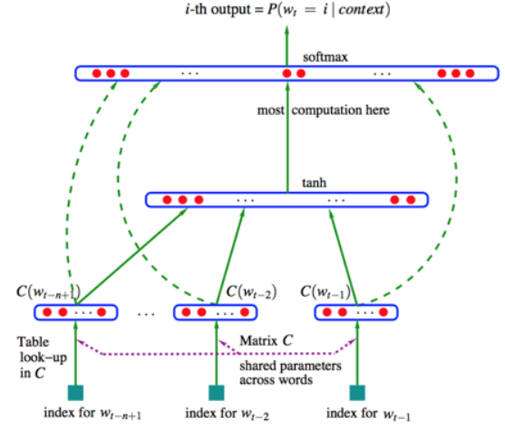
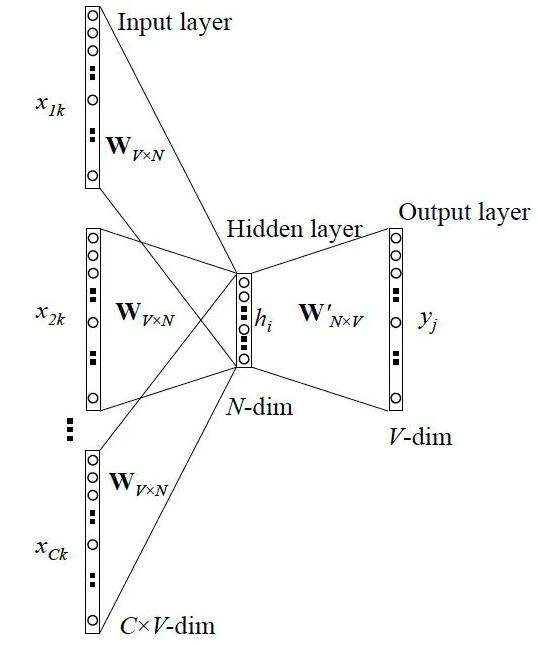
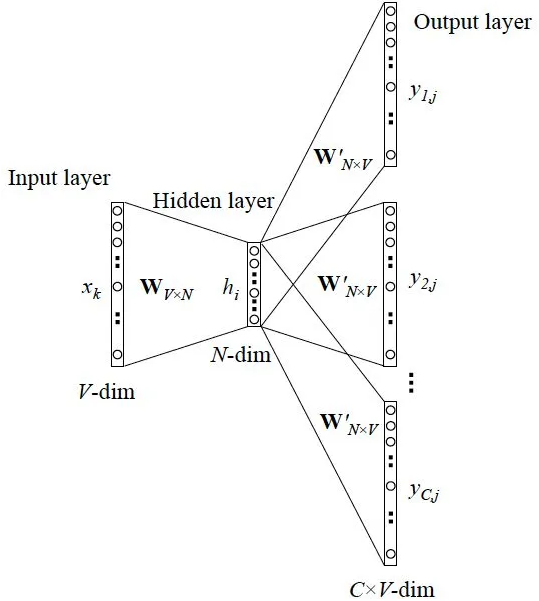

#### `Word2vec`

##### Statistical Language Model

统计语言模型给出了这一类问题的一个基本解决框架。对于一段文本序列$S=\omega_1, \omega_2,\cdots,\omega_T$。它的概率可以表示为：$P(S)=p(\omega_1, \omega_2,\cdots,\omega_T)=\prod_{t=1}^Tp(\omega_t|\omega_1, \omega_2,\cdots,\omega_{t-1})$。由于其巨大的参数空间，我们更多的是采用其简化版本$N-gram$模型：
$$
p(\omega_t|\omega_1, \omega_2,\cdots,\omega_{t-1})\approx p(\omega_t|\omega_{t-n+1}\cdots,\omega_{t-1})
$$
我们可以用最大似然法去求解$N-gram$模型的参数——等价于去统计每个$N-gram$的条件词频。为了避免统计中出现的零概率问题，人们基于原始的$N-gram$模型进一步发展出了back-off trigram模型—用低阶的$\text{bigram}$和$\text{unigram}$代替零概率的$\text{trigram}$和interpolated trigram模型—将条件概率表示为$\text{unigram}$、$\text{bigram}$、$\text{trigram}$三者的线性函数。

$N-gram$模型仍有其局限性。首先，由于参数空间的爆炸式增长，它无法处理更长程的context—N>3。其次，它没有考虑词与词之间内在的联系性。

##### Distributed Representation

用一个连续的稠密向量去刻画一个word的特征呢？这样，我们不仅可以直接刻画词与词之间的相似度，还可以建立一个从向量到概率的平滑函数模型，使得相似的词向量可以映射到相近的概率空间上。$\text{VSM}$是基于一种Statistical Semantics Hypothesis：语言的统计特征隐藏着语义的信息。例如，两篇具有相似词分布的文档可以被认为是有着相近的主题。这个假设有很多衍生版本。其中，比较广为人知的两个版本是Bag of Words Hypothesis和Distributional Hypothesis。前者是说，一篇文档的词频代表了文档的主题；后者是说，上下文环境相似的两个词有着相近的语义。后面我们会看到，$\text{word2vec}$算法也是基于Distributional的假设。

基于Bag of Words Hypothesis，我们可以构造一个term-document矩阵$\mathbf{A}$：矩阵的行$\mathbf{A}_{i,\cdot}$对应着词典里的一个word；矩阵的列$\mathbf{A}_{\cdot,j}$对应着训练语料里的一篇文档；矩阵里的元素$\mathbf{A}_{i,j}$代表着word$\omega_i$在文档$D_j$中出现的次数。那么，我们就可以提取行向量做为word的语义向量

类似地，我们可以基于Distributional Hypothesis构造一个word-context的矩阵。此时，矩阵的列变成了context里的word，矩阵的元素也变成了一个context窗口里word的共现次数。

不过，这种co-occurrence矩阵仍然存在着数据稀疏性和维度灾难的问题。为此，人们提出了一系列对矩阵进行降维的方法。这些方法大都是基于SVD的思想，将原始的稀疏矩阵分解为两个低秩矩阵乘积的形式。

##### Neural Network Language Model

模型的训练数据是一组词序列$ w_{1 }.........w_{T},,,w_{t} \in V$。其中$V$是所有单词的集合，$V_i$表示字典中的第$i$个单词。$\text{NNLM}$的目标是训练如下模型：$f(w_t,w_{t-1},\cdots,w_{t-n+1}) = p(w_t|w_1^{t-1})$
其中$w_t$表示词序列中第$t$个单词，$w_1^{t-1}$表示从第$1$个词到第$t-1$个词组成的子序列。模型需要满足的约束条件是：
$$
\begin{equation}\begin{array}{l}f(w_t,w_{t-1},\cdots,w_{t-n+1})>0\\
\sum_{i=1}^{|V|}f(i,w_{t-1},\cdots,w_{t-n+1}) = 1
\end{array}\end{equation}
$$
采用了一个简单的前向反馈神经网络$f(\omega_{t-n+1}\cdots,\omega_{t})$来拟合一个词序列的条件概率$p(\omega_t|\omega_{t-n+1}\cdots,\omega_{t-1})$。整个模型的网络结构见下图：

可以将整个模型拆分成两部分加以理解：

1. 首先是一个线性的Embedding层。它将输入的$N-1$个one-hot词向量，通过一个共享的$D\times V$的矩阵$\mathbf{C}$，映射为N−1个分布式的词向量。其中，$V$是词典的大小，$D$是Embedding向量的维度。$\mathbf{C}$矩阵里存储了要学习的word vector。

2. 其次是一个简单的前向反馈神经网络$g$。它由一个$\tanh$隐层和一个$softmax$输出层组成。通过将Embedding层输出的$N-1$个词向量映射为一个长度为$V$的概率分布向量，从而对词典中的word在输入context下的条件概率做出预估：
$$
p(\omega_i|\omega_{t-n+1}\cdots,\omega_{t-1})\approx f(\omega_i,\omega_{t-n+1}\cdots,\omega_{t-1}) = g(\omega_i, C(\omega_{t-n+1}),\cdots,C(\omega_{t-1}))
$$
我们可以通过最小化一个cross-entropy的正则化损失函数来调整模型的参数$\theta$：
$$
L(\theta) = \frac{1}{T}\sum_{t}\log f(\omega_t,\omega_{t-1},\cdots,\omega_{t-n+1}) + R(\theta)
$$
输入层：将$C(\omega_{t-n+1}),\cdots,C(\omega_{t-1})$这$n-1$个词向量首尾相接拼起来形成一个$(n-1)m$维的向量$\mathbf{x}$。隐藏层：输入$o=d+Hx$，$d$为$h$维的隐层偏置项，$H$为$h\times (n-1)m$维的隐层参数；输出$a=\tanh(o)$。输出层：用$\text{SoftMax}$做分类，表示下一个词为的未归一化概率：$y=b+W\mathbf{x}+U\tanh(d+H\mathbf{x})$

其中，$U$为$|V|\times h$维的输出层参数矩阵，$b$为$|V|$维的输出层偏置项。模型考虑了从输入层直接到输出层的概率，$W$即为输入层直连输出层的$|V|\times (n-1)m$维参数矩阵。综上：$\theta=(b,d,W,U,H,C)$

##### CBoW&Skip-gram Models

原始的NNLM模型的训练其实可以拆分成**两个步骤**：

1. 用一个简单模型训练出连续的词向量；
2. 基于词向量的表达，训练一个连续的Ngram神经网络模型。而NNLM模型的计算瓶颈主要是在第二步。

首先，我们对原始的NNLM模型做如下改造：

1. 移除前向反馈神经网络中非线性的hidden layer，直接将中间层的Embedding layer与输出层的softmax layer连接；
2. 忽略上下文环境的序列信息：输入的所有词向量均汇总到同一个Embedding layer；
3. 将Future words纳入上下文环境

得到的模型称之为CBoW模型（Continuous Bag-of-Words Model），也是word2vec算法的第一个模型：

CBOW,当前的词使用其周围的上下文(某个window size)的词进行预测，例如，如果$w_{i-1}$,$w_{i-2}$,$w_{i+1}$,$w_{i+2}$是给定的词或者是上下文，那么我们的模型需要预测出是$w_i$。

 Skip-Gram则与CBOW相反，Skip-Gram意味着它从单词中预测给定的序列或上下文。如果$w_i$是给定的，那么我用它去预测它的上下文$w_{i-1}$,$w_{i-2}$,$w_{i+1}$,$w_{i+2}$.

在训练过程开始之前，我们预先处理我们正在训练模型的文本。在这一步中，我们确定一下词典的大小以及哪些词被它包含在内。在训练阶段的开始，我们创建两个矩阵——Embedding矩阵和Context矩阵。这两个矩阵在我们的词汇表中嵌入了每个单词。第二个维度是我们希望每次嵌入的长度。

在训练过程开始时，我们用随机值初始化这些矩阵。然后我们开始训练过程。在每个训练步骤中，我们采取一个相邻的例子及其相关的非相邻例子。我们来看看我们的第一组

现在我们有四个单词：输入单词not和输出/上下文单词: thou（实际邻居词），aaron和taco（负面例子）。我们继续查找它们的嵌入——对于输入词，我们查看Embedding矩阵。对于上下文单词，我们查看Context矩阵。

然后，我们计算输入嵌入与每个上下文嵌入的点积。在每种情况下，结果都将是表示输入和上下文嵌入的相似性的数字。

现在我们需要一种方法将这些分数转化为看起来像概率的东西，现在我们可以将sigmoid操作的输出视为这些示例的模型输出，既然未经训练的模型已做出预测，而且我们确实拥有真实目标标签来作对比。计算误差只需从目标标签中减去sigmoid分数。现在，我们可以利用这个错误分数来调整not、thou、aaron和taco的嵌入，使我们下一次做出这一计算时，结果会更接近目标分数。

训练步骤到此结束。我们从中得到了这一步所使用词语更好一些的嵌入（not，thou，aaron和taco）。我们现在进行下一步，下一个相邻样本及其相关的非相邻样本，并再次执行相同的过程。当我们循环遍历整个数据集多次时，嵌入会继续得到改进。然后我们就可以停止训练过程，丢弃Context矩阵，并使用Embeddings矩阵作为下一项任务的已被训练好的嵌入。

###### 负例采样

要使用高性能模型生成高质量嵌入，我们可以改变一下预测相邻单词这一任务，将其切换到一个提取输入与输出单词的模型，并输出一个表明它们是否是邻居的分数，这个简单的变换将我们需要的模型从神经网络改为逻辑回归模型——因此它变得更简单，计算速度更快。这个开关要求我们切换数据集的结构——标签值现在是一个值为0或1的新列。它们将全部为1，因为我们添加的所有单词都是邻居。

我们需要在数据集中引入负样本 - 不是邻居的单词样本。我们的模型需要为这些样本返回0。模型必须努力解决这个挑战——而且依然必须保持高速。我们从词汇表中随机抽取单词

#### Attention机制

##### $\text{seq2seq}$模型

seq2seq模型通常采用的是encoder-docoder框架，其中encoder将输入的序列进行编码成一个固定大小的上下文的向量, decoder部分则使用该上下文向量进行后续操作，生成转换之后的输出。一个简单的例子可以参考下图，这样的设计我们发现其最大的缺点在于：如果我们输入的序列非常长，则该系统很容易性能会下降，因它会去处理整个句子，而造成早期的句子信息会被遗忘，attention机制应运而生。

###### Attention层

$Attention(Q,K,V) = softmax(\frac{QK^T}{\sqrt{d_k}})V$，其中$Q\in R^{n\times d_k},K\in R^{m\times d_k},V\in R^{m\times d_v}$。这是一个Attention层，将$n\times d_k$的序列$Q$ 编码成了一个新的$n\times d_v$的序列。

逐个向量来看。
$$
Attention(q_t,K,V)=\sum_{s=1}^m \frac{1}{Z}exp(\frac{<q_t,k_s>}{\sqrt{d_k}}v_s)
$$
其中 Z 是归一化因子。事实上 q,k,v 分别是 query,key,value 的简写，K,V 是一一对应的，它们就像是 key-value 的关系，那么上式的意思就是通过$q_t$这个 query，通过与各个$k_s$内积的并softmax 的方式，来得到$q_t$与各个$v_s$的相似度，然后加权求和，得到一个$d_v$维的向量，其中因子$\sqrt{d_k}$起到调节作用，使得内积不至于太大

###### Multi-Head Attention

就是把 Q,K,V 通过参数矩阵映射一下，然后再做 Attention，把这个过程重复做 h 次，结果拼接起来就行了，可谓“大道至简”了。具体来说：$head_i = Attention(QW_i^Q,KW_i^K,VW_i^V)$，其中$W_i^Q\in R^{d_k\times \hat{d_k}},W_i^K\in R^{d_k\times \hat{d_k}},W_i^V\in R^{d_k\times \hat{d_k}}$。然后
$$
MultiHead(Q,K,V) = Concat(head_1,\cdots,head_h)
$$
所谓Self Attention，其实就是$Attention(X,X,X)$，$X$就是前面说的输入序列。也就是说，在序列内部做Attention，寻找序列内部的联系。 Google 所用的是 Self Multi-Head Attention
$$
Y=MultiHead(X,X,X)
$$

###### Position Embedding

Position Embedding，也就是“位置向量”，将每个位置编号，然后每个编号对应一个向量，通过结合位置向量和词向量，就给每个词都引入了一定的位置信息，这样 Attention 就可以分辨出不同位置的词了。 而 Google 直接给出了一个构造 Position Embedding 的公式：
$$
\begin{cases}PE_{21}(p) = \sin(p/10000^{2i/d_{pos}})\\
PE_{2i+1}(p) = \cos(p/10000^{2i/d_{pos}})
\end{cases}
$$
将`id`为$p$的位置映射为一个$d_{pos}$维的位置向量，这个向量的第$i$个元素的数值就是$PE_i(p)$。结合位置向量和词向量有几个可选方案，可以把它们拼接起来作为一个新向量，也可以把位置向量定义为跟词向量一样大小，然后两者加起来。

###### Transformer

现在，让我们观察下图。编码器块有一层 多头注意力，然后是另一层 前馈神经网络。另一方面，解码器有一个额外的 掩模多头注意力。

编码器和解码器块实际上是相互堆叠在一起的多个相同的编码器和解码器。 编码器堆栈和解码器堆栈都具有相同数量的单元。

##### 注意力机制

###### `seq2seq`模型

seq2seq模型通常具有编码器 - 解码器架构:编码器encoder:  编码器处理输入序列并将序列信息压缩成固定长度的上下文向量（语义编码/语义向量context）。期望这个向量能够比较好的表示输入序列的信息。解码器decoder: 利用上下文向量初始化解码器以得到变换后的目标序列输出。早期工作仅使用编码器的最后状态作为解码器的输入。编码器和解码器都是循环神经网络，比较常见的是使用LSTM或GRU。

###### 起源

作者采样bidirectional RNN作为encoder，具有前向隐藏状态$\vec{\mathbf{h}_i}$和后向隐藏状态$\vec{\mathbf{h}_i}$。为了获得词的上下文信息，作者采用简单串联方式将前向和后向表示拼接作为encoder的隐藏层状态，公式如下：

$$
\mathbf{h}_i=[\vec{\mathbf{h}_i};\vec{\mathbf{h}_i}], i=1,2,\cdots,n
$$
对于目标(输出)序列的每个词(假设位置为t)，decoder网络的隐藏层状态：$\mathbf{s}_t = f(\mathbf{s}_{t-1},y_{t-1},\mathbf{c}_t)$. 语义向量$\mathbf{c}_t$是输入序列的隐状态的加权和，权重为对其分数
$$
\mathbf{c}_t = \sum_{i=1}^{n}\alpha_{t,i}\mathbf{h}_i\\
\alpha_{t,i} = align(y_t,x_i) = \frac{exp(socre(\mathbf{s_{t-1},\mathbf{h}_i}))}{\sum_{i=1}^{n}exp(socre(\mathbf{s_{t-1},\mathbf{h}_i}))}
$$

###### Hierarchical Attention

##### 语言处理

###### Bool模型

布尔模型出现了词所在维度为1，没出现的所在维度为0，然后求两个向量的cosine即可

###### 向量空间模型

 $t$表示特征项，$d$表示一个Document，那么D可表示为$D=\{t_1,t_2,\cdots,t_N\}$的N维向量，利用TF*IDF来计算$w_{ij}$，TF表示词频、IDF表示反词频，公式如下：$TF(t)$=特征词在文档中出现次数/文档总词数；$IDF(t)$=$log(N/(n+1))$，其中N为文本集文本总数，n为包含特征词t的文档数量

###### `word2vec`

###### ELMO

word2vec固然可以表示词与词之间的语义以及相互之间的关系，但是word2vec是一个完全静态的，也就是把所有信息都压缩到一个固定维度的向量里。那么对于一词多意，是表现力是比较有限的。

EMLO的结构很简单，用了双向的LSTM来训练一个语言模型。模型training的过程很简单，读入一个词，一词下一个词，反向读一个词，预测上一个词，以此训练下去，直到收敛。中间红框处的蓝色和橙色的向量就是Embedding的向量，最后接起来就是我们所要的向量了，当然这个bi-lstm也可以叠很多层。每一层都得到一个Embedding向量。使用的时候怎么用这个编码值呢？这取决于下游任务，比方说可以把每一层的Embedding向量求和取平均，或者加权求和等等，这个权重可以跟着任务一起train出来。

###### GPT

ELMO实现了对word进行动态编码，但是他用了LSTM，LSTM并不能记住很长的信息，且不利于并行计算。GPT用self attention改变这一结果

每个词之和前面的词做attention，预测下一个词，例如读入开始标记BOS，然后自己和自己做attention，预测“潮水”，读入BOS、潮水，然后和BOS、潮水做attention，预测“退了”，类推下去，直到结束。在很多语料上train下去，就得到了一个非常强大的语言模型，可以动态的进行编码。使用的时候可以固定住这些attention层的参数，然后训练其他的下游任务，例如做情感分类问题，可以把这些attention层放在几个全连接层前面，固定参数，只训练后面的全连接层，通过softmax或者sigmoid进行分类。

###### BERT

GPT有个缺陷，就是编码只依赖上文信息，没有加入下文信息，那么BERT很好的解决了这个问题。BERT其实是transformer的encoder部分，train BERT有两种方法，Masked LM和Next Sentence Prediction，Masked LM是随机掩盖住一些词，让BERT猜测盖住的词什么。Next Sentence Prediction是让BERT推断两个句子是不是有上下文关系。

整个 BERT 分为两步，pre-training 和 fine-tuning，在 pre-training 部分，在不同的 pre-training 任务中在未标记数据上进行训练，在 fine-tuning 部分，模型先使用 pre-trained 的参数初始化，然后在下游任务中用标记数据对所有参数进行微调，虽然初始化用的都是相同的 pre-trained 参数，但是在下游不同任务中可以有不同的 fine-tuned 模型。为了使 BERT 能适应各式各样的下游任务，我们的输入表示要能够用一个序列清晰的同时可以表示一个单句子和一个句子对（比如（问题，答案）），这时在 BERT 中的“sequence”不再是单一的语言意义上的一个句子，而是任意跨度的连续文本。在序列开头永远放一个 [CLS] 标记，在分类任务的时候这个表示类别，不是分类任务可以忽略，对于句子对，用了两个方法区分，第一，每个句子后插如一个 [SEP] 标记，第二，加入一个序列向量用来区分一个词是属于句子 A 还是句子 B。实际最后的 input embedding，是三部分向量相加，单词本身的 Token embedding，单词归属信息的 segment embedding，位置信息的 position embeddings，这里的位置信息，在前面说 Transfomer 时提过，有两种方法：1）自己训练；2）自己编码，Transformer 使用的是第二种，奇怪的 sin、cos 函数编码位置 ，而这里用的是第一种，初始化，完了也加入到训练参数中自己去 train。

###### Pre-training BERT

TASK1 Masked LM：

为了训练深度双向模型，作者使用了一种随机掩盖一定百分比的输入词的方法，然后去预测这些被掩盖的词，叫做“Masked LM” (MLM)，其实就可以想象成是完形填空，在作者实验中使用的是 15% 的词，也就是说有随机选择的 15% 的词会被 masked 掉，然后去预测这些被 masked 掉的词是什么，这时实际上已经变成一个单纯分类问题了，不是传统意义上的生成语言模型了，根据这个位置的 hidden state 预测是什么 token，而不是预测下一个词的概率了。

虽然这样可以建立一个双向预训练模型，但是缺点是这样预训练阶段和微调阶段就产生了不匹配的问题，因为 mask token 在微调阶段不会出现，也就是说在预训练阶段你是加了 [mask] 的去训练，而微调阶段没有加 [mask] 训练，为了尽可能的把模型调教的忽略这些标记的影响，作者通过如下方式来告诉模型这些是噪声，请忽略它： 

如果一个 token 被选中，那么我们把这个 token：

1. 80% 的时间换成 [MASK] 标记，即掩盖掉；
2. 10% 的时间随机换成另外一个词（还是要预测正确的词的）；
3. 10% 的时间不变，仍然是原词 （还是要预测该位置的词的）。

还有一个问题是只有 15% 的词被预测，而传统语言模型是每一个词都会被预测的，所以 MLM 收敛比较慢。

如上图，用来通过 cross-entropy 预测原来这个位置的 token 是什么，属于 Mask LM 任务。

TASK2 Next Sentence Prediction: 

很多下游任务比如 QA，NLI (Natural Language Inference) 都是基于对两个句子之间的关系去理解的，但是在语言模型里没有捕捉到这个信息，BERT 中就为了解决这个问题，加了一个 NSP 训练任务，50% 的时间选择句子 A 真正的下一个句子 B 作为一个句子对（标记为 IsNext），50% 的时间选择句子 A 和随机句子作为句子对（标记为 NotNext），训练数据就是这样，虽然很简单，但是很有效，有点句子级别的负采样的味道。

如上图，句子级别的信息被 encoding 在 [CLS] 标记里，这个做法乍一看有点费解，其实 Transformer 是可以无视空间和距离的把全局信息 encoding 进每个位置的，而 [CLS] 作为句子/句对的表示是直接跟分类器的输出层连接的，因此其作为梯度反传路径上的“关卡”，当然会想办法学习到分类相关的上层特征，如上图 C，用来做 NSP 任务。

###### Fine-tuning BERT

在 fine-tuning 之前只需根据特定任务对结构做简单的改变，例如针对句子级别的分类任务（例如情感分析），取第一个 [CLS] 的输出表示，传给一个 softmax 层得到分类结果输出；对于单词级别的分类（例如 NER），取所有 token 的最后层 transformer 输出，传给 softmax 层做分类，总之改变都很简单，就加一层神经网络就好了。然后微调很简单，因为 Transformer 中的 self-attention 机制允许 BERT 通过改变适当的输入和输出来对许多下游任务（无论它们涉及单个文本还是文本对）进行建模。

对抗样本：对自然输入进行微小的扰动就会使当前最优的分类器出现错误的预测结果，而这种扰动在人类看来是不影响整体的。
对抗脆弱性是模型对数据中泛化较好的特征具备敏感性的直接结果。

