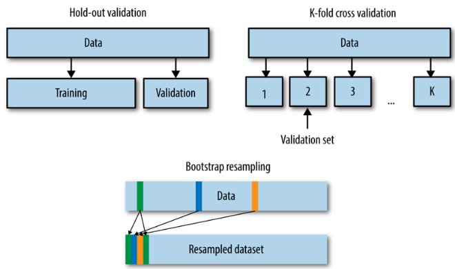
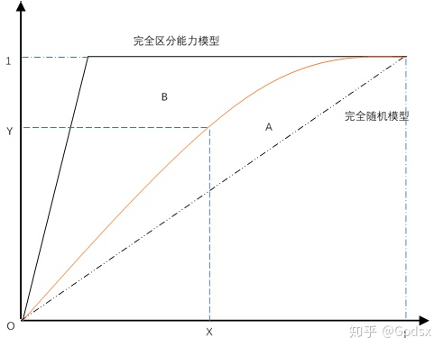

##### 过拟合、欠拟合

模型对未知数据的预测能力称作模型的泛化能力，它是模型最重要的性质。泛化误差可以反映模型的泛化能力：泛化误差越小，该模型越有效。

过拟合`overfitting`：选择的模型包含的参数过多，以至于该模型对于已知数据预测得很好，但是对于未知数据预测的很差，使得训练误差和测试误差之间的差距太大。过拟合的原因是：将训练样本本身的一些特点当作了所有潜在样本都具有的一般性质，这会造成泛化能力下降。过拟合无法避免，只能缓解

欠拟合`underfitting`：选择的模型包含的参数太少，以至于该模型对已知数据都预测的很差，使得训练误差较大。欠拟合的原因一般是学习能力低下造成的。

通常泛化误差是关于模型容量的 `U`形函数。随着模型容量增大：训练误差会下降直到逼近其最小值、泛化误差先减小后增大、泛化误差与训练误差的差值会增大。

缓解过拟合的策略：正则化；数据集增强：通过人工规则产生虚假数据来创造更多的训练数据；噪声注入：包括输入噪声注入、输出噪声注入、权重噪声注入。将噪声分别注入到输入/输出/权重参数中；早停：当验证集上的误差没有进一步改善时，算法提前终止。

##### 偏差方差分解

点估计：对参数$\theta$的一个预测，记作$\hat{\theta}$。假设$\left\{x_{1}, x_{2}, \cdots, x_{m}\right\}$为独立同分布的数据点，该分布由参数$\theta$决定。则参数$\theta$的点估计为某个函数：$\hat{\theta}_{m}=g\left(x_{1}, x_{2}, \cdots, x_{m}\right)$。注意：点估计的定义并不要求  返回一个接近真实值  。根据频率学派的观点：真实参值$\theta$是固定的，但是未知的。$\hat{\theta}$是数据点的函数。由于数据是随机采样的，因此$\hat{\theta}$是个随机变量

偏差定义为：$\operatorname{bias}\left(\hat{\theta}_{m}\right)=\mathbb{E}\left(\hat{\theta}_{m}\right)-\theta$，期望作用在所有数据上。如果$\operatorname{bias}\left(\hat{\theta}_{m}\right)=0$，则称估计量$\hat{\theta}$是无偏的。如果$\lim _{m \rightarrow \infty} \operatorname{bias}\left(\hat{\theta}_{m}\right)=0$，则称估计量$\hat{\theta}$是渐近无偏的。无偏估计并不一定是最好的估计。通常希望当数据集的大小$m$增加时，点估计会收敛到对应参数的真实值。即：

$$
\operatorname{plim}_{m \rightarrow \infty} \hat{\theta}_{m}=\theta
$$
 $\operatorname{plim}$表示依概率收敛。即对于任意的$\epsilon>0$，当$m \rightarrow \infty$时，有：$P\left(\left|\hat{\theta}_{m}-\theta\right|\right)>\epsilon \rightarrow 0$ 

###### 偏差方差分解

期望误差可以分解为
$$
\begin{aligned} \mathcal{R}(f) &=\mathbb{E}_{(\mathbf{x}, y) \sim p_{r}(\mathbf{x}, y)}\left[\left(y-f^{*}(\mathbf{x})+f^{*}(\mathbf{x})-f(\mathbf{x})\right)^{2}\right] \\ &=\mathbb{E}_{\mathbf{x} \sim p_{r}(\mathbf{x})}\left[\left(f(\mathbf{x})-f^{*}(\mathbf{x})\right)^{2}\right]+\varepsilon \end{aligned}
$$
对于单个样本$\mathbf{x}$，不同训练集$D$得到模型$f_D(\mathbf{x})$和最优模型$f^∗(\mathbf{x})$的上的期望差距为
$$
\begin{aligned} \mathbb{E}_{\mathcal{D}} &\left[\left(f_{\mathcal{D}}(\mathbf{x})-f^{*}(\mathbf{x})\right)^{2}\right] \\=& \mathbb{E}_{\mathcal{D}}\left[\left(f_{\mathcal{D}}(\mathbf{x})-\mathbb{E}_{\mathcal{D}}\left[f_{\mathcal{D}}(\mathbf{x})\right]+\mathbb{E}_{\mathcal{D}}\left[f_{\mathcal{D}}(\mathbf{x})\right]-f^{*}(\mathbf{x})\right)^{2}\right] \\=& \underbrace{\left(\mathbb{E}_{\mathcal{D}}\left[f_{\mathcal{D}}(\mathbf{x})\right]-f^{*}(\mathbf{x})\right)^{2}}_{(\text { bias })^{2}}+\underbrace{\mathbb{E}_{\mathcal{D}}\left[\left(f_{\mathcal{D}}(\mathbf{x})-\mathbb{E}_{\mathcal{D}}\left[f_{\mathcal{D}}(\mathbf{x})\right]\right)^{2}\right]}_{\text { variance }} \end{aligned}
$$

偏差-方差分解表明：泛化性能是由学习算法的能力、数据的充分性以及学习任务本身的难度共同决定的。增加容量会增加方差、降低偏差。偏差降低，是因为随着容量的增大，模型的拟合能力越强：对给定的训练数据，它拟合的越准确。方差增加，是因为随着容量的增大，模型的随机性越强：对不同的训练集，它学得的模型可能差距较大。

##### 误差诊断

高偏差对应于模型的欠拟合：模型过于简单，以至于未能很好的学习训练集，从而使得训练误差过高。此时模型预测的方差较小，表示预测较稳定。但是模型预测的偏差会较大，表示预测不准确。

高方差对应于模型的过拟合：模型过于复杂，以至于将训练集的细节都学到，将训练集的一些细节当做普遍的规律，从而使得测试集误差与训练集误差相距甚远。此时模型预测的偏差较小，表示预测较准确。但是模型预测的方差较大，表示预测较不稳定。

通过训练误差和测试误差来分析模型是否存在高方差、高偏差。

- 如果训练误差较高：说明模型的偏差较大，模型出现了欠拟合；
- 如果训练误差较低，而测试误差较高：说明模型的偏差较大，出现了过拟合；
- 如果训练误差较低，测试误差也较低：说明模型的方差和偏差都适中，是一个比较理想的模型；
- 如果训练误差较高，且测试误差更高：说明模型的方差和偏差都较大。

上述分析的前提是：训练集、测试集的数据来自于同一个分布，且最优误差较小。

如果模型存在高偏差，则通过以下策略可以缓解：

- 选择一个容量更大、更复杂的模型。
- 使用更先进的最优化算法。该策略通常在神经网络中使用。

如果模型存在高方差，则通过以下策略可以缓解：

- 增加更多的训练数据。它通过更多的训练样本来对模型参数增加约束，会降低模型容量。
- 使用正则化。它通过正则化项来对模型参数增加约束，也会降低模型容量。

通常优先解决高偏差的问题。这是最低标准，要反复尝试，直到训练误差降低到足够小。然后试图降低方差。

##### 参数估计准则

###### 最大似然估计

假设数据集$\mathbf{X}=\{\vec{\mathbf{x}}_1,\cdots,\vec{\mathbf{x}}_m\}$中的样本独立同分布地由$p_{\text{data}}(\vec{\mathbf{x}})$产生，但是该分布是未知的。$p_{\text{model}}(\vec{\mathbf{x}};\theta)$是一族由$\theta$参数控制的概率分布函数族，希望通过$p_{\text{model}}(\vec{\mathbf{x}};\theta)$来估计真实的概率分布函数$p_{\text{data}}(\vec{\mathbf{x}})$，也就是要估计$\theta$参数。最大似然估计最大化数据集$\mathbf{X}$出现的概率。即：
$$
\theta_{\text{ML}}=\arg\max_{\theta}p_{\text{model}}(\mathbf{X};\theta)=\arg\max_{\theta}\prod_{i=1}^m p_{\text{model}}(\vec{\mathbf{x}}_i;\theta)
$$
由于概率的乘积会因为很多原因不便使用，因此转换为对数的形式： 
$$
\theta_{\text{ML}}=\arg\max_{\theta}\sum_{i=1}^m \log p_{\text{model}}(\vec{\mathbf{x}}_i;\theta)
$$
因为$m$与$\theta$无关，因此它也等价于： $\theta_{\text{ML}}=\arg\max_{\theta}\sum_{i=1}^m \frac{1}{m}\log p_{\text{model}}(\vec{\mathbf{x}}_i;\theta)$。

由于数据集的经验分布为：$\hat{p}_{\text{data}}(\vec{\mathbf{x}})=\frac{1}{m}\sum_{i=1}^m\delta(\vec{\mathbf{x}}-\vec{\mathbf{x}}_i)$，其中$\delta(\cdot)$为狄拉克函数。因此： 
$$
\theta_{\text{ML}}=\arg\max_{\theta}\mathbb{E}_{\vec{\mathbf{x}}\sim \hat{p}_{\text{data}}} \log p_{\text{model}}(\vec{\mathbf{x}};\theta)
$$
考虑数据集的经验分布 和真实分布函数的估计量 之间的差异，`KL`散度为：
$$
D_{\text{KL}}(\hat{p}_{\text{data}}||p_{\text{model}};\theta)=\mathbb{E}_{\vec{\mathbf{x}}\sim \hat{p}_{\text{data}}}[\log \hat{p}_{\text{data}}(\vec{\mathbf{x}})-\log p_{\text{model}}(\vec{\mathbf{x}};
\theta)]
$$
由于$\log \hat{p}_{\text{data}}(\vec{\mathbf{x}})$与$\theta$无关，因此要使得$D_{\text{KL}}(\hat{p}_{\text{data}}||p_{\text{model}};\theta)$最小，则只需要最小化$\mathbb{E}_{\vec{\mathbf{x}}\sim \hat{p}_{\text{data}}}[-\log p_{\text{model}}(\vec{\mathbf{x}};
\theta)]$。也就是最大化$\mathbb{E}_{\vec{\mathbf{x}}\sim \hat{p}_{\text{data}}} \log p_{\text{model}}(\vec{\mathbf{x}};\theta)$。

因此：最大似然估计就是最小化数据集的经验分布$\hat{p}_{\text{data}}$和真实分布函数的估计量$p_{\text{model}}$之间的差异 。

最大似然估计可以扩展到估计条件概率。假设数据集$\mathbf{X}=\{\vec{\mathbf{x}}_1,\cdots,\vec{\mathbf{x}}_m\}$，对应的观测值为$\mathbf{Y}=\{y_1,\cdots,y_m\}$。则条件概率的最大似然估计为： $\theta_{\text{ML}}=\arg\max_{\theta}p(\mathbf{Y}|\mathbf{x};\theta)$如果样本是独立同分布的，则可以分解成： 
$$
\theta_{\text{ML}}=\arg\max_{\theta}\sum_{i=1}^m\log p(y_i|\vec{\mathbf{x}}_i;\theta)
$$
最大似然估计有两个很好的性质：

- 在某些条件下，最大似然估计具有一致性。这意味着当训练样本数量趋向于无穷时，参数的最大似然估计依概率收敛到参数的真实值。。
- 最大似然估计具有很好的统计效率`statistic efficiency`。即只需要较少的样本就能达到一个良好的泛化误差。

最大似然估计通常是机器学习中的首选估计准则。当样本数量太少导致过拟合时，正则化技巧是最大似然的有偏估计版本。

###### 贝叶斯估计

在最大似然估计中，频率学派的观点是：真实参数$\theta$是未知的固定的值，而点估计$\hat{\theta}$是随机变量。因为数据是随机生成的，所以数据集是随机的。

在贝叶斯估计中，贝叶斯学派认为：数据集是能够直接观测到的，因此不是随机的。而真实参数$\theta$是未知的、不确定的，因此$\theta$是随机变量。对$\theta$的已知的知识表示成先验概率分布$p(\theta)$：表示在观测到任何数据之前，对于参数 的可能取值的一个分布。

假设观测到一组数据$\mathbf{X}=\{\vec{\mathbf{x}}_1,\cdots,\vec{\mathbf{x}}_m\}$，根据贝叶斯法则，有：
$$
p(\theta|\mathbf{X})= \frac{p(\mathbf{X}|\theta)p(\theta)}{p(\mathbf{X})}
$$
当训练数据有限时，贝叶斯估计通常比最大似然估计泛化性能更好。当训练样本数量很大时，贝叶斯估计往往比最大似然估计计算代价较高。

有时候希望获取参数$\theta$的一个可能的值，而不仅仅是它的一个分布。此时可以通过最大后验估计`MAP` 选择后验概率最大的点：
$$
\theta_{\text{MAP}}=\arg\max_{\theta}p(\theta|\mathbf{X})=\arg\max_{\theta}[\log p(\mathbf{X}|\theta)+\log p(\theta)]
$$
最大后验估计具有最大似然估计没有的优势：拥有先验知识带来的信息。该信息有助于减少估计量的方差，但是增加了偏差。

##### 泛化能力评估

模型泛化能力的评估：用测试集对模型进行评估。通常有下列方法：留出法`hold-out`、`K` 折交叉验证法`cross validation`、留一法`Leave-One-Out:LOO`、自助法`bootstrapping`。

| 方法            | 说明                                                         |
| --------------- | ------------------------------------------------------------ |
| `hold-out`      | 直接将数据切分为三个互斥的部分（也可以切分成两部分，此时训练集也是验证集），然后在训练集上训练模型，在验证集上选择模型，最后用测试集上的误差作为泛化误差的估计。 |
| `K`折交叉验证法 | 数据随机划分为`K` 个互不相交且大小相同的子集，利用 `K-1` 个子集数据训练模型，利用余下的一个子集测试模型。对 `K` 种组合依次重复进行，获取测试误差的均值，将这个均值作为泛化误差的估计。 |
| 留一法          | 假设数据集中存在$N$个样本，令$K=N$则得到了 `K` 折交叉验证的一个特例。 |
| 自助采样法      | 给定包含$N$个样本的数据集$\mathbb{D}$，对它进行采样产生数据集$\mathbb{D}^{\prime}$：每次随机从$\mathbb{D}$中挑选一个样本，将其拷贝放入$\mathbb{D}^{\prime}$中，然后再将该样本放回初始数据集$\mathbb{D}$中。重复这个过程$N$次，就得到了包含$N$个样本的数据集$\mathbb{D}^{\prime}$。将$\mathbb{D}^{\prime}$用作训练集，$\mathbb{D}-\mathbb{D}^{\prime}$用作测试集，这样的测试结果称作包外估计 |

在分类任务中至少要保持样本的类别比例相似。如果从采样的角度来看到数据集的划分过程，则保留类别比例的采样方式称作“分层采样“(`strafified sampling`)。

##### 训练、验证、测试集

将训练数据分成两个不相交的子集：训练集用于学习模型，验证集用于更新超参数。通常要求验证集足够大。如果验证集很小，那么模型的超参数可能就记住了一个小验证集里的样本，模型将对验证集严重过拟合。验证集通常会低估泛化误差。因此当超参数优化完成后，需要通过测试集来估计泛化误差。

测试集用于评估模型的泛化误差。理论上测试集越大，则模型的泛化误差评估的越准确。测试集中的样本一定不能是训练样本。如果将训练样本放入测试集中，则会低估泛化误差。

对于小批量数据，数据的拆分的常见比例为：

- 如果未设置验证集，则将数据三七分：70% 的数据用作训练集、30% 的数据用作测试集。
- 如果设置验证集，则将数据划分为：60% 的数据用作训练集、20%的数据用过验证集、20% 的数据用作测试集。

对于大批量数据，验证集和测试集占总数据的比例会更小。

- 对于百万级别的数据，其中1万条作为验证集、1万条作为测试集即可。
- 验证集的目的就是验证不同的超参数；测试集的目的就是比较不同的模型。

##### 性能度量

给定训练集$\mathbb{D}=\{(\vec{\mathbf{x}}_1,\tilde{y}_1),\cdots,(\vec{\mathbf{x}}_N,\tilde{y}_N)\}$，测试集合$\mathbb{T}=\{(\vec{\mathbf{x}}^{\prime}_1,\tilde{y}^{\prime}_1),\cdots,(\vec{\mathbf{x}}^{\prime}_{N^{\prime}},\tilde{y}^{\prime}_{N^{\prime}})\}$。对于样本$\vec{\mathbf{x}}$，假设其真实标记为$\tilde{y}_i$，模型预测输出为$\hat{y}_i$

###### 分类问题性能度量

测试准确率：测试数据集上的准确率，准确率衡量的是有多少比例的样本被正确判别。
$$
r_{\text{text}}=\frac{1}{N^{\prime}}\sum_{i=1}^{N^{\prime}}I(\tilde{y}^{\prime}_i=\hat{y}^{\prime}_i)
$$
测试错误率：测试数据集上的错误率：测试错误率：测试数据集上的错误率：
$$
c_{\text{text}}=\frac{1}{N^{\prime}}\sum_{i=1}^{N^{\prime}}I(\tilde{y}^{\prime}_i\ne\hat{y}^{\prime}_i)
$$

|            | 预测：正类 | 预测：反类 |
| ---------- | ---------- | ---------- |
| 真实：正类 | `TP`       | `FN`       |
| 真实：反类 | `FP`       | `TN`       |

查准率：所有预测为正类的结果中，真正的正类的比例。
$$
P=\frac{TP}{TP+FP}
$$
查全率：真正的正类中，被分类器找出来的比例。
$$
\frac{TP}{TP+FN}
$$
查准率和查全率是一对矛盾的度量。一般来说查准率高时查全率往往偏低，而查全率高时查准率往往偏低。$F1=\frac{P+R}{2PR}$

`P-R`曲线直观显示出分类器在样本总体上的查全率、查准率。因此可以通过两个分类器在同一个测试集上的`P-R` 曲线来比较它们的预测能力：如果分类器`B`的`P-R`曲线被分类器`A`的曲线完全包住，则可断言：`A`的性能好于`B` 。如果分类器`A`的`P-R`曲线与分类器`B`的曲线发生了交叉，则难以一般性的断言两者的优劣，只能在具体的查准率和查全率下进行比较。此时一个合理的判定依据是比较`P-R`曲线下面积大小，但这个值通常不容易计算。可以考察平衡点。平衡点是`P-R`曲线上查准率等于查全率的点，可以判定：平衡点较远的`P-R`曲线较好。

假设排序后的样本集合为$\left(\vec{\mathbf{x}}_{1}, \tilde{y}_{1}\right),\left(\vec{\mathbf{x}}_{2}, \tilde{y}_{2}\right), \cdots,\left(\vec{\mathbf{x}}_{N}, \tilde{y}_{N}\right)$，预测为正类的概率依次为$\left(p_{1}, p_{2}, \cdots, p_{N}\right)$。在第$i$轮，将$p_i$作为分类阈值来。即：
$$
\hat{y}_{j}=\left\{\begin{array}{ll}{1,} & {\text { if } p_{j} \geq p_{i}} \\ {0,} & {\text { else }}\end{array}, \quad j=1,2, \cdots, N\right.
$$
此时计算得到的查准率记做$P_i$，查全率记做$R_i$。以查准率为纵轴、查全率为横轴作图，就得到查准率-查全率曲线，简称 `P-R`曲线。该曲线由点$\left\{\left(R_{1}, P_{1}\right),\left(R_{2}, P_{2}\right), \cdots,\left(R_{N}, P_{N}\right)\right\}$组成。

纵轴是真阳率`TPR`定义为在所有真实的正样本中，被模型正确的判断为正例的比例，其实就是召回率$\text{TPR}=\frac{T P}{T P+F N}$。正类中被预测为正类的比例

横轴是假阳率`FPR`定义为在所有真实的负样本中，被模型错误的判断为正例的比例 ，计算公式如下$\text{FPR}=\frac{F P}{T N+F P}$，负类样本中被预测为正类的比例

假设排序后的样本集合为$\left(\vec{\mathbf{x}}_{1}, \tilde{y}_{1}\right),\left(\vec{\mathbf{x}}_{2}, \tilde{y}_{2}\right), \cdots,\left(\vec{\mathbf{x}}_{N}, \tilde{y}_{N}\right)$，预测为正类的概率依次为$\left(p_{1}, p_{2}, \cdots, p_{N}\right)$。在第$i$轮，将$p_i$作为分类阈值来。即：
$$
\hat{y}_{j}=\left\{\begin{array}{ll}{1,} & {\text { if } p_{j} \geq p_{i}} \\ {0,} & {\text { else }}\end{array}, \quad j=1,2, \cdots, N\right.
$$
以真正例率$TPR_i$为纵轴、假正例$FPR_i$率为横轴作图，就得到`ROC`曲线。该曲线由点$\left\{\left(TPR_{1}, F P R_{1}\right),\cdots,\left(R P R_{N}, F P R_{N}\right)\right\}$组成。

可以通过两个分类器在同一个测试集上的`ROC` 曲线来比较它们的预测能力：

- 如果分类器`A`的`ROC`曲线被分类器`B`的曲线完全包住，则可断言：`B`的性能好于`A` 
- 如果分类器`A`的`ROC`曲线与分类器`B`的曲线发生了交叉，则难以一般性的断言两者的优劣。

`AUC` 是`ROC` 曲线的面积，其物理意义为：从所有正样本中随机挑选一个样本，模型将其预测为正样本的概率为$p_1$；从所有负样本中随机挑选一个样本，模型将其预测为正样本的概率为$p_0$。$p_1>p_0$的概率就等于 `AUC` 。`AUC` 反应的是模型对于样本的排序能力；`AUC` 对于均匀采样不敏感。正负样本之间的预测为正类概率之间的差距越大，则`AUC` 越高。因为这表明正负样本之间排序的把握越大，区分度越高。`AUC` 在样本不平衡的条件下依然适用。

KS需要`TPR`和`FPR`两个值，具体如下：

- 真阳率`TPR`刻画的是在所有真实的正样本中，被模型正确的判断为正例的比例。
- 假阳率`FPR`，计算的是在所有真实的负样本中，被模型错误的判断为正例的比例 。
- KS=max(`TPR`-`FPR`)： 两条曲线之间的最大间隔距离

1. 根据预测是正例的概率值对样本进行降序排序，这就是截断点依次选取的顺序；
2. 按顺序选取N个截断点（如：分别在1/N，2/N，3/N等位置），计算TPR和FPR ；
3. 横轴为样本的占比（最大1.0），纵轴分别为TPR、FPR、(TPR-FPR)，可以得到KS曲线

首先将客户按照违约概率从高到低进行排序，横轴：该阈值下预测为正的样本数 / 样本集中的总样本数、纵轴：该阈值下检出的正样本中真实的正样本数 / 样本集合中的总正样本数，分别作出理想评级模型、实际评级模型、随机评级模型三条曲线。

完美曲线：代表最完美的情况下，模型会将所有坏客户识别出来并将其排列于左方；随机曲线：代表模型对好坏客户比毫无区分能力，CAP曲线会是一条斜率为45度的曲线；实际曲线：代表实际模型的曲线，越接近完美曲线预测能力越强，越接近随机，曲线预测能力越弱。AR = (A的面积) / （A的面积+B的面积）

###### 回归问题性能度量

均方误差`mean square error:MSE` ： 
$$
\text{MSE}=\frac{1}{N^{\prime}}\sum_{i=1}^{N^{\prime}}(\tilde{y}^{\prime}_i-\hat{y}^{\prime}_i)^2
$$
均方根误差`root mean squared error:RMSE` ： 。
$$
\text{RMSE}=\sqrt{\text{MSE}=\frac{1}{N^{\prime}}\sum_{i=1}^{N^{\prime}}(\tilde{y}^{\prime}_i-\hat{y}^{\prime}_i)^2}
$$
均方根对数误差`root mean squared logarithmic error:RMSLE` ：
$$
\text{RMSLE}=\sqrt{\text{MSE}=\frac{1}{N^{\prime}}\sum_{i=1}^{N^{\prime}}[\log(\tilde{y}^{\prime}_i)-\log(\hat{y}^{\prime}_i)]^2}
$$
为使得`log` 有意义，也可以使用： 
$$
\text{RMLSE}=\sqrt{\text{MSE}=\frac{1}{N^{\prime}}\sum_{i=1}^{N^{\prime}}[\log(\tilde{y}^{\prime}_i+1)-\log(\hat{y}^{\prime}_i+1)]^2}
$$
优势：当真实值的分布范围比较广时，如果使用`MAE、MSE、RMSE` 等误差，这将使得模型更关注于那些真实标签值较大的样本。而`RMSLE` 关注的是预测误差的比例，使得真实标签值较小的样本也同等重要。当数据中存在标签较大的异常值时，`RMSLE` 能够降低这些异常值的影响。

平均绝对误差`mean absolute error:MAE` ：
$$
\text{MAE}=\frac{1}{N^{\prime}}\sum_{i=1}^{N^{\prime}}|\tilde{y}^{\prime}_i-\hat{y}^{\prime}_i|
$$
