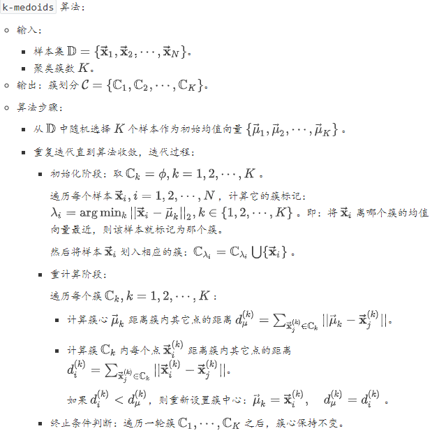
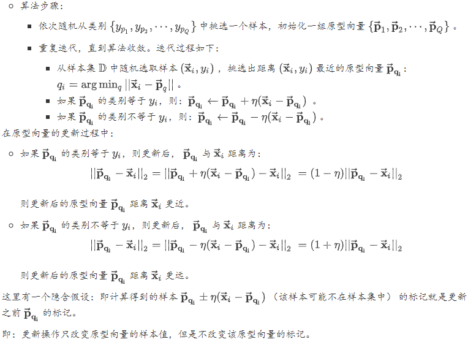
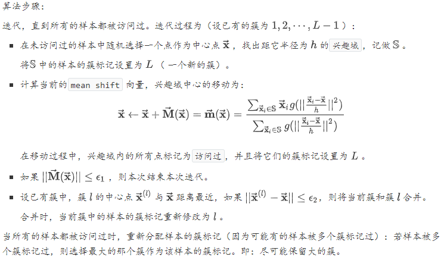

##### 性能度量

###### 外部指标

对于数据集$\mathbb{D}=\left\{\overrightarrow{\mathbf{x}}_{1}, \overrightarrow{\mathbf{x}}_{2}, \cdots, \overrightarrow{\mathbf{x}}_{N}\right\}$，假定通过聚类给出的簇划分为$\mathcal{C}=\left\{\mathbb{C}_{1}, \mathbb{C}_{2}, \cdots, \mathbb{C}_{K}\right\}$。参考模型给出的簇划分为$\mathcal{C}^{*}=\left\{\mathbb{C}_{1}^{*}, \mathbb{C}_{2}^{*}, \cdots, \mathbb{C}_{K^{\prime}}^{*}\right\}$，其中$K$和$K^{\prime}$不一定相等 。

令$\vec{\lambda}, \vec{\lambda}^{*}$分别表示$\mathcal{C}, \mathcal{C}^{*}$的簇标记向量。定义：
$$
\begin{array}{l}{a=|S S|, S S=\left\{\left(\vec{x}_{i}, \vec{x}_{j}\right) | \lambda_{i}=\lambda_{j}, \lambda_{i}^{*}=\lambda_{j}^{*}, i<j\right\}} \\ {b=|S D|, S D=\left\{\left(\vec{x}_{i}, \vec{x}_{j}\right) | \lambda_{i}=\lambda_{j}, \lambda_{i}^{*} \neq \lambda_{j}^{*}, i<j\right\}} \\ {c=|D S|, D S=\left\{\left(\vec{x}_{i}, \vec{x}_{j}\right) | \lambda_{i} \neq \lambda_{j}, \lambda_{i}^{*}=\lambda_{j}^{*}, i<j\right\}} \\ {d=|D D|, D D=\left\{\left(\vec{x}_{i}, \vec{x}_{j}\right) | \lambda_{i} \neq \lambda_{j}, \lambda_{i}^{*}=\lambda_{j}^{*}, i<j\right\}}\end{array}
$$
其中$|\cdot|$表示集合的元素的个数。各集合的意义为：$SS$：包含了同时隶属于$\mathcal{C}, \mathcal{C}^{*}$的样本对。$SD$：包含了隶属于  $\mathcal{C}$，但是不隶属于$\mathcal{C}^{*}$的样本对。$DS$：包含了不隶属于 $\mathcal{C}$， 但是隶属于$\mathcal{C}^{*}$的样本对。$DD$：包含了既不隶属于 $\mathcal{C}$， 又不隶属于$\mathcal{C}^{*}$的样本对。由于每个样本对$\left(\overrightarrow{\mathbf{x}}_{i}, \overrightarrow{\mathbf{x}}_{j}\right), i<j$仅能出现在一个集合中，因此有$a+b+c+d=\frac{N(N-1)}{2}$。

$\text{Jaccard}系数$: $J C=\frac{a}{a+b+c}$

$\text{FM}指数$: $F M I=\sqrt{\frac{a}{a+b} \cdot \frac{a}{a+c}}$

$\text{Rand}指数$: $R I=\frac{a+d}{N(N-1) / 2}$

$\text{ARI}指数$:$A R I=\frac{\sum_{i} \sum_{j} C_{n_{i, j}}^{2}-\left[\sum_{i} C_{s_{i}}^{2} \times \sum_{j} C_{i_{j}}^{2}\right] / C_{N}^{2}}{\frac{1}{2}\left[\sum_{i} C_{s_{i}}^{2}+\sum_{j} C_{t_{j}}^{2}\right]-\left[\sum_{i} C_{s_{i}}^{2} \times \sum_{j} C_{t_{j}}^{2}\right] / C_{N}^{2}}$

###### 内部指标

$\text{DB}指数$：$D I=\frac{\min _{k \neq l} d_{\min }\left(\mathbb{C}_{k}, \mathbb{C}_{l}\right)}{\max _{i} \operatorname{diam}\left(\mathbb{C}_{i}\right)}$

$\text{Dunn}指数$: $D I=\frac{\min _{k \neq l} d_{\min }\left(\mathbb{C}_{k}, \mathbb{C}_{l}\right)}{\max _{i} \operatorname{diam}\left(\mathbb{C}_{i}\right)}$

##### 原型聚类

##### `k-means`算法

对于数据集$\mathbb{D}=\left\{\vec{\mathbf{x}}_{1}, \cdots, \vec{\mathbf{x}}_{N}\right\}$，假定通过聚类给出的簇划分为$\mathcal{C}=\left\{\mathbb{C}_{1}, \mathbb{C}_{2}, \cdots, \mathbb{C}_{K}\right\}$。定义该划分的平方误差为：
$$
\text{err} = \sum_{k=1}^K\sum_{\vec{\mathbf{x}}_i\in\mathbb{C}_k}||\vec{\mathbf{x}}_i-\vec{\mu}_k||^2_2
$$
其中$\vec{\mu}_k=\frac{1}{|\mathbb{C}_k|}\sum_{\vec{\mathbf{x}}_i\in\mathbb{C}_k}\vec{\mathbf{x}}_i$是簇$\mathbb{C}_k$的均值向量。$\text{err}$刻画了簇类样本围绕簇均值向量的紧密程度，其值越小，则簇内样本相似度越高。`k-means` 算法的优化目标为：最小化$\text{err}$。即：
$$
\min_{\mathcal{C}}\sum_{k=1}^K\sum_{\vec{\mathbf{x}}_i\in\mathbb{C}_k}||\vec{\mathbf{x}}_i-\vec{\mu}_k||^2_2
$$
`k-means` 采用贪心策略，通过迭代优化来近似求解。首先假设一组均值向量。然后根据假设的均值向量给出了$\mathbb{D}$的一个划分。再根据这个划分来计算真实的均值向量：如果真实的均值向量等于假设的均值向量，则说明假设正确。根据假设均值向量给出的$\mathbb{D}$的一个划分确实是原问题的解。如果真实的均值向量不等于假设的均值向量，则可以将真实的均值向量作为新的假设均值向量，继续迭代求解。

给定一组假设的均值向量，如何计算出 的一个簇划分？`k`均值算法的策略是：样本离哪个簇的均值向量最近，则该样本就划归到那个簇。

`k-means` 优点：计算复杂度低。思想简单，容易实现。

`k-means` 缺点：需要首先确定聚类的数量$K$。分类结果严重依赖于分类中心的初始化。结果不一定是全局最优的，只能保证局部最优。对噪声敏感。因为簇的中心是取平均，因此聚类簇很远地方的噪音会导致簇的中心点偏移。无法解决不规则形状的聚类。无法处理离散特征

`k-means` 性质：

- `k-means` 实际上假设数据是呈现球形分布，实际任务中很少有这种情况。

  与之相比，`GMM` 使用更加一般的数据表示，即高斯分布。

- `k-means` 假设各个簇的先验概率相同，但是各个簇的数据量可能不均匀。

- `k-means` 使用欧式距离来衡量样本与各个簇的相似度。这种距离实际上假设数据的各个维度对于相似度的作用是相同的。

- `k-means` 中，各个样本点只属于与其相似度最高的那个簇，这实际上是`硬` 分簇。

- `k-means` 算法的迭代过程实际上等价于`EM` 算法。

###### $\text{k-means++}$

`k-means++` 属于 `k-means` 的变种，它主要解决`k-means` 严重依赖于分类中心初始化的问题。`k-means++` 选择初始均值向量时，尽量安排这些初始均值向量之间的距离尽可能的远。

从$\mathbb{D}$中随机选择1个样本作为初始均值向量组$\{\vec{\mu}_1,\}$。迭代，直到初始均值向量组有$K$个向量。假设初始均值向量组为$\{\vec{\mu}_1,\cdots,\vec{\mu}_m\}$。迭代过程如下：

- 对每个样本$\vec{\mathbf{x}}_i$，计算其距$\vec{\mu}_1,\cdots,\vec{\mu}_m$的距离。这些距离的最小值记做$d_i=\min_{\vec{\mu}_j}||\vec{\mathbf{x}}_i-\vec{\mu}_j||$。

- 对样本$\vec{\mathbf{x}}_i$，其设置为初始均值向量的概率正比于$d_i$。即：离所有的初始均值向量越远，则越可能被选中为下一个初始均值向量。以概率分布$P=\{d_1,\cdots,d_N\}$（未归一化的）随机挑选一个样本作为下一个初始均值向量 

###### `k-modes`

`k-modes` 属于 `k-means` 的变种，它主要解决`k-means` 无法处理离散特征的问题。`k-modes` 与`k-means` 有两个不同点（假设所有特征都是离散特征）：距离函数不同。在`k-modes` 算法中，距离函数为：
$$
\text{dis}(\vec{\mathbf{x}}_i,\vec{\mathbf{x}}_j)=\sum_{d=1}^nI(x_{i,d}=x_{j,d})
$$
簇中心的更新规则不同。在`k-modes` 算法中，簇中心每个属性的取值为：簇内该属性出现频率最大的那个值。
$$
\hat{u}_{k,d} = \arg\max_{v}=\sum_{\vec{\mathbf{x}}_i\in\mathbb{C}_k}I(x_{i,d}=v)
$$

###### `k-medoids`

`k-medoids` 属于 `k-means` 的变种，它主要解决`k-means` 对噪声敏感的问题。`k-medoids` 算法在计算新的簇心时，不再通过簇内样本的均值来实现，而是挑选簇内距离其它所有点都最近的样本来实现。这就减少了孤立噪声带来的影响。

###### 学习向量量化

与一般聚类算法不同，学习向量量化假设数据样本带有类别标记，学习过程需要利用样本的这些监督信息来辅助聚类。给定样本集$\mathbb{D}=\left\{\left(\vec{\mathbf{x}}_{1}, y_{1}\right), \cdots,\left(\vec{\mathbf{x}}_{N}, y_{N}\right)\right\}, \vec{\mathbf{x}} \in \mathcal{X}, y \in \mathcal{Y}$，`LVQ`的目标是从特征空间中挑选一组样本作为原型向量$\left\{\overrightarrow{\mathbf{p}}_{1}, \overrightarrow{\mathbf{p}}_{2}, \cdots, \overrightarrow{\mathbf{p}}_{Q}\right\}$。每个原型向量代表一个聚类簇。原型向量从特征空间中取得，它们不一定就是$\mathbb{D}$中的某个样本。

`LVQ`的想法是：通过从样本中挑选一组样本作为原型向量$\left\{\overrightarrow{\mathbf{p}}_{1}, \overrightarrow{\mathbf{p}}_{2}, \cdots, \overrightarrow{\mathbf{p}}_{Q}\right\}$，可以实现对样本空间$\mathcal{X}$的簇划分。对任意样本$\overrightarrow{\mathbf{x}}$，它被划入与距离最近的原型向量所代表的簇中。对于每个原型向量$\overrightarrow{\mathbf{p}}_{q}$，它定义了一个与之相关的一个区域$\mathbf{R}_q$，该区域中每个样本与$\overrightarrow{\mathbf{p}}_{q}$的距离都不大于它与其他原型向量$\overrightarrow{\mathbf{p}}_{q^{\prime}}$的距离。
$$
\mathbf{R}_{q}=\left\{\overrightarrow{\mathbf{x}} \in \mathcal{X} |\left\|\overrightarrow{\mathbf{x}}-\overrightarrow{\mathbf{p}}_{q}\right\|_{2} \leq \min _{q^{\prime} \neq q}\left\|\overrightarrow{\mathbf{x}}-\overrightarrow{\mathbf{p}}_{q^{\prime}}\right\|_{2}\right\}
$$
区域$\left\{\overrightarrow{\mathbf{p}}_{1}, \overrightarrow{\mathbf{p}}_{2}, \cdots, \overrightarrow{\mathbf{p}}_{Q}\right\}$对样本空间$\mathcal{X}$形成了一个簇划分，该划分通常称作 `Voronoi`剖分。

##### `DBSCAN`

密度聚类`density-based clustering`假设聚类结构能够通过样本分布的紧密程度确定。密度聚类算法从样本的密度的角度来考察样本之间的可连接性，并基于可连接样本的不断扩张聚类簇，从而获得最终的聚类结果。

`DBSCAN`是一种著名的密度聚类算法，它基于一组邻域参数$(\epsilon, \text{MinPts})$来刻画样本分布的紧密程度。给定数据集$\mathbb{D}=\left\{\vec{\mathbf{x}}_{1},  \cdots, \vec{\mathbf{x}}_{N}\right\}$， 定义：$\epsilon$-邻域：$N_{\epsilon}\left(\vec{\mathbf{x}}_{i}\right)=\left\{\vec{\mathbf{x}}_{j} \in \mathbb{D} | \text { distance }\left(\vec{\mathbf{x}}_{i}, \vec{\mathbf{x}}_{j}\right) \leq \epsilon\right\}$。

核心对象：若$\left|N_{\epsilon}\left(\vec{\mathbf{x}}_{i}\right)\right| \geq \text{MinPts}$，则称$\vec{\mathbf{x}}_{i}$是一个核心对象。

密度直达：若$\overrightarrow{\mathbf{x}}_{i}$是一个核心对象，且$\overrightarrow{\mathbf{x}}_{j} \in N_{\epsilon}\left(\overrightarrow{\mathbf{x}}_{i}\right)$， 则称$\overrightarrow{\mathbf{x}}_{j}$由$\overrightarrow{\mathbf{x}}_{i}$密度直达，记作$\overrightarrow{\mathbf{x}}_{i} \mapsto \overrightarrow{\mathbf{x}}_{j}$。

密度可达：对于$\overrightarrow{\mathbf{x}}_{i}$和$\overrightarrow{\mathbf{x}}_{j}$， 若存在样本序列$\left(\overrightarrow{\mathbf{p}}_{0}, \overrightarrow{\mathbf{p}}_{1}, \overrightarrow{\mathbf{p}}_{2}, \cdots, \overrightarrow{\mathbf{p}}_{m}, \overrightarrow{\mathbf{p}}_{m+1}\right)$， 其中$\overrightarrow{\mathbf{p}}_{0}=\overrightarrow{\mathbf{x}}_{i}, \overrightarrow{\mathbf{p}}_{m+1}=\overrightarrow{\mathbf{x}}_{j}, \overrightarrow{\mathbf{p}}_{s} \in \mathbb{D}$，如果$\overrightarrow{\mathbf{p}}_{s+1}$由$\overrightarrow{\mathbf{p}}_{s}$密度直达，则称$\overrightarrow{\mathbf{x}}_{j}$由$\overrightarrow{\mathbf{x}}_{i}$密度可达，记作$\overrightarrow{\mathbf{x}}_{i} \leadsto \overrightarrow{\mathbf{x}}_{j}$。

密度相连：对于$\overrightarrow{\mathbf{x}}_{i}$和$\overrightarrow{\mathbf{x}}_{j}$，若存在$\overrightarrow{\mathbf{x}}_{k}$，使得$\overrightarrow{\mathbf{x}}_{i}$与$\overrightarrow{\mathbf{x}}_{j}$均由$\overrightarrow{\mathbf{x}}_{k}$密度可达，则称$\overrightarrow{\mathbf{x}}_{i}$与$\overrightarrow{\mathbf{x}}_{i}$密度相连 ，记作$\overrightarrow{\mathbf{x}}_{i} \sim \overrightarrow{\mathbf{x}}_{j}$。

`DBSCAN`算法的簇定义：给定邻域参数$(\epsilon, \text{MinPts})$， 一个簇$\mathbb{C} \subseteq \mathbb{D}$是满足下列性质的非空样本子集：连接性： 若$\overrightarrow{\mathbf{x}}_{i} \in \mathbb{C}, \overrightarrow{\mathbf{x}}_{j} \in \mathbb{C}$，则$\overrightarrow{\mathbf{x}}_{i} \sim \overrightarrow{\mathbf{x}}_{j}$。最大性：若$\overrightarrow{\mathbf{x}}_{i} \in \mathbb{C}$，且$\overrightarrow{\mathbf{x}}_{i} \leadsto \overrightarrow{\mathbf{x}}_{j}$， 则$\overrightarrow{\mathbf{x}}_{j} \in \mathbb{C}$。

`DBSCAN`算法的思想：若$\vec{\mathbf{x}}$为核心对象，则$\vec{\mathbf{x}}$密度可达的所有样本组成的集合记作$\mathbb{X}=\left\{\overrightarrow{\mathbf{x}}^{\prime} \in \mathbb{D} | \overrightarrow{\mathbf{x}} \leadsto \overrightarrow{\mathbf{x}}^{\prime}\right\}$。可以证明 ：$\mathbb{X}$就是满足连接性与最大性的簇。于是 `DBSCAN`算法首先任选数据集中的一个核心对象作为种子`seed`，再由此出发确定相应的聚类簇。

##### `Mean-Shift`算法

给定$n$维空间的$N$个样本组成的数据集$\mathbb{D}=\{\vec{\mathbf{x}}_1,\cdots,\vec{\mathbf{x}}_N\}$，给定一个中心为$\vec{\mathbf{x}}$、半径为$h$的球形区域$\mathbb{S}$，定义其`mean shift` 向量为：
$$
\vec{\mathbf{M}}(\vec{\mathbf{x}})=\frac{1}{|\mathbb{S}|}\sum_{\vec{\mathbf{x}}_i\in\mathbb{S}}(\vec{\mathbf{x}}_i-\vec{\mathbf{x}})
$$

##### 层次聚类

层次聚类试图在不同层次上对数据集进行划分，从而形成树形的聚类结构。

###### $\text{BIRCH}$算法

聚类特征`CF`：每个`CF` 都是刻画一个簇的特征的三元组：$C F=\left(\mathrm{num}, \vec{\Sigma}_{l}, \Sigma_{s}\right)$。其中：$\text{num}$：表示簇内样本数量的数量。$\vec{\Sigma}_{l}$：表示簇内样本的线性求和：$\vec{\Sigma}_{l}=\sum_{\vec{x}_{i} \in \mathbb{S}} \overrightarrow{\mathbf{x}}_{i}$。$\Sigma_{s}$：表示簇内样本的长度的平方和。$\Sigma_{s}=\sum_{\vec{x}_{i} \in \mathbb{S}}\left\|\vec{x}_{i}\right\|^{2}=\sum_{\vec{x}_{i} \in \mathbb{S}} \overrightarrow{\mathbf{x}}_{i}^{T} \overrightarrow{\mathbf{x}}_{i}$。根据`CF` 的定义可知：如果`CF1` 和 `CF2` 分别表示两个不相交的簇的特征，如果将这两个簇合并成一个大簇，则大簇的特征为：$C F_{m e r g e}=C F_{1}+C F_{2}$。

`CF`树的结构类似于平衡`B+`树 。树由三种结点构成：根结点、中间结点、叶结点。根结点、中间结点：由若干个聚类特征`CF` ，以及这些`CF` 指向子结点的指针组成。叶结点：由若干个聚类特征`CF` 组成。叶结点没有子结点，因此`CF` 没有指向子结点的指针。所有的叶结点通过双向链表连接起来。在`BIRCH` 算法结束时，叶结点的每个`CF` 对应的样本集就对应了一个簇。`CF` 树有三个关键参数：枝平衡因子$\beta$：非叶结点中，最多不能包含超过$\beta$个 `CF` 。叶平衡因子$\lambda$：叶结点中，最多不能包含超过$\lambda$个 `CF` 。空间阈值$\tau$：叶结点中，每个`CF` 对应的子簇的大小不能超过$\tau$。由于`CF` 的可加性，所以`CF` 树中，每个父结点的`CF` 等于它所有子结点的所有`CF` 之和。

##### 谱聚类

谱聚类的主要思想是：基于数据集$\mathbb{D}=\left\{\overrightarrow{\mathbf{x}}_{1}, \cdots, \overrightarrow{\mathbf{x}}_{N}\right\}$来构建图$\mathcal{G}=(\mathbb{V}, \mathbb{E})$，其中：顶点$\mathbb{V}$：由数据集中的数据点组成：$\mathbb{V}=\{1,2, \cdots, N\}$。边$\mathbb{E}$：任意一对顶点之间存在边。距离越近的一对顶点，边的权重越高；距离越远的一对顶点，边的权重越低。通过对图$\mathcal{G}$进行切割，使得切割之后：不同子图之间的边的权重尽可能的低、各子图内的边的权重尽可能的高。这样就完成了聚类。

在图$\mathcal{G}=(\mathbb{W}, \mathbb{E})$中，定义权重$\omega_{i,j}$为顶点$i$和$j$之间的权重，其中$i, j \in \mathbb{V}$。定义$\mathbf{W}=\left(w_{i, j}\right)_{N \times N}$为邻接矩阵由于$\mathcal{G}$为无向图，因此$w_{i, j}=w_{j, i}$。即：$\mathbf{W}=\mathbf{W}^{T}$。对图中顶点$i$，定义它的度$d_i$为：所有与顶点$i$相连的边的权重之和：$d_{i}=\sum_{j=1}^{N} w_{i, j}$。定义度矩阵$\mathbf{D}$为一个对角矩阵，其中对角线分别为各顶点的度。对于顶点集合$\mathbb{V}$的一个子集$\mathbb{A}\subset \mathbb{V}$，定义$|\mathbb{A}|$为子集$\mathbb{A}$中点的个数；定义$\operatorname{vol}(\mathbb{A})=\sum_{i \in \mathbb{A}} d_{i}$，为子集$\mathbb{A}$中所有点的度之和。事实上在谱聚类中，通常只给定数据集$\mathbb{D}=\left\{\overrightarrow{\mathbf{x}}_{1}, \cdots, \overrightarrow{\mathbf{x}}_{N}\right\}$，因此需要计算出邻接矩阵$\mathbf{W}$。基本思想是：距离较近的一对点，边的权重较高；距离较远的一对点，边的权重较低。基本方法是：首先构建相似度矩阵$\mathbf{S}=\left(s_{i, j}\right)_{N \times N}$，然后使用$\epsilon$-近邻法、$K$近邻法、或者全连接法。

$\epsilon$-近邻法：设置一个距离阈值$\epsilon$，定义邻接矩阵$\mathbf{W}$为：
$$
w_{i, j}=\left\{\begin{array}{ll}{0,} & {s_{i, j}>\varepsilon} \\ {\varepsilon,} & {s_{i, j} \leq \varepsilon}\end{array}\right.
$$
$K$近邻法：利用 `KNN` 算法选择每个样本最近的$K$个点作为近邻，其它点与当前点之间的边的权重为 0 。这种做法会导致邻接矩阵$\mathbf{W}$非对称，因为当$\overrightarrow{\mathbf{x}}_{j}$是$\overrightarrow{\mathbf{x}}_{i}$的$K$近邻时， $\overrightarrow{\mathbf{x}}_{i}$不一定是$\overrightarrow{\mathbf{x}}_{j}$的$K$近邻。为了解决对称性问题，有两种做法：只要一个点在另一个点的  近邻中，则认为是近邻。即：取并集。
$$
w_{i, j}=w_{j, i}=\left\{\begin{array}{ll}{0,} & {\overrightarrow{\mathbf{x}}_{i} \notin K N N\left(\overrightarrow{\mathbf{x}}_{j}\right) \text { and } \overrightarrow{\mathbf{x}}_{j} \notin K N N\left(\overrightarrow{\mathbf{x}}_{i}\right)} \\ {s_{i, j},} & {\overrightarrow{\mathbf{x}}_{i} \in K N N\left(\overrightarrow{\mathbf{x}}_{j}\right) \text { or } \overrightarrow{\mathbf{x}}_{j} \in K N N\left(\overrightarrow{\mathbf{x}}_{i}\right)}\end{array}\right.
$$
只有两个点互为对方的  近邻中，则认为是近邻。即：取交集。
$$
w_{i, j}=w_{j, i}=\left\{\begin{array}{ll}{0,} & {\overrightarrow{\mathbf{x}}_{i} \notin K N N\left(\overrightarrow{\mathbf{x}}_{j}\right) \text { or } \overrightarrow{\mathbf{x}}_{j} \notin K N N\left(\overrightarrow{\mathbf{x}}_{i}\right)} \\ {s_{i, j},} & {\overrightarrow{\mathbf{x}}_{i} \in K N N\left(\overrightarrow{\mathbf{x}}_{j}\right) \text { and } \overrightarrow{\mathbf{x}}_{j} \in K N N\left(\overrightarrow{\mathbf{x}}_{i}\right)}\end{array}\right.
$$
全连接法：所有点之间的权重都大于 0 ：$w_{i, j}=s_{i, j}$。

定义拉普拉斯矩阵$\mathbf{L}=\mathbf{D}-\mathbf{W}$，其中$\mathbf{D}$为度矩阵、$\mathbf{W}$为邻接矩阵。拉普拉斯矩阵$\mathbf{L}$的性质：$\mathbf{L}$是对称矩阵。因为$\mathbf{L}$是实对称矩阵，因此它的特征值都是实数。对任意向量$\overrightarrow{\mathbf{f}}=\left(f_{1}, f_{2}, \cdots, f_{N}\right)^{T}$，有：$\overrightarrow{\mathbf{f}}^{T} \mathbf{L} \overrightarrow{\mathbf{f}}=\frac{1}{2} \sum_{i=1}^{N} \sum_{j=1}^{N} w_{i, j}\left(f_{i}-f_{j}\right)^{2}$。$\mathbf{L}$是半正定的，且对应的$N$个特征值都大于等于0，且最小的特征值为 0。

给定无向图$\mathcal{G}=(\mathbb{V}, \mathbb{E})$，设子图的点的集合$\mathbb{A}$和子图的点的集合$\mathbb{B}$都是$\mathbb{V}$的子集，且$\mathbb{A} \cap \mathbb{B}=\phi$。定义$\mathbb{A}$和$\mathbb{B}$之间的切图权重为：$W(\mathbb{A}, \mathbb{B})=\sum_{i \in \mathbb{A}, j \in \mathbb{B}} w_{i, j}$。对于无向图$\mathcal{G}=(\mathbb{V}, \mathbb{E})$，假设将它切分为$k$个子图：每个子图的点的集合为$\mathbb{A}_{1}, \cdots, \mathbb{A}_{k}$，满足$\mathbb{A}_{i} \cap \mathbb{A}_{j}=\phi, i \neq j$且$\mathbb{A}_{1} \cup \cdots \cup \mathbb{A}_{k}=\mathbb{V}$。定义切图`cut` 为：$\operatorname{cut}\left(\mathbb{A}_{1}, \cdots, \mathbb{A}_{k}\right)=\sum_{i=1}^{k} W\left(\mathbb{A}_{i}, \overline{\mathbb{A}}_{i}\right)$，其中$\overline{\mathbb{A}}$为$\mathbb{A}$的补集。

###### 最小切图

引入指示向量$\overrightarrow{\mathbf{q}}_{j}=\left(q_{j, 1}, \cdots, q_{j, N}\right)^{T}, j=1,2, \cdots, k$，定义：$q_{j, i}=\left\{\begin{array}{ll}{0,} & {i \notin \mathbb{A}_{j}} \\ {1,} & {i \in \mathbb{A}_{j}}\end{array}\right.$

因此$\operatorname{cut}\left(\mathbb{A}_{1}, \cdots, \mathbb{A}_{k}\right)=\sum_{j=1}^{k} \overrightarrow{\mathbf{q}}_{j}^{T} \mathbf{L} \overrightarrow{\mathbf{q}}_{j}=\operatorname{tr}\left(\mathbf{Q}^{T} \mathbf{L} \mathbf{Q}\right)$。其中$\mathbf{Q}=\left(\overrightarrow{\mathbf{q}}_{1}, \cdots, \overrightarrow{\mathbf{q}}_{k}\right)$，$tr(\cdot)$为矩阵的迹。考虑到顶点$i$有且仅位于一个子图中，则有约束条件：
$$
q_{j, m} \in\{0,1\}, \quad \overrightarrow{\mathbf{q}}_{i} \cdot \overrightarrow{\mathbf{q}}_{j}=\left\{\begin{array}{ll}{0,} & {i \neq j} \\ {|\hat{A}|_{j},} & {i=j}\end{array}\right.
$$
最小切图算法：$\operatorname{cut}\left(\mathbb{A}_{1}, \cdots, \mathbb{A}_{k}\right)$最小的切分。即求解：
$$
\begin{array}{c}{\min _{\mathbf{Q}} \operatorname{tr}\left(\mathbf{Q}^{T} \mathbf{L} \mathbf{Q}\right)} \\ {\text {s.t. } q_{j, m} \in\{0,1\}, \quad \overrightarrow{\mathbf{q}}_{i} \cdot \overrightarrow{\mathbf{q}}_{j}=\left\{\begin{array}{ll}{0,} & {i \neq j} \\ {|\hat{A}|_{j},} & {i=j}\end{array}\right.}\end{array}
$$

###### $\text{RatioCut}$算法

`RatioCut` 切图不仅考虑最小化$\operatorname{cut}\left(A_{1}, \cdots, \mathbb{A}_{k}\right)$，它还考虑最大化每个子图的点的个数。即：$\operatorname{Ratio} \operatorname{Cut}\left(\mathbb{A}_{1}, \cdots, \mathbb{A}_{k}\right)=\sum_{i=1}^{k} \frac{W\left(\mathbb{A}_{i}, \overline{A}_{i}\right)}{\left|\mathbb{A}_{i}\right|}$。

引入指示向量$\overrightarrow{\mathbf{h}}_{j}=\left(h_{j, 1}, \cdots, h_{j, N}\right)^{T}, j=1,2, \cdots, k$，定义$h_{j, i}=\left\{\begin{array}{ll}{0,} & {i \notin \mathbb{A}_{j}} \\ {\frac{1}{\sqrt{\left|\hat{A}_{j}\right|}},} & {i \in \mathbb{A}_{j}}\end{array}\right.$。因此$\text{RatioCut}\left(\mathbb{A}_{1}, \cdots, \mathbb{A}_{k}\right)=\sum_{j=1}^{k} \overrightarrow{\mathbf{h}}_{j}^{T} \mathbf{L} \overrightarrow{\mathbf{h}}_{j}=\operatorname{tr}\left(\mathbf{H}^{T} \mathbf{L H}\right)$。其中$\mathbf{H}=\left(\overrightarrow{\mathbf{h}}_{1}, \cdots, \overrightarrow{\mathbf{h}}_{k}\right), t r(\cdot)$为矩阵的迹。考虑到顶点$I$有且仅位于一个子图中，则有约束条件：
$$
\overrightarrow{\mathbf{h}}_{i} \cdot \overrightarrow{\mathbf{h}}_{j}=\left\{\begin{array}{ll}{0,} & {i \neq j} \\ {1,} & {i=j}\end{array}\right.
$$
`RatioCut`算法：$\text{RatioCut} \left(\mathbb{A}_{1}, \cdots, \mathbb{A}_{k}\right)$最小的切分。即求解：
$$
\begin{array}{l}{\min _{\mathbf{H}} \operatorname{tr}\left(\mathbf{H}^{T} \mathbf{L H}\right)} \\ {\text {s.t.}\mathbf{H}^{T} \mathbf{H}=\mathbf{I}}\end{array}
$$

###### $\text{Ncut}$算法

`Ncut` 切图不仅考虑最小化 ，它还考虑最大化每个子图的边的权重。即：
$$
\text{Ncut}\left(\mathbb{A}_{1}, \cdots, \mathbb{A}_{k}\right)=\sum_{i=1}^{k} \frac{W\left(\mathbb{A}_{i}, \overline{A}_{i}\right)}{\operatorname{vol}\left(\mathbb{A}_{i}\right)}
$$
引入指示向量$\overrightarrow{\mathbf{h}}_{j}=\left(h_{j, 1}, \cdots, h_{j, N}\right)^{T}, j=1,2, \cdots, k$，定义：$h_{j, i}=\left\{\begin{array}{ll}{0,} & {i \notin \mathbb{A}_{j}} \\ {\frac{1}{\sqrt{v o l\left(k_{j}\right)}},} & {i \in \mathbb{A}_{j}}\end{array}\right.$。考虑到顶点$i$有且仅位于一个子图中，则有约束条件：
$$
\overrightarrow{\mathbf{h}}_{i} \cdot \overrightarrow{\mathbf{h}}_{j}=\left\{\begin{array}{ll}{0,} & {i \neq j} \\ {\frac{1}{v o l\left(A_{j}\right)},} & {i=j}\end{array}\right.
$$
`Ncut`算法：$\text{Ncut}\left(\mathbb{A}_{1}, \cdots, \mathbb{A}_{k}\right)$最小的切分。即求解
$$
\begin{array}{c}{\min _{\mathbf{H}} \operatorname{tr}\left(\mathbf{H}^{T} \mathbf{L} \mathbf{H}\right)} \\ {\text { s.t. } \mathbf{H}^{T} \mathbf{D} \mathbf{H}=\mathbf{I}}\end{array}
$$

