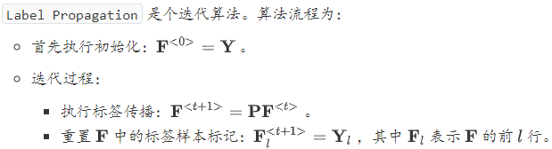
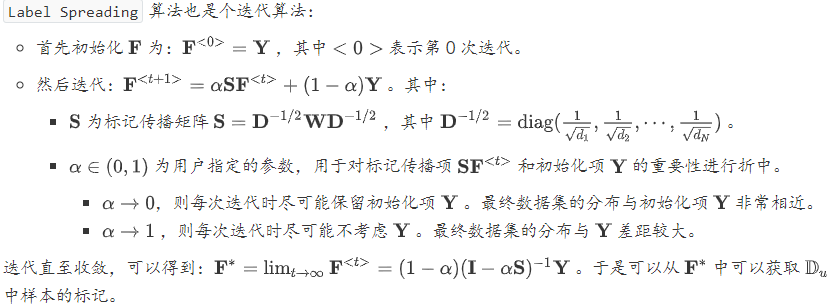
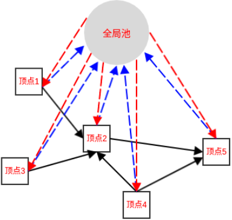
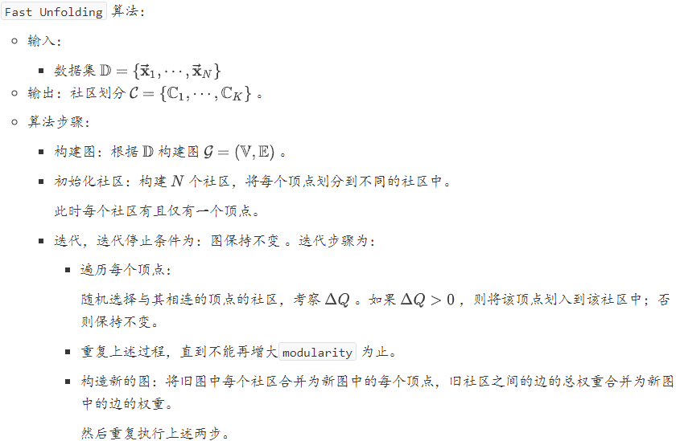

#### 半监督学习

给定有标记样本集合$\mathbb{D}_{l}=\left\{\left(\overrightarrow{\mathbf{x}}_{1}, y_{1}\right),\left(\overrightarrow{\mathbf{x}}_{2}, y_{2}\right), \cdots,\left(\overrightarrow{\mathbf{x}}_{l}, y_{l}\right)\right\}$，和未标记样本集合$\mathbb{D}_{u}=\left\{\left(\overrightarrow{\mathbf{x}}_{l+1}, y_{l+1}\right),\left(\overrightarrow{\mathbf{x}}_{l+2}, y_{l+2}\right), \cdots,\left(\overrightarrow{\mathbf{x}}_{l+u}, y_{l+u}\right)\right\}$，其中$l \ll u$。学习器自动地利用未标记的$\mathbb{D}_{u}$来提升学习性能，这就是半监督学习。

要利用未标记样本，必然需要对未标记样本的分布与已标记样本的分布的关联做出假设。最常见的假设是聚类假设`cluster assumption`：假设数据存在簇结构，同一个簇的样本属于同一个类别。另一种常见假设是流形假设`manifold assumption`：假设数据分布在一个流形结构上，邻近的样本拥有相似的输出值。其中，邻近的程度用相似度来刻画。

半监督学习可以划分为：纯半监督学习和直推学习 。纯半监督学习：假定训练数据中的未标记样本集$\mathbb{D}_{u}$并非待预测的数据。直推学习：假定学习过程中考虑的未标记样本集$\mathbb{D}_{u}$就是待预测的数据，学习的目标就是在$\mathbb{D}_{u}$上获取最优泛化性能。

##### 图半监督学习

###### 标签传播算法

给定一个数据集，可以将其映射为一个图，数据集中每个样本对应于图中的一个结点。若两个样本之间的相似度很高或者相关性很强，则对应的结点之间存在一条边，边的强度正比于样本之间的相似度或相关性。将有标记样本所对应的结点视作为已经染色，而未标记样本所对应的结点尚未染色。于是半监督学习就对应于“颜色”在图上扩散或者传播的过程。这就是标记传播算法

给定标记样本集$\mathbb{D}_{l}=\left\{\left(\overrightarrow{\mathbf{x}}_{1}, y_{1}\right),\left(\overrightarrow{\mathbf{x}}_{2}, y_{2}\right), \cdots,\left(\overrightarrow{\mathbf{x}}_{l}, y_{i}\right)\right\}, y_{i} \in\{-1,+1\}$，和未标记样本集$\mathbb{D}_{u}=\left\{\overrightarrow{\mathbf{x}}_{l+1}, \overrightarrow{\mathbf{x}}_{l+2}, \cdots, \overrightarrow{\mathbf{x}}_{l+u}\right\}$，其中$l \ll u, \quad l+u=N$。基于$\mathbb{D}_{l} \cup \mathbb{D}_{u}$构建一个图$\mathcal{G}=(\mathbb{V}, \mathbb{E})$。其中：结点集$\mathbb{V}=\left\{\overrightarrow{\mathbf{x}}_{1}, \overrightarrow{\mathbf{x}}_{2}, \cdots, \overrightarrow{\mathbf{x}}_{l}, \overrightarrow{\mathbf{x}}_{l+1}, \overrightarrow{\mathbf{x}}_{l+2}, \cdots, \overrightarrow{\mathbf{x}}_{l+u}\right\}$。边集$\mathbb{E}$的权重可以表示为一个亲和矩阵$\mathbf{W}=\left(w_{i, j}\right)_{N \times N}$，一般基于高斯函数，其定义为：
$$
w_{i, j}=\left\{\begin{array}{ll}{\exp \left(-\frac{\left\|\vec{x}_{i}-\vec{x}_{j}\right\|_{2}^{2}}{2 \sigma^{2}}\right),} & {i \neq j} \\ {0,} & {i=j}\end{array}, \quad i, j \in\{1,2, \cdots, N\}\right.
$$
其中$\sigma>0$是用户指定的高斯函数带宽参数。

可以看到：$\omega_{i,j}=\omega_{j,i}$，因此$\mathbf{W}$为对称矩阵。图$\mathcal{G}$是全连接的，任意两点之间都存在边。两个点的距离越近，说明两个样本越相似，则边的权重越大；距离越远，说明两个样本越不相似，则边的权重越小。权重越大说明样本越相似，则标签越容易传播。

###### 能量函数

假定从图$\mathcal{G}=(\mathbb{V}, \mathbb{E})$学得一个实值函数$f : \mathbb{V} \rightarrow \mathbb{R}$， 其对应的分类规则为：$y_{i}=\operatorname{sign}\left(f\left(\overrightarrow{\mathbf{x}}_{i}\right)\right), y_{i} \in\{-1,+1\}$。直观上看，相似的样本应该具有相似的标记，于是可以定义关于$f$的能量函数：
$$
\begin{array}{c}{E(f)=\frac{1}{2} \sum_{i=1}^{N} \sum_{j=1}^{N} w_{i, j}\left(f\left(\overrightarrow{\mathbf{x}}_{i}\right)-f\left(\overrightarrow{\mathbf{x}}_{j}\right)\right)^{2}} \\ {=\frac{1}{2} \sum_{i=1}^{N} \sum_{j=1}^{N}\left[w_{i, j} f\left(\overrightarrow{\mathbf{x}}_{i}\right)^{2}+w_{i, j} f\left(\overrightarrow{\mathbf{x}}_{j}\right)^{2}-2 w_{i, j} f\left(\overrightarrow{\mathbf{x}}_{i}\right) f\left(\overrightarrow{\mathbf{x}}_{j}\right)\right]} \\ {=\frac{1}{2}\left[\sum_{i=1}^{N}\left(f\left(\overrightarrow{\mathbf{x}}_{i}\right)^{2} \sum_{j=1}^{N} w_{i, j}\right)+\sum_{j=1}^{N}\left(f\left(\overrightarrow{\mathbf{x}}_{j}\right)^{2} \sum_{i=1}^{N} w_{i, j}\right)-2 \sum_{i=1}^{N} \sum_{j=1}^{N} w_{i, j} f\left(\vec{x}_{i}\right) f(\overrightarrow{\mathbf{x}}_{j})\right]}\end{array}
$$
定义对角矩阵$\mathbf{D}=\operatorname{diag}\left(d_{1}, d_{2}, \cdots, d_{N}\right)$，其中$d_{i}=\sum_{j=1}^{N} w_{i, j}$为矩阵$\mathbf{W}$的第$i$行元素之和。

定义$\overrightarrow{\mathbf{f}}=\left(f\left(\overrightarrow{\mathbf{x}}_{1}\right), \cdots, f\left(\overrightarrow{\mathbf{x}}_{l}\right), f\left(\overrightarrow{\mathbf{x}}_{l+1}\right), \cdots, f\left(\overrightarrow{\mathbf{x}}_{N}\right)\right)^{T}$为函数$f$在所有样本上的预测结果。 其中：$\overrightarrow{\mathbf{f}}_{l}=\left(f\left(\overrightarrow{\mathbf{x}}_{1}\right), f\left(\overrightarrow{\mathbf{x}}_{2}\right), \cdots, f\left(\overrightarrow{\mathbf{x}}_{l}\right)\right)^{T}$为函数$f$在有标记样本上的预测结果。$\overrightarrow{\mathbf{f}}_{u}=\left(f\left(\overrightarrow{\mathbf{x}}_{l+1}\right), f\left(\overrightarrow{\mathbf{x}}_{l+2}\right), \cdots, f\left(\overrightarrow{\mathbf{x}}_{l+u}\right)\right)^{T}$为函数$F$在未标记样本上的预测结果。结合$\mathbf{D}$的定义以及$\mathbf{W}$的对称性，有：
$$
\begin{aligned} E(f) &=\frac{1}{2}\left[\sum_{i=1}^{N} f\left(\overrightarrow{\mathbf{x}}_{i}\right)^{2} d_{i}+\sum_{j=1}^{N} f\left(\overrightarrow{\mathbf{x}}_{j}\right)^{2} d_{j}-2 \sum_{i=1}^{N} \sum_{j=1}^{N} w_{i, j} f\left(\overrightarrow{\mathbf{x}}_{i}\right) f\left(\overrightarrow{\mathbf{x}}_{j}\right)\right.\\ &=\sum_{i=1}^{N} f\left(\overrightarrow{\mathbf{x}}_{i}\right)^{2} d_{i}-\sum_{i=1}^{N} \sum_{j=1}^{N} w_{i, j} f\left(\overrightarrow{\mathbf{x}}_{i}\right) f\left(\overrightarrow{\mathbf{x}}_{j}\right)=\overrightarrow{\mathbf{f}}^{T}(\mathbf{D}-\mathbf{W}) \overrightarrow{\mathbf{f}} \end{aligned}
$$
标签传播算法假定在满足约束条件的条件下，能量函数$E(f)$最低。其中约束条件为：标记约束：函数$f$在标记样本上满足$f\left(\overrightarrow{\mathbf{x}}_{i}\right)=y_{i}, i=1,2, \cdots, l$。能量守恒：定义拉普拉斯矩阵$\mathbf{L}=\mathbf{D}-\mathbf{W}$，则有：$\mathbf{L}\left(0, \cdots, 0, f\left(\overrightarrow{\mathbf{x}}_{l+1}\right), \cdots, f\left(\overrightarrow{\mathbf{x}}_{N}\right)\right)^{T}=\overrightarrow{\mathbf{0}}$。因此标签传播算法就是求解约束最优化问题：
$$
\begin{array}{c}{\min _{f} E(f)} \\ {\text {s.t. } \quad f\left(\overrightarrow{\mathbf{x}}_{i}\right)=y_{i}, i=1,2, \cdots, l} \\ {(\mathbf{D}-\mathbf{W})\left(0, \cdots, 0, f\left(\overrightarrow{\mathbf{x}}_{l+1}\right), \cdots, f\left(\overrightarrow{\mathbf{x}}_{N}\right)\right)^{T}=\overrightarrow{\mathbf{0}}}\end{array}
$$

###### 多类标签传播算法

给定标记样本集$\mathbb{D}_{l}=\left\{\left(\overrightarrow{\mathbf{x}}_{1}, y_{1}\right),\left(\overrightarrow{\mathbf{x}}_{2}, y_{2}\right), \cdots,\left(\overrightarrow{\mathbf{x}}_{l}, y_{l}\right)\right\}, y_{i} \in\{1,2, \cdots, K\}$，和未标记样本集$\mathbb{D}_{u}=\left\{\overrightarrow{\mathbf{x}}_{l+1}, \overrightarrow{\mathbf{x}}_{l+2}, \cdots, \overrightarrow{\mathbf{x}}_{l+u}\right\}$，其中$l \ll u, \quad l+u=N$。与二类标签传播算法一样，首先基于$\mathbb{D}_{l} \cup \mathbb{D}_{u}$构建一个图$\mathcal{G}=(\mathbb{V}, \mathbb{E})$，然后定义边的权重矩阵$\mathbf{W}$和度矩阵$\mathbf{D}$。令$\overrightarrow{\mathbf{x}}_{i}$的标记向量为$\overrightarrow{\mathbf{F}}_{i}=\left(F_{i, 1}, F_{i, 2}, \cdots, F_{i, K}\right)^{T}$， 其中$F_{i, k}$表示$\overrightarrow{\mathbf{x}}_{i}$属于类别$k$的概率。根据概率的定义有：$\sum_{k=1}^{K} F_{i, k}=1, \quad F_{i, k} \geq 0$。对于标记样本$\overrightarrow{\mathbf{x}}_{i}, \quad\left(F_{i, 1}, F_{i, 2}, \cdots, F_{i, K}\right)$中只有一个值为1 ，其他值为 0。设$\overrightarrow{\mathbf{x}}_{i}$的标记为$\tilde{K}$，即有：
$$
F_{i, k}=\left\{\begin{array}{ll}{1,} & {k=\tilde{K}} \\ {0,} & {k !=\tilde{K}}\end{array}\right.
$$
对于未标记样本$\overrightarrow{\mathbf{x}}_{i}, \quad\left(F_{i, 1}, F_{i, 2}, \cdots, F_{i, K}\right)$表示一个概率分布，依次是该样本属于各个类别的概率。

当给定$\overrightarrow{\mathbf{x}}_{i}$的标记向量$\overrightarrow{\mathbf{F}}_{i}$时，样本的分类规则为：$\hat{y}_{i}=\arg \max _{1 \leq j \leq K} F_{i, j}$。定义非负的标记矩阵为： $\mathbf{F}=\left(\overrightarrow{\mathbf{F}}_{1}, \overrightarrow{\mathbf{F}}_{2}, \cdots, \overrightarrow{\mathbf{F}}_{N}\right)^{T} \in \mathbb{R}^{N \times K}$。定义非负的常量矩阵$\mathbf{Y}=\left(Y_{i, j}\right)_{N \times K}$为：
$$
Y_{i, j}=\left\{\begin{array}{ll}{1,} & {\text { if } 1 \leq i \leq l \text { and } y_{i}=j} \\ {0,} & {\text { otherwise }}\end{array}\right.
$$

###### $\text{Label Propagation}$

`Label Propagation` 算法通过节点之间的边来传播标记，边的权重越大则表示两个节点越相似，则标记越容易传播。定义概率转移矩阵$\mathbf{P}=\left(p_{i, j}\right)_{N \times N}$，其中：$p_{i, j}=\frac{w_{i, j}}{d_{i}}=\frac{w_{i, j}}{\sum_{j=1}^{N} w_{i, j}}$。定义标记矩阵$\mathbf{Y}_{l}=\left(Y_{i, j}^{l}\right)_{l \times K}$，其中：
$$
Y_{i, j}=\left\{\begin{array}{ll}{1,} & {\text { if } \quad y_{i}=j} \\ {0,} & {\text { otherwise }}\end{array}\right.
$$
定义未标记矩阵$\mathbf{Y}_{u}=\left(Y_{i, j}^{u}\right)_{u \times K}$，矩阵的第$i$行为样本$\overrightarrow{\mathbf{x}}_{l+u}$属于各标签的概率。合并$\mathbf{Y}_{l}$和$\mathbf{Y}_{u}$即可得到$\mathbf{F}$。

###### $\text{Label Spreading}$

##### 标签传播与$\text{PageRank}$

`PageRank` 算法用于对网页进行排名。它也是利用能量在有向图$\mathcal{G}=(\mathbb{V}, \mathbb{E})$中的流动来获得网页的重要性得分。每个网页代表图$\mathcal{G}$中的一个顶点，所有顶点的集合为$\mathbb{V}$。如果存在超链接，该超链接从顶点$i$对应的网页指向顶点$j$对应的网页，则存在一条有向边从顶点$i$指向顶点$j$。所有的边的集合为$\mathbb{E}$。每个顶点都存储有能量，能量对应着网页的重要性得分。对每个网页，设其能量为$y$：用户以概率$1-e$选择一个超链接，进入下一个网页。这意味着有$(1-e)\times y$的能量从当前顶点流失，流向下一个网页。用户以概率$e$随机选择一个网页。这意味着有$e\times y$的能量从当前顶点流失，流向全局能量池。同时有$\frac{e\times Total}{N}$的能量流入当前顶点，其中$Total$是系统中所有顶点的总能量，$N$为顶点数量。这是因为每个顶点都有$e$比例的能量流入全局能量池，则全局能量池的流入能量为$e \times Total$。而全局能量池的能量又平均流入到每个顶点中，则每个顶点从全局能量池得到的能量为$\frac{e\times Total}{N}$。当系统取得平衡时，满足以下条件：全局能量池的流入、流出能量守恒。每个顶点的流入、流出能量守恒。系统所有顶点的总能量为常数。

假设$\text{Total}=1$，即系统所有顶点的总能量恒定为 1 。对给定的顶点$i$，假设其能量为$y_i$。流出能量为：$(1-e) \times y_{i}+e \times y_{i}$。流入能量为：$(1-e) \times \sum_{j \neq i} y_{j} p_{i, j}+\frac{e}{N}$。其中$p_{i,j}$为能量从顶点$j$流向顶点$i$的概率。则顶点$i$的净入能量为：$(1-e) \times \sum_{j \neq i} y_{j} p_{j, i}+\frac{e}{N}-y_{i}$。考虑所有顶点，令$\overrightarrow{\mathbf{y}}=\left(y_{1}, \cdots, y_{N}\right)^{T}, \mathbf{P}=\left(p_{i, j}\right)_{N \times N}, \overrightarrow{\mathbf{i}}=(1,1, \cdots, 1)^{T}$则系统每个顶点净流入能量组成的向量为：$(1-e) \mathbf{P} \overrightarrow{\mathbf{y}}+\frac{e}{N} \overrightarrow{\mathbf{i}}-\overrightarrow{\mathbf{y}}$。当系统稳定时，每个顶点的净流入能量为 0 。因此有：$(1-e) \mathbf{P} \overrightarrow{\mathbf{y}}+\frac{e}{N} \overrightarrow{\mathbf{1}}-\overrightarrow{\mathbf{y}}=\overrightarrow{\mathbf{0}}$。考虑到所有顶点的总能量恒定为 1，则有$\sum_{i} y_{i}=1$。定义矩阵$T$为：
$$
\mathbf{T}=\left[\begin{array}{cccc}{1} & {1} & {\cdots} & {1} \\ {1} & {1} & {\cdots} & {1} \\ {\vdots} & {\vdots} & {\ddots} & {\vdots} \\ {1} & {1} & {\cdots} & {1}\end{array}\right]
$$
则有：$\mathrm{T} \overrightarrow{\mathrm{y}}=\overrightarrow{\mathrm{i}}$。因此有：$\left[(1-e) \mathbf{P}+\frac{e}{N} \mathbf{T}\right] \overrightarrow{\mathbf{y}}=\overrightarrow{\mathbf{y}}$。令$\mathbf{U}=\left[(1-e) \mathbf{P}+\frac{e}{N} \mathbf{T}\right]$，则有$\mathbf{U} \overrightarrow{\mathbf{y}}=\overrightarrow{\mathbf{y}}$。此时的$\vec{\mathbf{y}}$就是对应于$\mathbf{U}$的特征值为1的特征向量。

##### 标签传播与社区发现

设图$\mathcal{G}=(\mathbb{V}, \mathbb{E})$，社区发现就是在图$\mathcal{G}$中确定$K$个社区$\mathcal{C}=\left\{\mathbb{C}_{1}, \cdots, \mathbb{C}_{K}\right\}$，其中满足$\mathbb{C}_{1} \cup \cdots \cup \mathbb{C}_{K}=\mathbb{V}$。若任意两个社区的顶点集合的交集均为空，则称$\mathcal{C}$为非重叠社区，此时等价于聚类。否则称作重叠社区，此时一个顶点可能从属于多个社区。社区划分的好坏是通过考察当前图的社区划分，与随机图的社区划分的差异来衡量的。当前图的社区划分：计算当前图的社区结构中，内部顶点的边占所有边的比例 ：$\frac{1}{2 M} \sum_{i \in \mathrm{V}} \sum_{j \in \mathrm{V}} w_{i, j} \delta\left(c_{i}, c_{j}\right)$。其中：$M$表示图$\mathcal{G}$中所有边的权重之和 。$c_i$表示顶点$i$所属的社区，$c_j$表示顶点$j$所属的社区。$\delta(\cdot, \cdot)$函数定义为：
$$
\delta(x, y)=\left\{\begin{array}{ll}{0,} & {x \neq y} \\ {1,} & {x=y}\end{array}\right.
$$
它可以简化为：$\sum_{k=1}^{K} \frac{m_{k}}{M}$，其中$m_k$表示社区$\mathbb{C}_k$中所有内部边的总权重。

随机图的社区划分：计算随机图的社区结构中，内部顶点的边占所有边的比例的期望。随机图是这样生成的：每个顶点的度保持不变，边重新连接。记顶点$i$和$j$之间的边的期望权重为$p_{i,j}$，则它满足下列条件：因为每个顶点的度不变，则最终总度数不变。即：$\sum_{i \in \mathrm{V}} \sum_{j \in \mathrm{V}} p_{i, j}=2 M$ 。对每个顶点，它的度保持不变。即：$\sum_{j \in \mathrm{V}} p_{i, j}=d_{i}$。随机连边时，一个边的两个顶点的选择都是独立、随机的。因此对于$p_{i,j}$，选到$i$的概率与$d_i$有关，选到$j$的概率与$d_j$有关。根据独立性有：$p_{i, j}=f\left(d_{i}\right) f\left(d_{j}\right)$。根据$\sum_{j \in \mathbf{V}} p_{i, j}=d_{i}$，以及$\sum_{j \in \mathbb{V}} p_{i, j}=f\left(d_{i}\right) \sum_{j \in \mathrm{V}} f\left(d_{j}\right)$有：$d_{i}=f\left(d_{i}\right) \sum_{j \in \mathrm{V}} f\left(d_{j}\right)$。由于$\sum_{j \in \mathrm{V}} f\left(d_{j}\right)$不包含$d_i$，因此$f(d_i)$与$d_i$是倍乘关系。不妨假设$f(d_i)=Td_i$。则有：$\sum_{i \in \mathbb{V}} \sum_{j \in \mathbb{V}} p_{i, j}=\sum_{i \in \mathbb{V}} \sum_{j \in \mathbb{Y}} T^{2} d_{i} \times d_{j}=2 M$。考虑到$\sum_{i \in \mathrm{V}} d_{i}=2 M$，则有：$(2 M)^{2}=\left(\sum_{i \in \mathrm{V}} d_{i}\right)^{2}=\sum_{i \in \mathrm{V}} \sum_{j \in \mathrm{V}} d_{i} \times d_{j}$。因此有：$T^{2} \times(2 M)^{2}=2 M$。因此有：$p_{i, j}=T^{2} \times d_{i} \times d_{j}=\frac{d_{i} \times d_{j}}{2 M}$。因此随机图的社区结构中，内部顶点的边占所有边的比例的期望为：$\frac{1}{2 M} \sum_{i \in \mathrm{V}} \sum_{j \in \mathrm{V}} p_{i, j} \delta\left(c_{i}, c_{j}\right)=\frac{1}{2 M} \sum_{i \in \mathbb{V}} \sum_{j \in \mathbb{V}} \frac{d_{i} \times d_{j}}{2 M} \delta\left(c_{i}, c_{j}\right)$。定义`modularity` 指标为$Q$：$Q=\frac{1}{2 M} \sum_{i \in \mathrm{V}} \sum_{j \in \mathbb{V}}\left[w_{i, j}-\frac{d_{i} \times d_{j}}{2 M}\right] \delta\left(c_{i}, c_{j}\right)$。它就是：当前网络中连接社区结构内部顶点的边所占的比例，与另外一个随机网络中连接社区结构内部顶点的便所占比例的期望相减，得到的差值。用于刻画社区划分的好坏。第一项：
$$
\begin{array}{l}{\frac{1}{2 M} \sum_{i \in \mathrm{Y}} \sum_{j \in \mathrm{V}} w_{i, j} \delta\left(c_{i}, c_{j}\right)=\frac{1}{2 M} \sum_{k=1}^{K} \sum_{i \in \mathrm{C}_{k}} \sum_{j \in C_{k}} w_{i, j}} \\ {=\sum_{k=1}^{K} \frac{2 m_{k}}{2 M}=\sum_{k=1}^{K} \frac{m_{k}}{M}}\end{array}
$$
第二项：
$$
\begin{array}{c}{\frac{1}{2 M} \sum_{i \in \mathrm{V}} \sum_{j \in \mathrm{V}} \frac{d_{i} \times d_{j}}{2 M} \delta\left(c_{i}, c_{j}\right)=\sum_{k=1}^{K} \sum_{i \in \mathbb{C}_{k}} \sum_{j \in \mathbb{C}_{k}} \frac{d_{i}}{2 M} \times \frac{d_{j}}{2 M}} \\ {=\sum_{k=1}^{K}\left(\frac{\sum_{i \in \mathbb{C}_{k}} d_{i}}{2 M}\right)^{2}=\sum_{k=1}^{K}\left(\frac{D_{k}}{2 M}\right)^{2}}\end{array}
$$
因此，经过化简之后为：
$$
Q=\sum_{k=1}^{K}\left(\frac{m_{k}}{M}-\left(\frac{D_{k}}{2 M}\right)^{2}\right)
$$
其中：$D_k$表示社区$\mathbb{C}_k$中所有顶点的度之和$D_{i}=\sum_{i \in \mathbb{C}_{k}} d_{i}$。$Q$的值在 `(-1,1)` 之间。当社区之间不存在边的连接时，$Q$最大。当每个点都是一个社区时，$Q$最小。

`Fast Unfolding` 算法是基于`modularity` 的社区划分算法。它是一种迭代算法，每一步迭代的目标是：使得划分后整个网络的 `modularity` 不断增大。

