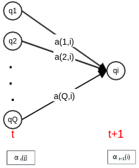
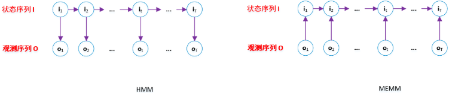

#### 隐马尔科夫模型

##### 基本概念

设$\mathbb{Q}=\left\{\mathbf{q}_{1}, \mathbf{q}_{2}, \cdots, \mathbf{q}_{Q}\right\}$是所有可能的状态的集合，$\mathbb{V}=\left\{\mathbf{v}_{1}, \mathbf{v}_{2}, \cdots, \mathbf{v}_{V}\right\}$是所有可能的观测的集合，其中$Q$是可能的状态数量，$V$是可能的观测数量。$\mathbb{Q}$是状态的取值空间，$\mathbb{V}$是观测的取值空间 。每个观测值$\mathbf{v}_i$可能是标量，也可能是一组标量构成的集合，因此这里用加粗的黑体表示。状态值的表示也类似。设$\mathbf{I}=\left(i_{1}, i_{2}, \cdots, i_{T}\right)$是长度为$\mathbf{T}$的状态序列，$\mathbf{O}=\left(o_{1}, o_{2}, \cdots, o_{T}\right)$是对应的观测序列。$i_{t} \in\{1, \cdots, Q\}$是一个随机变量，代表状态$\mathbf{q}_{i_{i}}$。$o_{t} \in\{1, \cdots, V\}$是一个随机变量，代表观测$\mathbf{v}_{o_{k}}$。设$\mathbf{A}$为状态转移概率矩阵。其中$a_{i, j}=P\left(i_{t+1}=j | i_{t}=i\right)$，表示在时刻$t$处于状态$\mathbf{q}_{i}$的条件下，在时刻$t+1$时刻转移到状态$\mathbf{q}_{j}$的概率。设$\mathbf{B}$为观测概率矩阵其中$b_{j}(k)=P\left(o_{t}=k | i_{t}=j\right)$，表示在时刻$t$处于状态$\mathbf{q}_{j}$的条件下生成观测$\mathbf{v}_{k}$的概率。设$\vec{\pi}$是初始状态概率向量：$\vec{\pi}=\left(\pi_{1}, \pi_{2}, \cdots, \pi_{Q}\right)^{T}, \quad \pi_{i}=P\left(i_{1}=i\right)$是时刻$t=1$时处于状态$\mathbf{q}_{i}$的概率。根据定义有：$\sum_{i=1}^{Q} \pi_{i}=1$。隐马尔可夫模型由初始状态概率向量$\vec{\pi}$、状态转移概率矩阵$\mathbf{A}$以及观测概率矩阵$\mathbf{B}$决定。因此隐马尔可夫模型 可以用三元符号表示，即 ：$\lambda=(\mathbf{A}, \mathbf{B}, \vec{\pi})$。其中$\mathbf{A}, \mathbf{B}, \vec{\pi}$称为隐马尔可夫模型的三要素：状态转移概率矩阵$\mathbf{A}$和初始状态概率向量$\vec{\pi}$确定了隐藏的马尔可夫链，生成不可观测的状态序列。观测概率矩阵$\mathbf{B}$确定了如何从状态生成观测，与状态序列一起确定了如何产生观测序列。从定义可知，隐马尔可夫模型做了两个基本假设：齐次性假设：即假设隐藏的马尔可夫链在任意时刻$t$的状态只依赖于它在前一时刻的状态，与其他时刻的状态和观测无关，也与时刻$t$无关，即：$P\left(i_{t} | i_{t-1}, o_{t-1}, \cdots, i_{1}, o_{1}\right)=P\left(i_{t} | i_{t-1}\right), \quad t=1,2, \cdots, T$。观测独立性假设，即假设任意时刻的观测值只依赖于该时刻的马尔可夫链的状态，与其他观测及状态无关，即：
$$
P\left(o_{t} | i_{T}, o_{T}, \cdots, i_{t+1}, o_{t+1}, i_{t}, i_{t-1}, o_{t-1}, \cdots, i_{1}, o_{1}\right)=P\left(o_{t} | i_{t}\right), \quad t=1,2, \cdots, T
$$

##### $\text{HMM}$基本问题

隐马尔可夫模型的3个基本问题：概率计算问题：给定模型$\lambda=(\mathbf{A}, \mathbf{B}, \vec{\pi})$和观测序列$\mathbf{O}=\left(o_{1}, o_{2}, \cdots, o_{T}\right)$，计算观测序列$\mathbf{O}$出现的概率$P(\mathbf{O} ; \lambda)$。学习问题：已知观测序列$\mathbf{O}$，估计模型$\lambda=(\mathbf{A}, \mathbf{B}, \vec{\pi})$的参数，使得在该模型下观测序列概率$P(\mathbf{O} ; \lambda)$最大。预测问题：已知模型$\lambda=(\mathbf{A}, \mathbf{B}, \vec{\pi})$和观测序列$\mathbf{O}=\left(o_{1}, o_{2}, \cdots, o_{T}\right)$， 求对给定观测序列的条件概率$P(\mathbf{I} | \mathbf{O})$最大的状态序列$\mathbf{I}=\left(i_{1}, i_{2}, \cdots, i_{T}\right)$。

##### 概率计算问题

###### 前向算法

定义前向概率：在时刻$t$时的观测序列为$o_{1}, o_{2}, \cdots, o_{t}$， 且时刻$t$时状态为$\mathbf{q}_{i}$的概率为前向概率，记作：$\alpha_{t}(i)=P\left(o_{1}, o_{2}, \cdots, o_{t}, i_{t}=i ; \lambda\right)$。根据定义，$\alpha_t(j)$是在时刻$t$时观测到$o_{1}, o_{2}, \cdots, o_{t}$，且在时刻$t$处于状态$\mathbf{q}_{j}$的前向概率。则有：$\alpha_{t}(j) \times a_{j, i}$：为在时刻$t$时观测到$O_{1}, O_{2}, \cdots, O_{t}$，且在时刻$t$处于状态$\mathbf{q}_{j}$，且在$t+1$时刻处在状态$\mathbf{q}_{i}$的概率。$\sum_{j=1}^{Q} \alpha_{t}(j) \times a_{j, i}$：为在时刻$t$观测序列为$o_{1}, o_{2}, \cdots, o_{t}$，并且在时刻$t+1$时刻处于状态$\mathbf{q}_{i}$的概率。考虑$b_i(o_{t+1})$，则得到前向概率的地推公式：
$$
\alpha_{t+1}(i)=\left[\sum_{j=1}^{Q} \alpha_{t}(j) a_{j, i}\right] b_{i}\left(o_{t+1}\right)
$$

###### 后向算法

定义后向概率：在时刻$t$的状态为$\mathbf{q}_i$的条件下，从时刻$t+1$到$T$的观测序列为$o_{t+1}, o_{t+2}, \cdots, o_{T}$的概率为后向概率，记作：$\beta_{t}(i)=P\left(o_{t+1}, o_{t+2}, \cdots, o_{T} | i_{t}=i ; \lambda\right)$。在时刻$t$状态为$\mathbf{q}_i$的条件下，从时刻$t+1$到$T$的观测序列为$o_{t+1}, o_{t+2}, \cdots, o_{T}$的概率可以这样计算：考虑$t$时刻状态$\mathbf{q}_i$经过$a_{i,j}$转移到$t+1$时刻的状态$\mathbf{q}_j$。$t+1$时刻状态为$\mathbf{q}_j$的条件下，从时刻$t+2$到$T$的观测序列为观测序列为$o_{t+2}, o_{t+3}, \cdots, o_{T}$的概率为$\beta_{t+1}(j)$。$t+1$时刻状态为$\mathbf{q}_j$的条件下，从时刻$t+1$到$T$的观测序列为观测序列为$O_{t+1}, O_{t+2}, \cdots, O_{T}$的概率为$b_{j}\left(o_{t+1}\right) \times \beta_{t+1}(j)$。考虑所有可能的$\mathbf{q}_j$，则得到$\beta_{t}(j)$的递推公式：$\beta_{t}(i)=\sum_{j=1}^{Q} a_{i, j} b_{j}\left(o_{t+1}\right) \beta_{t+1}(j)$

###### 统一形式

利用前向概率和后向概率的定义，可以将观测序列概率统一为：
$$
P(\mathbf{O} ; \lambda)=\sum_{i=1}^{Q} \sum_{j=1}^{Q} \alpha_{t}(i) a_{i, j} b_{j}\left(o_{t+1}\right) \beta_{t+1}(j), \quad t=1,2, \cdots, T-1
$$
其意义为：在时刻$t$：$\alpha_t(i)$表示：已知时刻$t$时的观测序列为$o_{1}, o_{2}, \cdots, o_{t}$、且时刻$t$时状态为$\mathbf{q}_i$的概率。$\alpha_t(i)\alpha_{i,j}$表示：已知时刻$t$时的观测序列为$o_{1}, o_{2}, \cdots, o_{t}$、 且时刻$t$时状态为$\mathbf{q}_i$、且$t+1$时刻状态为$\mathbf{q}_j$的概率。$\alpha_{t}(i) a_{i, j} b_{j}\left(o_{t+1}\right)$表示： 已知时刻$t+1$时的观测序列为$o_{1}, o_{2}, \cdots, o_{t+1}$、且时刻$t$时状态为$\mathbf{q}_i$、且$t+1$时刻状态为$\mathbf{q}_j$的概率。$\alpha_{t}(i) a_{i, j} b_{j}\left(o_{t+1}\right) \beta_{t+1}(j)$表示：已知观测序列为$o_{1}, o_{2}, \cdots, o_{T}$、 且时刻$t$时状态为$\mathbf{q}_i$、且$t+1$时刻状态为$\mathbf{q}_j$的概率。对所有可能的状态$\mathbf{q}_{i}, \mathbf{q}_{j}$取值，即得到上式。根据前向算法有：$\alpha_{t+1}(j)=\sum_{i=1}^{Q} \alpha_{t}(i) a_{i, j} b_{j}\left(o_{t+1}\right)$。则得到：
$$
\begin{array}{c}{P\left(\mathbf{O}_{ ; \lambda}\right)=\sum_{i=1}^{Q} \sum_{j=1}^{Q} \alpha_{t}(i) a_{i, j} b_{j}\left(o_{t+1}\right) \beta_{t+1}(j)} \\ {=\sum_{j=1}^{Q}\left[\sum_{i=1}^{Q} \alpha_{t}(i) a_{i j} b_{j}\left(o_{t+1}\right)\right] \beta_{t+1}(j)=\sum_{j=1}^{Q} \alpha_{t+1}(j) \beta_{t+1}(j)} \\ {t=1,2, \cdots, T-1}\end{array}
$$
由于$t$的形式不重要，因此有：
$$
P(\mathbf{O} ; \lambda)=\sum_{j=1}^{Q} \alpha_{t}(j) \beta_{t}(j), \quad t=1,2, \cdots, T
$$
给定模型$\lambda=(\mathbf{A}, \mathbf{B}, \vec{\pi})$和观测序列$\mathbf{O}$的条件下，在时刻$t$处于状态$\mathbf{q}_i$的概率记作：$\gamma_{t}(i)=P\left(i_{t}=i | \mathbf{O} ; \lambda\right)$ 。根据定义：
$$
\gamma_{t}(i)=P\left(i_{t}=i | \mathbf{O} ; \lambda\right)=\frac{P\left(i_{t}=i, \mathbf{O} ; \lambda\right)}{P(\mathbf{O} ; \lambda)}
$$
根据前向概率和后向概率的定义，有：$\alpha_{t}(i) \beta_{t}(i)=P\left(i_{t}=i, \mathbf{O} ; \lambda\right)$，则有：
$$
\gamma_{t}(i)=\frac{P\left(i_{t}=i, \mathbf{O} ; \lambda\right)}{P(\mathbf{O} ; \lambda)}=\frac{\alpha_{t}(i) \beta_{t}(i)}{P(\mathbf{O} ; \lambda)}=\frac{\alpha_{t}(i) \beta_{t}(i)}{\sum_{j=1}^{Q} \alpha_{t}(j) \beta_{t}(j)}
$$
给定模型$\lambda=(\mathbf{A}, \mathbf{B}, \vec{\pi})$和观测序列$\mathbf{O}$，在时刻$t$处于状态$\mathbf{q}_i$且在$t+1$时刻处于状态$\mathbf{q}_j$的概率记作：$\xi_{t}(i, j)=P\left(i_{t}=i, i_{t+1}=j | \mathbf{O} ; \lambda\right)$ 。根据
$$
\begin{aligned} \xi_{t}(i, j)=P &\left(i_{t}=i, i_{t+1}=j | \mathbf{O} ; \lambda\right)=\frac{P\left(i_{t}=i, i_{t+1}=j, \mathbf{O} ; \lambda\right)}{P(\mathbf{O} ; \lambda)} \\=& \frac{P\left(i_{t}=i, i_{t+1}=j, \mathbf{O} ; \lambda\right)}{\sum_{u=1}^{Q} \sum_{v=1}^{Q} P\left(i_{t}=u, i_{t+1}=v, \mathbf{O} ; \lambda\right)} \end{aligned}
$$
考虑到前向概率和后向概率的定义有：$P\left(i_{t}=i, i_{t+1}=j, \mathbf{o}_{ ; \lambda}\right)=\alpha_{t}(i) a_{i, j} b_{j}\left(o_{t+1}\right) \beta_{t+1}(j)$，因此有：
$$
\xi_{t}(i, j)=\frac{\alpha_{t}(i) a_{i, j} b_{j}\left(o_{t+1}\right) \beta_{t+1}(j)}{\sum_{u=1}^{Q} \sum_{v=1}^{Q} \alpha_{t}(u) a_{u, v} b_{v}\left(o_{t+1}\right) \beta_{t+1}(v)}
$$
一些期望值：在给定观测$\mathbf{O}$的条件下，状态$i$出现的期望值为：$\sum_{t=1}^{T} \gamma_{t}(i)$。在给定观测$\mathbf{O}$的条件下，从状态$i$转移的期望值：$\sum_{t=1}^{T-1} \gamma_{t}(i)$。在观测$\mathbf{O}$的条件下，由状态$i$转移到状态$j$的期望值：$\sum_{t=1}^{T-1} \xi_{t}(i, j)$。

##### 学习问题

###### 有监督学习

假设数据集为$\mathbb{D}=\left\{\left(\mathbf{O}_{1}, \mathbf{I}_{1}\right),\left(\mathbf{O}_{2}, \mathbf{I}_{2}\right), \cdots,\left(\mathbf{O}_{N}, \mathbf{I}_{N}\right)\right\}$。其中：$\mathbf{O}_{1}, \cdots, \mathbf{O}_{N}$为$N$个观测序列；$\mathbf{I}_{1}, \cdots, \mathbf{I}_{N}$为对应的$N$个状态序列。序列$\mathbf{O}_{k}, \mathbf{I}_{k}$的长度为$T_k$，其中数据集中$\mathrm{O}_{1}, \cdots, \mathrm{O}_{N}$之间的序列长度可以不同。 可以利用极大似然估计来估计隐马尔可夫模型的参数。转移概率$a_{i,j}$的估计：设样本中前一时刻处于状态$i$、且后一时刻处于状态$j$的频数为$A_{i,j}$，则状态转移概率$a_{i,j}$的估计是：
$$
\hat{a}_{i, j}=\frac{A_{i, j}}{\sum_{u=1}^{Q} A_{i, u}}, \quad i=1,2, \cdots, Q ; j=1,2, \cdots, Q
$$
观测概率$b_j(k)$的估计：设样本中状态为$j$并且观测为$k$的频数为$B_{j,k}$，则状态为$j$并且观测为$k$的概率$b_j(k)$的估计为：
$$
\hat{b}_{j}(k)=\frac{B_{j, k}}{\sum_{v=1}^{V} B_{j, v}}, \quad j=1,2, \cdots, Q ; k=1,2, \cdots, V
$$
初始状态概率的估计：设样本中初始时刻处于状态$i$的频数为$C_i$，则初始状态概率$\pi_i$的估计为：$\hat{\pi}_{i}=\frac{C_{i}}{\sum_{j=1}^{Q} C_{j}}, \quad i=1,2, \cdots, Q$

###### 无监督学习

在隐马尔可夫模型的无监督学习中，数据集为$\mathbb{D}=\left\{\mathbf{O}_{1}, \mathbf{O}_{2}, \cdots, \mathbf{O}_{N}\right\}$。其中：$\mathrm{O}_{1}, \cdots, \mathrm{O}_{N}$为$N$个观测序列。序列$\mathbf{O}_k$的长度为$T_k$，其中数据集中$\mathrm{O}_{1}, \cdots, \mathrm{O}_{N}$之间的序列长度可以不同。 将观测序列数据看作观测变量$\mathbf{O}$， 状态序列数据看作不可观测的隐变量$\mathbf{I}$，则隐马尔可夫模型事实上是一个含有隐变量的概率模型：$P(\mathbf{O} ; \lambda)=\sum_{\mathbf{I}} P(\mathbf{O} | \mathbf{I} ; \lambda) P(\mathbf{I} ; \lambda)$。其参数学习可以由 `EM` 算法实现。`E` 步：求 `Q` 函数$Q(\lambda, \overline{\lambda})=\sum_{j=1}^{N}\left(\sum_{\mathbf{I}} P\left(\mathbf{I} | \mathbf{O}=\mathbf{O}_{j} ; \overline{\lambda}\right) \log P\left(\mathbf{O}=\mathbf{O}_{j}, \mathbf{I} ; \lambda\right)\right)$将$P\left(\mathbf{I} | \mathbf{O}=\mathbf{O}_{j} ; \overline{\lambda}\right)=\frac{P\left(\mathbf{I}, \mathbf{O}=\mathbf{O}_{i j} ; \overline{\lambda}\right)}{P(\mathbf{O}_{j} ; \overline{\lambda})}$代入上式，有：
$$
Q(\lambda, \overline{\lambda})=\sum_{j=1}^{N} \frac{1}{P\left(\mathbf{O}_{j} ; \overline{\lambda}\right)}\left(\sum_{\mathbf{I}} P\left(\mathbf{I}, \mathbf{O}=\mathbf{O}_{j} ; \overline{\lambda}\right) \log P\left(\mathbf{I}, \mathbf{O}=\mathbf{O}_{j} ; \lambda\right)\right)
$$
在给定参数$\overline{\lambda}$时，$P\left(\mathbf{O}_{j} ; \overline{\lambda}\right)$是已知的常数，记做$\tilde{P}_{j}$。在给定参数$\overline{\lambda}$时，$P\left(\mathbf{I}, \mathbf{O}=\mathbf{O}_{j} ; \overline{\lambda}\right)$是$\mathbf{I}$的函数，记做$\tilde{P}_{j}(\mathbf{I})$。根据$P(\mathbf{O}, \mathbf{I} ; \lambda)=\pi_{i_{1}} b_{i_{1}}\left(o_{1}\right) a_{i_{1}, i_{2}} b_{i_{2}}\left(o_{2}\right) \cdots a_{i_{T-1}, i_{T}} b_{i_{T}}\left(o_{T}\right)$得到：
$$
\begin{aligned} Q(\lambda, \overline{\lambda})=\sum_{j=1}^{N} \frac{1}{\tilde{P}_{j}} &\left(\sum_{\mathbf{I}}\left(\log \pi_{i_{1}}\right) \tilde{P}_{j}(\mathbf{I})+\sum_{\mathbf{I}}\left(\sum_{t=1}^{T_{j}-1} \log a_{i, i_{t}-1}\right) \tilde{P}_{j}(\mathbf{I})\right.\\ &+\sum_{\mathbf{I}}\left(\sum_{t=1}^{T_{j}} \log b_{i_{t}}\left(o_{t}^{(j)}\right)\right) \tilde{P}_{j}(\mathbf{I}) ) \end{aligned}
$$
其中：$T_j$表示第$j$个序列的长度，$o_t^{(j)}$表示第$j$个观测序列的第$t$个位置。

`M` 步：求`Q` 函数的极大值：$\overline{\lambda}^{<n e w>} \leftarrow \arg \max _{\lambda} Q(\lambda, \overline{\lambda})$。极大化参数在 `Q` 函数中单独的出现在3个项中，所以只需要对各项分别极大化。

$\frac{\partial Q(\lambda, \overline{\lambda})}{\partial \pi_{i}}=0$：
$$
\begin{array}{l}{\frac{\partial Q(\lambda, \overline{\lambda})}{\partial \pi_{i}}=\frac{\partial\left(\sum_{j=1}^{N} \frac{1}{\vec{P}_{j}} \sum_{\mathbf{I}}\left(\log \pi_{i_{1}}\right) \tilde{P}_{j}(\mathbf{I})\right)}{\partial \pi_{i}}} \\ {=\sum_{j=1}^{N} \frac{1}{\tilde{P}_{j}} \sum_{i_{1}=1}^{Q} P\left(i_{1}, \mathbf{O}=\mathbf{O}_{j} ; \overline{\lambda}\right) \frac{\partial \log \pi_{i_{1}}}{\partial \pi_{i}}}\end{array}
$$
将$\pi_{Q}=1-\pi_{1}-\cdots-\pi_{Q-1}$代入，有：
$$
\frac{\partial Q(\lambda, \overline{\lambda})}{\partial \pi_{i}}=\sum_{j=1}^{N} \frac{1}{\tilde{P}_{j}}\left(\frac{P\left(i_{1}=i, \mathbf{O}=\mathbf{O}_{j} ; \overline{\lambda}\right)}{\pi_{i}}-\frac{P\left(i_{1}=Q, \mathbf{O}=\mathbf{O}_{j} ; \overline{\lambda}\right)}{\pi_{Q}}\right)=0
$$
将$\tilde{P}_{j}=P\left(\mathbf{O}=\mathbf{O}_{j} ; \overline{\lambda}\right)$代入，即有：
$$
\pi_{i} \propto \sum_{j=1}^{N} P\left(i_{1}=i | \mathbf{O}=\mathbf{O}_{j} ; \overline{\lambda}\right)
$$
考虑到$\sum_{i=1}^{Q} \pi_{i}=1$，以及$\sum_{i=1}^{Q} \sum_{j=1}^{N} P\left(i_{1}=i | \mathbf{O}=\mathbf{O}_{j} ; \overline{\lambda}\right)=N$， 则有：
$$
\pi_{i}=\frac{\sum_{j=1}^{N} P\left(i_{1}=i | \mathbf{O}=\mathbf{O}_{j} ; \overline{\lambda}\right)}{N}
$$
$\frac{\partial Q(\lambda, \overline{\lambda})}{\partial \alpha_{i, j}}=0$：同样的处理有：
$$
\begin{aligned} \frac{\partial Q(\lambda, \overline{\lambda})}{\partial a_{i, j}}=& \sum_{k=1}^{N} \frac{1}{\tilde{P}_{k}} \sum_{t=1}^{T_{k}-1}\left(\frac{P\left(i_{t}=i, i_{t+1}=j, \mathbf{O}=\mathbf{O}_{k} ; \overline{\lambda}\right)}{a_{i, j}}\right.\\ &-\frac{P\left(i_{t}=i, i_{t+1}=Q, \mathbf{O}=\mathbf{O}_{k} ; \overline{\lambda}\right)}{a_{i, Q}} ) \end{aligned}
$$
得到：
$$
a_{i, j} \propto \sum_{k=1}^{N} \sum_{t=1}^{T_{h}-1} P\left(i_{t}=i, i_{t+1}=j | \mathbf{O}=\mathbf{O}_{k} ; \overline{\lambda}\right)
$$
考虑到$\sum_{j=1}^{Q} a_{i, j}=1$，则有：
$$
\begin{aligned} a_{i, j}=& \frac{\sum_{k=1}^{N} \sum_{t=1}^{T_{k}-1} P\left(i_{t}=i, i_{t+1}=j | \mathbf{O}=\mathbf{O}_{k} ; \overline{\lambda}\right)}{\sum_{j^{\prime}=1}^{Q} \sum_{k=1}^{N} \sum_{t=1}^{T_{k}-1} P\left(i_{t}=i, i_{t+1}=j^{\prime} | \mathbf{O}=\mathbf{O}_{k} ; \overline{\lambda}\right)} \\ &=\frac{\sum_{k=1}^{N} \sum_{t=1}^{T_{k}-1} P\left(i_{t}=i, i_{t+1}=j | \mathbf{O}=\mathbf{O}_{k} ; \overline{\lambda}\right)}{\sum_{k=1}^{N} \sum_{t=1}^{T_{k}-1} P\left(i_{t}=i | \mathbf{O}=\mathbf{O}_{k} ; \overline{\lambda}\right)} \end{aligned}
$$
$\frac{\partial Q(\lambda, \overline{\lambda})}{\partial b_{j}(k)}=0$：同样的处理有：
$$
\frac{\partial Q(\lambda, \overline{\lambda})}{\partial b_{j}(k)}=\sum_{i=1}^{N} \frac{1}{\tilde{P}_{i}} \sum_{t=1}^{T_{i}}\left(\frac{P\left(i_{t}=j, o_{t}=k, \mathbf{O}=\mathbf{O}_{i} ; \overline{\lambda}\right)}{b_{j}(k)}-\frac{P\left(i_{t}=j, o_{t}=V, \mathbf{O}=\mathbf{O}_{i} ; \overline{\lambda}\right)}{b_{j}(V)}\right)
$$
得到：
$$
b_{j}(k) \propto \sum_{i=1}^{N} \sum_{t=1}^{T_{i}} P\left(i_{t}=j, o_{t}=k | \mathbf{O}=\mathbf{O}_{i} ; \overline{\lambda}\right)
$$
其中如果第$i$个序列$\mathbf{O}_i$的第$t$个位置$o_{t}^{(i)} \neq k$，则$P\left(i_{t}=j, o_{t}=k | \mathbf{O}=\mathbf{O}_{i} ; \overline{\lambda}\right)=0$。

考虑到$\sum_{k=1}^{V} b_{j}(k)=1$，则有：
$$
\begin{aligned} b_{j}(k) &=\frac{\sum_{i=1}^{N} \sum_{t=1}^{T_{i}} P\left(i_{t}=j, o_{t}=k | \mathbf{O}=\mathbf{O}_{i} ; \overline{\lambda}\right)}{\sum_{k^{\prime}=1}^{V} \sum_{i=1}^{N} \sum_{t=1}^{T_{i}} P\left(i_{t}=j, o_{t}=k^{\prime} | \mathbf{O}=\mathbf{O}_{i} ; \overline{\lambda}\right)} \\ &=\frac{\sum_{i=1}^{N} \sum_{t=1}^{T_{i}} P\left(i_{t}=j, o_{t}=k | \mathbf{O}=\mathbf{O}_{i} ; \overline{\lambda}\right)}{\sum_{i=1}^{N} \sum_{t=1}^{T_{i}} P\left(i_{t}=j | \mathbf{O}=\mathbf{O}_{i} ; \overline{\lambda}\right)} \end{aligned}
$$
令$\gamma_{t}^{(s)}(i)=P\left(i_{t}=i | \mathbf{O}=\mathbf{O}_{s} ; \overline{\lambda}\right)$，其物理意义为：在序列$\mathbf{O}_s$中，第$t$时刻的隐状态为$i$的后验概率。令$\xi_{t}^{(s)}(i, j)=P\left(i_{t}=i, i_{t+1}=j | \mathbf{O}=\mathbf{O}_{s} ; \overline{\lambda}\right)$，其物理意义为：在序列$\mathbf{O}_S$中，第$t$时刻的隐状态为$i$、且第$t+1$时刻的隐状态为$j$的后验概率。

##### 预测问题

维特比算法思想：根据动态规划原理，最优路径具有这样的特性：如果最优路径在时刻$t$通过结点$i_t^*$， 则这一路径从结点$i_t^*$到终点$i_T^*$的部分路径，对于从$i_t^*$到$i_T^*$的所有可能路径来说，也必须是最优的。只需要从时刻$t=1$开始，递推地计算从时刻$1$到时刻$t$且时刻$t$状态为$i, i=1,2,\cdots, N$的各条部分路径的最大概率。于是在时刻$t=T$的最大概率即为最优路径的概率$P^*$，最优路径的终结点$i_T^*$也同时得到。之后为了找出最优路径的各个结点，从终结点$i_T^*$开始，由后向前逐步求得结点$i_{T-1}^{*}, \cdots, i_{1}^{* *}$，得到最优路径$\mathbf{T}^{*}=\left(i_{1}^{*}, i_{2}^{*}, \cdots, i_{T}^{*}\right)$。定义在时刻$t$状态为 的所有单个路径$\left(i_{1}, i_{2}, \cdots, i_{t}\right)$中概率最大值为：$\delta_{t}(i)=\max _{i_{1}, i_{2}, \cdots, i_{l-1}} P\left(i_{t}=i, i_{t-1}, \cdots, i_{1}, o_{t}, \cdots, o_{1} ; \lambda\right), \quad i=1,2, \cdots, Q$则根据定义，得到变量$\delta$的递推公式：
$$
\begin{aligned} \delta_{t+1}(i)=\max _{i_{1}, i_{2}, \cdots, i_{i}} P\left(i_{t+1}=\right.& i, i_{t}, \cdots, i_{1}, o_{t+1}, \cdots, o_{1} ; \lambda )=\max _{1 \leq j \leq Q} \delta_{t}(j) \times a_{j, i} \times b_{i}\left(o_{t+1}\right) \\ i &=1,2, \cdots, Q ; t=1,2, \cdots, T-1 \end{aligned}
$$
定义在时刻$t$状态为$i$的所有单个路径中概率最大的路径的第$t-1$个结点为：

$$
\Psi_{t}(i)=\arg \max _{1 \leq j \leq Q} \delta_{t-1}(j) a_{j, i}, \quad i=1,2, \cdots, Q
$$
它就是最优路径中，最后一个结点的前一个结点。

##### 最大熵马尔可夫模型

`HMM` 存在两个基本假设：观察值之间严格独立。状态转移过程中，当前状态仅依赖于前一个状态。如果放松第一个基本假设，则得到最大熵马尔科夫模型`MEMM` 。最大熵马尔科夫模型并不通过联合概率建模，而是学习条件概率$P\left(i_{t} | i_{t-1}, o_{t}\right)$。它刻画的是：在当前观察值$o_t$和前一个状态$i_{t-1}$的条件下，当前状态$i_t$的概率。

