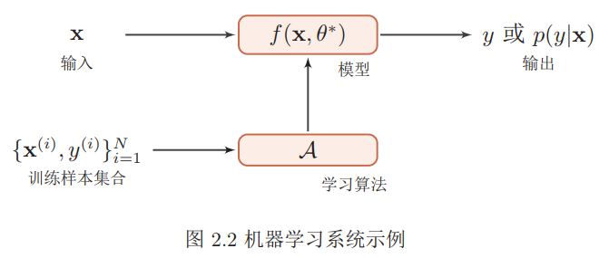
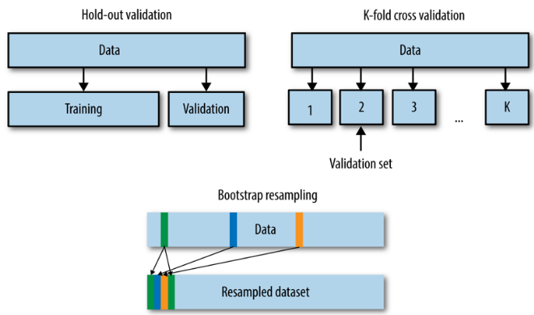
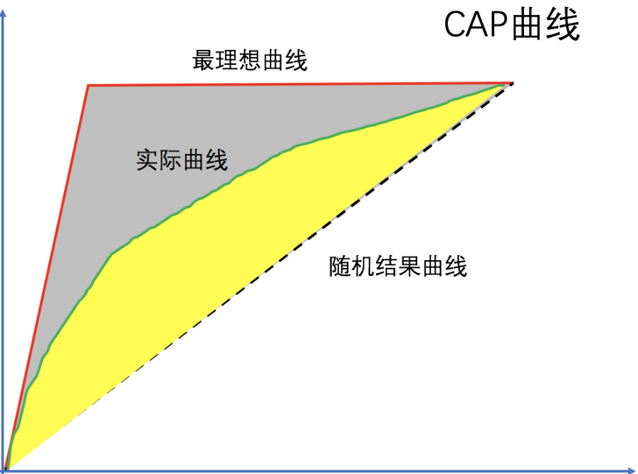

机器学习根据任务类型，可以划分为：

| 任务类型   | 说明                                                         |
| ---------- | ------------------------------------------------------------ |
| 监督学习   | 从已标记的训练数据来训练模型。 主要分为：分类任务、回归任务、序列标注任务。 |
| 无监督学习 | 从未标记的训练数据来训练模型。主要分为：聚类任务、降维任务。 |
| 半监督学习 | 用大量的未标记训练数据和少量的已标记数据来训练模型。         |
| 强化学习   | 从系统与环境的大量交互知识中训练模型。                       |

没有免费的午餐定理：对于一个学习算法`A`，如果在某些问题上它比算法`B`好，那么必然存在另一些问题，在那些问题中`B`比`A`更好。因此不存在这样的算法：它在所有的问题上都取得最佳的性能。因此要谈论算法的优劣必须基于具体的学习问题。

通常输入实例用 $\vec{\mathbf{x}}$表示，真实标记用$\tilde{y}$表示，模型的预测值用$\hat{y}$表示。所有的向量均为列向量。

#### 监督学习

监督学习假设输入$\vec{\mathbf{x}}$与标记$y$遵循联合概率分布 ，训练数据和测试数据依联合概率分布$p(\vec{\mathbf{x}},y)$独立同分布产生。学习过程中，假定这个联合概率分布存在，但是具体定义未知。监督学习的目的在于学习一个由输入到输出的映射，该映射由模型表示。模型属于由输入空间到输出空间的映射的集合，该集合就是解空间。解空间的确定意味着学习范围的确定。监督学习的模型可以为概率模型或者非概率模型：

- 概率模型由条件概率分布$p(y|\vec{\mathbf{x}})$表示。
- 非概率模型由决策函数$y=f(\vec{\mathbf{x}})$表示。

监督学习分为学习和预测两个过程。给定训练集$\mathbb{D}=\left\{\left(\vec{\mathbf{x}}_{1}, \tilde{y}_{1}\right),\left(\vec{\mathbf{x}}_{2}, \tilde{y}_{2}\right), \cdots,\left(\vec{\mathbf{x}}_{N}, \tilde{y}_{N}\right)\right\}$，其中$\vec{\mathbf{x}}_{i}\in \mathcal{X}$为输入值，$y_i\in \mathcal{Y}$是标记值。假设训练数据与测试数据是依据联合概率分布$p(\vec{\mathbf{x}},y)$独立同分布的产生的。

- 学习过程：在给定的训练集$\mathbb{D}$上，通过学习训练得到一个模型。该模型表示为条件概率分布$p(y|\vec{\mathbf{x}})$或者决策函数$y=f(\vec{\mathbf{x}})$
- 预测过程：对给定的测试样本$\vec{\mathbf{x}}_{test}$，给出其预测结果：对于概率模型，其预测值为：$\hat{y}_{test}=\text{argmax}_yp(y|\vec{\mathbf{x}_{test}})$。对于非概率模型，其预测值为：$\hat{y}_{test}=\text{argmax}_yf(\vec{\mathbf{x}}_{test})$ 

##### 生成模型和判别模型

监督学习又分为生成方法和判别方法，所用到的模型分别称为生成模型和判别模型。生成方法 ：通过数据学习联合概率分布$p(\vec{\mathbf{x}},y)$，然后求出条件概率分布$p(y|\vec{\mathbf{x}})$作为预测的模型。即生成模型为：
$$
p(y|\vec{\mathbf{x}}) = \frac{p(\vec{\mathbf{x}},y)}{p(\vec{\mathbf{x}})}
$$
生成方法的优点：能还原联合概率分布$p(\vec{\mathbf{x}},y)$，收敛速度快，且当存在隐变量时只能用生成方法。生成方法有：朴素贝叶斯法，隐马尔可夫链。判别方法 ：直接学习决策函数$f(\vec{\mathbf{x}})$或者条件概率分布$p(y|\vec{\mathbf{x}}) $的模型。判别方法的优点：直接预测，一般准确率更高，且一般比较简化问题。判别方法有：逻辑回归，决策树。

#### 三要素

不同机器学习算法的区别在于模型、学习准则和优化算法的差异。

##### 模型

模型定义了解空间。监督学习中，模型就是要学习的条件概率分布或者决策函数。模型的解空间包含了所有可能的条件概率分布或者决策函数，因此解空间中的模型有无穷多个。策略考虑的是按照什么样的准则学习，从而定义优化目标。算法指学习模型的具体计算方法。通常采用数值计算的方法求解，如：梯度下降法。

模型为一个条件概率分布：解空间为条件概率的集合：$\mathcal{F} = \{p|p(y|\vec{\mathbf{x}})\}$。其中： $\vec{\mathbf{x}}\in \mathcal{X}, y\in\mathcal{Y}$为随机变量，$\mathcal{X}$为输入空间，$\mathcal{Y}$为输出空间。通常$\mathcal{F}$是由一个参数向量$\vec{\theta}=(\theta_1,\cdots,\theta_n)$决定的概率分布族：$\mathcal{F} = \{p|p_{\vec{\theta}}(y|\vec{\mathbf{x}}), \vec{\theta}\in \mathbb{R}^n\}$。其中：$p_{\vec{\theta}}$只与$\vec{\theta}$有关，称$\vec{\theta}$为参数空间。

模型为一个决策函数：解空间为决策函数的集合：$\mathcal{F} = \{f|y=f(\vec{\mathbf{x}})\}$。其中： $\vec{\mathbf{x}}\in \mathcal{X}, y\in\mathcal{Y}$为变量，$\mathcal{X}$为输入空间，$\mathcal{Y}$为输出空间。通常$\mathcal{F}$是由一个参数向量$\vec{\theta}=(\theta_1,\cdots,\theta_n)$决定的函数族：$\mathcal{F} = \{y=f_{\vec{\theta}}(\vec{\mathbf{x}}), \vec{\theta}\in \mathbb{R}^n\}$。其中：其中：$f_{\vec{\theta}}$只与$\vec{\theta}$有关，称$\vec{\theta}$为参数空间。解的表示一旦确定，解空间以及解空间的规模大小就确定了。将学习过程看作一个在解空间中进行搜索的过程，搜索目标就是找到与训练集匹配的解。

##### 学习准测

一个好的模型$f(\mathbf{x}, θ^∗)$应该在所有 $(\mathbf{x}, y) $的可能取值上都与真实映射函数$y = g(\mathbf{x})$一致，即
$$
\left|f\left(\mathbf{x}, \theta^{*}\right)-y\right|<\epsilon, \quad \forall(\mathbf{x}, y) \in \mathcal{X} \times \mathcal{Y}
$$
或与真实条件概率分布$p_r(y|\mathbf{x})$一致，即
$$
\left|f_{y}\left(\mathrm{x}, \theta^{*}\right)-p_{r}(y | \mathrm{x})\right|<\epsilon, \quad \forall(\mathrm{x}, y) \in \mathcal{X} \times \mathcal{Y}
$$
其中$ϵ$是一个很小的正数，$f_y(\mathbf{x}, θ^∗)$为模型预测的条件概率分布中$y$对应的概率。

模型$f(\mathbf{x}, θ)$的好坏可以通过期望风险$R(θ)$来衡量
$$
\mathcal{R}(\theta)=\mathbb{E}_{(\mathbf{x}, y) \sim p_{r}(\mathbf{x}, y)}[\mathcal{L}(y, f(\mathbf{x}, \theta))]
$$
其中$p_r(\mathbf{x}, y)$为真实的数据分布，$L(y, f(\mathbf{x}, θ))$为损失函数，用来量化两个变量之间的差异。

##### 损失函数

对于给定的输入$\vec{\mathbf{x}}$，由模型预测的输出值$\hat{y}$与真实的标记值$\tilde{y}$可能不一致。此时，用损失函数度量错误的程度，记作$L(\tilde{y}, \hat{y})$，也称作代价函数。

| 名称                         | 定义                       |
| ---------------------------- | -------------------------- |
| 损失函数`Loss Function`      | 通常是针对单个训练样本而言 |
| 代价函数`Cost Function`      | 通常是针对整个训练集       |
| 目标函数`Objective Function` | 表示任意希望被优化的函数   |

###### `Mean Squared Error Loss`

均方差`MSE`损失是机器学习、深度学习回归任务中最常用的一种损失函数
$$
\mathcal{L}(y, f(\mathbf{x}, \theta))=\frac{1}{2}(y-f(\mathbf{x}, \theta))^{2}
$$
在一定的假设下，我们可以使用最大化似然得到均方差损失的形式。假设模型预测与真实值之间的误差服从标准高斯分布，则给定一个$\vec{\mathbf{x}}_i$模型输出真实值$y_i$的概率为
$$
P(y_i|\vec{\mathbf{x}}_i)=\frac{1}{\sqrt{2\pi}}\exp(-\frac{(y_i-\hat{y}_i)^2}{2})
$$
进一步我们假设数据集中 N 个样本点之间相互独立，则给定所有$\vec{\mathbf{x}}$输出所有真实值$y$的概率，即似然函数为
$$
L(\vec{\mathbf{x}},y)=\prod_{i=1}^N\frac{1}{\sqrt{2\pi}}\exp(-\frac{(y_i-\hat{y}_i)^2}{2})\\
LL(\vec{\mathbf{x}},y) = \log(L(\vec{\mathbf{x}},y))=-\frac{N}{2}\log2\pi-\frac{1}{2}\sum_{i=1}^N(y_i-\hat{y}_i)^2
$$
去掉与$\hat{y}_i$无关的第一项，然后转化为最小化负对数似然
$$
NLL(\vec{\mathbf{x}},y) = \frac{1}{2}\sum_{i=1}^N(y_i-\hat{y}_i)^2
$$
在模型输出与真实值的误差服从高斯分布的假设下，最小化均方差损失函数与极大似然估计本质上是一致的。

###### 平均绝对误差损失

平均绝对误差`MAE`是另一类常用的损失函数
$$
\mathcal{L}(y, f(\mathbf{x}, \theta)) = |y-\hat{y}|
$$
假设模型预测与真实值之间的误差服从拉普拉斯分布，则给定一个$\vec{\mathbf{x}}_i$模型输出真实值$y_i$的概率为
$$
P(y_i|\vec{\mathbf{x}}_i) = \frac{1}{2}\exp(-|y_i-\hat{y}_i|)
$$
可以得到的负对数似然实际上就是`MAE`损失的形式
$$
L(\vec{\mathbf{x}},y)=\prod_{i=1}^N\frac{1}{2}\exp(-|y_i-\hat{y}_i|)\\
LL(\vec{\mathbf{x}},y) = \log(L(\vec{\mathbf{x}},y))=-\frac{N}{2}-\sum_{i=1}^N|y_i-\hat{y}_i|\\

NLL(\vec{\mathbf{x}},y)= \sum_{i=1}^N|y_i-\hat{y}_i|
$$
`MSE`损失相比`MAE`通常可以更快地收敛，但`MAE`损失对于异常点更加健壮，即更加不易受到`outlier`影响。

###### `Huber Loss`

$$
L_{\delta}(y_i,f(\mathbf{x}, \theta))=\left\{\begin{array}{ll}{\frac{1}{2}(y-\hat{y})^2} & {\text { if } |y-\hat{y}| \le \delta} \\ {\delta|y-\hat{y}|-\frac{1}{2}\delta^2} & {\text { else }}\end{array}\right.
$$

上式中$\delta$是`Huber Loss`的一个超参数。`Huber Loss`结合了`MSE`和`MAE`损失，在误差接近0时使用`MSE`，使损失函数可导并且梯度更加稳定；在误差较大时使用`MAE`可以降低`outlier`的影响，使训练对`outlier`更加健壮。缺点是需要额外地设置一个$\delta$超参数。

###### 分位数损失

通常的回归算法是拟合目标值的期望或者中位数，而分位数回归可以通过给定不同的分位点，拟合目标值的不同分位数。分位数回归是通过使用分位数损失来实现这一点的，分位数损失形式如下，式中的$r$分位数系数。
$$
L_{r}(y_i,f(\mathbf{x}, \theta))=\left\{\begin{array}{ll}{(1-r)|y-\hat{y}|} & {\hat{y}\ge y} \\ {r|y-\hat{y}|} & {\hat{y}<y}\end{array}\right.
$$
分位数损失实现了分别用不同的系数控制高估$\hat{y}\ge y$和低估$\hat{y}<y$的损失，进而实现分位数回归。

###### 交叉熵损失

假设样本的标签$y ∈ \{1, · · · C\}$为离散的类别，模型$f(x, θ) ∈ [0, 1]^C$ 的输出为类别标签的条件概率分布，即：$p(y=c | \mathbf{x}, \theta)=f_{c}(\mathbf{x}, \theta)$。并满足：$f_{c}(\mathbf{x}, \theta) \in[0,1], \quad \sum_{c=1}^{C} f_{c}(\mathbf{x}, \theta)=1$。标签的真实分布$y$和模型预测分布$f(\mathbf{x}, θ)$之间的交叉熵为：
$$
\mathcal{L}(\mathbf{y}, f(\mathbf{x}, \theta))=-\sum_{c=1}^{C} y_{c} \log f_{c}(\mathbf{x}, \theta)
$$
在二分类中使用` Sigmoid `函数将模型的输出压缩到$(0,1)$区间内$\hat{y}\in (0,1)$，用来代表给定输入$\vec{\mathbf{x}}$，模型判断为正类的概率。由于只有正负两类，因此同时也得到了负类的概率。
$$
p(y_i=1|\vec{\mathbf{x}}_i) = \hat{y}_i\\
p(y_i|\vec{\mathbf{x}}_i) = (\hat{y}_i)^{y_i}(1-\hat{y}_i)^{1-y_i}
$$
假设数据点之间独立同分布,可以得到的负对数似然即为交叉熵损失函数的形式
$$
L(\vec{\mathbf{x}},y)=\prod_{i=1}^N(\hat{y}_i)^{y_i}(1-\hat{y}_i)^{1-y_i}\\
LL(\vec{\mathbf{x}},y) = \sum_{i=1}^N[y_i\log(\hat{y}_i)+(1-y_i)\log(1-\hat{y}_i)]\\
NLL(\vec{\mathbf{x}},y)= -\sum_{i=1}^N[y_i\log(\hat{y}_i)+(1-y_i)\log(1-\hat{y}_i)]
$$
`Softmax `函数将每个维度的输出范围都限定在$(0,1)$之间，同时所有维度的输出和为1，用于表示一个概率分布。
$$
p(y_i|\vec{\mathbf{x}}_i) = \prod_{k=1}^K(\hat{y}^k_i)^{y^k_i}
$$
同样的假设数据点之间独立同分布，可得到负对数似然为
$$
NLL(\vec{\mathbf{x}},y) = -\sum_{i=1}^N\sum_{k=1}^Ky_i^k\log(\hat{y}^k_i)
$$
由于$y_i$是一个 one-hot 向量，除了目标类为1之外其他类别上的输出都为0，因此上式也可以写为
$$
NLL(\vec{\mathbf{x}},y) =-\sum_{i=1}^N y_i^{c_i}\log(\hat{y}^{c_i}_i)
$$
其中$c_i$是样本$\vec{\mathbf{x}}_i$的目标类。

给定分布$p$和分布$q$， 两者的 KL 散度公式
$$
KL(p,q) = \sum_{k=1}^Kp^k\log p^k-\sum_{k=1}^Kp^k\log q_k
$$
假设对于样本$\vec{\mathbf{x}}_i$存在一个最优分布$y_i^*$真实地表明了这个样本属于各个类别的概率，那么我们希望模型的输出$\hat{y}_i$尽可能地逼近这个最优分布
$$
KL(y^*_i\hat{y}_i) = \sum_{k=1}^Ky^{*k}_i\log y_i^{*k} -\sum_{k=1}^Ky^{*k}_i\log \hat{y}_i^k
$$
由于我们希望两个分布尽量相近，因此我们最小化 KL 散度。同时由于上式第一项信息熵仅与最优分布本身相关，因此我们在最小化的过程中可以忽略掉，变成最小化
$$
-\sum_{k=1}^Ky^{*k}_i\log \hat{y}_i^k
$$
我们并不知道最优分布$y^*_i$，但训练数据里面的目标值$y$可以看做是$y_i^*$的一个近似分布
$$
-\sum_{k=1}^Ky^{k}_i\log \hat{y}_i^k
$$
通过最小化交叉熵的角度推导出来的结果和使用最大化似然得到的结果是一致的

###### `Hinge Loss`

合页损失` Hinge Loss `是另外一种二分类损失函数，适用于`maximum-margin`的分类
$$
\begin{aligned} \mathcal{L}(y, f(x, \theta)) &=\max (0,1-y f(x, \theta)) \\ & \triangleq[1-y f(x, \theta)]_{+} \end{aligned}
$$
合页损失不仅惩罚预测错的，并且对于预测对了但是置信度不高的也会给一个惩罚，只有置信度高的才会有零损失。使用合页损失直觉上理解是要找到一个决策边界，使得所有数据点被这个边界正确地、高置信地被分类。

###### `0-1`损失函数

$$
\mathcal{L}(y, f(\mathbf{x}, \theta))=\left\{\begin{array}{ll}{0} & {\text { if } y=f(\mathbf{x}, \theta)} \\ {1} & {\text { if } y \neq f(\mathbf{x}, \theta)}\end{array}\right.
=I(y \neq f(\mathbf{x}, \theta))
$$

###### 指数损失函数

$$
L(y, f(x, \theta))=\frac{1}{n}\sum_{i=1}^n \exp[-y_if(x_i)]
$$

通常损失函数值越小，模型就越好。但是由于模型的输入、标记都是随机变量，遵从联合分布$p(\vec{\mathbf{x}},y)$， 因此定义风险函数为损失函数的期望：
$$
\begin{equation}R_{e x p}=\mathbb{E}_{P}[L(\tilde{y}, \hat{y})]=\int_{\mathcal{X} \times \mathcal{Y}} L(\tilde{y}, \hat{y}) p(\overrightarrow{\mathbf{x}}, y) d \overrightarrow{\mathbf{x}} d y\end{equation}
$$

**经验风险最小化准则**：给定一个训练集$\mathcal{D}=\left\{\left(\mathbf{x}^{(n)}, y^{(n)}\right)\right\}_{n=1}^{N}$我们可以计算的是经验风险，即在训练集上的平均损失。
$$
\mathcal{R}_{\mathcal{D}}^{e m p}(\theta)=\frac{1}{N} \sum_{n=1}^{N} \mathcal{L}\left(y^{(n)}, f\left(x^{(n)}, \theta\right)\right)
$$
因此，一个切实可行的学习准则是找到一组参数$θ^∗$ 使得经验风险最小    
$$
\theta^{*}=\underset{\theta}{\arg \min } \mathcal{R}_{\mathcal{D}}^{\operatorname{emp}}(\theta)
$$
**结构风险最小化准则**：一般在经验风险最小化的基础上再引入参数的正则化，来限制模型能力，使其不要过度地最小化经验风险。
$$
\begin{aligned} \theta^{*} &=\arg \min _{\theta} \mathcal{R}_{\mathcal{D}}^{\operatorname{struct}}(\theta) \\ &=\underset{\theta}{\arg \min } \mathcal{R}_{\mathcal{D}}^{e m p}(\theta)+\frac{1}{2} \lambda\mathcal{J}(f) \\ &=\underset{\theta}{\arg \min } \frac{1}{N} \sum_{n=1}^{N} \mathcal{L}\left(y^{(n)}, f\left(x^{(n)}, \theta\right)\right)+\frac{1}{2} \lambda\mathcal{J}(f) \end{aligned}
$$
其中$\mathcal{J}(f)$用来减少参数空间，避免过拟合；$λ$用来控制正则化的强度。 

极大似然估计就是经验风险最小化的例子。已知训练集$\mathbb{D}=\left\{\left(\vec{\mathbf{x}}_{1}, \tilde{y}_{1}\right),\left(\vec{\mathbf{x}}_{2}, \tilde{y}_{2}\right), \cdots,\left(\vec{\mathbf{x}}_{N}, \tilde{y}_{N}\right)\right\}$，则出现这种训练集的概率为：$\prod_{i=1}^N{p(\tilde{y}_i|\vec{\mathbf{x}_i})}$。根据$\mathbb{D}$出现概率最大，有：
$$
\begin{equation}\max \prod_{i=1}^{N} p\left(\tilde{y}_{i} | \overrightarrow{\mathbf{x}}_{i}\right) \rightarrow \max \sum_{i=1}^{N} \log p\left(\tilde{y}_{i} | \overrightarrow{\mathbf{x}}_{i}\right) \rightarrow \min \sum_{i=1}^{N}\left(-\log p\left(\tilde{y}_{i} | \overrightarrow{\mathbf{x}}_{i}\right)\right)\end{equation}
$$
定义损失函数为：$L(\tilde{y}, \hat{y})=-\log{p(\tilde{y}|\vec{\mathbf{x}})}$，则有：
$$
\begin{equation}\min \sum_{i=1}^{N}\left(-\log p\left(\tilde{y}_{i} | \overrightarrow{\mathbf{x}}_{i}\right)\right) \rightarrow \min \sum_{i=1}^{N} L\left(\tilde{y}_{i}, \hat{y}_{i}\right) \rightarrow \min \frac{1}{N} \sum_{i=1}^{N} L\left(\tilde{y}_{i}, \hat{y}_{i}\right)\end{equation}
$$
即：极大似然估计 = 经验风险最小化 。

最大后验估计就是结构风险最小化的例子。已知训练集$\mathbb{D}=\left\{\left(\vec{\mathbf{x}}_{1}, \tilde{y}_{1}\right),\left(\vec{\mathbf{x}}_{2}, \tilde{y}_{2}\right), \cdots,\left(\vec{\mathbf{x}}_{N}, \tilde{y}_{N}\right)\right\}$，假设已知参数$\theta$的先验分布为$g(\theta)$，则出现这种训练集的概率为：$\prod_{i=1}^N{p(\tilde{y}_i|\vec{\mathbf{x}_i})}g(\theta)$。

根据$\mathbb{D}$出现概率最大：
$$
\begin{equation}\begin{array}{l}
\max \prod_{i=1}^{N} p\left(\tilde{y}_{i} | \overrightarrow{\mathbf{x}}_{i}\right) g(\theta) \rightarrow \max \sum_{i=1}^{N} \log p\left(\tilde{y}_{i} | \overrightarrow{\mathbf{x}}_{i}\right)+\log g(\theta) \\
\quad \rightarrow \min \sum_{i=1}^{N}\left(-\log p\left(\tilde{y}_{i} | \overrightarrow{\mathbf{x}}_{i}\right)\right)+\log \frac{1}{g(\theta)}
\end{array}\end{equation}
$$
定义损失函数为：$L(\tilde{y}, \hat{y})=-\log{p(\tilde{y}|\vec{\mathbf{x}})}$；定义模型复杂度为$J(f)=\log{\frac{1}{g(\theta)}}$；定义正则化系数为$\lambda=\frac{1}{N}$。则有：
$$
\begin{equation}\begin{array}{c}
\min \sum_{i=1}^{N}\left(-\log p\left(\tilde{y}_{i} | \overrightarrow{\mathbf{x}}_{i}\right)\right)+\log \frac{1}{g(\theta)} \rightarrow \min \sum_{i=1}^{N} L\left(\tilde{y}_{i}, \hat{y}_{i}\right)+J(f) \\
\rightarrow \min \frac{1}{N} \sum_{i=1}^{N} L\left(\tilde{y}_{i}, \hat{y}_{i}\right)+\lambda J(f)
\end{array}\end{equation}
$$
即：最大后验估计 = 结构风险最小化。

##### 优化算法

在确定了训练集 $D$、假设空间$ F$ 以及学习准则后，如何找到最优的模型$f(\mathbf{x}, θ^∗)$就成了一个最优问题。机器学习的训练过程其实就是最优化问题的求解过程。**参数与超参数**在机器学习中，优化又可以分为参数优化和超参数优化。模型$f(\mathbf{x}, θ)$中的$θ$ 称为模型的参数，可以通过优化算法进行学习。除了可学习的参数$θ$之外，还有一类参数是用来定义模型结构或优化策略的，这类参数叫做超参数。

梯度下降算法：$\theta_{t+1}=\theta_{t}-\alpha \frac{\partial \mathcal{R}_{\mathcal{D}}(\theta)}{\partial \theta}
=\theta_{t}-\alpha \cdot \frac{1}{N} \sum_{n=1}^{N} \frac{\partial \mathcal{L}\left(y^{(n)}, f\left(\mathbf{x}^{(n)}, \theta\right)\right)}{\partial \theta}$

$\text{Stochastic Gradient Descent}$：$\theta \leftarrow \theta-\alpha \frac{\partial \mathcal{L}\left(\theta ; x^{(n)}, y^{(n)}\right)}{\partial \theta}$

$\text{Mini-Batch Gradient Descent}$：$\theta_{t+1} \leftarrow \theta_{t}-\alpha \cdot \frac{1}{K} \sum_{(\mathbf{x}, y) \in \mathcal{I}_{t}} \frac{\partial \mathcal{L}(y, f(\mathbf{x}, \theta))}{\partial \theta}$

坐标下降法：一个可微的凸函数$J(θ)$, 其中$θ$是$n \times1$的向量。如果在某一点$\overline{\theta}$，使得$J(θ)$在每一个坐标轴$\overline{\theta}_i(i = 1,2,...n)$上都是最小值，那么$J(\overline{\theta})$就是一个全局的最小值。

首先，我们把$θ$向量随机取一个初值。记为$θ^{(0)}$，上面的括号里面的数字代表我们迭代的轮数，当前初始轮数为$0$.

对于第k轮的迭代。我们从$θ^{(k)}_1$开始，到$θ^{(k)}_n$为止，依次求$θ^{(k)}_i$。$θ^{(k)}_i$的表达式如下：
$$
\theta^{(k)}_i = \mathbf{argmin}_{\theta_i}J(\theta^{(k)}_1,\cdot\cdot\cdot,\theta^{k}_{i-1},\theta_i,\cdot\cdot\cdot,\theta^{(k-1)}_n)
$$

##### 

##### 多分类问题

对于只能求解二分类问题的算法，一旦遇到问题是多类别的，那么可以将多分类问题拆解成二分类任务求解。即：先对原问题进行拆分，然后为拆出的每个二分类任务训练一个分类器。测试时，对这些二分类器的预测结果进行集成，从而获得最终的多分类结果。假设类别为$\{c_1,c_2,\cdots,c_K\}$

| 方法           | 说明                                                         | 训练                                                         | 预测                                                         |
| -------------- | ------------------------------------------------------------ | ------------------------------------------------------------ | ------------------------------------------------------------ |
| `One VS Rest`  | 为每一个类别训练一个分类器。则训练$K$个分类器$CL_1,\cdots,CL_K$ | 训练$CL_i$时，将类别为$i$的样本点定义为正类，将类别不是$i$的样本点定义为负类，训练$CL_i$不光需要给出预测结果是否属于类别$c_i$，还要给出置信度。 | 预测时，对于未知的实例，用训练出来的$K$个分类器来预测。假设置信度最高的分类器为$CL_m$，则该实例的类别预测为$c_m$。 |
| `One VS One`   | 为每一对类别训练一个分类器。那么训练$\frac{K(K-1)}{2}$个分类器$CL_{1,2},\cdots,CL_{K-1,K}$ | $CL_{i,j}$分类器从原始训练集中提取类别为$c_i,c_j$的样本点作为新的训练集，然后训练 | 预测时，首先设投票结果为$s_0=0,\cdots,s_K=0$,然后用每个分类器 对未知实例进行预测：若预测结果是类别$c_i$，则$s_i+=1$。若预测结果是类别$c_j$，则$s_j+=1$。最终假设$s_m$最大，则该未知的实例分类为$c_m$。 |
| `Many VS Many` | 每次都将若干个类作为正类，若干个其他类作为反类。             | 对$K$个类别进行$M$次划分，每次划分都将一部分类别划分为正类，一部分类别划分为反类，从而形成一个二分类训练集。这样一个产生$M$个训练集，可以训练出$M$个分类器。 | 用$M$个分类器分别对测试样本进行预测，这些预测标记组成一个编码。将这个预测编码与每个类别各自的编码进行比较，返回其中距离最小的类别作为最终预测结果。 |

#### 模型评估

##### 过拟合、欠拟合

过拟合`overfitting`：选择的模型包含的参数过多，以至于该模型对于已知数据预测得很好，但是对于未知数据预测的很差，使得训练误差和测试误差之间的差距太大。过拟合的原因是：将训练样本本身的一些特点当作了所有潜在样本都具有的一般性质，这会造成泛化能力下降。过拟合无法避免，只能缓解

欠拟合`underfitting`：选择的模型包含的参数太少，以至于该模型对已知数据都预测的很差，使得训练误差较大。欠拟合的原因一般是学习能力低下造成的。

###### 模型容量

模型的假设空间指的是：代表模型的函数集合。这也称作模型的表示容量`representational capacity`。由于额外的限制因素（比如优化算法的不完善），模型的有效容量`effective capacity`一般会小于模型的表示容量。

通常泛化误差是关于模型容量的 `U`形函数。随着模型容量增大：训练误差会下降直到逼近其最小值、泛化误差先减小后增大、泛化误差与训练误差的差值会增大。

高偏差对应于模型的欠拟合：模型过于简单，以至于未能很好的学习训练集，从而使得训练误差过高。此时模型预测的方差较小，表示预测较稳定。但是模型预测的偏差会较大，表示预测不准确。

高方差对应于模型的过拟合：模型过于复杂，以至于将训练集的细节都学到，将训练集的一些细节当做普遍的规律，从而使得测试集误差与训练集误差相距甚远。此时模型预测的偏差较小，表示预测较准确。但是模型预测的方差较大，表示预测较不稳定。

误差诊断：通过训练误差和测试误差来分析模型是否存在高方差、高偏差。如果训练误差较高：说明模型的偏差较大，模型出现了欠拟合。如果训练误差较低，而测试误差较高：说明模型的偏差较大，出现了过拟合。如果训练误差较低，测试误差也较低：说明模型的方差和偏差都适中，是一个比较理想的模型。如果训练误差较高，且测试误差更高：说明模型的方差和偏差都较大。

缓解过拟合的策略：正则化；数据集增强：通过人工规则产生虚假数据来创造更多的训练数据；噪声注入：包括输入噪声注入、输出噪声注入、权重噪声注入。将噪声分别注入到输入/输出/权重参数中；早停：当验证集上的误差没有进一步改善时，算法提前终止。

##### bias-variance 分解

点估计：对参数$\theta$的一个预测，记作$\hat{\theta}$。假设$\left\{x_{1}, x_{2}, \cdots, x_{m}\right\}$为独立同分布的数据点，该分布由参数$\theta$决定。则参数$\theta$的点估计为某个函数：$\hat{\theta}_{m}=g\left(x_{1}, x_{2}, \cdots, x_{m}\right)$。注意：点估计的定义并不要求  返回一个接近真实值  。根据频率学派的观点：真实参值$\theta$是固定的，但是未知的。$\hat{\theta}$是数据点的函数。由于数据是随机采样的，因此$\hat{\theta}$是个随机变量

偏差定义为：$\operatorname{bias}\left(\hat{\theta}_{m}\right)=\mathbb{E}\left(\hat{\theta}_{m}\right)-\theta$，期望作用在所有数据上。如果$\operatorname{bias}\left(\hat{\theta}_{m}\right)=0$，则称估计量$\hat{\theta}$是无偏的。如果$\lim _{m \rightarrow \infty} \operatorname{bias}\left(\hat{\theta}_{m}\right)=0$，则称估计量$\hat{\theta}$是渐近无偏的。无偏估计并不一定是最好的估计。通常希望当数据集的大小$m$增加时，点估计会收敛到对应参数的真实值。即：

$$
\operatorname{plim}_{m \rightarrow \infty} \hat{\theta}_{m}=\theta
$$
 $\operatorname{plim}$表示依概率收敛。即对于任意的$\epsilon>0$，当$m \rightarrow \infty$时，有：$P\left(\left|\hat{\theta}_{m}-\theta\right|\right)>\epsilon \rightarrow 0$ 

###### 偏差方差分解

期望误差可以分解为
$$
\begin{aligned} \mathcal{R}(f) &=\mathbb{E}_{(\mathbf{x}, y) \sim p_{r}(\mathbf{x}, y)}\left[\left(y-f^{*}(\mathbf{x})+f^{*}(\mathbf{x})-f(\mathbf{x})\right)^{2}\right] \\ &=\mathbb{E}_{\mathbf{x} \sim p_{r}(\mathbf{x})}\left[\left(f(\mathbf{x})-f^{*}(\mathbf{x})\right)^{2}\right]+\varepsilon \end{aligned}
$$
对于单个样本$\mathbf{x}$，不同训练集$D$得到模型$f_D(\mathbf{x})$和最优模型$f^∗(\mathbf{x})$的上的期望差距为
$$
\begin{aligned} \mathbb{E}_{\mathcal{D}} &\left[\left(f_{\mathcal{D}}(\mathbf{x})-f^{*}(\mathbf{x})\right)^{2}\right] \\=& \mathbb{E}_{\mathcal{D}}\left[\left(f_{\mathcal{D}}(\mathbf{x})-\mathbb{E}_{\mathcal{D}}\left[f_{\mathcal{D}}(\mathbf{x})\right]+\mathbb{E}_{\mathcal{D}}\left[f_{\mathcal{D}}(\mathbf{x})\right]-f^{*}(\mathbf{x})\right)^{2}\right] \\=& \underbrace{\left(\mathbb{E}_{\mathcal{D}}\left[f_{\mathcal{D}}(\mathbf{x})\right]-f^{*}(\mathbf{x})\right)^{2}}_{(\text { bias })^{2}}+\underbrace{\mathbb{E}_{\mathcal{D}}\left[\left(f_{\mathcal{D}}(\mathbf{x})-\mathbb{E}_{\mathcal{D}}\left[f_{\mathcal{D}}(\mathbf{x})\right]\right)^{2}\right]}_{\text { variance }} \end{aligned}
$$

##### 泛化能力评估

模型泛化能力的评估：用测试集对模型进行评估。通常有下列方法：留出法`hold-out`、`K` 折交叉验证法`cross validation`、留一法`Leave-One-Out:LOO`、自助法`bootstrapping`。

| 方法            | 说明                                                         |
| --------------- | ------------------------------------------------------------ |
| `hold-out`      | 直接将数据切分为三个互斥的部分（也可以切分成两部分，此时训练集也是验证集），然后在训练集上训练模型，在验证集上选择模型，最后用测试集上的误差作为泛化误差的估计。 |
| `K`折交叉验证法 | 数据随机划分为`K` 个互不相交且大小相同的子集，利用 `K-1` 个子集数据训练模型，利用余下的一个子集测试模型。对 `K` 种组合依次重复进行，获取测试误差的均值，将这个均值作为泛化误差的估计。 |
| 留一法          | 假设数据集中存在$N$个样本，令$K=N$则得到了 `K` 折交叉验证的一个特例。 |
| 自助采样法      | 给定包含$N$个样本的数据集$\mathbb{D}$，对它进行采样产生数据集$\mathbb{D}^{\prime}$：每次随机从$\mathbb{D}$中挑选一个样本，将其拷贝放入$\mathbb{D}^{\prime}$中，然后再将该样本放回初始数据集$\mathbb{D}$中。重复这个过程$N$次，就得到了包含$N$个样本的数据集$\mathbb{D}^{\prime}$。将$\mathbb{D}^{\prime}$用作训练集，$\mathbb{D}-\mathbb{D}^{\prime}$用作测试集，这样的测试结果称作包外估计 |

##### 训练、验证、测试集

训练集用于训练模型。理论上训练集越大越好。将训练数据分成两个不相交的子集：训练集用于学习模型，验证集用于更新超参数。通常要求验证集足够大。如果验证集很小，那么模型的超参数可能就记住了一个小验证集里的样本，模型将对验证集严重过拟合。验证集通常会低估泛化误差。因此当超参数优化完成后，需要通过测试集来估计泛化误差。测试集用于评估模型的泛化误差。理论上测试集越大，则模型的泛化误差评估的越准确。测试集中的样本一定不能是训练样本。如果将训练样本放入测试集中，则会低估泛化误差。

###### 拆分

对于小批量数据，数据的拆分的常见比例为：

- 如果未设置验证集，则将数据三七分：70% 的数据用作训练集、30% 的数据用作测试集。
- 如果设置验证集，则将数据划分为：60% 的数据用作训练集、20%的数据用过验证集、20% 的数据用作测试集。

###### 分布不匹配

当训练集和验证集、测试集的数据分布不同时，有以下经验原则：

- 确保验证集和测试集的数据来自同一分布。
- 确保验证集和测试集能够反映未来得到的数据，或者最关注的数据。
- 确保数据被随机分配到验证集和测试集上。

当训练集和验证集、测试集的数据分布不同时，分析偏差和方差的方式有所不同。

- 如果训练集和验证集的分布一致，那么当训练误差和验证误差相差较大时，我们认为存在很大的方差问题。
- 如果训练集和验证集的分布不一致，那么当训练误差和验证误差相差较大时，有两种原因：
  - 第一个原因：模型只见过训练集数据，没有见过验证集的数据导致的，是数据不匹配的问题。
  - 第二个原因：模型本来就存在较大的方差。

##### 性能度量

###### 分类问题性能度量

| 说明      | 公式                                                  |
| --------- | ----------------------------------------------------- |
| 准确率    | $\frac{1}{N}\sum_{i=1}^{N}I(\tilde{y}_i=\hat{y}_i)$   |
| 错误率    | $\frac{1}{N}\sum_{i=1}^{N}I(\tilde{y}_i\ne\hat{y}_i)$ |
| 查准率`P` | $\frac{TP}{TP+FP}$                                    |
| 查全率`R` | $\frac{TP}{TP+FN}$                                    |
| `F1`值    | $\frac{P+R}{2PR}$                                     |
|           |                                                       |

|            | 预测：正类 | 预测：反类 |
| ---------- | ---------- | ---------- |
| 真实：正类 | `TP`       | `FN`       |
| 真实：反类 | `FP`       | `TN`       |

**$\text{P-R}$曲线**：假设排序后的样本集合为$\left(\overrightarrow{\mathbf{x}}_{1}, \tilde{y}_{1}\right),\left(\overrightarrow{\mathbf{x}}_{2}, \tilde{y}_{2}\right), \cdots,\left(\overrightarrow{\mathbf{x}}_{N}, \tilde{y}_{N}\right)$，预测为正类的概率依次为$\left(p_{1}, p_{2}, \cdots, p_{N}\right)$。在第$i$轮，将$p_i$作为分类阈值来。即：
$$
\hat{y}_{j}=\left\{\begin{array}{ll}{1,} & {\text { if } p_{j} \geq p_{i}} \\ {0,} & {\text { else }}\end{array}, \quad j=1,2, \cdots, N\right.
$$
此时计算得到的查准率记做$P_i$，查全率记做$R_i$。以查准率为纵轴、查全率为横轴作图，就得到查准率-查全率曲线，简称 `P-R`曲线。该曲线由点$\left\{\left(R_{1}, P_{1}\right),\left(R_{2}, P_{2}\right), \cdots,\left(R_{N}, P_{N}\right)\right\}$组成。

`P-R`曲线直观显示出分类器在样本总体上的查全率、查准率。因此可以通过两个分类器在同一个测试集上的`P-R` 曲线来比较它们的预测能力：如果分类器`B`的`P-R`曲线被分类器`A`的曲线完全包住，则可断言：`A`的性能好于`B` 。如果分类器`A`的`P-R`曲线与分类器`B`的曲线发生了交叉，则难以一般性的断言两者的优劣，只能在具体的查准率和查全率下进行比较。此时一个合理的判定依据是比较`P-R`曲线下面积大小，但这个值通常不容易计算。可以考察平衡点。平衡点是`P-R`曲线上查准率等于查全率的点，可以判定：平衡点较远的`P-R`曲线较好。

**$\text{ROC}$曲线**：定义真正例率为：$T P R=\frac{T P}{T P+F N}$。定义假正例率为：$F P R=\frac{F P}{T N+F P}$。假设排序后的样本集合为$\left(\overrightarrow{\mathbf{x}}_{1}, \tilde{y}_{1}\right),\left(\overrightarrow{\mathbf{x}}_{2}, \tilde{y}_{2}\right), \cdots,\left(\overrightarrow{\mathbf{x}}_{N}, \tilde{y}_{N}\right)$，预测为正类的概率依次为$\left(p_{1}, p_{2}, \cdots, p_{N}\right)$。在第$i$轮，将$p_i$作为分类阈值来。即：
$$
\hat{y}_{j}=\left\{\begin{array}{ll}{1,} & {\text { if } p_{j} \geq p_{i}} \\ {0,} & {\text { else }}\end{array}, \quad j=1,2, \cdots, N\right.
$$
此时计算得到的真正例率记做$TPR_i$，假正例率记做$FPR_i$。以真正例率为纵轴、假正例率为横轴作图，就得到`ROC`曲线。该曲线由点$\left\{\left(T P R_{1}, F P R_{1}\right),\left(T P R_{2}, F P R_{2}\right), \cdots,\left(R P R_{N}, F P R_{N}\right)\right\}$组成。

`AUC` 是`ROC` 曲线的面积，其物理意义为：从所有正样本中随机挑选一个样本，模型将其预测为正样本的概率为$p_1$；从所有负样本中随机挑选一个样本，模型将其预测为正样本的概率为$p_0$。$p_1>p_0$的概率就等于 `AUC` 。

 CAP曲线首先将客户按照违约概率从高到低进行排序，横轴：该阈值下预测为正的样本数 / 样本集中的总样本数、纵轴：该阈值下检出的正样本中真实的正样本数 / 样本集合中的总正样本数，分别作出理想评级模型、实际评级模型、随机评级模型三条曲线。完美曲线：代表最完美的情况下，模型会将所有坏客户识别出来并将其排列于左方；随机曲线：代表模型对好坏客户比毫无区分能力，CAP曲线会是一条斜率为45度的曲线；实际曲线：代表实际模型的曲线，越接近完美曲线预测能力越强，越接近随机，曲线预测能力越弱。AR = (实际CAP曲线与随机曲线之间的面积) / （理想CAP曲线与随机之间的面积）

###### 回归问题性能度量

| 指标                          | 公式                                                         |
| ----------------------------- | ------------------------------------------------------------ |
| 均方误差`MSE`                 | $\frac{1}{N}\sum_{i=1}^N(y_i-\hat{y}_i)^2$                   |
| 均方根误差`RMSE`              | $ \sqrt{\frac{1}{N}\sum_{i=1}^N(y_i-\hat{y}_i)^2}$           |
| 均方根对数误差`RMLSE`         | $\sqrt{\frac{1}{N}\sum_{i=1}^N(\log(y_i)-\log(\hat{y}_i))^2}$ |
| 平均绝对误差`MAE`             | $\frac{1}{N}\sum_{i=1}^N|y_i-\hat{y}_i|$                     |
| 平均绝对百分比误差`MAPE`      | $\frac{100%}{n}\sum_i|\frac{\hat{y_i}-y_i}{y_i}|$            |
| 对称平均绝对百分比误差`SMAPE` | $\frac{100%}{n}\sum_i\frac{|\hat{y_i}-y_i|}{(|{\hat{y_i}}|+|y|)/2}$ |
| R Squared                     | $1-\frac{\sum_i(y_i-\hat{y}_i)^2}{\sum_i(\overline{y}-y_i)^2}$ |

当真实值的分布范围比较广时，如果使用`MAE、MSE、RMSE` 等误差，这将使得模型更关注于那些真实标签值较大的样本。而`RMSLE` 关注的是预测误差的比例，使得真实标签值较小的样本也同等重要;当数据中存在标签较大的异常值时，`RMSLE` 能够降低这些异常值的影响。

##### 