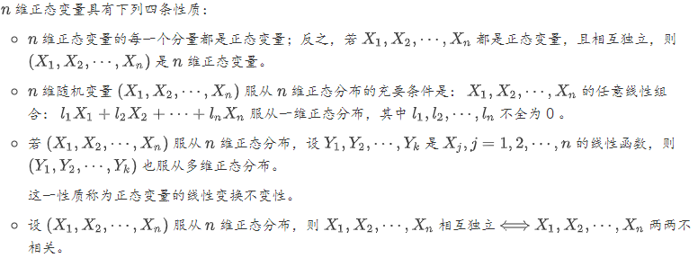
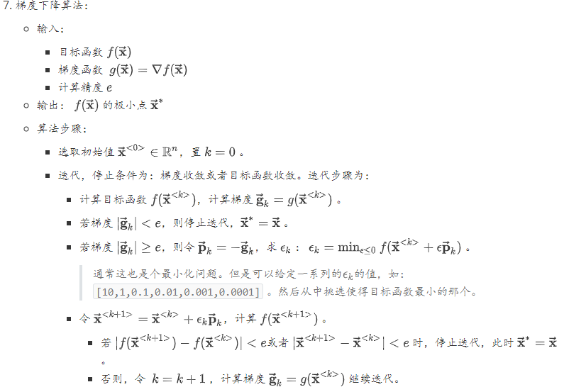
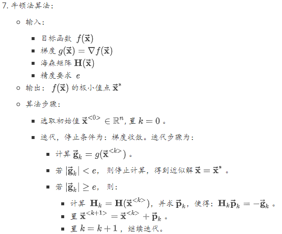
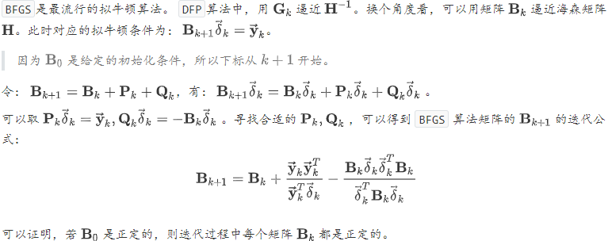
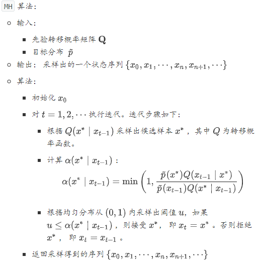
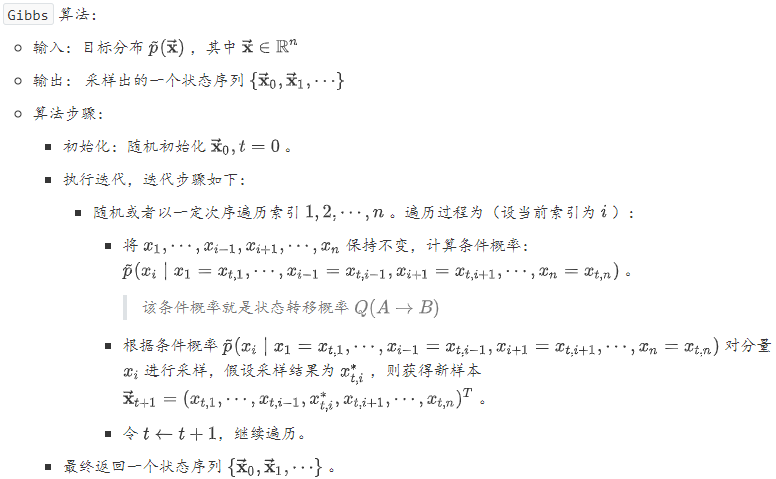

### 数学基础

所有的向量都是列向量的形式：$\vec{\mathbf{x}}=\left(x_{1}, x_{2}, \cdots, x_{n}\right)^{T}$。$F$范数：$\|\mathbf{A}\|_{F}=\sqrt{\sum_{i, j} a_{i, j}^{2}}$，有性质：$\|\mathbf{A}\|_{F}=\sqrt{\operatorname{tr}\left(\mathbf{A} \mathbf{A}^{T}\right)}$

$$
\vec{\mathbf{x}}\vec{\mathbf{y}}^T=\vec{\mathbf{x}} \otimes \vec{\mathbf{y}}
$$
阿达马积：$\text{Hadamard product}$逐元素积
$$
\mathbf{A} \circ \mathbf{B}=\left[ \begin{array}{cccc}{a_{1,1} b_{1,1}} & {a_{1,2} b_{1,2}} & {\dots} & {a_{1, n} b_{1, n}} \\ {a_{2,1} b_{2,1}} & {a_{2,2} b_{2,2}} & {\dots} & {a_{2, n} b_{2, n}} \\ {\vdots} & {\vdots} & {\ddots} & {\vdots} \\ {a_{m, 1} b_{m, 1}} & {a_{m, 2} b_{m, 2}} & {\dots} & {a_{m, n} b_{m, n}}\end{array}\right]
$$
克罗内积：$\text{Kronnecker product}$
$$
\mathbf{A} \otimes \mathbf{B}=\left[ \begin{array}{cccc}{a_{1,1} \mathbf{B}} & {a_{1,2} \mathbf{B}} & {\cdots} & {a_{1, n} \mathbf{B}} \\ {a_{2,1} \mathbf{B}} & {a_{2,2} \mathbf{B}} & {\cdots} & {a_{2, n} \mathbf{B}} \\ {\vdots} & {\vdots} & {\ddots} & {\vdots} \\ {a_{m, 1} \mathbf{B}} & {a_{m, 2} \mathbf{B}} & {\cdots} & {a_{m, n} \mathbf{B}}\end{array}\right]
$$

#### 线性代数

##### 矩阵运算

$\vec{\mathbf{x}}, \vec{\mathbf{a}}, \vec{\mathbf{b}}, \vec{\mathbf{c}}$为$n$阶向量，$\mathbf{A}, \mathbf{B}, \mathbf{C}, \mathbf{X}$为$n$阶方阵，则有：
$$
\begin{array}{1}
\frac{\partial\left(\overrightarrow{\mathbf{a}}^{T} \overrightarrow{\mathbf{x}}\right)}{\partial \overrightarrow{\mathbf{x}}}=\frac{\partial\left(\overrightarrow{\mathbf{x}}^{T} \overrightarrow{\mathbf{a}}\right)}{\partial \overrightarrow{\mathbf{x}}}=\overrightarrow{\mathbf{a}}\\
\frac{\partial\left(\overrightarrow{\mathbf{a}}^{T} \mathbf{X} \overrightarrow{\mathbf{b}}\right)}{\partial \mathbf{X}}=\overrightarrow{\mathbf{a}} \overrightarrow{\mathbf{b}}^{T}=\overrightarrow{\mathbf{a}} \otimes \overrightarrow{\mathbf{b}} \in \mathbb{R}^{n \times n}\\
\frac{\partial\left(\overrightarrow{\mathbf{a}}^{T} \mathbf{X}^{T} \overrightarrow{\mathbf{b}}\right)}{\partial \mathbf{X}}=\overrightarrow{\mathbf{b}} \overrightarrow{\mathbf{a}}^{T}=\overrightarrow{\mathbf{b}} \otimes \overrightarrow{\mathbf{a}} \in \mathbb{R}^{n \times n}\\
\frac{\partial\left(\overrightarrow{\mathbf{a}}^{T} \mathbf{X} \overrightarrow{\mathbf{a}}\right)}{\partial \mathbf{X}}=\frac{\partial\left(\overrightarrow{\mathbf{a}}^{T} \mathbf{X}^{T} \overrightarrow{\mathbf{a}}\right)}{\partial \mathbf{X}}=\overrightarrow{\mathbf{a}} \otimes \overrightarrow{\mathbf{a}}\\
\frac{\partial\left(\overrightarrow{\mathbf{a}}^{T} \mathbf{X}^{T} \mathbf{X} \overrightarrow{\mathbf{b}}\right)}{\partial \mathbf{X}}=\mathbf{X}(\overrightarrow{\mathbf{a}} \otimes \overrightarrow{\mathbf{b}}+\overrightarrow{\mathbf{b}} \otimes \overrightarrow{\mathbf{a}})\\
\frac{\partial\left[(\mathbf{A} \overrightarrow{\mathbf{x}}+\overrightarrow{\mathbf{a}})^{T} \mathbf{C}(\mathbf{B} \overrightarrow{\mathbf{x}}+\overrightarrow{\mathbf{b}})\right]}{\partial \overrightarrow{\mathbf{x}}}=\mathbf{A}^{T} \mathbf{C}(\mathbf{B} \overrightarrow{\mathbf{x}}+\overrightarrow{\mathbf{b}})+\mathbf{B}^{T} \mathbf{C}(\mathbf{A} \overrightarrow{\mathbf{x}}+\overrightarrow{\mathbf{a}})\\
\frac{\partial\left(\overrightarrow{\mathbf{x}}^{T} \mathbf{A} \overrightarrow{\mathbf{x}}\right)}{\partial \overrightarrow{\mathbf{x}}}=\left(\mathbf{A}+\mathbf{A}^{T}\right) \overrightarrow{\mathbf{x}}\\
\frac{\partial\left[(\mathbf{X} \overrightarrow{\mathbf{b}}+\overrightarrow{\mathbf{c}})^{T} \mathbf{A}(\mathbf{X} \overrightarrow{\mathbf{b}}+\overrightarrow{\mathbf{c}})\right]}{\partial \mathbf{X}}=\left(\mathbf{A}+\mathbf{A}^{T}\right)(\mathbf{X} \overrightarrow{\mathbf{b}}+\overrightarrow{\mathbf{c}}) \overrightarrow{\mathbf{b}}^{T}\\
\frac{\partial\left(\overrightarrow{\mathbf{b}}^{T} \mathbf{X}^{T} \mathbf{A} \mathbf{X} \overrightarrow{\mathbf{c}}\right)}{\partial \mathbf{X}}=\mathbf{A}^{T} \mathbf{X} \overrightarrow{\mathbf{b}} \overrightarrow{\mathbf{c}}^{T}+\mathbf{A} \mathbf{X} \overrightarrow{\mathbf{c}} \overrightarrow{\mathbf{b}}^{T}
\end{array}
$$
如果$f$是一元函数，则：其逐元向量函数为：$f(\vec{\mathbf{x}})=\left(f\left(x_{1}\right), f\left(x_{2}\right), \cdots, f\left(x_{n}\right)\right)^{T}$，其逐矩阵函数为：
$$
f(\mathbf{X})=\left[ \begin{array}{cccc}{f\left(x_{1,1}\right)} & {f\left(x_{1,2}\right)} & {\cdots} & {f\left(x_{1, n}\right)} \\ {f\left(x_{2,1}\right)} & {f\left(x_{2,2}\right)} & {\cdots} & {f\left(x_{2, n}\right)} \\ {\vdots} & {\vdots} & {\ddots} & {\vdots} \\ {f\left(x_{m, 1}\right)} & {f\left(x_{m, 2}\right)} & {\cdots} & {f\left(x_{m, n}\right)}\end{array}\right]
$$
其逐元导数分别为：
$$
\begin{array}{1}
f^{\prime}(\overrightarrow{\mathbf{x}})=\left(f^{\prime}(x 1), f^{\prime}(x 2), \cdots, f^{\prime}\left(x_{n}\right)\right)^{T}\\
f^{\prime}(\mathbf{X})=\left[ \begin{array}{cccc}{f^{\prime}\left(x_{1,1}\right)} & {f^{\prime}\left(x_{1,2}\right)} & {\cdots} & {f^{\prime}\left(x_{1, n}\right)} \\ {f^{\prime}\left(x_{2,1}\right)} & {f^{\prime}\left(x_{2,2}\right)} & {\cdots} & {f^{\prime}\left(x_{2, n}\right)} \\ {\vdots} & {\vdots} & {\ddots} & {\vdots} \\ {f^{\prime}\left(x_{m, 1}\right)} & {f^{\prime}\left(x_{m, 2}\right)} & {\cdots} & {f^{\prime}\left(x_{m, n}\right)}\end{array}\right]
\end{array}
$$
各种类型的偏导数: 标量对向量的偏导数：$\frac{\partial u}{\partial \vec{\mathbf{v}}}=\left(\frac{\partial u}{\partial v_{1}}, \frac{\partial u}{\partial v_{2}}, \cdots, \frac{\partial u}{\partial v_{n}}\right)^{T}$标量对矩阵的偏导数：
$$
\frac{\partial u}{\partial \mathbf{V}}=\left[ \begin{array}{cccc}{\frac{\partial u}{\partial V_{1,1}}} & {\frac{\partial u}{\partial V_{1,2}}} & {\cdots} & {\frac{\partial w}{\partial V_{1, n}}} \\ {\frac{\partial u}{\partial V_{2,1}}} & {\frac{\partial u}{\partial V_{2,2}}} & {\cdots} & {\frac{\partial u}{\partial V_{2,1}}} \\ {\vdots} & {\vdots} & {\ddots} & {\vdots} \\ {\frac{\partial u}{\partial V_{m, 1}}} & {\frac{\partial u}{\partial V_{m, 2}}} & {\cdots} & {\frac{\partial u}{\partial V_{m, n}}}\end{array}\right]
$$
向量对标量的偏导数，向量对向量的偏导数，矩阵对标量的偏导数。
$$
\begin{array}{1}
\frac{\partial[t r(f(\mathbf{X}))]}{\partial \mathbf{X}}=\left(f^{\prime}(\mathbf{X})\right)^{T}\\
\frac{\partial[t r(\mathbf{A} \mathbf{X} \mathbf{B})]}{\partial \mathbf{X}}=\mathbf{A}^{T} \mathbf{B}^{T}\\
\frac{\partial\left[t r\left(\mathbf{A} \mathbf{X}^{T} \mathbf{B}\right)\right]}{\partial \mathbf{X}}=\mathbf{B} \mathbf{A}\\
\frac{\partial[\operatorname{tr}(\mathbf{A} \otimes \mathbf{X})]}{\partial \mathbf{X}}=\operatorname{tr}(\mathbf{A}) \mathbf{I}\\
\frac{\partial[\operatorname{tr}(\mathbf{A} \mathbf{X} \mathbf{B} \mathbf{X})]}{\partial \mathbf{X}}=\mathbf{A}^{T} \mathbf{X}^{T} \mathbf{B}^{T}+\mathbf{B}^{T} \mathbf{X} \mathbf{A}^{T}\\
\frac{\partial\left[t r\left(\mathbf{X}^{T} \mathbf{B} \mathbf{X} \mathbf{C}\right)\right]}{\partial \mathbf{X}}=\mathbf{B X C}+\mathbf{B}^{T} \mathbf{X} \mathbf{C}^{T}\\
\frac{\partial\left[\operatorname{tr}\left(\mathbf{C}^{T} \mathbf{X}^{T} \mathbf{B} \mathbf{X} \mathbf{C}\right)\right]}{\partial \mathbf{X}}=\left(\mathbf{B}^{T}+\mathbf{B}\right) \mathbf{X} \mathbf{C} \mathbf{C}^{T}\\
\frac{\partial\left[t r\left(\mathbf{A} \mathbf{X} \mathbf{B} \mathbf{X}^{T} \mathbf{C}\right)\right]}{\partial \mathbf{X}}=\mathbf{A}^{T} \mathbf{C}^{T} \mathbf{X B}^{T}+\mathbf{C A X B}\\
\frac{\partial[\operatorname{tr}((\mathbf{A} \mathbf{X} \mathbf{B}+\mathbf{C})(\mathbf{A} \mathbf{X} \mathbf{B}+\mathbf{C}))]}{\partial \mathbf{X}}=2 \mathbf{A}^{T}(\mathbf{A} \mathbf{X} \mathbf{B}+\mathbf{C}) \mathbf{B}^{T}
\end{array}
$$

假设$\mathbf{U}=f(\mathbf{X})$是关于$\mathbf{X}$的矩阵值函数$(f : \mathbb{R}^{m \times n} \rightarrow \mathbb{R}^{m \times n})$，且$g(\mathbf{U})$是关于$\mathbf{U}$的实值函数$(g : \mathbb{R}^{m \times n} \rightarrow \mathbb{R})$，则下面链式法则成立：
$$
\begin{array}{l}\frac{\partial g(\mathbf{U})}{\partial \mathbf{X}}=\left(\frac{\partial g(\mathbf{U})}{\partial x_{i, j}}\right)_{m \times n}\\
=\left(\sum_{k} \sum_{l} \frac{\partial g(\mathbf{U})}{\partial u_{k, l}} \frac{\partial u_{k, l}}{\partial x_{i, j}}\right)_{m \times n}=\left(t r\left[\left(\frac{\partial g(\mathbf{U})}{\partial \mathbf{U}}\right)^{T} \frac{\partial \mathbf{U}}{\partial x_{i, j}}\right]\right)_{m \times n}
\end{array}
$$

#### 概率论与随机过程

$$
\begin{array}{l}
P\left(X_{1}, X_{2}, \cdots, X_{n}\right)=P\left(X_{1}\right) \prod_{i=2}^{n} P\left(X_{i} | X_{1}, \cdots, X_{i-1}\right)\\
P(X, Y | Z)=P(X | Z) P(Y | Z)\\
\mathbb{E}_{X \sim P(X)}[g(X)]=\int g(x) p(x) d x\\
\mathbb{E}[Z]=\mathbb{E}[g(X, Y)]=\int_{-\infty}^{\infty} \int_{-\infty}^{\infty} g(x, y) p(x, y) d x d y\\
\operatorname{Cov}[f(X), g(Y)]=\mathbb{E}[(f(X)-\mathbb{E}[f(X)])(g(Y)-\mathbb{E}[g(Y)])]\\
\text{k阶原点矩}:\mathbb{E}\left[X^{k}\right]\\
\text{k阶中心距}: \mathbb{E}\left[(X-\mathbb{E}[X])^{k}\right]\\

\end{array}
$$

###### 信息论

信息熵的定义公式：
$$
H(X) = -\sum_{x\in\mathcal{X}}p(x)\log p(x)
$$
两个离散随机变量$\mathbf{X}$和$\mathbf{Y}$的互信息定义为：
$$
I(\mathbf{X},\mathbf{Y}) = \sum_{x\in\mathcal{X}}\sum_{y\in\mathcal{Y}}p(x,y)\log(\frac{p(x,y)}{p(x)p(y)})
$$
两个离散随机变量$\mathbf{X}$和$\mathbf{Y}$的联合熵为：
$$
H(\mathbf{X},\mathbf{Y})=\sum_{x\in\mathcal{X}}\sum_{y\in\mathcal{Y}}p(x,y)\log p(x,y)
$$
条件熵$H(\mathbf{X},\mathbf{Y})$表示在已知随机变量$\mathbf{X}$的条件下随机变量$\mathbf{Y}$的不确定性。
$$
H(Y | X)=\mathbb{E}_{X \sim P(X)}[H(Y | X=x)]=-\mathbb{E}_{(X, Y) \sim P(X, Y)} \log P(Y | X)\\
H(Y | X) = \sum_{x\in\mathcal{X}}p(x)H(Y|x)=-\sum_{x\in\mathcal{X}}p(x)\sum_{y\in\mathcal{Y}}p(y|x)\log p(y|x)
$$
设$p(x)$和$q(x)$离散随机变量$\mathbf{X}$的两个概率分布，其中$p(x)$为真实分布，$q(x)$为非真实分布。交叉熵
$$
H(P, Q)=H(P)+D_{K L}(P \| Q)=-\mathbb{E}_{X \sim P(X)} \log Q(x)
\\H(p,q) = -\sum_{x}p(x)\log q(x)
$$
则$p$对$q$的相对熵为
$$
D_{K L}(P \| Q)=\mathbb{E}_{X \sim P(X)}\left[\log \frac{P(x)}{Q(x)}\right]=\mathbb{E}_{X \sim P(X)}[\log P(x)-\log Q(x)]\\
D_{KL}(p||q) = \sum_{x}p(x)\log\frac{p(x)}{q(x)}
$$

#### 数值计算

一种严重的误差是下溢出`underflow`：当接近零的数字四舍五入为零时，发生下溢出。一种严重的误差是上溢出`overflow`：当数值非常大，超过了计算机的表示范围时，发生上溢出。

##### 数值稳定性

`Conditioning`刻画了一个函数的如下特性：当函数的输入发生了微小的变化时，函数的输出的变化有多大。对于`Conditioning`较大的函数，在数值计算中可能有问题。因为函数输入的舍入误差可能导致函数输出的较大变化。对于方阵$\mathbf{A} \in \mathbb{R}^{n \times n}$，其条件数`condition number`为：

$\text{condition number}$ $=\max _{1 \leq i, j \leq n, i \neq j}\left|\frac{\lambda_{i}}{\lambda_{j}}\right|$, 其中$\lambda_{i}, i=1,2, \cdots, n $ 为$\mathbf{A}$的特征值。当方阵的条件数很大时，矩阵的求逆将对误差特别敏感。条件数是矩阵本身的特性，它会放大那些包含矩阵求逆运算过程中的误差。

##### 海森矩阵与学习率

$f(\vec{\mathbf{x}}) \approx f\left(\vec{\mathbf{x}}_{0}\right)+\left(\vec{\mathbf{x}}-\vec{\mathbf{x}}_{0}\right)^{T} \vec{\mathbf{g}}+\frac{1}{2}\left(\vec{\mathbf{x}}-\vec{\mathbf{x}}_{0}\right)^{T} \mathbf{H}\left(\vec{\mathbf{x}}-\vec{\mathbf{x}}_{0}\right)$, 应用到梯度计算时：$f\left(\vec{\mathbf{x}}_{0}-\epsilon \vec{\mathbf{g}}\right) \approx f\left(\vec{\mathbf{x}}_{0}\right)-\epsilon \vec{\mathbf{g}}^{T} \vec{\mathbf{g}}+\frac{1}{2} \epsilon^{2} \vec{\mathbf{g}}^{T} \mathbf{H} \vec{\mathbf{g}}$。$\frac{1}{2} \epsilon^{2} \vec{\mathrm{g}}^{T} \mathrm{H} \vec{\mathrm{g}}$较大时，可能会导致：沿着负梯度的方向，函数值反而增加。当海森矩阵的条件数较大时，不同方向的梯度的变化差异很大。在某些方向上，梯度变化很快；在有些方向上，梯度变化很慢。梯度下降法未能利用海森矩阵，也就不知道应该优先搜索导数长期为负或者长期为正的方向。本质上应该沿着负梯度方向搜索。但是沿着该方向的一段区间内，如果导数一直为正或者一直为负，则可以直接跨过该区间。前提是：必须保证该区间内，该方向导数不会发生正负改变。当海森矩阵的条件数较大时，也难以选择合适的步长。步长必须足够小，从而能够适应较强曲率的地方。但是如果步长太小，对于曲率较小的地方则推进太慢。

考虑泰勒展开式：$f(\overrightarrow{\mathbf{x}}) \approx f\left(\overrightarrow{\mathbf{x}}_{0}\right)+\left(\overrightarrow{\mathbf{x}}-\overrightarrow{\mathbf{x}}_{0}\right)^{T} \overrightarrow{\mathbf{g}}+\frac{1}{2}\left(\overrightarrow{\mathbf{x}}-\overrightarrow{\mathbf{x}}_{0}\right)^{T} \mathbf{H}\left(\overrightarrow{\mathbf{x}}-\overrightarrow{\mathbf{x}}_{0}\right)$。其中$\vec{\mathbf{g}}$为$\vec{\mathbf{x}}_0$处的梯度；$\mathbf{H}$为$\vec{\mathbf{x}}_0$处的海森矩阵。如果$\vec{\mathbf{x}}$为极值点，则有：$\frac{\partial}{\partial \overrightarrow{\mathbf{x}}} f(\overrightarrow{\mathbf{x}})=\overrightarrow{0}$，则有：$\overrightarrow{\mathbf{x}}^{*}=\overrightarrow{\mathbf{x}}_{0}-\mathbf{H}^{-1} \overrightarrow{\mathrm{g}}$。当$f$是个正定的二次型，则牛顿法直接一次就能到达最小值点。当$f$不是正定的二次型，则可以在局部近似为正定的二次型，那么则采用多次牛顿法即可到达最小值点。

深度学习中的目标函数非常复杂，无法保证可以通过上述优化算法进行优化。因此有时会限定目标函数具有`Lipschitz`连续，或者其导数`Lipschitz`连续。

`Lipschitz`连续的定义：对于函数$f$，存在一个`Lipschitz`常数$\mathcal{L}$，使得
$$
\forall \overrightarrow{\mathbf{x}}, \forall \overrightarrow{\mathbf{y}},|f(\overrightarrow{\mathbf{x}})-f(\overrightarrow{\mathbf{y}})| \leq \mathcal{L}| | \overrightarrow{\mathbf{x}}-\overrightarrow{\mathbf{y}}| |_{2}
$$
`Lipschitz`连续的意义是：输入的一个很小的变化，会引起输出的一个很小的变化。

##### 拟牛顿法

###### 原理

在牛顿法的迭代中，需要计算海森矩阵的逆矩阵$\mathbf{H}^{-1}$，这一计算比较复杂。可以考虑用一个$n$阶矩阵$\mathbf{G}_{k}=G(\overrightarrow{\mathbf{x}}^{<k>})$来近似代替$\mathbf{H}_{k}^{-1}=H^{-1}(\overrightarrow{\mathbf{x}}^{<k>})$。先看海森矩阵满足的条件：$\overrightarrow{\mathbf{g}}_{k+1}-\overrightarrow{\mathbf{g}}_{k}=\mathbf{H}_{k}(\overrightarrow{\mathbf{x}}^{<k+1>}-\overrightarrow{\mathbf{x}}^{<k>})$。令$\overrightarrow{\mathbf{y}}_{k}=\overrightarrow{\mathbf{g}}_{k+1}-\overrightarrow{\mathbf{g}}_{k}, \vec{\delta}_{k}=\overrightarrow{\mathbf{x}}^{<k+1>}-\overrightarrow{\mathbf{x}}^{<k>}$。则有：$\overrightarrow{\mathbf{y}}_{k}=\mathbf{H}_{k} \vec{\delta}_{k}$，或者$\mathbf{H}_{k}^{-1} \overrightarrow{\mathbf{y}}_{k}=\vec{\delta}_{k}$。这称为拟牛顿条件。根据牛顿法的迭代：$\overrightarrow{\mathbf{x}}^{<k+1>}=\overrightarrow{\mathbf{x}}^{<k>}-\mathbf{H}_{k}^{-1} \overrightarrow{\mathbf{g}}_{k}$，将$f(\vec{\mathbf{x}})$在$\overrightarrow{\mathbf{x}}^{<k>}$的一阶泰勒展开：
$$
\begin{array}{l}{f\left(\overrightarrow{\mathbf{x}}^{<k+1>}\right)=f\left(\overrightarrow{\mathbf{x}}^{<k>}\right)+f^{\prime}\left(\overrightarrow{\mathbf{x}}^{<k>}\right)\left(\overrightarrow{\mathbf{x}}^{<k+1>}-\overrightarrow{\mathbf{x}}^{<k>}\right)} \\ {=f\left(\overrightarrow{\mathbf{x}}^{<k>}\right)+\overrightarrow{\mathbf{g}}_{k}^{T}\left(-\mathbf{H}_{k}^{-1} \overrightarrow{\mathbf{g}}_{k}\right)=f\left(\overrightarrow{\mathbf{x}}^{<k>}\right)-\overrightarrow{\mathbf{g}}_{k}^{T} \mathbf{H}_{k}^{-1} \overrightarrow{\mathbf{g}}_{k}}\end{array}
$$
当$\mathbf{H}_K$是正定矩阵时，总有$f(\overrightarrow{\mathbf{x}}^{<k+1>})<f(\overrightarrow{\mathbf{x}}^{<k>})$，因此每次都是沿着函数递减的方向迭代。如果选择$\mathbf{G}_k$作为$\mathbf{H}_k^{-1}$的近似时， 同样要满足两个条件：$\mathbf{G}_k$必须是正定的。$\mathbf{G}_k$满足拟牛顿条件：$\mathbf{G}_{k+1} \overrightarrow{\mathbf{y}}_{k}=\vec{\delta}_{k}$。因为$\mathbf{G}_0$是给定的初始化条件，所以下标从$k+1$开始。按照拟牛顿条件，在每次迭代中可以选择更新矩阵$\mathbf{G}_{k+1}=\mathbf{G}_{k}+\Delta \mathbf{G}_{k}$。

##### 约束最优化

约束最优化问题的原始问题：假设$f(\overrightarrow{\mathbf{x}}), c_{i}(\overrightarrow{\mathbf{x}}), h_{j}(\overrightarrow{\mathbf{x}})$是定义在$\mathbb{R}^{n}$上的连续可微函数。考虑约束最优化问题：
$$
\begin{array}{c}{\operatorname{min}_{\vec{x} \in \mathbb{R}^{n}} f(\overrightarrow{\mathbf{x}})} \\ {\text {s.t. } \quad c_{i}(\overrightarrow{\mathbf{x}}) \leq 0, i=1,2, \cdots, k ; \quad h_{j}(\overrightarrow{\mathbf{x}})=0, j=1,2, \cdots, l}\end{array}
$$
可行域有等式和不等式共同确定$\mathrm{S}=\left\{\overrightarrow{\mathbf{x}} | c_{i}(\overrightarrow{\mathbf{x}}) \leq 0, i=1,2, \cdots, k ; \quad h_{j}(\overrightarrow{\mathbf{x}})=0, j=1,2, \cdots, l\right\}$

引入拉格朗日函数：$L(\overrightarrow{\mathbf{x}}, \vec{\alpha}, \vec{\beta})=f(\overrightarrow{\mathbf{x}})+\sum_{i=1}^{k} \alpha_{i} c_{i}(\overrightarrow{\mathbf{x}})+\sum_{j=1}^{l} \beta_{j} h_{j}(\overrightarrow{\mathbf{x}})$这里$\overrightarrow{\mathbf{x}}=\left(x_{1}, x_{2}, \cdots, x_{n}\right)^{T} \in \mathbb{R}^{n}, \alpha_{i}, \beta_{j}$是拉格朗日乘子，$\alpha_{i} \geq 0$。定义函数：$\theta_{P}(\overrightarrow{\mathbf{x}})=\max _{\vec{\alpha}, \vec{\beta} : \alpha_{i} \geq 0} L(\overrightarrow{\mathbf{x}}, \vec{\alpha}, \vec{\beta})$其中下标$\mathbf{P}$表示原始问题。则有：
$$
\theta_{P}(\overrightarrow{\mathbf{x}})=\left\{\begin{array}{ll}{f(\overrightarrow{\mathbf{x}}),} & {\text { if } \overrightarrow{\mathbf{x}} \text { statisfy original problem's constraint }} \\ {+\infty,} & {\text { or else. }}\end{array}\right.
$$
若$\vec{\mathbf{x}}$满足原问题的约束，则很容易证明$L(\overrightarrow{\mathbf{x}}, \vec{\alpha}, \vec{\beta})=f(\overrightarrow{\mathbf{x}})+\sum_{i=1}^{k} \alpha_{i} c_{i}(\overrightarrow{\mathbf{x}}) \leq f(\overrightarrow{\mathbf{x}})$，等号在$\alpha_i =0$时取到。若$\vec{\mathbf{x}}$不满足原问题的约束：若不满足$c_{i}(\overrightarrow{\mathbf{x}}) \leq 0$：设违反的为$c_{i_{0}}(\overrightarrow{\mathbf{x}})>0$，则令$\vec{\alpha}_{i_{0}} \rightarrow \infty$，有：$L(\overrightarrow{\mathbf{x}}, \vec{\alpha}, \vec{\beta})=f(\overrightarrow{\mathbf{x}})+\sum_{i=1}^{k} \alpha_{i} c_{i}(\overrightarrow{\mathbf{x}}) \rightarrow \infty$。若不满足$h_{j}(\overrightarrow{\mathbf{x}})=0$： 设违反的为$h_{j_{0}}(\overrightarrow{\mathbf{x}}) \neq 0$，则令$\vec{\beta}_{j_{0}} h_{j_{0}}(\overrightarrow{\mathbf{x}}) \rightarrow \infty$，有：$L(\overrightarrow{\mathbf{x}}, \vec{\alpha}, \vec{\beta})=f(\overrightarrow{\mathbf{x}})+\sum_{i=1}^{k} \alpha_{i} c_{i}(\overrightarrow{\mathbf{x}})+\vec{\beta}_{j_{0}} h_{j_{0}}(\overrightarrow{\mathbf{x}}) \rightarrow \infty$。

考虑极小化问题：$\min _{\overrightarrow{\mathbf{x}}} \theta_{P}(\overrightarrow{\mathbf{x}})=\min _{\overrightarrow{\mathbf{x}}} \max _{\vec{\alpha}, \vec{\beta} : \alpha_{i} \geq 0} L(\overrightarrow{\mathbf{x}}, \vec{\alpha}, \vec{\beta})$则该问题是与原始最优化问题是等价的，即他们有相同的问题。$\min _{\overrightarrow{\mathbf{x}}} \max _{\vec{\alpha}, \vec{\beta}} : \alpha_{i} \geq 0 \quad L(\overrightarrow{\mathbf{x}}, \vec{\alpha}, \vec{\beta})$称为广义拉格朗日函数的极大极小问题。为了方便讨论，定义原始问题的最优值为：$p^{*}=\min _{\overrightarrow{\mathbf{x}}} \theta_{P}(\overrightarrow{\mathbf{x}})$。

定义$\theta_{D}(\vec{\alpha}, \vec{\beta})=\min _{\overrightarrow{\mathbf{x}}} L(\overrightarrow{\mathbf{x}}, \vec{\alpha}, \vec{\beta})$，考虑极大化$\theta_{D}(\vec{\alpha}, \vec{\beta})$，即：
$$
\max _{\vec{\alpha}, \vec{\beta} : \alpha_{i} \geq 0} \theta_{D}(\vec{\alpha}, \vec{\beta})=\max _{\vec{\alpha}, \vec{\beta} : \alpha_{i} \geq 0} L(\overrightarrow{\mathbf{x}}, \vec{\alpha}, \vec{\beta})
$$
问题$\max _{\widetilde{\alpha}, \vec{\beta}} : \alpha_{i} \geq 0 \quad \min _{\overrightarrow{\mathbf{x}}} L(\overrightarrow{\mathbf{x}}, \vec{\alpha}, \vec{\beta})$称为广义拉格朗日函数的极大极小问题。它可以表示为约束最优化问题：
$$
\begin{array}{c}{\max _{\vec{\alpha}, \vec{\beta} : \alpha_{i} \geq 0} \theta_{D}(\vec{\alpha}, \vec{\beta})=\max _{\vec{\alpha}, \vec{\beta}} \min _{\vec{x}} L(\overrightarrow{\mathbf{x}}, \vec{\alpha}, \vec{\beta})} \\ {\text { s.t. } \alpha_{i} \geq 0, i=1,2, \cdots, k}\end{array}
$$
称为原始问题的对偶问题。为了方便讨论，定义对偶问题的最优值为：$d^{*}=\max _{\vec{\alpha}, \overline{\beta} : \alpha_{i} \geq 0}  \theta^{\theta_{D}(\vec{\alpha}, \vec{\beta})}$。定理一：若原问题和对偶问题具有最优值，则：
$$
d^{*}=\max _{\vec{\alpha}, \vec{\beta} : \vec{\alpha}_{i} \geq 0} \min _{\vec{x}} L(\overrightarrow{\mathbf{x}}, \vec{\alpha}, \vec{\beta}) \leq \min _{\overrightarrow{\mathbf{x}}} \max _{\vec{\alpha}, \vec{\beta} : \vec{\alpha}_{i} \geq 0} L(\overrightarrow{\mathbf{x}}, \vec{\alpha}, \vec{\beta})=p^{*}
$$
推论一：设$\vec{\mathbf{x}}^*$为原始问题的可行解，且$\theta_P(\vec{\mathbf{x}}^*)$的值为$p^*$；$\vec{\alpha}^{*}, \vec{\beta}^{*}$为对偶问题的可行解，$\theta_{D}\left(\vec{\alpha}^{*}, \vec{\beta}^{*}\right)$值为$d^*$。如果有$p^{*}=d^{*}$，则$\overrightarrow{\mathbf{x}}^{*}, \vec{\alpha}^{*}, \vec{\beta}^{*}$分别为原始问题和对偶问题的最优解。定理二：假设函数$f(\vec{x})$和$c_{i}(\overrightarrow{\mathbf{x}})$为凸函数，$h_{j}(\overrightarrow{\mathbf{x}})$是仿射函数；并且假设不等式约束$c_{i}(\overrightarrow{\mathbf{x}})$是严格可行的，即存在$\vec{\mathbf{x}}$，对于所有$i$有$c_{i}(x)<0$。则存在$\overrightarrow{\mathbf{x}}^{*}, \vec{\alpha}^{*}, \vec{\beta}$，使得：$\vec{\mathbf{x}}^*$是原始问题$\min _{\vec{x}} \theta_{P}(\vec{x})$的解，$\vec{\alpha}^{*}, \vec{\beta}^{*}$是对偶问题$d^{*}=\max _{\vec{\alpha}, \overline{\beta} : \alpha_{i} \geq 0}  \theta^{\theta_{D}(\vec{\alpha}, \vec{\beta})}$的解，并且$p^{*}=d^{*}=L\left(\overrightarrow{\mathbf{x}}^{*}, \vec{\alpha}^{*}, \vec{\beta}^{*}\right)$。定理三：假设函数$f(\vec{x})$和$c_{i}(\overrightarrow{\mathbf{x}})$为凸函数，$h_{j}(\overrightarrow{\mathbf{x}})$是仿射函数；并且假设不等式约束$c_{i}(\overrightarrow{\mathbf{x}})$是严格可行的，即存在$\vec{\mathbf{x}}$，对于所有$i$有$c_{i}(x)<0$。则存在$\overrightarrow{\mathbf{x}}^{*}, \vec{\alpha}^{*}, \vec{\beta}$，使得：$\vec{\mathbf{x}}^*$是原始问题$\min _{\vec{x}} \theta_{P}(\vec{x})$的解，$\vec{\alpha}^{*}, \vec{\beta}^{*}$是对偶问题$d^{*}=\max _{\vec{\alpha}, \overline{\beta} : \alpha_{i} \geq 0}  \theta^{\theta_{D}(\vec{\alpha}, \vec{\beta})}$的解的充要条件是：$\overrightarrow{\mathbf{x}}^{*}, \vec{\alpha}^{*}, \vec{\beta}$满足下面的 `Karush-kuhn-Tucker(KKT)`条件：
$$
\begin{array}{c}{\nabla_{\overrightarrow{\mathbf{x}}} L\left(\overrightarrow{\mathbf{x}}^{*}, \vec{\alpha}^{*}, \vec{\beta}^{*}\right)=0} \\ {\nabla_{\vec{\alpha}} L\left(\overrightarrow{\mathbf{x}}^{*}, \vec{\alpha}^{*}, \vec{\beta}^{*}\right)=0} \\ {\nabla_{\vec{\beta}} L\left(\overrightarrow{\mathbf{x}}^{*}, \vec{\alpha}^{*}, \vec{\beta}^{*}\right)=0} \\ {\vec{\alpha}_{i}^{*} c_{i}\left(\overrightarrow{\mathbf{x}}^{*}\right)=0, i=1,2, \cdots, k} \\ {\vec{\alpha}_{i}\left(\overrightarrow{\mathbf{x}}^{*}\right) \leq 0, i=1,2, \cdots, k} \\ {\vec{\alpha}_{i}^{*} \geq 0, i=1,2, \cdots, k} \\ {h_{j}\left(\overrightarrow{\mathbf{x}}^{*}\right)=0, j=1,2, \cdots, l}\end{array}
$$
仿射函数：仿射函数即由`1`阶多项式构成的函数。一般形式为$f(\overrightarrow{\mathbf{x}})=\mathbf{A} \overrightarrow{\mathbf{x}}+b_{\mathrm{o}}$。这里：$\mathbf{A}$是一个$m \times k$矩阵，$\vec{\mathbf{x}}$是一个$k$维列向量，$b$是一个$m$维列向量。它实际上反映了一种从$k$维到$m$维的空间线性映射关系。凸函数：设$f$为定义在区间$\mathcal{X}$上的函数，若对$\mathcal{X}$上的任意两点$\overrightarrow{\mathbf{x}}_{1}, \overrightarrow{\mathbf{x}}_{2}$和任意的实数$\lambda \in(0,1)$，总有$f\left(\lambda \overrightarrow{\mathbf{x}}_{1}+(1-\lambda) \overrightarrow{\mathbf{x}}_{2}\right) \geq \lambda f\left(\overrightarrow{\mathbf{x}}_{1}\right)+(1-\lambda) f\left(\overrightarrow{\mathbf{x}}_{2}\right)$，则$f$称为$\mathcal{X}$上的凸函数 

#### 蒙特卡洛方法与$\text{MCMC}$采样

###### 蒙特卡洛采样

采样问题的主要任务是：根据概率分布$p(x)$，生成一组服从分布$p(x)$的随机数$x_1, x_2, \cdots$。如果$p(x)$就是均匀分布，则均匀分布的采样非常简单。如果$p(x)$是非均匀分布，则可以通过均匀分布的采样来实现。其步骤是：首先根据均匀分布$U(0, 1)$随机生成一个样本$z_i$。设$\tilde{P}(x)$为概率分布$p(x)$的累计分布函数：$\tilde{P}(x)=\int_{-\infty}^{x} p(z) d z$。令$z_{i}=\tilde{P}\left(x_{i}\right)$，计算得到$x_{i}=\tilde{P}^{-1}\left(z_{i}\right)$，其中$\tilde{P}^{-1}$为反函数，则$x_i$为对$p(x)$的采样。

对于复杂的概率分布$p(x)$，难以通过均匀分布来实现采样。此时可以使用`接受-拒绝采样` 策略。首先选定一个容易采样的概率分布$q(x)$，选择一个常数$k$，使得在定义域的所有位置都满足$p(x)\leq k\times q(x)$。然后根据概率分布$q(x)$随机生成一个样本$x_i$。计算$\alpha_{i}=\frac{p\left(x_{i}\right)}{k q\left(x_{i}\right)}$，以概率$\alpha_i$接受该样本。具体做法是：根据均匀分布$U(0, 1)$随机生成一个点$u_i$。如果$u_i \leq \alpha_i$，则接受该样本；否则拒绝该样本。

`接受-拒绝采样` 在高维的情况下会出现两个问题：合适的$q$分布比较难以找到。难以确定一个合理的$k$值。

##### 马尔可夫链

马尔可夫链是满足马尔可夫性质的随机过程。马尔可夫链$X_1, X_2, \cdots$描述了一个状态序列，其中每个状态值取决于前一个状态。$X_t$为随机变量，称为时刻$t$的状态，其取值范围称作状态空间。马尔可夫链的数学定义为： $P\left(X_{t+1} | X_{t}, X_{t-1}, \cdots, X_{1}\right)=P\left(X_{t+1} | X_{t}\right)$

###### 平稳分布

马尔可夫链定理：如果一个非周期马尔可夫链具有转移概率矩阵$\mathbf{P}$ ，且它的任何两个状态是联通的，则有
$$
\pi(j)=\sum_{i=0}^{\infty} \pi(i) P_{i, j}
$$
马尔可夫链的状态不要求有限，可以是无穷多个。非周期性在实际任务中都是满足的。两个状态的连通指的是：状态$i$可以通过有限的$j$步转移到达--并不要求从状态$i$可以直接一步转移到状态$j$。马尔可夫链的任何两个状态是联通的含义是：存在一个$n$，使得矩阵$\mathbf{P}^n$中的任何一个元素的数值都大于零。

如果从一个具体的初始状态$x_0$开始，然后沿着马尔可夫链按照概率转移矩阵做调整，则得到一个转移序列$x_0, x_1, \cdots, x_n, x_{n+1}, \cdots$。根据马尔可夫链的收敛行为，当$n$较大时，$x_n, x_{n+1}, \cdots$将是平稳分布$\vec{\pi}$的样本。

细致平稳性条件：如果非周期马尔可夫链的转移矩阵$\mathbf{P}$和某个分布$\vec{\pi}$满足: $\pi(i) P_{i, j}=\pi(j) P_{j, i}$则$\vec{\pi}$是马尔可夫链的平稳分布。
$$
\pi(i) P_{i, j}=\pi(j) P_{j, i} \rightarrow \sum_{i=1}^{\infty} \pi(i) P_{i, j}=\sum_{i=1}^{\infty} \pi(j) P_{j, i}=\pi(j) \sum_{i=1}^{\infty} P_{j, i}=\pi(j) \rightarrow \vec{\pi} \mathbf{P}=\vec{\pi}
$$

##### $\text{MCMC}$采样

`MCMC` 算法的基本思想是：先设法构造一条马尔可夫链，使其收敛到平稳分布恰好为$\vec{\mathbf{p}}$。然后通过这条马尔可夫链来产生符合$\vec{\mathbf{p}}$分布的样本。最后通过这些样本来进行估计。

假设已经提供了一条马尔可夫链，其转移矩阵为$\mathbf{Q}$。目标是另一个马尔科夫链，使转移矩阵为$\mathbf{P}$、平稳分布是$\tilde{p}$。通常$\tilde{p}(i) Q_{i, j} \neq \tilde{p}(j) Q_{j, i}$，即$\tilde{p}$并不满足细致平稳条件不成立。但是可以改造已有的马尔可夫链，使得细致平稳条件成立。引入一个函数$\alpha(i, j)$，使其满足：$\tilde{p}(i) Q_{i, j} \alpha(i, j)=\tilde{p}(j) Q_{j, i} \alpha(j, i)$。若$\alpha(i, j)=\tilde{p}(j) Q_{j, i}$，则有：
$$
\tilde{p}(i) Q_{i, j} \alpha(i, j)=\tilde{p}(i) Q_{i, j} \tilde{p}(j) Q_{j, i}=\tilde{p}(j) Q_{j, i} \tilde{p}(i) Q_{i, j}=\tilde{p}(j) Q_{j, i} \alpha(j, i)
$$
令：$Q_{i, j}^{\prime}=Q_{i, j} \alpha(i, j), Q_{j, i}^{\prime}=Q_{j, i} \alpha(j, i)$，则有$\tilde{p}(i) Q_{i, j}^{\prime}=\tilde{p}(j) Q_{j, i}^{\prime}$。其中$Q_{i, j}^{\prime}$构成了转移矩阵$\mathbf{Q}^{\prime}$。而$Q^{\prime}$恰好满足细致平稳条件，因此它对应的马尔可夫链的平稳分布就是$\tilde{p}$。

在改造$\mathbf{Q}$的过程中引入的$\alpha(i, j)$称作接受率。其物理意义为：在原来的马尔可夫链上，从状态$i$以$Q_{i, j}$的概率跳转到状态$j$的时候，以$\alpha(i, j)$的概率接受这个转移。如果接受率$\alpha(i, j)$太小，则改造马尔可夫链过程中非常容易原地踏步，拒绝大量的跳转。这样使得马尔可夫链遍历所有的状态空间需要花费太长的时间，收敛到平稳分布$\tilde{p}$的速度太慢。根据推导$\alpha(i, j)=\tilde{p}(j) Q_{j, i}$，如果将系数从$1$提高到$K$，则有：
$$
\begin{aligned} \alpha^{*}(i, j) &=K \tilde{p}(j) Q_{j, i}=K \alpha(i, j) \\ \alpha^{*}(j, i) &=K \tilde{p}(i) Q_{i, j}=K \alpha(j, i) \end{aligned}
$$
提高了接受率，细致平稳条件仍然成立。将$\alpha(i, j), \alpha(j, i)$同比例放大，取：$\alpha(i, j)=\min \left\{\frac{\tilde{p}(j) Q_{j, i}}{\tilde{p}(i) Q_{i, j}}, 1\right\}$。当$\tilde{p}(j) Q_{j, i}=\tilde{p}(i) Q_{i, j}$时：$\alpha(i, j)=\alpha(j, i)=1$，此时满足细致平稳条件。当$\tilde{p}(j) Q_{j, i}>\tilde{p}(i) Q_{i, j}$时：$\alpha(i, j)=1, \alpha(j, i)=\frac{\tilde{p}(i) Q_{i, j}}{\tilde{p}(j) Q_{j, i}}$，此时满足细致平稳条件。当$\tilde{p}(j) Q_{j, i}<\tilde{p}(i) Q_{i, j}$时：$\alpha(i, j)=\frac{\tilde{p}(j) Q_{j, i}}{\tilde{p}(i) Q_{i, i}}, \alpha(j, i)=1$，此时满足细致平稳条件。

###### Gibbs算法

考虑二维的情形：假设有概率分布$\tilde{p}(x, y)$，考察状态空间上$x$坐标相同的两个点$A\left(x_{1}, y_{1}\right), B\left(x_{1}, y_{2}\right)$，可以证明有：
$$
\begin{array}{l}{\tilde{p}\left(x_{1}, y_{1}\right) \tilde{p}\left(y_{2} | x_{1}\right)=\tilde{p}\left(x_{1}\right) \tilde{p}\left(y_{1} | x_{1}\right) \tilde{p}\left(y_{2} | x_{1}\right)} \\ {\tilde{p}\left(x_{1}, y_{2}\right) \tilde{p}\left(y_{1} | x_{1}\right)=\tilde{p}\left(x_{1}\right) \tilde{p}\left(y_{2} | x_{1}\right) \tilde{p}\left(y_{1} | x_{1}\right)}\end{array}
$$
于是$\tilde{p}\left(x_{1}, y_{1}\right) \tilde{p}\left(y_{2} | x_{1}\right)=\tilde{p}\left(x_{1}, y_{2}\right) \tilde{p}\left(y_{1} | x_{1}\right)$。则在$x = x_1$这条平行于$y$轴的直线上，如果使用条件分布$\tilde{p}(y|x_1)$作为直线上任意两点之间的转移概率，则这两点之间的转移满足细致平稳条件。

可以构造状态空间上任意两点之间的转移概率矩阵$\mathbf{Q}$： 对于任意两点$A=\left(x_{A}, y_{A}\right), B=\left(x_{B}, y_{B}\right)$， 令从$A$转移到$B$的概率为$Q(A \rightarrow B)$：如果$x_{A}=x_{B}=x^{*}$，则$Q(A \rightarrow B)=\tilde{p}\left(y_{B} | x^{*}\right)$。如果$y_{A}=y_{B}=y^{*}$，则$Q(A \rightarrow B)=\tilde{p}\left(x_{B} | y^{*}\right)$。否则$Q(A \rightarrow B)=0$。采用该转移矩阵$\mathbf{Q}$，可以证明：对于状态空间中任意两点$A, B$，都满足细致平稳条件：$\tilde{p}(A) Q(A \rightarrow B)=\tilde{p}(B) Q(B \rightarrow A)$，于是这个二维状态空间上的马尔可夫链将收敛到平稳分布$\tilde{p}(x, y)$，这就是吉布斯采样的原理。

