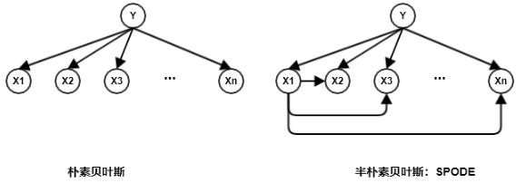
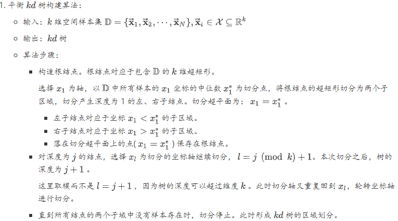
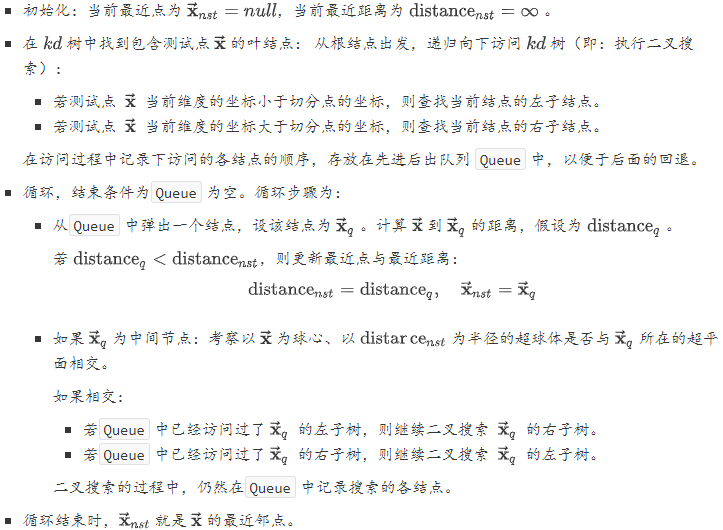

##### 方法概论

机器学习根据任务类型，可以划分为：

- 监督学习任务：从已标记的训练数据来训练模型。 主要分为：分类任务、回归任务、序列标注任务。
- 无监督学习任务：从未标记的训练数据来训练模型。主要分为：聚类任务、降维任务。
- 半监督学习任务：用大量的未标记训练数据和少量的已标记数据来训练模型。
- 强化学习任务：从系统与环境的大量交互知识中训练模型。

没有免费的午餐定理：对于一个学习算法`A`，如果在某些问题上它比算法`B`好，那么必然存在另一些问题，在那些问题中`B`比`A`更好。因此不存在这样的算法：它在所有的问题上都取得最佳的性能。因此要谈论算法的优劣必须基于具体的学习问题。

通常输入实例用 $\vec{\mathbf{x}}$表示，真实标记用$\tilde{y}$表示，模型的预测值用$\hat{y}$表示。所有的向量均为列向量。

#### 监督学习

监督学习假设输入$\vec{\mathbf{x}}$与标记$y$遵循联合概率分布 ，训练数据和测试数据依联合概率分布$p(\vec{\mathbf{x}},y)$独立同分布产生。学习过程中，假定这个联合概率分布存在，但是具体定义未知。监督学习的目的在于学习一个由输入到输出的映射，该映射由模型表示。模型属于由输入空间到输出空间的映射的集合，该集合就是解空间。解空间的确定意味着学习范围的确定。监督学习的模型可以为概率模型或者非概率模型：

- 概率模型由条件概率分布$p(y|\vec{\mathbf{x}})$表示。
- 非概率模型由决策函数$y=f(\vec{\mathbf{x}})$表示。

监督学习分为学习和预测两个过程。给定训练集$\mathbb{D}=\left\{\left(\vec{\mathbf{x}}_{1}, \tilde{y}_{1}\right),\left(\vec{\mathbf{x}}_{2}, \tilde{y}_{2}\right), \cdots,\left(\vec{\mathbf{x}}_{N}, \tilde{y}_{N}\right)\right\}$，其中$\vec{\mathbf{x}}_{i}\in \mathcal{X}$为输入值，$y_i\in \mathcal{Y}$是标记值。假设训练数据与测试数据是依据联合概率分布$p(\vec{\mathbf{x}},y)$独立同分布的产生的。

- 学习过程：在给定的训练集$\mathbb{D}$上，通过学习训练得到一个模型。该模型表示为条件概率分布$p(y|\vec{\mathbf{x}})$或者决策函数$y=f(\vec{\mathbf{x}})$
- 预测过程：对给定的测试样本$\vec{\mathbf{x}}_{test}$，给出其预测结果：对于概率模型，其预测值为：$\hat{y}_{test}=\text{argmax}_yp(y|\vec{\mathbf{x}_{test}})$。对于非概率模型，其预测值为：$\hat{y}_{test}=\text{argmax}_yf(\vec{\mathbf{x}}_{test})$ 

##### 生成模型和判别模型

监督学习又分为生成方法和判别方法，所用到的模型分别称为生成模型和判别模型。生成方法 ：通过数据学习联合概率分布$p(\vec{\mathbf{x}},y)$，然后求出条件概率分布$p(y|\vec{\mathbf{x}})$作为预测的模型。即生成模型为：
$$
p(y|\vec{\mathbf{x}}) = \frac{p(\vec{\mathbf{x}},y)}{p(\vec{\mathbf{x}})}
$$
生成方法的优点：能还原联合概率分布$p(\vec{\mathbf{x}},y)$，收敛速度快，且当存在隐变量时只能用生成方法。生成方法有：朴素贝叶斯法，隐马尔可夫链。判别方法 ：直接学习决策函数$f(\vec{\mathbf{x}})$或者条件概率分布$p(y|\vec{\mathbf{x}}) $的模型。判别方法的优点：直接预测，一般准确率更高，且一般比较简化问题。判别方法有：逻辑回归，决策树。

#### 三要素

不同机器学习算法的区别在于模型、学习准则和优化算法的差异。

##### 模型

模型定义了解空间。监督学习中，模型就是要学习的条件概率分布或者决策函数。模型的解空间包含了所有可能的条件概率分布或者决策函数，因此解空间中的模型有无穷多个。策略考虑的是按照什么样的准则学习，从而定义优化目标。算法指学习模型的具体计算方法。通常采用数值计算的方法求解，如：梯度下降法。

模型为一个条件概率分布：解空间为条件概率的集合：$\mathcal{F} = \{p|p(y|\vec{\mathbf{x}})\}$。其中： $\vec{\mathbf{x}}\in \mathcal{X}, y\in\mathcal{Y}$为随机变量，$\mathcal{X}$为输入空间，$\mathcal{Y}$为输出空间。通常$\mathcal{F}$是由一个参数向量$\vec{\theta}=(\theta_1,\cdots,\theta_n)$决定的概率分布族：$\mathcal{F} = \{p|p_{\vec{\theta}}(y|\vec{\mathbf{x}}), \vec{\theta}\in \mathbb{R}^n\}$。其中：$p_{\vec{\theta}}$只与$\vec{\theta}$有关，称$\vec{\theta}$为参数空间。

模型为一个决策函数：解空间为决策函数的集合：$\mathcal{F} = \{f|y=f(\vec{\mathbf{x}})\}$。其中： $\vec{\mathbf{x}}\in \mathcal{X}, y\in\mathcal{Y}$为变量，$\mathcal{X}$为输入空间，$\mathcal{Y}$为输出空间。通常$\mathcal{F}$是由一个参数向量$\vec{\theta}=(\theta_1,\cdots,\theta_n)$决定的函数族：$\mathcal{F} = \{y=f_{\vec{\theta}}(\vec{\mathbf{x}}), \vec{\theta}\in \mathbb{R}^n\}$。其中：其中：$f_{\vec{\theta}}$只与$\vec{\theta}$有关，称$\vec{\theta}$为参数空间。解的表示一旦确定，解空间以及解空间的规模大小就确定了。将学习过程看作一个在解空间中进行搜索的过程，搜索目标就是找到与训练集匹配的解。

##### 学习准测

一个好的模型$f(\mathbf{x}, θ^∗)$应该在所有 $(\mathbf{x}, y) $的可能取值上都与真实映射函数$y = g(\mathbf{x})$一致，即
$$
\left|f\left(\mathbf{x}, \theta^{*}\right)-y\right|<\epsilon, \quad \forall(\mathbf{x}, y) \in \mathcal{X} \times \mathcal{Y}
$$
或与真实条件概率分布$p_r(y|\mathbf{x})$一致，即
$$
\left|f_{y}\left(\mathrm{x}, \theta^{*}\right)-p_{r}(y | \mathrm{x})\right|<\epsilon, \quad \forall(\mathrm{x}, y) \in \mathcal{X} \times \mathcal{Y}
$$
其中$ϵ$是一个很小的正数，$f_y(\mathbf{x}, θ^∗)$为模型预测的条件概率分布中$y$对应的概率。

模型$f(\mathbf{x}, θ)$的好坏可以通过期望风险$R(θ)$来衡量
$$
\mathcal{R}(\theta)=\mathbb{E}_{(\mathbf{x}, y) \sim p_{r}(\mathbf{x}, y)}[\mathcal{L}(y, f(\mathbf{x}, \theta))]
$$
其中$p_r(\mathbf{x}, y)$为真实的数据分布，$L(y, f(\mathbf{x}, θ))$为损失函数，用来量化两个变量之间的差异。

###### 损失函数

对于给定的输入$\vec{\mathbf{x}}$，由模型预测的输出值$\hat{y}$与真实的标记值$\tilde{y}$可能不一致。此时，用损失函数度量错误的程度，记作$L(\tilde{y}, \hat{y})$，也称作代价函数。

- 0-1损失函数 ：$\mathcal{L}(y, f(\mathbf{x}, \theta))=\left\{\begin{array}{ll}{0} & {\text { if } y=f(\mathbf{x}, \theta)} \\ {1} & {\text { if } y \neq f(\mathbf{x}, \theta)}\end{array}\right.
  =I(y \neq f(\mathbf{x}, \theta))$

- 平方损失函数 ：$\mathcal{L}(y, f(\mathbf{x}, \theta))=\frac{1}{2}(y-f(\mathbf{x}, \theta))^{2}$

- 交叉熵损失函数：假设样本的标签$y ∈ \{1, · · · C\}$为离散的类别，模型$f(x, θ) ∈ [0, 1]^C$ 的输出为类别标签的条件概率分布，即：$p(y=c | \mathbf{x}, \theta)=f_{c}(\mathbf{x}, \theta)$。并满足：$f_{c}(\mathbf{x}, \theta) \in[0,1], \quad \sum_{c=1}^{C} f_{c}(\mathbf{x}, \theta)=1$

  标签的真实分布$y$和模型预测分布$f(\mathbf{x}, θ)$之间的交叉熵为：$\mathcal{L}(\mathbf{y}, f(\mathbf{x}, \theta))=-\sum_{c=1}^{C} y_{c} \log f_{c}(\mathbf{x}, \theta)$

- $\text{Hinge}$损失函数：$\begin{aligned} \mathcal{L}(y, f(x, \theta)) &=\max (0,1-y f(x, \theta)) \\ & \triangleq[1-y f(x, \theta)]_{+} \end{aligned}$

通常损失函数值越小，模型就越好。但是由于模型的输入、标记都是随机变量，遵从联合分布$p(\vec{\mathbf{x}},y)$， 因此定义风险函数为损失函数的期望：
$$
\begin{equation}R_{e x p}=\mathbb{E}_{P}[L(\tilde{y}, \hat{y})]=\int_{\mathcal{X} \times \mathcal{Y}} L(\tilde{y}, \hat{y}) p(\overrightarrow{\mathbf{x}}, y) d \overrightarrow{\mathbf{x}} d y\end{equation}
$$

**经验风险最小化准则**：给定一个训练集$\mathcal{D}=\left\{\left(\mathbf{x}^{(n)}, y^{(n)}\right)\right\}_{n=1}^{N}$我们可以计算的是经验风险，即在训练集上的平均损失。
$$
\mathcal{R}_{\mathcal{D}}^{e m p}(\theta)=\frac{1}{N} \sum_{n=1}^{N} \mathcal{L}\left(y^{(n)}, f\left(x^{(n)}, \theta\right)\right)
$$
因此，一个切实可行的学习准则是找到一组参数$θ^∗$ 使得经验风险最小    
$$
\theta^{*}=\underset{\theta}{\arg \min } \mathcal{R}_{\mathcal{D}}^{\operatorname{emp}}(\theta)
$$
**结构风险最小化准则**：一般在经验风险最小化的基础上再引入参数的正则化，来限制模型能力，使其不要过度地最小化经验风险。
$$
\begin{aligned} \theta^{*} &=\arg \min _{\theta} \mathcal{R}_{\mathcal{D}}^{\operatorname{struct}}(\theta) \\ &=\underset{\theta}{\arg \min } \mathcal{R}_{\mathcal{D}}^{e m p}(\theta)+\frac{1}{2} \lambda\mathcal{J}(f) \\ &=\underset{\theta}{\arg \min } \frac{1}{N} \sum_{n=1}^{N} \mathcal{L}\left(y^{(n)}, f\left(x^{(n)}, \theta\right)\right)+\frac{1}{2} \lambda\mathcal{J}(f) \end{aligned}
$$
其中$\mathcal{J}(f)$用来减少参数空间，避免过拟合；$λ$用来控制正则化的强度。 

极大似然估计就是经验风险最小化的例子。已知训练集$\mathbb{D}=\left\{\left(\vec{\mathbf{x}}_{1}, \tilde{y}_{1}\right),\left(\vec{\mathbf{x}}_{2}, \tilde{y}_{2}\right), \cdots,\left(\vec{\mathbf{x}}_{N}, \tilde{y}_{N}\right)\right\}$，则出现这种训练集的概率为：$\prod_{i=1}^N{p(\tilde{y}_i|\vec{\mathbf{x}_i})}$。根据$\mathbb{D}$出现概率最大，有：
$$
\begin{equation}\max \prod_{i=1}^{N} p\left(\tilde{y}_{i} | \overrightarrow{\mathbf{x}}_{i}\right) \rightarrow \max \sum_{i=1}^{N} \log p\left(\tilde{y}_{i} | \overrightarrow{\mathbf{x}}_{i}\right) \rightarrow \min \sum_{i=1}^{N}\left(-\log p\left(\tilde{y}_{i} | \overrightarrow{\mathbf{x}}_{i}\right)\right)\end{equation}
$$
定义损失函数为：$L(\tilde{y}, \hat{y})=-\log{p(\tilde{y}|\vec{\mathbf{x}})}$，则有：
$$
\begin{equation}\min \sum_{i=1}^{N}\left(-\log p\left(\tilde{y}_{i} | \overrightarrow{\mathbf{x}}_{i}\right)\right) \rightarrow \min \sum_{i=1}^{N} L\left(\tilde{y}_{i}, \hat{y}_{i}\right) \rightarrow \min \frac{1}{N} \sum_{i=1}^{N} L\left(\tilde{y}_{i}, \hat{y}_{i}\right)\end{equation}
$$
即：极大似然估计 = 经验风险最小化 。

最大后验估计就是结构风险最小化的例子。已知训练集$\mathbb{D}=\left\{\left(\vec{\mathbf{x}}_{1}, \tilde{y}_{1}\right),\left(\vec{\mathbf{x}}_{2}, \tilde{y}_{2}\right), \cdots,\left(\vec{\mathbf{x}}_{N}, \tilde{y}_{N}\right)\right\}$，假设已知参数$\theta$的先验分布为$g(\theta)$，则出现这种训练集的概率为：$\prod_{i=1}^N{p(\tilde{y}_i|\vec{\mathbf{x}_i})}g(\theta)$。

根据$\mathbb{D}$出现概率最大：
$$
\begin{equation}\begin{array}{l}
\max \prod_{i=1}^{N} p\left(\tilde{y}_{i} | \overrightarrow{\mathbf{x}}_{i}\right) g(\theta) \rightarrow \max \sum_{i=1}^{N} \log p\left(\tilde{y}_{i} | \overrightarrow{\mathbf{x}}_{i}\right)+\log g(\theta) \\
\quad \rightarrow \min \sum_{i=1}^{N}\left(-\log p\left(\tilde{y}_{i} | \overrightarrow{\mathbf{x}}_{i}\right)\right)+\log \frac{1}{g(\theta)}
\end{array}\end{equation}
$$
定义损失函数为：$L(\tilde{y}, \hat{y})=-\log{p(\tilde{y}|\vec{\mathbf{x}})}$；定义模型复杂度为$J{f}=\log{\frac{1}{g(\theta)}}$；定义正则化系数为$\lambda=\frac{1}{N}$。则有：
$$
\begin{equation}\begin{array}{c}
\min \sum_{i=1}^{N}\left(-\log p\left(\tilde{y}_{i} | \overrightarrow{\mathbf{x}}_{i}\right)\right)+\log \frac{1}{g(\theta)} \rightarrow \min \sum_{i=1}^{N} L\left(\tilde{y}_{i}, \hat{y}_{i}\right)+J(f) \\
\rightarrow \min \frac{1}{N} \sum_{i=1}^{N} L\left(\tilde{y}_{i}, \hat{y}_{i}\right)+\lambda J(f)
\end{array}\end{equation}
$$
即：最大后验估计 = 结构风险最小化。

##### 优化算法

在确定了训练集 $D$、假设空间$ F$ 以及学习准则后，如何找到最优的模型$f(\mathbf{x}, θ^∗)$就成了一个最优问题。机器学习的训练过程其实就是最优化问题的求解过程。**参数与超参数**在机器学习中，优化又可以分为参数优化和超参数优化。模型$f(\mathbf{x}, θ)$中的$θ$ 称为模型的参数，可以通过优化算法进行学习。除了可学习的参数$θ$之外，还有一类参数是用来定义模型结构或优化策略的，这类参数叫做超参数。

梯度下降算法：$\theta_{t+1}=\theta_{t}-\alpha \frac{\partial \mathcal{R}_{\mathcal{D}}(\theta)}{\partial \theta}
=\theta_{t}-\alpha \cdot \frac{1}{N} \sum_{n=1}^{N} \frac{\partial \mathcal{L}\left(y^{(n)}, f\left(\mathbf{x}^{(n)}, \theta\right)\right)}{\partial \theta}$

$\text{Stochastic Gradient Descent}$：$\theta \leftarrow \theta-\alpha \frac{\partial \mathcal{L}\left(\theta ; x^{(n)}, y^{(n)}\right)}{\partial \theta}$

$\text{Mini-Batch Gradient Descent}$：$\theta_{t+1} \leftarrow \theta_{t}-\alpha \cdot \frac{1}{K} \sum_{(\mathbf{x}, y) \in \mathcal{I}_{t}} \frac{\partial \mathcal{L}(y, f(\mathbf{x}, \theta))}{\partial \theta}$

#### 线性模型

线性模型的优点是：模型简单；可解释性强，权重向量$\vec{\mathbf{w}}$直观地表达了各个特征在预测中的重要性。很多功能强大的非线性模型可以在线性模型的基础上通过引入层级结构或者非线性映射得到。

**线性模型**的假设空间为一个参数化的线性函数族，$f(\mathbf{x}, \theta)=\mathbf{w}^{\mathrm{T}} \mathbf{x}+b$，其中参数$θ $包含了权重向量$w$和偏置$b$。**广义的非线性模型**可以写为多个非线性基函数$ϕ(\mathbf{x})$的线性组合：$f(\mathbf{x}, \theta)=\mathbf{w}^{\mathrm{T}} \boldsymbol{\phi}(\mathbf{x})+b$。其中$ϕ(\mathbf{x}) = [ϕ_1(\mathbf{x}), ϕ_2(\mathbf{x}), · · · , ϕ_K(\mathbf{x})]^T $为$K $个非线性基函数组成的向量，参数$θ$包含了权重向量$w$和偏置$b$。如果$ϕ(x)$本身为可学习的基函数，比如$\phi_{k}(\mathbf{x})=h\left(\mathbf{w}_{k}^{\mathrm{T}} \boldsymbol{\phi}^{\prime}(\mathbf{x})+b_{k}\right), \forall 1 \leq k \leq K$其中$h(·)$为非线性函数，$ϕ′(x)$为另一组基函数，$w_k $和$b_k $为可学习的参数，则$f(x, θ)$就等价于神经网络模型。

##### 广义线性模型

考虑单调可微函数$g(\cdot)$，令$g(y)=\vec{\mathbf{w}}^T\vec{\mathbf{x}}+b$，这样得到的模型称作广义线性模型。其中函数$g(\cdot)$称作联系函数。

如果给定$\vec{\mathbf{x}}$和$\vec{\mathbf{w}}$之后，$y$的条件概率分布$p(y | \vec{\mathbf{x}} ; \vec{\mathbf{w}})$服从指数分布族，则该模型称作广义线性模型。指数分布族的形式为：$p(y ; \eta)=b(y) * \exp (\eta T(y)-a(\eta))$。$\eta$是$\vec{\mathbf{x}}$的线性函数：$\eta=\vec{\mathbf{w}}^{T} \vec{\mathbf{x}}$ 。$b(y),T(y)$为$y$的函数。$\alpha(\eta)$为$\eta$的函数.

###### 高斯分布

$$
\begin{equation}p(y)=\frac{1}{\sqrt{2 \pi} \sigma} \exp \left(-\frac{(y-\mu)^{2}}{2 \sigma^{2}}\right)=\frac{1}{\sqrt{2 \pi} \sigma} \exp \left(-\frac{y^{2}}{2 \sigma^{2}}\right) \exp \left(\frac{\mu}{\sigma^{2}} \times y-\frac{\mu^{2}}{2 \sigma^{2}}\right) \\
\begin{array}{c}
b(y)=\frac{1}{\sqrt{2 \pi} \sigma} \times \exp \left(-\frac{y^{2}}{2 \sigma^{2}}\right) \\
T(y)=y \\
\eta=\frac{\mu}{\sigma^{2}} \\
a(\eta)=\frac{\mu^{2}}{2 \sigma^{2}}
\end{array}\end{equation}
$$

###### 伯努利分布

伯努利分布（$y$为 0 或者 1，取 1的概率为$\phi$）`logistic` 回归属于伯努利分布的广义形式。
$$
\begin{equation}p(y ; \phi)=\phi^{y}(1-\phi)^{1-y}=\exp \left(y \ln \frac{\phi}{1-\phi}+\ln (1-\phi)\right)\\
\begin{array}{c}
b(y)=1 \\
\eta=\ln \frac{\phi}{1-\phi} \\
T(y)=y \\
a(\eta)=-\ln (1-\phi)
\end{array}\end{equation}
$$

###### 多元伯努利分布

假设有$K$个分类，样本标记$\tilde{y} \in\{1,2, \cdots, K\}$。每种分类对应的概率为$\phi_{1}, \phi_{2}, \cdots, \phi_{K}$。则根据全概率公式，有
$$
\begin{array}{c}{\sum_{i=1}^{K} \phi_{i}=1} \\ {\phi_{K}=1-\sum_{i=1}^{K-1} \phi_{i}}\end{array}
$$
定义$T(y)$为一个$K-1$维的列向量：
$$
T(1)=\left[ \begin{array}{c}{1} \\ {0} \\ {0} \\ {\vdots} \\ {0}\end{array}\right], T(2)=\left[ \begin{array}{c}{0} \\ {1} \\ {0} \\ {\vdots} \\ {0}\end{array}\right], \cdots, T(K-1)=\left[ \begin{array}{c}{0} \\ {0} \\ {0} \\ {\vdots} \\ {1}\end{array}\right], T(K)=\left[ \begin{array}{c}{0} \\ {0} \\ {0} \\ {\vdots} \\ {0}\end{array}\right]
$$
定义示性函数 : $I(y=i)$表示属于$i$分类；$I(y \neq i)$表示不属于$i$分类。则有：$T(y)_{i}=I(y=i)$

构建概率密度函数为：
$$
\begin{array}{l}p(y ; \phi)=\phi_{1}^{I(y=1)} \times \phi_{2}^{I(y=2)} \times \cdots \times \phi_{K}^{I(y=K)}\\
=\phi_{1}^{T(y)_{1}} \times \phi_{2}^{T(y)_{2}} \times \cdots \times \phi_{K}^{1-\sum_{i-1}^{K-1} T(y)_{i}}\\
{=\exp \left(T(y)_{1} \times \ln \phi_{1}+T(y)_{2} \times \ln \phi_{2}+\cdots+\left(1-\sum_{i=1}^{K-1} T(y)_{i}\right) \times \ln \phi_{K}\right)} \\ {=\exp \left(T(y)_{1} \times \ln \frac{\phi_{1}}{\phi_{K}}+T(y)_{2} \times \ln \frac{\phi_{2}}{\phi_{K}}+\cdots+T(y)_{K-1} \times \ln \frac{\phi_{K-1}}{\phi_{K}}+\ln \phi_{K}\right)}\\
\text{令}：\eta=\left(\ln \frac{\phi_{1}}{\phi_{K}}, \ln \frac{\phi_{2}}{\phi_{K}}, \cdots, \ln \frac{\phi_{K-1}}{\phi_{K}}\right)^{T}\\
\text{则有}:p(y ; \phi)=\exp \left(\eta \cdot T(y)+\ln \phi_{K}\right)\\
\text{令}b(y)=1, a(\eta)=-\ln \phi_{K}，\text{则满足广义线性模型}\\
\phi_{i}=\left\{\begin{array}{ll}{\frac{e^{\eta_{i}}}{1+\sum_{j=1}^{K-1} e^{\eta_{j}}},} & {i=1,2, \cdots, K-1} \\ {\frac{1}{1+\sum_{j=1}^{K-1} e^{\eta_{j}}},} & {i=K}\end{array}\right.
\end{array}
$$

##### 对数几率回归

- 考虑到$\vec{\mathbf{w}}\cdot \vec{\mathbf{x}}+b$取值是连续的，因此它不能拟合离散变量。可以考虑用它来拟合条件概率$p(y=1|\vec{\mathbf{x}})$，因为概率的取值也是连续的。但是对于$\vec{\mathbf{w}}\ne \vec{\mathbf{0}}$， $\vec{\mathbf{w}}\cdot \vec{\mathbf{x}}+b$取值是$\mathbb{R}$，不符合概率取值为$[0,1]$，因此考虑采用广义线性模型。最理想的是单位阶跃函数：
  $$
  \begin{equation}p(y=1 | \overrightarrow{\mathbf{x}})=\left\{\begin{array}{ll}
  0, & z<0 \\
  0.5, & z=0 \\
  1, & z>0
  \end{array}, z=\overrightarrow{\mathbf{w}} \cdot \overrightarrow{\mathbf{x}}+b\right.\end{equation}
  $$

- 但是阶跃函数不满足单调可微的性质，不能直接用作$g(\cdot)$。对数几率函数就是这样的一个替代函数：
  $$
  \begin{equation}p(y=1 | \overrightarrow{\mathbf{x}})=\frac{1}{1+e^{-z}} \quad, z=\overrightarrow{\mathbf{w}} \cdot \overrightarrow{\mathbf{x}}+b\end{equation}
  $$
  这样的模型称作对数几率回归模型。

- 由于$p(y=0|\vec{\mathbf{x}})=1-p(y=1|\vec{\mathbf{x}})$，则有：
  $$
  \begin{equation}\ln \frac{P(y=1 | \overrightarrow{\mathbf{x}})}{P(y=0 | \overrightarrow{\mathbf{x}})}=z=\overrightarrow{\mathbf{w}} \cdot \overrightarrow{\mathbf{x}}+b\end{equation}
  $$

虽然对数几率回归名字带有回归，但是它是一种分类的学习方法。其优点：

- 直接对分类的可能性进行建模，无需事先假设数据分布，这就避免了因为假设分布不准确带来的问题。
- 不仅预测出来类别，还得到了近似概率的预测，这对许多需要利用概率辅助决策的任务有用。
- 对数函数是任意阶可导的凸函数，有很好的数学性质，很多数值优化算法都能直接用于求取最优解。

##### 线性判别分析

线性判别分析基本思想：

- 训练时给定训练样本集，设法将样例投影到某一条直线上，使得同类样例的投影点尽可能接近、异类样例的投影点尽可能远离。要学习的就是这样的一条直线。
- 预测时对新样本进行分类时，将其投影到学到的直线上，在根据投影点的位置来确定新样本的类别。

考虑二类分类问题。设数据集为：$\mathbb{D}=\left\{\left(\vec{\mathbf{x}}_{1}, \tilde{y}_{1}\right),\left(\vec{\mathbf{x}}_{2}, \tilde{y}_{2}\right), \cdots,\left(\vec{\mathbf{x}}_{N}, \tilde{y}_{N}\right)\right\},\vec{\mathbf{x}}_{i}\in \mathcal{X}, y_i\in \mathcal{Y}=\{0,1\})$

设$\mathbb{D}_0$表示类别为 `0` 的样例的集合，这些样例的均值向量为$\vec{\mu}_{0}=(\mu_{0,1},\cdots,\mu_{0,n})^T$，这些样例的特征之间协方差矩阵为$\Sigma_0$。设$\mathbb{D}_1$表示类别为 `1` 的样例的集合，这些样例的均值向量为$\vec{\mu}_{1}=(\mu_{1,1},\cdots,\mu_{1,n})^T$，这些样例的特征之间协方差矩阵为$\Sigma_1$。假定直线为：$y=\overrightarrow{\mathbf{w}}^{T} \vec{\mathbf{x}}$，其中$\vec{\mathbf{x}}=(\omega_1,\omega_2,\cdots,\omega_n)^T,\vec{\mathbf{x}}=(x_1,x_2,\cdots,x_n)^T$。这里省略了常量$b$，因为考察的是样本点在直线上的投影，总可以平行移动直线到原点而保持投影不变，此时$b=0$。

将数据投影到直线上，则：两类样本的中心在直线上的投影分别为$\overrightarrow{\mathbf{w}}^{T} \vec{\mu}_{0}$和$\overrightarrow{\mathbf{w}}^{T} \vec{\mu}_{1}$。两类样本投影的方差分别为$\overrightarrow{\mathbf{w}}^{T} \Sigma_{0}\mathbf{w}$和$\overrightarrow{\mathbf{w}}^{T} \Sigma_{1}\mathbf{w}$

根据线性判别分析的思想：要使得同类样例的投影点尽可能接近，则可以使同类样例投影点的方差尽可能小，即$\mathbf{w}^{T} \Sigma_{0} \overrightarrow{\mathbf{w}}+\overrightarrow{\mathbf{w}}^{T} \Sigma_{1}\mathbf{w}$尽可能小。要使异类样例的投影点尽可能远，则可以使异类样例的中心的投影点尽可能远，即$\|\overrightarrow{\mathbf{w}}^{T} \vec{\mu}_{0}-\overrightarrow{\mathbf{w}}^{T} \vec{\mu}_{1}\|_{2}^{2}$尽可能大。同时考虑两者，则得到最大化的目标：
$$
\begin{equation}J=\frac{\left\|\overrightarrow{\mathbf{w}}^{T} \vec{\mu}_{0}-\overrightarrow{\mathbf{w}}^{T} \vec{\mu}_{1}\right\|_{2}^{2}}{\overrightarrow{\mathbf{w}}^{T} \Sigma_{0} \overrightarrow{\mathbf{w}}+\overrightarrow{\mathbf{w}}^{T} \Sigma_{1} \overrightarrow{\mathbf{w}}}=\frac{\overrightarrow{\mathbf{w}}^{T}\left(\vec{\mu}_{0}-\vec{\mu}_{1}\right)\left(\vec{\mu}_{0}-\vec{\mu}_{1}\right)^{T} \overrightarrow{\mathbf{w}}}{\overrightarrow{\mathbf{w}}^{T}\left(\Sigma_{0}+\Sigma_{1}\right) \overrightarrow{\mathbf{w}}}\end{equation}
$$

定义类内散度矩阵：
$$
\mathbf{S}_{w}=\Sigma_{0}+\Sigma_{1}=\sum_{\overrightarrow{\mathbf{x}} \in \mathbb{D}_{0}}\left(\overrightarrow{\mathbf{x}}-\vec{\mu}_{0}\right)\left(\overrightarrow{\mathbf{x}}-\vec{\mu}_{0}\right)^{T}+\sum_{\overrightarrow{\mathbf{x}} \in \mathbb{D}_{1}}\left(\overrightarrow{\mathbf{x}}-\vec{\mu}_{1}\right)\left(\overrightarrow{\mathbf{x}}-\vec{\mu}_{1}\right)^{T}
$$
类间散度矩阵：$\mathbf{S}_{b}=\left(\vec{\mu}_{0}-\vec{\mu}_{1}\right)\left(\vec{\mu}_{0}-\vec{\mu}_{1}\right)^{T}$。

利用类内散度矩阵和类间散度矩阵，线性判别分析的最优化目标为：$J=\frac{\vec{w}^{T} \mathbf{S}_{b} \overrightarrow{\mathbf{w}}}{\overrightarrow{\mathbf{w}}^{T} \mathbf{S}_{w} \overrightarrow{\mathbf{w}}}$。现在求解最优化问题：$\overrightarrow{\mathbf{w}}^{*}=\arg \max _{\overrightarrow{\mathbf{w}}} \frac{\overrightarrow{\mathbf{w}}^{T} \mathbf{S}_{b} \overrightarrow{\mathbf{w}}}{\overrightarrow{\mathbf{w}}^{T} \mathbf{S}_{w} \overrightarrow{\mathbf{w}}}$。考虑到分子与分母都是关于$\overrightarrow{\mathbf{w}}$的二次项，因此上式的解与$\overrightarrow{\mathbf{w}}$的长度无关，只与$\overrightarrow{\mathbf{w}}$的方向有关。令$\overrightarrow{\mathbf{w}}^{T} \mathbf{S}_{w} \overrightarrow{\mathbf{w}}=1$，则最优化问题改写为：
$$
\begin{array}{c}{\overrightarrow{\mathbf{w}}^{*}=\arg \min _{\overrightarrow{\mathbf{w}}}-\overrightarrow{\mathbf{w}}^{T} \mathbf{S}_{b} \overrightarrow{\mathbf{w}}} \\ {s . t . \overrightarrow{\mathbf{w}}^{T} \mathbf{S}_{w} \overrightarrow{\mathbf{w}}=1}\end{array}
$$
应用拉格朗日乘子法，上式等价于$\mathbf{S}_{b} \overrightarrow{\mathbf{w}}=\lambda \mathbf{S}_{w} \overrightarrow{\mathbf{w}}$。令$\left(\vec{\mu}_{0}-\vec{\mu}_{1}\right)^{T} \overrightarrow{\mathbf{w}}=\lambda_{\overrightarrow{\mathbf{w}}}$，其中$\lambda_{\overrightarrow{\mathbf{w}}}$为实数。则$\mathbf{S}_{b} \overrightarrow{\mathbf{w}}=\left(\vec{\mu}_{0}-\vec{\mu}_{1}\right)\left(\vec{\mu}_{0}-\vec{\mu}_{1}\right)^{T} \overrightarrow{\mathbf{w}}=\lambda_{\vec{w}}\left(\vec{\mu}_{0}-\vec{\mu}_{1}\right)$。代入上式有：$\mathbf{S}_{b} \overrightarrow{\mathbf{w}}=\lambda_{\overrightarrow{\mathbf{w}}}\left(\vec{\mu}_{0}-\vec{\mu}_{1}\right)=\lambda \mathbf{S}_{w} \overrightarrow{\mathbf{w}}$

###### 多分类模型

与二分类线性判别分析不同，在多分类线性判别分析中投影方向是多维的，因此使用投影矩阵$\mathbf{W}$。二分类线性判别分析的投影方向是一维的，所以使用投影向量$\vec{\mathbf{w}}$。

上述最优化问题可以通过广义特征值问题求解：$\mathbf{S}_b\mathbf{W} = \lambda\mathbf{S}_w\mathbf{W}$ 

-  $\mathbf{W}$的解析解为$\mathbf{S}_w^{-1}\mathbf{S}_b$的$M-1$个最大广义特征值所对应的特征向量组成的矩阵。
- 多分类线性判别分析将样本投影到$M-1$维空间。
- 通常$M-1$远小于数据原有的特征数，`LDA`因此也被视作一种经典的监督降维技术。

#### 支持向量机

当训练数据集线性可分时，存在无穷个分离超平面可以将两类数据正确分开。

- 感知机利用误分类最小的策略，求出分离超平面。但是此时的解有无穷多个。
- 线性可分支持向量机利用间隔最大化求得最优分离超平面，这样的解只有唯一的一个。

#### 朴素贝叶斯

设输入空间$\mathcal{X} \subseteq \mathbb{R}^{n}$为$n$维向量的集合，输出空间为类标记集合$\mathcal{Y}=\left\{c_{1}, c_{2}, \cdots, c_{k}\right\}$。令$\overrightarrow{\mathbf{x}}=\left(x_{1}, x_{2}, \cdots, x_{n}\right)^{T}$为定义在$\mathcal{X}$上的随机向量，$y$为定义在$\mathcal{Y}$上的随机变量。令$p(\vec{\mathbf{x}}, y)$为$\vec{\mathbf{x}}$和$y$的联合概率分布，假设训练数据集$\mathbb{D}=\left\{\left(\overrightarrow{\mathbf{x}}_{1}, \tilde{y}_{1}\right),\left(\overrightarrow{\mathbf{x}}_{2}, \tilde{y}_{2}\right), \cdots,\left(\overrightarrow{\mathbf{x}}_{N}, \tilde{y}_{N}\right)\right\}$由$p(\overrightarrow{\mathbf{x}}, y)$独立同分布产生。朴素贝叶斯法通过训练数据集学习联合概率分布 。具体的学习下列概率分布：先验概率分布：$p(\overrightarrow{\mathbf{x}}, y)$。条件概率分布：$p(\overrightarrow{\mathbf{x}} | y)=p\left(x_{1}, x_{2}, \cdots, x_{n} | y\right)$。朴素贝叶斯法对条件概率做了特征独立性假设：$p(\overrightarrow{\mathbf{x}} | y)=p\left(x_{1}, x_{2}, \cdots, x_{n} | y\right)=\prod_{j=1}^{n} p\left(x_{j} | y\right)$。这意味着在分类确定的条件下，用于分类的特征是条件独立的。根据贝叶斯定理：
$$
p(y | \overrightarrow{\mathbf{x}})=\frac{p(\overrightarrow{\mathbf{x}} | y) p(y)}{\sum_{y^{\prime}} p\left(\overrightarrow{\mathbf{x}} | y^{\prime}\right) p\left(y^{\prime}\right)}
$$
考虑分类特征的条件独立假设有：
$$
p(y | \overrightarrow{\mathbf{x}})=\frac{p(y) \prod_{i=1}^{n} p\left(x_{i} | y\right)}{\sum_{y} p\left(\overrightarrow{\mathbf{x}} | y^{\prime}\right) p\left(y^{\prime}\right)}
$$
则朴素贝叶斯分类器表示为：
$$
f(\overrightarrow{\mathbf{x}})=\arg \max _{y \in \mathcal{Y}} \frac{p(y) \prod_{i=1}^{n} p\left(x_{i} | y\right)}{\sum_{y} p\left(\overrightarrow{\mathbf{x}} | y^{\prime}\right) p\left(y^{\prime}\right)}
$$
###### 期望风险最小化

朴素贝叶斯分类器是后验概率最大化，等价于期望风险最小化。令损失函数为：
$$
L(y, f(\overrightarrow{\mathbf{x}}))=\left\{\begin{array}{l}{1,} & {y \neq f(\overrightarrow{\mathbf{x}})} \\ {0,} & {y=f(\overrightarrow{\mathbf{x}})}\end{array}\right.\\R_{e x p}(f)=\mathbb{E}[L(y, f(\overrightarrow{\mathbf{x}}))]=\sum_{\overrightarrow{\mathbf{x}} \in \mathcal{X}} \sum_{y \in \mathcal{Y}} L(y, f(\overrightarrow{\mathbf{x}})) p(\overrightarrow{\mathbf{x}}, y)
$$
根据$p(\overrightarrow{\mathbf{x}}, y)=p(\overrightarrow{\mathbf{x}}) p(y | \overrightarrow{\mathbf{x}})$有：
$$
R_{e x p}(f)=\mathbb{E}[L(y, f(\overrightarrow{\mathbf{x}}))]=\sum_{\overrightarrow{\mathbf{x}} \in \mathcal{X}} \sum_{y \in \mathcal{Y}} L(y, f(\overrightarrow{\mathbf{x}})) p(\overrightarrow{\mathbf{x}}, y)=\mathbb{E}_{X}\left[\sum_{y \in \mathcal{Y}} L(y, f(\overrightarrow{\mathbf{x}})) p(y | \overrightarrow{\mathbf{x}})\right]
$$
为了使得期望风险最小化，只需要对$\mathbb{E}_{X}$中的元素极小化。令$\hat{y}=f(\overrightarrow{\mathbf{x}})$，则有：
$$
\begin{array}{l}{\arg \min _{\hat{y}} \sum_{y \in \mathcal{Y}} L(y, \hat{y}) p(y | \overrightarrow{\mathbf{x}})=\arg \min _{\hat{y}} \sum_{y \in \mathcal{Y}} p(y \neq \hat{y} | \overrightarrow{\mathbf{x}})} \\ {=\arg \min _{\hat{y}}(1-p(\hat{y} | \overrightarrow{\mathbf{x}}))=\arg \max _{\hat{y}} p(\hat{y} | \overrightarrow{\mathbf{x}})}\end{array}
$$
即：期望风险最小化，等价于后验概率最大化。

###### 贝叶斯估计

在估计概率 的过程中$p(x_i|y)$，分母$\sum_{i=1}^NI(\tilde{y}_i=c_k)$可能为 0 。这是由于训练样本太少才导致 的样本数为 0 。而真实的分布中， 的样本并不为 0 。解决的方案是采用贝叶斯估计。假设第$j$个特征$x_j$可能的取值为$\{a_{j,1},\cdots,a_{j,s_j}\}$，贝叶斯估计假设在每个取值上都有一个先验的计数 。即：
$$
\begin{equation}\begin{aligned}
p_{\lambda}\left(x_{j}=a_{j, l} | y=c_{k}\right) &=\frac{\sum_{i=1}^{N} I\left(x_{i, j}=a_{j, l}, \tilde{y}_{i}=c_{k}\right)+\lambda}{\sum_{i=1}^{N} I\left(\tilde{y}_{i}=c_{k}\right)+s_{j} \lambda} \\
j &=1,2, \cdots, n ; l=1,2, \cdots, s_{j} ; k=1,2, \cdots, K
\end{aligned}\end{equation}
$$
它等价于在$x_j$的各个取值的频数上赋予了一个正数$\lambda$。若$c_k$的样本数为0，则它假设特征$x_j$每个取值的概率为$\frac{1}{s_j}$，即等可能的。采用贝叶斯估计后， 的贝叶斯估计调整为:
$$
\begin{equation}\begin{aligned}
p_{\lambda}\left(y=c_{k}\right) &=\frac{\sum_{i=1}^{N} I\left( \tilde{y}_{i}=c_{k}\right)+\lambda}{N+K \lambda}
\end{aligned}\end{equation}
$$

- 当$\lambda=0$时，为极大似然估计；当$\lambda=1$时，为拉普拉斯平滑
- 若$c_k$的样本数为 0，则假设赋予它一个非零的概率$\frac{\lambda}{N+K\lambda}$

朴素贝叶斯分类器的优点：

- 性能相当好，它速度快，可以避免维度灾难。
- 支持大规模数据的并行学习，且天然的支持增量学习。

朴素贝叶斯分类器的缺点：

- 无法给出分类概率，因此难以应用于需要分类概率的场景。

##### 半朴素贝叶斯分类器

半朴素贝叶斯分类器原理：适当考虑一部分特征之间的相互依赖信息，从而既不需要进行完全联合概率计算，又不至于彻底忽略了比较强的特征依赖关系。

###### 独依赖估计OED

独依赖估计是半朴素贝叶斯分类器最常用的一种策略。它假设每个特征在类别之外最多依赖于一个其他特征，即
$$
\begin{equation}p(\overrightarrow{\mathbf{x}} | y)=p\left(x_{1}, x_{2}, \cdots, x_{n} | y\right)=\prod_{j=1}^{n} p\left(x_{j} | y, x_{j}^{P}\right)\end{equation}
$$
其中$x_j^P$为特征$x_j$所依赖的特征，称作的$x_j$父特征。

最简单的做法是：假设所有的特征都依赖于同一个特征，该特征称作超父。然后通过交叉验证等模型选择方法来确定超父特征。这就是`SPODE:Super-Parent ODE`方法。假设节点 `Y` 代表输出变量$y$，节点 $X_j$代表属性$x_j$。下图给出了超父特征为$x_1$时的 `SPODE` 。

`TAN:Tree Augmented naive Bayes`是在最大带权生成树算法基础上，通过下列步骤将特征之间依赖关系简化为如下图所示的树型结构：

- 计算任意两个特征之间的条件互信息。记第$i$个特征$x_i$代表的结点为$\mathbf{X}_i$，标记代表的节点为$\mathbf{Y}$则有:
  $$
  \begin{equation}I\left(\mathbf{X}_{i}, \mathbf{X}_{j} | \mathbf{Y}\right)=\sum_{y} \sum_{x_{i}} \sum_{x_{j}} p\left(x_{i}, x_{j} | y\right) \log \frac{p\left(x_{i}, x_{j} | y\right)}{p\left(x_{i} | y\right) p\left(x_{j} | y\right)}\end{equation}
  $$
  如果两个特征$x_i,x_j$相互条件独立，则$p\left(x_{i}, x_{j} | y\right)=p\left(x_{i} | y\right) p\left(x_{j} | y\right)$。则有条件互信息$I\left(\mathbf{X}_{i}, \mathbf{X}_{j} | \mathbf{Y}\right)$，则在图中这两个特征代表的结点没有边相连。

- 以特征为结点构建完全图，任意两个结点之间边的权重设为条件互信息$I\left(\mathbf{X}_{i}, \mathbf{X}_{j} | \mathbf{Y}\right)$。

- 构建此完全图的最大带权生成树，挑选根结点，将边置为有向边。

- 加入类别结点$\mathbf{Y}$，增加$\mathbf{Y}$到每个特征的有向边。因为所有的条件概率都是以$y$为条件的。

#### 决策树

#### K近邻

$k$近邻法是个非参数学习算法，它没有任何参数。 近邻模型具有非常高的容量，这使得它在训练样本数量较大时能获得较高的精度。它的缺点有：计算成本很高。因为需要构建一个$N\times N$的距离矩阵，其计算量为$O(N^2)$，其中$N$为训练样本的数量。在训练集较小时，泛化能力很差，非常容易陷入过拟合。无法判断特征的重要性。

##### K近邻算法

近邻法的三要素： $k$值选择、距离度量、决策规则。

###### K值选择

$k$值的选择会对$k$近邻法的结果产生重大影响。

- 若$k$值较小，则相当于用较小的邻域中的训练样本进行预测，"学习"的偏差减小。只有与输入样本较近的训练样本才会对预测起作用，预测结果会对近邻的样本点非常敏感。若近邻的训练样本点刚好是噪声，则预测会出错。即： 值的减小意味着模型整体变复杂，易发生过拟合。
  - 优点：减少"学习"的偏差。
  - 缺点：增大"学习"的方差（即波动较大）。
- 若$k$值较大，则相当于用较大的邻域中的训练样本进行预测。这时输入样本较远的训练样本也会对预测起作用，使预测偏离预期的结果。即： 值增大意味着模型整体变简单。
  - 优点：减少"学习"的方差（即波动较小）。
  - 缺点：增大"学习"的偏差。

###### 距离度量

特征空间中两个样本点的距离是两个样本点的相似程度的反映。$k$近邻模型的特征空间一般是$n$维实数向量空间$\mathbb{R}^n$,其距离一般为欧氏距离，也可以是一般的$L_p$距离。不同的距离度量所确定的最近邻点是不同的。

###### 决策规则

分类决策通常采用多数表决，也可以基于距离的远近进行加权投票：距离越近的样本权重越大。多数表决等价于经验风险最小化。多数表决等价于经验风险最小化。设分类的损失函数为$0-1$损失函数，分类函数为$f:\mathbb{R}^n\rightarrow\{c_1,\cdots,c_K\}$。给定样本$\vec{\mathbf{x}}\in\mathcal{X}$，其最邻近的$k$个训练点构成集合$\mathcal{N}_k(\vec{\mathbf{x}})$。设涵盖$\mathcal{N}_k(\vec{\mathbf{x}})$区域的类别为$c_m$，则损失函数为：
$$
\begin{equation}L=\frac{1}{k} \sum_{\overrightarrow{\mathbf{x}}_{i} \in \mathcal{N}_{k}(\mathbf{x})} I\left(\tilde{y}_{i} \neq c_{m}\right)=1-\frac{1}{k} \sum_{\overrightarrow{\mathbf{x}}_{i} \in \mathcal{N}_{i}(\overrightarrow{\mathbf{x}})} I\left(\tilde{y}_{i}=c_{m}\right)\end{equation}
$$
$L$就是训练数据的经验风险。要使经验风险最小，则使得$\sum_{\overrightarrow{\mathbf{x}}_{i} \in \mathcal{N}_{i}(\overrightarrow{\mathbf{x}})} I\left(\tilde{y}_{i}=c_{m}\right)$最大。即多数表决$c_m=\text{argmax}_{c_m}\sum_{\overrightarrow{\mathbf{x}}_{i} \in \mathcal{N}_{i}(\overrightarrow{\mathbf{x}})} I\left(\tilde{y}_{i}=c_{m}\right)$。

回归决策通常采用均值回归，也可以基于距离的远近进行加权投票：距离越近的样本权重越大。均值回归等价于经验风险最小化。设回归的损失函数为均方误差。给定样本$\vec{\mathbf{x}}\in\mathcal{X}$，其最邻近的$k$个训练点构成集合$\mathcal{N}_k(\vec{\mathbf{x}})$。设涵盖$\mathcal{N}_k(\vec{\mathbf{x}})$区域的类别为$\hat{y}$，则损失函数为：
$$
\begin{equation}L=\frac{1}{k} \sum_{\overrightarrow{\mathbf{x}}_{i} \in \mathcal{N}_{k}(\mathbf{x})} (\tilde{y}_i-\hat{y}_i)^2\end{equation}
$$
$L$就是训练数据的经验风险。要使经验风险最小，则有：$\hat{y}=\frac{1}{k} \sum_{\overrightarrow{\mathbf{x}}_{i} \in \mathcal{N}_{k}(\mathbf{x})} (\tilde{y}_i-\hat{y}_i)^2$。即：均值回归。

##### `kd`树

$kd$树是一种对$k$维空间中的样本点进行存储以便对其进行快速检索的树型数据结构。它是二叉树，表示对$k$维空间的一个划分。构造$kd$树的过程相当于不断的用垂直于坐标轴的超平面将$k$维空间切分的过程。$kd$树的每个结点对应于一个$k$维超矩形区域。

$kd$树搜索算法

