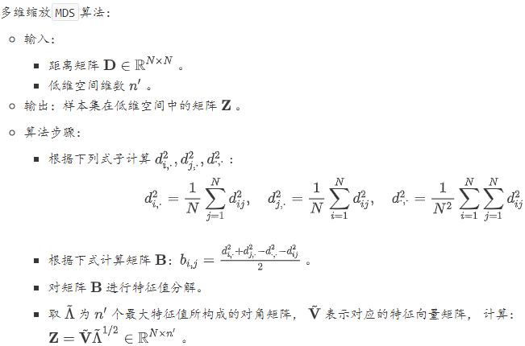
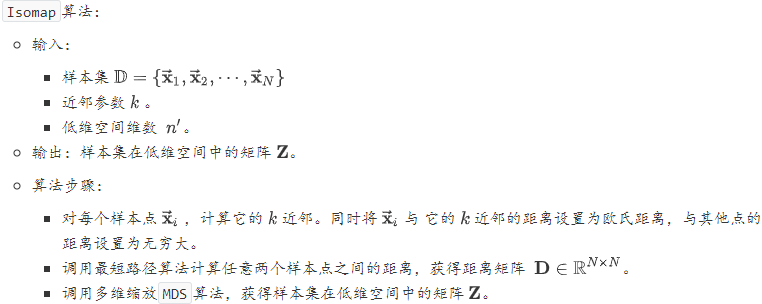
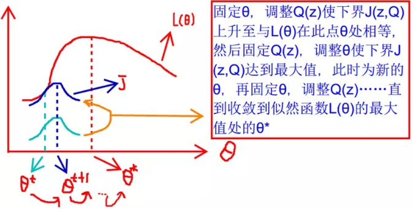

在高维情形下出现的数据样本稀疏、距离计算困难等问题是所有机器学习方法共同面临的严重障碍，称作维度灾难。降维之所以有效的原因是：人们观测或者收集到的数据样本虽然是高维的，但是与学习任务密切相关的也许仅仅是某个低维分布，即高维空间中的一个低维嵌入。对于常见的降维算法，无论是`PCA` 还是流形学习，都是基于距离来计算重构误差。此时建议对特征进行标准化，因为距离的计算依赖于特征的量纲。采用不同的量纲会导致不同的重构误差。

#### 1.主成分分析

##### 坐标变换

之所以进行中心化，是因为经过中心化之后常规的线性变换就是绕原点的旋转变换，也就是坐标变换。给定数据集 $\mathbb{D}=\left\{\overrightarrow{\mathbf{x}}_{1}, \cdots, \overrightarrow{\mathbf{x}}_{N}\right\}$，其中$\overrightarrow{\mathbf{x}}_{i} \in \mathbb{R}^n$。假定样本经过了中心化，即：$\overrightarrow{\mathbf{x}}_{j} \leftarrow \overrightarrow{\mathbf{x}}_{j}-\frac{1}{N} \sum_{j=1}^{N} \overrightarrow{\mathbf{x}}_{j}$

假设坐标变换矩阵为$\mathbf{W}^{\prime}\in \mathbb{R}^{n\times n}$，经过变换之后样本$\overrightarrow{\mathbf{x}}$的坐标为：$\overrightarrow{\mathbf{z}}^{\prime}=\mathbf{W}^{\prime T} \overrightarrow{\mathbf{x}}=\left(z_{1}, \cdots, z_{n}\right)^{T}$。其中$\mathbf{W}^{\prime}=\left(\overrightarrow{\mathbf{w}}_{1}, \overrightarrow{\mathbf{w}}_{2}, \cdots, \overrightarrow{\mathbf{w}}_{n}\right), \quad \overrightarrow{\mathbf{w}}_{i} \in \mathbb{R}^{n}$。令$\overrightarrow{\mathbf{z}}=\left(z_{1}, \cdots, z_{d}\right)^{T}, d<n$，它表示样本$\overrightarrow{\mathbf{x}}$降低到$d$维度。令$\mathbf{W}=\left(\overrightarrow{\mathbf{w}}_{1}, \overrightarrow{\mathbf{w}}_{2}, \cdots, \overrightarrow{\mathbf{w}}_{d}\right)$，则有：$\overrightarrow{\mathbf{z}}=\mathbf{W}^{T} \overrightarrow{\mathbf{x}}$。根据坐标变换矩阵的性质，有：

- $||\overrightarrow{\mathbf{w}}_{i}||_2=1, i=1,2,\cdots,d$
- $\mathbf{W}^{\prime} \mathbf{W}^{\prime T}=\mathbf{I}_{n \times n}, \quad \mathbf{W}^{T} \mathbf{W}=\mathbf{I}_{d \times d}$
- $\overrightarrow{\mathbf{w}}_{i}\cdot \overrightarrow{\mathbf{w}}_{j}=0, i\ne j$

对数据集 中的样本 ，降维后的数据为 。令：

$$
\mathbf{X}=\left[\begin{array}{c}
\overrightarrow{\mathbf{x}}_{1}^{T} \\
\vdots \\
\overrightarrow{\mathbf{x}}_{N}^{T}
\end{array}\right]=\left[\begin{array}{cccc}
x_{1,1} & x_{1,2} & \cdots & x_{1, n} \\
x_{2,1} & x_{2,2} & \cdots & x_{2, n} \\
\vdots & \vdots & \ddots & \vdots \\
x_{N, 1} & x_{N, 2} & \cdots & x_{N, n}
\end{array}\right]\mathbf{Z}=\left[\begin{array}{c}
\overrightarrow{\mathbf{z}}_{1}^{T} \\
\vdots \\
\overrightarrow{\mathbf{z}}_{N}^{T}
\end{array}\right]=\left[\begin{array}{cccc}
z_{1,1} & z_{1,2} & \cdots & z_{1, d} \\
z_{2,1} & z_{2,2} & \cdots & z_{2, d} \\
\vdots & \vdots & \ddots & \vdots \\
z_{N, 1} & z_{N, 2} & \cdots & z_{N, d}
\end{array}\right]
$$
即$\mathbf{X}$的第$i$行就是样本$\overrightarrow{\mathbf{x}}_i$，$\mathbf{Z}$的第$i$行就是降维后的数据$\overrightarrow{\mathbf{z}}_i$。

- 令$\overrightarrow{\mathbf{u}}_{j}=\left(x_{1, j}, \cdots, x_{N, j}\right)^{T^{n}}$，它表示$\mathbf{X}$的第$j$列，也就是原始的第$j$个特征。
- 令$\overrightarrow{\mathbf{v}}_{j}=\left(z_{1, j}, \cdots, z_{N, j}\right)^{T^{n}}$，它表示$\mathbf{Z}$的第$j$列 ，也就是降维之后的第$j$个特征。

则根据$z_{i, j}=\overrightarrow{\mathbf{w}}_{j} \cdot \overrightarrow{\mathbf{x}}_{i}=\sum_{k=1}^{n} w_{j, k} \times x_{i, k}$，有：$\overrightarrow{\mathbf{v}}_{j}=\sum_{k=1}^{n} w_{j, k} \overrightarrow{\mathbf{u}}_{j}$。因此降维的物理意义为：通过线性组合原始特征，从而去掉一些冗余的或者不重要的特征、保留重要的特征。

##### 重构误差

考虑对$\overrightarrow{\mathbf{z}}$进行重构，重构之后的样本为：$\hat{\mathbf{x}}=\mathbf{W} \overrightarrow{\mathbf{z}}$。对整个数据集$\mathbb{D}$所有重建样本与原始样本的误差为：

$$\sum_{i=1}^{N}\left\|\hat{\mathbf{x}}_{i}-\overrightarrow{\mathbf{x}}_{i}\right\|_{2}^{2}=\sum_{i=1}^{N}\left\|\mathbf{W} \mathbf{W}^{T} \overrightarrow{\mathbf{x}}_{i}-\overrightarrow{\mathbf{x}}_{i}\right\|_{2}^{2}$$

调整矩阵顺序，则有：$\mathbf{W}^{*}=\arg \max _{\mathbf{W}} \operatorname{tr}\left(\mathbf{W}^{T} \mathbf{X}^{T} \mathbf{X} \mathbf{W}\right)$。其约束条件为：$\mathbf{W}^{T} \mathbf{W}=\mathbf{I}_{d \times d}$ 

##### 性质

`PCA`不仅将数据压缩到低维，它也使得降维之后的数据各特征相互独立。

注意：`PCA`推导过程中，并没有要求数据中心化；但是在推导协方差矩阵时，要求数据中心化。

##### 最大可分性

`PCA`降维的准则有两个：最近重构性：样本集中所有点，重构后的点距离原来的点的误差之和最小。最大可分性：样本点在低维空间的投影尽可能分开。可以证明，最近重构性就等价于最大可分性。证明如下：

对于样本点$\overrightarrow{\mathbf{x}}_i$， 它在降维后空间中的投影是$\overrightarrow{\mathbf{z}}_i$。 则有：$\overrightarrow{\mathbf{z}}=\mathbf{W}^{T} \overrightarrow{\mathbf{x}}$。

由于样本数据进行了中心化，则投影后样本点的方差是：

$$\sum_{i=1}^{N} \overrightarrow{\mathbf{z}}_{i} \overrightarrow{\mathbf{z}}_{i}^{T}=\sum_{i=1}^{N} \mathbf{W}^{T} \overrightarrow{\mathbf{x}}_{i} \overrightarrow{\mathbf{x}}_{i}^{T} \mathbf{W}$$

根据$\mathbf{X}$的定义，有：$\operatorname{tr}\left(\mathbf{W}^{T} \mathbf{X}^{T} \mathbf{X} \mathbf{W}\right)=\sum_{i=1}^{N} \mathbf{W}^{T} \overrightarrow{\mathbf{x}}_{i} \overrightarrow{\mathbf{x}}_{i}^{T} \mathbf{W}$。则样本点的方差最大的优化目标可
$$
\begin{equation}\begin{aligned}
&\max _{\mathbf{W}} t r\left(\mathbf{W}^{T} \mathbf{X}^{T} \mathbf{X} \mathbf{W}\right)\\
&s . t . \mathbf{W}^{T} \mathbf{W}=\mathbf{I}_{d \times d}
\end{aligned}\end{equation}
$$

##### PCA与$\text{SVD}$

酉矩阵：若$n$阶矩阵满足$\mathbf{U}^H\mathbf{U}=\mathbf{U}\mathbf{U}^H=\mathbf{I}$，则它是酉矩阵。其中$\mathbf{U}^H$为$\mathbf{U}$的共轭转置。$\mathbf{U}$为酉矩阵的充要条件是：$\mathbf{U}^H=\mathbf{U}^{-1}$。

奇异值分解：设$\mathbf{X}为$阶$N\times n$矩阵，且$rank(X)=r$，则存在$N$阶酉矩阵$\mathbf{V}$和$n$阶酉矩阵$\mathbf{U}$，使得：$\mathbf{V}^{H} \mathbf{X} \mathbf{U}=\left[ \begin{array}{ll}{\Sigma} & {\mathbf{0}} \\ {\mathbf{0}} & {\mathbf{0}}\end{array}\right]_{N \times n}$，其中
$$
\Sigma=\left[ \begin{array}{ccccc}{\sigma_{1}} & {0} & {0} & {\cdots} & {0} \\ {0} & {\sigma_{2}} & {0} & {\cdots} & {0} \\ {\vdots} & {\vdots} & {\vdots} & {\ddots} & {\vdots} \\ {0} & {0} & {0} & {\cdots} & {\sigma_{r}}\end{array}\right]
$$
根据酉矩阵的性质, $\mathbf{V} \mathbf{V}^{H}=\mathbf{I}_{N \times N}, \mathbf{U} \mathbf{U}^{H}=\mathbf{I}_{n \times n}$，则有：$\mathbf{X}=\mathbf{V} \left[ \begin{array}{ll}{\Sigma} & {\mathbf{0}} \\ {\mathbf{0}} & {\mathbf{0}}\end{array}\right]_{N \times n} \mathbf{U}^{H} \Longrightarrow \mathbf{X}^{H}=\mathbf{U} \left[ \begin{array}{ll}{\Sigma} & {\mathbf{0}} \\ {\mathbf{0}} & {\mathbf{0}}\end{array}\right]_{n \times N} \mathbf{V}^{H}$

则有$\mathbf{X}^{H} \mathbf{X}=\mathbf{U M U}^{H}$， 其中$\mathbf{M}$是个$n$阶对角矩阵：由数据集$\mathbb{D}$中样本构成的$\mathbf{X}$为实矩阵，因此有$\mathbf{X}^H=\mathbf{X}^T$。另外考虑到$\mathbf{X}^T\mathbf{X}$为实对称矩阵，因此$\mathbf{V}$也是实矩阵，因此$\mathbf{U}^H=\mathbf{U}^T$。 则有：$\mathbf{X}^{T} \mathbf{X}=\mathbf{U} \mathbf{M} \mathbf{U}^{T}$。根据$\mathbf{U} \mathbf{U}^{T}=\mathbf{I}$，则有：$\mathbf{X}^{T} \mathbf{X U}=\mathbf{U} \mathbf{M}$。根据$\mathbf{M}$是个对角矩阵的性质，有：$\mathbf{U M}=\mathbf{M U}$，则有：$\mathbf{X}^{T} \mathbf{X} \mathbf{U}=\mathbf{M} \mathbf{U}$。则$\lambda_{i}, i=1,2, \cdots, r$就是的$\mathbf{x}^{T} \mathbf{x}$特征值， 其对应的单位特征向量组成正交矩阵$\mathbf{U}$。因此`SVD`奇异值分解等价于`PCA`主成分分析，核心都是求解  的特征值以及对应的单位特征向量。

#### 2.$\text{KPCA}$

假定原始特征空间中的样本点$\vec{\mathbf{x}}_{i}$通过映射$\phi$映射到高维特征空间的坐标为$\vec{\mathbf{x}}_{i,\phi}$，即$\vec{\mathbf{x}}_{i, \phi}=\phi\left(\vec{\mathbf{x}}_{i}\right)$。且假设高维特征空间为$n$维的，即：$\vec{\mathbf{x}}_{i, \phi} \in \mathbb{R}^{n}$。假定要将高维特征空间中的数据投影到低维空间中，投影矩阵为$\mathbf{W}$为$n\times d$维矩阵。根据 `PCA` 推导的结果，求解方程：$\mathbf{X}_{\phi}^{T} \mathbf{X}_{\phi} \mathbf{W}=\lambda \mathbf{W}$。其中$\mathbf{X}_{\phi}=\left(\vec{\mathbf{x}}_{1, \phi}^{T}, \vec{\mathbf{x}}_{2, \phi}^{T}, \cdots, \vec{\mathbf{x}}_{N, \phi}^{T}\right)^{T}$为$N\times n$维矩阵。于是有：$\left(\sum_{i=1}^{N} \phi\left(\vec{\mathbf{x}}_{i}\right) \phi\left(\vec{\mathbf{x}}_{i}\right)^{T}\right) \mathbf{W}=\lambda \mathbf{W}$。

定义核矩阵 ：
$$
\mathbf{K}=\left[ \begin{array}{cccc}{\kappa\left(\overrightarrow{\mathbf{x}}_{1}, \overrightarrow{\mathbf{x}}_{1}\right)} & {\kappa\left(\overrightarrow{\mathbf{x}}_{1}, \overrightarrow{\mathbf{x}}_{2}\right)} & {\cdots} & {\kappa\left(\overrightarrow{\mathbf{x}}_{1}, \overrightarrow{\mathbf{x}}_{N}\right)} \\ {\kappa\left(\overrightarrow{\mathbf{x}}_{2}, \overrightarrow{\mathbf{x}}_{1}\right)} & {\kappa\left(\overrightarrow{\mathbf{x}}_{2}, \overrightarrow{\mathbf{x}}_{2}\right)} & {\cdots} & {\kappa\left(\overrightarrow{\mathbf{x}}_{2}, \overrightarrow{\mathbf{x}}_{N}\right)} \\ {\vdots} & {\vdots} & {\ddots} & {\vdots} \\ {\kappa\left(\overrightarrow{\mathbf{x}}_{N}, \overrightarrow{\mathbf{x}}_{1}\right)} & {\kappa\left(\overrightarrow{\mathbf{x}}_{N}, \overrightarrow{\mathbf{x}}_{2}\right)} & {\cdots} & {\kappa\left(\overrightarrow{\mathbf{x}}_{N}, \overrightarrow{\mathbf{x}}_{N}\right)}\end{array}\right]
$$
则有：$\mathbf{X}_{\phi} \mathbf{X}_{\phi}^{T}=\mathbf{K}$ 。定义$\vec{\alpha}_{i}=\frac{\vec{\mathbf{x}}_{i, \phi}^{T} \mathbf{w}}{\lambda}$，则$\vec{\alpha}_{i}$为$1\times d$维行向量 。定义：$\mathbf{A}=\left(\vec{\alpha}_{1}, \vec{\alpha}_{2}, \cdots, \vec{\alpha}_{N}\right)^{T}$，则有：
$$
\mathbf{W}=\frac{1}{\lambda}\left(\sum_{i=1}^{N} \overrightarrow{\mathbf{x}}_{i, \phi} \overrightarrow{\mathbf{x}}_{i, \phi}^{T}\right) \mathbf{W}=\sum_{i=1}^{N} \overrightarrow{\mathbf{x}}_{i, \phi} \frac{\overrightarrow{\mathbf{x}}_{i, \phi}^{T} \mathbf{W}}{\lambda}=\sum_{i=1}^{N} \overrightarrow{\mathbf{x}}_{i, \phi} \vec{\alpha}_{i}=\mathbf{X}_{\phi}^{T} \mathbf{A}
$$
将$\mathbf{W}=\mathbf{X}_{\phi}^{T} \mathbf{A}$代入$\mathbf{x}_{\phi}^{T} \mathbf{X}_{\phi} \mathbf{W}=\lambda \mathbf{W}$，有：$\mathbf{X}_{\phi}^{T} \mathbf{X}_{\phi} \mathbf{X}_{\phi}^{T} \mathbf{A}=\lambda \mathbf{X}_{\phi}^{T} \mathbf{A}$。同样该问题也是一个特征值分解问题，取$\mathbf{K}$最大的$d$个特征值对应的特征向量组成  即可。对于新样本$\vec{\mathbf{x}}$， 其投影后第$j$维的坐标为：
$$
z_{j}=\overrightarrow{\mathbf{w}}_{j}^{T} \phi(\overrightarrow{\mathbf{x}})=\sum_{i=1}^{N} \alpha_{i, j} \phi\left(\overrightarrow{\mathbf{x}}_{i}\right)^{T} \phi(\overrightarrow{\mathbf{x}})=\sum_{i=1}^{N} \alpha_{i, j} \kappa\left(\overrightarrow{\mathbf{x}}_{i}, \overrightarrow{\mathbf{x}}\right)
$$

#### 3.流形学习

##### 多维缩放：`MDS`

多维缩放要求原始空间中样本之间的距离在低维空间中得到保持。

假设$N$个样本在原始空间中的距离矩阵为$\mathbf{D}=(d_{ij})_{N\times N}$，其中$d_{ij}=\|\vec{\mathbf{x}}_i-\vec{\mathbf{x}}_j\|$为样本$\vec{\mathbf{x}}_i$到样本$\vec{\mathbf{x}}_j$的距离。假设原始样本是在$n$维空间，目标是获取样本在$n^{\prime}$维空间且欧氏距离保持不变，其中满足$n^{\prime}<n$。假设样本集在原空间的表示为$\mathbf{X}\in \mathbb{R}^{N\times n}$，样本集在降维后空间的表示为$\mathbf{Z}\in \mathbb{R}^{N\times n^{\prime}}$。
$$
\mathbf{X}=\left[\begin{array}{c}
\overrightarrow{\mathbf{x}}_{1}^{T} \\
\vdots \\
\overrightarrow{\mathbf{x}}_{N}^{T}
\end{array}\right]=\left[\begin{array}{cccc}
x_{1,1} & x_{1,2} & \cdots & x_{1, n} \\
x_{2,1} & x_{2,2} & \cdots & x_{2, n} \\
\vdots & \vdots & \ddots & \vdots \\
x_{N, 1} & x_{N, 2} & \cdots & x_{N, n}
\end{array}\right]\mathbf{Z}=\left[\begin{array}{c}
\overrightarrow{\mathbf{z}}_{1}^{T} \\
\vdots \\
\overrightarrow{\mathbf{z}}_{N}^{T}
\end{array}\right]=\left[\begin{array}{cccc}
z_{1,1} & z_{1,2} & \cdots & z_{1, n^{\prime}} \\
z_{2,1} & z_{2,2} & \cdots & z_{2, n^{\prime}} \\
\vdots & \vdots & \ddots & \vdots \\
z_{N, 1} & z_{N, 2} & \cdots & z_{N, n^{\prime}}
\end{array}\right]
$$
所求的正是$\mathbf{Z}$矩阵，同时也不知道$n^{\prime}$。

令$\mathbf{B}=\mathbf{Z}\mathbf{Z}^T\in \mathbb{R}^{N\times N}$，即 ：
$$
\mathbf{B}=\left[\begin{array}{cccc}
x_{1,1} & x_{1,2} & \cdots & x_{1, N} \\
x_{2,1} & x_{2,2} & \cdots & x_{2, n} \\
\vdots & \vdots & \ddots & \vdots \\
x_{N, 1} & x_{N, 2} & \cdots & x_{N, N}
\end{array}\right]
$$
其中$b_{i,j}=\vec{\mathbf{x}}_i\cdot\vec{\mathbf{x}}_j$为降维后样本的内积。则根据降维前后样本的欧氏距离保持不变有：
$$
d_{ij}^2 = \|\vec{\mathbf{z}}_i-\vec{\mathbf{z}}_j\| = \|\vec{\mathbf{z}}_i\|^2 + \|\vec{\mathbf{z}}_j\|^2-2\vec{\mathbf{z}}_i^T\vec{\mathbf{z}}_j = b_{i,i}+b_{j,j}-2b_{i,j}
$$
假设降维后的样本集$\mathbf{Z}$被中心化，即$\sum_{i=1}^N\vec{\mathbf{z}}_i=0$，则矩阵$\mathbf{B}$的每行之和均为零，每列之和均为零。于是有：
$$
\begin{equation}\begin{array}{c}\sum_{i=1}^Nd_{ij}^2 = \sum_{i=1}^Nb_{i,i}+Nb_{j,j} = tr(B)+Nb_{j,j}\\
\sum_{j=1}^Nd_{ij}^2 = \sum_{j=1}^Nb_{j,j}+Nb_{i,i} = tr(B)+Nb_{i,i}\\
\sum_{i=1}^N\sum_{j=1}^Nd_{ij}^2 = \sum_{i=1}^N(tr(B)+Nb_{i,i}) = 2Ntr(B)
\end{array}\end{equation}
$$
令：
$$
\begin{equation}\begin{array}{c}d_{i,\cdot}^2 =\frac{1}{N}\sum_{i=1}^Nd_{ij}^2 = \frac{tr(B)}{N}+b_{i,i}\\
d_{j,\cdot}^2 =\frac{1}{N}\sum_{i=1}^Nd_{ij}^2 = \frac{tr(B)}{N}+b_{j,j}\\
d_{\cdot,\cdot}^2 =\frac{1}{N^2}\sum_{i=1}^N\sum_{j=1}^Nd_{ij}^2 = \frac{2tr(B)}{N}
\end{array}\end{equation}
$$
代入$d_{ij}^2=b_{i,i}+b_{j,j}-2b_{i,j}$，有：
$$
b_{i,j} = \frac{d_{i,\cdot}^2+d_{j,\cdot}^2-d_{\cdot,\cdot}^2-d_{ij}^2}{2}
$$
因此可以根据原始空间中的距离矩阵$\mathbf{D}$求出在降维后空间的内积矩阵$\mathbf{B}$。现在的问题是已知内积矩阵$\mathbf{B}$，如何求得矩阵$\mathbf{Z}$。对矩阵 做特征值分解，设$\mathbf{B}=\mathbf{V}\mathbf{\Lambda}\mathbf{V}^T$，其中$\Lambda$为特征值构成的对角矩阵，$\lambda_1\ge\lambda_2\ge\cdots\ge\lambda_N$，$\mathbf{V}$为特征向量矩阵。假定特征值中有$n^*$个非零特征值，它们构成对角矩阵$\Lambda^*=diag(\lambda_1,\cdots,\lambda_{n^*})$。令$\mathbf{V}^*$为对应的特征向量矩阵，则$\mathbf{Z}=\mathbf{V}^*\Lambda^{*\frac{1}{2}}$

##### 等度量映射

等度量映射的基本观点是：低维流形嵌入到高维空间后，直接在高维空间中计算直线距离具有误导性。因为在高维空间中的直线距离在低维嵌入流形上是不可达的。利用流形在局部上与欧氏空间同胚这个性质，对每个点基于欧氏距离找出它在低维流形上的近邻点， 然后就能建立一个近邻连接图。图中近邻点之间存在链接。图中非近邻点之间不存在链接。于是计算两点之间测地线距离的问题转变为计算近邻连接图上两点之间的最短路径问题。在得到任意两点的距离之后，就可以通过`MDS`算法来获得样本点在低维空间中的坐标。

##### 局部线性嵌入：`LLE`

假定样本点$\vec{\mathbf{x}}_i$的坐标能够通过它的邻域样本$\vec{\mathbf{x}}_{j}, \vec{\mathbf{x}}_{k}, \vec{\mathbf{x}}_{l}$进行线性组合而重构出来，即：$\vec{\mathbf{x}}_{i}=w_{i, j} \vec{\mathbf{x}}_{j}+w_{i, k} \vec{\mathbf{x}}_{k}+w_{i, l} \vec{\mathbf{x}}_{l}$。`LLE`算法希望这种关系在低维空间中得到保持。

`LLE`首先为每个样本$\vec{\mathbf{x}}$找到其近邻点下标集合$\mathbf{Q}_i$， 然后计算基于$\mathbf{Q}_i$中的样本点对$\vec{\mathbf{x}}$进行线性重构的系数$\overrightarrow{\mathbf{w}}_{i}$。定义样本集重构误差为：$e r r=\sum_{i=1}^{N}\left\|\overrightarrow{\mathbf{x}}_{i}-\sum_{j \in \mathbb{Q}_{i}} w_{i, j} \overrightarrow{\mathbf{x}}_{j}\right\|_{2}^{2}$。目标是样本集重构误差最小，即：$\min _{\overrightarrow{\mathbf{w}}_{1}, \overrightarrow{\mathbf{w}}_{2}, \cdots, \overrightarrow{\mathbf{w}}_{N}} \sum_{i=1}^{N}\left\|\overrightarrow{\mathbf{x}}_{i}-\sum_{j \in \mathbb{Q}_{i}} w_{i, j} \overrightarrow{\mathbf{x}}_{j}\right\|_{2}^{2}$。这样的解有无数个，对权重增加约束，进行归一化处理。即：$\sum_{j \in \mathbb{Q}_{i}} w_{i, j}=1, i=1,2, \cdots, N$。现在就是求解最优化问题：
$$
\begin{array}{l}{\min _{\overrightarrow{\mathbf{w}}_{1}, \overrightarrow{\mathbf{w}}_{2}, \cdots, \overrightarrow{\mathbf{w}}_{N}} \sum_{i=1}^{N}\left\|\overrightarrow{\mathbf{x}}_{i}-\sum_{j \in \mathbb{Q}_{i}} w_{i, j} \overrightarrow{\mathbf{x}}_{j}\right\|_{2}^{2}} \\ {\text {s.t. } \sum_{j \in \mathbb{Q}_{i}} w_{i, j}=1, i=1,2, \cdots, N}\end{array}
$$
该最优化问题有解析解。令$C_{j, k}=\left(\overrightarrow{\mathbf{x}}_{i}-\overrightarrow{\mathbf{x}}_{j}\right)^{T}\left(\overrightarrow{\mathbf{x}}_{i}-\overrightarrow{\mathbf{x}}_{k}\right)$，则可以解出：$w_{i, j}=\frac{\sum_{k \in \mathbb{Q}_{i}} C_{j, k}^{-1}}{\sum_{l, s \in \mathbb{Q}_{i}} C_{l, s}^{-1}}, j \in \mathbb{Q}_{i}$。`LLE` 中出现了两个重构误差。第一个重构误差：为了在原始空间中求解线性重构的系数$\vec{\mathbf{w}}_i$。目标是：基于$\mathbb{Q}_i$中的样本点对$\vec{\mathbf{x}}_i$进行线性重构，使得重构误差最小。第二个重构误差：为了求解样本集在低维空间中的表示$\mathbf{Z}$。目标是：基于线性重构的系数$\vec{\mathbf{w}}_i$，将$\mathbb{Q}_i$中的样本点对$\vec{\mathbf{z}}_i$进行线性重构，使得重构误差最小。

求出了线性重构的系数$\vec{\mathbf{w}}_i$之后， `LLE`在低维空间中保持$\vec{\mathbf{w}}_i$不变。设$\vec{\mathbf{x}}_i$对应的低维坐标$\vec{\mathbf{z}}_i$，已知线性重构的系数  ，定义样本集在低维空间中重构误差为：$e r r^{\prime}=\sum_{i=1}^{N}\left\|\overrightarrow{\mathbf{z}}_{i}-\sum_{j \in \mathbb{Q}_{i}} w_{i, j} \overrightarrow{\mathbf{z}}_{j}\right\|_{2}^{2}$。现在的问题是要求出$\vec{\mathbf{z}}_i$，从而使得上式最小。即求解：$\min _{\overrightarrow{\mathbf{z}}_{1}, \overrightarrow{\mathbf{z}}_{1}, \cdots, \overrightarrow{\mathbf{z}}_{N}} \sum_{i=1}^{N}\left\|\overrightarrow{\mathbf{z}}_{i}-\sum_{j \in \mathbb{Q}_{i}} w_{i, j} \overrightarrow{\mathbf{z}}_{j}\right\|_{2}^{2}$。令$\mathbf{Z}=\left(\overrightarrow{\mathbf{z}}_{1}^{T}, \overrightarrow{\mathbf{z}}_{2}^{T}, \cdots, \overrightarrow{\mathbf{z}}_{N}^{T}\right)^{T} \in \mathbb{R}^{N \times n^{\prime}}$，其中  为低维空间的维数$n^{\prime}$。定义$\mathbf{M}=(\mathbf{I}-\mathbf{W})^{T}(\mathbf{I}-\mathbf{W})$，于是最优化问题可重写为：$\min _{\mathbf{Z}} \operatorname{tr}\left(\mathbf{Z}^{T} \mathbf{M} \mathbf{Z}\right)$。

该最优化问题有无数个解。添加约束$\mathbf{Z}^{T} \mathbf{Z}=\mathbf{I}_{n^{\prime} \times n^{\prime}}$，于是最优化问题为：
$$
\begin{array}{cl}{\min _{\mathbf{Z}}} & {\operatorname{tr}\left(\mathbf{Z}^{T} \mathbf{M} \mathbf{Z}\right)} \\ {\text {s.t.}} & {\mathbf{Z}^{T} \mathbf{Z}=\mathbf{I}_{n^{\prime} \times n^{\prime}}}\end{array}
$$
该最优化问题可以通过特征值分解求解选取$\mathbf{M}$最小的$n^{\prime}$个特征值对应的特征向量组成的矩阵为$\mathbf{Z}$。

#### 4.度量学习

在机器学习中对高维数据进行降维的主要目的是：希望找出一个合适的低维空间，在这个低维空间中进行学习能比原始空间性能更好。每个空间对应了在样本属性上定义的一个距离度量。寻找合适的空间，本质上就是在寻找一个合适的距离度量。度量学习的思想就是：尝试直接学习出一个合适的距离度量。
$$
\operatorname{dist}_{\operatorname{mah}}^{2}\left(\overrightarrow{\mathbf{x}}_{i}, \overrightarrow{\mathbf{x}}_{j}\right)=\left(\overrightarrow{\mathbf{x}}_{i}-\overrightarrow{\mathbf{x}}_{j}\right)^{T} \mathbf{M}\left(\overrightarrow{\mathbf{x}}_{i}-\overrightarrow{\mathbf{x}}_{j}\right)
$$
其中的矩阵$\mathbf{M}$也称作度量矩阵，度量学习就是对$\mathbf{M}$进行学习。为了保持距离非负而且对称，则$\mathbf{M}$必须是半正定对称矩阵。即必有正交基$\mathbf{P}$，使得$
\mathbf{M}=\mathbf{P} \mathbf{P}^{T}
$。对$\mathbf{M}$学习的目标是：将$\mathbf{M}$嵌入到学习器的评价指标中去，通过优化学习器的评价指标来求得  。即：对$\mathbf{M}$的学习无法直接提出优化目标，而是将$\mathbf{M}$的学习与学习器的学习作为一个整体，然后优化学习器的优化目标。

#### 5.概率`PCA`

定义隐变量$\overrightarrow{\mathbf{z}} \in \mathbb{R}^{d}$，它属于低维空间。假设$\overrightarrow{\mathbf{z}}$的先验分布为高斯分布：$p(\overrightarrow{\mathbf{z}})=\mathcal{N}(\overrightarrow{\mathbf{0}}, \mathbf{I})$。定义观测变量$\overrightarrow{\mathbf{x}} \in \mathbb{R}^{n}$，它属于高维空间。假设条件概率分布$p(\overrightarrow{\mathbf{x}} | \overrightarrow{\mathbf{z}})$也是高斯分布：$p(\overrightarrow{\mathbf{x}} | \overrightarrow{\mathbf{z}})=\mathcal{N}\left(\mathbf{W} \overrightarrow{\mathbf{z}}+\vec{\mu}, \sigma^{2} \mathbf{I}\right)$。则`PPCA` 模型生成观测样本的步骤为：首先以概率$p(\overrightarrow{\mathbf{z}})$生成隐变量$\overrightarrow{\mathbf{z}}$。然后观测样本$\vec{\mathbf{x}}$由如下规则生成：$\overrightarrow{\mathbf{x}}=\mathbf{W} \overrightarrow{\mathbf{z}}+\vec{\mu}+\vec{\epsilon}$。

可以利用最大似然准则来确定参数$\mathbf{W}, \vec{\mu}, \sigma^{2}$的解析解。根据边缘概率分布的定义有：$p(\overrightarrow{\mathbf{x}})=\int p(\overrightarrow{\mathbf{x}} | \overrightarrow{\mathbf{z}}) d \overrightarrow{\mathbf{z}}$。由于$p(\overrightarrow{\mathbf{z}}), p(\overrightarrow{\mathbf{x}} | \overrightarrow{\mathbf{z}})$均为高斯分布，因此$p(\overrightarrow{\mathbf{x}})$也是高斯分布。假$\overrightarrow{\mathbf{x}} $的其均值为$\mu^{\prime}$，协方差为$\mathbf{C}$。则：
$$
\begin{array}{c}{\vec{\mu}^{\prime}=\mathbb{E}[\overrightarrow{\mathbf{x}}]=\mathbb{E}[\mathbf{W} \overrightarrow{\mathbf{z}}+\vec{\mu}+\vec{\epsilon}]=\vec{\mu}} \\ {\mathbf{C}=\operatorname{cov}[\overrightarrow{\mathbf{x}}]=\mathbb{E}\left[(\mathbf{W} \overrightarrow{\mathbf{z}}+\vec{\mu}+\vec{\epsilon})(\mathbf{W} \overrightarrow{\mathbf{z}}+\vec{\mu}+\vec{\epsilon})^{T}\right]} \\ {=\mathbb{E}\left[\mathbf{W} \overrightarrow{\mathbf{z}}^{T} \mathbf{W}\right]+\mathbb{E}\left[\vec{\epsilon} \vec{\epsilon}^{T}\right]+\vec{\mu} \vec{\mu}^{T}=\mathbf{W} \mathbf{W}^{T}+\sigma^{2} \mathbf{I}+\vec{\mu} \vec{\mu}^{T}}\end{array}
$$
因此$p(\overrightarrow{\mathbf{x}})=\mathcal{N}(\vec{\mu}, \mathbf{C})$。

给定数据集$\mathbb{D}=\left\{\overrightarrow{\mathbf{x}}_{1}, \cdots, \overrightarrow{\mathbf{x}}_{N}\right\}$，则对数似然函数为：
$$
\begin{array}{c}{\mathcal{L}=\log p\left(\mathbb{D} ; \mathbf{W}, \vec{\mu}, \sigma^{2}\right)=\sum_{i=1}^{N} \log p\left(\overrightarrow{\mathbf{x}}_{i} ; \mathbf{W}, \vec{\mu}, \sigma^{2}\right)} \\ {=-\frac{N n}{2} \log (2 \pi)-\frac{N}{2} \log |\mathbf{C}|-\frac{1}{2} \sum_{i=1}^{N}\left(\overrightarrow{\mathbf{x}}_{i}-\vec{\mu}\right)^{T} \mathbf{C}^{-1}\left(\overrightarrow{\mathbf{x}}_{i}-\vec{\mu}\right)}\end{array}
$$
其中$|\cdot|$这里表示行列式的值。对数据集$\mathbb{D}=\left\{\overrightarrow{\mathbf{x}}_{1}, \cdots, \overrightarrow{\mathbf{x}}_{N}\right\}$进行零均值化，即：$$
\overrightarrow{\mathbf{x}}_{i} \leftarrow \overrightarrow{\mathbf{x}}_{i}-\vec{\mu}=\overrightarrow{\mathbf{x}}_{i}-\overline{\overrightarrow{\mathbf{x}}}
$$。则有：$\overrightarrow{\mathbf{x}}=\mathbf{W} \overrightarrow{\mathbf{z}}+\vec{\epsilon}$，因此$p(\overrightarrow{\mathbf{x}})=\mathcal{N}(\overrightarrow{\mathbf{x}} ; \overrightarrow{\mathbf{0}}, \mathbf{C})$。

对数似然函数：$\mathcal{L}=\log p\left(\mathbb{D} ; \mathbf{W}, \vec{\mu}, \sigma^{2}\right)=-\frac{N}{2} \log |\mathbf{C}|-\frac{1}{2} \sum_{i=1}^{N} \overrightarrow{\mathbf{x}}_{i}^{T} \mathbf{C}^{-1} \overrightarrow{\mathbf{x}}_{i}=-\frac{N}{2}\left[\log |\mathbf{C}|+\operatorname{tr}\left(\mathbf{C}^{-1} \mathbf{S}\right)\right]$

其中$\mathbf{S}=\mathbf{X}^{T} \mathbf{X}$为协方差矩阵。

$\mathcal{L}$的所有驻点都可以写做：$\mathbf{W}=\mathbf{U}_{d}\left(\mathbf{\Lambda}_{d}-\sigma^{2} \mathbf{I}\right)^{1 / 2} \mathbf{R}$。其中：$\mathbf{U}_{d} \in \mathbb{R}^{n \times d}$的列由协方差矩阵$\mathbf{S}$的任意$d$个特征向量组成。$\boldsymbol{\Lambda}_{d} \in \mathbb{R}^{d \times d}$是对角矩阵，其元素是协方差矩阵$\mathbf{S}$对应的$d$个特征值$\lambda_i$。$\mathbf{R} \in \mathbb{R}^{d \times d}$是任意一个正交矩阵。当$d$个特征向量被选择为前$d$个最大的特征值对应的特征向量时，$\mathcal{L}$取得最大值。其它的所有解都是鞍点。

假定协方差矩阵$\mathbf{S}$的特征值从大到小排列$\lambda_{1} \geq \lambda_{2} \geq \cdots \geq \lambda_{n}$，对应的$n$个特征向量为$\overrightarrow{\mathbf{u}}_{1}, \cdots, \overrightarrow{\mathbf{u}}_{n}$。则最大似然准则得到的解析解为：$\mathbf{U}=\left(\overrightarrow{\mathbf{u}}_{1}, \cdots, \overrightarrow{\mathbf{u}}_{d}\right)$，它由前$d$个特征向量组成。$\mathbf{W}=\mathbf{U}_{d}\left(\mathbf{\Lambda}_{d}-\sigma^{2} \mathbf{I}\right)^{1 / 2} \mathbf{R}$。$\sigma^{2}=\frac{1}{n-d} \sum_{i=d+1}^{n} \lambda_{i}$，它就是与丢弃的维度相关连的平均方差。$\mathbf{R}$是正交矩阵，因此它可以视作$d$维隐空间的一个旋转矩阵。

根据$\mathbf{C}=\mathbf{W} \mathbf{W}^{T}+\sigma^{2} \mathbf{I}=\mathbf{U}_{d}\left(\mathbf{\Lambda}_{d}-\sigma^{2} \mathbf{I}\right) \mathbf{U}_{d}^{T}+\sigma^{2} \mathbf{I}$，则$\mathbf{C}$与$\mathbf{R}$无关。这表明：$p(\overrightarrow{\mathbf{x}})$在隐空间中具有旋转不变性，因此$\mathbf{R}$可以选任意一个正交矩阵。

##### 因子分析

因子分析是一个线性高斯隐变量模型，它与 `PPCA` 密切相关。因子分析的定义与`PPCA` 唯一差别是：给定隐变量$\vec{\mathbf{z}}$的条件下，观测变量$\vec{\mathbf{x}}$的条件概率分布的协方差矩阵是一个对角矩阵，而不是一个各向同性的协方差矩阵。即：$p(\overrightarrow{\mathbf{x}} | \overrightarrow{\mathbf{z}})=\mathcal{N}(\mathbf{W} \overrightarrow{\mathbf{z}}+\vec{\mu}, \mathbf{\Psi})$，其中$\Psi$是一个$n \times n$的对角矩阵。因此也可以认为`PPCA` 是一种特殊情形的因子分析。如果对$\vec{\mathbf{x}}$进行了零均值化，则$p(\overrightarrow{\mathbf{x}} | \overrightarrow{\mathbf{z}})=\mathcal{N}(\mathbf{W} \overrightarrow{\mathbf{z}}, \mathbf{\Psi})$。与 `PPCA` 模型相同，因子分析模型假设在给定隐变量$\vec{\mathbf{z}}$的条件下，观测变量$\vec{\mathbf{x}}$的各分量$x_{1}, x_{2}, \cdots, x_{n}$是独立的。

可以使用最大似然法来确定因子分析模型中的参数$\mathbf{W}, \mathbf{\Psi}$的值。此时$\mathbf{W}, \mathbf{\Psi}$的最大似然解不再具有解析解，因此必须用梯度下降法或者`EM` 算法迭代求解。`E` 步：用旧的参数求期望：
$$
\begin{array}{c}
\mathbb{E}\left[\overrightarrow{\mathbf{z}}_{i}\right]=\mathbf{G} \mathbf{W}^{T} \mathbf{\Psi}^{-1} \overrightarrow{\mathbf{x}}_{i}\\
\mathbb{E}\left[\overrightarrow{\mathbf{z}}_{i} \overrightarrow{\mathbf{z}}_{i}^{T}\right]=\operatorname{cov}\left[\overrightarrow{\mathbf{z}}_{i}\right]+\mathbb{E}\left[\overrightarrow{\mathbf{z}}_{i}\right] \mathbb{E}\left[\overrightarrow{\mathbf{z}}_{i}\right]^{T}=\mathbf{G}+\mathbb{E}\left[\overrightarrow{\mathbf{z}}_{i}\right] \mathbb{E}\left[\overrightarrow{\mathbf{z}}_{i}\right]^{T}
\end{array}
$$
其中$\mathbf{G}=\left(\mathbf{I}+\mathbf{W}^{T} \mathbf{\Psi}^{-1} \mathbf{W}\right)^{-1}$。这里使用一个$d \times d$的矩阵求逆表达式，而不是$n \times n$的表达式。`M` 步：求最大化来获取新的参数。
$$
\begin{array}{l}{\mathbf{W}_{n e w} \leftarrow\left[\sum_{i=1}^{N} \overrightarrow{\mathbf{x}}_{i} \mathbb{E}\left[\overrightarrow{\mathbf{z}}_{i}\right]^{T}\right]\left[\sum_{i=1}^{N} \mathbb{E}\left[\overrightarrow{\mathbf{z}}_{i} \overrightarrow{\mathbf{z}}_{i}^{T}\right]\right]^{-1}} \\ {\mathbf{\Psi}_{n e w} \leftarrow \operatorname{diag}\left[\mathbf{S}-\mathbf{W}_{n e w} \frac{1}{N} \sum_{i=1}^{N} \mathbb{E}\left[\overrightarrow{\mathbf{z}}_{i}\right] \overrightarrow{\mathbf{x}}_{i}^{T}\right]}\end{array}
$$
其中$\text{diag}$将所有非对角线上的元素全部设置为零。

#### 6.独立成分分析

独立成分分析`ICA` 用于从混合信号中分离出原始信号。本质上它并不是一个降维的算法，而是一个信号分离算法。

假设酒会上有$n$个人，他们可以同时说话。房间里散落了$n$个声音接收器用于记录声音。酒会过后，从$n$个声音接收器中采集到一组数据：
$$
\begin{array}{c}{\mathbb{D}=\left\{\overrightarrow{\mathbf{x}}_{1}, \overrightarrow{\mathbf{x}}_{2}, \cdots, \overrightarrow{\mathbf{x}}_{N}\right\}} \\ {\overrightarrow{\mathbf{x}}_{i}=\left(x_{i, 1}, x_{i, 2}, \cdots, x_{i, n}\right)^{T}}\end{array}
$$
任务的目标是：从这$N$个时刻的采样数据中恢复出每个人说话的信号。这个过程也称作盲信号分离。随机变量$\vec{\mathbf{x}}$表示观测随机变量，$\vec{\mathbf{x}}_i$是其第$i$个采样值，其物理意义为：在时刻$i$采集到的$n$个声音信号。

定义：第$i$个人说话的信号为$s_i$。它是一个随机变量，其分布为$p_s(s_i)$。 为$s_{1,i}, \cdots, s_{N, i}$的$N$个时刻的采样，记作$\overrightarrow{\mathbf{u}}_{i}^{(s)}$。$n$个人说话的信号为$\overrightarrow{\mathbf{s}}=\left(s_{1}, s_{2}, \cdots, s_{n}\right)^{T}$。它是一个  维随机变量，分布为$p_s(\vec{\mathbf{s}})$。$\overrightarrow{\mathbf{s}}_{1}, \cdots, \overrightarrow{\mathbf{s}}_{N}$为 的$N$个时刻的采样。第$i$个声音接收器收到的信号为$x_i$。它是一个随机变量，其分布为$p_x(x_i)$。 $x_{1,i}, \cdots, x_{N, i}$为$x_i$的$N$个时刻的采样，记作$\overrightarrow{\mathbf{u}}_{i}^{(x)}$。$n$个声音接收器收到的信号为$\overrightarrow{\mathbf{x}}=\left(x_{1}, x_{2}, \cdots, x_{n}\right)^{T}$。它是一个$n$维随机变量，分布为$p_{x}(\overrightarrow{\mathbf{x}}) $。$\overrightarrow{\mathbf{x}}_{1}, \cdots, \overrightarrow{\mathbf{x}}_{N}$。 为$\vec{\mathbf{x}}$的$N$个时刻的采样。定义矩阵$\mathbf{X}$和矩阵$\mathbf{S}$为：
$$
\mathbf{X}=\left[\begin{array}{c}{\overrightarrow{\mathbf{x}}_{1}^{T}} \\ {\vdots} \\ {\overrightarrow{\mathbf{x}}_{N}^{T}}\end{array}\right]
\mathbf{S}=\left[\begin{array}{c}{\overrightarrow{\mathbf{s}}_{1}^{T}} \\ {\vdots} \\ {\overrightarrow{\mathbf{s}}_{N}^{T}}\end{array}\right]
$$
$\mathbf{A}=\left(a_{i, j}\right)_{n \times n}$是一个未知的混合矩阵，它用于叠加$n$个人说话的信号。则有：$\mathbf{X}=\mathbf{S} \mathbf{A}^{T}$。即：$\overrightarrow{\mathbf{x}}=\mathbf{A} \overrightarrow{\mathbf{s}}$。

现在$\mathbf{X}$是已知的，即信号$\vec{\mathbf{X}}$是已知的。令$\mathbf{W}=\mathbf{A}^{-1}$，则有：$\overrightarrow{\mathbf{s}}=\mathbf{W} \overrightarrow{\mathbf{x}}$。$\mathbf{W}$称作分离矩阵。如果没有任何先验知识，则无法求解。这里需要假设$p_s(s_i)$。首先，不能选取高斯分布。其次，考虑到概率密度函数由累计分布函数求导得到，一个方便的选择是：选择累计分布函数为 `sigmoid` 函数。

给定采样样本集$\mathbb{D}=\left\{\overrightarrow{\mathbf{x}}_{1}, \cdots, \overrightarrow{\mathbf{x}}_{N}\right\}$，则对数似然函数为：
$$
\mathcal{L}=\sum_{i=1}^{N} \log p_{x}\left(\overrightarrow{\mathbf{x}}_{i}\right)=\sum_{i=1}^{N}\left(\log |\mathbf{W}|+\sum_{j=1}^{n} \log p_{s}\left(\overrightarrow{\mathbf{w}}_{j}^{T} \overrightarrow{\mathbf{x}}_{i}\right)\right)
$$
根据最大似然准则，可以采用梯度下降法求解$\mathcal{L}$的最大值。其中：根据矩阵微积分有：$\nabla_{\mathbf{w}}|\mathbf{W}|=|\mathbf{W}|\left(\mathbf{W}^{-1}\right)^{T}$。则有：
$$
\nabla_{\mathbf{W}} \mathcal{L}=\left[\begin{array}{c}{1-2 g\left(\overrightarrow{\mathbf{w}}_{1}^{T} \overrightarrow{\mathbf{x}}_{i}\right)} \\ {1-2 g\left(\overrightarrow{\mathbf{w}}_{2}^{T} \overrightarrow{\mathbf{x}}_{i}\right)} \\ {\vdots} \\ {1-2 g\left(\overrightarrow{\mathbf{w}}_{n}^{T} \overrightarrow{\mathbf{x}}_{i}\right)}\end{array}\right] \overrightarrow{\mathbf{x}}_{i}^{T}+\left(\mathbf{W}^{-1}\right)^{T}
$$
当迭代求解出$\mathbf{W}$之后，通过$\overrightarrow{\mathbf{s}}=\mathbf{W} \overrightarrow{\mathbf{x}}$。 还原出原始信号。最大似然估计时，假设$\vec{\mathbf{x}}_i$和$\vec{\mathbf{x}}_j$之间是相互独立的。事实上对于语音信号或者其他具有时间连续性依赖性的数据，这个假设不能成立。但是当数据足够多，假设独立对于效果影响不大。如果事先打乱样本，则会加快梯度下降法的收敛速度。

##### 预处理

#### 7.$\text{t-SNE}$

`SNE` 的基本思想：如果两个样本在高维相似，则它们在低维也相似。`SNE` 主要包含两步：构建样本在高维的概率分布。在低维空间里重构这些样本的概率分布，使得这两个概率分布之间尽可能相似。

在数据集$\mathbb{D}=\left\{\overrightarrow{\mathbf{x}}_{1}, \cdots, \overrightarrow{\mathbf{x}}_{N}\right\}$中，给定一个样本$\overrightarrow{\mathbf{x}}_{i}$，然后计算$\left\{\overrightarrow{\mathbf{x}}_{1}, \cdots, \overrightarrow{\mathbf{x}}_{i-1}, \overrightarrow{\mathbf{x}}_{i+1}, \cdots, \overrightarrow{\mathbf{x}}_{N}\right\}$是$\overrightarrow{\mathbf{x}}_{i}$的邻居的概率。`SNE` 假设：如果$\overrightarrow{\mathbf{x}}_{j}$与$\overrightarrow{\mathbf{x}}_{i}$越相似，则$\overrightarrow{\mathbf{x}}_{j}$是$\overrightarrow{\mathbf{x}}_{i}$的邻居的概率越大。相似度通常采用欧几里得距离来衡量，两个样本距离越近则它们越相似。概率$p\left(\overrightarrow{\mathbf{x}}_{j} | \overrightarrow{\mathbf{x}}_{i}\right)$通常采用指数的形式：$p\left(\overrightarrow{\mathbf{x}}_{j} | \overrightarrow{\mathbf{x}}_{i}\right) \propto \exp \left(-\left\|\overrightarrow{\mathbf{x}}_{j}-\overrightarrow{\mathbf{x}}_{i}\right\|^{2} /\left(2 \sigma_{i}^{2}\right)\right)$对$j=1,2, \cdots, N, j \neq i$进行归一化有：
$$
p\left(\overrightarrow{\mathbf{x}}_{j} | \overrightarrow{\mathbf{x}}_{i}\right)=\frac{\exp \left(-\left\|\overrightarrow{\mathbf{x}}_{j}-\overrightarrow{\mathbf{x}}_{i}\right\|^{2} /\left(2 \sigma_{i}^{2}\right)\right)}{\sum_{k \neq i} \exp \left(-\left\|\overrightarrow{\mathbf{x}}_{k}-\overrightarrow{\mathbf{x}}_{i}\right\|^{2} /\left(2 \sigma_{i}^{2}\right)\right)}
$$
其中$\sigma_i$是与$\overrightarrow{\mathbf{x}}_{i}$相关的、待求得参数，它用于对距离进行归一化。定义$p_{j | i}=p\left(\overrightarrow{\mathbf{x}}_{j} | \overrightarrow{\mathbf{x}}_{i}\right)$。由于挑选时$\overrightarrow{\mathbf{x}}_{j}$排除了$\overrightarrow{\mathbf{x}}_{i}$，因此有$p_{i | i}=0$。定义概率分布$P_{i}=\left(p_{1 | i}, \cdots, p_{N | i}\right)$，它刻画了所有其它样本是$\overrightarrow{\mathbf{x}}_{i}$的邻居的概率分布。

假设经过降维，样本$\overrightarrow{\mathbf{x}}_{i} \in \mathbb{R}^{n}$在低维空间的表示为$\overrightarrow{\mathbf{z}}_{i} \in \mathbb{R}^{d}$，其中$d \leq n$。定义：
$$
q_{j | i}=q\left(\overrightarrow{\mathbf{z}}_{j} | \overrightarrow{\mathbf{z}}_{i}\right)=\frac{\exp \left(-\left\|\overrightarrow{\mathbf{z}}_{j}-\overrightarrow{\mathbf{z}}_{i}\right\|^{2}\right)}{\sum_{k \neq i} \exp \left(-\left\|\overrightarrow{\mathbf{z}}_{k}-\overrightarrow{\mathbf{z}}_{i}\right\|^{2}\right)}
$$
其中$q_{j|i}$表示给定一个样本$\vec{\mathbf{z}}_i$，然后计算$\left\{\overrightarrow{\mathbf{z}}_{1}, \cdots, \overrightarrow{\mathbf{z}}_{i-1}, \overrightarrow{\mathbf{z}}_{i+1}, \cdots, \overrightarrow{\mathbf{z}}_{N}\right\}$是$\vec{\mathbf{z}}_j$的邻居的概率。这里选择$\sigma^2=\frac{1}{2}$为固定值。同样地，有$q_{i|i}=0$。定义概率分布$Q_{i}=\left(q_{1 i}, \cdots, q_{N | i}\right)$，它刻画了所有其它样本是$\vec{\mathbf{z}}_i$的邻居的概率分布。

对于样本$\vec{\mathbf{x}}_i$，如果降维的效果比较好，则有$p_{j | i}=q_{j i}, i=1,2, \cdots, N$。即：降维前后不改变$\vec{\mathbf{x}}_i$周围的样本分布。对于，定义$\vec{\mathbf{x}}_i$其损失函数为分布$\mathbf{P}_I$和$\mathbf{Q}_I$的距离，通过 `KL` 散度来度量。对于全体数据集$\mathbf{D}$，整体损失函数为：
$$
\mathcal{L}=\sum_{i=1}^{N} K L\left(P_{i} \| Q_{i}\right)=\sum_{i=1}^{N} \sum_{j=1}^{N} p_{j | i} \log \frac{p_{j | i}}{q_{j | i}}
$$
记$y_{i, j}=-\left\|\overrightarrow{\mathbf{z}}_{j}-\overrightarrow{\mathbf{z}}_{i}\right\|^{2}$，则有$q_{j | i}=\frac{\exp \left(y_{i, j}\right)}{\sum_{k \neq i} \exp \left(y_{i, k}\right)}$。
$$
\begin{array}{1}
\nabla_{y_{i, j}}\left(\sum_{j=1}^{N} p_{j | i} \log q_{j | \dot{s}}\right)=p_{j | i}-q_{j | i}\\
\begin{array}{c}{\nabla_{\overrightarrow{\mathbf{z}}_{i}}\left(\sum_{j=1}^{N} p_{j | i} \log q_{j | i}\right)=\nabla_{y_{i, j}}\left(\sum_{j=1}^{N}-p_{j | i} \log q_{j | i}\right) \times \nabla_{\overrightarrow{\mathbf{z}}_{i}} y_{i, j}} \\ {=-2\left(p_{j | i}-q_{j | i}\right) \times\left(\overrightarrow{\mathbf{z}}_{i}-\overrightarrow{\mathbf{z}}_{j}\right)}\end{array}\\
\begin{array}{c}{\nabla_{\overrightarrow{\mathbf{a}}_{j}}\left(\sum_{i=1}^{N} p_{j | i} \log q_{j | i}\right)=\nabla_{y_{i, j}}\left(\sum_{i=1}^{N}-p_{j | i} \log q_{j | i}\right) \times \nabla_{\overrightarrow{\mathbf{z}}} y_{i, j}} \\ {=-2\left(p_{j | i}-q_{j | i}\right) \times\left(\overrightarrow{\mathbf{z}}_{j}-\overrightarrow{\mathbf{z}}_{i}\right)}\end{array}
\end{array}
$$
`t-SNE` 通过采用不同的分布来解决拥挤问题：在高维空间下使用高斯分布将距离转换为概率分布。在低维空间下使用 `t` 分布将距离转换为概率分布。`t-SNE` 使用自由度为`1` 的 `t` 分布。此时有：$q_{i, j}=\frac{\left(1+\left\|\overrightarrow{\mathbf{z}}_{i}-\overrightarrow{\mathbf{z}}_{j}\right\|^{2}\right)^{-1}}{\sum_{k} \sum_{l, l \neq k}\left(1+| | \overrightarrow{\mathbf{z}}_{k}-\overrightarrow{\mathbf{z}}_{l}| |^{2}\right)^{-1}}$。则梯度为：
$$
\nabla_{\overrightarrow{\mathbf{z}}_{i}} \mathcal{L}=\sum_{j} 4\left(p_{i, j}-q_{i, j}\right)\left(\overrightarrow{\mathbf{z}}_{i}-\overrightarrow{\mathbf{z}}_{j}\right)\left(1+\left\|\overrightarrow{\mathbf{z}}_{i}-\overrightarrow{\mathbf{z}}_{j}\right\|^{2}\right)^{-1}
$$
也可以选择自由度超过 `1` 的 `t` 分布。自由度越高，越接近高斯分布。

#### 8. $\text{LargeVis}$

#### EM算法

###### 观测变量与隐变量

令$\mathbf{Y}$表示观测随机变量，$\mathbb{Y}=\left\{y_{1}, y_{2}, \cdots, y_{N}\right\}$表示对应的数据序列；令$\mathbf{Z}$表示隐随机变量，$\mathbb{Z}=\left\{z_{1}, z_{2}, \cdots, z_{N}\right\}$表示对应的数据序列。$\mathbb{Y}$和$\mathbb{Z}$连在一起称作完全数据，观测数据$\mathbb{Y}$又称作不完全数据。假设给定观测随机变量$\mathbf{Y}$，其概率分布为$P(Y ; \theta)$，其中$\theta$是需要估计的模型参数，则不完全数据$\mathbb{Y}$的似然函数是$P(\mathbb{Y} ; \theta)$， 对数似然函数为$L(\theta)=\log P(\mathbb{Y} ; \theta)$。

假定$\mathbf{Y}$和$\mathbf{Z}$的联合概率分布是$P(Y, Z ; \theta)$，完全数据的对数似然函数是$\log P(\mathbb{Y}, \mathbb{Z} ; \theta)$，则根据每次观测之间相互独立，有：
$$
\begin{array}{c}{\log P(\mathbb{Y} ; \theta)=\sum_{i} \log P\left(Y=y_{i} ; \theta\right)} \\ {\log P(\mathbb{Y}, \mathbb{Z} ; \theta)=\sum_{i} \log P\left(Y=y_{i}, Z=z_{i} ; \theta\right)}\end{array}
$$
由于$\mathbb{Y}$发生，根据最大似然估计，则需要求解对数似然函数：
$$
\begin{array}{c}{L(\theta)=\log P(\mathbb{Y} ; \theta)=\sum_{i=1} \log P\left(Y=y_{i} ; \theta\right)=\sum_{i=1} \log \sum_{Z} P} \\ {=\sum_{i=1} \log \left[\sum_{Z} P\left(Y=y_{i} | Z ; \theta\right) P(Z ; \theta)\right]}\end{array}
$$
的极大值。其中$\sum_{Z} P\left(Y=y_{i}, Z ; \theta\right)$表示对所有可能的$\mathbf{Z}$求和，因为边缘分布$P(Y)=\sum_{Z} P(Y, Z)$。

###### 原理

`EM` 算法通过迭代逐步近似极大化$L(\theta)$。

假设在第$i$次迭代后，$\theta$的估计值为：$\theta^i$。则希望$\theta$新的估计值能够使得$L(\theta)$增加。为此考虑两者的差：$L(\theta)-L\left(\theta^{i}\right)=\log P(\mathbb{Y} ; \theta)-\log P\left(\mathbb{Y} ; \theta^{i}\right)$

`Jensen`不等式：如果$f$是凸函数，$x$为随机变量，则有：$\mathbb{E}[f(x)] \leq f(\mathbb{E}[x])$。

考虑到条件概率的性质，则有$\sum_{Z} P(Z | Y ; \theta)=1$。因此有
$$
\begin{array}{1}{L(\theta)-L\left(\theta^{i}\right)=\sum_{j} \log \sum_{Z} P\left(Y=y_{j}, Z ; \theta\right)-\sum_{j} \log P\left(Y=y_{j} ; \theta^{i}\right)} \\ {=\sum_{j}\left[\log \sum_{Z} P\left(Z | Y=y_{j} ; \theta^{i}\right) \frac{P\left(Y=y_{j}, Z ; \theta\right)}{P\left(Z | Y=y_{j} ; \theta^{i}\right)}-\log P\left(Y=y_{j} ; \theta^{i}\right)\right]}\\
\geq \sum_{j}\left[\sum_{Z} P\left(Z | Y=y_{j} ; \theta^{i}\right) \log \frac{P\left(Y=y_{j}, Z ; \theta\right)}{P\left(Z | Y=y_{j} ; \theta^{i}\right)}-\log P\left(Y=y_{j} ; \theta^{i}\right)\right]\\
=\sum_{j} \left[\sum_{Z} P\left(Z | Y=y_{j} ; \theta^{i}\right) \log \frac{P\left(Y=y_{j} | Z ; \theta\right) P(Z ; \theta)}{P\left(Z | Y=y_{j} ; \theta^{i}\right)}\right.-\log P\left(Y=y_{j} ; \theta^{i}\right) \times \sum_{Z} P\left(Z | Y=y_{j} ; \theta^{i}\right) ]\\
=\sum_{j}\left[\sum_{Z} P\left(Z | Y=y_{j} ; \theta^{i}\right) \log \frac{P\left(Y=y_{j} | Z ; \theta\right) P(Z ; \theta)}{P\left(Z | Y=y_{j} ; \theta^{i}\right) P\left(Y=y_{j} ; \theta^{i}\right)}\right]\\
\text{令}:\\
B\left(\theta, \theta^{i}\right)=L\left(\theta^{i}\right)+\sum_{j}\left[\sum_{Z} P\left(Z | Y=y_{j} ; \theta^{i}\right) \log \frac{P\left(Y=y_{j} | Z ; \theta\right) P(Z ; \theta)}{P\left(Z | Y=y_{j} ; \theta^{i}\right) P\left(Y=y_{j} ; \theta^{i}\right)}\right]
\end{array}
$$
任何可以使得$B(\theta, \theta^{i})$增大的$\theta$，也可以使$L(\theta)$增大。为了使得$L(\theta)$尽可能增大，则选择使得$B(\theta, \theta^{i})$取极大值的$\theta$：$\theta^{i+1}=\arg \max _{\theta} B\left(\theta, \theta^{i}\right)$。
$$
\begin{array}{l}\theta^{i+1}=\arg \max _{\theta} B\left(\theta, \theta^{i}\right)\\{=\arg \max _{\theta} \sum_{j}\left(\sum_{Z} P\left(Z | Y=y_{j} ; \theta^{i}\right) \log P\left(Y=y_{j} | Z ; \theta\right) P(Z ; \theta)\right)} \\ {=\arg \max _{\theta} \sum_{j}\left(\sum_{Z} P\left(Z | Y=y_{j} ; \theta^{i}\right) \log P\left(Y=y_{j}, Z ; \theta\right)\right)}\end{array}
$$

给定数据集，假设样本间相互独立，我们想要拟合模型$p(x;\theta)$到数据的参数。根据分布我们可以得到如下似然函数：
$$
\begin{equation}\begin{aligned}
L(\theta) &=\sum_{i=1}^{n} \log p\left(x_{i} ; \theta\right) \\
&=\sum_{i=1}^{n} \log \sum_{z} p\left(x_{i}, z ; \theta\right)
\end{aligned}\end{equation}
$$
第一步是对极大似然函数取对数，第二步是对每个样本的每个可能的类别 z 求联合概率分布之和。如果这个 z 是已知的数，那么使用极大似然法会很容易。但如果 z 是隐变量，我们就需要用 EM 算法来求。事实上，隐变量估计问题也可以通过梯度下降等优化算法，但事实由于求和项将随着隐变量的数目以指数级上升，会给梯度计算带来麻烦；而 EM 算法则可看作一种非梯度优化方法。

对于每个样本$i$，我们用$Q_i(\mathbf{z})$表示样本$i$隐含变量$\mathbf{z}$的某种分布，且$Q_i(\mathbf{z})$满足条件$\sum_{z}^{Z} Q_{i}(z)=1, \quad Q_{i}(z) \geq 0$。我们将上面的式子做以下变化：
$$
\begin{equation}\begin{aligned}
\sum_{i}^{n} \log p\left(x_{i} ; \theta\right) &=\sum_{i}^{n} \log \sum_{z} p\left(x_{i}, z ; \theta\right) \\
&=\sum_{i}^{n} \log \sum_{z}^{Z} Q_{i}(z) \frac{p\left(x_{i}, z ; \theta\right)}{Q_{i}(z)} \\
& \geq \sum_{i}^{n} \sum_{z}^{Z} Q_{i}(z) \log \frac{p\left(x_{i}, z ; \theta\right)}{Q_{i}(z)}
\end{aligned}\end{equation}
$$
通过上面我们得到了： $L(\theta)\ge J(z,Q)$的形式，那么我们就可以通过不断最大化$J(z,Q)$的下界来使得$L(\theta)$不断提高。首先第一个问题，当$X=E[X]$时，即为常数时等式成立：$\frac{p\left(x_{i}, z ; \theta\right)}{Q_{i}(z)}=c$。做个变换：$\sum_{z} p\left(x_{i}, z ; \theta\right)=\sum_{z} Q_{i}(z) c$。因此得到了：
$$
\begin{equation}\begin{aligned}
Q_{i}(z) &=\frac{p\left(x_{i}, z ; \theta\right)}{\sum_{z} p\left(x_{i}, z ; \theta\right)} \\
&=\frac{p\left(x_{i}, z ; \theta\right)}{p\left(x_{i} ; \theta\right)} \\
&=p\left(z | x_{i} ; \theta\right)
\end{aligned}\end{equation}
$$
