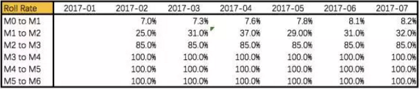
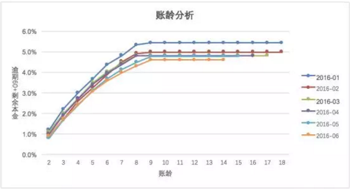

#### 金融基础

###### 消费金融

消金的《试点办法》，主要有这些特性：

- 只能做个人消费信贷业务；
- 单一借款人贷款余额不得超过20万元；
- 可以查人行征信；
- 资金可以通过境内同业拆借、向境外金融机构借款以及经批准发行金融债券进行融资；
- 资本充足率不低于银监会有关监管要求；

货币基金资产主要投资于短期货币工具（一般期限在一年以内，平均期限120天），如国债、央行票据、商业票据、银行定期存单、政府短期债券、企业债券（信用等级较高）、同业存款等短期有价证券。

银行间同业拆借利率(SHIBOR)采用报价制度，以拆借利率为基础，即参与银行每天对各个期限的拆借品种进行报价，对报价进行加权平均处理后，公布各个期限的平均拆借利率即为SHIBOR利率。
同业拆借的交易期限较短，属临时性的资金融通。我国同业拆借期限最长不超过4个月
同业拆借是指商业银行之间利用资金融通过程的时间差、空间差、行际差来调剂资金而进行的短期借贷。

###### 小微企业贷

难点：单笔小微贷款的微薄利润难以支撑以人员密集型的模式去审批贷款的成本，可要做到自动化或半自动化授信，金融机构缺乏可靠的数据；没有财务报表或者财务报表不正规；现金流通常通过老板或财务的个人账户走账；合同、采购单和收据真假难辨；银行一般通过对企业主的审核来间接审核企业状况，但是个人的信用状况无法完全代表企业的状况；银行提供的贷款产品和服务与真实小微企业的需求不够切合，比如用款时间不匹配，申请流程繁杂等。

现金流、成长状况、信用记录、交易状况、销售增长、仓储周转、投诉纠纷

水文模型的内在逻辑源于城市的水文管理方法，在判断河道水位高低时，将数值与历史数据和周边河道数据进行判断，就能较为公允地判断河道的水位情况。同理，店铺销售也存在淡旺季，将时点销售额与不同时间、季节以及同类店铺的数据相比较，就能避免基于单一时间段对店铺进行额度核定。

做的买卖不同，对资金的需求程度和需求时间就不同，细分的产品对真实的贷款申请者而言更为方便和高效的同时，也一定程度上防范想蒙混过关、虚假骗贷或者有挪用资金意图的申请者。

从信贷产品开发角度而言，结合客户行为和客群定位，梳理客户从何种渠道而来、基于何种需求选择、以及在何种场景中决定借款及还款，才能形成信贷产品管理的完整闭环，确认这笔生意能否盈利。

获客质量还与对渠道的管理方式如返佣机制、惩戒机制有关。能够与渠道建立良好合作关系、使其优先导流优质客户的能力，也是一种风控能力。

###### 数据表

客户信息表，是借款人在申请金融机构信贷产品时，金融机构搜集借款人基础信息后，存放于后台数据库的数据表。不同金融机构在客户基础信息获取要求上各不相同，但在大体上，客户信息表的数据结构会包括以下几个维度：

合同信息表当借款客户完成申请全流程，确认借款且审批通过后，金融机构会针对每个借款人生成与之对应的贷款合同。合同信息表里详细记载了客户的贷款信息、贷款用途、放款信息、逾期状态、合同状态、利率。

还款计划表严格意义上应该分为约定还款和实际还款两部分，一部分是合同生成时就产生了，而另一部分是记录合同结束前客户的实际还款情况。还款计划表主要包括三大信息：约定还款、实际还款及其他信息。其中约定还款核心字段包括“当前期数”、“计划还款日”、“应还本金”、”应还利息“；实际还款核心字段包括”实际还款日期“、”已还本/利/罚“、“逾期本/利/罚”、“减免本/利/罚”；其他信息则包括“交易状态”、“逾期天数“、”剩余期数“等。

######  策略制定

贷前策略一般需要重点防范欺诈风险与信用风险，一般欺诈风险防范在前，信用风险防范在后。

审批策略架构基本可以分为6个模块：个人信息验证、准入规则、欺诈判定、黑名单、信用判定、授信。

制定策略可以分成贷前风控架构策略与具体策略规则。

贷前风控架构策略设计的主要流程分成5个步骤：

熟悉信贷产品类型、了解进件流程

根据明确的审批对象，制定主体策略模块

对应主体策略模块寻找风险解决方法

根据确认的策略模块，设计审批流程

确认审批流程落地的方案

 

以上5个步骤都可以单独展开解释，如第1步中「熟悉产品类型」可以分为核心4个环节：

明确核查审批的对象

了解对标产品和审批对象在信贷行业审批中的通用流程

评估信贷产品对应潜在客群是否存在明显风险点

明确产品目标客群的范围

 

「了解进件流程」可以包括2个方面：

收集进件流程中可获得的进件要素，如家庭地址、家庭电话、姓名、身份证、手机号、公司地址和公司电话、联系人和联系电话等。

寻找进件流程中的风险点，制定对应的风险排查方法

 

对于具体策略规则的制定，主要分为5个核心步骤：

确定有效目标规则变量

对目标变量做风险分布分析，判断是否有风险区分度，初步确定可行的策略或规则

策略上线前预估对生产的影响

策略上线后监控是否有偏差，以及是否完全执行

上线后对有表现的策略规则进行数据分析，分析策略调整后的进件量、批核率及贷后表现

风险点的涉及维度是多样的，策略分析师需要依托自有数据和外部数据进行规则的挖掘，尽可能地利用一些规则组合将风险点规避掉。在风险点与风险控制的动态对抗过程中，风险点的增加势必要求策略分析师挖掘更多的数据维度，组建新的策略规则。

**逻辑1：侧重贷前**

- **计数**：过去6个月内的申请贷款总次数；
- **求和、极值**：过去一年内的贷款总额，最大金额，最小金额，中位数，众数等；
- **比例**：贷款申请额度与年收入占比；
- **时间差**：相邻借款时间差；
- **波动率**：过去3年内每次工作时间的标准差；
- **交叉**：切片或两变量融合。

**逻辑2：侧重贷前、贷中**

- **近度**：指最近一次动作时间。最近一次交易发生时间，最近一次登录时间；
- **频度**：指某指定时间段内发生动作的次数。一月内被查征信次数、发生交易次数，一季度申请次数、被拒卡次数等；
- **值度**：指某个时间范围内动作涉及的金额或等值金额。例如，交易发生的总金额、最高交易金额、平均交易金额等。

**逻辑3：侧重于贷中、贷后**

- 还款率类型特征（还款行为相关变量、核心、还款意愿和还款能力）
- 额度使用率类型特征（满额度针对的是还款压力问题）
- 逾期类型特征（逾期状态代表较高的逾期概率）
- 消费类型特征（线上消费、提现、消费用途等）

基于上述维度，一个变量，我们可以统计演变成几十个基于时间切片下不同维度特征的变量。

 

 Flow rate迁徙率：前期资产等级，落入下一期的比率。
`vintage`账龄分析：以贷款的账龄为基础，观察贷后N个月的逾期比率，用于分析各时期的贷款贷后质量，可推测至当时放款月的进件客群变化以及策略规则调整对放款贷后质量的影响。如果以客户授信开始计算账龄，则账龄是描述了一个客户获取我方额度的时间如果以客户第一笔借款开始计算账龄，则账龄是描述了一个客户真正使用我方产品的时间明确下`vintage`里面账龄的定义，这里的账龄是指单一笔借款在借款后的时间。

小A在 2019-02月有一笔1200的借款 订单号`x1`，分期12期，那在2019-02时间点对于这个`x1`账龄就是0，简称`Mob0`; 在2019-03时间点对于这个`x1`账龄就是1，简称`Mob1`; 在2019-04时间点对于这个`x1 `账龄就是2，简称`Mob2`。因为每个账龄就代表一个月，所以每个账龄内`x1`都会有一个还款日，`x1`的逾期状态都会发生改变，我们可以记录下`x1`在每个账龄的逾期天数，于是我们就得到了`x1`订单在`Mob0,Mob1,Mob2........`的逾期天数，这样就形成了一条描述`x1`在放款后每个账龄逾期表现的曲线。对于评分卡目标变量Y的界定，我们主要从`Roll Rate`和`Vintage`来观察分析，重点需要考虑三个方面：逾期流转比例；观察期和表现期；样本容量。

 先分析`Roll rate `

`Roll Rate`的定义为在当前催收水平下不同逾期天数转化为坏账的概率。从`Roll Rate`我们看到2017年开始放款，`M0 to M1`的流转率约为7.8%，`M3 to M4`的流转率为100%，也就是说，处于`M3`逾期阶段内的客户基本很难催收，逾期天数大于60天的客户基本为坏客户了。
再分析`Vintage`

Vintage可以关注如下几个方面：

1. 观察每月审批通过客户后第N个月的逾期比率，对比每月波动，通常波动与审批策略调整有关，此波动在数据准备阶段的样本抽样过程需要关注；

2. 逾期分布，集中在通过后的前三个月说明审批的策略有待改进，超过三个月之后才慢慢增加，说明贷中的管理有待提高；

3. 确定逾期率在经历第N期趋于稳定；

 从上图Vintage分析，每月放款逾期`M2+`以上的剩余本金逾期率基本在`MOB=8`期时趋于稳定，如果我们的放款时间累积比较长，样本表现期可以覆盖到8期，那么就可以界定样本目标变量为在8期内逾期天数大于60天的客户为坏客户，也就是Y=1；如果样本的表现期不够8期，那我们就要再综合考虑流转率和帐龄，重新定义满足样本表现期的逾期天数。 

样本分层就是将整体样本按照不同的数据特征表现分离开来，保证每个分层后的样本具备各自的样本代表性。 有了样本分层，那我们就要做一步模型选择了。因为整体样本的拆分，不同样本成了新的观察对象，所以我们就要针对不同样本去选择合适的模型和算法。在构建出样本特征集之后，需要按照模型开发、模型验证、模型测试三个环节，将总样本拆分成训练样本、验证样本、测试样本和近期样本。训练样本和验证样来自于总样本并在同一时间区间内，可以按照一定比例进行样本抽取，一般训练样本：验证样本=`7:3`或者N折交叉抽取。测试样本来自相邻“未来”时间区间，用以测试模型的预测能力、区分能力、排序能力、稳定性等指标，确保模型在不同时间段上仍有一定“活性”。近期样本是在开发前仅三个月左右的样本，没有表现结果。近期样本主要用来确保评分卡特征变量的稳定。

##### 风险建模

标准流程工作，大致分为“需求立项”、“模型设计”、“样本准备”、“特征工程”、“变量筛选“、”模型开发“、“模型确定与文档撰写、”部署上线、‘’模型管理”这9个主要环节。

模型设计环节最重要的一环是目标变量（好坏）的定义。如果评分模型预测对象定位不准，整个工程相当于提前宣判失败。

数据准备阶段，不论是用于筛选的变量特征，还是建模样本，在我们开始进行特征工程前，一定希望建模宽表大而全，在之后环节再做减法。

错配数据信息常常发生在数据处理阶段，一旦发生错配数据信息情况，一个变量的数据就没办法代表真实业务中应该存在的意义，由此特征变量构建的模型就会出现与业务逻辑不一致的问题。

基于数据逻辑的固定值填充：根据不同的用户行为，详细区分空值的不同含义，并为每一个含义补全一个固定的特殊值，此特殊值不能与正常特征值相同。

基于特征构造的虚拟变量引入：这种做法更加简单高效，完整保留原始信息、不用考虑数值缺失问题，为模型的准确性提供了基本保证；缺点是大大增加了数据维度，只有样本量较大时才有较好效果。

特征工程里有很多坑，其中最不能饶恕的就是特征变量时间穿越。

模型管理主要包括”监控“、”微调“、”更新“、”重新培训“、”更换和启动“。当同时管理成百上千个风控模型时，不可能每一个模型出现短期震荡时就进行重新开发工程。如何最优化发挥每一个模型的效能，甚至避免一些周期性因素导致的短期模型效能失效，则成为模型管理的核心。

做好模型管理的第一步，就是要有模型交付标准化报告和严谨的交付验收流程。

模型交付标准化报告可以包括如下7个模块，仅供参考：

- 报告框架
- 概述
- 评分模型设计内容与关键定义
- 评分模型的开发
- 评分模型的验证
- 评分模型使用介绍和具体规则
- 附录

##### 风险损失估计

###### 风险和损失分类

市场风险、操作风险、信用风险、流动性风险、合规风险。

市场风险常见的是利率变动；

操作风险分为内部和外部风险，其中内部风险是指人为可控的；

信用风险是指客户未履约引起的风险，比如欺诈意向较强的完全不还款、偿债能力不足的部分还款，或者没有在账单日还款，但其后几天内足额还上当期欠款，对于第三种未履约行为，当逾期天数在公司风险容忍度范围内时，客户是可继续正常借贷，对于此类逾期行为轨迹，可衍生加工变量，用于行为评分卡开发，或者贷中贷后策略制定。

信用风险的预期损失和非预期损失

###### 成本分类

风险成本：信用风险的逾期损失

【资金成本】不同机构的资金成本差距较大，机构内部的资金有限，由于业务规模扩张，各机构都有不同方式的增资，持牌消金资金成本在4%~7%左右，助贷或者联合放款在7%~10%左右；

【运营成本】比如营销推广成本、三方支付成本等属于产品业务运营的成本

【人力成本】一般是涵盖催收人员或者线下产品的信审人员成本

【获客成本】不同渠道不同合作模式的获客成本差距较大，大致可以分为固收和分润两种，当机构自主风控能力较强，有自营类的产品时，才会有按照点击等付费方式。

【数据成本】客户申请或者贷中管理查询三方数据源的成本，有时也归为信审成本，有包年和单笔两种付费方式，在策略制定中如何测试评估数据源，以及调用优化也是一项非常重要的工作，已达到有效利用数据源并控制数据成本。

在巴塞尔协议中，违约率（PD）是指债务人无偿付债务的能力，发生了呆账，本息超过90天未支付，实际在工作中，违约率计算口径较为灵活，不一定必须设定为90天才算违约。

违约风险暴露敞口（EAD）是指客户违约时的暴露的风险敞口，不仅包含本金的剩余贷款余额，也包括利息、罚息，及违约后产品定义的收取的其他费用。

违约损失率（LGD）是指客户违约后发生损失的比率，由于LGD与贷款回收密切相关，通常用1-回收率计算估计，在不考虑折现以及催收费用情况下，回收率就是回收金额除以违约后的风险暴露